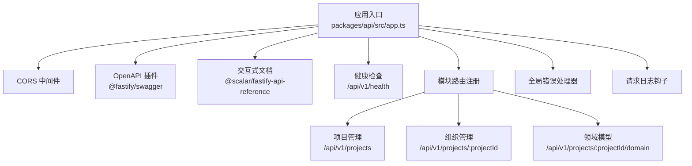
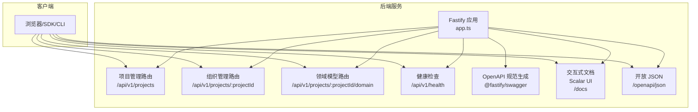
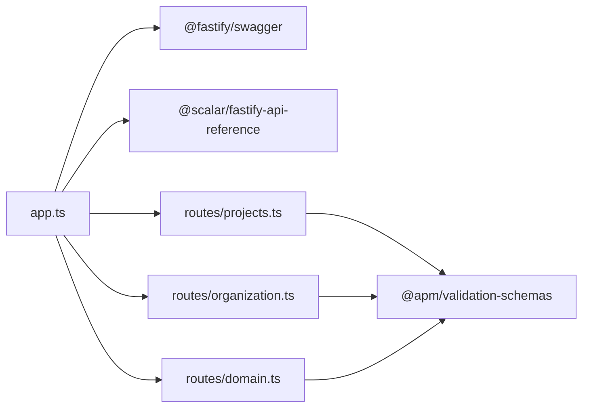

# API参考

<cite>
**本文引用的文件**
- [packages/api/src/app.ts](file://packages/api/src/app.ts)
- [packages/api/src/routes/projects.ts](file://packages/api/src/routes/projects.ts)
- [packages/api/src/routes/organization.ts](file://packages/api/src/routes/organization.ts)
- [packages/api/src/routes/domain.ts](file://packages/api/src/routes/domain.ts)
- [docs/04-tech-design/openapi-contract-design.md](file://docs/04-tech-design/openapi-contract-design.md)
- [docs/superpowers/plans/2026-05-14-openapi-contract.md](file://docs/superpowers/plans/2026-05-14-openapi-contract.md)
- [packages/api/tests/openapi/openapi-schema.test.ts](file://packages/api/tests/openapi/openapi-schema.test.ts)
</cite>

## 目录
1. [简介](#简介)
2. [项目结构](#项目结构)
3. [核心组件](#核心组件)
4. [架构总览](#架构总览)
5. [详细组件分析](#详细组件分析)
6. [依赖分析](#依赖分析)
7. [性能考虑](#性能考虑)
8. [故障排查指南](#故障排查指南)
9. [结论](#结论)
10. [附录](#附录)

## 简介
本文件为 AI 原型管理系统（APM）后端 REST API 的完整参考文档。内容涵盖：
- 所有公开 RESTful 端点的 HTTP 方法、URL 模式、请求参数与响应格式
- 基于 OpenAPI 3.0.3 的契约定义与交互式文档
- 认证授权机制与权限控制策略现状
- 错误码定义与错误处理标准
- API 使用示例与客户端集成指南
- API 版本控制策略与向后兼容性保证
- 性能优化建议与最佳实践
- Rate Limiting 与配额管理现状与建议
- API 测试工具与调试技巧

## 项目结构
后端采用 Fastify 5 + TypeScript 架构，API 路由按模块划分，统一通过 app.ts 注册并暴露 OpenAPI 文档。

图表来源
- [packages/api/src/app.ts:16-178](file://packages/api/src/app.ts#L16-L178)

章节来源
- [packages/api/src/app.ts:16-178](file://packages/api/src/app.ts#L16-L178)

## 核心组件
- 应用与插件
  - CORS、OpenAPI 生成、交互式文档、健康检查、模块路由注册、全局错误处理、请求日志钩子
- 路由模块
  - 项目管理（M1）、组织管理（M1 子模块）、领域模型（M2）
- OpenAPI 契约
  - 基于 Fastify 原生 schema 自动生成 openapi.json，并通过 Scalar UI 提供交互式文档

章节来源
- [packages/api/src/app.ts:26-178](file://packages/api/src/app.ts#L26-L178)
- [docs/04-tech-design/openapi-contract-design.md:105-154](file://docs/04-tech-design/openapi-contract-design.md#L105-L154)

## 架构总览
APM 后端通过 Fastify 注册多个模块路由，统一前缀与版本控制。OpenAPI 插件从路由 schema 自动生成规范，Scalar UI 提供交互式文档与调试能力。

图表来源
- [packages/api/src/app.ts:136-156](file://packages/api/src/app.ts#L136-L156)
- [docs/04-tech-design/openapi-contract-design.md:156-162](file://docs/04-tech-design/openapi-contract-design.md#L156-L162)

## 详细组件分析

### 健康检查
- 方法与路径
  - GET /api/v1/health
- 功能
  - 检查数据库连通性，返回服务状态与时间戳
- 响应
  - 成功：包含 status 与 timestamp
  - 失败：包含 status 与 db unreachable 信息

章节来源
- [packages/api/src/app.ts:119-130](file://packages/api/src/app.ts#L119-L130)

### 项目管理（M1）
- 前缀：/api/v1/projects
- 端点清单与契约要点
  - GET /api/v1/projects
    - 查询参数：支持搜索、状态筛选、分页、排序
    - 成功响应：分页列表（含 meta）
    - 错误：400、500
  - POST /api/v1/projects
    - 请求体：创建输入
    - 成功响应：201 + 项目详情
    - 错误：400、409、500
  - GET /api/v1/projects/:id
    - 路径参数：id
    - 成功响应：单资源详情
    - 错误：400、404、500
  - GET /api/v1/projects/:id/summary
    - 路径参数：id
    - 成功响应：项目摘要统计
    - 错误：400、404、500
  - PUT /api/v1/projects/:id?version=N
    - 路径参数：id；查询参数：version（乐观锁）
    - 请求体：更新输入
    - 成功响应：更新后的项目详情
    - 错误：400、404、409、500
  - PATCH /api/v1/projects/:id/status
    - 路径参数：id；请求体：归档/恢复输入
    - 成功响应：更新后的项目详情
    - 错误：400、404、409、500

章节来源
- [packages/api/src/routes/projects.ts:30-132](file://packages/api/src/routes/projects.ts#L30-L132)
- [docs/04-tech-design/openapi-contract-design.md:406-440](file://docs/04-tech-design/openapi-contract-design.md#L406-L440)

### 组织管理（M1 子模块）
- 前缀：/api/v1/projects/:projectId
- 单资源公司路由（无需 :projectId）：/api/v1/companies/:id
- 端点清单与契约要点
  - 公司（Company）
    - GET /companies
      - 查询参数：搜索、分页
      - 成功响应：分页列表
      - 错误：400、500
    - POST /companies
      - 请求体：创建输入
      - 成功响应：201 + 详情
      - 错误：400、409、500
    - GET /companies/:id
      - 成功响应：详情
      - 错误：400、404、500
    - PUT /companies/:id
      - 请求体：更新输入
      - 成功响应：详情
      - 错误：400、404、409、500
    - DELETE /companies/:id
      - 成功响应：删除成功标记
      - 错误：400、404、409、500
  - 部门（Department）
    - GET /companies/:companyId/departments
      - 查询参数：搜索、分页
      - 成功响应：分页列表
      - 错误：400、404、500
    - GET /companies/:companyId/departments/tree
      - 成功响应：树形结构
      - 错误：400、404、500
    - POST /companies/:companyId/departments
      - 请求体：创建输入
      - 成功响应：201 + 详情
      - 错误：400、404、409、500
    - GET /departments/:id
      - 成功响应：详情
      - 错误：400、404、500
    - PUT /departments/:id
      - 请求体：更新输入
      - 成功响应：详情
      - 错误：400、404、409、500
    - DELETE /departments/:id
      - 成功响应：删除成功标记
      - 错误：400、404、409、500
  - 角色（Role）
    - GET /roles
      - 查询参数：搜索、部门筛选、分页
      - 成功响应：分页列表
      - 错误：400、500
    - POST /roles
      - 请求体：创建输入
      - 成功响应：201 + 详情
      - 错误：400、409、500
    - GET /roles/:id
      - 成功响应：详情
      - 错误：400、404、500
    - PUT /roles/:id
      - 请求体：更新输入
      - 成功响应：详情
      - 错误：400、404、409、500
    - DELETE /roles/:id
      - 成功响应：删除成功标记
      - 错误：400、404、500
  - 外部实体（External Entity）
    - GET /external-entities
      - 查询参数：搜索、分页
      - 成功响应：分页列表
      - 错误：400、500
    - POST /external-entities
      - 请求体：创建输入
      - 成功响应：201 + 详情
      - 错误：400、409、500
    - GET /external-entities/:id
      - 成功响应：详情
      - 错误：400、404、500
    - PUT /external-entities/:id
      - 请求体：更新输入
      - 成功响应：详情
      - 错误：400、404、409、500
    - DELETE /external-entities/:id
      - 成功响应：删除成功标记
      - 错误：400、404、500

章节来源
- [packages/api/src/routes/organization.ts:46-242](file://packages/api/src/routes/organization.ts#L46-L242)
- [packages/api/src/routes/organization.ts:389-419](file://packages/api/src/routes/organization.ts#L389-L419)
- [docs/04-tech-design/openapi-contract-design.md:406-440](file://docs/04-tech-design/openapi-contract-design.md#L406-L440)

### 领域模型（M2）
- 前缀：/api/v1/projects/:projectId/domain
- 端点清单与契约要点
  - 实体（Entity）
    - GET /entities：列表（含字段/关系计数）
    - POST /entities：创建
    - GET /entities/:entityId：详情（含字段与关系）
    - PUT /entities/:entityId：更新
    - DELETE /entities/:entityId：删除（级联）
  - 字段（Field）
    - GET /entities/:entityId/fields：列表
    - POST /entities/:entityId/fields：创建
    - GET /entities/:entityId/fields/:fieldId：详情
    - PUT /entities/:entityId/fields/:fieldId：更新
    - DELETE /entities/:entityId/fields/:fieldId：删除
    - PATCH /entities/:entityId/fields/reorder：批量重排序
  - 关系（Relation）
    - GET /relations：列表（可按实体筛选）
    - POST /relations：创建
    - PUT /relations/:relationId：更新
    - DELETE /relations/:relationId：删除
    - GET /relations/graph 与 /er-graph：项目全量 ER 图
  - 领域边界（Boundary）
    - GET /boundaries：列表（含实体计数）
    - POST /boundaries：创建
    - GET /boundaries/:boundaryId：详情
    - PUT /boundaries/:boundaryId：更新
    - DELETE /boundaries/:boundaryId：删除
    - PUT /entities/:entityId/domain：更新实体领域归属

章节来源
- [packages/api/src/routes/domain.ts:38-498](file://packages/api/src/routes/domain.ts#L38-L498)

### OpenAPI 契约与交互式文档
- 生成与暴露
  - 通过 @fastify/swagger 从路由 schema 自动生成 openapi.json
  - 通过 @scalar/fastify-api-reference 提供 /docs 交互式文档
  - 暴露 /openapi/json 用于机器消费
- 规范版本与标签
  - OpenAPI 3.0.3
  - 标签：Health、Projects、Organization、Role Behavior、External Entity Behavior、Domain
- 安全方案
  - 预留 bearerAuth（JWT Bearer Token），Phase 2+ 启用

章节来源
- [packages/api/src/app.ts:26-67](file://packages/api/src/app.ts#L26-L67)
- [docs/04-tech-design/openapi-contract-design.md:105-154](file://docs/04-tech-design/openapi-contract-design.md#L105-L154)

### 错误处理与错误码
- 全局错误处理器
  - 已知业务错误（4xx）：透传 HTTP 状态码与统一错误信封
  - 未预期异常（500）：统一 INTERNAL_ERROR
- 错误响应结构
  - 包含 code、message、requestId、details（可选）
- 错误码映射（基于 schema 声明与全局处理器）
  - 400：VALIDATION_FAILED（schema 校验失败）
  - 404：NOT_FOUND（资源不存在）
  - 409：CONFLICT（唯一约束冲突/状态转换非法）
  - 500：INTERNAL_ERROR（未预期异常）

章节来源
- [packages/api/src/app.ts:73-98](file://packages/api/src/app.ts#L73-L98)
- [docs/04-tech-design/openapi-contract-design.md:222-231](file://docs/04-tech-design/openapi-contract-design.md#L222-L231)

### 认证与授权
- 当前状态
  - OpenAPI 规范已预留 securitySchemes（bearerAuth），但未在路由中启用
- 建议
  - 在路由 schema 中增加 security 定义，或在应用层引入鉴权中间件
  - 明确权限模型（RBAC）与资源粒度

章节来源
- [packages/api/src/app.ts:46-56](file://packages/api/src/app.ts#L46-L56)
- [docs/04-tech-design/openapi-contract-design.md:534-540](file://docs/04-tech-design/openapi-contract-design.md#L534-L540)

### API 版本控制与兼容性
- 版本策略
  - 采用 URL 前缀 /api/v1 控制版本
- 兼容性
  - 保持同一版本内的向后兼容；新增端点在后续版本迭代
- 迁移建议
  - 严格遵循 OpenAPI 契约，避免破坏性变更

章节来源
- [packages/api/src/app.ts:136-156](file://packages/api/src/app.ts#L136-L156)
- [docs/04-tech-design/openapi-contract-design.md:534-540](file://docs/04-tech-design/openapi-contract-design.md#L534-L540)

### API 使用示例与客户端集成
- 获取交互式文档
  - 访问 /docs 查看与调试
- 导出契约
  - 访问 /openapi/json 获取 openapi.json，用于代码生成与 CI 校验
- 客户端集成步骤
  - 使用任意 HTTP 客户端或 SDK 调用 /api/v1/* 前缀下的端点
  - 建议在客户端缓存 openapi.json 并进行本地校验

章节来源
- [packages/api/src/app.ts:66-67](file://packages/api/src/app.ts#L66-L67)
- [docs/04-tech-design/openapi-contract-design.md:156-162](file://docs/04-tech-design/openapi-contract-design.md#L156-L162)

### Rate Limiting 与配额管理
- 现状
  - 未发现内置限流或配额管理实现
- 建议
  - 在网关或应用层引入限流（如基于 IP/用户/端点维度）
  - 配合监控与告警，保障系统稳定性

章节来源
- [packages/api/src/app.ts:16-178](file://packages/api/src/app.ts#L16-L178)

### API 测试与调试
- OpenAPI 合法性测试
  - 校验 /openapi/json 可访问、符合 OpenAPI 3.0.3、覆盖端点数量、每个端点声明 response schema
- 调试技巧
  - 使用 /docs 在线调试
  - 使用 /openapi/json 生成客户端 SDK 或进行契约校验
  - 通过全局错误处理器与请求日志定位问题

章节来源
- [packages/api/tests/openapi/openapi-schema.test.ts:445-499](file://packages/api/tests/openapi/openapi-schema.test.ts#L445-L499)

## 依赖分析
- 组件耦合
  - app.ts 作为统一入口，耦合各模块路由与插件
  - 路由层依赖服务层与验证模式（TypeBox Schema）
- 外部依赖
  - @fastify/swagger、@scalar/fastify-api-reference、TypeBox
- 循环依赖
  - 未见循环依赖迹象

图表来源
- [packages/api/src/app.ts:136-156](file://packages/api/src/app.ts#L136-L156)
- [packages/api/src/routes/projects.ts:11-25](file://packages/api/src/routes/projects.ts#L11-L25)
- [packages/api/src/routes/organization.ts:11-40](file://packages/api/src/routes/organization.ts#L11-L40)
- [packages/api/src/routes/domain.ts:16-32](file://packages/api/src/routes/domain.ts#L16-L32)

## 性能考虑
- 建议
  - 使用分页与筛选减少一次性数据传输
  - 对热点端点启用缓存（如只读列表/详情）
  - 优化数据库索引与查询条件
  - 使用连接池与异步处理
  - 监控请求耗时与错误率

## 故障排查指南
- 常见问题
  - 400 参数校验失败：检查请求体/查询参数是否符合 Schema
  - 404 资源不存在：确认路径参数与项目上下文
  - 409 冲突：检查唯一约束与状态转换
  - 500 服务器内部错误：查看日志与全局错误处理器输出
- 调试步骤
  - 使用 /docs 在线调试
  - 校验 /openapi/json 是否完整
  - 查看请求日志钩子输出的耗时与状态码

章节来源
- [packages/api/src/app.ts:73-113](file://packages/api/src/app.ts#L73-L113)
- [packages/api/tests/openapi/openapi-schema.test.ts:445-499](file://packages/api/tests/openapi/openapi-schema.test.ts#L445-L499)

## 结论
APM 后端已建立完善的 OpenAPI 契约体系与交互式文档，覆盖 M1 与 M2 的主要端点。建议尽快启用认证授权与限流策略，并持续完善测试与监控，以保障 API 的稳定性与安全性。

## 附录
- 实施计划与技术设计
  - OpenAPI 完整契约体系实施计划与技术设计文档
  - 包含端点覆盖清单、Schema 设计与测试策略

章节来源
- [docs/superpowers/plans/2026-05-14-openapi-contract.md:1-14](file://docs/superpowers/plans/2026-05-14-openapi-contract.md#L1-L14)
- [docs/04-tech-design/openapi-contract-design.md:1-548](file://docs/04-tech-design/openapi-contract-design.md#L1-L548)