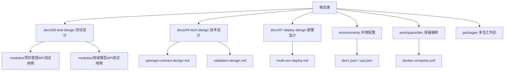
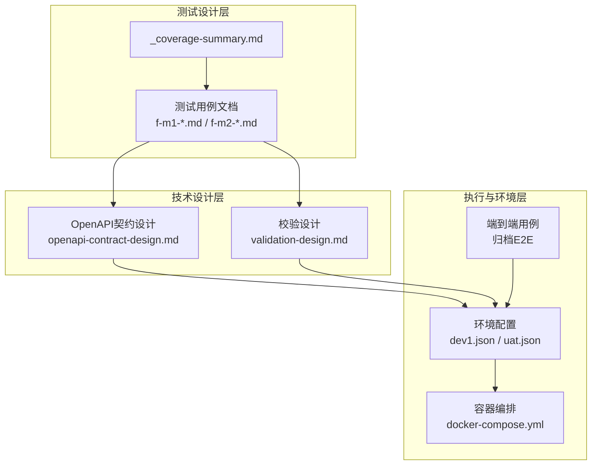
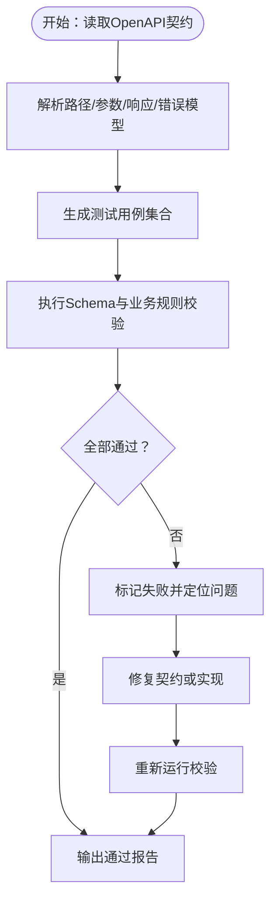
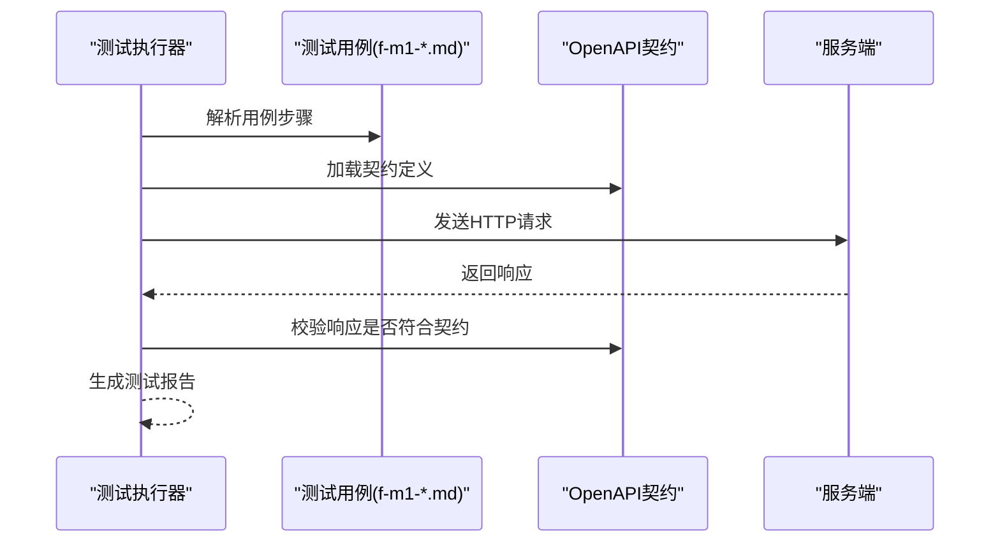
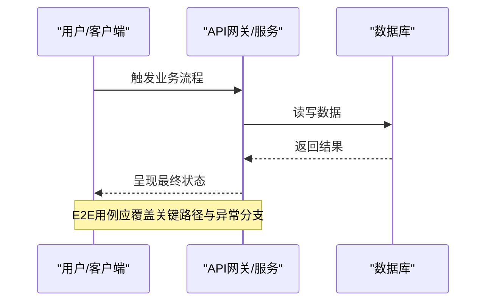
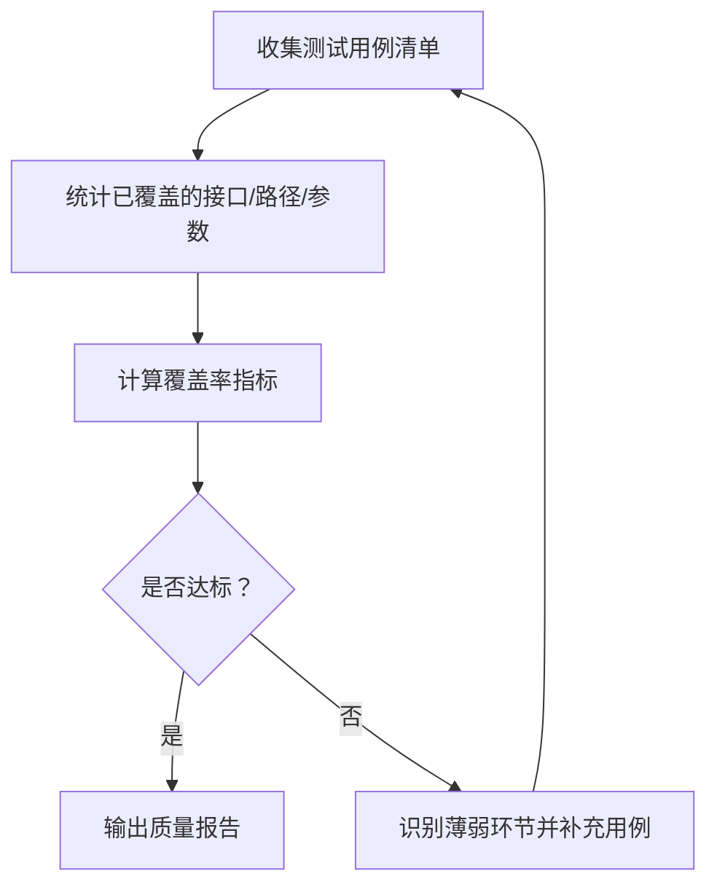
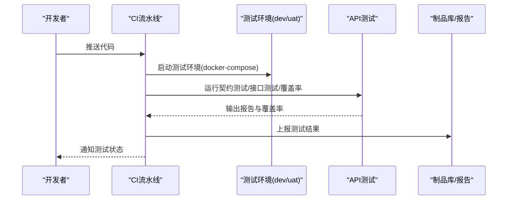
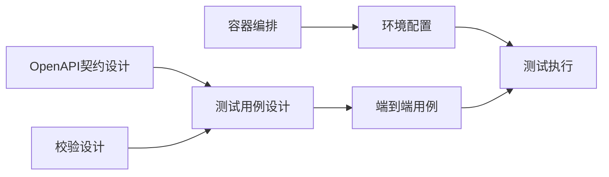

# API测试与验证

<cite>
**本文引用的文件**
- [README.md](file://README.md)
- [dev-test-loop-design.md](file://docs/00-project/workflow/dev-test-loop-design.md)
- [openapi-contract-design.md](file://docs/04-tech-design/openapi-contract-design.md)
- [validation-design.md](file://docs/04-tech-design/validation-design.md)
- [f-m2-01-api.md](file://docs/06-test-design/modules/domain-model/f-m2-01-entity/f-m2-01-api.md)
- [f-m2-02-api.md](file://docs/06-test-design/modules/domain-model/f-m2-02-field/f-m2-02-api.md)
- [f-m2-03-api.md](file://docs/06-test-design/modules/domain-model/f-m2-03-relation/f-m2-03-api.md)
- [f-m2-04-api.md](file://docs/06-test-design/modules/domain-model/f-m2-04-er-graph/f-m2-04-api.md)
- [_coverage-summary.md](file://docs/06-test-design/modules/domain-model/_coverage-summary.md)
- [f-m1-01-api.md](file://docs/06-test-design/modules/project-management/f-m1-01-project-list/f-m1-01-api.md)
- [f-m1-02-api.md](file://docs/06-test-design/modules/project-management/f-m1-02-create-project/f-m1-02-api.md)
- [f-m1-03-api.md](file://docs/06-test-design/modules/project-management/f-m1-03-project-detail/f-m1-03-api.md)
- [f-m1-04-api.md](file://docs/06-test-design/modules/project-management/f-m1-04-edit-project/f-m1-04-api.md)
- [f-m1-05-api.md](file://docs/06-test-design/modules/project-management/f-m1-05-archive/f-m1-05-api.md)
- [f-m1-06-api.md](file://docs/06-test-design/modules/project-management/f-m1-06-company/f-m1-06-api.md)
- [f-m1-07-api.md](file://docs/06-test-design/modules/project-management/f-m1-07-department/f-m1-07-api.md)
- [f-m1-08-api.md](file://docs/06-test-design/modules/project-management/f-m1-08-role/f-m1-08-api.md)
- [f-m1-09-api.md](file://docs/06-test-design/modules/project-management/f-m1-09-external-entity/f-m1-09-api.md)
- [f-m1-12-api.md](file://docs/06-test-design/modules/project-management/f-m1-12-role-behavior/f-m1-12-api.md)
- [f-m1-13-api.md](file://docs/06-test-design/modules/project-management/f-m1-13-external-entity-behavior/f-m1-13-api.md)
- [f-m1-01-api.md](file://docs/06-test-design/modules/project-management/f-m1-01-project-list/f-m1-01-api.md)
- [f-m1-02-api.md](file://docs/06-test-design/modules/project-management/f-m1-02-create-project/f-m1-02-api.md)
- [f-m1-03-api.md](file://docs/06-test-design/modules/project-management/f-m1-03-project-detail/f-m1-03-api.md)
- [f-m1-04-api.md](file://docs/06-test-design/modules/project-management/f-m1-04-edit-project/f-m1-04-api.md)
- [f-m1-05-api.md](file://docs/06-test-design/modules/project-management/f-m1-05-archive/f-m1-05-api.md)
- [f-m1-06-api.md](file://docs/06-test-design/modules/project-management/f-m1-06-company/f-m1-06-api.md)
- [f-m1-07-api.md](file://docs/06-test-design/modules/project-management/f-m1-07-department/f-m1-07-api.md)
- [f-m1-08-api.md](file://docs/06-test-design/modules/project-management/f-m1-08-role/f-m1-08-api.md)
- [f-m1-09-api.md](file://docs/06-test-design/modules/project-management/f-m1-09-external-entity/f-m1-09-api.md)
- [f-m1-10-api.md](file://docs/06-test-design/modules/project-management/f-m1-10-statistics/f-m1-10-api.md)
- [f-m1-12-api.md](file://docs/06-test-design/modules/project-management/f-m1-12-role-behavior/f-m1-12-api.md)
- [f-m1-13-api.md](file://docs/06-test-design/modules/project-management/f-m1-13-external-entity-behavior/f-m1-13-api.md)
- [2026-05-14-openapi-contract.md](file://docs/superpowers/plans/2026-05-14-openapi-contract.md)
- [phase1-infrastructure-plan.md](file://docs/07-deploy-design/phase1-infrastructure-plan.md)
- [docker-compose.yml](file://workspace/dev/docker-compose.yml)
- [dev1.json](file://environments/dev1.json)
- [uat.json](file://environments/uat.json)
- [set-env.sh](file://environments/set-env.sh)
- [restart-env.sh](file://environments/restart-env.sh)
- [multi-env-deploy.md](file://docs/07-deploy-design/multi-env-deploy.md)
- [f-m1-02-e2e.md](file://docs/99-archived/e2e-test-cases/f-m1-02-e2e.md)
- [f-m1-03-e2e.md](file://docs/99-archived/e2e-test-cases/f-m1-03-e2e.md)
- [f-m1-05-e2e.md](file://docs/99-archived/e2e-test-cases/f-m1-05-e2e.md)
- [f-m1-06-e2e.md](file://docs/99-archived/e2e-test-cases/f-m1-06-e2e.md)
- [f-m1-10-e2e.md](file://docs/99-archived/e2e-test-cases/f-m1-10-e2e.md)
</cite>

## 目录
1. [引言](#引言)
2. [项目结构](#项目结构)
3. [核心组件](#核心组件)
4. [架构总览](#架构总览)
5. [详细组件分析](#详细组件分析)
6. [依赖分析](#依赖分析)
7. [性能考虑](#性能考虑)
8. [故障排查指南](#故障排查指南)
9. [结论](#结论)
10. [附录](#附录)

## 引言
本文件面向API测试与验证，系统化梳理本项目的OpenAPI契约设计、契约测试与端到端测试策略、API覆盖率与质量评估标准、自动化测试框架与用例设计原则、性能与负载测试方案、测试数据与Mock服务管理，以及在CI/CD流水线中的集成方法。目标是帮助开发者与测试工程师建立一致的测试实践，确保API行为与契约保持一致，并在不同环境间稳定交付。

## 项目结构
项目采用多包工作区组织，测试相关文档集中在“测试设计”目录中，覆盖领域模型与项目管理两大模块；同时技术设计文档提供了OpenAPI契约与校验设计的基础；部署与环境配置文档定义了多环境与容器编排支持；归档的端到端测试用例提供了历史参考。

图示来源
- [README.md](file://README.md)
- [openapi-contract-design.md](file://docs/04-tech-design/openapi-contract-design.md)
- [validation-design.md](file://docs/04-tech-design/validation-design.md)
- [multi-env-deploy.md](file://docs/07-deploy-design/multi-env-deploy.md)
- [docker-compose.yml](file://workspace/dev/docker-compose.yml)
- [dev1.json](file://environments/dev1.json)
- [uat.json](file://environments/uat.json)

章节来源
- [README.md](file://README.md)
- [openapi-contract-design.md](file://docs/04-tech-design/openapi-contract-design.md)
- [validation-design.md](file://docs/04-tech-design/validation-design.md)
- [multi-env-deploy.md](file://docs/07-deploy-design/multi-env-deploy.md)
- [docker-compose.yml](file://workspace/dev/docker-compose.yml)
- [dev1.json](file://environments/dev1.json)
- [uat.json](file://environments/uat.json)

## 核心组件
- OpenAPI契约与校验：技术设计文档定义了契约设计与校验策略，为API测试提供权威依据。
- 测试用例体系：测试设计文档按功能模块（项目管理、领域模型）拆分，覆盖增删改查、业务规则与边界条件。
- 覆盖率汇总：测试设计目录包含覆盖率汇总文件，用于量化测试范围与质量。
- 端到端测试用例：归档目录提供部分功能的历史E2E用例，可作为回归与流程验证参考。
- 环境与容器：通过docker-compose与环境配置文件支持本地与UAT环境的API可用性验证。

章节来源
- [openapi-contract-design.md](file://docs/04-tech-design/openapi-contract-design.md)
- [validation-design.md](file://docs/04-tech-design/validation-design.md)
- [f-m1-01-api.md](file://docs/06-test-design/modules/project-management/f-m1-01-project-list/f-m1-01-api.md)
- [f-m1-02-api.md](file://docs/06-test-design/modules/project-management/f-m1-02-create-project/f-m1-02-api.md)
- [f-m1-03-api.md](file://docs/06-test-design/modules/project-management/f-m1-03-project-detail/f-m1-03-api.md)
- [f-m1-04-api.md](file://docs/06-test-design/modules/project-management/f-m1-04-edit-project/f-m1-04-api.md)
- [f-m1-05-api.md](file://docs/06-test-design/modules/project-management/f-m1-05-archive/f-m1-05-api.md)
- [f-m1-06-api.md](file://docs/06-test-design/modules/project-management/f-m1-06-company/f-m1-06-api.md)
- [f-m1-07-api.md](file://docs/06-test-design/modules/project-management/f-m1-07-department/f-m1-07-api.md)
- [f-m1-08-api.md](file://docs/06-test-design/modules/project-management/f-m1-08-role/f-m1-08-api.md)
- [f-m1-09-api.md](file://docs/06-test-design/modules/project-management/f-m1-09-external-entity/f-m1-09-api.md)
- [f-m1-12-api.md](file://docs/06-test-design/modules/project-management/f-m1-12-role-behavior/f-m1-12-api.md)
- [f-m1-13-api.md](file://docs/06-test-design/modules/project-management/f-m1-13-external-entity-behavior/f-m1-13-api.md)
- [f-m2-01-api.md](file://docs/06-test-design/modules/domain-model/f-m2-01-entity/f-m2-01-api.md)
- [f-m2-02-api.md](file://docs/06-test-design/modules/domain-model/f-m2-02-field/f-m2-02-api.md)
- [f-m2-03-api.md](file://docs/06-test-design/modules/domain-model/f-m2-03-relation/f-m2-03-api.md)
- [f-m2-04-api.md](file://docs/06-test-design/modules/domain-model/f-m2-04-er-graph/f-m2-04-api.md)
- [_coverage-summary.md](file://docs/06-test-design/modules/domain-model/_coverage-summary.md)
- [f-m1-02-e2e.md](file://docs/99-archived/e2e-test-cases/f-m1-02-e2e.md)
- [f-m1-03-e2e.md](file://docs/99-archived/e2e-test-cases/f-m1-03-e2e.md)
- [f-m1-05-e2e.md](file://docs/99-archived/e2e-test-cases/f-m1-05-e2e.md)
- [f-m1-06-e2e.md](file://docs/99-archived/e2e-test-cases/f-m1-06-e2e.md)
- [f-m1-10-e2e.md](file://docs/99-archived/e2e-test-cases/f-m1-10-e2e.md)

## 架构总览
下图展示了从测试设计到执行、再到环境与容器支撑的整体架构关系，体现契约驱动的测试闭环。

图示来源
- [openapi-contract-design.md](file://docs/04-tech-design/openapi-contract-design.md)
- [validation-design.md](file://docs/04-tech-design/validation-design.md)
- [f-m1-01-api.md](file://docs/06-test-design/modules/project-management/f-m1-01-project-list/f-m1-01-api.md)
- [f-m1-02-api.md](file://docs/06-test-design/modules/project-management/f-m1-02-create-project/f-m1-02-api.md)
- [f-m2-01-api.md](file://docs/06-test-design/modules/domain-model/f-m2-01-entity/f-m2-01-api.md)
- [f-m2-02-api.md](file://docs/06-test-design/modules/domain-model/f-m2-02-field/f-m2-02-api.md)
- [_coverage-summary.md](file://docs/06-test-design/modules/domain-model/_coverage-summary.md)
- [dev1.json](file://environments/dev1.json)
- [uat.json](file://environments/uat.json)
- [docker-compose.yml](file://workspace/dev/docker-compose.yml)
- [f-m1-02-e2e.md](file://docs/99-archived/e2e-test-cases/f-m1-02-e2e.md)

## 详细组件分析

### 组件A：OpenAPI契约与校验设计
- 契约设计要点：明确路径、参数、响应体、状态码与错误模型，确保前后端对齐。
- 校验设计要点：请求/响应的Schema校验、业务规则校验、时序一致性校验。
- 实施建议：以契约为“测试黄金标准”，所有测试用例围绕契约展开；对不满足契约的行为进行阻断式检查。

图示来源
- [openapi-contract-design.md](file://docs/04-tech-design/openapi-contract-design.md)
- [validation-design.md](file://docs/04-tech-design/validation-design.md)

章节来源
- [openapi-contract-design.md](file://docs/04-tech-design/openapi-contract-design.md)
- [validation-design.md](file://docs/04-tech-design/validation-design.md)

### 组件B：测试用例设计与执行
- 模块划分：按功能域拆分（项目管理、领域模型），每个模块包含若干API用例文档。
- 用例维度：覆盖正向场景、边界值、异常与错误码、鉴权与权限控制等。
- 执行方式：结合契约校验与HTTP调用，形成“契约驱动”的自动化测试。

图示来源
- [f-m1-01-api.md](file://docs/06-test-design/modules/project-management/f-m1-01-project-list/f-m1-01-api.md)
- [f-m1-02-api.md](file://docs/06-test-design/modules/project-management/f-m1-02-create-project/f-m1-02-api.md)
- [f-m1-03-api.md](file://docs/06-test-design/modules/project-management/f-m1-03-project-detail/f-m1-03-api.md)
- [f-m1-04-api.md](file://docs/06-test-design/modules/project-management/f-m1-04-edit-project/f-m1-04-api.md)
- [f-m1-05-api.md](file://docs/06-test-design/modules/project-management/f-m1-05-archive/f-m1-05-api.md)
- [f-m1-06-api.md](file://docs/06-test-design/modules/project-management/f-m1-06-company/f-m1-06-api.md)
- [f-m1-07-api.md](file://docs/06-test-design/modules/project-management/f-m1-07-department/f-m1-07-api.md)
- [f-m1-08-api.md](file://docs/06-test-design/modules/project-management/f-m1-08-role/f-m1-08-api.md)
- [f-m1-09-api.md](file://docs/06-test-design/modules/project-management/f-m1-09-external-entity/f-m1-09-api.md)
- [f-m1-12-api.md](file://docs/06-test-design/modules/project-management/f-m1-12-role-behavior/f-m1-12-api.md)
- [f-m1-13-api.md](file://docs/06-test-design/modules/project-management/f-m1-13-external-entity-behavior/f-m1-13-api.md)
- [f-m2-01-api.md](file://docs/06-test-design/modules/domain-model/f-m2-01-entity/f-m2-01-api.md)
- [f-m2-02-api.md](file://docs/06-test-design/modules/domain-model/f-m2-02-field/f-m2-02-api.md)
- [f-m2-03-api.md](file://docs/06-test-design/modules/domain-model/f-m2-03-relation/f-m2-03-api.md)
- [f-m2-04-api.md](file://docs/06-test-design/modules/domain-model/f-m2-04-er-graph/f-m2-04-api.md)

章节来源
- [f-m1-01-api.md](file://docs/06-test-design/modules/project-management/f-m1-01-project-list/f-m1-01-api.md)
- [f-m1-02-api.md](file://docs/06-test-design/modules/project-management/f-m1-02-create-project/f-m1-02-api.md)
- [f-m1-03-api.md](file://docs/06-test-design/modules/project-management/f-m1-03-project-detail/f-m1-03-api.md)
- [f-m1-04-api.md](file://docs/06-test-design/modules/project-management/f-m1-04-edit-project/f-m1-04-api.md)
- [f-m1-05-api.md](file://docs/06-test-design/modules/project-management/f-m1-05-archive/f-m1-05-api.md)
- [f-m1-06-api.md](file://docs/06-test-design/modules/project-management/f-m1-06-company/f-m1-06-api.md)
- [f-m1-07-api.md](file://docs/06-test-design/modules/project-management/f-m1-07-department/f-m1-07-api.md)
- [f-m1-08-api.md](file://docs/06-test-design/modules/project-management/f-m1-08-role/f-m1-08-api.md)
- [f-m1-09-api.md](file://docs/06-test-design/modules/project-management/f-m1-09-external-entity/f-m1-09-api.md)
- [f-m1-12-api.md](file://docs/06-test-design/modules/project-management/f-m1-12-role-behavior/f-m1-12-api.md)
- [f-m1-13-api.md](file://docs/06-test-design/modules/project-management/f-m1-13-external-entity-behavior/f-m1-13-api.md)
- [f-m2-01-api.md](file://docs/06-test-design/modules/domain-model/f-m2-01-entity/f-m2-01-api.md)
- [f-m2-02-api.md](file://docs/06-test-design/modules/domain-model/f-m2-02-field/f-m2-02-api.md)
- [f-m2-03-api.md](file://docs/06-test-design/modules/domain-model/f-m2-03-relation/f-m2-03-api.md)
- [f-m2-04-api.md](file://docs/06-test-design/modules/domain-model/f-m2-04-er-graph/f-m2-04-api.md)

### 组件C：端到端测试实施
- 用例来源：归档的E2E用例文档，覆盖典型业务流程。
- 实施建议：基于用例步骤串联多个API调用，模拟真实用户路径；结合契约校验与业务结果断言。

图示来源
- [f-m1-02-e2e.md](file://docs/99-archived/e2e-test-cases/f-m1-02-e2e.md)
- [f-m1-03-e2e.md](file://docs/99-archived/e2e-test-cases/f-m1-03-e2e.md)
- [f-m1-05-e2e.md](file://docs/99-archived/e2e-test-cases/f-m1-05-e2e.md)
- [f-m1-06-e2e.md](file://docs/99-archived/e2e-test-cases/f-m1-06-e2e.md)
- [f-m1-10-e2e.md](file://docs/99-archived/e2e-test-cases/f-m1-10-e2e.md)

章节来源
- [f-m1-02-e2e.md](file://docs/99-archived/e2e-test-cases/f-m1-02-e2e.md)
- [f-m1-03-e2e.md](file://docs/99-archived/e2e-test-cases/f-m1-03-e2e.md)
- [f-m1-05-e2e.md](file://docs/99-archived/e2e-test-cases/f-m1-05-e2e.md)
- [f-m1-06-e2e.md](file://docs/99-archived/e2e-test-cases/f-m1-06-e2e.md)
- [f-m1-10-e2e.md](file://docs/99-archived/e2e-test-cases/f-m1-10-e2e.md)

### 组件D：API覆盖率与质量评估
- 覆盖率汇总：通过模块级覆盖率汇总文件量化测试覆盖面。
- 评估指标：接口覆盖率、路径覆盖率、参数覆盖率、错误场景覆盖率、分支覆盖率。
- 改进策略：针对低覆盖率区域补充用例；对重复与冗余用例进行合并优化。

图示来源
- [_coverage-summary.md](file://docs/06-test-design/modules/domain-model/_coverage-summary.md)

章节来源
- [_coverage-summary.md](file://docs/06-test-design/modules/domain-model/_coverage-summary.md)

### 组件E：测试数据管理与Mock服务
- 测试数据：建议建立受控的种子数据集，确保可重复性与隔离性。
- Mock策略：对第三方依赖与外部系统使用Mock；对内部服务使用轻量级Mock或内存数据库。
- 数据清理：在用例前后进行数据清理，避免交叉污染。

章节来源
- [openapi-contract-design.md](file://docs/04-tech-design/openapi-contract-design.md)
- [validation-design.md](file://docs/04-tech-design/validation-design.md)

### 组件F：CI/CD流水线中的API测试集成
- 流水线阶段：在构建后、单元测试后、集成测试后、预发布前分别执行不同粒度的API测试。
- 环境准备：通过环境配置与容器编排在流水线中快速拉起测试环境。
- 结果上报：将测试报告与覆盖率指标上传至制品库或质量平台。

图示来源
- [multi-env-deploy.md](file://docs/07-deploy-design/multi-env-deploy.md)
- [docker-compose.yml](file://workspace/dev/docker-compose.yml)
- [dev1.json](file://environments/dev1.json)
- [uat.json](file://environments/uat.json)

章节来源
- [multi-env-deploy.md](file://docs/07-deploy-design/multi-env-deploy.md)
- [docker-compose.yml](file://workspace/dev/docker-compose.yml)
- [dev1.json](file://environments/dev1.json)
- [uat.json](file://environments/uat.json)

## 依赖分析
- 测试设计依赖技术设计：测试用例必须与OpenAPI契约与校验设计保持一致。
- 环境与容器依赖：测试执行需要稳定的开发/UAT环境与容器编排。
- 端到端依赖契约：E2E用例应以契约为准绳，保证跨模块交互正确性。

图示来源
- [openapi-contract-design.md](file://docs/04-tech-design/openapi-contract-design.md)
- [validation-design.md](file://docs/04-tech-design/validation-design.md)
- [f-m1-01-api.md](file://docs/06-test-design/modules/project-management/f-m1-01-project-list/f-m1-01-api.md)
- [f-m1-02-e2e.md](file://docs/99-archived/e2e-test-cases/f-m1-02-e2e.md)
- [dev1.json](file://environments/dev1.json)
- [docker-compose.yml](file://workspace/dev/docker-compose.yml)

章节来源
- [openapi-contract-design.md](file://docs/04-tech-design/openapi-contract-design.md)
- [validation-design.md](file://docs/04-tech-design/validation-design.md)
- [f-m1-01-api.md](file://docs/06-test-design/modules/project-management/f-m1-01-project-list/f-m1-01-api.md)
- [f-m1-02-e2e.md](file://docs/99-archived/e2e-test-cases/f-m1-02-e2e.md)
- [dev1.json](file://environments/dev1.json)
- [docker-compose.yml](file://workspace/dev/docker-compose.yml)

## 性能考虑
- 契约约束性能：通过明确的响应大小、分页策略与超时设置减少不必要的开销。
- 并发与限流：在测试中模拟并发访问，观察服务端限流与降级策略。
- 资源隔离：使用独立的测试环境与容器资源，避免相互干扰。
- 回归性能基线：建立性能基线，持续监控回归。

## 故障排查指南
- 契约不一致：当测试失败指向响应不符合契约时，优先检查契约定义与实现是否一致。
- 环境问题：若测试在本地通过但在环境失败，检查环境变量、网络连通与容器健康状态。
- 数据污染：确认用例间的数据隔离与清理逻辑，避免共享状态导致的误判。
- E2E中断：对长流程用例进行分段调试，定位首个失败步骤并回溯上下文。

章节来源
- [openapi-contract-design.md](file://docs/04-tech-design/openapi-contract-design.md)
- [validation-design.md](file://docs/04-tech-design/validation-design.md)
- [dev1.json](file://environments/dev1.json)
- [docker-compose.yml](file://workspace/dev/docker-compose.yml)

## 结论
通过以OpenAPI契约为核心、以测试用例为载体、以覆盖率与质量评估为标尺、以环境与容器为支撑、以CI/CD为保障的测试体系，可以有效提升API的稳定性、一致性与可维护性。建议持续完善用例矩阵、强化E2E覆盖与性能回归，并在团队内推广契约驱动的测试文化。

## 附录
- 开放式建议：引入契约测试工具链（如基于OpenAPI的断言库）、建立Mock服务治理与测试数据生命周期管理、在CI中增加性能与安全扫描节点。