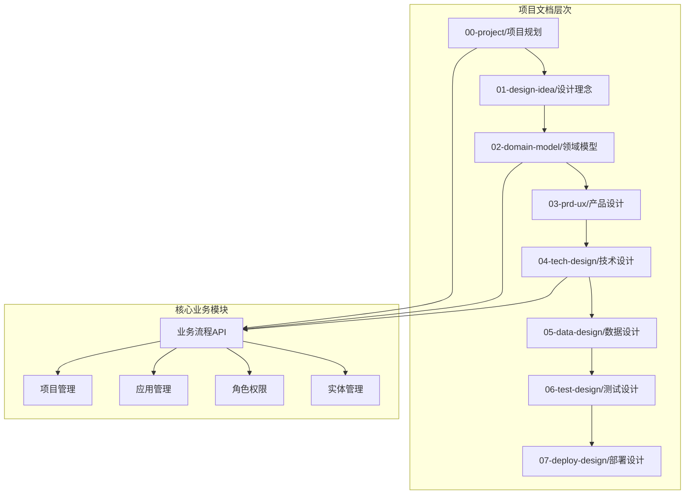
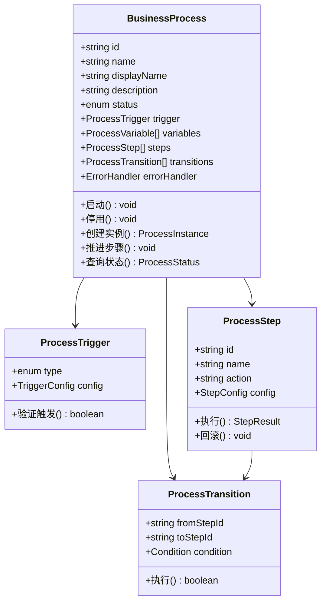
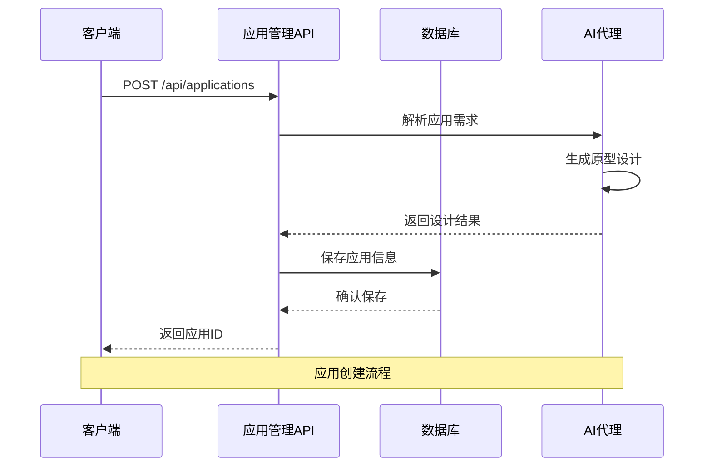
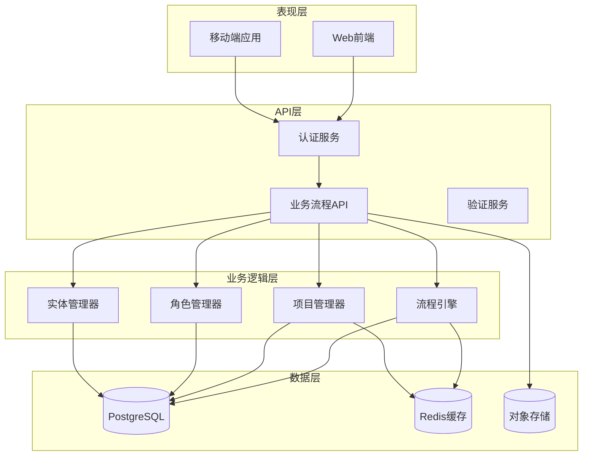
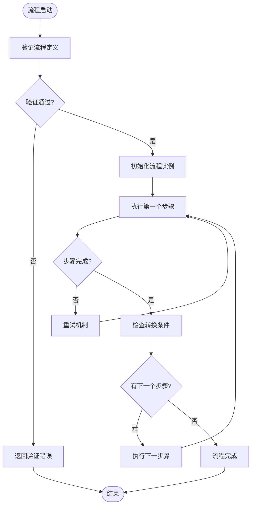
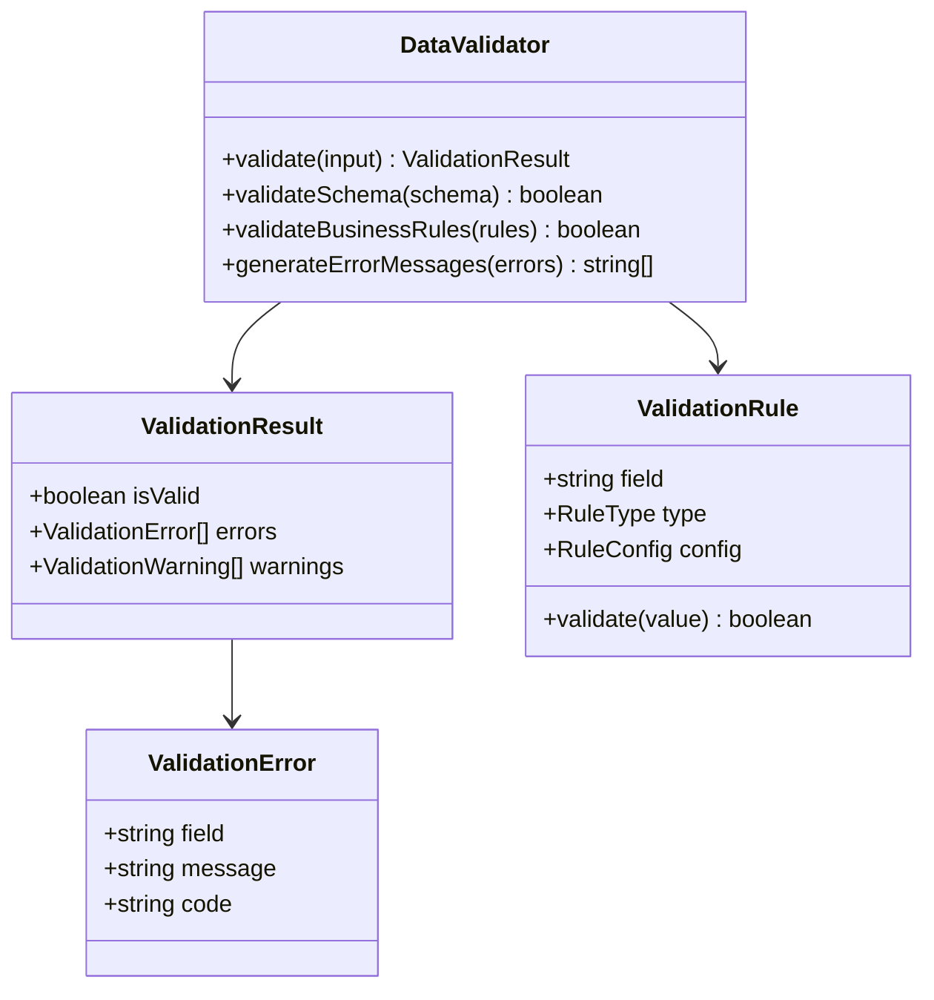
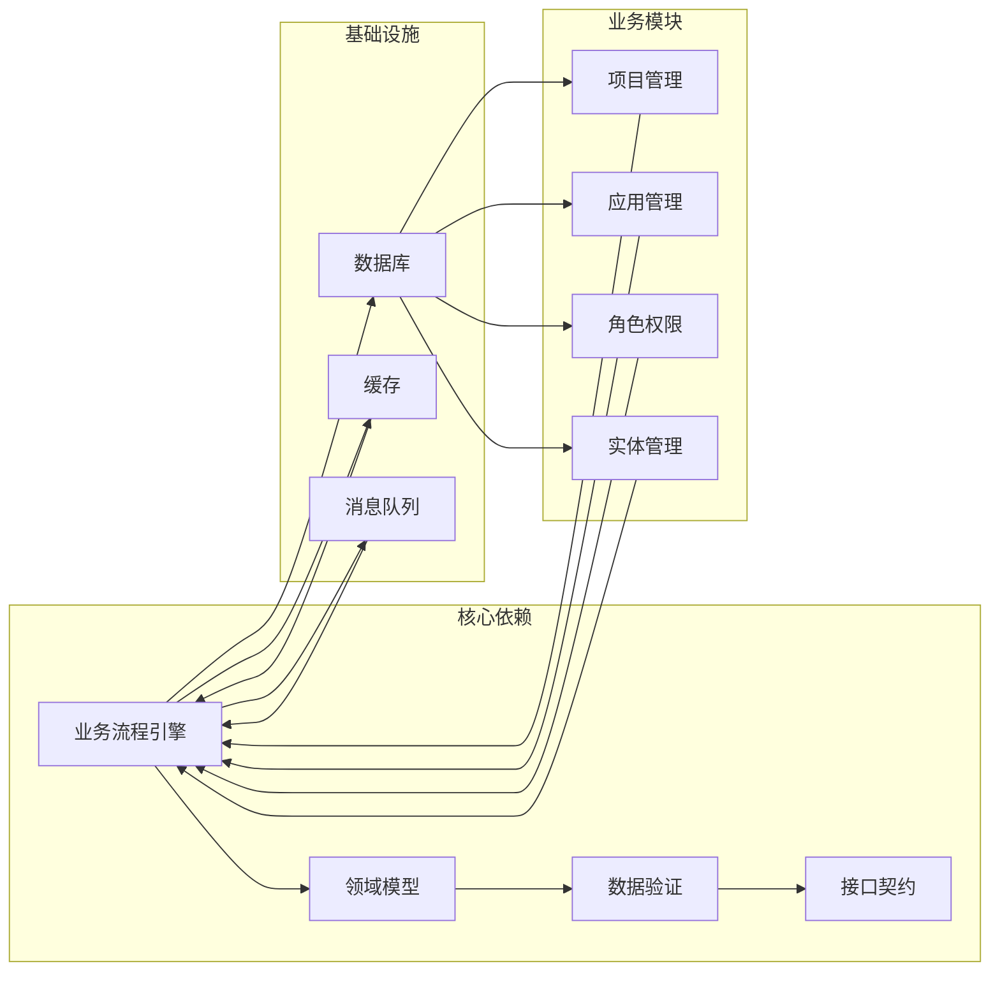

# 业务流程API

<cite>
**本文档引用的文件**
- [business-process.md](file://docs/02-domain-model/business-process.md)
- [domain-model.md](file://docs/02-domain-model/domain-model.md)
- [m3-business-process-tech-design.md](file://docs/04-tech-design/modules/business-process/m3-business-process-tech-design.md)
- [workflow.md](file://docs/01-design-idea/workflow.md)
- [f-m1-02-api.md](file://docs/06-test-design/modules/project-management/f-m1-02-create-project/f-m1-02-api.md)
- [f-m1-03-api.md](file://docs/06-test-design/modules/project-management/f-m1-03-project-detail/f-m1-03-api.md)
- [f-m1-04-api.md](file://docs/06-test-design/modules/project-management/f-m1-04-edit-project/f-m1-04-api.md)
- [f-m1-05-api.md](file://docs/06-test-design/modules/project-management/f-m1-05-archive/f-m1-05-api.md)
- [f-m1-06-api.md](file://docs/06-test-design/modules/project-management/f-m1-06-company/f-m1-06-api.md)
- [f-m1-07-api.md](file://docs/06-test-design/modules/project-management/f-m1-07-department/f-m1-07-api.md)
- [f-m1-08-api.md](file://docs/06-test-design/modules/project-management/f-m1-08-role/f-m1-08-api.md)
- [f-m1-12-api.md](file://docs/06-test-design/modules/project-management/f-m1-12-role-behavior/f-m1-12-api.md)
- [f-m1-13-api.md](file://docs/06-test-design/modules/project-management/f-m1-13-external-entity-behavior/f-m1-13-api.md)
- [openapi-contract-design.md](file://docs/04-tech-design/openapi-contract-design.md)
- [phase1-design-tech.md](file://docs/04-tech-design/phase1-design-tech.md)
- [phase1-infrastructure-plan.md](file://docs/04-tech-design/phase1-infrastructure-plan.md)
- [validation-design.md](file://docs/04-tech-design/validation-design.md)
- [mcp-interface.md](file://docs/04-tech-design/mcp-interface.md)
- [object-lifecycle.md](file://docs/04-tech-design/object-lifecycle.md)
- [project-context-navigation-design.md](file://docs/04-tech-design/project-context-navigation-design.md)
- [role-behavior-design.md](file://docs/04-tech-design/role-behavior-design.md)
- [design-language.md](file://docs/04-tech-design/design-language.md)
- [domain-model-tech-design.md](file://docs/04-tech-design/domain-model-tech-design.md)
- [phase1-database-schema.md](file://docs/05-data-design/phase1-database-schema.md)
- [multi-env-deploy.md](file://docs/07-deploy-design/multi-env-deploy.md)
</cite>

## 目录
1. [引言](#引言)
2. [项目结构](#项目结构)
3. [核心组件](#核心组件)
4. [架构概览](#架构概览)
5. [详细组件分析](#详细组件分析)
6. [依赖分析](#依赖分析)
7. [性能考虑](#性能考虑)
8. [故障排除指南](#故障排除指南)
9. [结论](#结论)

## 引言

AI原型管理系统是一个基于业务流程驱动的原型设计平台，旨在通过AI与产品经理的协作，实现从概念到原型的完整工作流程。该系统采用模块化设计，支持从粗粒度的系统级原型到细粒度的组件级原型的全生命周期管理。

系统的核心价值在于提供了一个完整的业务流程API体系，使得AI代理能够理解并执行复杂的业务逻辑，同时保持与人类产品经理的高效协作。

## 项目结构

该项目采用多层级文档组织结构，围绕业务流程API的设计和实现：

**图表来源**
- [business-process.md:1-50](file://docs/02-domain-model/business-process.md#L1-L50)
- [domain-model.md:1-100](file://docs/02-domain-model/domain-model.md#L1-L100)

**章节来源**
- [business-process.md:1-150](file://docs/02-domain-model/business-process.md#L1-L150)
- [domain-model.md:1-200](file://docs/02-domain-model/domain-model.md#L1-L200)

## 核心组件

### 业务流程引擎

业务流程引擎是整个系统的核心组件，负责管理和执行各种业务流程。其主要特性包括：

- **流程定义**：支持复杂的工作流定义，包括步骤、转换和条件判断
- **状态管理**：提供完整的流程状态跟踪和监控能力
- **错误处理**：内置全局异常处理机制，确保流程的健壮性
- **版本控制**：支持流程的版本管理和回滚功能

**图表来源**
- [business-process.md:349-369](file://docs/02-domain-model/business-process.md#L349-L369)

### 项目管理API

项目管理模块提供了完整的项目生命周期管理功能，包括创建、编辑、归档等操作：

| 功能点 | 描述 | API路径 | 方法 |
|--------|------|---------|------|
| 创建项目 | 新建项目并初始化流程 | `/api/projects` | POST |
| 项目详情 | 获取项目详细信息 | `/api/projects/{id}` | GET |
| 编辑项目 | 更新项目信息 | `/api/projects/{id}` | PUT |
| 归档项目 | 项目状态变更 | `/api/projects/{id}/archive` | POST |
| 公司关联 | 项目与公司关联 | `/api/projects/{id}/company` | POST |
| 部门关联 | 项目与部门关联 | `/api/projects/{id}/department` | POST |
| 角色管理 | 项目角色配置 | `/api/projects/{id}/roles` | GET/POST |

**章节来源**
- [f-m1-02-api.md:1-100](file://docs/06-test-design/modules/project-management/f-m1-02-create-project/f-m1-02-api.md#L1-L100)
- [f-m1-03-api.md:1-100](file://docs/06-test-design/modules/project-management/f-m1-03-project-detail/f-m1-03-api.md#L1-L100)
- [f-m1-04-api.md:1-100](file://docs/06-test-design/modules/project-management/f-m1-04-edit-project/f-m1-04-api.md#L1-L100)
- [f-m1-05-api.md:1-100](file://docs/06-test-design/modules/project-management/f-m1-05-archive/f-m1-05-api.md#L1-L100)
- [f-m1-06-api.md:1-100](file://docs/06-test-design/modules/project-management/f-m1-06-company/f-m1-06-api.md#L1-L100)
- [f-m1-07-api.md:1-100](file://docs/06-test-design/modules/project-management/f-m1-07-department/f-m1-07-api.md#L1-L100)
- [f-m1-08-api.md:1-100](file://docs/06-test-design/modules/project-management/f-m1-08-role/f-m1-08-api.md#L1-L100)

### 应用管理API

应用管理模块负责原型应用的全生命周期管理：

**图表来源**
- [business-process.md:1-150](file://docs/02-domain-model/business-process.md#L1-L150)

### 角色权限API

角色权限系统提供了细粒度的访问控制机制：

| 角色类型 | 权限范围 | 行为限制 |
|----------|----------|----------|
| 项目经理 | 项目读写 | 创建、编辑、删除项目 |
| 开发者 | 项目读写 | 执行流程步骤、修改原型 |
| 审计员 | 只读访问 | 查看项目状态、审计日志 |
| 系统管理员 | 全部权限 | 用户管理、系统配置 |

**章节来源**
- [f-m1-12-api.md:1-100](file://docs/06-test-design/modules/project-management/f-m1-12-role-behavior/f-m1-12-api.md#L1-L100)
- [f-m1-13-api.md:1-100](file://docs/06-test-design/modules/project-management/f-m1-13-external-entity-behavior/f-m1-13-api.md#L1-L100)

## 架构概览

系统采用分层架构设计，确保业务流程API的可扩展性和可维护性：

**图表来源**
- [phase1-infrastructure-plan.md:1-150](file://docs/04-tech-design/phase1-infrastructure-plan.md#L1-L150)
- [multi-env-deploy.md:1-100](file://docs/07-deploy-design/multi-env-deploy.md#L1-L100)

## 详细组件分析

### 流程引擎组件

流程引擎是业务流程API的核心执行组件，负责协调各个业务流程的执行：

**图表来源**
- [m3-business-process-tech-design.md:1-200](file://docs/04-tech-design/modules/business-process/m3-business-process-tech-design.md#L1-L200)

### 数据验证组件

数据验证组件确保所有API请求的数据质量和一致性：

**图表来源**
- [validation-design.md:1-150](file://docs/04-tech-design/validation-design.md#L1-L150)

### 接口契约设计

系统采用OpenAPI规范定义API契约，确保前后端的一致性：

| 组件 | 规范版本 | 主要特性 |
|------|----------|----------|
| 业务流程API | OpenAPI 3.0 | 完整的流程定义和执行接口 |
| 项目管理API | OpenAPI 3.0 | 项目生命周期管理接口 |
| 认证授权API | OAuth 2.0 | 安全的身份验证和授权机制 |
| 数据验证API | JSON Schema | 结构化的数据验证规则 |

**章节来源**
- [openapi-contract-design.md:1-200](file://docs/04-tech-design/openapi-contract-design.md#L1-L200)

## 依赖分析

系统各组件之间的依赖关系呈现清晰的层次结构：

**图表来源**
- [domain-model-tech-design.md:1-150](file://docs/04-tech-design/domain-model-tech-design.md#L1-L150)
- [phase1-database-schema.md:1-200](file://docs/05-data-design/phase1-database-schema.md#L1-L200)

**章节来源**
- [mcp-interface.md:1-150](file://docs/04-tech-design/mcp-interface.md#L1-L150)
- [object-lifecycle.md:1-150](file://docs/04-tech-design/object-lifecycle.md#L1-L150)

## 性能考虑

系统在设计时充分考虑了性能优化：

### 缓存策略
- **流程状态缓存**：使用Redis缓存活跃的流程实例状态
- **配置缓存**：缓存常用的业务配置和规则
- **用户会话缓存**：减少重复的认证检查

### 数据库优化
- **索引优化**：为常用查询字段建立复合索引
- **连接池管理**：合理配置数据库连接池大小
- **查询优化**：避免N+1查询问题

### API性能
- **批量操作**：支持批量创建和更新操作
- **分页查询**：大数据量场景下的分页处理
- **异步处理**：耗时操作异步化处理

## 故障排除指南

### 常见问题及解决方案

| 问题类型 | 症状 | 可能原因 | 解决方案 |
|----------|------|----------|----------|
| 流程执行失败 | 步骤无法推进 | 触发条件未满足 | 检查流程定义和条件配置 |
| 数据验证错误 | API返回400错误 | 输入数据格式不正确 | 使用OpenAPI规范校验数据 |
| 权限拒绝 | API返回403错误 | 用户权限不足 | 检查角色配置和权限映射 |
| 性能问题 | 响应时间过长 | 数据库查询慢 | 优化索引和查询语句 |

### 调试工具和方法

- **日志分析**：使用结构化日志追踪业务流程执行
- **性能监控**：监控关键指标如响应时间、吞吐量
- **错误追踪**：集成错误追踪系统定位问题根源

**章节来源**
- [validation-design.md:150-300](file://docs/04-tech-design/validation-design.md#L150-L300)

## 结论

AI原型管理系统的业务流程API设计体现了现代软件工程的最佳实践。通过模块化的设计、清晰的层次结构和完善的验证机制，系统能够有效支持从概念到原型的完整工作流程。

该API体系的主要优势包括：

1. **可扩展性**：模块化设计允许独立扩展各个业务功能
2. **可维护性**：清晰的架构层次便于长期维护
3. **可靠性**：完善的错误处理和监控机制
4. **安全性**：细粒度的权限控制和数据验证

未来的发展方向包括进一步优化性能、增强AI协作能力和完善监控告警体系。