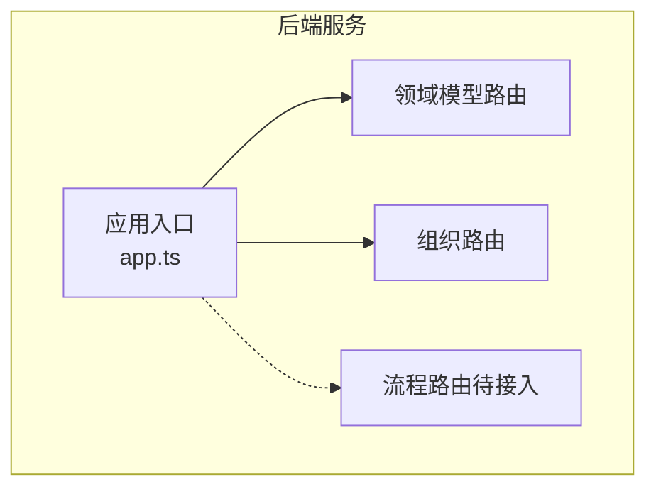
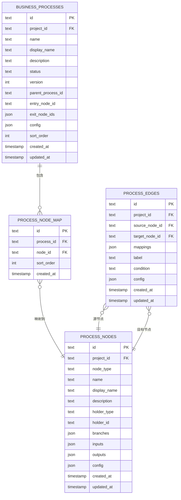
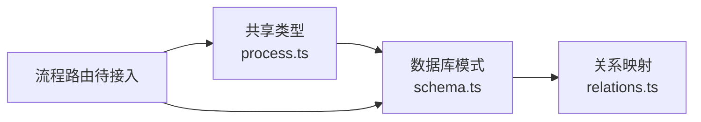

# 业务流程API

<cite>
**本文引用的文件**
- [phase1-design-tech.md](file://docs/04-tech-design/phase1-design-tech.md)
- [process.ts](file://packages/shared/src/types/process.ts)
- [schema.ts](file://packages/api/src/models/schema.ts)
- [relations.ts](file://packages/api/src/models/relations.ts)
- [app.ts](file://packages/api/src/app.ts)
- [mcp-interface.md](file://docs/04-tech-design/mcp-interface.md)
</cite>

## 目录
1. [简介](#简介)
2. [项目结构](#项目结构)
3. [核心组件](#核心组件)
4. [架构总览](#架构总览)
5. [详细组件分析](#详细组件分析)
6. [依赖分析](#依赖分析)
7. [性能考虑](#性能考虑)
8. [故障排查指南](#故障排查指南)
9. [结论](#结论)
10. [附录](#附录)

## 简介
本文件为业务流程管理API的完整接口文档，覆盖流程定义、节点管理、边关系配置、状态转换、流程图绘制与验证、执行监控与状态追踪、流程模板与复用机制以及流程优化与性能分析等能力。文档基于技术设计稿中的端点清单与共享类型定义，并结合后端数据库模式与关系映射进行系统化说明。

## 项目结构
业务流程API位于后端服务的路由层，采用Fastify插件式注册方式挂载于统一前缀下。当前阶段已注册项目管理、领域模型、组织管理、应用管理与角色行为管理等模块；业务流程模块预留注册位置，后续将按计划接入。

图表来源
- [app.ts:137-154](file://packages/api/src/app.ts#L137-L154)

章节来源
- [app.ts:137-154](file://packages/api/src/app.ts#L137-L154)

## 核心组件
- 业务流程（BusinessProcess）：流程实体，包含标识、归属项目、名称、显示名、描述、状态、版本、父子流程关系、入口节点、出口节点集合、配置、排序与时间戳。
- 流程节点（ProcessNode）：节点实体，包含标识、归属项目、节点类型（动作/决策）、持有者类型（角色/外部实体/服务）、持有者标识、分支配置（名称、条件、输出）、输入输出元数据、通用配置与时间戳。
- 流程边（ProcessEdge）：边实体，包含标识、归属项目、源节点、目标节点、映射信息、标签、条件、通用配置与时间戳。
- 节点映射（ProcessNodeMap）：流程与节点的多对多映射，记录排序字段。

章节来源
- [process.ts:5-62](file://packages/shared/src/types/process.ts#L5-L62)

## 架构总览
业务流程API围绕“流程-节点-边-映射”四类核心实体构建，遵循REST风格的资源化设计。技术设计稿中明确了端点清单与职责边界，当前后端尚未完全实现流程路由注册，但数据库模式与类型定义已完备，便于后续快速落地。

图表来源
- [schema.ts:135-180](file://packages/api/src/models/schema.ts#L135-L180)
- [schema.ts:181-220](file://packages/api/src/models/schema.ts#L181-L220)
- [schema.ts:221-260](file://packages/api/src/models/schema.ts#L221-L260)
- [schema.ts:261-300](file://packages/api/src/models/schema.ts#L261-L300)

## 详细组件分析

### 流程管理API
- 列表查询：获取项目下的流程列表
- 创建流程：创建新流程并返回流程标识
- 流程详情：返回流程及其节点、边、子流程引用
- 更新流程：更新流程属性
- 删除流程：删除流程并清理关联
- 批量添加节点：将多个节点批量加入流程
- 添加子流程引用：为流程添加子流程引用

章节来源
- [phase1-design-tech.md:251-262](file://docs/04-tech-design/phase1-design-tech.md#L251-L262)

### 节点管理API
- 节点池列表：全局节点池的节点列表
- 创建节点：创建节点（支持动作/决策两类）
- 节点详情：节点完整信息
- 更新节点：更新节点属性
- 删除节点：删除节点并清理关联边与流程映射
- 节点使用情况：查询节点被哪些流程引用

章节来源
- [phase1-design-tech.md:263-272](file://docs/04-tech-design/phase1-design-tech.md#L263-L272)

### 边关系API
- 边池列表：全局边池的边列表
- 创建边：创建边
- 更新边：更新边属性
- 删除边：删除边
- 节点关联边查询：查询某节点的入边与出边

章节来源
- [phase1-design-tech.md:274-282](file://docs/04-tech-design/phase1-design-tech.md#L274-L282)

### 流程-节点关联API
- 流程节点列表：返回流程内节点及排序
- 更新流程-节点关联：重设整个节点集与排序
- 移除节点：从流程中移除指定节点
- 设置入口节点：设置流程入口节点

章节来源
- [phase1-design-tech.md:284-291](file://docs/04-tech-design/phase1-design-tech.md#L284-L291)

### 流程类型与行为配置
- 流程状态：草稿、激活、已弃用
- 节点类型：动作、决策
- 持有者类型：角色、外部实体、服务
- 分支配置：名称、条件、输出
- 通用配置：通过JSON字段承载扩展配置

章节来源
- [process.ts:5-62](file://packages/shared/src/types/process.ts#L5-L62)

### 流程生命周期与MCP接口
- 创建流程：传入名称、显示名、描述、触发器等
- 获取流程：返回包含节点、边、子流程标识
- 更新流程：传入属性子集
- 删除流程：清理引用
- 设置父子流程：建立或解除父子关系

章节来源
- [mcp-interface.md:129-151](file://docs/04-tech-design/mcp-interface.md#L129-L151)

### 数据模型与关系映射
- 业务流程表：存储流程元数据与父子关系
- 流程节点表：存储节点元数据与持有者信息
- 流程边表：存储边元数据与条件
- 节点映射表：记录流程-节点映射与排序

章节来源
- [schema.ts:135-300](file://packages/api/src/models/schema.ts#L135-L300)
- [relations.ts:88-101](file://packages/api/src/models/relations.ts#L88-L101)
- [relations.ts:42-55](file://packages/api/src/models/relations.ts#L42-L55)
- [relations.ts:48-53](file://packages/api/src/models/relations.ts#L48-L53)
- [relations.ts:53-55](file://packages/api/src/models/relations.ts#L53-L55)

## 依赖分析
- 路由注册：业务流程路由预留于应用入口，当前尚未注册
- 类型定义：前端共享类型定义提供强类型约束
- 数据模型：数据库模式与关系映射定义了实体间外键与一对多/多对多关系
- 端点清单：技术设计稿提供了完整的REST端点清单

图表来源
- [process.ts:5-62](file://packages/shared/src/types/process.ts#L5-L62)
- [schema.ts:135-300](file://packages/api/src/models/schema.ts#L135-L300)
- [relations.ts:42-55](file://packages/api/src/models/relations.ts#L42-L55)
- [relations.ts:88-101](file://packages/api/src/models/relations.ts#L88-L101)

章节来源
- [process.ts:5-62](file://packages/shared/src/types/process.ts#L5-L62)
- [schema.ts:135-300](file://packages/api/src/models/schema.ts#L135-L300)
- [relations.ts:42-55](file://packages/api/src/models/relations.ts#L42-L55)
- [relations.ts:88-101](file://packages/api/src/models/relations.ts#L88-L101)

## 性能考虑
- 批量操作：提供批量添加节点至流程的端点，减少多次往返开销
- 关联查询：节点使用情况查询可帮助避免重复创建相同节点
- 排序控制：通过节点映射表维护流程内节点顺序，降低前端排序成本
- 索引建议：建议在流程-节点映射表的process_id与sort_order上建立复合索引以提升排序查询性能
- 缓存策略：对流程详情与节点池列表可采用读缓存，写操作后失效对应缓存

## 故障排查指南
- 端点未注册：若访问流程相关端点返回404，请确认流程路由已在应用入口完成注册
- 数据不一致：删除节点后需检查是否同步清理边与流程映射；可通过节点使用情况接口核验
- 条件与分支：边与节点的条件字段为空时可能导致状态转换异常，需在创建/更新时校验
- 子流程引用：设置父子流程时注意循环引用风险，应在业务层进行环路检测

章节来源
- [phase1-design-tech.md:251-291](file://docs/04-tech-design/phase1-design-tech.md#L251-L291)

## 结论
业务流程API具备清晰的资源化设计与完备的数据模型支撑，当前已具备端点清单与类型定义，数据库模式与关系映射亦已就绪。建议尽快完成流程路由的注册与实现，优先保证流程CRUD、节点管理与边关系的基础能力，再逐步完善流程图绘制、验证、执行监控与性能分析等高级功能。

## 附录

### 端点一览（按模块）
- 业务流程·流程（7个）
  - GET /api/v1/projects/:projectId/processes
  - POST /api/v1/projects/:projectId/processes
  - GET /api/v1/projects/:projectId/processes/:processId
  - PUT /api/v1/projects/:projectId/processes/:processId
  - DELETE /api/v1/projects/:projectId/processes/:processId
  - POST /api/v1/projects/:projectId/processes/:processId/nodes/batch
  - POST /api/v1/projects/:projectId/processes/:processId/sub-processes

- 业务流程·节点（6个）
  - GET /api/v1/projects/:projectId/process-nodes
  - POST /api/v1/projects/:projectId/process-nodes
  - GET /api/v1/projects/:projectId/process-nodes/:nodeId
  - PUT /api/v1/projects/:projectId/process-nodes/:nodeId
  - DELETE /api/v1/projects/:projectId/process-nodes/:nodeId
  - GET /api/v1/projects/:projectId/process-nodes/:nodeId/usages

- 业务流程·边（5个）
  - GET /api/v1/projects/:projectId/process-edges
  - POST /api/v1/projects/:projectId/process-edges
  - PUT /api/v1/projects/:projectId/process-edges/:edgeId
  - DELETE /api/v1/projects/:projectId/process-edges/:edgeId
  - GET /api/v1/projects/:projectId/process-edges/by-node/:nodeId

- 流程-节点关联（4个）
  - GET /api/v1/projects/:projectId/processes/:processId/nodes
  - PUT /api/v1/projects/:projectId/processes/:processId/nodes
  - DELETE /api/v1/projects/:projectId/processes/:processId/nodes/:nodeId
  - PUT /api/v1/projects/:projectId/processes/:processId/entry-node

章节来源
- [phase1-design-tech.md:241-291](file://docs/04-tech-design/phase1-design-tech.md#L241-L291)