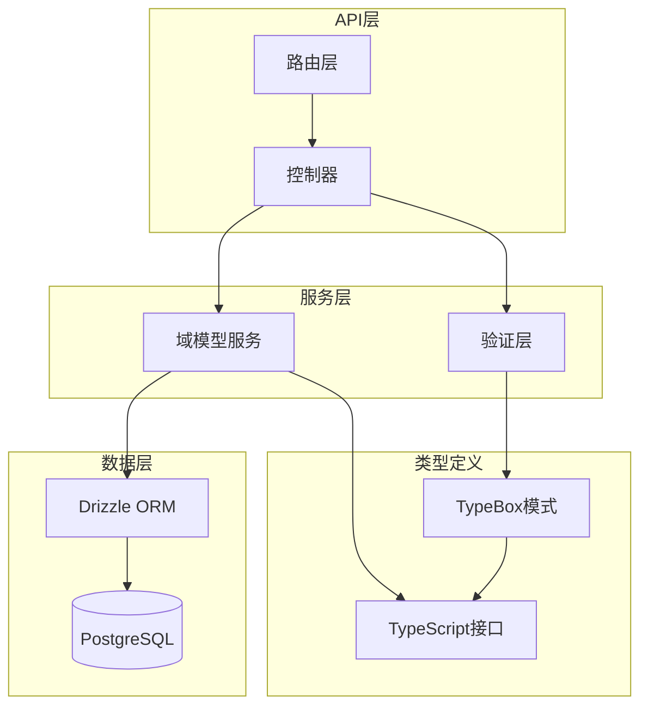
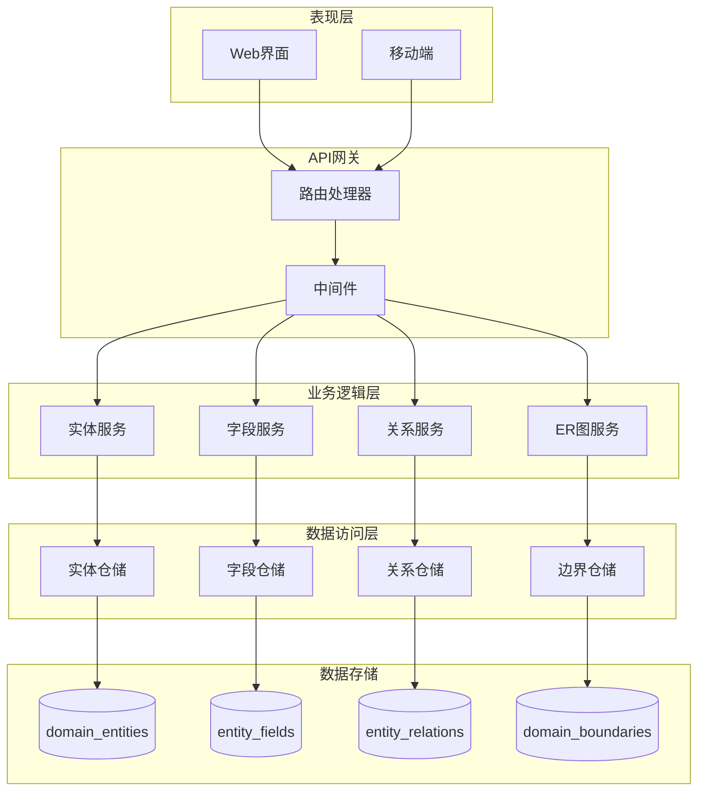
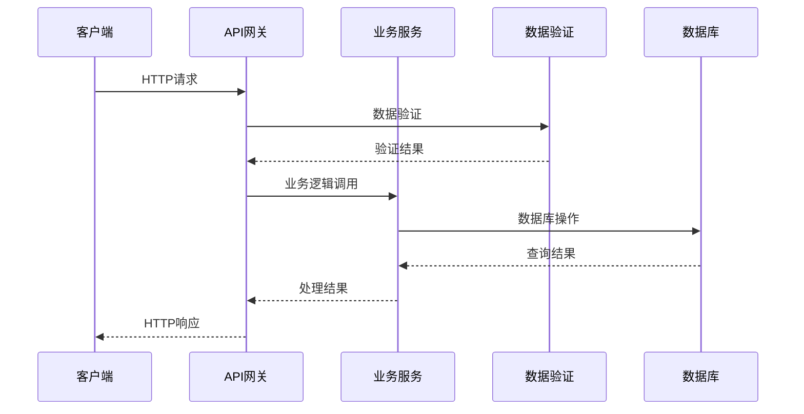
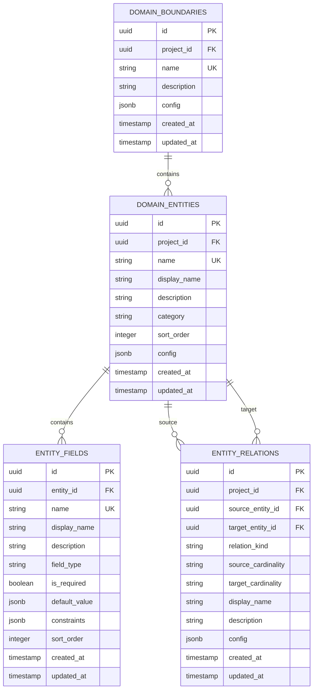
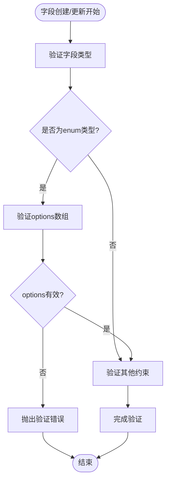
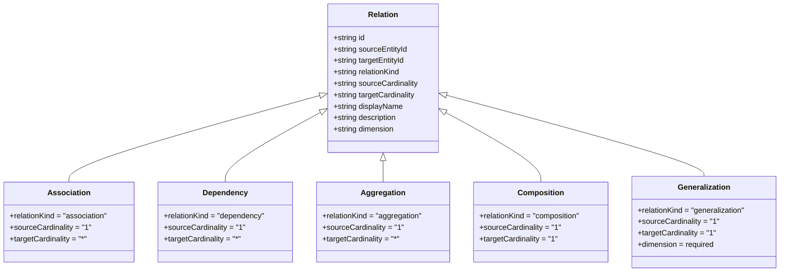
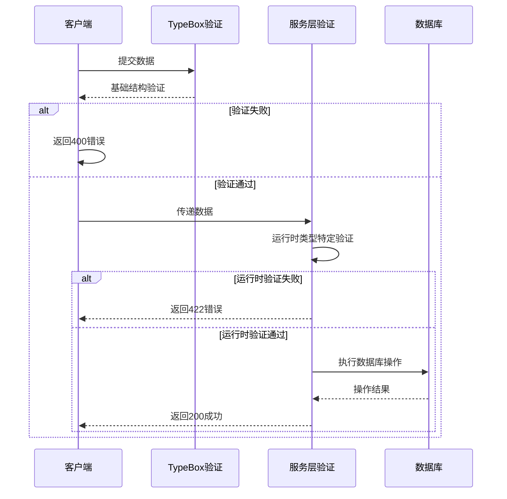
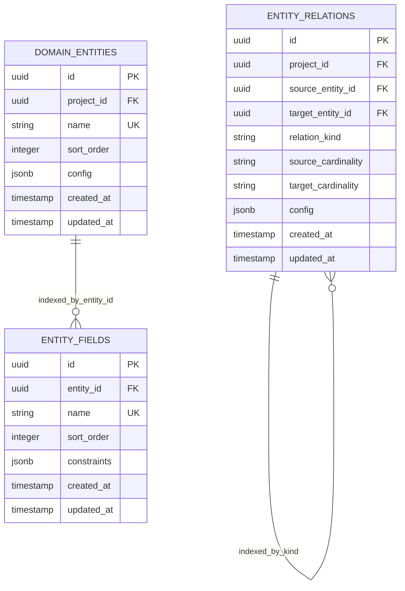

# 域模型API

<cite>
**本文档引用的文件**
- [f-m2-01-api.md](file://docs/06-test-design/modules/domain-model/f-m2-01-entity/f-m2-01-api.md)
- [f-m2-02-api.md](file://docs/06-test-design/modules/domain-model/f-m2-02-field/f-m2-02-api.md)
- [f-m2-03-api.md](file://docs/06-test-design/modules/domain-model/f-m2-03-relation/f-m2-03-api.md)
- [f-m2-04-api.md](file://docs/06-test-design/modules/domain-model/f-m2-04-er-graph/f-m2-04-api.md)
- [domain-model-tech-design.md](file://docs/04-tech-design/domain-model-tech-design.md)
- [domain.schema.ts](file://packages/validation-schemas/src/domain.schema.ts)
- [domain.service.ts](file://packages/api/src/services/domain.service.ts)
- [domain.ts](file://packages/shared/src/types/domain.ts)
</cite>

## 目录
1. [简介](#简介)
2. [项目结构](#项目结构)
3. [核心组件](#核心组件)
4. [架构概览](#架构概览)
5. [详细组件分析](#详细组件分析)
6. [依赖分析](#依赖分析)
7. [性能考虑](#性能考虑)
8. [故障排除指南](#故障排除指南)
9. [结论](#结论)

## 简介

域模型API是AI原型管理系统的核心功能模块，负责管理项目的领域模型数据结构。该系统实现了完整的实体-字段-关系建模体系，支持ER图可视化展示，并提供了丰富的数据验证和约束机制。

本API系统采用RESTful设计原则，基于TypeBox进行运行时数据验证，使用Drizzle ORM进行数据库操作，支持完整的CRUD操作和复杂查询功能。系统特别注重数据一致性保证和用户体验，提供了丰富的错误处理和状态管理机制。

## 项目结构

域模型API系统采用模块化设计，主要包含以下核心模块：



**图表来源**
- [domain-model-tech-design.md:73-86](file://docs/04-tech-design/domain-model-tech-design.md#L73-L86)
- [domain.service.ts:1-27](file://packages/api/src/services/domain.service.ts#L1-L27)

**章节来源**
- [domain-model-tech-design.md:17-27](file://docs/04-tech-design/domain-model-tech-design.md#L17-L27)
- [domain-model-tech-design.md:73-86](file://docs/04-tech-design/domain-model-tech-design.md#L73-L86)

## 核心组件

域模型API系统包含四个主要功能模块，每个模块都提供完整的CRUD操作和专门的数据验证规则：

### 实体管理模块 (F-M2-01)
- **功能范围**: 领域实体的创建、查询、更新、删除
- **核心特性**: 支持实体分类、排序、画布位置管理
- **数据完整性**: 项目内实体名称唯一性保证

### 字段管理模块 (F-M2-02)
- **功能范围**: 实体字段的创建、查询、更新、删除和排序
- **核心特性**: 9种基础字段类型支持，动态约束验证
- **数据完整性**: 实体内字段名称唯一性保证

### 关系管理模块 (F-M2-03)
- **功能范围**: 实体关系的创建、查询、更新、删除
- **核心特性**: 支持依赖、聚合、组合、关联等关系类型
- **数据完整性**: 关系唯一性约束，自关联禁止

### ER图可视化模块 (F-M2-04)
- **功能范围**: 全量ER图和局部ER图数据生成
- **核心特性**: 通用数据格式，支持画布位置信息
- **性能优化**: 分层查询，避免N+1问题

**章节来源**
- [domain-model-tech-design.md:19-26](file://docs/04-tech-design/domain-model-tech-design.md#L19-L26)
- [domain-model-tech-design.md:89-275](file://docs/04-tech-design/domain-model-tech-design.md#L89-L275)

## 架构概览

域模型API采用分层架构设计，确保关注点分离和代码可维护性：



**图表来源**
- [domain.service.ts:1-27](file://packages/api/src/services/domain.service.ts#L1-L27)
- [domain-model-tech-design.md:73-86](file://docs/04-tech-design/domain-model-tech-design.md#L73-L86)

### 数据流架构



**图表来源**
- [domain.service.ts:139-163](file://packages/api/src/services/domain.service.ts#L139-L163)
- [domain.schema.ts:88-105](file://packages/validation-schemas/src/domain.schema.ts#L88-L105)

## 详细组件分析

### 实体管理API

实体管理API提供了完整的领域实体生命周期管理功能：

#### 核心数据结构



**图表来源**
- [domain.service.ts:759-807](file://packages/api/src/services/domain.service.ts#L759-L807)
- [domain.service.ts:774-789](file://packages/api/src/services/domain.service.ts#L774-L789)
- [domain.service.ts:791-800](file://packages/api/src/services/domain.service.ts#L791-L800)

#### 实体CRUD操作

| 操作 | HTTP方法 | 端点 | 功能描述 |
|------|----------|------|----------|
| 创建实体 | POST | `/api/v1/projects/{projectId}/domain/entities` | 创建新的领域实体 |
| 获取实体列表 | GET | `/api/v1/projects/{projectId}/domain/entities` | 分页查询实体列表 |
| 获取实体详情 | GET | `/api/v1/projects/{projectId}/domain/entities/{entityId}` | 获取实体详细信息 |
| 更新实体 | PUT | `/api/v1/projects/{projectId}/domain/entities/{entityId}` | 更新实体基本信息 |
| 删除实体 | DELETE | `/api/v1/projects/{projectId}/domain/entities/{entityId}` | 删除实体及其关联数据 |

#### 字段类型定义

系统支持9种基础字段类型，每种类型都有特定的约束规则：

| 字段类型 | 约束规则 | 示例用途 |
|----------|----------|----------|
| string | maxLength, minLength, pattern | 文本字段，支持正则验证 |
| number | min, max, precision | 数值字段，支持精度控制 |
| boolean | 无 | 布尔值字段 |
| datetime | format: date/time/datetime | 日期时间字段 |
| text | maxLength | 长文本字段 |
| enum | options: [{value, label}[] | 枚举字段，固定选项集合 |
| email | 无 | 邮箱地址验证 |
| url | 无 | URL地址验证 |
| phone | 无 | 电话号码验证 |

**章节来源**
- [f-m2-01-api.md:30-343](file://docs/06-test-design/modules/domain-model/f-m2-01-entity/f-m2-01-api.md#L30-L343)
- [f-m2-02-api.md:30-171](file://docs/06-test-design/modules/domain-model/f-m2-02-field/f-m2-02-api.md#L30-L171)
- [domain-model-tech-design.md:299-335](file://docs/04-tech-design/domain-model-tech-design.md#L299-L335)

### 字段管理API

字段管理API提供了灵活的字段定义和管理功能：

#### 字段约束验证



**图表来源**
- [domain.service.ts:149-163](file://packages/api/src/services/domain.service.ts#L149-L163)
- [domain.schema.ts:191-210](file://packages/validation-schemas/src/domain.schema.ts#L191-L210)

#### 字段排序机制

系统支持字段的拖拽排序功能，通过`sortOrder`字段维护字段的显示顺序：

| 操作 | 端点 | 方法 | 功能描述 |
|------|------|------|----------|
| 获取字段列表 | `/api/v1/projects/{projectId}/domain/entities/{entityId}/fields` | GET | 按sortOrder升序返回字段列表 |
| 更新字段排序 | `/api/v1/projects/{projectId}/domain/entities/{entityId}/fields/reorder` | PATCH | 批量更新字段排序 |
| 创建字段 | `/api/v1/projects/{projectId}/domain/entities/{entityId}/fields` | POST | 创建新字段并自动分配排序号 |

**章节来源**
- [f-m2-02-api.md:174-298](file://docs/06-test-design/modules/domain-model/f-m2-02-field/f-m2-02-api.md#L174-L298)
- [domain-model-tech-design.md:378-391](file://docs/04-tech-design/domain-model-tech-design.md#L378-L391)

### 关系管理API

关系管理API实现了完整的实体关系建模功能：

#### 关系类型定义



**图表来源**
- [domain.service.ts:412-421](file://packages/api/src/services/domain.service.ts#L412-L421)
- [domain.service.ts:609-664](file://packages/api/src/services/domain.service.ts#L609-L664)

#### 关系验证规则

| 验证规则 | 描述 | 违规处理 |
|----------|------|----------|
| 自关联检查 | sourceEntityId ≠ targetEntityId | 返回422 UNPROCESSABLE_ENTITY |
| 项目归属验证 | 实体必须属于当前项目 | 返回422 UNPROCESSABLE_ENTITY |
| 唯一性约束 | (project_id, source, target, kind)唯一 | 返回409 CONFLICT |
| 泛化维度验证 | generalization类型必须提供dimension | 返回422 UNPROCESSABLE_ENTITY |
| 基数强制 | generalization基数强制为1:1 | 自动修正为"1"/"1" |

**章节来源**
- [f-m2-03-api.md:31-168](file://docs/06-test-design/modules/domain-model/f-m2-03-relation/f-m2-03-api.md#L31-L168)
- [domain-model-tech-design.md:432-487](file://docs/04-tech-design/domain-model-tech-design.md#L432-L487)

### ER图可视化API

ER图可视化API提供了灵活的图形数据生成功能：

#### ER图数据结构

```mermaid
erDiagram
ER_GRAPH_DATA {
array entities
array relations
array domains
}
ER_NODE {
string id
string type = "entity"
position position
node_data data
}
ER_EDGE {
string id
string source
string target
string type = "relation"
edge_data data
}
ER_NODE_FIELD {
string id
string name
string displayName
string fieldType
boolean isRequired
}
NODE_DATA {
string name
string displayName
string category
array fields
string domainId
}
EDGE_DATA {
string relationKind
string sourceCardinality
string targetCardinality
string displayName
string description
string dimension
}
ER_GRAPH_DATA ||--o{ ER_NODE : contains
ER_GRAPH_DATA ||--o{ ER_EDGE : contains
ER_NODE ||--o{ ER_NODE_FIELD : contains
ER_NODE_DATA ||--o{ NODE_DATA : contains
ER_EDGE ||--o{ EDGE_DATA : contains
```

**图表来源**
- [domain.service.ts:915-1004](file://packages/api/src/services/domain.service.ts#L915-L1004)
- [domain.service.ts:1012-1135](file://packages/api/src/services/domain.service.ts#L1012-L1135)

#### ER图查询模式

| 查询模式 | 端点 | 功能描述 |
|----------|------|----------|
| 全量ER图 | `/api/v1/projects/{projectId}/domain/relations/graph` | 返回项目内所有实体和关系 |
| 局部ER图 | `/api/v1/projects/{projectId}/domain/entities/{entityId}/er-graph` | 以指定实体为中心的直接关联图 |
| 实体详情ER图 | `/api/v1/projects/{projectId}/domain/entities/{entityId}/er-graph` | 包含字段摘要的实体关系视图 |

**章节来源**
- [f-m2-04-api.md:32-170](file://docs/06-test-design/modules/domain-model/f-m2-04-er-graph/f-m2-04-api.md#L32-L170)
- [domain-model-tech-design.md:262-274](file://docs/04-tech-design/domain-model-tech-design.md#L262-L274)

## 依赖分析

域模型API系统具有清晰的依赖层次结构：

```mermaid
graph TB
subgraph "外部依赖"
TypeBox[@sinclair/typebox]
Drizzle[drizzle-orm]
ReactFlow[@xyflow/react]
DnDKit[@dnd-kit/core]
end
subgraph "内部模块"
ValidationSchemas[validation-schemas]
ApiService[api-service]
SharedTypes[shared-types]
WebComponents[web-components]
end
subgraph "核心功能"
EntityAPI[实体API]
FieldAPI[字段API]
RelationAPI[关系API]
ERGraphAPI[ER图API]
end
TypeBox --> ValidationSchemas
Drizzle --> ApiService
ReactFlow --> WebComponents
DnDKit --> WebComponents
ValidationSchemas --> EntityAPI
ValidationSchemas --> FieldAPI
ValidationSchemas --> RelationAPI
ValidationSchemas --> ERGraphAPI
ApiService --> EntityAPI
ApiService --> FieldAPI
ApiService --> RelationAPI
ApiService --> ERGraphAPI
SharedTypes --> WebComponents
WebComponents --> EntityAPI
WebComponents --> FieldAPI
WebComponents --> RelationAPI
WebComponents --> ERGraphAPI
```

**图表来源**
- [domain-model-tech-design.md:843-852](file://docs/04-tech-design/domain-model-tech-design.md#L843-L852)
- [domain.service.ts:11-19](file://packages/api/src/services/domain.service.ts#L11-L19)

### 数据验证依赖

系统采用双层验证机制确保数据完整性：

1. **编译时验证**: TypeBox模式定义数据结构约束
2. **运行时验证**: 服务层进行动态类型特定验证



**图表来源**
- [domain.service.ts:149-163](file://packages/api/src/services/domain.service.ts#L149-L163)
- [domain.schema.ts:667-747](file://packages/validation-schemas/src/domain.schema.ts#L667-L747)

**章节来源**
- [domain-model-tech-design.md:820-825](file://docs/04-tech-design/domain-model-tech-design.md#L820-L825)
- [domain.schema.ts:667-747](file://packages/validation-schemas/src/domain.schema.ts#L667-L747)

## 性能考虑

域模型API系统在设计时充分考虑了性能优化：

### 查询优化策略

1. **N+1查询避免**: 使用JOIN查询和批量加载机制
2. **索引优化**: 在常用查询字段上建立适当索引
3. **分页处理**: 默认分页大小限制，避免大数据集查询
4. **缓存策略**: ER图数据在前端进行合理缓存

### 数据库设计优化



**图表来源**
- [domain.service.ts:196-226](file://packages/api/src/services/domain.service.ts#L196-L226)
- [domain.service.ts:626-664](file://packages/api/src/services/domain.service.ts#L626-L664)

### 前端性能优化

1. **虚拟滚动**: 大列表数据的虚拟化处理
2. **懒加载**: ER图的按需加载机制
3. **防抖处理**: 搜索和位置更新的防抖优化
4. **增量更新**: 局部数据更新而非全量刷新

## 故障排除指南

### 常见错误类型及解决方案

| 错误类型 | HTTP状态码 | 触发条件 | 解决方案 |
|----------|------------|----------|----------|
| 验证错误 | 400 | 数据结构不符合TypeBox模式 | 检查请求数据格式和字段约束 |
| 验证错误 | 422 | 运行时数据验证失败 | 修正字段类型和约束规则 |
| 冲突错误 | 409 | 数据唯一性冲突 | 修改冲突数据或删除重复项 |
| 未找到 | 404 | 资源不存在 | 确认资源ID和项目权限 |
| 服务器错误 | 500 | 服务器内部错误 | 检查数据库连接和日志 |

### 调试技巧

1. **启用详细日志**: 在开发环境中启用SQL查询日志
2. **使用Postman测试**: 验证API端点的正确性
3. **检查数据库状态**: 确保数据库连接正常
4. **验证权限**: 确认用户对项目有足够的访问权限

**章节来源**
- [f-m2-01-api.md:346-501](file://docs/06-test-design/modules/domain-model/f-m2-01-entity/f-m2-01-api.md#L346-L501)
- [f-m2-02-api.md:301-436](file://docs/06-test-design/modules/domain-model/f-m2-02-field/f-m2-02-api.md#L301-L436)
- [f-m2-03-api.md:350-441](file://docs/06-test-design/modules/domain-model/f-m2-03-relation/f-m2-03-api.md#L350-L441)

## 结论

域模型API系统是一个功能完整、设计合理的数据建模解决方案。系统通过清晰的模块划分、严格的验证机制和优雅的错误处理，为用户提供了一个强大而易用的领域模型管理工具。

系统的主要优势包括：

1. **完整的功能覆盖**: 从实体建模到关系管理，再到可视化展示
2. **严格的数据完整性**: 多层验证确保数据质量和一致性
3. **良好的扩展性**: 模块化设计便于功能扩展和维护
4. **优秀的用户体验**: 直观的API设计和完善的错误处理

随着系统的持续发展，可以进一步增强的功能包括：数据版本控制、变更追踪、复杂查询优化、批量操作增强等。这些改进将进一步提升系统的实用性和用户体验。