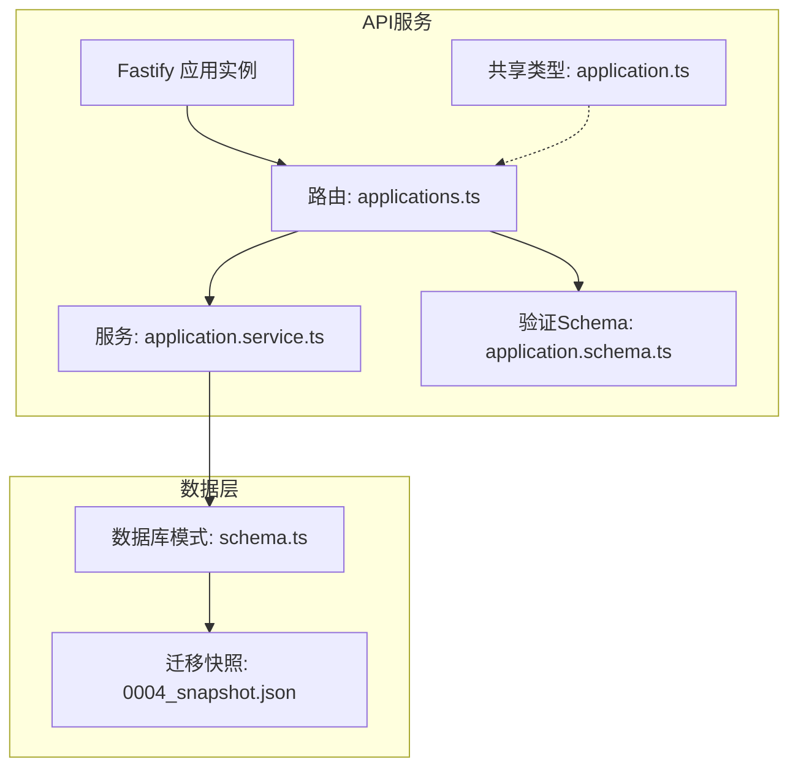
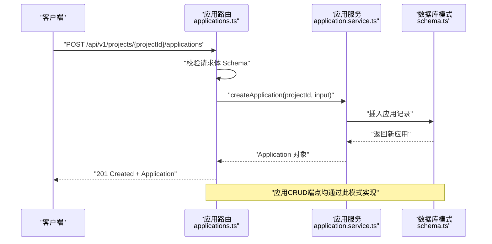
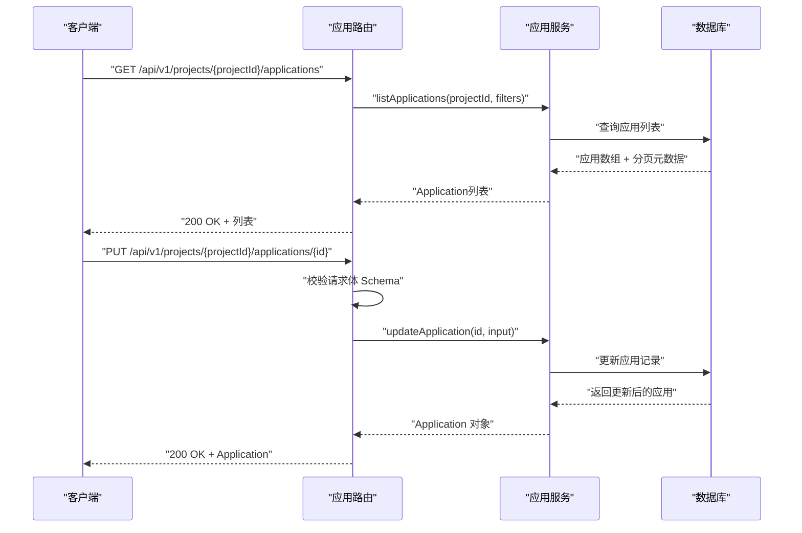
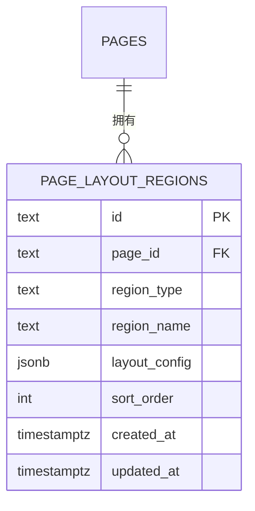
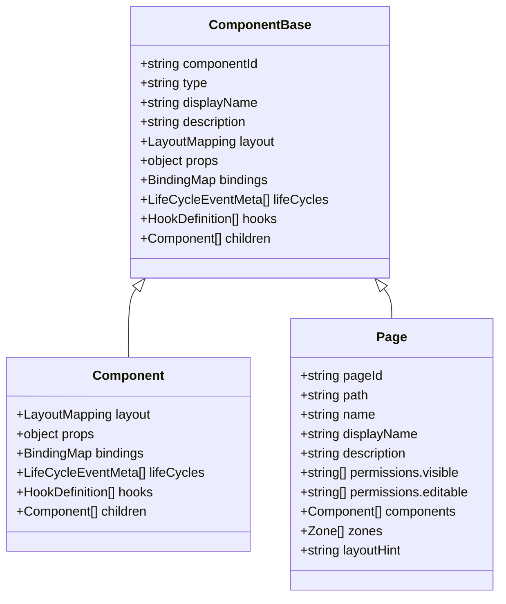
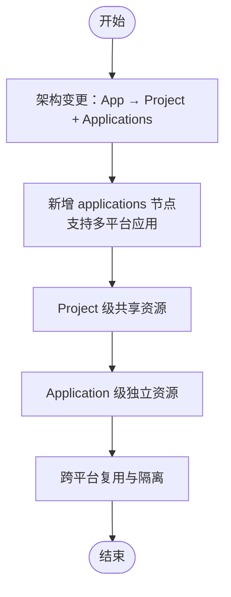
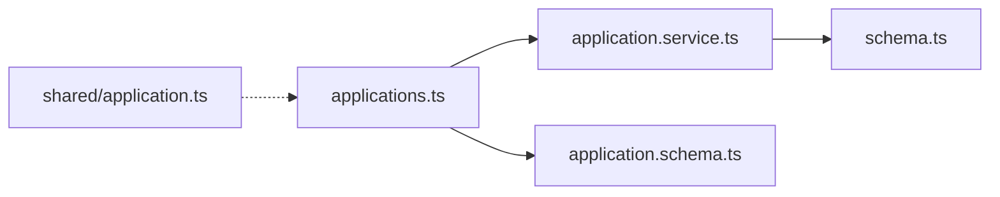

# 应用管理API

<cite>
**本文档引用的文件**
- [packages/api/src/routes/applications.ts](file://packages/api/src/routes/applications.ts)
- [packages/api/src/services/application.service.ts](file://packages/api/src/services/application.service.ts)
- [packages/api/src/models/schema.ts](file://packages/api/src/models/schema.ts)
- [packages/api/src/app.ts](file://packages/api/src/app.ts)
- [packages/validation-schemas/src/application.schema.ts](file://packages/validation-schemas/src/application.schema.ts)
- [packages/shared/src/types/application.ts](file://packages/shared/src/types/application.ts)
- [packages/api/tests/project-management/f-m1-11-application.test.ts](file://packages/api/tests/project-management/f-m1-11-application.test.ts)
- [docs/02-domain-model/domain-model.md](file://docs/02-domain-model/domain-model.md)
- [docs/02-domain-model/app-shared-resources.md](file://docs/02-domain-model/app-shared-resources.md)
- [packages/api/drizzle/migrations/meta/0004_snapshot.json](file://packages/api/drizzle/migrations/meta/0004_snapshot.json)
</cite>

## 目录
1. [简介](#简介)
2. [项目结构](#项目结构)
3. [核心组件](#核心组件)
4. [架构总览](#架构总览)
5. [详细组件分析](#详细组件分析)
6. [依赖关系分析](#依赖关系分析)
7. [性能考虑](#性能考虑)
8. [故障排查指南](#故障排查指南)
9. [结论](#结论)
10. [附录](#附录)

## 简介
本文件为应用管理API的完整接口文档，聚焦于页面布局管理、区域定义、组件配置与应用配置相关能力。基于现有代码库，当前已实现应用的创建、查询、详情、编辑与删除的CRUD接口，并通过数据库模式定义了页面布局区域（page_layout_regions）以支撑页面区域的定义与管理。文档将详细说明以下内容：
- 应用页面的创建、编辑与删除接口
- 页面区域的定义与管理机制
- 组件配置与布局调整的API接口说明
- 应用模板与复用机制的API使用方法
- 应用发布与版本管理的接口规范
- 应用性能监控与数据分析的API接口

## 项目结构
应用管理API位于后端服务的API包中，采用Fastify插件形式注册，路由前缀为/api/v1/projects/:projectId，应用CRUD路由在applications.ts中定义，并通过application.service.ts进行业务处理。

**图表来源**
- [packages/api/src/app.ts:149-151](file://packages/api/src/app.ts#L149-L151)
- [packages/api/src/routes/applications.ts:31-80](file://packages/api/src/routes/applications.ts#L31-L80)
- [packages/api/src/services/application.service.ts:1-35](file://packages/api/src/services/application.service.ts#L1-L35)
- [packages/api/src/models/schema.ts:307-326](file://packages/api/src/models/schema.ts#L307-L326)

**章节来源**
- [packages/api/src/app.ts:136-153](file://packages/api/src/app.ts#L136-L153)
- [packages/api/src/routes/applications.ts:1-80](file://packages/api/src/routes/applications.ts#L1-L80)

## 核心组件
- 应用路由层（applications.ts）：定义应用CRUD端点，使用TypeBox Schema进行请求校验与OpenAPI文档生成。
- 应用服务层（application.service.ts）：封装应用的业务逻辑，包括列表查询、创建、更新、删除等。
- 数据模型（schema.ts）：定义应用与页面布局区域的数据库结构，确保数据一致性与完整性。
- 验证Schema（application.schema.ts）：定义请求与响应的Schema，用于运行时校验与文档生成。
- 共享类型（application.ts）：定义应用在前端与后端共享的类型定义。

**章节来源**
- [packages/api/src/routes/applications.ts:1-80](file://packages/api/src/routes/applications.ts#L1-L80)
- [packages/api/src/services/application.service.ts:1-35](file://packages/api/src/services/application.service.ts#L1-L35)
- [packages/api/src/models/schema.ts:307-326](file://packages/api/src/models/schema.ts#L307-L326)
- [packages/validation-schemas/src/application.schema.ts](file://packages/validation-schemas/src/application.schema.ts)
- [packages/shared/src/types/application.ts](file://packages/shared/src/types/application.ts)

## 架构总览
应用管理API遵循“路由层-服务层-数据层”的分层架构，路由层负责HTTP协议与Schema校验，服务层负责业务规则与数据访问，数据层负责持久化与约束。

**图表来源**
- [packages/api/src/routes/applications.ts:51-65](file://packages/api/src/routes/applications.ts#L51-L65)
- [packages/api/src/services/application.service.ts:255-289](file://packages/api/src/services/application.service.ts#L255-L289)

**章节来源**
- [packages/api/src/routes/applications.ts:31-80](file://packages/api/src/routes/applications.ts#L31-L80)
- [packages/api/src/services/application.service.ts:10-35](file://packages/api/src/services/application.service.ts#L10-L35)

## 详细组件分析

### 应用CRUD接口
- 接口前缀：/api/v1/projects/:projectId
- 应用CRUD端点：
  - GET /applications — 查询应用列表（支持分页、排序、搜索、类型筛选，不返回config）
  - POST /applications — 创建应用（name唯一、icon按type自动分配、type不可变）
  - GET /applications/:id — 获取应用详情（返回完整字段，含config）
  - PUT /applications/:id — 编辑应用（可编辑字段：name、displayName、description；type与icon不可编辑）
  - DELETE /applications/:id — 删除应用（引用约束检查、物理删除）

**图表来源**
- [packages/api/src/routes/applications.ts:36-80](file://packages/api/src/routes/applications.ts#L36-L80)
- [packages/api/src/services/application.service.ts:120-239](file://packages/api/src/services/application.service.ts#L120-L239)

**章节来源**
- [packages/api/src/routes/applications.ts:36-210](file://packages/api/src/routes/applications.ts#L36-L210)
- [packages/api/src/services/application.service.ts:120-339](file://packages/api/src/services/application.service.ts#L120-L339)

### 页面布局区域管理
- 数据库表：page_layout_regions
- 字段说明：
  - id：主键
  - pageId：外键，关联页面（删除时级联）
  - regionType：区域类型（header、sidebar、main、footer、custom）
  - regionName：区域名称（同一页面内唯一）
  - layoutConfig：布局配置（JSON）
  - sortOrder：排序序号
  - createdAt/updatedAt：时间戳
- 约束：同一页面内的regionName唯一

**图表来源**
- [packages/api/src/models/schema.ts:307-326](file://packages/api/src/models/schema.ts#L307-L326)
- [packages/api/drizzle/migrations/meta/0004_snapshot.json:1767-1846](file://packages/api/drizzle/migrations/meta/0004_snapshot.json#L1767-L1846)

**章节来源**
- [packages/api/src/models/schema.ts:307-326](file://packages/api/src/models/schema.ts#L307-L326)
- [packages/api/drizzle/migrations/meta/0004_snapshot.json:1767-1846](file://packages/api/drizzle/migrations/meta/0004_snapshot.json#L1767-L1846)

### 组件配置与布局调整
- 组件基类：Component（继承自ComponentBase），支持布局映射、属性、绑定、生命周期、钩子等。
- 页面（Page）：作为特殊组件，包含组件语义树、逻辑分区、布局建议等。
- 区域（Zone）：页面内的逻辑分区，配合布局区域实现页面结构模块化。

**图表来源**
- [docs/02-domain-model/domain-model.md:238-263](file://docs/02-domain-model/domain-model.md#L238-L263)
- [docs/02-domain-model/domain-model.md:265-301](file://docs/02-domain-model/domain-model.md#L265-L301)

**章节来源**
- [docs/02-domain-model/domain-model.md:238-263](file://docs/02-domain-model/domain-model.md#L238-L263)
- [docs/02-domain-model/domain-model.md:265-301](file://docs/02-domain-model/domain-model.md#L265-L301)

### 应用模板与复用机制
- 架构演进：从App到Project+Applications，支持多平台应用（web、android、pc、iOS、api、service）。
- 共享资源：Project级共享（domainModels、roles、rules、backgroudBizOperation、meta），Application级独立（pages、globalActions、endpoints、timers）。
- 复用策略：通过Application类型区分不同平台与职责，实现跨平台能力的模块化与复用。

**图表来源**
- [docs/02-domain-model/app-shared-resources.md:9-27](file://docs/02-domain-model/app-shared-resources.md#L9-L27)

**章节来源**
- [docs/02-domain-model/app-shared-resources.md:9-27](file://docs/02-domain-model/app-shared-resources.md#L9-L27)

### 应用发布与版本管理
- 当前实现：应用CRUD接口未暴露显式的发布/版本字段或流程。
- 建议扩展：可在Application模型中增加发布状态、版本号、发布时间等字段，并新增发布/回滚相关端点，以满足版本管理需求。

[本节为概念性建议，不直接对应具体源码文件]

### 应用性能监控与数据分析
- 当前实现：未发现专门的性能监控与数据分析API端点。
- 建议扩展：可新增指标采集端点（如页面加载耗时、组件渲染统计、错误日志上报等），并与现有应用CRUD端点协同工作。

[本节为概念性建议，不直接对应具体源码文件]

## 依赖关系分析
应用管理API的依赖关系清晰，路由层依赖服务层，服务层依赖数据模型，验证Schema贯穿请求与响应校验。

**图表来源**
- [packages/api/src/routes/applications.ts:13-26](file://packages/api/src/routes/applications.ts#L13-L26)
- [packages/api/src/services/application.service.ts:16-31](file://packages/api/src/services/application.service.ts#L16-L31)
- [packages/api/src/models/schema.ts:307-326](file://packages/api/src/models/schema.ts#L307-L326)
- [packages/shared/src/types/application.ts](file://packages/shared/src/types/application.ts)

**章节来源**
- [packages/api/src/routes/applications.ts:13-26](file://packages/api/src/routes/applications.ts#L13-L26)
- [packages/api/src/services/application.service.ts:16-31](file://packages/api/src/services/application.service.ts#L16-L31)

## 性能考虑
- 列表查询：支持分页、排序与筛选，建议在高频查询场景下对常用过滤字段建立索引。
- 唯一性约束：应用名称在项目范围内唯一，创建时需注意冲突处理与重试策略。
- 级联删除：页面布局区域随页面删除而级联清理，避免悬挂数据。

[本节提供通用指导，不直接对应具体源码文件]

## 故障排查指南
- 404 Not Found：当应用ID不存在时返回404，检查ID是否正确或已被删除。
- 409 Conflict：当应用名称冲突时返回409，修改名称后重试。
- 400 Bad Request：请求体Schema校验失败，检查字段类型与长度限制。
- 测试覆盖：单元测试覆盖了名称超长、描述超长、不存在的ID等边界情况。

**章节来源**
- [packages/api/tests/project-management/f-m1-11-application.test.ts:333-378](file://packages/api/tests/project-management/f-m1-11-application.test.ts#L333-L378)

## 结论
应用管理API已实现应用CRUD的核心能力，并通过数据库模式定义了页面布局区域，为页面区域的定义与管理提供了基础。结合领域模型中的组件与页面概念，可进一步完善组件配置与布局调整的API。建议后续扩展发布/版本管理与性能监控/数据分析相关接口，以满足全生命周期管理需求。

## 附录
- API端点汇总（前缀：/api/v1/projects/:projectId）
  - GET /applications — 查询应用列表
  - POST /applications — 创建应用
  - GET /applications/:id — 获取应用详情
  - PUT /applications/:id — 编辑应用
  - DELETE /applications/:id — 删除应用

**章节来源**
- [packages/api/src/routes/applications.ts:36-210](file://packages/api/src/routes/applications.ts#L36-L210)