# 系统管理API

<cite>
**本文档引用的文件**
- [f-m1-08-api.md](file://docs/06-test-design/modules/project-management/f-m1-08-role/f-m1-08-api.md)
- [f-m1-12-api.md](file://docs/06-test-design/modules/project-management/f-m1-12-role-behavior/f-m1-12-api.md)
- [f-m1-13-api.md](file://docs/06-test-design/modules/project-management/f-m1-13-external-entity-behavior/f-m1-13-api.md)
- [f-m1-09-api.md](file://docs/06-test-design/modules/project-management/f-m1-09-external-entity/f-m1-09-api.md)
- [f-m1-01-api.md](file://docs/06-test-design/modules/project-management/f-m1-01-project-list/f-m1-01-api.md)
- [f-m1-02-api.md](file://docs/06-test-design/modules/project-management/f-m1-02-create-project/f-m1-02-api.md)
- [f-m1-03-api.md](file://docs/06-test-design/modules/project-management/f-m1-03-project-detail/f-m1-03-api.md)
- [f-m1-04-api.md](file://docs/06-test-design/modules/project-management/f-m1-04-edit-project/f-m1-04-api.md)
- [f-m1-05-api.md](file://docs/06-test-design/modules/project-management/f-m1-05-archive/f-m1-05-api.md)
- [f-m1-06-api.md](file://docs/06-test-design/modules/project-management/f-m1-06-company/f-m1-06-api.md)
- [f-m1-07-api.md](file://docs/06-test-design/modules/project-management/f-m1-07-department/f-m1-07-api.md)
- [f-m1-10-api.md](file://docs/06-test-design/modules/project-management/f-m1-10-statistics/f-m1-10-api.md)
- [openapi-contract-design.md](file://docs/04-tech-design/openapi-contract-design.md)
- [role-behavior-design.md](file://docs/04-tech-design/role-behavior-design.md)
- [project-context-navigation-design.md](file://docs/04-tech-design/project-context-navigation-design.md)
- [domain-model-tech-design.md](file://docs/04-tech-design/domain-model-tech-design.md)
- [phase1-design-tech.md](file://docs/04-tech-design/phase1-design-tech.md)
- [mcp-interface.md](file://docs/04-tech-design/mcp-interface.md)
- [multi-env-deploy.md](file://docs/07-deploy-design/multi-env-deploy.md)
- [f-m1-08-roles.test.ts](file://packages/api/tests/project-management/f-m1-08-roles.test.ts)
- [f-m1-12-role-behavior.test.ts](file://packages/api/tests/project-management/f-m1-12-role-behavior.test.ts)
- [f-m1-13-external-entity-behavior.test.ts](file://packages/api/tests/project-management/f-m1-13-external-entity-behavior.test.ts)
- [f-m1-09-external-entities.test.ts](file://packages/api/tests/project-management/f-m1-09-external-entities.test.ts)
</cite>

## 目录
1. [简介](#简介)
2. [项目结构](#项目结构)
3. [核心组件](#核心组件)
4. [架构概览](#架构概览)
5. [详细组件分析](#详细组件分析)
6. [依赖关系分析](#依赖关系分析)
7. [性能考虑](#性能考虑)
8. [故障排除指南](#故障排除指南)
9. [结论](#结论)
10. [附录](#附录)

## 简介

本文件为AI原型管理系统中的系统管理API提供全面的技术文档。该系统采用分层架构设计，围绕项目管理、角色行为管理、外部实体行为和系统导航等核心功能构建。文档重点涵盖以下方面：

- 角色行为管理：定义用户角色与其可执行操作之间的映射关系
- 外部实体行为：管理与系统外部组件的交互规则
- 系统导航：提供跨模块的统一导航机制
- 系统配置与参数管理：支持动态配置更新和参数化控制
- 权限控制机制：基于角色的行为授权体系
- 监控与日志管理：系统运行状态跟踪和审计日志
- 集成与扩展点：MCP接口和多环境部署支持
- 性能优化与资源管理：缓存策略和资源调度
- 备份恢复与灾难恢复：数据保护和业务连续性保障

## 项目结构

系统采用模块化的文档组织方式，API相关文档主要分布在测试设计模块中，形成了完整的API契约文档体系。

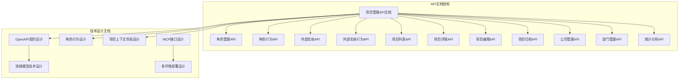

**图表来源**
- [f-m1-08-api.md:1-50](file://docs/06-test-design/modules/project-management/f-m1-08-role/f-m1-08-api.md#L1-L50)
- [f-m1-12-api.md:1-50](file://docs/06-test-design/modules/project-management/f-m1-12-role-behavior/f-m1-12-api.md#L1-L50)
- [openapi-contract-design.md:1-100](file://docs/04-tech-design/openapi-contract-design.md#L1-L100)

**章节来源**
- [f-m1-08-api.md:1-200](file://docs/06-test-design/modules/project-management/f-m1-08-role/f-m1-08-api.md#L1-L200)
- [f-m1-12-api.md:1-200](file://docs/06-test-design/modules/project-management/f-m1-12-role-behavior/f-m1-12-api.md#L1-L200)
- [f-m1-13-api.md:1-200](file://docs/06-test-design/modules/project-management/f-m1-13-external-entity-behavior/f-m1-13-api.md#L1-L200)
- [f-m1-09-api.md:1-200](file://docs/06-test-design/modules/project-management/f-m1-09-external-entity/f-m1-09-api.md#L1-L200)

## 核心组件

### 角色管理系统

角色管理是系统权限控制的核心组件，负责用户身份标识和访问控制的基础设置。

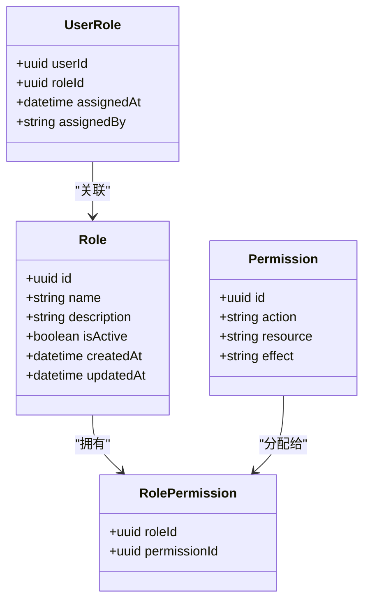

**图表来源**
- [f-m1-08-api.md:1-150](file://docs/06-test-design/modules/project-management/f-m1-08-role/f-m1-08-api.md#L1-L150)

### 角色行为管理器

角色行为管理器定义了角色可以执行的具体操作集合，通过行为树或规则引擎实现复杂的行为组合。

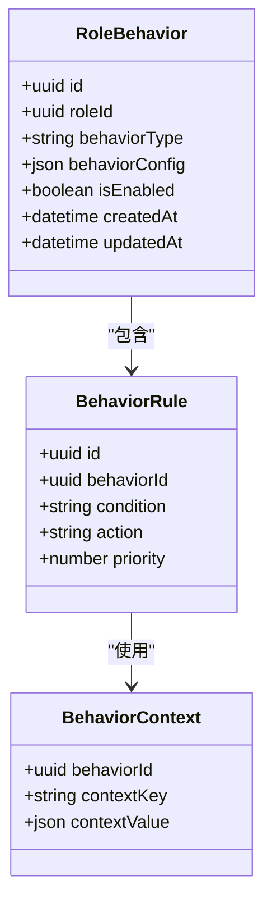

**图表来源**
- [f-m1-12-api.md:1-180](file://docs/06-test-design/modules/project-management/f-m1-12-role-behavior/f-m1-12-api.md#L1-L180)

### 外部实体管理

外部实体管理负责与系统外部组件的交互，包括第三方服务集成和数据交换。

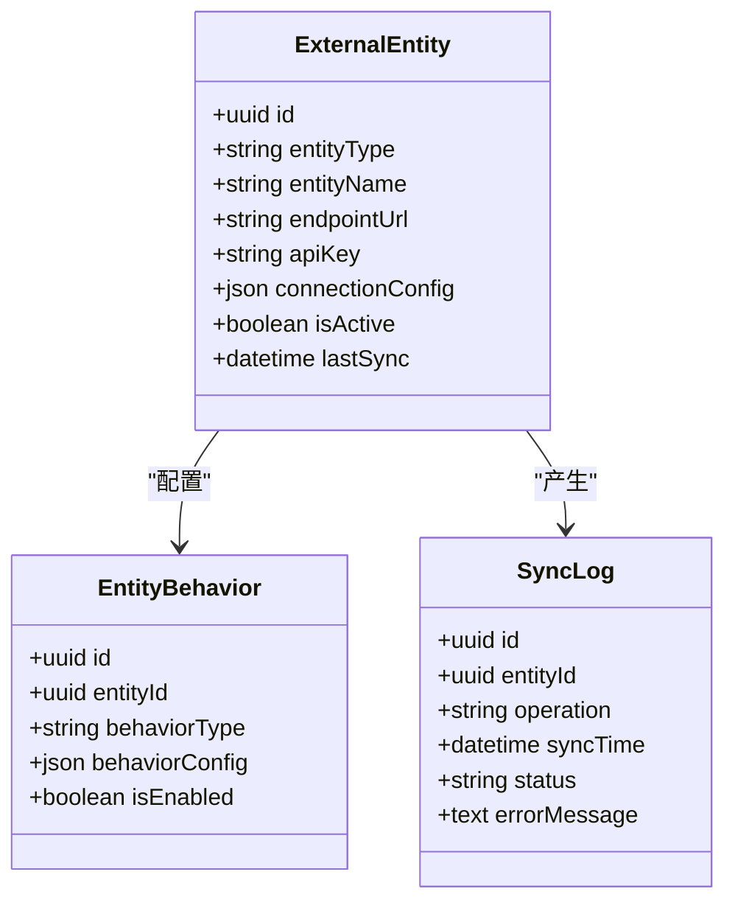

**图表来源**
- [f-m1-09-api.md:1-160](file://docs/06-test-design/modules/project-management/f-m1-09-external-entity/f-m1-09-api.md#L1-L160)
- [f-m1-13-api.md:1-160](file://docs/06-test-design/modules/project-management/f-m1-13-external-entity-behavior/f-m1-13-api.md#L1-L160)

**章节来源**
- [f-m1-08-api.md:1-200](file://docs/06-test-design/modules/project-management/f-m1-08-role/f-m1-08-api.md#L1-L200)
- [f-m1-12-api.md:1-200](file://docs/06-test-design/modules/project-management/f-m1-12-role-behavior/f-m1-12-api.md#L1-L200)
- [f-m1-09-api.md:1-200](file://docs/06-test-design/modules/project-management/f-m1-09-external-entity/f-m1-09-api.md#L1-L200)
- [f-m1-13-api.md:1-200](file://docs/06-test-design/modules/project-management/f-m1-13-external-entity-behavior/f-m1-13-api.md#L1-L200)

## 架构概览

系统采用分层架构设计，确保各组件间的职责分离和松耦合。

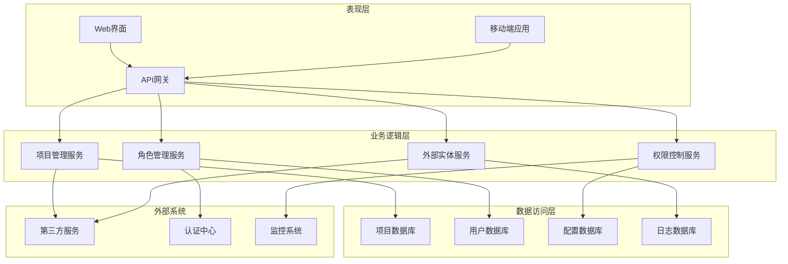

**图表来源**
- [phase1-design-tech.md:1-200](file://docs/04-tech-design/phase1-design-tech.md#L1-L200)
- [domain-model-tech-design.md:1-200](file://docs/04-tech-design/domain-model-tech-design.md#L1-L200)

### 数据流图

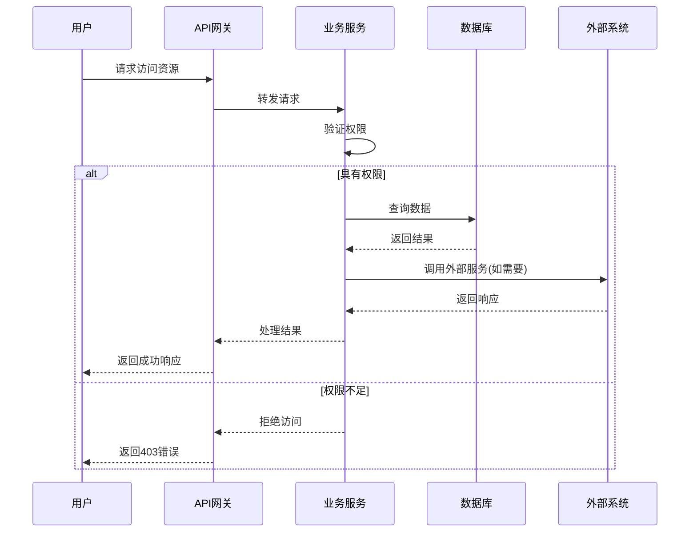

**图表来源**
- [openapi-contract-design.md:1-150](file://docs/04-tech-design/openapi-contract-design.md#L1-L150)

## 详细组件分析

### 项目管理API

项目管理是系统的核心功能模块，提供完整的项目生命周期管理能力。

#### 项目列表API

项目列表API支持分页查询、条件筛选和排序功能，满足不同场景下的项目浏览需求。

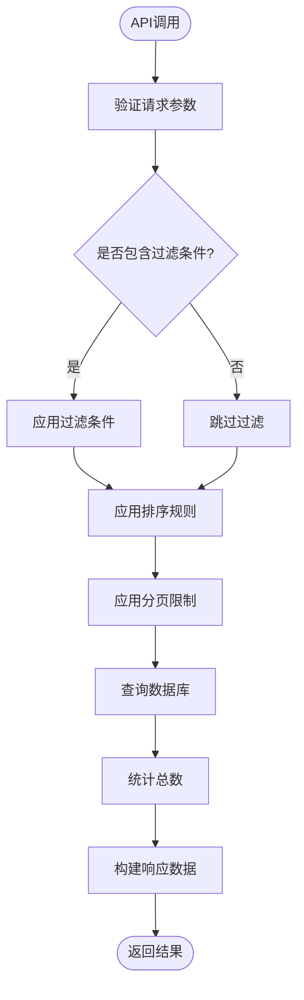

**图表来源**
- [f-m1-01-api.md:1-120](file://docs/06-test-design/modules/project-management/f-m1-01-project-list/f-m1-01-api.md#L1-L120)

#### 项目创建API

项目创建API实现了完整的项目初始化流程，包括基础信息设置、默认配置生成和权限分配。

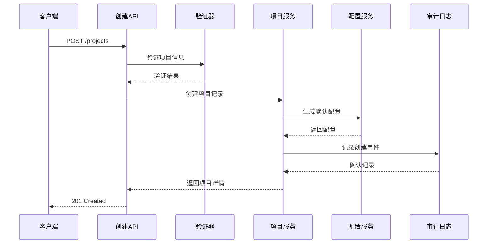

**图表来源**
- [f-m1-02-api.md:1-150](file://docs/06-test-design/modules/project-management/f-m1-02-create-project/f-m1-02-api.md#L1-L150)

**章节来源**
- [f-m1-01-api.md:1-200](file://docs/06-test-design/modules/project-management/f-m1-01-project-list/f-m1-01-api.md#L1-L200)
- [f-m1-02-api.md:1-200](file://docs/06-test-design/modules/project-management/f-m1-02-create-project/f-m1-02-api.md#L1-L200)
- [f-m1-03-api.md:1-200](file://docs/06-test-design/modules/project-management/f-m1-03-project-detail/f-m1-03-api.md#L1-L200)
- [f-m1-04-api.md:1-200](file://docs/06-test-design/modules/project-management/f-m1-04-edit-project/f-m1-04-api.md#L1-L200)
- [f-m1-05-api.md:1-200](file://docs/06-test-design/modules/project-management/f-m1-05-archive/f-m1-05-api.md#L1-L200)

### 组织架构管理API

组织架构管理提供了公司、部门和员工的层级关系管理功能。

#### 公司管理API

公司管理API支持多公司架构，每个公司可以独立配置其业务规则和参数设置。

#### 部门管理API

部门管理API实现了灵活的组织架构，支持部门的创建、调整和合并操作。

**章节来源**
- [f-m1-06-api.md:1-200](file://docs/06-test-design/modules/project-management/f-m1-06-company/f-m1-06-api.md#L1-L200)
- [f-m1-07-api.md:1-200](file://docs/06-test-design/modules/project-management/f-m1-07-department/f-m1-07-api.md#L1-L200)

### 统计分析API

统计分析API提供系统运行数据的聚合和展示功能，支持多种维度的数据分析。

**章节来源**
- [f-m1-10-api.md:1-200](file://docs/06-test-design/modules/project-management/f-m1-10-statistics/f-m1-10-api.md#L1-L200)

## 依赖关系分析

系统各组件间存在清晰的依赖关系，遵循依赖倒置原则，确保系统的可维护性和可扩展性。

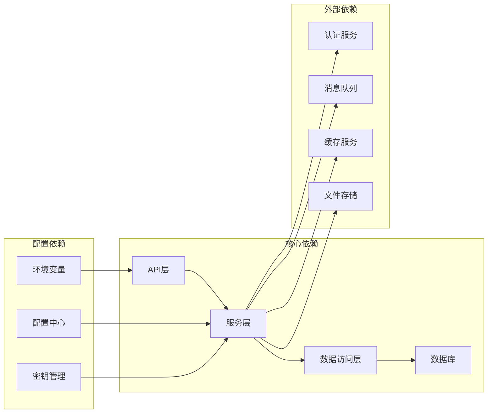

**图表来源**
- [mcp-interface.md:1-150](file://docs/04-tech-design/mcp-interface.md#L1-L150)
- [multi-env-deploy.md:1-200](file://docs/07-deploy-design/multi-env-deploy.md#L1-L200)

### 权限控制机制

系统采用基于角色的访问控制(RBAC)机制，结合行为授权实现细粒度的权限管理。

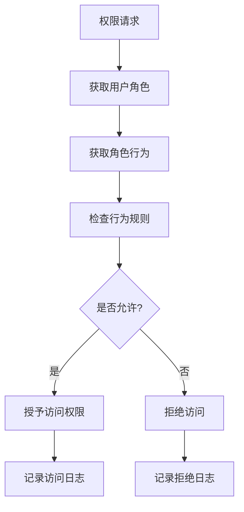

**图表来源**
- [role-behavior-design.md:1-200](file://docs/04-tech-design/role-behavior-design.md#L1-L200)

**章节来源**
- [role-behavior-design.md:1-250](file://docs/04-tech-design/role-behavior-design.md#L1-L250)

## 性能考虑

系统在设计时充分考虑了性能优化，采用了多种技术和策略来提升系统响应速度和吞吐量。

### 缓存策略

系统实现了多层次的缓存机制，包括：

- **Redis缓存**：用户会话、配置参数、频繁查询结果
- **本地缓存**：热点数据的快速访问
- **CDN缓存**：静态资源的全球加速

### 数据库优化

- **索引优化**：为常用查询字段建立复合索引
- **分表分库**：大数据量场景下的水平扩展
- **连接池管理**：优化数据库连接复用

### 异步处理

对于耗时操作，系统采用异步处理模式：

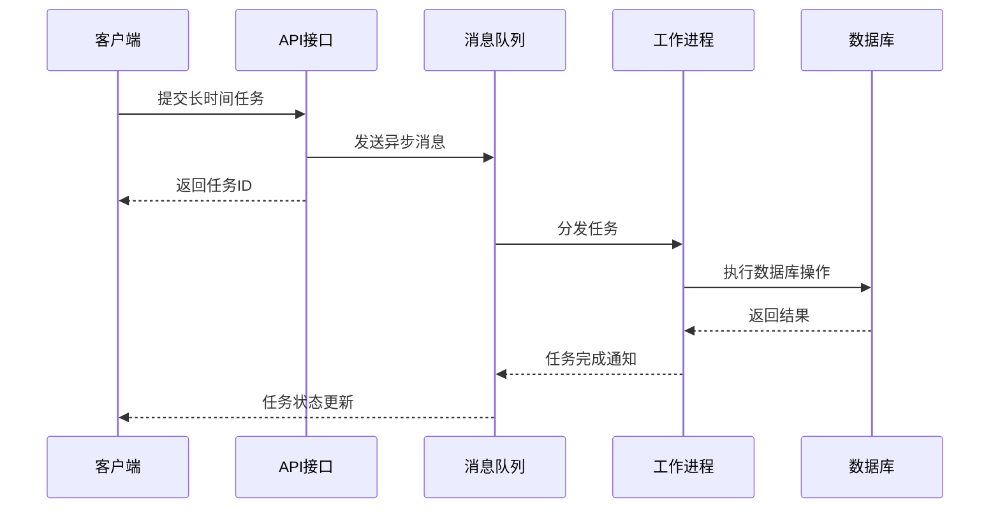

**图表来源**
- [phase1-design-tech.md:1-200](file://docs/04-tech-design/phase1-design-tech.md#L1-L200)

## 故障排除指南

### 常见问题诊断

#### 权限相关问题

当用户遇到权限访问问题时，建议按以下步骤排查：

1. **检查用户角色**：确认用户是否具有正确的角色
2. **验证角色行为**：检查角色是否被赋予相应的行为权限
3. **审查行为规则**：确认行为规则的配置是否正确
4. **查看审计日志**：分析具体的拒绝原因

#### 性能问题诊断

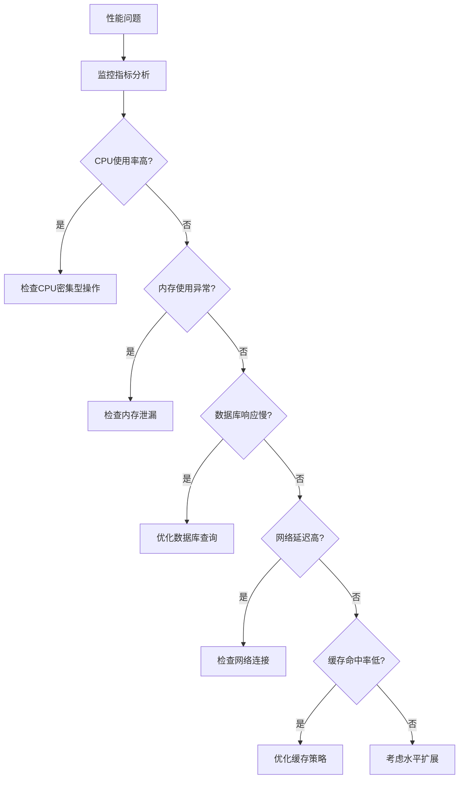

#### 集成问题排查

对于外部系统集成问题，建议：

1. **检查连接配置**：验证API密钥和端点URL
2. **监控同步状态**：查看最近的同步日志
3. **测试网络连通性**：确认防火墙和代理设置
4. **验证数据格式**：确保请求和响应格式符合要求

**章节来源**
- [f-m1-08-roles.test.ts:1-100](file://packages/api/tests/project-management/f-m1-08-roles.test.ts#L1-L100)
- [f-m1-12-role-behavior.test.ts:1-100](file://packages/api/tests/project-management/f-m1-12-role-behavior.test.ts#L1-L100)
- [f-m1-13-external-entity-behavior.test.ts:1-100](file://packages/api/tests/project-management/f-m1-13-external-entity-behavior.test.ts#L1-L100)
- [f-m1-09-external-entities.test.ts:1-100](file://packages/api/tests/project-management/f-m1-09-external-entities.test.ts#L1-L100)

## 结论

AI原型管理系统通过完善的API设计和架构实现，为用户提供了一套功能完整、性能优异的系统管理解决方案。系统的主要特点包括：

- **模块化设计**：清晰的功能模块划分，便于维护和扩展
- **灵活的权限控制**：基于角色的行为授权机制，支持复杂的权限场景
- **高性能架构**：多层缓存和异步处理，确保系统响应速度
- **完善的监控**：全面的日志记录和审计功能
- **可靠的集成**：标准化的API接口和MCP集成方案

未来的发展方向包括进一步优化性能、增强安全防护、完善监控告警机制，以及扩展更多业务场景的支持。

## 附录

### API版本管理

系统采用语义化版本控制，确保API的向后兼容性和演进稳定性。

### 最佳实践

- **错误处理**：统一的错误码和错误信息格式
- **日志规范**：结构化的日志记录和审计追踪
- **安全措施**：输入验证、SQL注入防护、XSS防护
- **性能监控**：关键指标的实时监控和告警

### 技术栈

- **后端框架**：Node.js + Express
- **数据库**：PostgreSQL + Redis
- **缓存**：Redis集群
- **消息队列**：RabbitMQ
- **容器化**：Docker + Kubernetes
- **监控**：Prometheus + Grafana