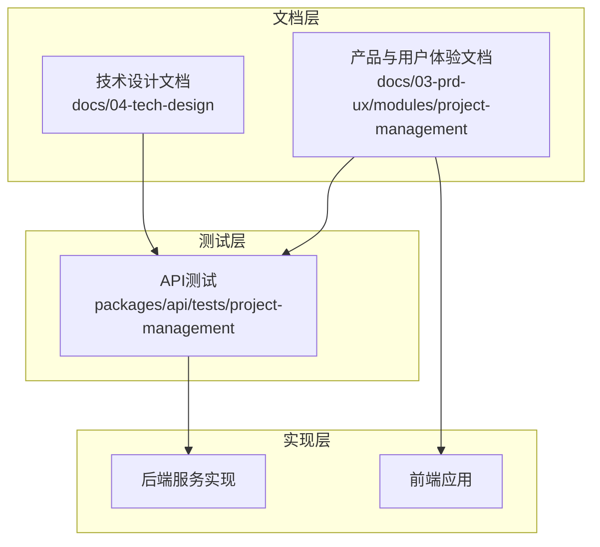
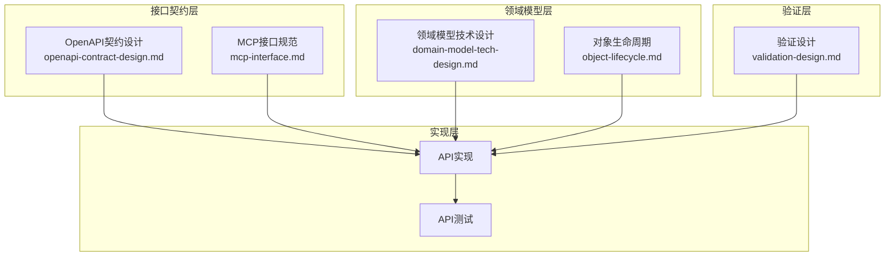
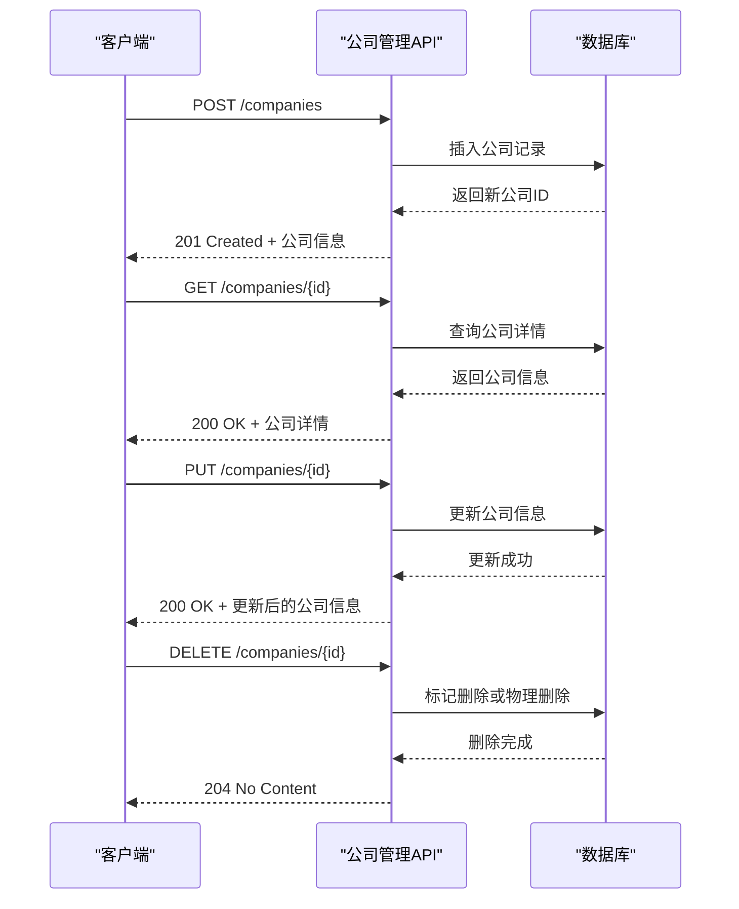
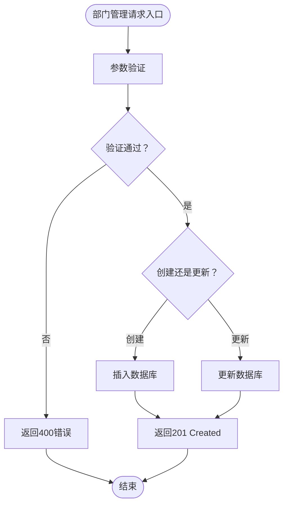
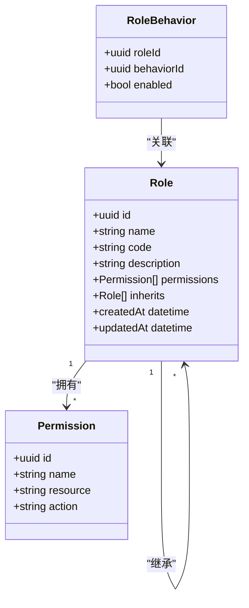
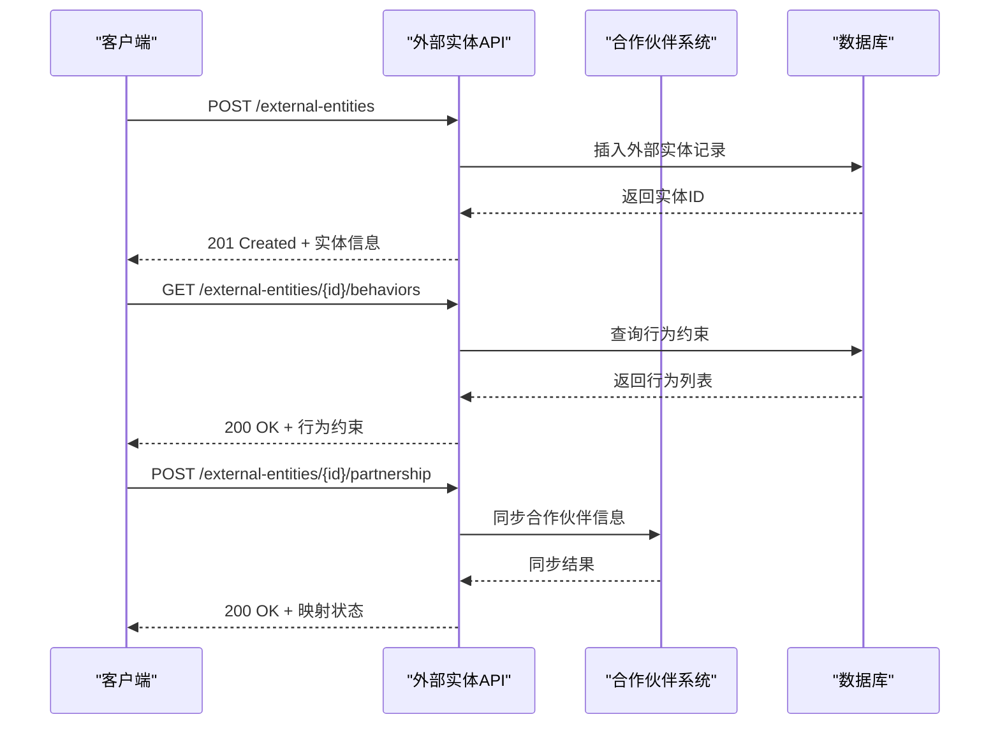
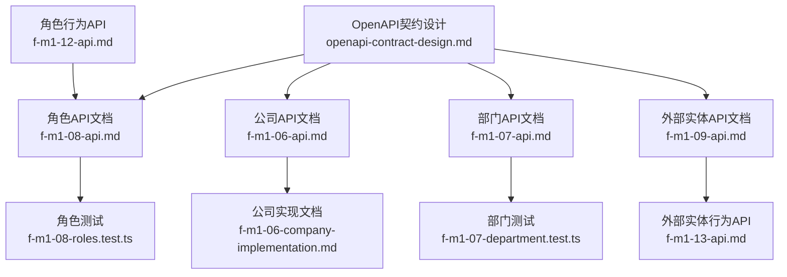

# 组织架构API

<cite>
**本文档引用的文件**
- [f-m1-06-company-implementation.md](file://docs/04-tech-design/f-m1-06-company-implementation.md)
- [f-m1-06-company.md](file://docs/superpowers/plans/2026-05-21-f-m1-06-company.md)
- [f-m1-06-api.md](file://docs/03-prd-ux/modules/project-management/f-m1-06-company/f-m1-06-api.md)
- [f-m1-07-api.md](file://docs/03-prd-ux/modules/project-management/f-m1-07-department/f-m1-07-api.md)
- [f-m1-08-api.md](file://docs/03-prd-ux/modules/project-management/f-m1-08-role/f-m1-08-api.md)
- [f-m1-09-api.md](file://docs/03-prd-ux/modules/project-management/f-m1-09-external-entity/f-m1-09-api.md)
- [f-m1-12-api.md](file://docs/03-prd-ux/modules/project-management/f-m1-12-role-behavior/f-m1-12-api.md)
- [f-m1-13-api.md](file://docs/03-prd-ux/modules/project-management/f-m1-13-external-entity-behavior/f-m1-13-api.md)
- [f-m1-06-company.test.ts](file://packages/api/tests/project-management/f-m1-06-company.test.ts)
- [f-m1-07-department.test.ts](file://packages/api/tests/project-management/f-m1-07-department.test.ts)
- [f-m1-08-roles.test.ts](file://packages/api/tests/project-management/f-m1-08-roles.test.ts)
- [openapi-contract-design.md](file://docs/04-tech-design/openapi-contract-design.md)
- [domain-model-tech-design.md](file://docs/04-tech-design/domain-model-tech-design.md)
- [mcp-interface.md](file://docs/04-tech-design/mcp-interface.md)
- [phase1-design-tech.md](file://docs/04-tech-design/phase1-design-tech.md)
- [object-lifecycle.md](file://docs/04-tech-design/object-lifecycle.md)
- [validation-design.md](file://docs/04-tech-design/validation-design.md)
</cite>

## 目录
1. [简介](#简介)
2. [项目结构](#项目结构)
3. [核心组件](#核心组件)
4. [架构概览](#架构概览)
5. [详细组件分析](#详细组件分析)
6. [依赖关系分析](#依赖关系分析)
7. [性能考虑](#性能考虑)
8. [故障排除指南](#故障排除指南)
9. [结论](#结论)
10. [附录](#附录)

## 简介
本文件为组织架构管理API的详细技术文档，涵盖公司管理、部门管理、角色管理以及外部实体管理的完整API规范。文档基于项目的技术设计文档和产品交互文档，系统性地描述了组织结构的创建、更新、删除和查询接口，解释了层级关系和继承机制的API实现方式，并提供了角色权限分配与管理、外部实体集成与合作伙伴管理的接口规范。

此外，文档还包含了组织架构变更的日志记录与审计功能说明，以及批量导入导出和同步机制的API使用指南，帮助开发者和运维人员正确理解和使用该API体系。

## 项目结构
该项目采用多包（monorepo）结构，API测试位于packages/api/tests中，产品与用户体验文档位于docs/03-prd-ux/modules/project-management下，技术设计文档位于docs/04-tech-design中。API测试文件与产品API文档相互对应，形成完整的测试-文档闭环。

**图表来源**
- [f-m1-06-company-implementation.md](file://docs/04-tech-design/f-m1-06-company-implementation.md)
- [f-m1-06-company.test.ts](file://packages/api/tests/project-management/f-m1-06-company.test.ts)

**章节来源**
- [f-m1-06-company-implementation.md](file://docs/04-tech-design/f-m1-06-company-implementation.md)
- [f-m1-06-company.md](file://docs/superpowers/plans/2026-05-21-f-m1-06-company.md)

## 核心组件
本节概述组织架构API的核心组件，包括公司、部门、角色、外部实体及其行为模块。每个组件都具备标准的CRUD操作接口，并支持层级关系维护与权限继承。

- 公司管理：负责公司信息的创建、查询、更新与删除，支持层级结构与继承机制。
- 部门管理：支持部门的创建、查询、更新、删除，维护与公司的层级关系。
- 角色管理：提供角色的创建、查询、更新、删除，支持权限分配与继承。
- 外部实体管理：用于合作伙伴与外部实体的注册、查询、更新与删除。
- 角色行为与外部实体行为：定义角色权限与外部实体行为的具体约束与验证规则。

**章节来源**
- [f-m1-06-api.md](file://docs/03-prd-ux/modules/project-management/f-m1-06-company/f-m1-06-api.md)
- [f-m1-07-api.md](file://docs/03-prd-ux/modules/project-management/f-m1-07-department/f-m1-07-api.md)
- [f-m1-08-api.md](file://docs/03-prd-ux/modules/project-management/f-m1-08-role/f-m1-08-api.md)
- [f-m1-09-api.md](file://docs/03-prd-ux/modules/project-management/f-m1-09-external-entity/f-m1-09-api.md)
- [f-m1-12-api.md](file://docs/03-prd-ux/modules/project-management/f-m1-12-role-behavior/f-m1-12-api.md)
- [f-m1-13-api.md](file://docs/03-prd-ux/modules/project-management/f-m1-13-external-entity-behavior/f-m1-13-api.md)

## 架构概览
组织架构API采用分层架构设计，结合OpenAPI契约设计与MCP接口规范，确保前后端协作的一致性与可扩展性。技术设计文档明确了对象生命周期、验证规则与接口契约，为API实现提供了坚实基础。

**图表来源**
- [openapi-contract-design.md](file://docs/04-tech-design/openapi-contract-design.md)
- [mcp-interface.md](file://docs/04-tech-design/mcp-interface.md)
- [domain-model-tech-design.md](file://docs/04-tech-design/domain-model-tech-design.md)
- [object-lifecycle.md](file://docs/04-tech-design/object-lifecycle.md)
- [validation-design.md](file://docs/04-tech-design/validation-design.md)

**章节来源**
- [openapi-contract-design.md](file://docs/04-tech-design/openapi-contract-design.md)
- [mcp-interface.md](file://docs/04-tech-design/mcp-interface.md)
- [domain-model-tech-design.md](file://docs/04-tech-design/domain-model-tech-design.md)
- [object-lifecycle.md](file://docs/04-tech-design/object-lifecycle.md)
- [validation-design.md](file://docs/04-tech-design/validation-design.md)

## 详细组件分析

### 公司管理API
公司管理API提供组织架构的顶层控制能力，支持公司信息的全生命周期管理，并通过层级关系与继承机制实现权限与数据的统一管理。

- 创建公司：POST /companies
  - 请求体包含公司名称、编码、上级公司ID等字段
  - 返回新创建公司的完整信息
- 查询公司：GET /companies/{id}
  - 支持按ID精确查询与分页列表查询
- 更新公司：PUT /companies/{id}
  - 支持部分字段更新
- 删除公司：DELETE /companies/{id}
  - 支持软删除与硬删除选项
- 层级查询：GET /companies/{id}/children
  - 返回指定公司的所有子节点
- 权限继承：GET /companies/{id}/permissions
  - 返回继承自上级公司的权限集合

**图表来源**
- [f-m1-06-company-implementation.md](file://docs/04-tech-design/f-m1-06-company-implementation.md)
- [f-m1-06-company.test.ts](file://packages/api/tests/project-management/f-m1-06-company.test.ts)

**章节来源**
- [f-m1-06-company-implementation.md](file://docs/04-tech-design/f-m1-06-company-implementation.md)
- [f-m1-06-company.md](file://docs/superpowers/plans/2026-05-21-f-m1-06-company.md)
- [f-m1-06-api.md](file://docs/03-prd-ux/modules/project-management/f-m1-06-company/f-m1-06-api.md)
- [f-m1-06-company.test.ts](file://packages/api/tests/project-management/f-m1-06-company.test.ts)

### 部门管理API
部门管理API围绕组织内的部门进行全生命周期管理，维护与公司的层级关系，并支持部门内部的权限继承与查询。

- 创建部门：POST /departments
  - 请求体包含部门名称、编码、所属公司ID、上级部门ID等字段
  - 返回新创建部门的完整信息
- 查询部门：GET /departments/{id}
  - 支持按ID精确查询与分页列表查询
- 更新部门：PUT /departments/{id}
  - 支持部分字段更新
- 删除部门：DELETE /departments/{id}
  - 支持软删除与硬删除选项
- 层级查询：GET /departments/{id}/children
  - 返回指定部门的所有子节点
- 成员管理：GET /departments/{id}/members
  - 返回部门成员列表

**图表来源**
- [f-m1-07-api.md](file://docs/03-prd-ux/modules/project-management/f-m1-07-department/f-m1-07-api.md)
- [f-m1-07-department.test.ts](file://packages/api/tests/project-management/f-m1-07-department.test.ts)

**章节来源**
- [f-m1-07-api.md](file://docs/03-prd-ux/modules/project-management/f-m1-07-department/f-m1-07-api.md)
- [f-m1-07-department.test.ts](file://packages/api/tests/project-management/f-m1-07-department.test.ts)

### 角色管理API
角色管理API提供角色的全生命周期管理，支持角色权限的分配与继承，确保组织内权限控制的灵活性与一致性。

- 创建角色：POST /roles
  - 请求体包含角色名称、编码、描述、权限集合等字段
  - 返回新创建角色的完整信息
- 查询角色：GET /roles/{id}
  - 支持按ID精确查询与分页列表查询
- 更新角色：PUT /roles/{id}
  - 支持部分字段更新
- 删除角色：DELETE /roles/{id}
  - 支持软删除与硬删除选项
- 权限分配：POST /roles/{id}/permissions
  - 批量分配权限给角色
- 权限回收：DELETE /roles/{id}/permissions
  - 批量回收角色权限
- 角色继承：GET /roles/{id}/inherits
  - 返回继承的角色列表

**图表来源**
- [f-m1-08-api.md](file://docs/03-prd-ux/modules/project-management/f-m1-08-role/f-m1-08-api.md)
- [f-m1-12-api.md](file://docs/03-prd-ux/modules/project-management/f-m1-12-role-behavior/f-m1-12-api.md)

**章节来源**
- [f-m1-08-api.md](file://docs/03-prd-ux/modules/project-management/f-m1-08-role/f-m1-08-api.md)
- [f-m1-12-api.md](file://docs/03-prd-ux/modules/project-management/f-m1-12-role-behavior/f-m1-12-api.md)
- [f-m1-08-roles.test.ts](file://packages/api/tests/project-management/f-m1-08-roles.test.ts)

### 外部实体管理API
外部实体管理API用于合作伙伴与外部实体的注册、查询、更新与删除，支持与组织内部的权限映射与行为约束。

- 创建外部实体：POST /external-entities
  - 请求体包含实体名称、类型、联系信息、合作范围等字段
  - 返回新创建实体的完整信息
- 查询外部实体：GET /external-entities/{id}
  - 支持按ID精确查询与分页列表查询
- 更新外部实体：PUT /external-entities/{id}
  - 支持部分字段更新
- 删除外部实体：DELETE /external-entities/{id}
  - 支持软删除与硬删除选项
- 行为约束：GET /external-entities/{id}/behaviors
  - 返回实体的行为约束列表
- 合作伙伴映射：POST /external-entities/{id}/partnership
  - 建立与内部组织的合作映射关系

**图表来源**
- [f-m1-09-api.md](file://docs/03-prd-ux/modules/project-management/f-m1-09-external-entity/f-m1-09-api.md)
- [f-m1-13-api.md](file://docs/03-prd-ux/modules/project-management/f-m1-13-external-entity-behavior/f-m1-13-api.md)

**章节来源**
- [f-m1-09-api.md](file://docs/03-prd-ux/modules/project-management/f-m1-09-external-entity/f-m1-09-api.md)
- [f-m1-13-api.md](file://docs/03-prd-ux/modules/project-management/f-m1-13-external-entity-behavior/f-m1-13-api.md)

### 角色行为与外部实体行为
角色行为与外部实体行为模块定义了具体的行为约束与验证规则，确保权限分配与外部实体管理符合业务规范。

- 角色行为验证：POST /role-behaviors/validate
  - 验证角色行为配置的合法性
- 外部实体行为验证：POST /external-entity-behaviors/validate
  - 验证外部实体行为配置的合法性
- 行为冲突检测：GET /behaviors/conflicts
  - 检测角色与外部实体行为之间的冲突

**章节来源**
- [f-m1-12-api.md](file://docs/03-prd-ux/modules/project-management/f-m1-12-role-behavior/f-m1-12-api.md)
- [f-m1-13-api.md](file://docs/03-prd-ux/modules/project-management/f-m1-13-external-entity-behavior/f-m1-13-api.md)

## 依赖关系分析
组织架构API的依赖关系主要体现在技术设计文档与产品API文档的协同上，测试用例作为实现质量的保障，确保API契约与实际实现一致。

**图表来源**
- [f-m1-06-api.md](file://docs/03-prd-ux/modules/project-management/f-m1-06-company/f-m1-06-api.md)
- [f-m1-06-company-implementation.md](file://docs/04-tech-design/f-m1-06-company-implementation.md)
- [f-m1-07-api.md](file://docs/03-prd-ux/modules/project-management/f-m1-07-department/f-m1-07-api.md)
- [f-m1-07-department.test.ts](file://packages/api/tests/project-management/f-m1-07-department.test.ts)
- [f-m1-08-api.md](file://docs/03-prd-ux/modules/project-management/f-m1-08-role/f-m1-08-api.md)
- [f-m1-08-roles.test.ts](file://packages/api/tests/project-management/f-m1-08-roles.test.ts)
- [f-m1-09-api.md](file://docs/03-prd-ux/modules/project-management/f-m1-09-external-entity/f-m1-09-api.md)
- [f-m1-13-api.md](file://docs/03-prd-ux/modules/project-management/f-m1-13-external-entity-behavior/f-m1-13-api.md)
- [f-m1-12-api.md](file://docs/03-prd-ux/modules/project-management/f-m1-12-role-behavior/f-m1-12-api.md)
- [openapi-contract-design.md](file://docs/04-tech-design/openapi-contract-design.md)

**章节来源**
- [f-m1-06-api.md](file://docs/03-prd-ux/modules/project-management/f-m1-06-company/f-m1-06-api.md)
- [f-m1-07-api.md](file://docs/03-prd-ux/modules/project-management/f-m1-07-department/f-m1-07-api.md)
- [f-m1-08-api.md](file://docs/03-prd-ux/modules/project-management/f-m1-08-role/f-m1-08-api.md)
- [f-m1-09-api.md](file://docs/03-prd-ux/modules/project-management/f-m1-09-external-entity/f-m1-09-api.md)
- [f-m1-12-api.md](file://docs/03-prd-ux/modules/project-management/f-m1-12-role-behavior/f-m1-12-api.md)
- [f-m1-13-api.md](file://docs/03-prd-ux/modules/project-management/f-m1-13-external-entity-behavior/f-m1-13-api.md)
- [openapi-contract-design.md](file://docs/04-tech-design/openapi-contract-design.md)

## 性能考虑
- 分页查询：所有列表查询接口均支持分页参数，建议在大数据量场景下合理设置分页大小以优化响应时间。
- 缓存策略：对于频繁访问的静态数据（如公司与部门的基础信息），建议引入缓存层减少数据库压力。
- 批量操作：权限分配与回收支持批量处理，建议在权限变更频繁的场景下使用批量接口以减少网络往返。
- 并发控制：在高并发场景下，建议对关键写操作（创建、更新、删除）实施乐观锁或分布式锁机制。
- 日志与监控：建议在关键接口增加调用统计与错误日志，便于性能分析与问题定位。

## 故障排除指南
- 参数验证失败：检查请求体中的必填字段是否完整，字段类型是否正确，长度是否超出限制。
- 权限不足：确认当前用户是否具有相应角色的权限，检查角色继承链与外部实体行为约束。
- 数据一致性：在批量操作后，建议进行数据一致性校验，确保数据库状态与预期一致。
- 接口超时：对于大查询或复杂计算，建议拆分为多个小请求或异步处理，避免长时间阻塞。
- 测试覆盖：参考API测试文件中的用例，确保关键场景（正常、异常、边界）均有覆盖。

**章节来源**
- [f-m1-06-company.test.ts](file://packages/api/tests/project-management/f-m1-06-company.test.ts)
- [f-m1-07-department.test.ts](file://packages/api/tests/project-management/f-m1-07-department.test.ts)
- [f-m1-08-roles.test.ts](file://packages/api/tests/project-management/f-m1-08-roles.test.ts)

## 结论
组织架构API通过清晰的分层设计与完善的契约规范，实现了公司、部门、角色与外部实体的全生命周期管理。借助层级关系与继承机制，系统能够灵活地处理复杂的权限分配与数据管理需求。配合角色行为与外部实体行为的约束验证，确保了权限控制的准确性与合规性。同时，通过OpenAPI契约与测试用例的协同，保证了API实现的质量与稳定性。

## 附录
- 批量导入导出：建议在现有API基础上扩展批量导入导出接口，支持CSV/Excel格式的数据导入与导出，便于与第三方系统的数据交换。
- 同步机制：建议实现增量同步接口，支持与外部系统（如HR系统、合作伙伴平台）的实时数据同步，确保组织架构数据的一致性。
- 审计日志：建议在所有写操作接口中增加审计日志记录，包括操作人、操作时间、操作类型、影响范围等信息，便于追溯与合规检查。