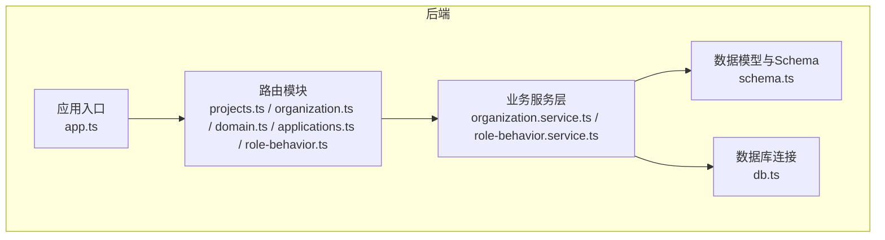
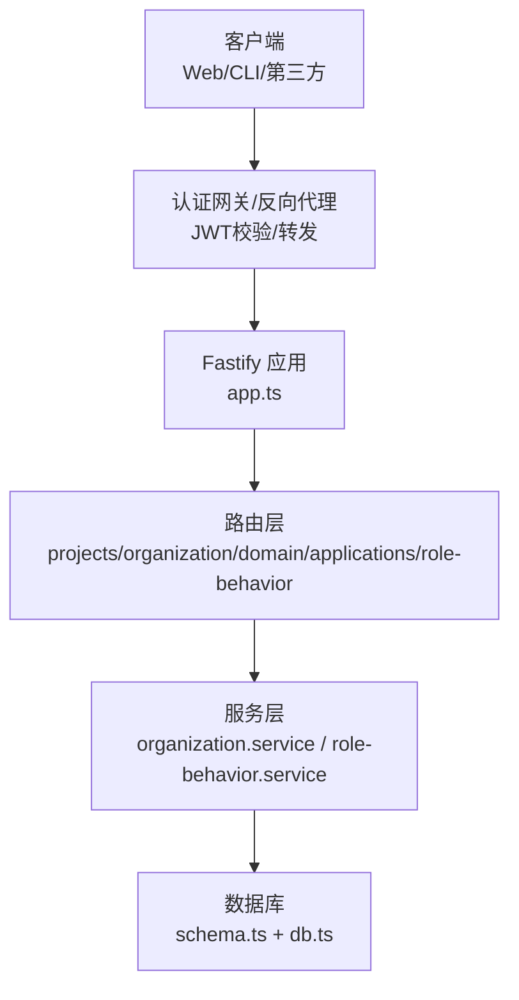
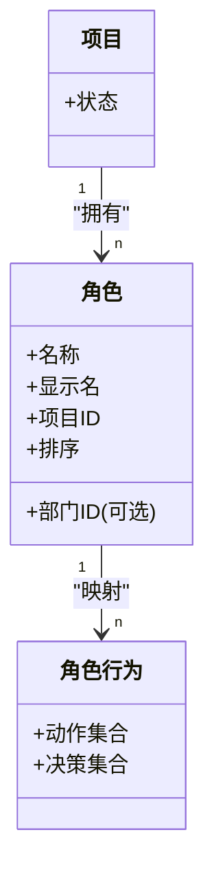
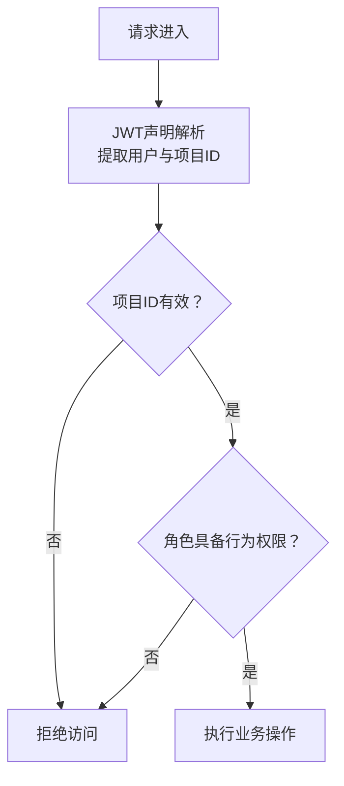
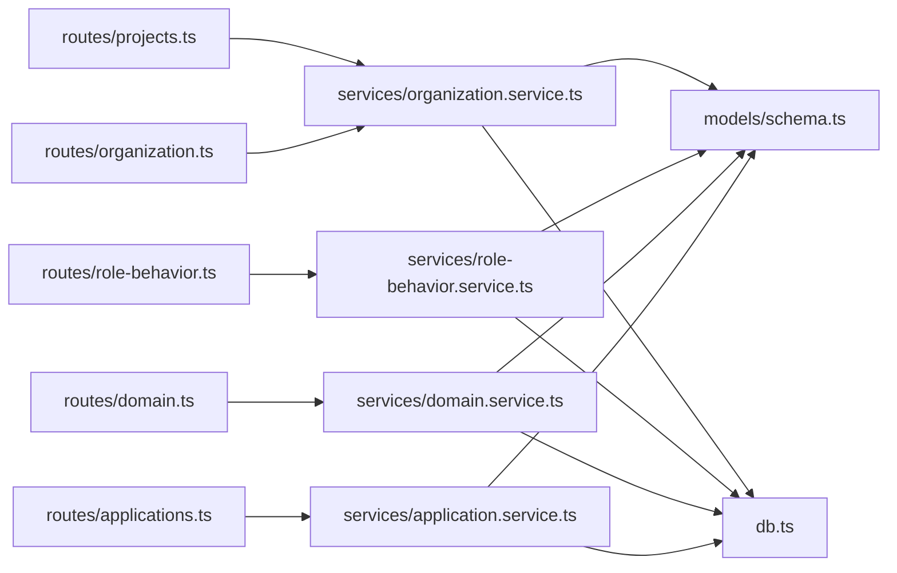

# 认证与授权

<cite>
**本文引用的文件**
- [packages/api/src/app.ts](file://packages/api/src/app.ts)
- [packages/api/src/routes/projects.ts](file://packages/api/src/routes/projects.ts)
- [packages/api/src/routes/organization.ts](file://packages/api/src/routes/organization.ts)
- [packages/api/src/routes/domain.ts](file://packages/api/src/routes/domain.ts)
- [packages/api/src/routes/applications.ts](file://packages/api/src/routes/applications.ts)
- [packages/api/src/routes/role-behavior.ts](file://packages/api/src/routes/role-behavior.ts)
- [packages/api/src/services/organization.service.ts](file://packages/api/src/services/organization.service.ts)
- [packages/api/src/services/role-behavior.service.ts](file://packages/api/src/services/role-behavior.service.ts)
- [packages/api/src/models/schema.ts](file://packages/api/src/models/schema.ts)
- [packages/api/src/db.ts](file://packages/api/src/db.ts)
- [packages/api/tests/openapi/openapi-schema.test.ts](file://packages/api/tests/openapi/openapi-schema.test.ts)
- [packages/web/src/api/client.ts](file://packages/web/src/api/client.ts)
- [docs/03-prd-ux/modules/project-management/project-management-prd-2.md](file://docs/03-prd-ux/modules/project-management/project-management-prd-2.md)
- [docs/04-tech-design/openapi-contract-design.md](file://docs/04-tech-design/openapi-contract-design.md)
</cite>

## 目录
1. [引言](#引言)
2. [项目结构](#项目结构)
3. [核心组件](#核心组件)
4. [架构总览](#架构总览)
5. [详细组件分析](#详细组件分析)
6. [依赖分析](#依赖分析)
7. [性能考虑](#性能考虑)
8. [故障排查指南](#故障排查指南)
9. [结论](#结论)
10. [附录](#附录)

## 引言
本文件面向AI原型管理系统（APM）的认证与授权机制，聚焦以下目标：
- 明确当前阶段的认证现状与后续演进方向（OpenAPI安全方案预留、JWT Bearer待启用）。
- 解释用户身份验证与会话管理策略（当前未内置会话持久化，建议采用无状态令牌）。
- 详述权限控制体系（RBAC最小可行模型、角色与行为映射、项目级访问控制）。
- 提供API密钥与OAuth集成的实施建议（基于OpenAPI安全方案预留）。
- 说明多租户场景下的权限隔离思路（以项目为租户边界）。
- 总结认证中间件实现要点与安全最佳实践，并给出客户端集成示例与常见问题排查。

## 项目结构
APM后端采用Fastify服务，API路由按模块划分（项目、领域模型、组织、应用、角色行为等），统一在应用入口注册。OpenAPI规范与Schema校验贯穿各模块，为后续启用JWT认证与细粒度权限控制奠定基础。

图表来源
- [packages/api/src/app.ts](file://packages/api/src/app.ts)
- [packages/api/src/routes/projects.ts](file://packages/api/src/routes/projects.ts)
- [packages/api/src/routes/organization.ts](file://packages/api/src/routes/organization.ts)
- [packages/api/src/routes/domain.ts](file://packages/api/src/routes/domain.ts)
- [packages/api/src/routes/applications.ts](file://packages/api/src/routes/applications.ts)
- [packages/api/src/routes/role-behavior.ts](file://packages/api/src/routes/role-behavior.ts)
- [packages/api/src/services/organization.service.ts](file://packages/api/src/services/organization.service.ts)
- [packages/api/src/services/role-behavior.service.ts](file://packages/api/src/services/role-behavior.service.ts)
- [packages/api/src/models/schema.ts](file://packages/api/src/models/schema.ts)
- [packages/api/src/db.ts](file://packages/api/src/db.ts)

章节来源
- [packages/api/src/app.ts](file://packages/api/src/app.ts)
- [packages/api/src/routes/projects.ts](file://packages/api/src/routes/projects.ts)
- [packages/api/src/routes/organization.ts](file://packages/api/src/routes/organization.ts)
- [packages/api/src/routes/domain.ts](file://packages/api/src/routes/domain.ts)
- [packages/api/src/routes/applications.ts](file://packages/api/src/routes/applications.ts)
- [packages/api/src/routes/role-behavior.ts](file://packages/api/src/routes/role-behavior.ts)

## 核心组件
- 应用入口与路由注册：统一在应用入口集中注册各模块路由，便于集中治理与扩展。
- 路由与Schema：各模块路由均采用Fastify原生Schema进行请求校验与OpenAPI文档生成，为后续启用JWT Bearer认证提供契约基础。
- 业务服务层：围绕组织与角色行为的服务实现，体现项目级访问控制与角色行为约束。
- 数据模型与数据库：通过Drizzle ORM与Schema定义实体关系，支撑权限隔离与审计需求。

章节来源
- [packages/api/src/app.ts](file://packages/api/src/app.ts)
- [packages/api/src/routes/projects.ts](file://packages/api/src/routes/projects.ts)
- [packages/api/src/routes/organization.ts](file://packages/api/src/routes/organization.ts)
- [packages/api/src/services/organization.service.ts](file://packages/api/src/services/organization.service.ts)
- [packages/api/src/services/role-behavior.service.ts](file://packages/api/src/services/role-behavior.service.ts)
- [packages/api/src/models/schema.ts](file://packages/api/src/models/schema.ts)
- [packages/api/src/db.ts](file://packages/api/src/db.ts)

## 架构总览
APM当前未内置认证中间件与会话存储；认证能力通过OpenAPI安全方案预留，建议在网关或反向代理层统一接入JWT认证，或在Fastify中间件层实现无状态令牌校验。权限控制以“项目”为租户边界，结合角色与行为映射实现最小可行RBAC。

图表来源
- [packages/api/src/app.ts](file://packages/api/src/app.ts)
- [packages/api/src/routes/projects.ts](file://packages/api/src/routes/projects.ts)
- [packages/api/src/routes/organization.ts](file://packages/api/src/routes/organization.ts)
- [packages/api/src/routes/domain.ts](file://packages/api/src/routes/domain.ts)
- [packages/api/src/routes/applications.ts](file://packages/api/src/routes/applications.ts)
- [packages/api/src/routes/role-behavior.ts](file://packages/api/src/routes/role-behavior.ts)
- [packages/api/src/services/organization.service.ts](file://packages/api/src/services/organization.service.ts)
- [packages/api/src/services/role-behavior.service.ts](file://packages/api/src/services/role-behavior.service.ts)
- [packages/api/src/models/schema.ts](file://packages/api/src/models/schema.ts)
- [packages/api/src/db.ts](file://packages/api/src/db.ts)

## 详细组件分析

### 认证与会话管理策略
- 当前现状：未发现内置认证中间件与会话持久化逻辑；健康检查与业务路由均未强制要求认证。
- 推荐策略：
  - 采用无状态JWT令牌（Bearer），避免服务端会话存储，便于水平扩展。
  - 在网关或反向代理层完成JWT解码、签名校验与声明提取，Fastify路由保持无侵入式。
  - 对关键路由启用OpenAPI安全方案（securitySchemes），确保契约一致。
- 客户端集成要点：
  - 将Authorization: Bearer <token>注入请求头。
  - 失败时根据HTTP状态码与错误响应结构处理（参考OpenAPI错误契约）。

章节来源
- [packages/api/src/app.ts](file://packages/api/src/app.ts)
- [docs/04-tech-design/openapi-contract-design.md](file://docs/04-tech-design/openapi-contract-design.md)

### 权限控制系统（RBAC最小可行模型）
- 角色与行为：
  - 系统角色：项目经理（pm）、研发人员（developer）、测试工程师（tester）。
  - 行为映射：通过角色行为（role-behavior）将动作/决策与角色绑定，限制写操作。
- 项目级隔离：
  - 角色与行为均限定在项目维度，防止跨项目越权。
  - 项目状态（如归档）影响角色行为修改操作的可用性。
- 最小可行权限边界：
  - MVP阶段仅隔离读写边界，后续可扩展到字段级与记录级控制。

图表来源
- [packages/api/src/services/organization.service.ts](file://packages/api/src/services/organization.service.ts)
- [packages/api/src/services/role-behavior.service.ts](file://packages/api/src/services/role-behavior.service.ts)
- [packages/api/src/models/schema.ts](file://packages/api/src/models/schema.ts)

章节来源
- [docs/03-prd-ux/modules/project-management/project-management-prd-2.md](file://docs/03-prd-ux/modules/project-management/project-management-prd-2.md)
- [packages/api/src/services/organization.service.ts](file://packages/api/src/services/organization.service.ts)
- [packages/api/src/services/role-behavior.service.ts](file://packages/api/src/services/role-behavior.service.ts)

### API密钥与OAuth集成指南
- API密钥：
  - 建议通过OpenAPI securitySchemes定义API Key方案，配合网关进行密钥校验与配额控制。
- OAuth：
  - 建议通过OpenAPI securitySchemes定义OAuth2方案，结合网关完成授权码/客户端凭证流程，颁发JWT供后端无状态校验。
- 安全最佳实践：
  - 使用HTTPS传输，短生命周期令牌，定期轮换密钥/密文。
  - 在网关层统一鉴权，后端路由保持无状态。

章节来源
- [docs/04-tech-design/openapi-contract-design.md](file://docs/04-tech-design/openapi-contract-design.md)

### 多租户权限隔离机制
- 租户边界：以“项目”作为多租户隔离单元，所有资源均与项目ID关联。
- 访问控制：
  - 读取/写入操作均需满足角色与行为映射。
  - 项目归档状态下禁止修改角色行为。
- 扩展建议：未来可引入部门/公司层级，形成更细粒度的组织树与继承关系。

图表来源
- [packages/api/src/services/organization.service.ts](file://packages/api/src/services/organization.service.ts)
- [packages/api/src/services/role-behavior.service.ts](file://packages/api/src/services/role-behavior.service.ts)

章节来源
- [packages/api/src/services/organization.service.ts](file://packages/api/src/services/organization.service.ts)
- [packages/api/src/services/role-behavior.service.ts](file://packages/api/src/services/role-behavior.service.ts)

### 认证中间件实现细节与安全最佳实践
- 中间件职责：
  - 解析Authorization头，校验签名与有效期。
  - 提取用户标识与项目上下文，注入到请求上下文。
- 安全最佳实践：
  - 使用强随机密钥与安全算法（如HS256或RS256）。
  - 严格控制声明（claims）范围，避免过度授权。
  - 对敏感端点启用速率限制与IP白名单。
  - 审计日志记录认证事件与失败原因。

章节来源
- [docs/04-tech-design/openapi-contract-design.md](file://docs/04-tech-design/openapi-contract-design.md)

### 客户端集成示例
- Web端调用示例（基于通用API客户端封装）：
  - GET/POST/PUT/DELETE请求均支持统一错误处理与元信息返回。
  - 建议在拦截器中自动附加Authorization头与X-Request-ID等追踪信息。
- 示例路径参考：
  - [packages/web/src/api/client.ts](file://packages/web/src/api/client.ts)

章节来源
- [packages/web/src/api/client.ts](file://packages/web/src/api/client.ts)

## 依赖分析
- 路由到服务的依赖：各模块路由依赖对应服务层实现，服务层依赖数据模型与数据库连接。
- OpenAPI与Schema：路由层通过Fastify Schema与OpenAPI契约约束输入输出，测试用例验证契约完整性。
- 安全方案：OpenAPI已预留securitySchemes，为JWT Bearer与OAuth2提供契约基础。

图表来源
- [packages/api/src/routes/projects.ts](file://packages/api/src/routes/projects.ts)
- [packages/api/src/routes/organization.ts](file://packages/api/src/routes/organization.ts)
- [packages/api/src/routes/domain.ts](file://packages/api/src/routes/domain.ts)
- [packages/api/src/routes/applications.ts](file://packages/api/src/routes/applications.ts)
- [packages/api/src/routes/role-behavior.ts](file://packages/api/src/routes/role-behavior.ts)
- [packages/api/src/services/organization.service.ts](file://packages/api/src/services/organization.service.ts)
- [packages/api/src/services/role-behavior.service.ts](file://packages/api/src/services/role-behavior.service.ts)
- [packages/api/src/models/schema.ts](file://packages/api/src/models/schema.ts)
- [packages/api/src/db.ts](file://packages/api/src/db.ts)

章节来源
- [packages/api/src/routes/projects.ts](file://packages/api/src/routes/projects.ts)
- [packages/api/src/routes/organization.ts](file://packages/api/src/routes/organization.ts)
- [packages/api/src/routes/domain.ts](file://packages/api/src/routes/domain.ts)
- [packages/api/src/routes/applications.ts](file://packages/api/src/routes/applications.ts)
- [packages/api/src/routes/role-behavior.ts](file://packages/api/src/routes/role-behavior.ts)
- [packages/api/src/services/organization.service.ts](file://packages/api/src/services/organization.service.ts)
- [packages/api/src/services/role-behavior.service.ts](file://packages/api/src/services/role-behavior.service.ts)
- [packages/api/src/models/schema.ts](file://packages/api/src/models/schema.ts)
- [packages/api/src/db.ts](file://packages/api/src/db.ts)

## 性能考虑
- 无状态令牌：减少服务端会话存储开销，提升横向扩展能力。
- 网关前置：将认证与速率限制放在网关层，降低后端压力。
- Schema缓存：利用Fastify Schema与OpenAPI契约减少运行时校验成本。
- 数据库索引：围绕项目ID、角色ID、行为键建立索引，优化权限查询。

## 故障排查指南
- 常见问题与定位：
  - 401/403：检查Authorization头格式与令牌有效性；确认令牌声明与项目上下文匹配。
  - 400：检查请求体是否符合Fastify Schema；OpenAPI契约测试可辅助定位。
  - 5xx：检查数据库连通性与服务层异常处理。
- 契约验证：
  - OpenAPI契约测试覆盖全部端点数量，可用于回归验证。

章节来源
- [packages/api/tests/openapi/openapi-schema.test.ts](file://packages/api/tests/openapi/openapi-schema.test.ts)
- [packages/api/src/app.ts](file://packages/api/src/app.ts)

## 结论
APM当前处于认证与权限的演进起点：OpenAPI安全方案已预留，业务服务层具备项目级RBAC最小可行模型。建议尽快在网关层启用JWT Bearer认证与OAuth2集成，并持续完善权限粒度与审计能力，以支撑多租户与复杂组织形态的权限治理。

## 附录
- 客户端调用封装参考：[packages/web/src/api/client.ts](file://packages/web/src/api/client.ts)
- 技术设计文档（OpenAPI安全方案预留）：[docs/04-tech-design/openapi-contract-design.md](file://docs/04-tech-design/openapi-contract-design.md)