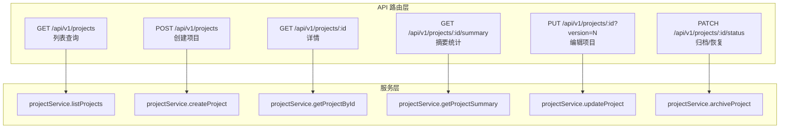
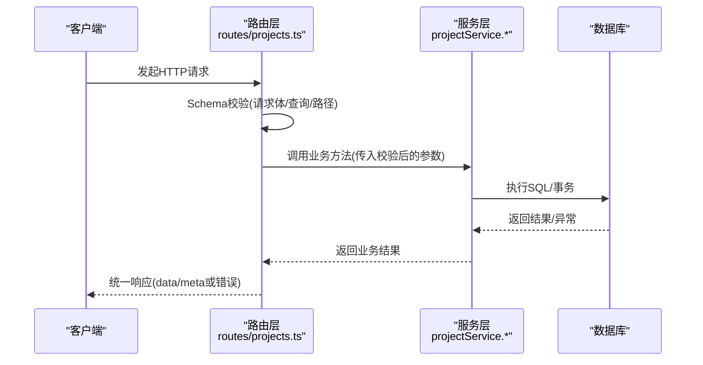
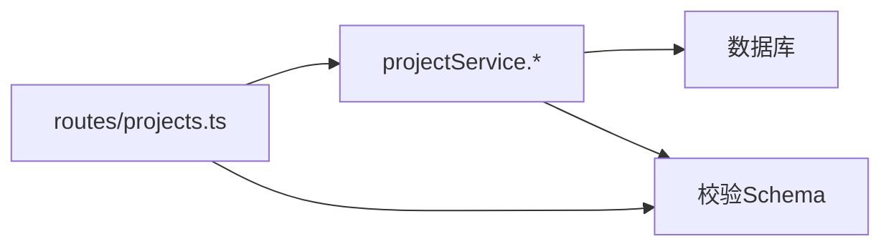

# 项目管理API

<cite>
**本文引用的文件**
- [packages/api/src/routes/projects.ts](file://packages/api/src/routes/projects.ts)
- [docs/06-test-design/modules/project-management/f-m1-01-project-list/f-m1-01-api.md](file://docs/06-test-design/modules/project-management/f-m1-01-project-list/f-m1-01-api.md)
- [docs/06-test-design/modules/project-management/f-m1-02-create-project/f-m1-02-api.md](file://docs/06-test-design/modules/project-management/f-m1-02-create-project/f-m1-02-api.md)
- [docs/06-test-design/modules/project-management/f-m1-03-project-detail/f-m1-03-api.md](file://docs/06-test-design/modules/project-management/f-m1-03-project-detail/f-m1-03-api.md)
- [docs/06-test-design/modules/project-management/f-m1-04-edit-project/f-m1-04-api.md](file://docs/06-test-design/modules/project-management/f-m1-04-edit-project/f-m1-04-api.md)
- [docs/06-test-design/modules/project-management/f-m1-05-archive/f-m1-05-api.md](file://docs/06-test-design/modules/project-management/f-m1-05-archive/f-m1-05-api.md)
</cite>

## 目录
1. [简介](#简介)
2. [项目结构](#项目结构)
3. [核心组件](#核心组件)
4. [架构总览](#架构总览)
5. [详细组件分析](#详细组件分析)
6. [依赖分析](#依赖分析)
7. [性能考虑](#性能考虑)
8. [故障排查指南](#故障排查指南)
9. [结论](#结论)
10. [附录](#附录)

## 简介
本文件为“项目管理API”的完整接口文档，覆盖项目列表查询、项目创建、项目详情查看、项目编辑以及项目归档/恢复等核心功能。文档基于仓库中的测试用例与路由实现，系统性地描述了每个端点的HTTP方法、URL路径、请求参数、响应格式、错误码，并提供请求与响应示例路径、状态管理与生命周期控制、权限与协作机制、批量与分页最佳实践，以及API调用限制与性能优化建议。

## 项目结构
- API路由集中在项目管理模块，采用Fastify插件形式注册，前缀为 /api/v1/projects。
- 路由定义与OpenAPI Schema校验结合，确保请求参数与响应结构的一致性。
- 项目管理涉及五大功能点：列表查询(F-M1-01)、创建(F-M1-02)、详情(F-M1-03)、编辑(F-M1-04)、归档/恢复(F-M1-05)。

图表来源
- [packages/api/src/routes/projects.ts:30-132](file://packages/api/src/routes/projects.ts#L30-L132)

章节来源
- [packages/api/src/routes/projects.ts:1-132](file://packages/api/src/routes/projects.ts#L1-L132)

## 核心组件
- 路由注册：统一在Fastify插件中注册，每个端点绑定对应的Schema与处理器。
- 请求校验：通过TypeBox Schema进行请求体、查询参数、路径参数的强类型校验。
- 响应封装：统一返回带data的信封结构；列表端点额外返回meta分页信息。
- 错误处理：统一错误响应结构，配合状态码表达业务错误类型。

章节来源
- [packages/api/src/routes/projects.ts:30-132](file://packages/api/src/routes/projects.ts#L30-L132)

## 架构总览
项目管理API采用“路由层 -> 服务层 -> 数据库”的分层架构。路由层负责HTTP协议与Schema校验，服务层负责业务逻辑与乐观锁控制，数据库层负责持久化与约束（如UNIQUE、外键）。

图表来源
- [packages/api/src/routes/projects.ts:138-194](file://packages/api/src/routes/projects.ts#L138-L194)

## 详细组件分析

### 1) 项目列表查询
- 方法与路径
  - GET /api/v1/projects
- 认证与授权
  - Bearer Token（PM角色）
- 查询参数
  - search: 模糊搜索项目name（ILIKE，最大长度50）
  - status: 枚举 active/archived（默认返回全部活跃+归档）
  - page: 页码（默认1，边界保护：page=0通常被纠正为1或报错）
  - pageSize: 每页数量（枚举值校验）
  - sort: 排序字段（仅允许有限字段）
  - order: asc/desc
- 响应
  - data: 项目数组（列表不返回description/config）
  - meta: total/page/pageSize
- 错误码
  - 400: 参数校验错误（search长度、status枚举、sort字段、order枚举、page/pageSize枚举）
  - 404: 无数据时返回空数组（非错误）
  - 500: 服务端内部错误
- 请求示例与响应示例
  - 请求示例路径：[TC-API-M1-01-001:41-48](file://docs/06-test-design/modules/project-management/f-m1-01-project-list/f-m1-01-api.md#L41-L48)，[TC-API-M1-01-002:87-93](file://docs/06-test-design/modules/project-management/f-m1-01-project-list/f-m1-01-api.md#L87-L93)，[TC-API-M1-01-003:117-123](file://docs/06-test-design/modules/project-management/f-m1-01-project-list/f-m1-01-api.md#L117-L123)
  - 响应示例路径：[TC-API-M1-01-001:47-61](file://docs/06-test-design/modules/project-management/f-m1-01-project-list/f-m1-01-api.md#L47-L61)，[TC-API-M1-01-002:93-101](file://docs/06-test-design/modules/project-management/f-m1-01-project-list/f-m1-01-api.md#L93-L101)
- 分页与排序最佳实践
  - 默认pageSize=20；合理设置pageSize上限，避免过大请求导致性能问题。
  - sort字段白名单控制，order仅允许asc/desc。
- 性能建议
  - 对search、status建立索引；对updatedAt等排序字段建立索引。
  - 列表接口避免select *，仅返回必要字段。

章节来源
- [packages/api/src/routes/projects.ts:32-44](file://packages/api/src/routes/projects.ts#L32-L44)
- [docs/06-test-design/modules/project-management/f-m1-01-project-list/f-m1-01-api.md:1-748](file://docs/06-test-design/modules/project-management/f-m1-01-project-list/f-m1-01-api.md#L1-L748)

### 2) 创建项目
- 方法与路径
  - POST /api/v1/projects
- 认证与授权
  - Bearer Token（PM角色）
- 请求体字段
  - name: 必填，小写字母开头，仅允许[a-z0-9_-]，长度2~50
  - display_name: 必填，长度1~100
  - description: 可选，长度<=500
- 响应
  - data: 完整项目对象（含status=active、version=1、config={}）
- 错误码
  - 400: 参数校验错误（name格式/长度、display_name必填/长度、字段白名单）
  - 409: NAME_CONFLICT（name全局唯一冲突）
  - 500: 服务端内部错误
- 请求示例与响应示例
  - 请求示例路径：[TC-API-M1-02-001:39-44](file://docs/06-test-design/modules/project-management/f-m1-02-create-project/f-m1-02-api.md#L39-L44)，[TC-API-M1-02-002:85-90](file://docs/06-test-design/modules/project-management/f-m1-02-create-project/f-m1-02-api.md#L85-L90)
  - 响应示例路径：[TC-API-M1-02-001:46-60](file://docs/06-test-design/modules/project-management/f-m1-02-create-project/f-m1-02-api.md#L46-L60)，[TC-API-M1-02-002:92-100](file://docs/06-test-design/modules/project-management/f-m1-02-create-project/f-m1-02-api.md#L92-L100)
- 并发与幂等
  - 并发创建同名项目时，UNIQUE约束保证恰好一个成功，另一个返回409。
- 性能建议
  - 前端尽量避免重复提交；服务端使用幂等键或去重策略降低冲突概率。

章节来源
- [packages/api/src/routes/projects.ts:46-60](file://packages/api/src/routes/projects.ts#L46-L60)
- [docs/06-test-design/modules/project-management/f-m1-02-create-project/f-m1-02-api.md:1-573](file://docs/06-test-design/modules/project-management/f-m1-02-create-project/f-m1-02-api.md#L1-L573)

### 3) 项目详情查看
- 方法与路径
  - GET /api/v1/projects/:id
  - GET /api/v1/projects/:id/summary
- 认证与授权
  - Bearer Token（PM角色）
- 路径参数
  - id: UUID v4
- 响应
  - 详情：完整字段（含description/config）
  - 摘要：各子模块计数（domainEntityCount/processCount/companyCount/departmentCount/roleCount/externalEntityCount）
- 错误码
  - 400: UUID格式校验失败
  - 404: 项目不存在
  - 500: 服务端内部错误
- 请求示例与响应示例
  - 详情请求示例路径：[TC-API-M1-03-001:41-45](file://docs/06-test-design/modules/project-management/f-m1-03-project-detail/f-m1-03-api.md#L41-L45)，[TC-API-M1-03-003:109-113](file://docs/06-test-design/modules/project-management/f-m1-03-project-detail/f-m1-03-api.md#L109-L113)
  - 详情响应示例路径：[TC-API-M1-03-001:47-62](file://docs/06-test-design/modules/project-management/f-m1-03-project-detail/f-m1-03-api.md#L47-L62)，[TC-API-M1-03-003:115-124](file://docs/06-test-design/modules/project-management/f-m1-03-project-detail/f-m1-03-api.md#L115-L124)
  - 摘要请求示例路径：[TC-API-M1-03-002:76-80](file://docs/06-test-design/modules/project-management/f-m1-03-project-detail/f-m1-03-api.md#L76-L80)
  - 摘要响应示例路径：[TC-API-M1-03-002:82-95](file://docs/06-test-design/modules/project-management/f-m1-03-project-detail/f-m1-03-api.md#L82-L95)
- 权限与协作
  - API不对归档项目做编辑限制，UI层控制按钮显隐；详情与摘要接口对归档项目同样开放。

章节来源
- [packages/api/src/routes/projects.ts:62-92](file://packages/api/src/routes/projects.ts#L62-L92)
- [docs/06-test-design/modules/project-management/f-m1-03-project-detail/f-m1-03-api.md:1-327](file://docs/06-test-design/modules/project-management/f-m1-03-project-detail/f-m1-03-api.md#L1-L327)

### 4) 编辑项目
- 方法与路径
  - PUT /api/v1/projects/:id?version=N
- 认证与授权
  - Bearer Token（PM角色）
- 路径参数
  - id: UUID v4
- 查询参数
  - version: 必填（乐观锁），>=1
- 请求体字段
  - name: 更新时校验格式与长度（2~50），且全局唯一（排除自身）
  - display_name: 更新时校验长度（1~100）
  - description: 可选，长度<=500
- 响应
  - data: 更新后的完整项目对象（version递增）
- 错误码
  - 400: 参数校验（name/display_name格式/长度、必填缺失、UUID格式、状态转换保护）
  - 404: 项目不存在
  - 409: VERSION_CONFLICT（version不匹配）
  - 500: 服务端内部错误
- 请求示例与响应示例
  - 请求示例路径：[TC-API-M1-04-001:41-46](file://docs/06-test-design/modules/project-management/f-m1-04-edit-project/f-m1-04-api.md#L41-L46)，[TC-API-M1-04-002:84-89](file://docs/06-test-design/modules/project-management/f-m1-04-edit-project/f-m1-04-api.md#L84-L89)
  - 响应示例路径：[TC-API-M1-04-001:50-63](file://docs/06-test-design/modules/project-management/f-m1-04-edit-project/f-m1-04-api.md#L50-L63)，[TC-API-M1-04-002:91-100](file://docs/06-test-design/modules/project-management/f-m1-04-edit-project/f-m1-04-api.md#L91-L100)
- 乐观锁与并发
  - version通过查询参数传递，服务端进行乐观锁校验；并发修改时，冲突返回409。
- 性能建议
  - 前端在编辑前拉取最新version，减少冲突概率；对频繁更新的字段使用缓存与防抖。

章节来源
- [packages/api/src/routes/projects.ts:94-113](file://packages/api/src/routes/projects.ts#L94-L113)
- [docs/06-test-design/modules/project-management/f-m1-04-edit-project/f-m1-04-api.md:1-587](file://docs/06-test-design/modules/project-management/f-m1-04-edit-project/f-m1-04-api.md#L1-L587)

### 5) 归档/恢复项目
- 方法与路径
  - PATCH /api/v1/projects/:id/status
- 认证与授权
  - Bearer Token（PM角色）
- 路径参数
  - id: UUID v4
- 请求体字段
  - status: 必填，仅允许 active/archived
  - version: 必填（乐观锁），>=1
- 响应
  - data: 更新后的完整项目对象（version递增）
- 错误码
  - 400: 参数校验（status枚举、必填缺失、UUID格式、无效状态转换、字段白名单）
  - 404: 项目不存在
  - 409: VERSION_CONFLICT（version不匹配）
  - 500: 服务端内部错误
- 请求示例与响应示例
  - 请求示例路径：[TC-API-M1-05-001:40-45](file://docs/06-test-design/modules/project-management/f-m1-05-archive/f-m1-05-api.md#L40-L45)，[TC-API-M1-05-002:79-84](file://docs/06-test-design/modules/project-management/f-m1-05-archive/f-m1-05-api.md#L79-L84)
  - 响应示例路径：[TC-API-M1-05-001:47-56](file://docs/06-test-design/modules/project-management/f-m1-05-archive/f-m1-05-api.md#L47-L56)，[TC-API-M1-05-002:86-94](file://docs/06-test-design/modules/project-management/f-m1-05-archive/f-m1-05-api.md#L86-L94)
- 状态管理与生命周期
  - 仅允许 active <-> archived 的合法转换；同状态重复转换被拒绝。
  - 归档不级联删除子数据，仅更新项目状态与version。
- 并发与幂等
  - 并发归档时，恰好一个请求成功，另一个因version冲突返回409。

章节来源
- [packages/api/src/routes/projects.ts:115-131](file://packages/api/src/routes/projects.ts#L115-L131)
- [docs/06-test-design/modules/project-management/f-m1-05-archive/f-m1-05-api.md:1-500](file://docs/06-test-design/modules/project-management/f-m1-05-archive/f-m1-05-api.md#L1-L500)

## 依赖分析
- 路由层依赖服务层与校验Schema，服务层依赖数据库访问层。
- 错误响应统一，便于前端一致化处理。
- 版本控制与乐观锁贯穿编辑与归档端点，保障并发一致性。

图表来源
- [packages/api/src/routes/projects.ts:1-25](file://packages/api/src/routes/projects.ts#L1-L25)

章节来源
- [packages/api/src/routes/projects.ts:1-25](file://packages/api/src/routes/projects.ts#L1-L25)

## 性能考虑
- 查询优化
  - 为search、status、sort字段建立索引；对高频过滤字段增加复合索引。
  - 列表接口避免select *，仅返回必要字段，减少网络与序列化开销。
- 分页与排序
  - 控制pageSize上限，避免一次性返回过多数据；对排序字段建立索引。
- 并发与锁
  - 使用version乐观锁，减少写冲突；前端及时刷新version。
- 缓存与降级
  - 对详情与摘要接口进行缓存；当摘要接口失败时，前端可降级显示“-”。

## 故障排查指南
- 400 参数校验失败
  - 检查请求体字段类型、长度与枚举值；确认UUID格式；核对sort/order字段是否在白名单内。
- 404 项目不存在
  - 确认id是否存在；检查是否已被删除或拼写错误。
- 409 版本冲突
  - 前端重新拉取最新version并重试；避免长时间持有旧version。
- 500 服务端内部错误
  - 查看服务端日志；确认数据库连接与事务处理；检查Schema校验与路由注册是否正确。

章节来源
- [docs/06-test-design/modules/project-management/f-m1-01-project-list/f-m1-01-api.md:265-748](file://docs/06-test-design/modules/project-management/f-m1-01-project-list/f-m1-01-api.md#L265-L748)
- [docs/06-test-design/modules/project-management/f-m1-02-create-project/f-m1-02-api.md:104-573](file://docs/06-test-design/modules/project-management/f-m1-02-create-project/f-m1-02-api.md#L104-L573)
- [docs/06-test-design/modules/project-management/f-m1-03-project-detail/f-m1-03-api.md:129-327](file://docs/06-test-design/modules/project-management/f-m1-03-project-detail/f-m1-03-api.md#L129-L327)
- [docs/06-test-design/modules/project-management/f-m1-04-edit-project/f-m1-04-api.md:105-587](file://docs/06-test-design/modules/project-management/f-m1-04-edit-project/f-m1-04-api.md#L105-L587)
- [docs/06-test-design/modules/project-management/f-m1-05-archive/f-m1-05-api.md:105-500](file://docs/06-test-design/modules/project-management/f-m1-05-archive/f-m1-05-api.md#L105-L500)

## 结论
本项目管理API围绕五大功能点构建，具备完善的参数校验、错误处理与并发控制机制。通过统一的Schema与响应结构，提升了前后端协作效率与系统稳定性。建议在生产环境中进一步完善索引、缓存与监控告警，持续优化查询与写入性能。

## 附录
- 统一错误响应结构
  - 字段：code、message（用户友好提示，不包含技术细节）
  - 示例路径：[TC-API-M1-01-021:658-666](file://docs/06-test-design/modules/project-management/f-m1-01-project-list/f-m1-01-api.md#L658-L666)，[TC-API-M1-02-018:541-548](file://docs/06-test-design/modules/project-management/f-m1-02-create-project/f-m1-02-api.md#L541-L548)，[TC-API-M1-03-009:275-282](file://docs/06-test-design/modules/project-management/f-m1-03-project-detail/f-m1-03-api.md#L275-L282)，[TC-API-M1-04-018:549-556](file://docs/06-test-design/modules/project-management/f-m1-04-edit-project/f-m1-04-api.md#L549-L556)，[TC-API-M1-05-015:465-472](file://docs/06-test-design/modules/project-management/f-m1-05-archive/f-m1-05-api.md#L465-L472)