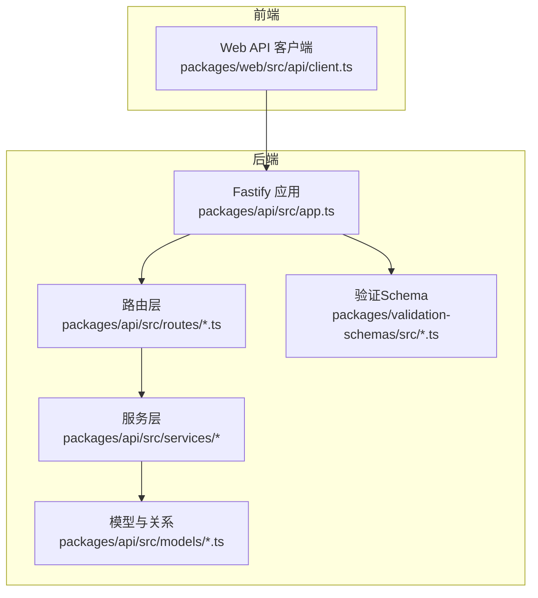
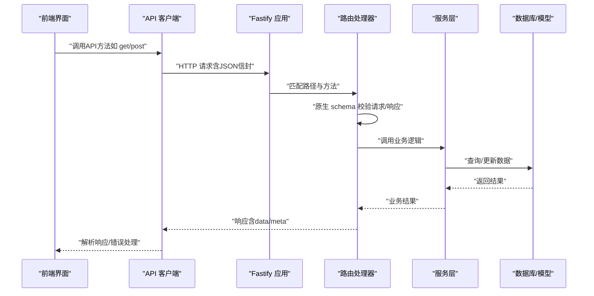
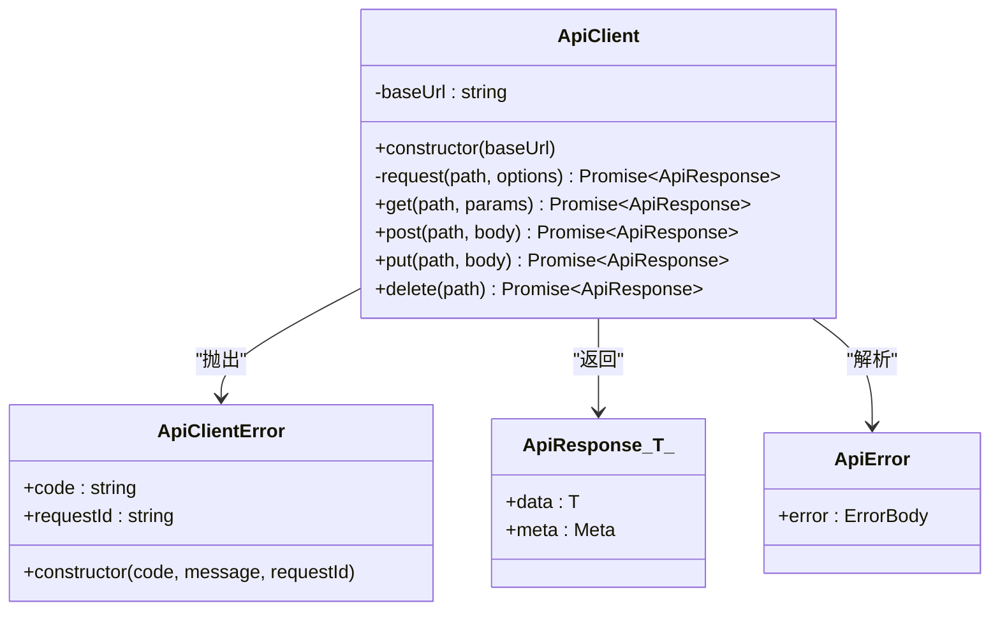
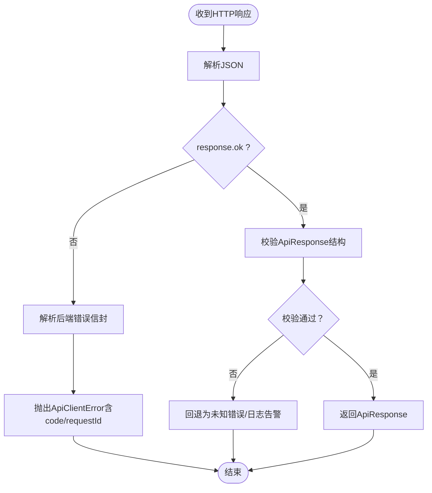
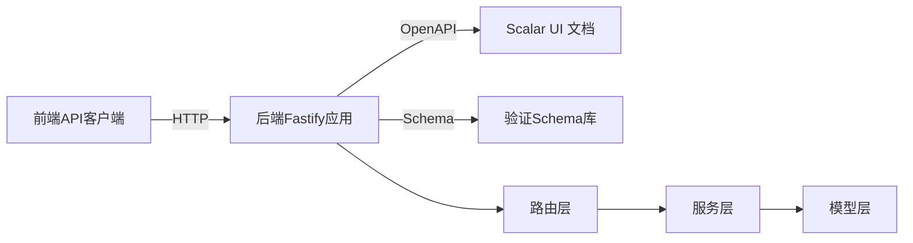

# API集成

<cite>
**本文引用的文件**
- [packages/web/src/api/client.ts](file://packages/web/src/api/client.ts)
- [packages/api/src/app.ts](file://packages/api/src/app.ts)
- [packages/api/src/routes/projects.ts](file://packages/api/src/routes/projects.ts)
- [packages/api/src/routes/organization.ts](file://packages/api/src/routes/organization.ts)
- [packages/api/tests/openapi/openapi-schema.test.ts](file://packages/api/tests/openapi/openapi-schema.test.ts)
- [docs/superpowers/plans/2026-05-14-openapi-contract.md](file://docs/superpowers/plans/2026-05-14-openapi-contract.md)
- [packages/api/src/services/common/errors.ts](file://packages/api/src/services/common/errors.ts)
- [packages/api/src/services/common/pagination.ts](file://packages/api/src/services/common/pagination.ts)
- [packages/api/src/models/schema.ts](file://packages/api/src/models/schema.ts)
- [packages/api/src/models/relations.ts](file://packages/api/src/models/relations.ts)
- [packages/validation-schemas/src/response.ts](file://packages/validation-schemas/src/response.ts)
- [packages/validation-schemas/src/base.ts](file://packages/validation-schemas/src/base.ts)
- [packages/validation-schemas/src/project.ts](file://packages/validation-schemas/src/project.ts)
- [packages/validation-schemas/src/organization.ts](file://packages/validation-schemas/src/organization.ts)
- [packages/validation-schemas/src/domain.ts](file://packages/validation-schemas/src/domain.ts)
- [packages/validation-schemas/src/application.ts](file://packages/validation-schemas/src/application.ts)
</cite>

## 目录
1. [简介](#简介)
2. [项目结构](#项目结构)
3. [核心组件](#核心组件)
4. [架构总览](#架构总览)
5. [详细组件分析](#详细组件分析)
6. [依赖分析](#依赖分析)
7. [性能考虑](#性能考虑)
8. [故障排查指南](#故障排查指南)
9. [结论](#结论)
10. [附录](#附录)

## 简介
本指南面向AI原型管理系统（APM）的API集成开发，围绕前端API客户端封装、HTTP请求统一处理与错误处理、响应类型安全与验证、缓存与性能优化、鉴权与认证、重试与降级、OpenAPI契约与测试等主题，提供系统化开发实践。文档以仓库中已实现的前端API客户端与后端Fastify服务为基础，结合OpenAPI契约设计与验证Schema，帮助开发者快速构建稳定、可维护、可观测的API集成。

## 项目结构
- 前端API客户端位于 packages/web/src/api/client.ts，提供统一的HTTP封装与错误类型化。
- 后端API服务位于 packages/api，采用Fastify框架，注册OpenAPI文档与Scalar UI，路由层逐步迁移到原生schema校验。
- 验证Schema位于 packages/validation-schemas，定义通用响应信封与各模块请求/响应Schema，支撑OpenAPI契约与运行时校验。
- 测试位于 packages/api/tests/openapi/openapi-schema.test.ts，验证OpenAPI规范与端点覆盖率。

**图表来源**
- [packages/web/src/api/client.ts:1-88](file://packages/web/src/api/client.ts#L1-L88)
- [packages/api/src/app.ts:22-65](file://packages/api/src/app.ts#L22-L65)
- [packages/api/src/routes/projects.ts:1-20](file://packages/api/src/routes/projects.ts#L1-L20)
- [packages/api/src/routes/organization.ts:1-20](file://packages/api/src/routes/organization.ts#L1-L20)
- [packages/validation-schemas/src/response.ts:1-200](file://packages/validation-schemas/src/response.ts#L1-L200)

**章节来源**
- [packages/web/src/api/client.ts:1-88](file://packages/web/src/api/client.ts#L1-L88)
- [packages/api/src/app.ts:22-65](file://packages/api/src/app.ts#L22-L65)

## 核心组件
- 前端API客户端
  - 统一基地址、请求方法封装（GET/POST/PUT/DELETE）、错误类型化、响应信封泛型。
  - 错误处理：HTTP状态码异常时解析后端错误信封，抛出带code/requestId的自定义错误。
- 后端OpenAPI与路由
  - 注册@fastify/swagger与@scalar/fastify-api-reference，生成OpenAPI 3.0.3规范与交互式文档。
  - 路由逐步迁移到原生schema校验，替代自定义validate中间件，提升契约一致性与可测试性。
- 验证Schema
  - 通用响应信封Schema与各模块Schema，支撑运行时校验与OpenAPI契约生成。
- 服务与模型
  - 服务层负责业务逻辑与数据访问，模型层定义数据库Schema与关系，保障数据一致性。

**章节来源**
- [packages/web/src/api/client.ts:22-88](file://packages/web/src/api/client.ts#L22-L88)
- [packages/api/src/app.ts:22-65](file://packages/api/src/app.ts#L22-L65)
- [packages/api/src/routes/projects.ts:1-20](file://packages/api/src/routes/projects.ts#L1-L20)
- [packages/api/src/routes/organization.ts:1-20](file://packages/api/src/routes/organization.ts#L1-L20)
- [packages/validation-schemas/src/response.ts:1-200](file://packages/validation-schemas/src/response.ts#L1-L200)

## 架构总览
前端通过统一的API客户端发起HTTP请求，后端基于Fastify注册OpenAPI文档插件，路由层采用原生schema进行请求/响应校验，服务层与模型层完成数据处理与持久化。验证Schema贯穿前后端，确保契约一致与类型安全。

**图表来源**
- [packages/web/src/api/client.ts:29-75](file://packages/web/src/api/client.ts#L29-L75)
- [packages/api/src/app.ts:22-65](file://packages/api/src/app.ts#L22-L65)
- [packages/api/src/routes/projects.ts:1-20](file://packages/api/src/routes/projects.ts#L1-L20)
- [packages/validation-schemas/src/response.ts:1-200](file://packages/validation-schemas/src/response.ts#L1-L200)

## 详细组件分析

### 前端API客户端与错误处理
- 统一封装
  - 基类地址常量、请求方法（get/post/put/delete）、URL拼接与查询参数构造。
  - 通用响应接口ApiResponse<T>与错误接口ApiError，支持分页元信息与错误详情。
- 错误处理
  - 非OK状态码时解析后端错误信封，若解析失败回退为通用错误。
  - 抛出自定义ApiClientError，携带code、message与requestId，便于前端统一处理与日志追踪。
- 类型安全
  - 泛型返回值保证调用方在编译期明确响应数据结构。
- 可扩展点
  - 支持在headers中注入鉴权令牌、超时控制、重试与降级策略等。

**图表来源**
- [packages/web/src/api/client.ts:22-88](file://packages/web/src/api/client.ts#L22-L88)

**章节来源**
- [packages/web/src/api/client.ts:3-21](file://packages/web/src/api/client.ts#L3-L21)
- [packages/web/src/api/client.ts:29-49](file://packages/web/src/api/client.ts#L29-L49)
- [packages/web/src/api/client.ts:77-86](file://packages/web/src/api/client.ts#L77-L86)

### HTTP请求统一处理与错误处理机制
- 统一入口
  - request方法集中处理URL拼接、默认Header（JSON）、fetch调用与响应解析。
- 错误分支
  - 非OK响应：解析后端错误信封；解析失败回退为未知错误；抛出ApiClientError。
  - 成功响应：解析JSON并返回ApiResponse<T>。
- 建议增强
  - 超时控制：在fetch中设置信号与超时时间。
  - 重试与退避：对瞬时错误（如网络抖动、5xx）执行指数退避重试。
  - 降级策略：在不可用时返回缓存或兜底数据。
  - 日志与追踪：记录requestId与上下文，便于问题定位。

**章节来源**
- [packages/web/src/api/client.ts:29-49](file://packages/web/src/api/client.ts#L29-L49)

### API响应数据的类型安全与验证策略
- 通用响应信封
  - ApiResponse<T>提供data与可选meta（total/page/pageSize/totalPages），前端可直接消费分页列表。
- 后端Schema驱动
  - 路由逐步迁移到原生schema校验，替代自定义validate中间件，确保契约与实现一致。
  - OpenAPI 3.0.3规范由@fastify/swagger生成，配合Scalar UI展示。
- 验证Schema库
  - packages/validation-schemas/src 下提供response.ts、base.ts、project.ts、organization.ts、domain.ts、application.ts等，覆盖请求/响应与通用字段。
- 运行时校验
  - 服务层可结合Schema进行入参与出参校验，保证数据质量与契约一致性。

**图表来源**
- [packages/web/src/api/client.ts:39-48](file://packages/web/src/api/client.ts#L39-L48)
- [packages/api/src/app.ts:22-65](file://packages/api/src/app.ts#L22-L65)
- [packages/validation-schemas/src/response.ts:1-200](file://packages/validation-schemas/src/response.ts#L1-L200)

**章节来源**
- [packages/web/src/api/client.ts:3-21](file://packages/web/src/api/client.ts#L3-L21)
- [packages/api/src/app.ts:22-65](file://packages/api/src/app.ts#L22-L65)
- [packages/validation-schemas/src/response.ts:1-200](file://packages/validation-schemas/src/response.ts#L1-L200)

### API调用的缓存策略与性能优化
- 前端缓存
  - GET请求结果按URL与查询参数组合键缓存；对高频读取列表启用内存缓存与TTL。
  - 分页场景：独立缓存每页数据，避免全量重载。
- 性能优化
  - 减少不必要的请求：合并请求、批量加载、防抖节流。
  - 增量更新：利用ETag/If-None-Match或Last-Modified减少传输。
  - 响应压缩：后端开启Gzip/Brotli，前端识别Accept-Encoding。
- 后端优化
  - 路由原生schema校验减少运行时判断开销。
  - 数据库索引与查询优化，避免N+1问题。

[本节为通用指导，不直接分析具体文件]

### API鉴权与认证实现方案
- 当前状态
  - OpenAPI配置中声明了bearerAuth安全方案（JWT），用于后续Phase 2+启用。
- 建议实现
  - 前端：在ApiClient中注入Authorization头，支持刷新令牌与自动重试。
  - 后端：在路由层增加鉴权中间件或装饰器，校验JWT有效性与权限范围。
  - 令牌管理：本地存储安全存放、跨域Cookie策略、刷新令牌安全传输。

**章节来源**
- [packages/api/src/app.ts:48-55](file://packages/api/src/app.ts#L48-L55)

### API请求的重试机制与降级策略
- 重试策略
  - 对瞬时错误（如网络抖动、5xx）进行指数退避重试，限制最大次数与总等待时间。
  - 区分幂等与非幂等请求，仅对幂等GET/HEAD等启用自动重试。
- 降级策略
  - 失败时返回缓存数据或默认占位，保证用户体验。
  - 降级阈值：错误率、延迟阈值、下游可用性指标。
- 前端落地
  - 在ApiClient.request中封装重试与降级逻辑，统一对外暴露。

[本节为通用指导，不直接分析具体文件]

### WebSocket或实时数据的集成方法
- 设计建议
  - 与REST API并行：REST用于同步操作，WebSocket用于订阅事件与增量推送。
  - 协议选择：基于Fastify插件（如@fastify/websocket）实现，保持与JWT鉴权一致的接入方式。
  - 心跳与重连：心跳保活、指数退避重连、断线缓冲队列。
- 前端对接
  - 在ApiClient外另建WebSocket客户端，复用鉴权与错误处理机制。
  - 事件分发：按频道/主题分发消息，统一转换为Store/状态管理。

[本节为通用指导，不直接分析具体文件]

### API版本管理与向后兼容性处理
- 版本策略
  - 路径版本：/api/v1、/api/v2；优先采用路径版本，便于灰度与回滚。
  - 头部版本：X-API-Version；适合已有生产环境难以改路径的场景。
- 向后兼容
  - 新增字段保持可选，避免破坏旧客户端。
  - 移除字段需在上一个主版本中标记废弃，持续兼容至少一个主版本。
- OpenAPI契约
  - 通过@fastify/swagger生成多版本契约，配合Scalar UI对比差异。
  - 测试用例覆盖新旧版本兼容性。

**章节来源**
- [packages/api/src/app.ts:26-58](file://packages/api/src/app.ts#L26-L58)

### API集成的测试策略与调试工具
- OpenAPI契约测试
  - 测试用例验证OpenAPI 3.0.3规范、端点数量与路径一致性，确保契约完整性。
- 路由Schema迁移
  - 将自定义validate中间件替换为原生schema，提升可测试性与一致性。
- 调试工具
  - Scalar UI：交互式浏览契约与示例请求，便于联调。
  - 浏览器Network面板：观察请求/响应、Headers、Cookies与Caching。
  - 日志与追踪：记录requestId，串联前后端日志。

**章节来源**
- [packages/api/tests/openapi/openapi-schema.test.ts:29-56](file://packages/api/tests/openapi/openapi-schema.test.ts#L29-L56)
- [docs/superpowers/plans/2026-05-14-openapi-contract.md:6-11](file://docs/superpowers/plans/2026-05-14-openapi-contract.md#L6-L11)
- [packages/api/src/app.ts:60-65](file://packages/api/src/app.ts#L60-L65)

## 依赖分析
- 前端API客户端依赖
  - packages/web/src/api/client.ts 依赖浏览器fetch能力与JSON解析。
- 后端依赖
  - packages/api/src/app.ts 依赖@fastify/swagger与@scalar/fastify-api-reference，生成OpenAPI与文档。
  - 路由层依赖packages/validation-schemas/src下的Schema，实现原生schema校验。
- 服务与模型
  - 服务层依赖模型层Schema与关系定义，保障数据一致性。

**图表来源**
- [packages/web/src/api/client.ts:1-88](file://packages/web/src/api/client.ts#L1-L88)
- [packages/api/src/app.ts:22-65](file://packages/api/src/app.ts#L22-L65)
- [packages/validation-schemas/src/response.ts:1-200](file://packages/validation-schemas/src/response.ts#L1-L200)

**章节来源**
- [packages/web/src/api/client.ts:1-88](file://packages/web/src/api/client.ts#L1-L88)
- [packages/api/src/app.ts:22-65](file://packages/api/src/app.ts#L22-L65)
- [packages/validation-schemas/src/response.ts:1-200](file://packages/validation-schemas/src/response.ts#L1-L200)

## 性能考虑
- 前端
  - 合理缓存与去重请求，避免重复加载。
  - 批量请求与懒加载，降低首屏压力。
- 后端
  - 原生schema校验减少运行时判断成本。
  - 数据库查询优化、索引与分页策略。
- 网络
  - 压缩与CDN、合理的缓存策略与ETag。

[本节为通用指导，不直接分析具体文件]

## 故障排查指南
- 常见错误
  - HTTP 4xx/5xx：解析后端错误信封，关注code与requestId，定位具体模块与参数。
  - 解析失败：当后端未返回标准错误信封时，回退为UNKNOWN_ERROR，检查后端序列化。
- 排查步骤
  - 检查请求URL、Headers（Authorization、Content-Type）。
  - 查看Scalar UI示例请求，比对参数与Schema。
  - 关注服务日志与数据库慢查询。
- 错误处理
  - 前端统一捕获ApiClientError，区分可重试与不可重试错误。
  - 对瞬时错误执行重试，对参数错误引导用户修正。

**章节来源**
- [packages/web/src/api/client.ts:41-46](file://packages/web/src/api/client.ts#L41-L46)
- [packages/api/src/services/common/errors.ts:1-200](file://packages/api/src/services/common/errors.ts#L1-L200)

## 结论
通过前端统一API客户端、后端OpenAPI契约与原生schema校验、以及验证Schema库的协同，APM实现了类型安全、可维护与可观测的API集成。建议在此基础上完善鉴权、重试与降级、缓存与性能优化、WebSocket实时集成与版本管理策略，持续提升系统稳定性与开发效率。

## 附录
- 通用响应Schema与各模块Schema参考路径
  - [packages/validation-schemas/src/response.ts:1-200](file://packages/validation-schemas/src/response.ts#L1-L200)
  - [packages/validation-schemas/src/base.ts:1-200](file://packages/validation-schemas/src/base.ts#L1-L200)
  - [packages/validation-schemas/src/project.ts:1-200](file://packages/validation-schemas/src/project.ts#L1-L200)
  - [packages/validation-schemas/src/organization.ts:1-200](file://packages/validation-schemas/src/organization.ts#L1-L200)
  - [packages/validation-schemas/src/domain.ts:1-200](file://packages/validation-schemas/src/domain.ts#L1-L200)
  - [packages/validation-schemas/src/application.ts:1-200](file://packages/validation-schemas/src/application.ts#L1-L200)
- OpenAPI契约与测试
  - [packages/api/tests/openapi/openapi-schema.test.ts:29-56](file://packages/api/tests/openapi/openapi-schema.test.ts#L29-L56)
  - [docs/superpowers/plans/2026-05-14-openapi-contract.md:6-11](file://docs/superpowers/plans/2026-05-14-openapi-contract.md#L6-L11)