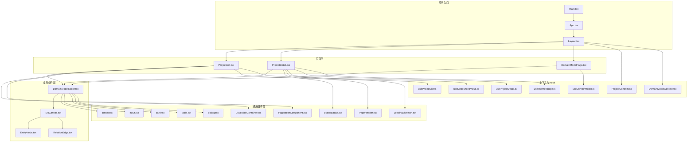
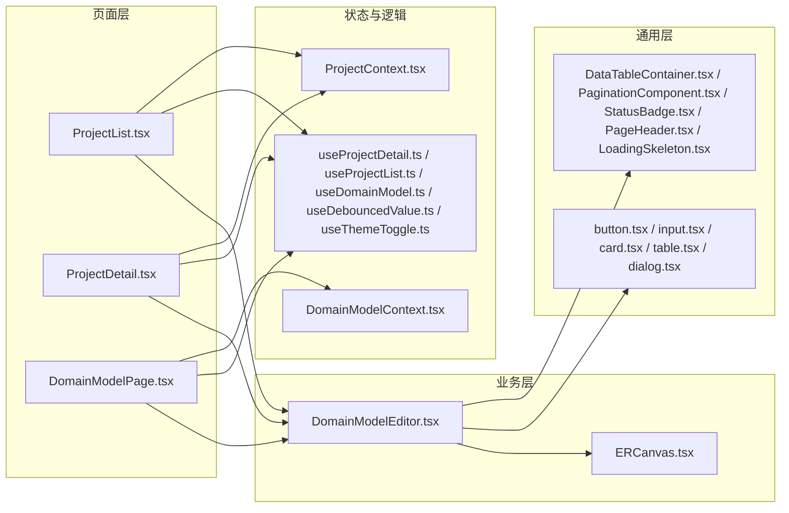
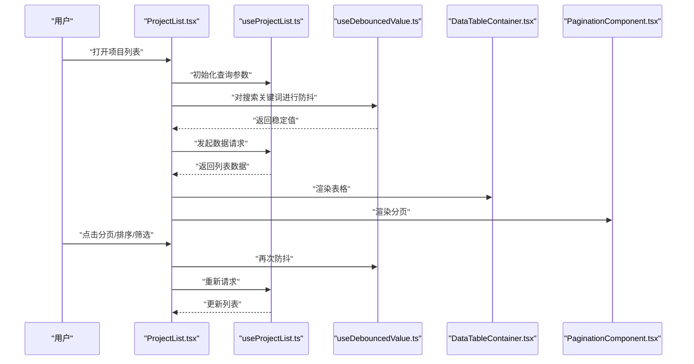
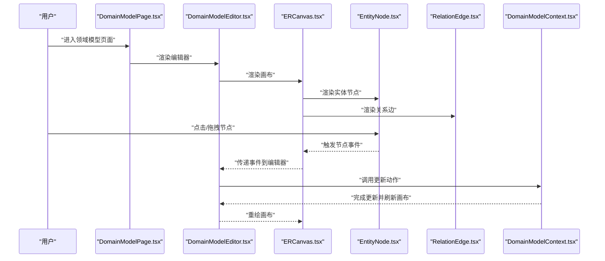
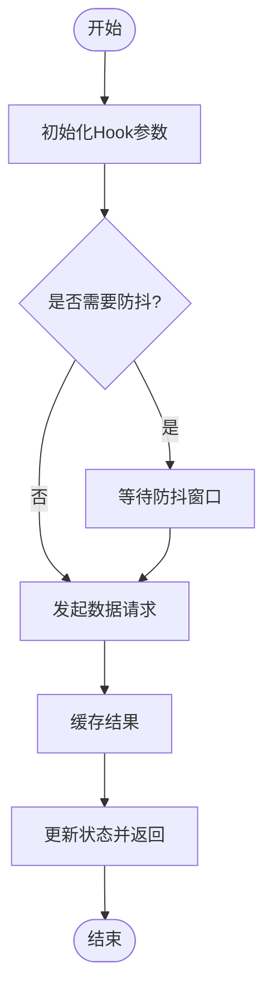
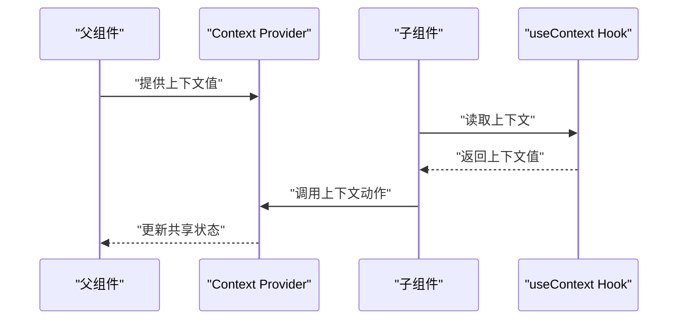
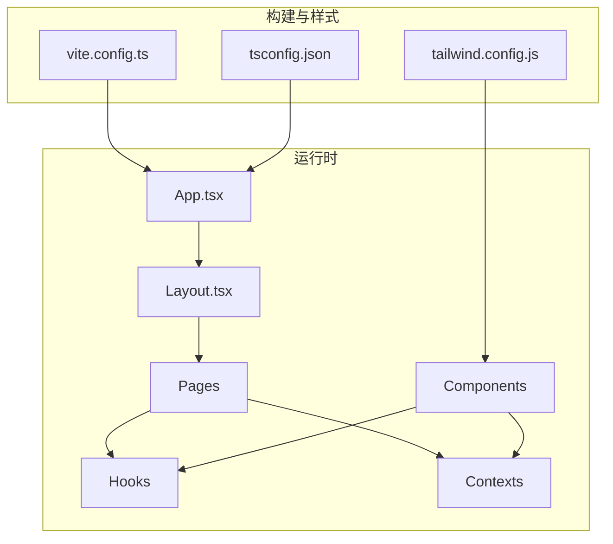

# React组件开发

<cite>
**本文引用的文件**
- [App.tsx](file://packages/web/src/App.tsx)
- [Layout.tsx](file://packages/web/src/components/Layout.tsx)
- [ProjectContext.tsx](file://packages/web/src/contexts/ProjectContext.tsx)
- [DomainModelContext.tsx](file://packages/web/src/contexts/DomainModelContext.tsx)
- [useProjectDetail.ts](file://packages/web/src/hooks/useProjectDetail.ts)
- [useProjectList.ts](file://packages/web/src/hooks/useProjectList.ts)
- [useDomainModel.ts](file://packages/web/src/hooks/useDomainModel.ts)
- [useDebouncedValue.ts](file://packages/web/src/hooks/useDebouncedValue.ts)
- [useThemeToggle.ts](file://packages/web/src/hooks/useThemeToggle.ts)
- [ProjectDetail.tsx](file://packages/web/src/pages/ProjectDetail.tsx)
- [ProjectList.tsx](file://packages/web/src/pages/ProjectList.tsx)
- [DomainModelPage.tsx](file://packages/web/src/pages/DomainModelPage.tsx)
- [DomainModelEditor.tsx](file://packages/web/src/components/domain-model/DomainModelEditor.tsx)
- [ERCanvas.tsx](file://packages/web/src/components/domain-model/canvas/ERCanvas.tsx)
- [EntityNode.tsx](file://packages/web/src/components/domain-model/canvas/EntityNode.tsx)
- [RelationEdge.tsx](file://packages/web/src/components/domain-model/canvas/RelationEdge.tsx)
- [button.tsx](file://packages/web/src/components/ui/button.tsx)
- [input.tsx](file://packages/web/src/components/ui/input.tsx)
- [card.tsx](file://packages/web/src/components/ui/card.tsx)
- [table.tsx](file://packages/web/src/components/ui/table.tsx)
- [dialog.tsx](file://packages/web/src/components/ui/dialog.tsx)
- [DataTableContainer.tsx](file://packages/web/src/components/common/DataTableContainer.tsx)
- [PaginationComponent.tsx](file://packages/web/src/components/common/PaginationComponent.tsx)
- [StatusBadge.tsx](file://packages/web/src/components/common/StatusBadge.tsx)
- [PageHeader.tsx](file://packages/web/src/components/common/PageHeader.tsx)
- [LoadingSkeleton.tsx](file://packages/web/src/components/common/LoadingSkeleton.tsx)
- [ErrorBoundary.tsx](file://packages/web/src/components/ErrorBoundary.tsx)
- [ProjectRouteGuard.tsx](file://packages/web/src/components/ProjectRouteGuard.tsx)
- [main.tsx](file://packages/web/src/main.tsx)
- [vite.config.ts](file://packages/web/vite.config.ts)
- [tsconfig.json](file://packages/web/tsconfig.json)
- [tailwind.config.js](file://packages/web/tailwind.config.js)
- [index.css](file://packages/web/src/index.css)
- [object-lifecycle.md](file://docs/04-tech-design/object-lifecycle.md)
- [app-shared-resources.md](file://docs/02-domain-model/app-shared-resources.md)
</cite>

## 目录
1. [引言](#引言)
2. [项目结构](#项目结构)
3. [核心组件](#核心组件)
4. [架构总览](#架构总览)
5. [详细组件分析](#详细组件分析)
6. [依赖分析](#依赖分析)
7. [性能考虑](#性能考虑)
8. [故障排查指南](#故障排查指南)
9. [结论](#结论)
10. [附录](#附录)

## 引言
本指南面向React开发者，围绕AI原型管理系统的前端组件体系，系统阐述组件架构设计原则与最佳实践，涵盖页面组件、业务组件、通用组件的分类与开发规范；自定义Hook的设计模式与复用策略；Context API的状态管理模式与组件间通信机制；组件生命周期管理与性能优化技巧；组件测试策略与调试方法；TypeScript类型定义与接口设计规范；以及组件组合模式与高阶组件的使用场景。目标是帮助团队构建高质量、可维护的前端组件。

## 项目结构
该仓库采用多包工作区（pnpm-workspace）组织，前端应用位于 packages/web，采用Vite构建，TailwindCSS提供样式基础，TypeScript提供类型保障。组件按功能域分层组织：pages（页面）、components（页面内业务组件与通用UI组件）、hooks（自定义Hook）、contexts（状态上下文）、lib（工具与API客户端）等。

图表来源
- [main.tsx:1-50](file://packages/web/src/main.tsx#L1-L50)
- [App.tsx:1-120](file://packages/web/src/App.tsx#L1-L120)
- [Layout.tsx:1-120](file://packages/web/src/components/Layout.tsx#L1-L120)
- [ProjectList.tsx:1-120](file://packages/web/src/pages/ProjectList.tsx#L1-L120)
- [ProjectDetail.tsx:1-120](file://packages/web/src/pages/ProjectDetail.tsx#L1-L120)
- [DomainModelPage.tsx:1-120](file://packages/web/src/pages/DomainModelPage.tsx#L1-L120)
- [DomainModelEditor.tsx:1-120](file://packages/web/src/components/domain-model/DomainModelEditor.tsx#L1-L120)
- [ERCanvas.tsx:1-120](file://packages/web/src/components/domain-model/canvas/ERCanvas.tsx#L1-L120)
- [EntityNode.tsx:1-120](file://packages/web/src/components/domain-model/canvas/EntityNode.tsx#L1-L120)
- [RelationEdge.tsx:1-120](file://packages/web/src/components/domain-model/canvas/RelationEdge.tsx#L1-L120)
- [button.tsx:1-120](file://packages/web/src/components/ui/button.tsx#L1-L120)
- [input.tsx:1-120](file://packages/web/src/components/ui/input.tsx#L1-L120)
- [card.tsx:1-120](file://packages/web/src/components/ui/card.tsx#L1-L120)
- [table.tsx:1-120](file://packages/web/src/components/ui/table.tsx#L1-L120)
- [dialog.tsx:1-120](file://packages/web/src/components/ui/dialog.tsx#L1-L120)
- [DataTableContainer.tsx:1-120](file://packages/web/src/components/common/DataTableContainer.tsx#L1-L120)
- [PaginationComponent.tsx:1-120](file://packages/web/src/components/common/PaginationComponent.tsx#L1-L120)
- [StatusBadge.tsx:1-120](file://packages/web/src/components/common/StatusBadge.tsx#L1-L120)
- [PageHeader.tsx:1-120](file://packages/web/src/components/common/PageHeader.tsx#L1-L120)
- [LoadingSkeleton.tsx:1-120](file://packages/web/src/components/common/LoadingSkeleton.tsx#L1-L120)
- [ProjectContext.tsx:1-160](file://packages/web/src/contexts/ProjectContext.tsx#L1-L160)
- [DomainModelContext.tsx:1-500](file://packages/web/src/contexts/DomainModelContext.tsx#L1-L500)
- [useProjectDetail.ts:1-120](file://packages/web/src/hooks/useProjectDetail.ts#L1-L120)
- [useProjectList.ts:1-120](file://packages/web/src/hooks/useProjectList.ts#L1-L120)
- [useDomainModel.ts:1-120](file://packages/web/src/hooks/useDomainModel.ts#L1-L120)
- [useDebouncedValue.ts:1-120](file://packages/web/src/hooks/useDebouncedValue.ts#L1-L120)
- [useThemeToggle.ts:1-120](file://packages/web/src/hooks/useThemeToggle.ts#L1-L120)

章节来源
- [main.tsx:1-50](file://packages/web/src/main.tsx#L1-L50)
- [App.tsx:1-120](file://packages/web/src/App.tsx#L1-L120)
- [Layout.tsx:1-120](file://packages/web/src/components/Layout.tsx#L1-L120)

## 核心组件
本节聚焦于系统的关键组件与职责边界，明确页面组件、业务组件、通用组件的分类与开发规范。

- 页面组件（Pages）
  - 职责：承载路由级视图，负责数据获取、参数解析、页面布局与导航。
  - 示例：ProjectList、ProjectDetail、DomainModelPage。
  - 规范：
    - 仅做“页面级”编排，不封装复杂交互逻辑。
    - 通过自定义Hook与上下文获取数据，避免在组件内直接调用API。
    - 使用骨架屏或占位组件提升首屏体验。

- 业务组件（Domain Components）
  - 职责：实现领域模型编辑、画布渲染、节点交互等业务能力。
  - 示例：DomainModelEditor、ERCanvas、EntityNode、RelationEdge。
  - 规范：
    - 面向领域抽象，保持与UI框架解耦。
    - 事件驱动：通过回调或Context暴露动作，供上层页面或对话框触发。
    - 单一职责：每个组件只负责一类业务行为。

- 通用组件（UI Components）
  - 职责：可复用的UI原子组件，遵循设计系统与无障碍规范。
  - 示例：button、input、card、table、dialog、DataTableContainer、PaginationComponent、StatusBadge、PageHeader、LoadingSkeleton。
  - 规范：
    - Props最小化，使用受控组件模式。
    - 明确默认值与可选性，避免隐式依赖。
    - 与TailwindCSS类名约定配合，统一主题与间距。

- 上下文与Hook
  - 职责：集中管理跨层级共享状态与副作用逻辑，提供稳定的Hook API。
  - 示例：ProjectContext、DomainModelContext、useProjectDetail、useProjectList、useDomainModel、useDebouncedValue、useThemeToggle。
  - 规范：
    - Context仅存放“必要”的全局状态，避免过度共享导致重渲染。
    - Hook封装副作用与缓存，暴露简洁的读写接口。
    - Hook内部使用useCallback/useMemo稳定引用，减少下游重渲染。

章节来源
- [ProjectList.tsx:1-120](file://packages/web/src/pages/ProjectList.tsx#L1-L120)
- [ProjectDetail.tsx:1-120](file://packages/web/src/pages/ProjectDetail.tsx#L1-L120)
- [DomainModelPage.tsx:1-120](file://packages/web/src/pages/DomainModelPage.tsx#L1-L120)
- [DomainModelEditor.tsx:1-120](file://packages/web/src/components/domain-model/DomainModelEditor.tsx#L1-L120)
- [ERCanvas.tsx:1-120](file://packages/web/src/components/domain-model/canvas/ERCanvas.tsx#L1-L120)
- [EntityNode.tsx:1-120](file://packages/web/src/components/domain-model/canvas/EntityNode.tsx#L1-L120)
- [RelationEdge.tsx:1-120](file://packages/web/src/components/domain-model/canvas/RelationEdge.tsx#L1-L120)
- [button.tsx:1-120](file://packages/web/src/components/ui/button.tsx#L1-L120)
- [input.tsx:1-120](file://packages/web/src/components/ui/input.tsx#L1-L120)
- [card.tsx:1-120](file://packages/web/src/components/ui/card.tsx#L1-L120)
- [table.tsx:1-120](file://packages/web/src/components/ui/table.tsx#L1-L120)
- [dialog.tsx:1-120](file://packages/web/src/components/ui/dialog.tsx#L1-L120)
- [DataTableContainer.tsx:1-120](file://packages/web/src/components/common/DataTableContainer.tsx#L1-L120)
- [PaginationComponent.tsx:1-120](file://packages/web/src/components/common/PaginationComponent.tsx#L1-L120)
- [StatusBadge.tsx:1-120](file://packages/web/src/components/common/StatusBadge.tsx#L1-L120)
- [PageHeader.tsx:1-120](file://packages/web/src/components/common/PageHeader.tsx#L1-L120)
- [LoadingSkeleton.tsx:1-120](file://packages/web/src/components/common/LoadingSkeleton.tsx#L1-L120)
- [ProjectContext.tsx:1-160](file://packages/web/src/contexts/ProjectContext.tsx#L1-L160)
- [DomainModelContext.tsx:1-500](file://packages/web/src/contexts/DomainModelContext.tsx#L1-L500)
- [useProjectDetail.ts:1-120](file://packages/web/src/hooks/useProjectDetail.ts#L1-L120)
- [useProjectList.ts:1-120](file://packages/web/src/hooks/useProjectList.ts#L1-L120)
- [useDomainModel.ts:1-120](file://packages/web/src/hooks/useDomainModel.ts#L1-L120)
- [useDebouncedValue.ts:1-120](file://packages/web/src/hooks/useDebouncedValue.ts#L1-L120)
- [useThemeToggle.ts:1-120](file://packages/web/src/hooks/useThemeToggle.ts#L1-L120)

## 架构总览
系统采用“页面-业务-通用”三层组件架构，结合Context与自定义Hook实现状态与逻辑复用。页面组件负责路由与布局，业务组件负责领域能力，通用组件提供UI一致性。上下文与Hook作为横切关注点，贯穿各层以降低耦合。

图表来源
- [ProjectList.tsx:1-120](file://packages/web/src/pages/ProjectList.tsx#L1-L120)
- [ProjectDetail.tsx:1-120](file://packages/web/src/pages/ProjectDetail.tsx#L1-L120)
- [DomainModelPage.tsx:1-120](file://packages/web/src/pages/DomainModelPage.tsx#L1-L120)
- [DomainModelEditor.tsx:1-120](file://packages/web/src/components/domain-model/DomainModelEditor.tsx#L1-L120)
- [ERCanvas.tsx:1-120](file://packages/web/src/components/domain-model/canvas/ERCanvas.tsx#L1-L120)
- [button.tsx:1-120](file://packages/web/src/components/ui/button.tsx#L1-L120)
- [input.tsx:1-120](file://packages/web/src/components/ui/input.tsx#L1-L120)
- [card.tsx:1-120](file://packages/web/src/components/ui/card.tsx#L1-L120)
- [table.tsx:1-120](file://packages/web/src/components/ui/table.tsx#L1-L120)
- [dialog.tsx:1-120](file://packages/web/src/components/ui/dialog.tsx#L1-L120)
- [DataTableContainer.tsx:1-120](file://packages/web/src/components/common/DataTableContainer.tsx#L1-L120)
- [PaginationComponent.tsx:1-120](file://packages/web/src/components/common/PaginationComponent.tsx#L1-L120)
- [StatusBadge.tsx:1-120](file://packages/web/src/components/common/StatusBadge.tsx#L1-L120)
- [PageHeader.tsx:1-120](file://packages/web/src/components/common/PageHeader.tsx#L1-L120)
- [LoadingSkeleton.tsx:1-120](file://packages/web/src/components/common/LoadingSkeleton.tsx#L1-L120)
- [ProjectContext.tsx:1-160](file://packages/web/src/contexts/ProjectContext.tsx#L1-L160)
- [DomainModelContext.tsx:1-500](file://packages/web/src/contexts/DomainModelContext.tsx#L1-L500)
- [useProjectDetail.ts:1-120](file://packages/web/src/hooks/useProjectDetail.ts#L1-L120)
- [useProjectList.ts:1-120](file://packages/web/src/hooks/useProjectList.ts#L1-L120)
- [useDomainModel.ts:1-120](file://packages/web/src/hooks/useDomainModel.ts#L1-L120)
- [useDebouncedValue.ts:1-120](file://packages/web/src/hooks/useDebouncedValue.ts#L1-L120)
- [useThemeToggle.ts:1-120](file://packages/web/src/hooks/useThemeToggle.ts#L1-L120)

## 详细组件分析

### 页面组件：项目列表与详情
- ProjectList
  - 职责：展示项目列表、分页、筛选、创建与归档操作。
  - 关键交互：调用useProjectList获取数据，使用DataTableContainer与PaginationComponent渲染表格与分页。
  - 性能要点：使用useDebouncedValue处理搜索输入防抖，减少请求频率。
- ProjectDetail
  - 职责：展示项目详情、组织与外部实体面板、摘要卡片。
  - 关键交互：调用useProjectDetail获取详情，使用LoadingSkeleton与StatusBadge提升用户体验。
  - 安全要点：使用ProjectRouteGuard保护路由访问。

图表来源
- [ProjectList.tsx:1-120](file://packages/web/src/pages/ProjectList.tsx#L1-L120)
- [useProjectList.ts:1-120](file://packages/web/src/hooks/useProjectList.ts#L1-L120)
- [useDebouncedValue.ts:1-120](file://packages/web/src/hooks/useDebouncedValue.ts#L1-L120)
- [DataTableContainer.tsx:1-120](file://packages/web/src/components/common/DataTableContainer.tsx#L1-L120)
- [PaginationComponent.tsx:1-120](file://packages/web/src/components/common/PaginationComponent.tsx#L1-L120)

章节来源
- [ProjectList.tsx:1-120](file://packages/web/src/pages/ProjectList.tsx#L1-L120)
- [ProjectDetail.tsx:1-120](file://packages/web/src/pages/ProjectDetail.tsx#L1-L120)
- [useProjectList.ts:1-120](file://packages/web/src/hooks/useProjectList.ts#L1-L120)
- [useDebouncedValue.ts:1-120](file://packages/web/src/hooks/useDebouncedValue.ts#L1-L120)
- [ProjectRouteGuard.tsx:1-120](file://packages/web/src/components/ProjectRouteGuard.tsx#L1-L120)

### 业务组件：领域模型编辑器
- DomainModelEditor
  - 职责：聚合画布、工具栏、设置面板，协调领域模型的增删改查。
  - 关键交互：通过DomainModelContext暴露的动作更新实体、关系与画布状态。
- ERCanvas
  - 职责：承载实体节点与关系边的渲染与交互。
  - 关键交互：EntityNode与RelationEdge通过回调通知父级更新。
- EntityNode / RelationEdge
  - 职责：单个节点与边的渲染与事件处理。
  - 关键交互：对外暴露选中、拖拽、编辑等事件，由父级统一处理。

图表来源
- [DomainModelPage.tsx:1-120](file://packages/web/src/pages/DomainModelPage.tsx#L1-L120)
- [DomainModelEditor.tsx:1-120](file://packages/web/src/components/domain-model/DomainModelEditor.tsx#L1-L120)
- [ERCanvas.tsx:1-120](file://packages/web/src/components/domain-model/canvas/ERCanvas.tsx#L1-L120)
- [EntityNode.tsx:1-120](file://packages/web/src/components/domain-model/canvas/EntityNode.tsx#L1-L120)
- [RelationEdge.tsx:1-120](file://packages/web/src/components/domain-model/canvas/RelationEdge.tsx#L1-L120)
- [DomainModelContext.tsx:1-500](file://packages/web/src/contexts/DomainModelContext.tsx#L1-L500)

章节来源
- [DomainModelEditor.tsx:1-120](file://packages/web/src/components/domain-model/DomainModelEditor.tsx#L1-L120)
- [ERCanvas.tsx:1-120](file://packages/web/src/components/domain-model/canvas/ERCanvas.tsx#L1-L120)
- [EntityNode.tsx:1-120](file://packages/web/src/components/domain-model/canvas/EntityNode.tsx#L1-L120)
- [RelationEdge.tsx:1-120](file://packages/web/src/components/domain-model/canvas/RelationEdge.tsx#L1-L120)
- [DomainModelContext.tsx:1-500](file://packages/web/src/contexts/DomainModelContext.tsx#L1-L500)

### 通用组件：UI原子与容器
- button、input、card、table、dialog
  - 职责：提供一致的UI外观与交互语义，遵循设计令牌与TailwindCSS规范。
  - 规范：Props最小化、受控模式、无障碍属性完备。
- DataTableContainer、PaginationComponent、StatusBadge、PageHeader、LoadingSkeleton
  - 职责：页面级容器与展示组件，统一数据呈现与状态反馈。
  - 规范：支持空态、错误态、加载态，提供可访问的视觉提示。

章节来源
- [button.tsx:1-120](file://packages/web/src/components/ui/button.tsx#L1-L120)
- [input.tsx:1-120](file://packages/web/src/components/ui/input.tsx#L1-L120)
- [card.tsx:1-120](file://packages/web/src/components/ui/card.tsx#L1-L120)
- [table.tsx:1-120](file://packages/web/src/components/ui/table.tsx#L1-L120)
- [dialog.tsx:1-120](file://packages/web/src/components/ui/dialog.tsx#L1-L120)
- [DataTableContainer.tsx:1-120](file://packages/web/src/components/common/DataTableContainer.tsx#L1-L120)
- [PaginationComponent.tsx:1-120](file://packages/web/src/components/common/PaginationComponent.tsx#L1-L120)
- [StatusBadge.tsx:1-120](file://packages/web/src/components/common/StatusBadge.tsx#L1-L120)
- [PageHeader.tsx:1-120](file://packages/web/src/components/common/PageHeader.tsx#L1-L120)
- [LoadingSkeleton.tsx:1-120](file://packages/web/src/components/common/LoadingSkeleton.tsx#L1-L120)

### 自定义Hook设计模式与复用策略
- useProjectList / useProjectDetail
  - 模式：封装数据获取、缓存、错误处理与加载状态。
  - 复用：在多个页面共享同一数据流，避免重复请求与状态分散。
- useDomainModel
  - 模式：封装领域模型的CRUD与画布状态同步。
  - 复用：通过Context暴露统一动作，供编辑器与对话框使用。
- useDebouncedValue
  - 模式：输入防抖，降低请求压力。
  - 复用：适用于搜索、过滤等高频变更场景。
- useThemeToggle
  - 模式：主题切换与持久化。
  - 复用：在Layout或全局配置中统一控制。

图表来源
- [useProjectList.ts:1-120](file://packages/web/src/hooks/useProjectList.ts#L1-L120)
- [useProjectDetail.ts:1-120](file://packages/web/src/hooks/useProjectDetail.ts#L1-L120)
- [useDomainModel.ts:1-120](file://packages/web/src/hooks/useDomainModel.ts#L1-L120)
- [useDebouncedValue.ts:1-120](file://packages/web/src/hooks/useDebouncedValue.ts#L1-L120)
- [useThemeToggle.ts:1-120](file://packages/web/src/hooks/useThemeToggle.ts#L1-L120)

章节来源
- [useProjectList.ts:1-120](file://packages/web/src/hooks/useProjectList.ts#L1-L120)
- [useProjectDetail.ts:1-120](file://packages/web/src/hooks/useProjectDetail.ts#L1-L120)
- [useDomainModel.ts:1-120](file://packages/web/src/hooks/useDomainModel.ts#L1-L120)
- [useDebouncedValue.ts:1-120](file://packages/web/src/hooks/useDebouncedValue.ts#L1-L120)
- [useThemeToggle.ts:1-120](file://packages/web/src/hooks/useThemeToggle.ts#L1-L120)

### Context API状态管理模式与组件间通信
- ProjectContext
  - 职责：管理当前激活项目、加载状态与刷新逻辑。
  - 用法：在Layout或页面中提供Provider，在子树中通过useProjectContext消费。
- DomainModelContext
  - 职责：管理领域模型数据、画布状态与动作集合。
  - 用法：在编辑器中提供Provider，节点与边通过动作更新模型并触发刷新。
- 组件间通信
  - 父子：通过Props传递数据与回调。
  - 兄弟：通过共同父组件或Context共享状态。
  - 跨层级：通过Context或自定义Hook向上游暴露动作。

图表来源
- [ProjectContext.tsx:1-160](file://packages/web/src/contexts/ProjectContext.tsx#L1-L160)
- [DomainModelContext.tsx:1-500](file://packages/web/src/contexts/DomainModelContext.tsx#L1-L500)

章节来源
- [ProjectContext.tsx:1-160](file://packages/web/src/contexts/ProjectContext.tsx#L1-L160)
- [DomainModelContext.tsx:1-500](file://packages/web/src/contexts/DomainModelContext.tsx#L1-L500)

### 组件生命周期管理与性能优化
- 生命周期
  - 初始化：在页面组件中通过自定义Hook初始化查询参数与状态。
  - 更新：根据路由参数或上下文变化触发重新请求或刷新。
  - 销毁：清理定时器、取消请求（如需），避免内存泄漏。
- 性能优化
  - 防抖：useDebouncedValue用于高频输入。
  - 缓存：useProjectList/useProjectDetail内部缓存结果，避免重复请求。
  - 渲染优化：使用useCallback/useMemo稳定回调与引用，减少子组件重渲染。
  - 懒加载：大组件按需加载，减少首屏负担。
  - 图形渲染：ERCanvas中节点与边按需更新，避免全量重绘。

章节来源
- [useDebouncedValue.ts:1-120](file://packages/web/src/hooks/useDebouncedValue.ts#L1-L120)
- [useProjectList.ts:1-120](file://packages/web/src/hooks/useProjectList.ts#L1-L120)
- [useProjectDetail.ts:1-120](file://packages/web/src/hooks/useProjectDetail.ts#L1-L120)
- [ERCanvas.tsx:1-120](file://packages/web/src/components/domain-model/canvas/ERCanvas.tsx#L1-L120)

### 组件测试策略与调试方法
- 测试策略
  - 单元测试：针对自定义Hook与纯函数，验证状态与副作用。
  - 集成测试：模拟页面组件与上下文，验证数据流与渲染。
  - E2E测试：基于真实环境的端到端流程验证。
- 调试方法
  - React DevTools：检查组件树、Props、State与Hooks状态。
  - 日志：在关键流程添加日志输出，定位问题。
  - 断点：在Hook与事件回调处设置断点，观察执行路径。
  - 文档参考：结合对象生命周期与共享资源文档，理解组件行为。

章节来源
- [object-lifecycle.md:457-502](file://docs/04-tech-design/object-lifecycle.md#L457-L502)
- [app-shared-resources.md:1031-1083](file://docs/02-domain-model/app-shared-resources.md#L1031-L1083)

### TypeScript类型定义与接口设计规范
- 类型规范
  - Props最小化：仅暴露必要字段，使用Partial与Omit组合生成可选类型。
  - 接口命名：以名词或动词短语命名，体现职责与用途。
  - 泛型约束：在通用组件中使用泛型约束数据结构，保证类型安全。
- 设计令牌
  - 使用tokens与design-tokens统一颜色、尺寸、阴影等视觉变量，确保风格一致。

章节来源
- [tsconfig.json:1-120](file://packages/web/tsconfig.json#L1-L120)
- [tailwind.config.js:1-120](file://packages/web/tailwind.config.js#L1-L120)
- [index.css:1-120](file://packages/web/src/index.css#L1-L120)

### 组件组合模式与高阶组件使用场景
- 组合模式
  - 布局组合：Layout组合页面组件，提供统一头部与侧边栏。
  - 行为组合：业务组件组合通用UI组件，形成可复用的视图单元。
- 高阶组件（HOC）
  - 使用场景：权限控制（如ProjectRouteGuard）、主题包裹、错误边界（如ErrorBoundary）。
  - 注意事项：避免过度嵌套，保持HOC透明性，确保displayName与propTypes清晰。

章节来源
- [Layout.tsx:1-120](file://packages/web/src/components/Layout.tsx#L1-L120)
- [ProjectRouteGuard.tsx:1-120](file://packages/web/src/components/ProjectRouteGuard.tsx#L1-L120)
- [ErrorBoundary.tsx:1-120](file://packages/web/src/components/ErrorBoundary.tsx#L1-L120)

## 依赖分析
- 组件耦合
  - 页面组件依赖自定义Hook与上下文，不直接依赖第三方API。
  - 业务组件依赖上下文动作，保持与UI框架解耦。
  - 通用组件依赖设计系统与TailwindCSS，不引入业务逻辑。
- 外部依赖
  - Vite：构建与开发服务器。
  - TailwindCSS：原子化样式系统。
  - TypeScript：类型安全保障。

图表来源
- [vite.config.ts:1-120](file://packages/web/vite.config.ts#L1-L120)
- [tailwind.config.js:1-120](file://packages/web/tailwind.config.js#L1-L120)
- [tsconfig.json:1-120](file://packages/web/tsconfig.json#L1-L120)
- [App.tsx:1-120](file://packages/web/src/App.tsx#L1-L120)
- [Layout.tsx:1-120](file://packages/web/src/components/Layout.tsx#L1-L120)

章节来源
- [vite.config.ts:1-120](file://packages/web/vite.config.ts#L1-L120)
- [tailwind.config.js:1-120](file://packages/web/tailwind.config.js#L1-L120)
- [tsconfig.json:1-120](file://packages/web/tsconfig.json#L1-L120)

## 性能考虑
- 请求优化
  - 防抖与去重：useDebouncedValue与useProjectList内部缓存避免重复请求。
  - 分页与懒加载：PaginationComponent与按需渲染减少一次性数据量。
- 渲染优化
  - 稳定引用：useCallback/useMemo稳定回调与引用，减少子组件重渲染。
  - 条件渲染：LoadingSkeleton与空态组件提升感知性能。
- 图形渲染
  - ERCanvas按需更新节点与边，避免全量重绘。
- 主题与样式
  - 使用设计令牌与TailwindCSS，减少样式计算开销。

## 故障排查指南
- 常见问题
  - 上下文未提供：useProjectContext抛出异常，检查Provider包裹范围。
  - 数据未更新：确认Context动作是否正确触发刷新与refetch。
  - 请求失败：检查Hook中的错误处理与重试逻辑。
- 调试步骤
  - 在关键Hook与事件回调处设置断点，观察状态变化。
  - 使用React DevTools检查组件树与Props/State。
  - 查看网络面板，确认请求参数与响应格式。

章节来源
- [ProjectContext.tsx:120-160](file://packages/web/src/contexts/ProjectContext.tsx#L120-L160)
- [DomainModelContext.tsx:430-450](file://packages/web/src/contexts/DomainModelContext.tsx#L430-L450)

## 结论
通过明确的组件分层、清晰的上下文与Hook设计、严格的TypeScript规范与性能优化策略，本项目实现了高内聚、低耦合的React组件体系。建议持续遵循本文档的设计原则与最佳实践，确保组件质量与可维护性。

## 附录
- 开发环境
  - 使用Vite进行开发与构建，TailwindCSS提供样式基础，TypeScript提供类型保障。
- 设计系统
  - 统一的颜色、尺寸、阴影等视觉变量，确保风格一致性。
- 文档参考
  - 对象生命周期与共享资源文档，帮助理解组件行为与交互。