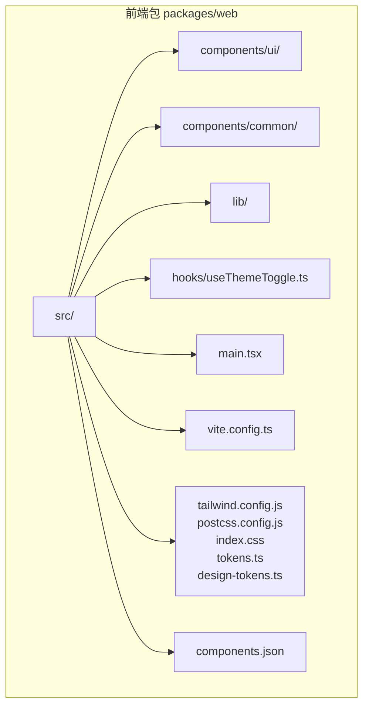
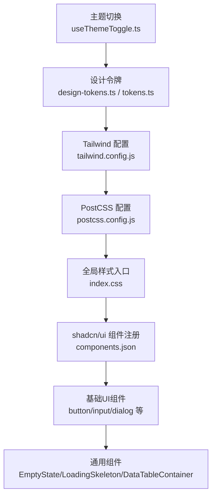
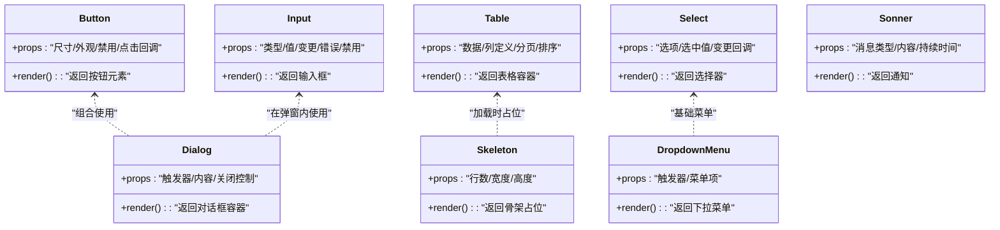
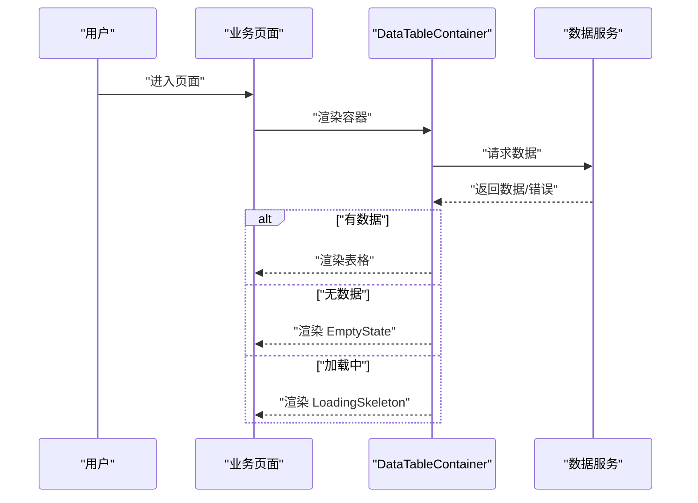
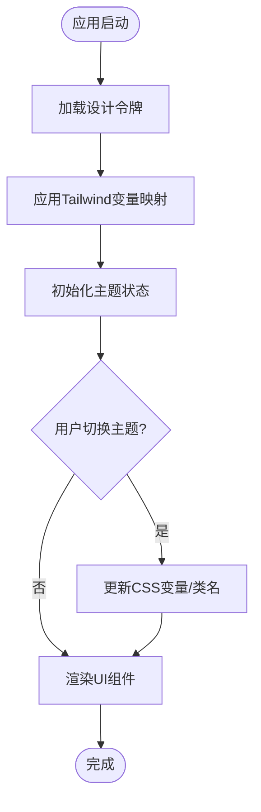
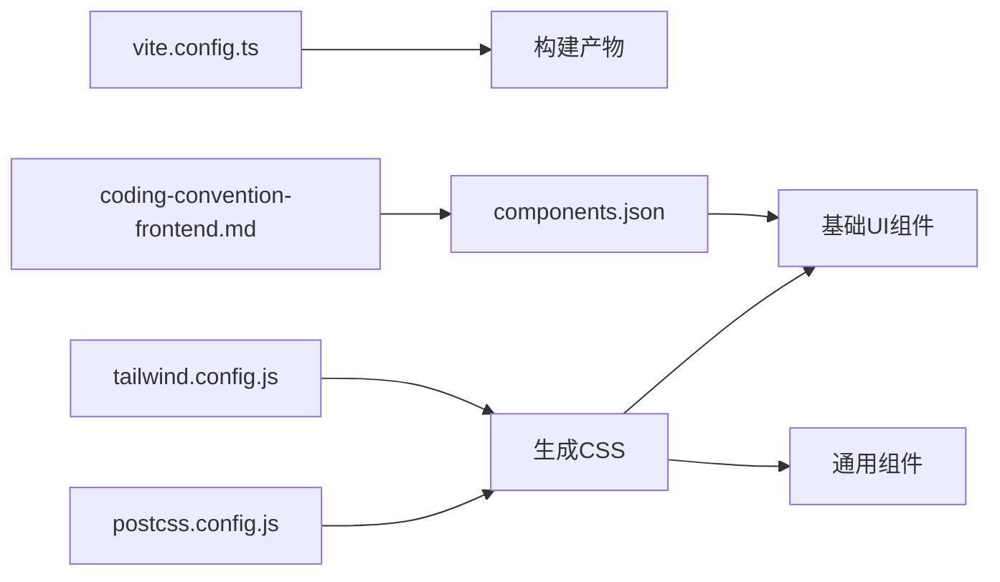

# UI组件库使用

<cite>
**本文引用的文件**
- [packages/web/src/components/ui/button.tsx](file://packages/web/src/components/ui/button.tsx)
- [packages/web/src/components/ui/input.tsx](file://packages/web/src/components/ui/input.tsx)
- [packages/web/src/components/ui/dialog.tsx](file://packages/web/src/components/ui/dialog.tsx)
- [packages/web/src/components/common/EmptyState.tsx](file://packages/web/src/components/common/EmptyState.tsx)
- [packages/web/src/components/common/LoadingSkeleton.tsx](file://packages/web/src/components/common/LoadingSkeleton.tsx)
- [packages/web/src/components/common/DataTableContainer.tsx](file://packages/web/src/components/common/DataTableContainer.tsx)
- [packages/web/src/lib/design-tokens.ts](file://packages/web/src/lib/design-tokens.ts)
- [packages/web/tailwind.config.js](file://packages/web/tailwind.config.js)
- [packages/web/postcss.config.js](file://packages/web/postcss.config.js)
- [packages/web/src/index.css](file://packages/web/src/index.css)
- [packages/web/src/tokens.ts](file://packages/web/src/tokens.ts)
- [packages/web/components.json](file://packages/web/components.json)
- [packages/web/package.json](file://packages/web/package.json)
- [packages/web/src/hooks/useThemeToggle.ts](file://packages/web/src/hooks/useThemeToggle.ts)
- [packages/web/src/components/ui/alert-dialog.tsx](file://packages/web/src/components/ui/alert-dialog.tsx)
- [packages/web/src/components/ui/skeleton.tsx](file://packages/web/src/components/ui/skeleton.tsx)
- [packages/web/src/components/ui/table.tsx](file://packages/web/src/components/ui/table.tsx)
- [packages/web/src/components/ui/select.tsx](file://packages/web/src/components/ui/select.tsx)
- [packages/web/src/components/ui/dropdown-menu.tsx](file://packages/web/src/components/ui/dropdown-menu.tsx)
- [packages/web/src/components/ui/badge.tsx](file://packages/web/src/components/ui/badge.tsx)
- [packages/web/src/components/ui/card.tsx](file://packages/web/src/components/ui/card.tsx)
- [packages/web/src/components/ui/checkbox.tsx](file://packages/web/src/components/ui/checkbox.tsx)
- [packages/web/src/components/ui/label.tsx](file://packages/web/src/components/ui/label.tsx)
- [packages/web/src/components/ui/sheet.tsx](file://packages/web/src/components/ui/sheet.tsx)
- [packages/web/src/components/ui/switch.tsx](file://packages/web/src/components/ui/switch.tsx)
- [packages/web/src/components/ui/tabs.tsx](file://packages/web/src/components/ui/tabs.tsx)
- [packages/web/src/components/ui/textarea.tsx](file://packages/web/src/components/ui/textarea.tsx)
- [packages/web/src/components/ui/tooltip.tsx](file://packages/web/src/components/ui/tooltip.tsx)
- [packages/web/src/components/ui/sonner.tsx](file://packages/web/src/components/ui/sonner.tsx)
- [packages/web/src/main.tsx](file://packages/web/src/main.tsx)
- [packages/web/vite.config.ts](file://packages/web/vite.config.ts)
- [docs/04-tech-design/coding-convention-frontend.md](file://docs/04-tech-design/coding-convention-frontend.md)
</cite>

## 目录
1. [简介](#简介)
2. [项目结构](#项目结构)
3. [核心组件](#核心组件)
4. [架构总览](#架构总览)
5. [详细组件分析](#详细组件分析)
6. [依赖关系分析](#依赖关系分析)
7. [性能考虑](#性能考虑)
8. [故障排除指南](#故障排除指南)
9. [结论](#结论)
10. [附录](#附录)

## 简介
本指南面向UI开发者，系统讲解AI原型管理系统中的UI组件库使用与定制方法。项目采用React + TypeScript + Tailwind CSS + shadcn/ui组件库，结合设计令牌体系与主题切换机制，提供统一、可扩展且可访问的组件开发体验。文档将从架构、组件使用、样式定制、响应式与无障碍、国际化支持等方面进行深入说明，并给出最佳实践与排障建议。

## 项目结构
UI组件库位于前端包 packages/web 中，核心组织方式如下：
- 组件层：基础UI组件（button、input、dialog等）位于 src/components/ui；通用业务组件（EmptyState、LoadingSkeleton、DataTableContainer等）位于 src/components/common；领域模型、项目管理等业务组件位于对应功能域目录。
- 样式与设计系统：tailwind.config.js、postcss.config.js、index.css、tokens.ts、design-tokens.ts 构成样式与设计令牌体系。
- 集成与工具：components.json 记录shadcn/ui组件注册；vite.config.ts 提供构建配置；useThemeToggle.ts 提供主题切换逻辑。
- 文档规范：coding-convention-frontend.md 规定了组件命名、版本锁定等约定。

**图表来源**
- [packages/web/src/main.tsx](file://packages/web/src/main.tsx)
- [packages/web/tailwind.config.js](file://packages/web/tailwind.config.js)
- [packages/web/components.json](file://packages/web/components.json)

**章节来源**
- [packages/web/src/main.tsx](file://packages/web/src/main.tsx)
- [packages/web/tailwind.config.js](file://packages/web/tailwind.config.js)
- [packages/web/components.json](file://packages/web/components.json)

## 核心组件
本节聚焦基础UI组件与通用组件的职责、使用场景与配置要点。

- 基础UI组件（来自shadcn/ui）
  - 按钮 Button：用于触发操作，支持尺寸、变体、状态等配置。
  - 输入 Input：文本输入控件，支持禁用、只读、错误态等。
  - 对话框 Dialog：模态交互容器，包含触发器与内容区。
  - 表格 Table：数据展示容器，配合表头、表体使用。
  - 选择 Select/DropdownMenu：下拉选择与菜单。
  - 复选框 Checkbox、开关 Switch：布尔选择。
  - 标签 Badge、卡片 Card：信息展示与分组。
  - 文本域 Textarea、标签 Label：辅助说明与多行输入。
  - 工具提示 Tooltip、通知 Sonner：轻量反馈与全局通知。
  - 警告对话框 AlertDialog：危险操作确认。
  - 骨架屏 Skeleton：加载占位。
- 通用组件
  - EmptyState：空状态占位，含标题、描述、操作按钮。
  - LoadingSkeleton：列表/表格骨架加载。
  - DataTableContainer：数据表格容器，封装分页、筛选、排序等交互。

使用建议：
- 基础组件优先复用shadcn/ui提供的变体与尺寸，避免重复造轮子。
- 通用组件用于提升业务一致性，如空状态与骨架屏应贯穿全站。
- 所有组件均遵循可访问性原则（见后续章节），并保持一致的动效与间距。

**章节来源**
- [packages/web/src/components/ui/button.tsx](file://packages/web/src/components/ui/button.tsx)
- [packages/web/src/components/ui/input.tsx](file://packages/web/src/components/ui/input.tsx)
- [packages/web/src/components/ui/dialog.tsx](file://packages/web/src/components/ui/dialog.tsx)
- [packages/web/src/components/common/EmptyState.tsx](file://packages/web/src/components/common/EmptyState.tsx)
- [packages/web/src/components/common/LoadingSkeleton.tsx](file://packages/web/src/components/common/LoadingSkeleton.tsx)
- [packages/web/src/components/common/DataTableContainer.tsx](file://packages/web/src/components/common/DataTableContainer.tsx)

## 架构总览
UI组件库整体架构围绕“设计令牌 → Tailwind → shadcn/ui组件 → 业务通用组件”的层级展开，主题切换通过上下文或状态驱动，构建工具链由Vite与PostCSS支撑。

**图表来源**
- [packages/web/src/hooks/useThemeToggle.ts](file://packages/web/src/hooks/useThemeToggle.ts)
- [packages/web/src/lib/design-tokens.ts](file://packages/web/src/lib/design-tokens.ts)
- [packages/web/src/tokens.ts](file://packages/web/src/tokens.ts)
- [packages/web/tailwind.config.js](file://packages/web/tailwind.config.js)
- [packages/web/postcss.config.js](file://packages/web/postcss.config.js)
- [packages/web/src/index.css](file://packages/web/src/index.css)
- [packages/web/components.json](file://packages/web/components.json)

## 详细组件分析

### 基础UI组件（Button、Input、Dialog等）
- Button：支持多种尺寸与外观变体，常用于表单提交、操作触发。使用时需明确语义角色与禁用状态。
- Input：提供受控与非受控两种模式，建议配合Label与错误提示使用。
- Dialog：包含触发器与内容区，注意键盘可访问性与焦点管理。
- Select/DropdownMenu：用于多选项选择，需处理默认值与空状态。
- 表格 Table：作为容器承载表头与行，建议与分页、筛选组件组合使用。
- 其他：Checkbox、Switch、Badge、Card、Textarea、Label、Tooltip、AlertDialog、Skeleton、Sonner 等按各自语义使用。

**图表来源**
- [packages/web/src/components/ui/button.tsx](file://packages/web/src/components/ui/button.tsx)
- [packages/web/src/components/ui/input.tsx](file://packages/web/src/components/ui/input.tsx)
- [packages/web/src/components/ui/dialog.tsx](file://packages/web/src/components/ui/dialog.tsx)
- [packages/web/src/components/ui/table.tsx](file://packages/web/src/components/ui/table.tsx)
- [packages/web/src/components/ui/select.tsx](file://packages/web/src/components/ui/select.tsx)
- [packages/web/src/components/ui/dropdown-menu.tsx](file://packages/web/src/components/ui/dropdown-menu.tsx)
- [packages/web/src/components/ui/skeleton.tsx](file://packages/web/src/components/ui/skeleton.tsx)
- [packages/web/src/components/ui/sonner.tsx](file://packages/web/src/components/ui/sonner.tsx)

**章节来源**
- [packages/web/src/components/ui/button.tsx](file://packages/web/src/components/ui/button.tsx)
- [packages/web/src/components/ui/input.tsx](file://packages/web/src/components/ui/input.tsx)
- [packages/web/src/components/ui/dialog.tsx](file://packages/web/src/components/ui/dialog.tsx)
- [packages/web/src/components/ui/table.tsx](file://packages/web/src/components/ui/table.tsx)
- [packages/web/src/components/ui/select.tsx](file://packages/web/src/components/ui/select.tsx)
- [packages/web/src/components/ui/dropdown-menu.tsx](file://packages/web/src/components/ui/dropdown-menu.tsx)
- [packages/web/src/components/ui/skeleton.tsx](file://packages/web/src/components/ui/skeleton.tsx)
- [packages/web/src/components/ui/sonner.tsx](file://packages/web/src/components/ui/sonner.tsx)

### 通用组件（EmptyState、LoadingSkeleton、DataTableContainer）
- EmptyState：用于无数据或失败后的引导页面，包含标题、描述与操作按钮，建议提供重试或引导动作。
- LoadingSkeleton：在数据加载期间显示骨架屏，减少感知延迟，提升流畅度。
- DataTableContainer：封装数据表格的常见交互（筛选、排序、分页），降低重复代码。

**图表来源**
- [packages/web/src/components/common/DataTableContainer.tsx](file://packages/web/src/components/common/DataTableContainer.tsx)
- [packages/web/src/components/common/EmptyState.tsx](file://packages/web/src/components/common/EmptyState.tsx)
- [packages/web/src/components/common/LoadingSkeleton.tsx](file://packages/web/src/components/common/LoadingSkeleton.tsx)

**章节来源**
- [packages/web/src/components/common/DataTableContainer.tsx](file://packages/web/src/components/common/DataTableContainer.tsx)
- [packages/web/src/components/common/EmptyState.tsx](file://packages/web/src/components/common/EmptyState.tsx)
- [packages/web/src/components/common/LoadingSkeleton.tsx](file://packages/web/src/components/common/LoadingSkeleton.tsx)

### 主题切换与样式定制
- 主题切换：通过 useThemeToggle.ts 提供主题状态与切换逻辑，建议与设计令牌联动，动态更新Tailwind变量。
- 设计令牌：design-tokens.ts 与 tokens.ts 定义颜色、字体、间距、圆角等基础变量，Tailwind通过配置映射到工具类。
- 样式入口：index.css 引入全局样式与变量，确保组件在不同主题下表现一致。
- shadcn/ui集成：components.json 记录组件注册，遵循版本锁定与一致性检查规范。

**图表来源**
- [packages/web/src/hooks/useThemeToggle.ts](file://packages/web/src/hooks/useThemeToggle.ts)
- [packages/web/src/lib/design-tokens.ts](file://packages/web/src/lib/design-tokens.ts)
- [packages/web/src/tokens.ts](file://packages/web/src/tokens.ts)
- [packages/web/tailwind.config.js](file://packages/web/tailwind.config.js)
- [packages/web/src/index.css](file://packages/web/src/index.css)
- [packages/web/components.json](file://packages/web/components.json)

**章节来源**
- [packages/web/src/hooks/useThemeToggle.ts](file://packages/web/src/hooks/useThemeToggle.ts)
- [packages/web/src/lib/design-tokens.ts](file://packages/web/src/lib/design-tokens.ts)
- [packages/web/src/tokens.ts](file://packages/web/src/tokens.ts)
- [packages/web/tailwind.config.js](file://packages/web/tailwind.config.js)
- [packages/web/src/index.css](file://packages/web/src/index.css)
- [packages/web/components.json](file://packages/web/components.json)

## 依赖关系分析
- 组件依赖：基础UI组件依赖Tailwind工具类与设计令牌；通用组件依赖基础UI组件与业务上下文。
- 构建依赖：Vite负责开发与打包；PostCSS处理CSS预处理；Tailwind生成样式。
- 版本与一致性：components.json 与编码规范文档共同保证组件安装与使用的一致性。

**图表来源**
- [packages/web/vite.config.ts](file://packages/web/vite.config.ts)
- [packages/web/postcss.config.js](file://packages/web/postcss.config.js)
- [packages/web/tailwind.config.js](file://packages/web/tailwind.config.js)
- [packages/web/components.json](file://packages/web/components.json)
- [docs/04-tech-design/coding-convention-frontend.md](file://docs/04-tech-design/coding-convention-frontend.md)

**章节来源**
- [packages/web/vite.config.ts](file://packages/web/vite.config.ts)
- [packages/web/postcss.config.js](file://packages/web/postcss.config.js)
- [packages/web/tailwind.config.js](file://packages/web/tailwind.config.js)
- [packages/web/components.json](file://packages/web/components.json)
- [docs/04-tech-design/coding-convention-frontend.md](file://docs/04-tech-design/coding-convention-frontend.md)

## 性能考虑
- 组件懒加载：对重型通用组件（如大数据表格）采用懒加载策略，减少首屏负担。
- 样式体积控制：仅引入所需Tailwind工具类，避免全量样式；通过tree-shaking与构建优化压缩CSS。
- 渲染优化：Skeleton与EmptyState在加载与空状态场景使用，减少白屏与闪烁。
- 动画与过渡：统一使用设计令牌中的动效参数，避免过度动画影响性能。

## 故障排除指南
- 组件未生效
  - 检查 components.json 是否与本地组件注册一致，必要时执行版本锁定检查。
  - 确认Tailwind配置已正确引入并扫描到组件路径。
- 样式异常
  - 检查设计令牌是否正确映射到Tailwind变量；确认index.css已加载。
  - 排查PostCSS插件顺序与版本兼容性。
- 主题切换无效
  - 确认 useThemeToggle.ts 的状态更新逻辑与CSS变量同步。
  - 检查全局类名切换是否覆盖到根节点或应用容器。
- 可访问性问题
  - 确保按钮、输入、对话框等具备正确的ARIA属性与键盘导航。
  - 对Tooltip、DropdownMenu等交互组件提供焦点管理与Esc键退出。

**章节来源**
- [packages/web/components.json](file://packages/web/components.json)
- [packages/web/tailwind.config.js](file://packages/web/tailwind.config.js)
- [packages/web/src/index.css](file://packages/web/src/index.css)
- [packages/web/postcss.config.js](file://packages/web/postcss.config.js)
- [packages/web/src/hooks/useThemeToggle.ts](file://packages/web/src/hooks/useThemeToggle.ts)
- [docs/04-tech-design/coding-convention-frontend.md](file://docs/04-tech-design/coding-convention-frontend.md)

## 结论
本UI组件库以shadcn/ui为基础，结合设计令牌与Tailwind工具类，形成统一、可扩展的组件体系。通过主题切换、通用组件与可访问性约束，开发者可以高效构建一致且高质量的界面。建议在新功能开发中严格遵循组件使用规范与样式定制流程，确保长期可维护性与用户体验。

## 附录
- 组件样式覆盖与扩展
  - 使用Tailwind自定义工具类扩展组件外观，避免破坏组件内部结构。
  - 通过设计令牌集中管理颜色、字体、间距，确保跨组件一致性。
- 响应式设计与移动端适配
  - 基于Tailwind断点系统编写响应式布局，优先使用语义化容器与网格。
  - 在移动设备上简化交互复杂度，优先保留核心功能与可访问性。
- 可访问性与国际化支持
  - 为所有交互元素提供清晰的标签与提示，支持键盘导航与屏幕阅读器。
  - 国际化文案通过上下文或i18n库注入，避免硬编码文本。