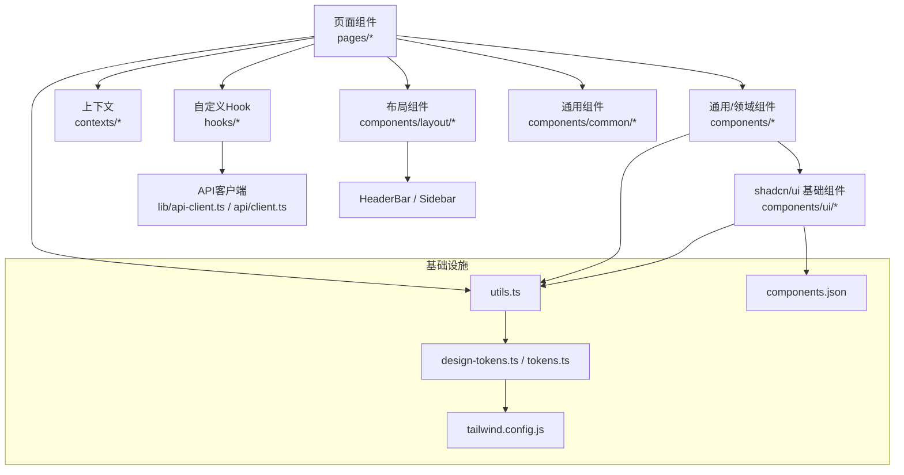
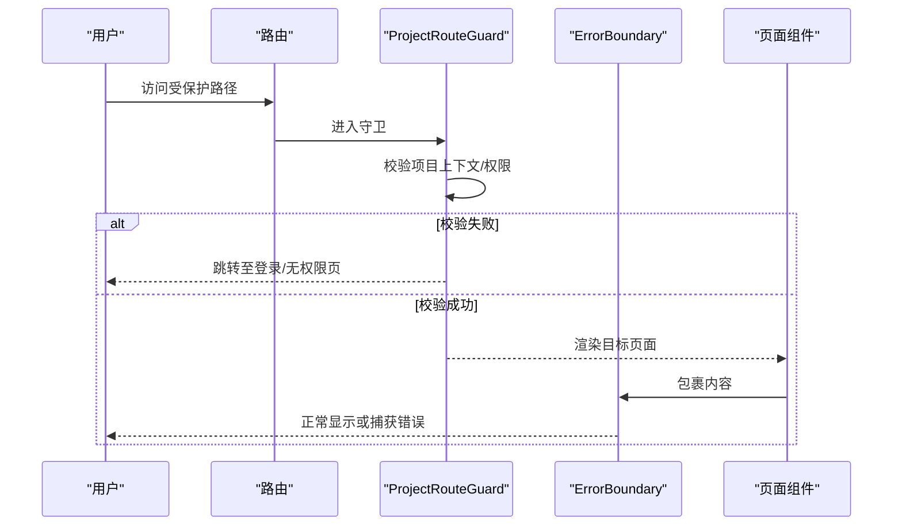
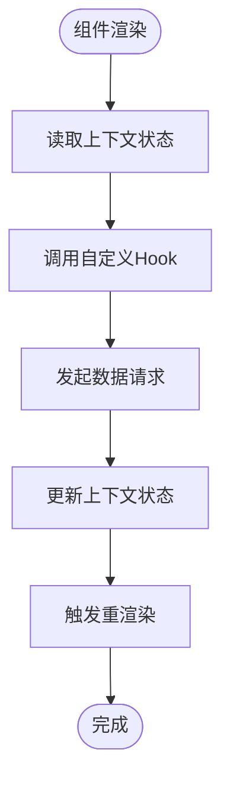
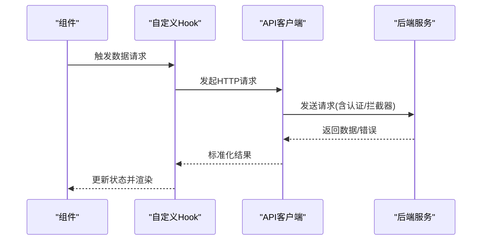
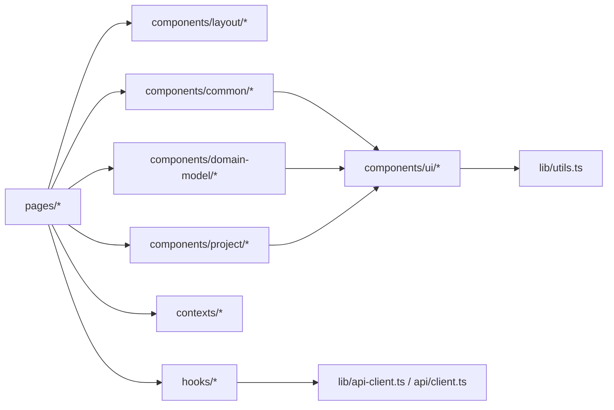

# 前端开发

<cite>
**本文引用的文件**
- [packages/web/src/main.tsx](file://packages/web/src/main.tsx)
- [packages/web/src/App.tsx](file://packages/web/src/App.tsx)
- [packages/web/vite.config.ts](file://packages/web/vite.config.ts)
- [packages/web/package.json](file://packages/web/package.json)
- [packages/web/tsconfig.json](file://packages/web/tsconfig.json)
- [packages/web/tailwind.config.js](file://packages/web/tailwind.config.js)
- [packages/web/components.json](file://packages/web/components.json)
- [packages/web/src/lib/design-tokens.ts](file://packages/web/src/lib/design-tokens.ts)
- [packages/web/src/tokens.ts](file://packages/web/src/tokens.ts)
- [packages/web/src/lib/utils.ts](file://packages/web/src/lib/utils.ts)
- [packages/web/src/lib/api-client.ts](file://packages/web/src/lib/api-client.ts)
- [packages/web/src/api/client.ts](file://packages/web/src/api/client.ts)
- [packages/web/src/pages/ProjectList.tsx](file://packages/web/src/pages/ProjectList.tsx)
- [packages/web/src/pages/ProjectDetail.tsx](file://packages/web/src/pages/ProjectDetail.tsx)
- [packages/web/src/pages/Dashboard.tsx](file://packages/web/src/pages/Dashboard.tsx)
- [packages/web/src/pages/DomainModelPage.tsx](file://packages/web/src/pages/DomainModelPage.tsx)
- [packages/web/src/pages/OrganizationPage.tsx](file://packages/web/src/pages/OrganizationPage.tsx)
- [packages/web/src/pages/RolesPage.tsx](file://packages/web/src/pages/RolesPage.tsx)
- [packages/web/src/pages/RoleDetailPage.tsx](file://packages/web/src/pages/RoleDetailPage.tsx)
- [packages/web/src/pages/ExternalEntitiesPage.tsx](file://packages/web/src/pages/ExternalEntitiesPage.tsx)
- [packages/web/src/pages/ExternalEntityDetailPage.tsx](file://packages/web/src/pages/ExternalEntityDetailPage.tsx)
- [packages/web/src/pages/ApplicationsPage.tsx](file://packages/web/src/pages/ApplicationsPage.tsx)
- [packages/web/src/pages/MenuManagement.tsx](file://packages/web/src/pages/MenuManagement.tsx)
- [packages/web/src/Layout.tsx](file://packages/web/src/Layout.tsx)
- [packages/web/src/ProjectRouteGuard.tsx](file://packages/web/src/ProjectRouteGuard.tsx)
- [packages/web/src/ErrorBoundary.tsx](file://packages/web/src/ErrorBoundary.tsx)
- [packages/web/src/hooks/useProjectList.ts](file://packages/web/src/hooks/useProjectList.ts)
- [packages/web/src/hooks/useProjectDetail.ts](file://packages/web/src/hooks/useProjectDetail.ts)
- [packages/web/src/hooks/useApplications.ts](file://packages/web/src/hooks/useApplications.ts)
- [packages/web/src/hooks/useOrganization.ts](file://packages/web/src/hooks/useOrganization.ts)
- [packages/web/src/hooks/useDomainModel.ts](file://packages/web/src/hooks/useDomainModel.ts)
- [packages/web/src/hooks/useRoleBehavior.ts](file://packages/web/src/hooks/useRoleBehavior.ts)
- [packages/web/src/hooks/useExternalEntityBehavior.ts](file://packages/web/src/hooks/useExternalEntityBehavior.ts)
- [packages/web/src/hooks/useThemeToggle.ts](file://packages/web/src/hooks/useThemeToggle.ts)
- [packages/web/src/contexts/ProjectContext.tsx](file://packages/web/src/contexts/ProjectContext.tsx)
- [packages/web/src/contexts/DomainModelContext.tsx](file://packages/web/src/contexts/DomainModelContext.tsx)
- [packages/web/src/components/layout/HeaderBar.tsx](file://packages/web/src/components/layout/HeaderBar.tsx)
- [packages/web/src/components/layout/Sidebar.tsx](file://packages/web/src/components/layout/Sidebar.tsx)
- [packages/web/src/components/common/PageHeader.tsx](file://packages/web/src/components/common/PageHeader.tsx)
- [packages/web/src/components/common/PaginationComponent.tsx](file://packages/web/src/components/common/PaginationComponent.tsx)
- [packages/web/src/components/common/DataTableContainer.tsx](file://packages/web/src/components/common/DataTableContainer.tsx)
- [packages/web/src/components/common/StatusBadge.tsx](file://packages/web/src/components/common/StatusBadge.tsx)
- [packages/web/src/components/domain-model/DomainModelEditor.tsx](file://packages/web/src/components/domain-model/DomainModelEditor.tsx)
- [packages/web/src/components/domain-model/canvas/ERCanvas.tsx](file://packages/web/src/components/domain-model/canvas/ERCanvas.tsx)
- [packages/web/src/components/domain-model/dialogs/CreateEntityDialog.tsx](file://packages/web/src/components/domain-model/dialogs/CreateEntityDialog.tsx)
- [packages/web/src/components/domain-model/dialogs/DeleteEntityDialog.tsx](file://packages/web/src/components/domain-model/dialogs/DeleteEntityDialog.tsx)
- [packages/web/src/components/project/ProjectTable.tsx](file://packages/web/src/components/project/ProjectTable.tsx)
- [packages/web/src/components/project/ProjectInfoCard.tsx](file://packages/web/src/components/project/ProjectInfoCard.tsx)
- [packages/web/src/components/project/ArchiveConfirmDialog.tsx](file://packages/web/src/components/project/ArchiveConfirmDialog.tsx)
- [packages/web/src/components/ui/button.tsx](file://packages/web/src/components/ui/button.tsx)
- [packages/web/src/components/ui/dialog.tsx](file://packages/web/src/components/ui/dialog.tsx)
- [packages/web/src/components/ui/table.tsx](file://packages/web/src/components/ui/table.tsx)
- [packages/web/src/components/ui/input.tsx](file://packages/web/src/components/ui/input.tsx)
- [packages/web/src/components/ui/select.tsx](file://packages/web/src/components/ui/select.tsx)
- [packages/web/src/components/ui/sheet.tsx](file://packages/web/src/components/ui/sheet.tsx)
- [packages/web/src/components/ui/badge.tsx](file://packages/web/src/components/ui/badge.tsx)
- [packages/web/src/components/ui/card.tsx](file://packages/web/src/components/ui/card.tsx)
- [packages/web/src/components/ui/dropdown-menu.tsx](file://packages/web/src/components/ui/dropdown-menu.tsx)
- [packages/web/src/components/ui/alert-dialog.tsx](file://packages/web/src/components/ui/alert-dialog.tsx)
- [packages/web/src/components/ui/checkbox.tsx](file://packages/web/src/components/ui/checkbox.tsx)
- [packages/web/src/components/ui/label.tsx](file://packages/web/src/components/ui/label.tsx)
- [packages/web/src/components/ui/skeleton.tsx](file://packages/web/src/components/ui/skeleton.tsx)
- [packages/web/src/components/ui/sonner.tsx](file://packages/web/src/components/ui/sonner.tsx)
- [packages/web/src/components/ui/switch.tsx](file://packages/web/src/components/ui/switch.tsx)
- [packages/web/src/components/ui/tabs.tsx](file://packages/web/src/components/ui/tabs.tsx)
- [packages/web/src/components/ui/textarea.tsx](file://packages/web/src/components/ui/textarea.tsx)
- [packages/web/src/components/ui/tooltip.tsx](file://packages/web/src/components/ui/tooltip.tsx)
</cite>

## 目录
1. [简介](#简介)
2. [项目结构](#项目结构)
3. [核心组件](#核心组件)
4. [架构总览](#架构总览)
5. [详细组件分析](#详细组件分析)
6. [依赖关系分析](#依赖关系分析)
7. [性能考虑](#性能考虑)
8. [故障排查指南](#故障排查指南)
9. [结论](#结论)
10. [附录](#附录)

## 简介
本指南面向AI原型管理系统前端团队，系统性介绍基于 React + Vite + TypeScript 的技术栈与工程实践，涵盖 shadcn/ui 组件库的使用与定制、React Router 路由与导航、状态管理与组件通信、响应式与移动端适配、UI 开发规范与最佳实践、前后端 API 集成与数据获取策略、性能优化与调试方法、组件测试与质量保障，以及前端部署与 CI/CD 流程建议。目标是帮助前端开发者高效开展功能开发与长期维护。

## 项目结构
前端工程位于 packages/web，采用模块化目录组织，按功能域划分 pages、components、hooks、contexts、lib 等层次，配合 Vite 构建工具链与 Tailwind CSS 样式体系，形成清晰的职责边界与可扩展的开发体验。

```mermaid
graph TB
subgraph "入口与应用"
MAIN["main.tsx"]
APP["App.tsx"]
LAYOUT["Layout.tsx"]
GUARD["ProjectRouteGuard.tsx"]
ERR["ErrorBoundary.tsx"]
end
subgraph "页面层"
P_LIST["ProjectList.tsx"]
P_DETAIL["ProjectDetail.tsx"]
DASHBOARD["Dashboard.tsx"]
DM["DomainModelPage.tsx"]
ORG["OrganizationPage.tsx"]
ROLES["RolesPage.tsx"]
ROLE_DETAIL["RoleDetailPage.tsx"]
EXTS["ExternalEntitiesPage.tsx"]
EXT_DETAIL["ExternalEntityDetailPage.tsx"]
APPS["ApplicationsPage.tsx"]
MENU["MenuManagement.tsx"]
end
subgraph "组件层"
subgraph "布局"
HEADER["HeaderBar.tsx"]
SIDEBAR["Sidebar.tsx"]
end
subgraph "通用"
PAGEHDR["PageHeader.tsx"]
PAGIN["PaginationComponent.tsx"]
DATATBL["DataTableContainer.tsx"]
STATUS["StatusBadge.tsx"]
end
subgraph "领域模型"
DM_EDITOR["DomainModelEditor.tsx"]
DM_CANVAS["ERCanvas.tsx"]
DM_DIALOGS["... 多个对话框组件"]
end
subgraph "项目"
P_TABLE["ProjectTable.tsx"]
P_CARD["ProjectInfoCard.tsx"]
ARCHIVE["ArchiveConfirmDialog.tsx"]
end
subgraph "UI基础"
UI_BTN["button.tsx"]
UI_DIALOG["dialog.tsx"]
UI_TABLE["table.tsx"]
UI_INPUT["input.tsx"]
UI_SELECT["select.tsx"]
UI_SHEET["sheet.tsx"]
UI_BADGE["badge.tsx"]
UI_CARD["card.tsx"]
UI_DROP["dropdown-menu.tsx"]
UI_ALERT["alert-dialog.tsx"]
UI_CHECK["checkbox.tsx"]
UI_LABEL["label.tsx"]
UI_SKELETON["skeleton.tsx"]
UI_SONNER["sonner.tsx"]
UI_SWITCH["switch.tsx"]
UI_TABS["tabs.tsx"]
UI_TEXTAREA["textarea.tsx"]
UI_TOOLTIP["tooltip.tsx"]
end
end
subgraph "上下文与钩子"
CTX_PROJECT["ProjectContext.tsx"]
CTX_DM["DomainModelContext.tsx"]
HK_PLIST["useProjectList.ts"]
HK_PDETAIL["useProjectDetail.ts"]
HK_APPS["useApplications.ts"]
HK_ORG["useOrganization.ts"]
HK_DM["useDomainModel.ts"]
HK_ROLE["useRoleBehavior.ts"]
HK_EXT["useExternalEntityBehavior.ts"]
HK_THEME["useThemeToggle.ts"]
end
subgraph "基础设施"
API_CLIENT["lib/api-client.ts"]
API_TS["api/client.ts"]
UTILS["lib/utils.ts"]
DESIGN_TOKENS["lib/design-tokens.ts"]
TOKENS["tokens.ts"]
TAILWIND["tailwind.config.js"]
COMPONENTS_JSON["components.json"]
end
MAIN --> APP
APP --> LAYOUT
LAYOUT --> HEADER
LAYOUT --> SIDEBAR
LAYOUT --> GUARD
GUARD --> ERR
LAYOUT --> P_LIST
LAYOUT --> P_DETAIL
LAYOUT --> DASHBOARD
LAYOUT --> DM
LAYOUT --> ORG
LAYOUT --> ROLES
LAYOUT --> ROLE_DETAIL
LAYOUT --> EXTS
LAYOUT --> EXT_DETAIL
LAYOUT --> APPS
LAYOUT --> MENU
P_LIST --> CTX_PROJECT
P_DETAIL --> CTX_PROJECT
DM --> CTX_DM
HK_PLIST --> API_CLIENT
HK_PDETAIL --> API_CLIENT
HK_APPS --> API_CLIENT
HK_ORG --> API_CLIENT
HK_DM --> API_CLIENT
HK_ROLE --> API_CLIENT
HK_EXT --> API_CLIENT
HK_THEME --> UTILS
UI_BTN --> UTILS
UI_DIALOG --> UTILS
UI_TABLE --> UTILS
UI_INPUT --> UTILS
UI_SELECT --> UTILS
UI_SHEET --> UTILS
UI_BADGE --> UTILS
UI_CARD --> UTILS
UI_DROP --> UTILS
UI_ALERT --> UTILS
UI_CHECK --> UTILS
UI_LABEL --> UTILS
UI_SKELETON --> UTILS
UI_SONNER --> UTILS
UI_SWITCH --> UTILS
UI_TABS --> UTILS
UI_TEXTAREA --> UTILS
UI_TOOLTIP --> UTILS
```



图表来源
- [packages/web/src/main.tsx](file://packages/web/src/main.tsx)
- [packages/web/src/App.tsx](file://packages/web/src/App.tsx)
- [packages/web/src/Layout.tsx](file://packages/web/src/Layout.tsx)
- [packages/web/src/ProjectRouteGuard.tsx](file://packages/web/src/ProjectRouteGuard.tsx)
- [packages/web/src/ErrorBoundary.tsx](file://packages/web/src/ErrorBoundary.tsx)
- [packages/web/src/pages/ProjectList.tsx](file://packages/web/src/pages/ProjectList.tsx)
- [packages/web/src/pages/ProjectDetail.tsx](file://packages/web/src/pages/ProjectDetail.tsx)
- [packages/web/src/pages/Dashboard.tsx](file://packages/web/src/pages/Dashboard.tsx)
- [packages/web/src/pages/DomainModelPage.tsx](file://packages/web/src/pages/DomainModelPage.tsx)
- [packages/web/src/pages/OrganizationPage.tsx](file://packages/web/src/pages/OrganizationPage.tsx)
- [packages/web/src/pages/RolesPage.tsx](file://packages/web/src/pages/RolesPage.tsx)
- [packages/web/src/pages/RoleDetailPage.tsx](file://packages/web/src/pages/RoleDetailPage.tsx)
- [packages/web/src/pages/ExternalEntitiesPage.tsx](file://packages/web/src/pages/ExternalEntitiesPage.tsx)
- [packages/web/src/pages/ExternalEntityDetailPage.tsx](file://packages/web/src/pages/ExternalEntityDetailPage.tsx)
- [packages/web/src/pages/ApplicationsPage.tsx](file://packages/web/src/pages/ApplicationsPage.tsx)
- [packages/web/src/pages/MenuManagement.tsx](file://packages/web/src/pages/MenuManagement.tsx)
- [packages/web/src/components/layout/HeaderBar.tsx](file://packages/web/src/components/layout/HeaderBar.tsx)
- [packages/web/src/components/layout/Sidebar.tsx](file://packages/web/src/components/layout/Sidebar.tsx)
- [packages/web/src/components/common/PageHeader.tsx](file://packages/web/src/components/common/PageHeader.tsx)
- [packages/web/src/components/common/PaginationComponent.tsx](file://packages/web/src/components/common/PaginationComponent.tsx)
- [packages/web/src/components/common/DataTableContainer.tsx](file://packages/web/src/components/common/DataTableContainer.tsx)
- [packages/web/src/components/common/StatusBadge.tsx](file://packages/web/src/components/common/StatusBadge.tsx)
- [packages/web/src/components/domain-model/DomainModelEditor.tsx](file://packages/web/src/components/domain-model/DomainModelEditor.tsx)
- [packages/web/src/components/domain-model/canvas/ERCanvas.tsx](file://packages/web/src/components/domain-model/canvas/ERCanvas.tsx)
- [packages/web/src/components/domain-model/dialogs/CreateEntityDialog.tsx](file://packages/web/src/components/domain-model/dialogs/CreateEntityDialog.tsx)
- [packages/web/src/components/domain-model/dialogs/DeleteEntityDialog.tsx](file://packages/web/src/components/domain-model/dialogs/DeleteEntityDialog.tsx)
- [packages/web/src/components/project/ProjectTable.tsx](file://packages/web/src/components/project/ProjectTable.tsx)
- [packages/web/src/components/project/ProjectInfoCard.tsx](file://packages/web/src/components/project/ProjectInfoCard.tsx)
- [packages/web/src/components/project/ArchiveConfirmDialog.tsx](file://packages/web/src/components/project/ArchiveConfirmDialog.tsx)
- [packages/web/src/components/ui/button.tsx](file://packages/web/src/components/ui/button.tsx)
- [packages/web/src/components/ui/dialog.tsx](file://packages/web/src/components/ui/dialog.tsx)
- [packages/web/src/components/ui/table.tsx](file://packages/web/src/components/ui/table.tsx)
- [packages/web/src/components/ui/input.tsx](file://packages/web/src/components/ui/input.tsx)
- [packages/web/src/components/ui/select.tsx](file://packages/web/src/components/ui/select.tsx)
- [packages/web/src/components/ui/sheet.tsx](file://packages/web/src/components/ui/sheet.tsx)
- [packages/web/src/components/ui/badge.tsx](file://packages/web/src/components/ui/badge.tsx)
- [packages/web/src/components/ui/card.tsx](file://packages/web/src/components/ui/card.tsx)
- [packages/web/src/components/ui/dropdown-menu.tsx](file://packages/web/src/components/ui/dropdown-menu.tsx)
- [packages/web/src/components/ui/alert-dialog.tsx](file://packages/web/src/components/ui/alert-dialog.tsx)
- [packages/web/src/components/ui/checkbox.tsx](file://packages/web/src/components/ui/checkbox.tsx)
- [packages/web/src/components/ui/label.tsx](file://packages/web/src/components/ui/label.tsx)
- [packages/web/src/components/ui/skeleton.tsx](file://packages/web/src/components/ui/skeleton.tsx)
- [packages/web/src/components/ui/sonner.tsx](file://packages/web/src/components/ui/sonner.tsx)
- [packages/web/src/components/ui/switch.tsx](file://packages/web/src/components/ui/switch.tsx)
- [packages/web/src/components/ui/tabs.tsx](file://packages/web/src/components/ui/tabs.tsx)
- [packages/web/src/components/ui/textarea.tsx](file://packages/web/src/components/ui/textarea.tsx)
- [packages/web/src/components/ui/tooltip.tsx](file://packages/web/src/components/ui/tooltip.tsx)
- [packages/web/src/contexts/ProjectContext.tsx](file://packages/web/src/contexts/ProjectContext.tsx)
- [packages/web/src/contexts/DomainModelContext.tsx](file://packages/web/src/contexts/DomainModelContext.tsx)
- [packages/web/src/hooks/useProjectList.ts](file://packages/web/src/hooks/useProjectList.ts)
- [packages/web/src/hooks/useProjectDetail.ts](file://packages/web/src/hooks/useProjectDetail.ts)
- [packages/web/src/hooks/useApplications.ts](file://packages/web/src/hooks/useApplications.ts)
- [packages/web/src/hooks/useOrganization.ts](file://packages/web/src/hooks/useOrganization.ts)
- [packages/web/src/hooks/useDomainModel.ts](file://packages/web/src/hooks/useDomainModel.ts)
- [packages/web/src/hooks/useRoleBehavior.ts](file://packages/web/src/hooks/useRoleBehavior.ts)
- [packages/web/src/hooks/useExternalEntityBehavior.ts](file://packages/web/src/hooks/useExternalEntityBehavior.ts)
- [packages/web/src/hooks/useThemeToggle.ts](file://packages/web/src/hooks/useThemeToggle.ts)
- [packages/web/src/lib/api-client.ts](file://packages/web/src/lib/api-client.ts)
- [packages/web/src/api/client.ts](file://packages/web/src/api/client.ts)
- [packages/web/src/lib/utils.ts](file://packages/web/src/lib/utils.ts)
- [packages/web/src/lib/design-tokens.ts](file://packages/web/src/lib/design-tokens.ts)
- [packages/web/src/tokens.ts](file://packages/web/src/tokens.ts)
- [packages/web/tailwind.config.js](file://packages/web/tailwind.config.js)
- [packages/web/components.json](file://packages/web/components.json)

章节来源
- [packages/web/src/main.tsx](file://packages/web/src/main.tsx)
- [packages/web/src/App.tsx](file://packages/web/src/App.tsx)
- [packages/web/vite.config.ts](file://packages/web/vite.config.ts)
- [packages/web/package.json](file://packages/web/package.json)
- [packages/web/tsconfig.json](file://packages/web/tsconfig.json)
- [packages/web/tailwind.config.js](file://packages/web/tailwind.config.js)
- [packages/web/components.json](file://packages/web/components.json)

## 核心组件
- 应用入口与根组件：负责挂载应用、全局样式注入、路由守卫与错误边界包裹。
- 页面组件：围绕业务域划分，如项目列表、项目详情、仪表盘、领域模型、组织、角色、外部实体、应用与菜单管理等。
- 布局组件：页头导航与侧边栏，统一导航与面包屑。
- 通用组件：分页、数据表格容器、空状态、状态徽章等复用组件。
- 领域模型组件：编辑器、画布、工具箱与各类对话框。
- 项目组件：表格、卡片、归档确认等。
- UI 基础组件：基于 shadcn/ui 的按钮、对话框、表格、输入、选择、侧边栏、徽章、卡片、下拉菜单、警告对话框、复选框、标签、骨架屏、通知、开关、标签页、文本域、提示等。
- 上下文与钩子：项目上下文、领域模型上下文；项目列表、项目详情、应用、组织、领域模型、角色行为、外部实体行为、主题切换等自定义 Hook。
- 基础设施：API 客户端封装、设计令牌、工具函数、Tailwind 配置与 shadcn/ui 组件映射。

章节来源
- [packages/web/src/main.tsx](file://packages/web/src/main.tsx)
- [packages/web/src/App.tsx](file://packages/web/src/App.tsx)
- [packages/web/src/Layout.tsx](file://packages/web/src/Layout.tsx)
- [packages/web/src/ProjectRouteGuard.tsx](file://packages/web/src/ProjectRouteGuard.tsx)
- [packages/web/src/ErrorBoundary.tsx](file://packages/web/src/ErrorBoundary.tsx)
- [packages/web/src/components/layout/HeaderBar.tsx](file://packages/web/src/components/layout/HeaderBar.tsx)
- [packages/web/src/components/layout/Sidebar.tsx](file://packages/web/src/components/layout/Sidebar.tsx)
- [packages/web/src/components/common/PageHeader.tsx](file://packages/web/src/components/common/PageHeader.tsx)
- [packages/web/src/components/common/PaginationComponent.tsx](file://packages/web/src/components/common/PaginationComponent.tsx)
- [packages/web/src/components/common/DataTableContainer.tsx](file://packages/web/src/components/common/DataTableContainer.tsx)
- [packages/web/src/components/common/StatusBadge.tsx](file://packages/web/src/components/common/StatusBadge.tsx)
- [packages/web/src/components/domain-model/DomainModelEditor.tsx](file://packages/web/src/components/domain-model/DomainModelEditor.tsx)
- [packages/web/src/components/domain-model/canvas/ERCanvas.tsx](file://packages/web/src/components/domain-model/canvas/ERCanvas.tsx)
- [packages/web/src/components/domain-model/dialogs/CreateEntityDialog.tsx](file://packages/web/src/components/domain-model/dialogs/CreateEntityDialog.tsx)
- [packages/web/src/components/domain-model/dialogs/DeleteEntityDialog.tsx](file://packages/web/src/components/domain-model/dialogs/DeleteEntityDialog.tsx)
- [packages/web/src/components/project/ProjectTable.tsx](file://packages/web/src/components/project/ProjectTable.tsx)
- [packages/web/src/components/project/ProjectInfoCard.tsx](file://packages/web/src/components/project/ProjectInfoCard.tsx)
- [packages/web/src/components/project/ArchiveConfirmDialog.tsx](file://packages/web/src/components/project/ArchiveConfirmDialog.tsx)
- [packages/web/src/components/ui/button.tsx](file://packages/web/src/components/ui/button.tsx)
- [packages/web/src/components/ui/dialog.tsx](file://packages/web/src/components/ui/dialog.tsx)
- [packages/web/src/components/ui/table.tsx](file://packages/web/src/components/ui/table.tsx)
- [packages/web/src/components/ui/input.tsx](file://packages/web/src/components/ui/input.tsx)
- [packages/web/src/components/ui/select.tsx](file://packages/web/src/components/ui/select.tsx)
- [packages/web/src/components/ui/sheet.tsx](file://packages/web/src/components/ui/sheet.tsx)
- [packages/web/src/components/ui/badge.tsx](file://packages/web/src/components/ui/badge.tsx)
- [packages/web/src/components/ui/card.tsx](file://packages/web/src/components/ui/card.tsx)
- [packages/web/src/components/ui/dropdown-menu.tsx](file://packages/web/src/components/ui/dropdown-menu.tsx)
- [packages/web/src/components/ui/alert-dialog.tsx](file://packages/web/src/components/ui/alert-dialog.tsx)
- [packages/web/src/components/ui/checkbox.tsx](file://packages/web/src/components/ui/checkbox.tsx)
- [packages/web/src/components/ui/label.tsx](file://packages/web/src/components/ui/label.tsx)
- [packages/web/src/components/ui/skeleton.tsx](file://packages/web/src/components/ui/skeleton.tsx)
- [packages/web/src/components/ui/sonner.tsx](file://packages/web/src/components/ui/sonner.tsx)
- [packages/web/src/components/ui/switch.tsx](file://packages/web/src/components/ui/switch.tsx)
- [packages/web/src/components/ui/tabs.tsx](file://packages/web/src/components/ui/tabs.tsx)
- [packages/web/src/components/ui/textarea.tsx](file://packages/web/src/components/ui/textarea.tsx)
- [packages/web/src/components/ui/tooltip.tsx](file://packages/web/src/components/ui/tooltip.tsx)
- [packages/web/src/contexts/ProjectContext.tsx](file://packages/web/src/contexts/ProjectContext.tsx)
- [packages/web/src/contexts/DomainModelContext.tsx](file://packages/web/src/contexts/DomainModelContext.tsx)
- [packages/web/src/hooks/useProjectList.ts](file://packages/web/src/hooks/useProjectList.ts)
- [packages/web/src/hooks/useProjectDetail.ts](file://packages/web/src/hooks/useProjectDetail.ts)
- [packages/web/src/hooks/useApplications.ts](file://packages/web/src/hooks/useApplications.ts)
- [packages/web/src/hooks/useOrganization.ts](file://packages/web/src/hooks/useOrganization.ts)
- [packages/web/src/hooks/useDomainModel.ts](file://packages/web/src/hooks/useDomainModel.ts)
- [packages/web/src/hooks/useRoleBehavior.ts](file://packages/web/src/hooks/useRoleBehavior.ts)
- [packages/web/src/hooks/useExternalEntityBehavior.ts](file://packages/web/src/hooks/useExternalEntityBehavior.ts)
- [packages/web/src/hooks/useThemeToggle.ts](file://packages/web/src/hooks/useThemeToggle.ts)
- [packages/web/src/lib/api-client.ts](file://packages/web/src/lib/api-client.ts)
- [packages/web/src/api/client.ts](file://packages/web/src/api/client.ts)
- [packages/web/src/lib/utils.ts](file://packages/web/src/lib/utils.ts)
- [packages/web/src/lib/design-tokens.ts](file://packages/web/src/lib/design-tokens.ts)
- [packages/web/src/tokens.ts](file://packages/web/src/tokens.ts)
- [packages/web/tailwind.config.js](file://packages/web/tailwind.config.js)
- [packages/web/components.json](file://packages/web/components.json)

## 架构总览
前端采用“页面-组件-上下文/钩子-基础设施”的分层架构。页面组件负责业务编排，通用与领域组件提供可复用能力，上下文与自定义 Hook 抽象数据与状态逻辑，基础设施提供设计令牌、工具函数与 API 封装。



图表来源
- [packages/web/src/pages/ProjectList.tsx](file://packages/web/src/pages/ProjectList.tsx)
- [packages/web/src/pages/ProjectDetail.tsx](file://packages/web/src/pages/ProjectDetail.tsx)
- [packages/web/src/pages/Dashboard.tsx](file://packages/web/src/pages/Dashboard.tsx)
- [packages/web/src/pages/DomainModelPage.tsx](file://packages/web/src/pages/DomainModelPage.tsx)
- [packages/web/src/pages/OrganizationPage.tsx](file://packages/web/src/pages/OrganizationPage.tsx)
- [packages/web/src/pages/RolesPage.tsx](file://packages/web/src/pages/RolesPage.tsx)
- [packages/web/src/pages/RoleDetailPage.tsx](file://packages/web/src/pages/RoleDetailPage.tsx)
- [packages/web/src/pages/ExternalEntitiesPage.tsx](file://packages/web/src/pages/ExternalEntitiesPage.tsx)
- [packages/web/src/pages/ExternalEntityDetailPage.tsx](file://packages/web/src/pages/ExternalEntityDetailPage.tsx)
- [packages/web/src/pages/ApplicationsPage.tsx](file://packages/web/src/pages/ApplicationsPage.tsx)
- [packages/web/src/pages/MenuManagement.tsx](file://packages/web/src/pages/MenuManagement.tsx)
- [packages/web/src/components/layout/HeaderBar.tsx](file://packages/web/src/components/layout/HeaderBar.tsx)
- [packages/web/src/components/layout/Sidebar.tsx](file://packages/web/src/components/layout/Sidebar.tsx)
- [packages/web/src/components/common/PageHeader.tsx](file://packages/web/src/components/common/PageHeader.tsx)
- [packages/web/src/components/common/PaginationComponent.tsx](file://packages/web/src/components/common/PaginationComponent.tsx)
- [packages/web/src/components/common/DataTableContainer.tsx](file://packages/web/src/components/common/DataTableContainer.tsx)
- [packages/web/src/components/common/StatusBadge.tsx](file://packages/web/src/components/common/StatusBadge.tsx)
- [packages/web/src/components/domain-model/DomainModelEditor.tsx](file://packages/web/src/components/domain-model/DomainModelEditor.tsx)
- [packages/web/src/components/domain-model/canvas/ERCanvas.tsx](file://packages/web/src/components/domain-model/canvas/ERCanvas.tsx)
- [packages/web/src/components/domain-model/dialogs/CreateEntityDialog.tsx](file://packages/web/src/components/domain-model/dialogs/CreateEntityDialog.tsx)
- [packages/web/src/components/domain-model/dialogs/DeleteEntityDialog.tsx](file://packages/web/src/components/domain-model/dialogs/DeleteEntityDialog.tsx)
- [packages/web/src/components/project/ProjectTable.tsx](file://packages/web/src/components/project/ProjectTable.tsx)
- [packages/web/src/components/project/ProjectInfoCard.tsx](file://packages/web/src/components/project/ProjectInfoCard.tsx)
- [packages/web/src/components/project/ArchiveConfirmDialog.tsx](file://packages/web/src/components/project/ArchiveConfirmDialog.tsx)
- [packages/web/src/components/ui/button.tsx](file://packages/web/src/components/ui/button.tsx)
- [packages/web/src/components/ui/dialog.tsx](file://packages/web/src/components/ui/dialog.tsx)
- [packages/web/src/components/ui/table.tsx](file://packages/web/src/components/ui/table.tsx)
- [packages/web/src/components/ui/input.tsx](file://packages/web/src/components/ui/input.tsx)
- [packages/web/src/components/ui/select.tsx](file://packages/web/src/components/ui/select.tsx)
- [packages/web/src/components/ui/sheet.tsx](file://packages/web/src/components/ui/sheet.tsx)
- [packages/web/src/components/ui/badge.tsx](file://packages/web/src/components/ui/badge.tsx)
- [packages/web/src/components/ui/card.tsx](file://packages/web/src/components/ui/card.tsx)
- [packages/web/src/components/ui/dropdown-menu.tsx](file://packages/web/src/components/ui/dropdown-menu.tsx)
- [packages/web/src/components/ui/alert-dialog.tsx](file://packages/web/src/components/ui/alert-dialog.tsx)
- [packages/web/src/components/ui/checkbox.tsx](file://packages/web/src/components/ui/checkbox.tsx)
- [packages/web/src/components/ui/label.tsx](file://packages/web/src/components/ui/label.tsx)
- [packages/web/src/components/ui/skeleton.tsx](file://packages/web/src/components/ui/skeleton.tsx)
- [packages/web/src/components/ui/sonner.tsx](file://packages/web/src/components/ui/sonner.tsx)
- [packages/web/src/components/ui/switch.tsx](file://packages/web/src/components/ui/switch.tsx)
- [packages/web/src/components/ui/tabs.tsx](file://packages/web/src/components/ui/tabs.tsx)
- [packages/web/src/components/ui/textarea.tsx](file://packages/web/src/components/ui/textarea.tsx)
- [packages/web/src/components/ui/tooltip.tsx](file://packages/web/src/components/ui/tooltip.tsx)
- [packages/web/src/contexts/ProjectContext.tsx](file://packages/web/src/contexts/ProjectContext.tsx)
- [packages/web/src/contexts/DomainModelContext.tsx](file://packages/web/src/contexts/DomainModelContext.tsx)
- [packages/web/src/hooks/useProjectList.ts](file://packages/web/src/hooks/useProjectList.ts)
- [packages/web/src/hooks/useProjectDetail.ts](file://packages/web/src/hooks/useProjectDetail.ts)
- [packages/web/src/hooks/useApplications.ts](file://packages/web/src/hooks/useApplications.ts)
- [packages/web/src/hooks/useOrganization.ts](file://packages/web/src/hooks/useOrganization.ts)
- [packages/web/src/hooks/useDomainModel.ts](file://packages/web/src/hooks/useDomainModel.ts)
- [packages/web/src/hooks/useRoleBehavior.ts](file://packages/web/src/hooks/useRoleBehavior.ts)
- [packages/web/src/hooks/useExternalEntityBehavior.ts](file://packages/web/src/hooks/useExternalEntityBehavior.ts)
- [packages/web/src/hooks/useThemeToggle.ts](file://packages/web/src/hooks/useThemeToggle.ts)
- [packages/web/src/lib/api-client.ts](file://packages/web/src/lib/api-client.ts)
- [packages/web/src/api/client.ts](file://packages/web/src/api/client.ts)
- [packages/web/src/lib/utils.ts](file://packages/web/src/lib/utils.ts)
- [packages/web/src/lib/design-tokens.ts](file://packages/web/src/lib/design-tokens.ts)
- [packages/web/src/tokens.ts](file://packages/web/src/tokens.ts)
- [packages/web/tailwind.config.js](file://packages/web/tailwind.config.js)
- [packages/web/components.json](file://packages/web/components.json)

## 详细组件分析

### shadcn/ui 使用与定制化
- 组件引入：通过 components.json 中的映射，按需引入基础 UI 组件（按钮、对话框、表格、输入、选择、侧边栏、徽章、卡片、下拉菜单、警告对话框、复选框、标签、骨架屏、通知、开关、标签页、文本域、提示等）。
- 样式定制：Tailwind 配置集中管理设计令牌与主题变量，tokens.ts 与 design-tokens.ts 提供一致的颜色、字体、间距、圆角、阴影等语义化值，确保视觉一致性。
- 工具函数：utils.ts 提供类名合并、日期格式化、节流防抖等通用工具，被所有组件共享。
- 组件封装：在 components/ui 下对基础组件进行二次封装，以满足业务需求（如尺寸、状态、交互行为），并在需要时覆盖默认样式。

```mermaid
classDiagram
class Button {
+props : ButtonProps
+onClick() : void
}
class Dialog {
+props : DialogProps
+open : boolean
+onOpenChange() : void
}
class Table {
+props : TableProps
+columns : Column[]
+data : Row[]
}
class Input {
+props : InputProps
+value : string
+onChange() : void
}
class Select {
+props : SelectProps
+value : string
+onValueChange() : void
}
class Sheet {
+props : SheetProps
+open : boolean
+onOpenChange() : void
}
class Badge {
+props : BadgeProps
+variant : string
}
class Card {
+props : CardProps
+children : ReactNode
}
class DropdownMenu {
+props : DropdownMenuProps
+trigger : ReactNode
}
class AlertDialog {
+props : AlertDialogProps
+trigger : ReactNode
}
class Checkbox {
+props : CheckboxProps
+checked : boolean
+onCheckedChange() : void
}
class Label {
+props : LabelProps
+htmlFor : string
}
class Skeleton {
+props : SkeletonProps
+width : number
+height : number
}
class Sonner {
+props : ToasterProps
+toast() : void
}
class Switch {
+props : SwitchProps
+checked : boolean
+onCheckedChange() : void
}
class Tabs {
+props : TabsProps
+defaultValue : string
}
class Textarea {
+props : TextareaProps
+value : string
+onChange() : void
}
class Tooltip {
+props : TooltipProps
+content : ReactNode
}
Button --> Utils["使用工具函数"]
Dialog --> Utils
Table --> Utils
Input --> Utils
Select --> Utils
Sheet --> Utils
Badge --> Utils
Card --> Utils
DropdownMenu --> Utils
AlertDialog --> Utils
Checkbox --> Utils
Label --> Utils
Skeleton --> Utils
Sonner --> Utils
Switch --> Utils
Tabs --> Utils
Textarea --> Utils
Tooltip --> Utils
```

图表来源
- [packages/web/components.json](file://packages/web/components.json)
- [packages/web/tailwind.config.js](file://packages/web/tailwind.config.js)
- [packages/web/src/tokens.ts](file://packages/web/src/tokens.ts)
- [packages/web/src/lib/design-tokens.ts](file://packages/web/src/lib/design-tokens.ts)
- [packages/web/src/lib/utils.ts](file://packages/web/src/lib/utils.ts)
- [packages/web/src/components/ui/button.tsx](file://packages/web/src/components/ui/button.tsx)
- [packages/web/src/components/ui/dialog.tsx](file://packages/web/src/components/ui/dialog.tsx)
- [packages/web/src/components/ui/table.tsx](file://packages/web/src/components/ui/table.tsx)
- [packages/web/src/components/ui/input.tsx](file://packages/web/src/components/ui/input.tsx)
- [packages/web/src/components/ui/select.tsx](file://packages/web/src/components/ui/select.tsx)
- [packages/web/src/components/ui/sheet.tsx](file://packages/web/src/components/ui/sheet.tsx)
- [packages/web/src/components/ui/badge.tsx](file://packages/web/src/components/ui/badge.tsx)
- [packages/web/src/components/ui/card.tsx](file://packages/web/src/components/ui/card.tsx)
- [packages/web/src/components/ui/dropdown-menu.tsx](file://packages/web/src/components/ui/dropdown-menu.tsx)
- [packages/web/src/components/ui/alert-dialog.tsx](file://packages/web/src/components/ui/alert-dialog.tsx)
- [packages/web/src/components/ui/checkbox.tsx](file://packages/web/src/components/ui/checkbox.tsx)
- [packages/web/src/components/ui/label.tsx](file://packages/web/src/components/ui/label.tsx)
- [packages/web/src/components/ui/skeleton.tsx](file://packages/web/src/components/ui/skeleton.tsx)
- [packages/web/src/components/ui/sonner.tsx](file://packages/web/src/components/ui/sonner.tsx)
- [packages/web/src/components/ui/switch.tsx](file://packages/web/src/components/ui/switch.tsx)
- [packages/web/src/components/ui/tabs.tsx](file://packages/web/src/components/ui/tabs.tsx)
- [packages/web/src/components/ui/textarea.tsx](file://packages/web/src/components/ui/textarea.tsx)
- [packages/web/src/components/ui/tooltip.tsx](file://packages/web/src/components/ui/tooltip.tsx)

章节来源
- [packages/web/components.json](file://packages/web/components.json)
- [packages/web/tailwind.config.js](file://packages/web/tailwind.config.js)
- [packages/web/src/tokens.ts](file://packages/web/src/tokens.ts)
- [packages/web/src/lib/design-tokens.ts](file://packages/web/src/lib/design-tokens.ts)
- [packages/web/src/lib/utils.ts](file://packages/web/src/lib/utils.ts)

### React Router 路由与导航
- 路由守卫：ProjectRouteGuard 在进入受保护页面前校验项目上下文或权限，确保用户访问有效资源。
- 错误边界：ErrorBoundary 捕获渲染异常，提供降级 UI 与日志上报。
- 页面导航：Layout 统一承载 HeaderBar 与 Sidebar，结合路由参数与查询构建面包屑与导航状态。



图表来源
- [packages/web/src/ProjectRouteGuard.tsx](file://packages/web/src/ProjectRouteGuard.tsx)
- [packages/web/src/ErrorBoundary.tsx](file://packages/web/src/ErrorBoundary.tsx)
- [packages/web/src/Layout.tsx](file://packages/web/src/Layout.tsx)

章节来源
- [packages/web/src/ProjectRouteGuard.tsx](file://packages/web/src/ProjectRouteGuard.tsx)
- [packages/web/src/ErrorBoundary.tsx](file://packages/web/src/ErrorBoundary.tsx)
- [packages/web/src/Layout.tsx](file://packages/web/src/Layout.tsx)

### 状态管理与组件通信
- 上下文：ProjectContext 与 DomainModelContext 提供跨层级共享的状态与动作，避免深层传递。
- 自定义 Hook：useProjectList、useProjectDetail、useApplications、useOrganization、useDomainModel、useRoleBehavior、useExternalEntityBehavior、useThemeToggle 将数据获取与状态逻辑抽象为可复用单元，便于测试与维护。
- 事件与回调：组件间通过 props 回调与上下文动作解耦，减少直接依赖。



图表来源
- [packages/web/src/contexts/ProjectContext.tsx](file://packages/web/src/contexts/ProjectContext.tsx)
- [packages/web/src/contexts/DomainModelContext.tsx](file://packages/web/src/contexts/DomainModelContext.tsx)
- [packages/web/src/hooks/useProjectList.ts](file://packages/web/src/hooks/useProjectList.ts)
- [packages/web/src/hooks/useProjectDetail.ts](file://packages/web/src/hooks/useProjectDetail.ts)
- [packages/web/src/hooks/useApplications.ts](file://packages/web/src/hooks/useApplications.ts)
- [packages/web/src/hooks/useOrganization.ts](file://packages/web/src/hooks/useOrganization.ts)
- [packages/web/src/hooks/useDomainModel.ts](file://packages/web/src/hooks/useDomainModel.ts)
- [packages/web/src/hooks/useRoleBehavior.ts](file://packages/web/src/hooks/useRoleBehavior.ts)
- [packages/web/src/hooks/useExternalEntityBehavior.ts](file://packages/web/src/hooks/useExternalEntityBehavior.ts)
- [packages/web/src/hooks/useThemeToggle.ts](file://packages/web/src/hooks/useThemeToggle.ts)

章节来源
- [packages/web/src/contexts/ProjectContext.tsx](file://packages/web/src/contexts/ProjectContext.tsx)
- [packages/web/src/contexts/DomainModelContext.tsx](file://packages/web/src/contexts/DomainModelContext.tsx)
- [packages/web/src/hooks/useProjectList.ts](file://packages/web/src/hooks/useProjectList.ts)
- [packages/web/src/hooks/useProjectDetail.ts](file://packages/web/src/hooks/useProjectDetail.ts)
- [packages/web/src/hooks/useApplications.ts](file://packages/web/src/hooks/useApplications.ts)
- [packages/web/src/hooks/useOrganization.ts](file://packages/web/src/hooks/useOrganization.ts)
- [packages/web/src/hooks/useDomainModel.ts](file://packages/web/src/hooks/useDomainModel.ts)
- [packages/web/src/hooks/useRoleBehavior.ts](file://packages/web/src/hooks/useRoleBehavior.ts)
- [packages/web/src/hooks/useExternalEntityBehavior.ts](file://packages/web/src/hooks/useExternalEntityBehavior.ts)
- [packages/web/src/hooks/useThemeToggle.ts](file://packages/web/src/hooks/useThemeToggle.ts)

### 响应式设计与移动端适配
- 设计令牌：tokens.ts 与 design-tokens.ts 定义断点、间距、字号、行高、颜色等，确保在桌面与移动设备上的一致体验。
- Tailwind 配置：tailwind.config.js 集中管理扩展断点与工具类，支持响应式布局与暗色主题。
- 组件适配：通用组件（如分页、数据表格容器、骨架屏）在不同屏幕尺寸下保持可用性与可读性。

章节来源
- [packages/web/src/tokens.ts](file://packages/web/src/tokens.ts)
- [packages/web/src/lib/design-tokens.ts](file://packages/web/src/lib/design-tokens.ts)
- [packages/web/tailwind.config.js](file://packages/web/tailwind.config.js)
- [packages/web/src/components/common/PaginationComponent.tsx](file://packages/web/src/components/common/PaginationComponent.tsx)
- [packages/web/src/components/common/DataTableContainer.tsx](file://packages/web/src/components/common/DataTableContainer.tsx)
- [packages/web/src/components/ui/skeleton.tsx](file://packages/web/src/components/ui/skeleton.tsx)

### UI 组件开发规范与最佳实践
- 组件命名：采用 PascalCase，功能明确，避免过度嵌套。
- Props 设计：保持最小必要属性，使用类型约束，提供默认值与文档注释。
- 变体与状态：通过 variants 与 states 表达不同外观与交互，遵循 shadcn/ui 的变体约定。
- 可访问性：为表单控件提供 label，为按钮提供 aria-label，确保键盘可访问。
- 样式组织：优先使用设计令牌与 Tailwind 工具类，避免内联样式的滥用。
- 交互反馈：使用 Skeleton、Sonner 等组件提升加载与提示体验。

章节来源
- [packages/web/src/components/ui/button.tsx](file://packages/web/src/components/ui/button.tsx)
- [packages/web/src/components/ui/dialog.tsx](file://packages/web/src/components/ui/dialog.tsx)
- [packages/web/src/components/ui/table.tsx](file://packages/web/src/components/ui/table.tsx)
- [packages/web/src/components/ui/input.tsx](file://packages/web/src/components/ui/input.tsx)
- [packages/web/src/components/ui/select.tsx](file://packages/web/src/components/ui/select.tsx)
- [packages/web/src/components/ui/sheet.tsx](file://packages/web/src/components/ui/sheet.tsx)
- [packages/web/src/components/ui/badge.tsx](file://packages/web/src/components/ui/badge.tsx)
- [packages/web/src/components/ui/card.tsx](file://packages/web/src/components/ui/card.tsx)
- [packages/web/src/components/ui/dropdown-menu.tsx](file://packages/web/src/components/ui/dropdown-menu.tsx)
- [packages/web/src/components/ui/alert-dialog.tsx](file://packages/web/src/components/ui/alert-dialog.tsx)
- [packages/web/src/components/ui/checkbox.tsx](file://packages/web/src/components/ui/checkbox.tsx)
- [packages/web/src/components/ui/label.tsx](file://packages/web/src/components/ui/label.tsx)
- [packages/web/src/components/ui/skeleton.tsx](file://packages/web/src/components/ui/skeleton.tsx)
- [packages/web/src/components/ui/sonner.tsx](file://packages/web/src/components/ui/sonner.tsx)
- [packages/web/src/components/ui/switch.tsx](file://packages/web/src/components/ui/switch.tsx)
- [packages/web/src/components/ui/tabs.tsx](file://packages/web/src/components/ui/tabs.tsx)
- [packages/web/src/components/ui/textarea.tsx](file://packages/web/src/components/ui/textarea.tsx)
- [packages/web/src/components/ui/tooltip.tsx](file://packages/web/src/components/ui/tooltip.tsx)

### 与后端 API 的集成与数据获取策略
- API 客户端：lib/api-client.ts 与 api/client.ts 提供统一的客户端封装，包括拦截器、超时、重试策略与错误处理。
- 数据钩子：各业务域的 use* 钩子负责调用 API 并缓存/去重，支持分页、搜索、过滤与加载状态管理。
- 错误处理：在 Hook 层统一处理网络错误与业务错误，向用户展示友好提示并通过 Sonner 或对话框反馈。



图表来源
- [packages/web/src/lib/api-client.ts](file://packages/web/src/lib/api-client.ts)
- [packages/web/src/api/client.ts](file://packages/web/src/api/client.ts)
- [packages/web/src/hooks/useProjectList.ts](file://packages/web/src/hooks/useProjectList.ts)
- [packages/web/src/hooks/useProjectDetail.ts](file://packages/web/src/hooks/useProjectDetail.ts)
- [packages/web/src/hooks/useApplications.ts](file://packages/web/src/hooks/useApplications.ts)
- [packages/web/src/hooks/useOrganization.ts](file://packages/web/src/hooks/useOrganization.ts)
- [packages/web/src/hooks/useDomainModel.ts](file://packages/web/src/hooks/useDomainModel.ts)
- [packages/web/src/hooks/useRoleBehavior.ts](file://packages/web/src/hooks/useRoleBehavior.ts)
- [packages/web/src/hooks/useExternalEntityBehavior.ts](file://packages/web/src/hooks/useExternalEntityBehavior.ts)

章节来源
- [packages/web/src/lib/api-client.ts](file://packages/web/src/lib/api-client.ts)
- [packages/web/src/api/client.ts](file://packages/web/src/api/client.ts)
- [packages/web/src/hooks/useProjectList.ts](file://packages/web/src/hooks/useProjectList.ts)
- [packages/web/src/hooks/useProjectDetail.ts](file://packages/web/src/hooks/useProjectDetail.ts)
- [packages/web/src/hooks/useApplications.ts](file://packages/web/src/hooks/useApplications.ts)
- [packages/web/src/hooks/useOrganization.ts](file://packages/web/src/hooks/useOrganization.ts)
- [packages/web/src/hooks/useDomainModel.ts](file://packages/web/src/hooks/useDomainModel.ts)
- [packages/web/src/hooks/useRoleBehavior.ts](file://packages/web/src/hooks/useRoleBehavior.ts)
- [packages/web/src/hooks/useExternalEntityBehavior.ts](file://packages/web/src/hooks/useExternalEntityBehavior.ts)

### 性能优化与调试
- 构建优化：Vite 提供快速冷启动与热更新；生产构建启用 Tree Shaking、代码分割与压缩。
- 组件懒加载：对非首屏组件使用动态导入，降低初始包体积。
- 缓存策略：在 Hook 层实现请求去重与缓存，避免重复请求。
- 图片与媒体：使用现代格式与懒加载，控制尺寸与分辨率。
- 调试工具：利用 React DevTools、Redux DevTools（如使用）、浏览器 Network/Performance 面板定位问题。
- 日志与监控：在 ErrorBoundary 中记录错误上下文，结合后端日志定位问题。

章节来源
- [packages/web/vite.config.ts](file://packages/web/vite.config.ts)
- [packages/web/src/ErrorBoundary.tsx](file://packages/web/src/ErrorBoundary.tsx)

### 组件测试与质量保证
- 单元测试：针对 Hook 与纯函数，使用 React Testing Library 断言状态与渲染行为。
- 集成测试：对页面与复杂组件组合进行快照与交互测试。
- 类型检查：严格 TypeScript 配置，确保类型安全。
- 代码规范：ESLint + Prettier 统一风格；提交前执行 lint 与格式化。
- 可访问性测试：使用 axe-core 或类似工具检查 WCAG 合规性。

章节来源
- [packages/web/package.json](file://packages/web/package.json)
- [packages/web/tsconfig.json](file://packages/web/tsconfig.json)

### 部署与 CI/CD 流程建议
- 构建产物：Vite 生产构建输出静态资源，建议托管于 CDN 或静态站点服务。
- 环境变量：通过环境文件与 CI 变量注入，区分 dev/uat/prod。
- 自动化：在 CI 中执行安装、构建、测试、lint 与可选的可访问性扫描；通过工件发布到预览环境或生产环境。
- 回滚策略：版本化构建产物，支持一键回滚。
- 监控与告警：集成前端错误监控与性能指标收集。

章节来源
- [packages/web/vite.config.ts](file://packages/web/vite.config.ts)
- [packages/web/package.json](file://packages/web/package.json)

## 依赖关系分析
- 组件依赖：页面组件依赖布局与通用组件；通用与领域组件依赖 shadcn/ui 基础组件与工具函数；上下文与 Hook 依赖 API 客户端。
- 外部依赖：React、React Router、Tailwind CSS、shadcn/ui、TypeScript、Vite 等。
- 循环依赖：通过上下文与 Hook 解耦，避免组件间的循环引用。



图表来源
- [packages/web/src/pages/ProjectList.tsx](file://packages/web/src/pages/ProjectList.tsx)
- [packages/web/src/pages/ProjectDetail.tsx](file://packages/web/src/pages/ProjectDetail.tsx)
- [packages/web/src/pages/Dashboard.tsx](file://packages/web/src/pages/Dashboard.tsx)
- [packages/web/src/pages/DomainModelPage.tsx](file://packages/web/src/pages/DomainModelPage.tsx)
- [packages/web/src/pages/OrganizationPage.tsx](file://packages/web/src/pages/OrganizationPage.tsx)
- [packages/web/src/pages/RolesPage.tsx](file://packages/web/src/pages/RolesPage.tsx)
- [packages/web/src/pages/RoleDetailPage.tsx](file://packages/web/src/pages/RoleDetailPage.tsx)
- [packages/web/src/pages/ExternalEntitiesPage.tsx](file://packages/web/src/pages/ExternalEntitiesPage.tsx)
- [packages/web/src/pages/ExternalEntityDetailPage.tsx](file://packages/web/src/pages/ExternalEntityDetailPage.tsx)
- [packages/web/src/pages/ApplicationsPage.tsx](file://packages/web/src/pages/ApplicationsPage.tsx)
- [packages/web/src/pages/MenuManagement.tsx](file://packages/web/src/pages/MenuManagement.tsx)
- [packages/web/src/components/layout/HeaderBar.tsx](file://packages/web/src/components/layout/HeaderBar.tsx)
- [packages/web/src/components/layout/Sidebar.tsx](file://packages/web/src/components/layout/Sidebar.tsx)
- [packages/web/src/components/common/PageHeader.tsx](file://packages/web/src/components/common/PageHeader.tsx)
- [packages/web/src/components/common/PaginationComponent.tsx](file://packages/web/src/components/common/PaginationComponent.tsx)
- [packages/web/src/components/common/DataTableContainer.tsx](file://packages/web/src/components/common/DataTableContainer.tsx)
- [packages/web/src/components/common/StatusBadge.tsx](file://packages/web/src/components/common/StatusBadge.tsx)
- [packages/web/src/components/domain-model/DomainModelEditor.tsx](file://packages/web/src/components/domain-model/DomainModelEditor.tsx)
- [packages/web/src/components/domain-model/canvas/ERCanvas.tsx](file://packages/web/src/components/domain-model/canvas/ERCanvas.tsx)
- [packages/web/src/components/domain-model/dialogs/CreateEntityDialog.tsx](file://packages/web/src/components/domain-model/dialogs/CreateEntityDialog.tsx)
- [packages/web/src/components/domain-model/dialogs/DeleteEntityDialog.tsx](file://packages/web/src/components/domain-model/dialogs/DeleteEntityDialog.tsx)
- [packages/web/src/components/project/ProjectTable.tsx](file://packages/web/src/components/project/ProjectTable.tsx)
- [packages/web/src/components/project/ProjectInfoCard.tsx](file://packages/web/src/components/project/ProjectInfoCard.tsx)
- [packages/web/src/components/project/ArchiveConfirmDialog.tsx](file://packages/web/src/components/project/ArchiveConfirmDialog.tsx)
- [packages/web/src/components/ui/button.tsx](file://packages/web/src/components/ui/button.tsx)
- [packages/web/src/components/ui/dialog.tsx](file://packages/web/src/components/ui/dialog.tsx)
- [packages/web/src/components/ui/table.tsx](file://packages/web/src/components/ui/table.tsx)
- [packages/web/src/components/ui/input.tsx](file://packages/web/src/components/ui/input.tsx)
- [packages/web/src/components/ui/select.tsx](file://packages/web/src/components/ui/select.tsx)
- [packages/web/src/components/ui/sheet.tsx](file://packages/web/src/components/ui/sheet.tsx)
- [packages/web/src/components/ui/badge.tsx](file://packages/web/src/components/ui/badge.tsx)
- [packages/web/src/components/ui/card.tsx](file://packages/web/src/components/ui/card.tsx)
- [packages/web/src/components/ui/dropdown-menu.tsx](file://packages/web/src/components/ui/dropdown-menu.tsx)
- [packages/web/src/components/ui/alert-dialog.tsx](file://packages/web/src/components/ui/alert-dialog.tsx)
- [packages/web/src/components/ui/checkbox.tsx](file://packages/web/src/components/ui/checkbox.tsx)
- [packages/web/src/components/ui/label.tsx](file://packages/web/src/components/ui/label.tsx)
- [packages/web/src/components/ui/skeleton.tsx](file://packages/web/src/components/ui/skeleton.tsx)
- [packages/web/src/components/ui/sonner.tsx](file://packages/web/src/components/ui/sonner.tsx)
- [packages/web/src/components/ui/switch.tsx](file://packages/web/src/components/ui/switch.tsx)
- [packages/web/src/components/ui/tabs.tsx](file://packages/web/src/components/ui/tabs.tsx)
- [packages/web/src/components/ui/textarea.tsx](file://packages/web/src/components/ui/textarea.tsx)
- [packages/web/src/components/ui/tooltip.tsx](file://packages/web/src/components/ui/tooltip.tsx)
- [packages/web/src/contexts/ProjectContext.tsx](file://packages/web/src/contexts/ProjectContext.tsx)
- [packages/web/src/contexts/DomainModelContext.tsx](file://packages/web/src/contexts/DomainModelContext.tsx)
- [packages/web/src/hooks/useProjectList.ts](file://packages/web/src/hooks/useProjectList.ts)
- [packages/web/src/hooks/useProjectDetail.ts](file://packages/web/src/hooks/useProjectDetail.ts)
- [packages/web/src/hooks/useApplications.ts](file://packages/web/src/hooks/useApplications.ts)
- [packages/web/src/hooks/useOrganization.ts](file://packages/web/src/hooks/useOrganization.ts)
- [packages/web/src/hooks/useDomainModel.ts](file://packages/web/src/hooks/useDomainModel.ts)
- [packages/web/src/hooks/useRoleBehavior.ts](file://packages/web/src/hooks/useRoleBehavior.ts)
- [packages/web/src/hooks/useExternalEntityBehavior.ts](file://packages/web/src/hooks/useExternalEntityBehavior.ts)
- [packages/web/src/hooks/useThemeToggle.ts](file://packages/web/src/hooks/useThemeToggle.ts)
- [packages/web/src/lib/api-client.ts](file://packages/web/src/lib/api-client.ts)
- [packages/web/src/api/client.ts](file://packages/web/src/api/client.ts)
- [packages/web/src/lib/utils.ts](file://packages/web/src/lib/utils.ts)

## 性能考虑
- 代码分割：按路由拆分包，延迟加载非关键页面与组件。
- 请求优化：在 Hook 层实现去重与缓存，合理设置过期时间。
- 渲染优化：使用 React.memo、useMemo、useCallback 减少重渲染。
- 图片优化：使用 WebP/JPEG2000 等现代格式，按设备像素比选择尺寸。
- 样式优化：仅引入所需 Tailwind 工具类，避免未使用的样式。

章节来源
- [packages/web/vite.config.ts](file://packages/web/vite.config.ts)
- [packages/web/src/hooks/useProjectList.ts](file://packages/web/src/hooks/useProjectList.ts)
- [packages/web/src/hooks/useProjectDetail.ts](file://packages/web/src/hooks/useProjectDetail.ts)

## 故障排查指南
- 路由问题：检查路由守卫与错误边界是否正确包裹页面；确认路径与参数匹配。
- 数据加载：查看 Hook 是否正确调用 API 客户端；核对请求参数与返回格式。
- 样式异常：确认 Tailwind 配置与设计令牌是否生效；检查组件变体与类名拼接。
- 性能问题：使用浏览器性能面板分析长任务与重渲染；检查是否存在不必要的订阅或定时器。

章节来源
- [packages/web/src/ProjectRouteGuard.tsx](file://packages/web/src/ProjectRouteGuard.tsx)
- [packages/web/src/ErrorBoundary.tsx](file://packages/web/src/ErrorBoundary.tsx)
- [packages/web/src/hooks/useProjectList.ts](file://packages/web/src/hooks/useProjectList.ts)
- [packages/web/src/hooks/useProjectDetail.ts](file://packages/web/src/hooks/useProjectDetail.ts)
- [packages/web/tailwind.config.js](file://packages/web/tailwind.config.js)
- [packages/web/src/lib/design-tokens.ts](file://packages/web/src/lib/design-tokens.ts)

## 结论
本指南从技术栈、项目结构、组件体系、状态管理、路由导航、UI 规范、API 集成、性能优化、测试与部署等方面，为 AI 原型管理系统前端提供了系统化的开发指引。建议团队在日常开发中遵循本文规范，持续完善测试与监控体系，确保前端质量与交付效率。

## 附录
- 快速开始：安装依赖 → 启动开发服务器 → 打开浏览器 → 开始编码。
- 常用命令：开发、构建、测试、类型检查、格式化、可访问性扫描等。
- 版本与依赖：关注 Vite、React、Tailwind CSS、shadcn/ui 与 TypeScript 的兼容性。

章节来源
- [packages/web/package.json](file://packages/web/package.json)
- [packages/web/vite.config.ts](file://packages/web/vite.config.ts)
- [packages/web/tsconfig.json](file://packages/web/tsconfig.json)