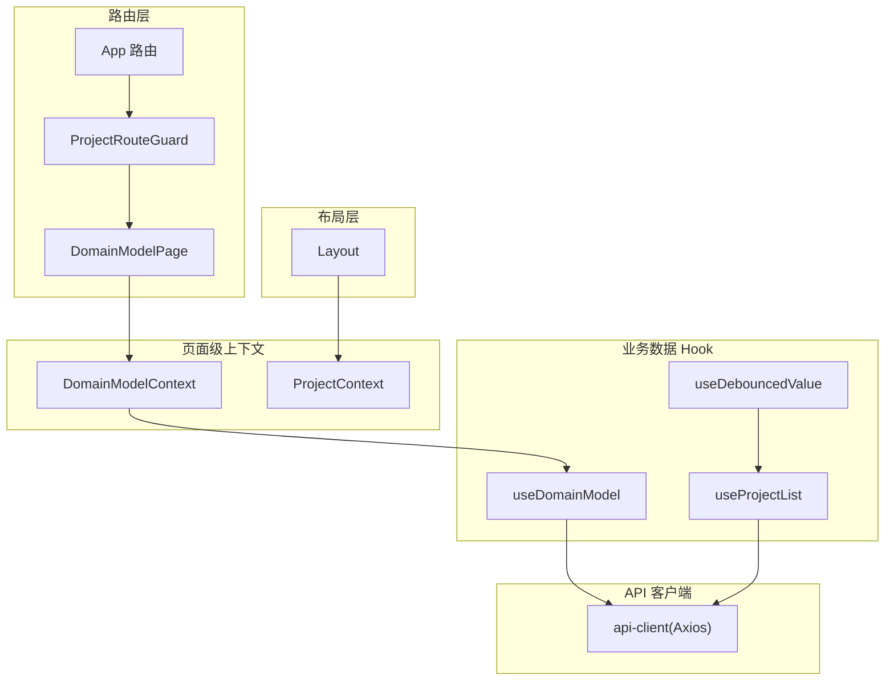
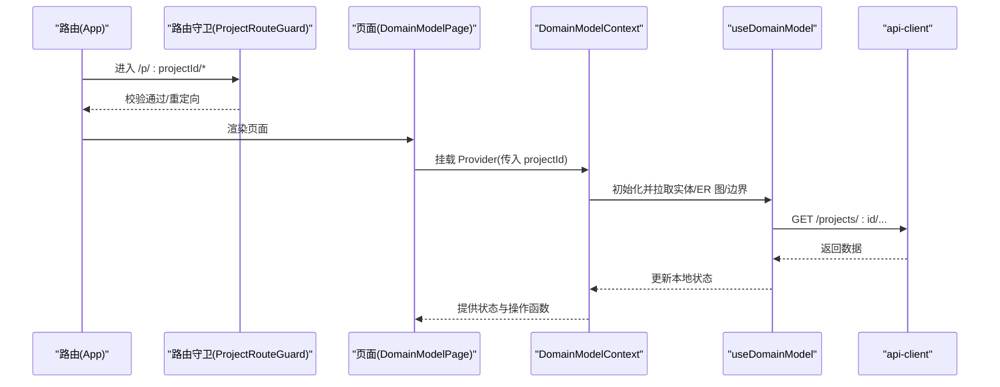
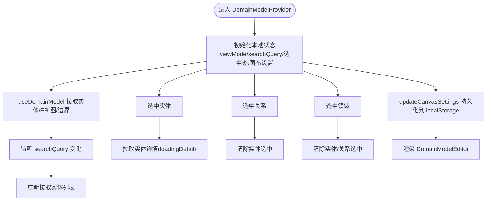
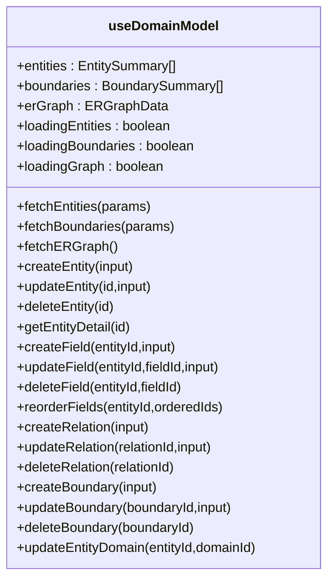
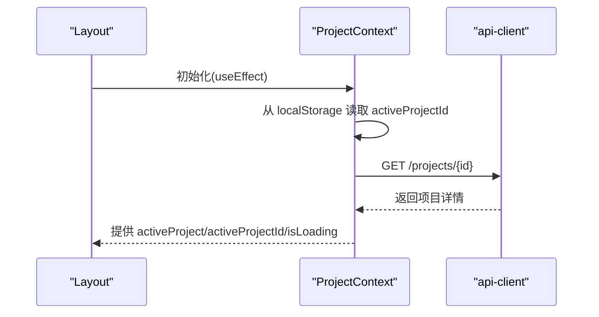
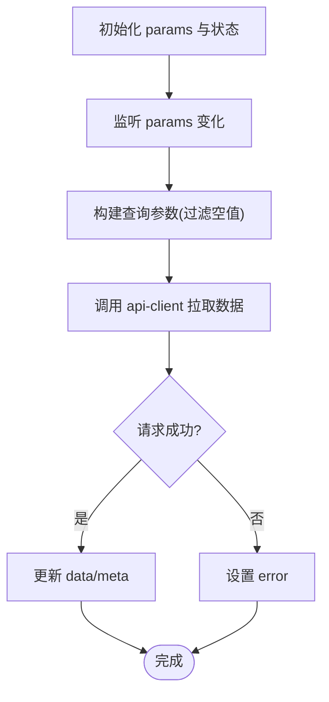
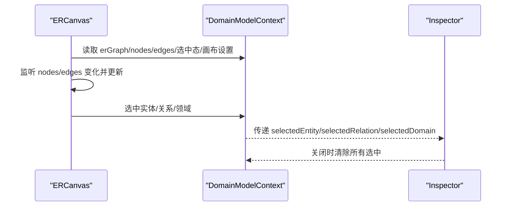
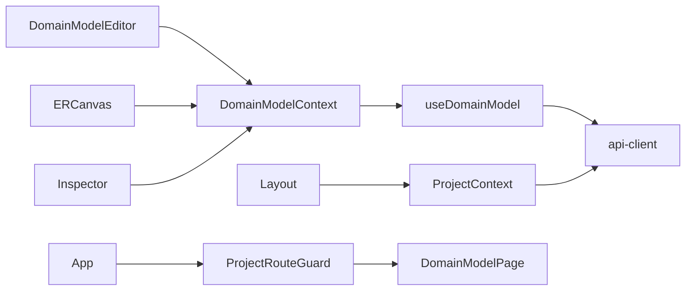

# 状态管理

<cite>
**本文引用的文件**
- [packages/web/src/contexts/DomainModelContext.tsx](file://packages/web/src/contexts/DomainModelContext.tsx)
- [packages/web/src/contexts/ProjectContext.tsx](file://packages/web/src/contexts/ProjectContext.tsx)
- [packages/web/src/hooks/useDomainModel.ts](file://packages/web/src/hooks/useDomainModel.ts)
- [packages/web/src/hooks/useProjectList.ts](file://packages/web/src/hooks/useProjectList.ts)
- [packages/web/src/hooks/useDebouncedValue.ts](file://packages/web/src/hooks/useDebouncedValue.ts)
- [packages/web/src/lib/api-client.ts](file://packages/web/src/lib/api-client.ts)
- [packages/web/src/components/domain-model/DomainModelEditor.tsx](file://packages/web/src/components/domain-model/DomainModelEditor.tsx)
- [packages/web/src/components/domain-model/canvas/ERCanvas.tsx](file://packages/web/src/components/domain-model/canvas/ERCanvas.tsx)
- [packages/web/src/components/domain-model/inspector/Inspector.tsx](file://packages/web/src/components/domain-model/inspector/Inspector.tsx)
- [packages/web/src/components/Layout.tsx](file://packages/web/src/components/Layout.tsx)
- [packages/web/src/components/ProjectRouteGuard.tsx](file://packages/web/src/components/ProjectRouteGuard.tsx)
- [packages/web/src/pages/DomainModelPage.tsx](file://packages/web/src/pages/DomainModelPage.tsx)
- [packages/web/src/pages/ProjectList.tsx](file://packages/web/src/pages/ProjectList.tsx)
- [packages/web/src/App.tsx](file://packages/web/src/App.tsx)
</cite>

## 目录
1. [引言](#引言)
2. [项目结构](#项目结构)
3. [核心组件](#核心组件)
4. [架构总览](#架构总览)
5. [详细组件分析](#详细组件分析)
6. [依赖分析](#依赖分析)
7. [性能考量](#性能考量)
8. [故障排查指南](#故障排查指南)
9. [结论](#结论)
10. [附录](#附录)

## 引言
本指南围绕 AI 原型管理系统的状态管理进行系统化梳理，重点覆盖以下方面：
- Context API 的状态管理模式与 Provider 设计
- 自定义 Hook 的状态封装与复用策略
- 全局状态与局部状态的划分原则
- 复杂业务状态的数据流设计与更新机制
- 状态持久化与缓存策略
- 状态调试与性能监控的方法
- 异步状态处理与错误边界管理
- 状态管理与路由系统的协同机制
- 最佳实践与常见陷阱

## 项目结构
系统采用“页面级上下文 + 业务数据 Hook”的分层设计：
- 页面级上下文：负责聚合与协调页面内的多源状态（如领域模型页面的实体、关系、画布设置等）
- 业务数据 Hook：封装具体 API 调用与本地状态，提供稳定的对外接口
- Provider 组合：在路由层挂载上下文，确保页面内组件可共享状态
- 路由守卫：控制项目上下文层的访问权限与一致性

图表来源
- [packages/web/src/App.tsx:26-122](file://packages/web/src/App.tsx#L26-L122)
- [packages/web/src/components/ProjectRouteGuard.tsx:20-29](file://packages/web/src/components/ProjectRouteGuard.tsx#L20-L29)
- [packages/web/src/pages/DomainModelPage.tsx:11-21](file://packages/web/src/pages/DomainModelPage.tsx#L11-L21)
- [packages/web/src/contexts/DomainModelContext.tsx:205-551](file://packages/web/src/contexts/DomainModelContext.tsx#L205-L551)
- [packages/web/src/contexts/ProjectContext.tsx:62-133](file://packages/web/src/contexts/ProjectContext.tsx#L62-L133)
- [packages/web/src/hooks/useDomainModel.ts:135-464](file://packages/web/src/hooks/useDomainModel.ts#L135-L464)
- [packages/web/src/hooks/useProjectList.ts:33-90](file://packages/web/src/hooks/useProjectList.ts#L33-L90)
- [packages/web/src/hooks/useDebouncedValue.ts:13-22](file://packages/web/src/hooks/useDebouncedValue.ts#L13-L22)
- [packages/web/src/lib/api-client.ts:13-26](file://packages/web/src/lib/api-client.ts#L13-L26)

章节来源
- [packages/web/src/App.tsx:26-122](file://packages/web/src/App.tsx#L26-L122)
- [packages/web/src/components/Layout.tsx:314-346](file://packages/web/src/components/Layout.tsx#L314-L346)
- [packages/web/src/components/ProjectRouteGuard.tsx:20-29](file://packages/web/src/components/ProjectRouteGuard.tsx#L20-L29)
- [packages/web/src/pages/DomainModelPage.tsx:11-21](file://packages/web/src/pages/DomainModelPage.tsx#L11-L21)

## 核心组件
- DomainModelContext：页面级上下文，聚合实体、边界、ER 图、选中态、视图模式、搜索词、画布设置等状态，并提供数据操作与刷新能力
- ProjectContext：项目上下文，负责激活项目 ID 的持久化与恢复，以及项目详情的加载与刷新
- useDomainModel：封装领域模型相关 API 与本地加载状态，提供统一的数据获取与变更接口
- useProjectList：封装项目列表的查询参数、分页与加载状态，提供参数更新与刷新能力
- useDebouncedValue：通用防抖 Hook，用于搜索输入等高频变更场景

章节来源
- [packages/web/src/contexts/DomainModelContext.tsx:58-562](file://packages/web/src/contexts/DomainModelContext.tsx#L58-L562)
- [packages/web/src/contexts/ProjectContext.tsx:26-146](file://packages/web/src/contexts/ProjectContext.tsx#L26-L146)
- [packages/web/src/hooks/useDomainModel.ts:135-464](file://packages/web/src/hooks/useDomainModel.ts#L135-L464)
- [packages/web/src/hooks/useProjectList.ts:33-90](file://packages/web/src/hooks/useProjectList.ts#L33-L90)
- [packages/web/src/hooks/useDebouncedValue.ts:13-22](file://packages/web/src/hooks/useDebouncedValue.ts#L13-L22)

## 架构总览
系统采用“页面级上下文 + 业务数据 Hook”的组合模式：
- 页面级上下文负责状态聚合与副作用编排（如搜索词变更触发数据刷新、选中态互斥、画布设置持久化等）
- 业务数据 Hook 负责与后端交互与本地状态管理，向上提供稳定接口
- Provider 在路由层挂载，保证页面内组件可共享状态
- 路由守卫保障项目上下文层的访问一致性

图表来源
- [packages/web/src/App.tsx:35-91](file://packages/web/src/App.tsx#L35-L91)
- [packages/web/src/components/ProjectRouteGuard.tsx:20-29](file://packages/web/src/components/ProjectRouteGuard.tsx#L20-L29)
- [packages/web/src/pages/DomainModelPage.tsx:11-21](file://packages/web/src/pages/DomainModelPage.tsx#L11-L21)
- [packages/web/src/contexts/DomainModelContext.tsx:205-240](file://packages/web/src/contexts/DomainModelContext.tsx#L205-L240)
- [packages/web/src/hooks/useDomainModel.ts:147-184](file://packages/web/src/hooks/useDomainModel.ts#L147-L184)
- [packages/web/src/lib/api-client.ts:13-26](file://packages/web/src/lib/api-client.ts#L13-L26)

## 详细组件分析

### DomainModelContext：页面级上下文与 Provider 设计
- 职责边界清晰：聚合实体、边界、ER 图、选中态、视图模式、搜索词、画布设置等，同时提供数据操作与刷新能力
- 状态持久化：画布设置按项目隔离持久化到 localStorage，并在初始化时恢复
- 互斥选中：实体、关系、领域三者互斥，切换时自动清除非相关选中态
- 数据刷新策略：针对不同操作提供独立刷新函数，避免重复拉取与过度渲染
- 本地派生：基于 ER 图与实体列表构造选中关系对象，避免额外 API 请求

图表来源
- [packages/web/src/contexts/DomainModelContext.tsx:205-240](file://packages/web/src/contexts/DomainModelContext.tsx#L205-L240)
- [packages/web/src/contexts/DomainModelContext.tsx:248-261](file://packages/web/src/contexts/DomainModelContext.tsx#L248-L261)
- [packages/web/src/contexts/DomainModelContext.tsx:263-288](file://packages/web/src/contexts/DomainModelContext.tsx#L263-L288)
- [packages/web/src/contexts/DomainModelContext.tsx:218-232](file://packages/web/src/contexts/DomainModelContext.tsx#L218-L232)
- [packages/web/src/contexts/DomainModelContext.tsx:507-551](file://packages/web/src/contexts/DomainModelContext.tsx#L507-L551)

章节来源
- [packages/web/src/contexts/DomainModelContext.tsx:58-562](file://packages/web/src/contexts/DomainModelContext.tsx#L58-L562)

### useDomainModel：业务数据 Hook 的封装与复用
- 数据与加载状态：统一维护实体、边界、ER 图与对应加载状态
- API 封装：提供实体/字段/关系/边界 CRUD 与排序、归属更新等接口
- 错误处理：统一 toast 提示与 finally 清理，避免状态悬挂
- 参数化查询：支持分页、搜索、分类等参数，便于复用

图表来源
- [packages/web/src/hooks/useDomainModel.ts:135-464](file://packages/web/src/hooks/useDomainModel.ts#L135-L464)

章节来源
- [packages/web/src/hooks/useDomainModel.ts:135-464](file://packages/web/src/hooks/useDomainModel.ts#L135-L464)

### ProjectContext：项目上下文与持久化
- 激活项目 ID 的持久化与恢复：启动时从 localStorage 读取并拉取项目详情
- 访问控制：未激活或不匹配时重定向至 Dashboard
- 刷新机制：支持主动刷新当前项目详情

图表来源
- [packages/web/src/contexts/ProjectContext.tsx:62-91](file://packages/web/src/contexts/ProjectContext.tsx#L62-L91)
- [packages/web/src/contexts/ProjectContext.tsx:124-131](file://packages/web/src/contexts/ProjectContext.tsx#L124-L131)
- [packages/web/src/lib/api-client.ts:13-26](file://packages/web/src/lib/api-client.ts#L13-L26)

章节来源
- [packages/web/src/contexts/ProjectContext.tsx:26-146](file://packages/web/src/contexts/ProjectContext.tsx#L26-L146)

### useProjectList：列表页参数与刷新
- 参数化查询：支持搜索、状态、分页、排序与方向
- 参数变更策略：search/status 变化时自动重置 page=1
- 首次加载：mount 时自动发起请求
- 错误处理：统一 error 状态与重试按钮

图表来源
- [packages/web/src/hooks/useProjectList.ts:33-90](file://packages/web/src/hooks/useProjectList.ts#L33-L90)
- [packages/web/src/lib/api-client.ts:13-26](file://packages/web/src/lib/api-client.ts#L13-L26)

章节来源
- [packages/web/src/hooks/useProjectList.ts:33-90](file://packages/web/src/hooks/useProjectList.ts#L33-L90)

### useDebouncedValue：防抖 Hook
- 场景：搜索输入等高频变更，降低请求频率
- 实现：定时器延迟更新，清理逻辑防止内存泄漏

章节来源
- [packages/web/src/hooks/useDebouncedValue.ts:13-22](file://packages/web/src/hooks/useDebouncedValue.ts#L13-L22)

### 画布与 Inspector 的状态协同
- ERCanvas：将上下文中的 erGraph 转换为 nodes/edges，处理节点拖拽、关系选中、搜索高亮、画布设置联动等
- Inspector：根据选中态切换实体/关系/领域三种模式，互斥关闭时清除所有选中

图表来源
- [packages/web/src/components/domain-model/canvas/ERCanvas.tsx:106-121](file://packages/web/src/components/domain-model/canvas/ERCanvas.tsx#L106-L121)
- [packages/web/src/components/domain-model/inspector/Inspector.tsx:24-48](file://packages/web/src/components/domain-model/inspector/Inspector.tsx#L24-L48)
- [packages/web/src/contexts/DomainModelContext.tsx:263-288](file://packages/web/src/contexts/DomainModelContext.tsx#L263-L288)

章节来源
- [packages/web/src/components/domain-model/canvas/ERCanvas.tsx:106-121](file://packages/web/src/components/domain-model/canvas/ERCanvas.tsx#L106-L121)
- [packages/web/src/components/domain-model/inspector/Inspector.tsx:24-48](file://packages/web/src/components/domain-model/inspector/Inspector.tsx#L24-L48)

## 依赖分析
- 组件间耦合
  - DomainModelEditor 依赖 DomainModelContext 的 viewMode 控制布局
  - ERCanvas 依赖 DomainModelContext 的 erGraph、选中态与画布设置
  - Inspector 依赖 DomainModelContext 的选中态与边界列表
- 外部依赖
  - api-client(Axios)：统一基础 URL、超时与响应拦截
  - use-debounce：用于节点拖拽停止后的批量保存
- Provider 与路由
  - App 路由定义全局层与项目层
  - ProjectRouteGuard 保护项目层路由
  - DomainModelPage 挂载 DomainModelContext

图表来源
- [packages/web/src/components/domain-model/DomainModelEditor.tsx:21-44](file://packages/web/src/components/domain-model/DomainModelEditor.tsx#L21-L44)
- [packages/web/src/components/domain-model/canvas/ERCanvas.tsx:106-121](file://packages/web/src/components/domain-model/canvas/ERCanvas.tsx#L106-L121)
- [packages/web/src/components/domain-model/inspector/Inspector.tsx:24-36](file://packages/web/src/components/domain-model/inspector/Inspector.tsx#L24-L36)
- [packages/web/src/contexts/DomainModelContext.tsx:507-551](file://packages/web/src/contexts/DomainModelContext.tsx#L507-L551)
- [packages/web/src/hooks/useDomainModel.ts:135-464](file://packages/web/src/hooks/useDomainModel.ts#L135-L464)
- [packages/web/src/lib/api-client.ts:13-26](file://packages/web/src/lib/api-client.ts#L13-L26)
- [packages/web/src/components/Layout.tsx:314-346](file://packages/web/src/components/Layout.tsx#L314-L346)
- [packages/web/src/contexts/ProjectContext.tsx:62-133](file://packages/web/src/contexts/ProjectContext.tsx#L62-L133)
- [packages/web/src/App.tsx:26-122](file://packages/web/src/App.tsx#L26-L122)
- [packages/web/src/components/ProjectRouteGuard.tsx:20-29](file://packages/web/src/components/ProjectRouteGuard.tsx#L20-L29)
- [packages/web/src/pages/DomainModelPage.tsx:11-21](file://packages/web/src/pages/DomainModelPage.tsx#L11-L21)

章节来源
- [packages/web/src/App.tsx:26-122](file://packages/web/src/App.tsx#L26-L122)
- [packages/web/src/components/ProjectRouteGuard.tsx:20-29](file://packages/web/src/components/ProjectRouteGuard.tsx#L20-L29)
- [packages/web/src/pages/DomainModelPage.tsx:11-21](file://packages/web/src/pages/DomainModelPage.tsx#L11-L21)

## 性能考量
- 避免过度渲染
  - 使用 useCallback 包装上下文导出的操作函数，减少子组件重渲染
  - 使用 useMemo 派生选中关系对象，避免重复计算
- 异步操作批处理
  - 节点拖拽停止后使用防抖批量保存（如领域框尺寸与实体位置），减少网络请求
- 本地缓存与持久化
  - 画布设置按项目隔离持久化，避免每次进入页面重新配置
- 分页与搜索优化
  - useProjectList 在 search/status 变化时重置页码，避免无效请求
  - useDebouncedValue 降低搜索请求频率

章节来源
- [packages/web/src/contexts/DomainModelContext.tsx:223-232](file://packages/web/src/contexts/DomainModelContext.tsx#L223-L232)
- [packages/web/src/contexts/DomainModelContext.tsx:290-324](file://packages/web/src/contexts/DomainModelContext.tsx#L290-L324)
- [packages/web/src/components/domain-model/canvas/ERCanvas.tsx:135-150](file://packages/web/src/components/domain-model/canvas/ERCanvas.tsx#L135-L150)
- [packages/web/src/hooks/useProjectList.ts:48-60](file://packages/web/src/hooks/useProjectList.ts#L48-L60)
- [packages/web/src/hooks/useDebouncedValue.ts:13-22](file://packages/web/src/hooks/useDebouncedValue.ts#L13-L22)

## 故障排查指南
- 画布设置未生效
  - 检查 updateCanvasSettings 是否被调用，确认 localStorage 中键名格式与项目 ID 是否匹配
- 选中态异常
  - 确认实体/关系/领域三者的互斥逻辑是否正确执行（切换时是否清除非相关选中）
- 列表页搜索无效
  - 检查 useDebouncedValue 是否正确同步到 params，以及 useProjectList 的参数构建逻辑
- 项目上下文丢失
  - 检查 ProjectRouteGuard 是否正确校验 activeProjectId 与 URL 中 projectId
- API 请求失败
  - 查看 api-client 响应拦截器是否抛出错误消息，确认后端返回结构与错误字段

章节来源
- [packages/web/src/contexts/DomainModelContext.tsx:263-288](file://packages/web/src/contexts/DomainModelContext.tsx#L263-L288)
- [packages/web/src/hooks/useDebouncedValue.ts:13-22](file://packages/web/src/hooks/useDebouncedValue.ts#L13-L22)
- [packages/web/src/components/ProjectRouteGuard.tsx:20-29](file://packages/web/src/components/ProjectRouteGuard.tsx#L20-L29)
- [packages/web/src/lib/api-client.ts:19-26](file://packages/web/src/lib/api-client.ts#L19-L26)

## 结论
该系统通过“页面级上下文 + 业务数据 Hook”的组合，实现了清晰的状态职责划分与良好的可扩展性。上下文负责状态聚合与副作用编排，Hook 负责与后端交互与本地状态管理，Provider 与路由守卫确保状态在正确的生命周期内生效。配合持久化、防抖与批处理等策略，系统在复杂业务场景下仍保持较好的性能与可用性。

## 附录

### 状态管理模式最佳实践
- 合理划分全局与局部状态
  - 全局：跨页面共享的用户上下文、项目上下文、主题偏好等
  - 局部：页面内视图状态、表单临时值、轻量 UI 状态
- Provider 的挂载层级
  - 在路由层挂载页面级 Provider，确保页面内组件共享状态
- 自定义 Hook 的职责
  - 专注单一数据域，提供稳定接口与错误处理
- 互斥状态与派生状态
  - 使用互斥逻辑避免状态冲突，派生状态尽量通过 useMemo 降低计算成本
- 异步与错误处理
  - 统一错误提示与重试机制，避免状态悬挂
- 性能优化
  - 使用 useCallback/useMemo，防抖与批处理，本地缓存与持久化

### 常见陷阱与规避
- 陷阱：在上下文中直接存放大量派生数据导致更新频繁
  - 规避：通过 useMemo 派生，必要时拆分为独立 Hook
- 陷阱：Provider 层级过深导致渲染链路冗长
  - 规避：按页面拆分 Provider，减少无关组件订阅
- 陷阱：异步操作未批处理造成多次请求
  - 规避：使用防抖或队列合并策略
- 陷阱：持久化键名不隔离导致跨项目状态污染
  - 规避：按项目 ID 或租户维度拼接键名