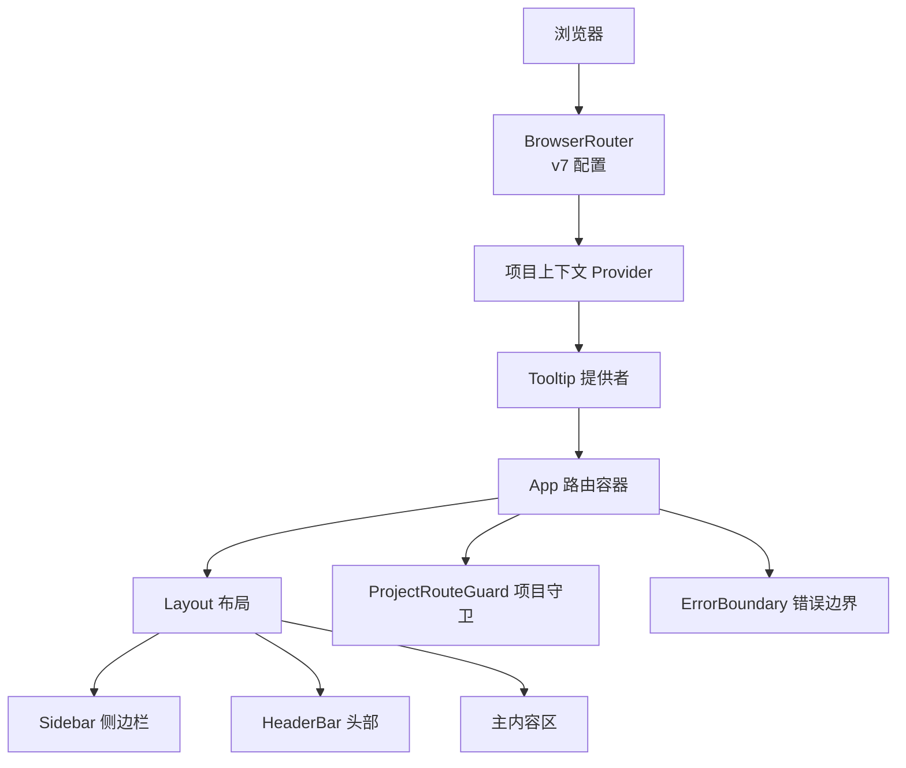
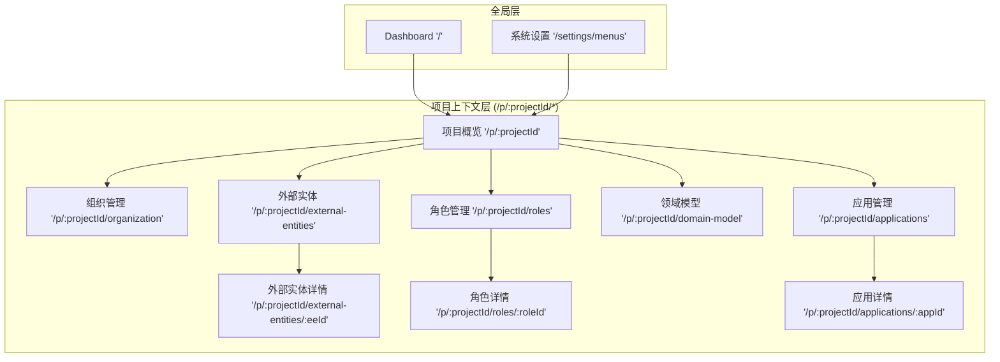
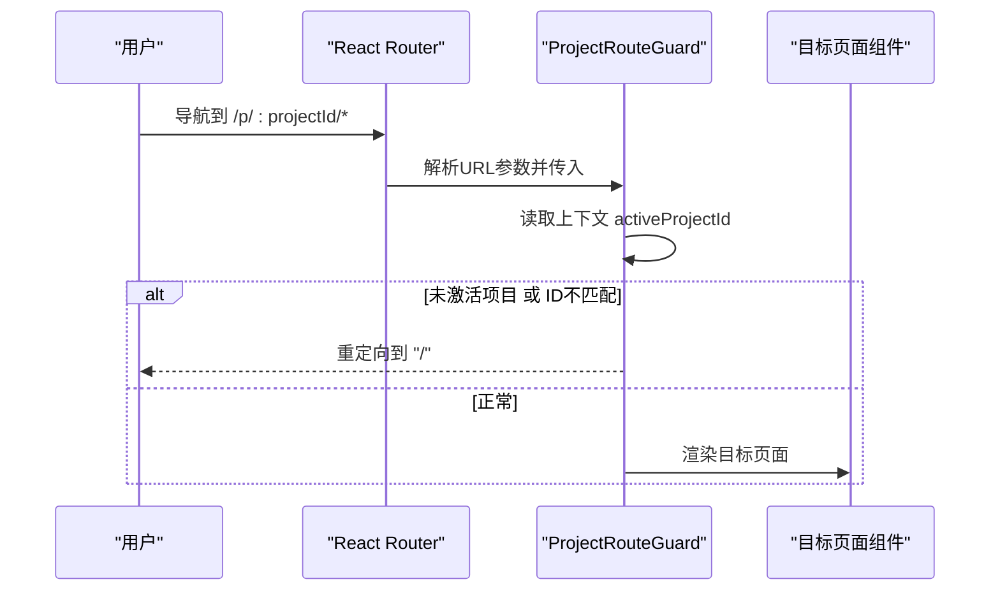
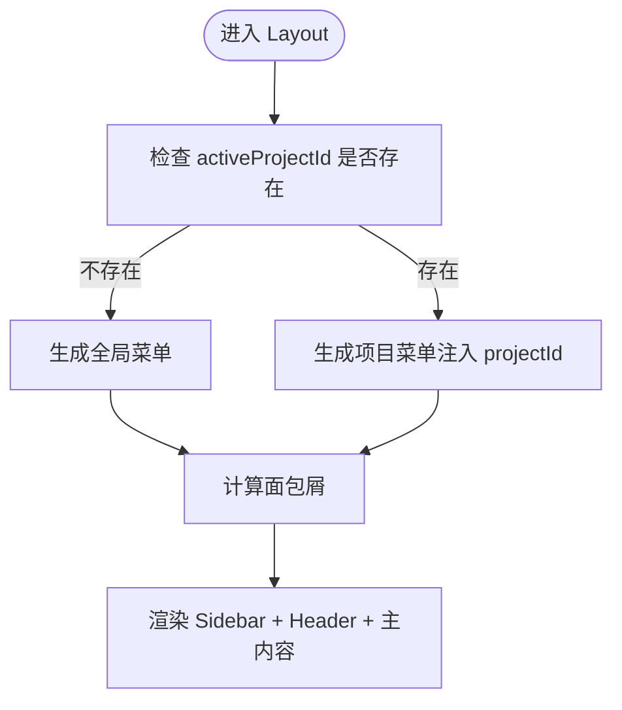
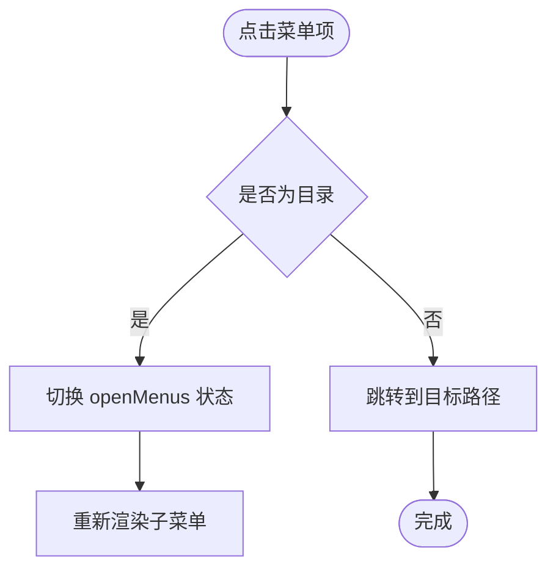
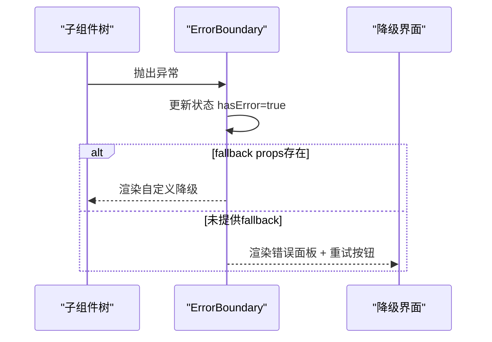
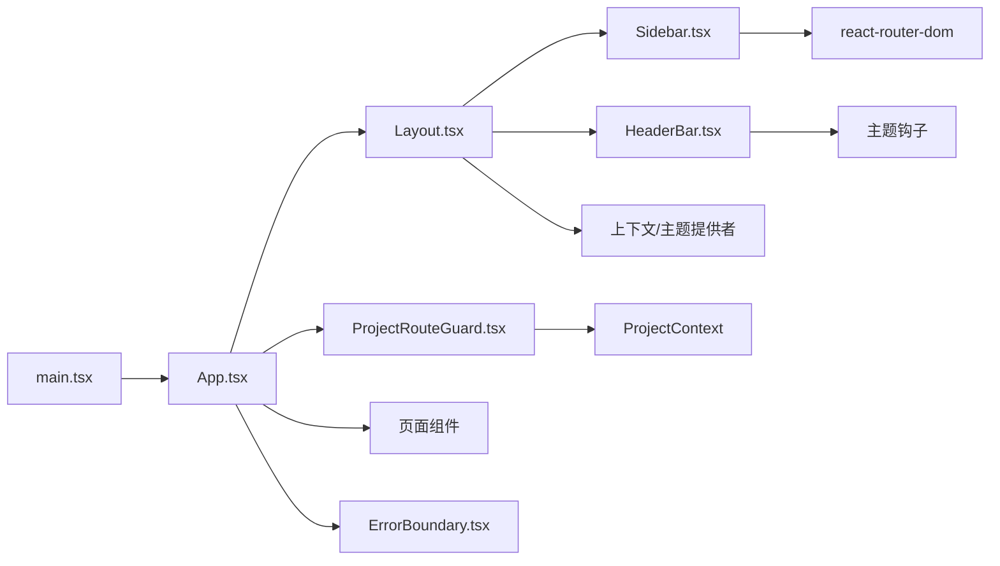

# 路由与导航

<cite>
**本文引用的文件**
- [packages/web/src/main.tsx](file://packages/web/src/main.tsx)
- [packages/web/src/App.tsx](file://packages/web/src/App.tsx)
- [packages/web/src/components/Layout.tsx](file://packages/web/src/components/Layout.tsx)
- [packages/web/src/components/ProjectRouteGuard.tsx](file://packages/web/src/components/ProjectRouteGuard.tsx)
- [packages/web/src/components/ErrorBoundary.tsx](file://packages/web/src/components/ErrorBoundary.tsx)
- [packages/web/src/components/layout/HeaderBar.tsx](file://packages/web/src/components/layout/HeaderBar.tsx)
- [packages/web/src/components/layout/Sidebar.tsx](file://packages/web/src/components/layout/Sidebar.tsx)
</cite>

## 目录
1. [引言](#引言)
2. [项目结构](#项目结构)
3. [核心组件](#核心组件)
4. [架构总览](#架构总览)
5. [详细组件分析](#详细组件分析)
6. [依赖关系分析](#依赖关系分析)
7. [性能考虑](#性能考虑)
8. [故障排查指南](#故障排查指南)
9. [结论](#结论)
10. [附录](#附录)

## 引言
本指南面向AI原型管理系统（APM）的前端路由与导航体系，围绕React Router配置、路由守卫、页面布局与嵌套结构、头部导航栏响应式设计、侧边栏菜单动态生成与权限控制、路由参数传递与状态保持、页面切换动画与用户体验优化、404兜底与错误边界、项目级路由保护与访问控制、以及导航性能与SEO友好实践进行系统化梳理。文档以仓库现有代码为依据，结合可视化图示帮助开发者快速理解与扩展。

## 项目结构
APM前端采用单页应用（SPA）架构，基于React Router v6进行路由编排，通过BrowserRouter包裹应用，并在根组件中定义全局层与项目上下文层的路由集合。应用通过Layout组件统一承载侧边栏、头部导航与主内容区域，配合项目级路由守卫实现访问控制与导航一致性。

图表来源
- [packages/web/src/main.tsx:9-18](file://packages/web/src/main.tsx#L9-L18)
- [packages/web/src/App.tsx:26-122](file://packages/web/src/App.tsx#L26-L122)
- [packages/web/src/components/Layout.tsx:314-346](file://packages/web/src/components/Layout.tsx#L314-L346)

章节来源
- [packages/web/src/main.tsx:1-20](file://packages/web/src/main.tsx#L1-L20)
- [packages/web/src/App.tsx:1-123](file://packages/web/src/App.tsx#L1-L123)

## 核心组件
- 应用入口与路由器配置：在入口文件中启用BrowserRouter，并开启v7相关特性（如v7_startTransition、v7_relativeSplatPath），确保平滑过渡与相对路径分隔符行为符合预期。
- 路由容器App：集中声明全局层与项目上下文层路由，使用Routes与Route组织页面映射；对旧路由进行重定向兼容；兜底规则将未知路径重定向至首页。
- 布局Layout：负责动态菜单生成（全局/项目）、面包屑计算、侧边栏与头部的组合渲染；通过useMemo缓存菜单，避免不必要的重渲染。
- 项目路由守卫ProjectRouteGuard：校验URL中的projectId与当前激活项目是否一致，不一致则重定向至Dashboard，保障项目上下文一致性。
- 错误边界ErrorBoundary：捕获子树内异常，提供可交互的错误展示与重试入口，提升稳定性与可恢复性。
- 侧边栏Sidebar：支持折叠、图标映射、子菜单展开、激活态高亮；根据当前URL进行前缀匹配与精确匹配，适配项目概览与子路由场景。
- 头部导航HeaderBar：展示面包屑、主题切换、通知与用户信息，右侧自定义插槽便于扩展。

章节来源
- [packages/web/src/main.tsx:9-18](file://packages/web/src/main.tsx#L9-L18)
- [packages/web/src/App.tsx:26-122](file://packages/web/src/App.tsx#L26-L122)
- [packages/web/src/components/Layout.tsx:314-346](file://packages/web/src/components/Layout.tsx#L314-L346)
- [packages/web/src/components/ProjectRouteGuard.tsx:20-29](file://packages/web/src/components/ProjectRouteGuard.tsx#L20-L29)
- [packages/web/src/components/ErrorBoundary.tsx:13-56](file://packages/web/src/components/ErrorBoundary.tsx#L13-L56)
- [packages/web/src/components/layout/Sidebar.tsx:62-252](file://packages/web/src/components/layout/Sidebar.tsx#L62-L252)
- [packages/web/src/components/layout/HeaderBar.tsx:15-61](file://packages/web/src/components/layout/HeaderBar.tsx#L15-L61)

## 架构总览
APM的导航架构分为三层：
- 全局层：无需项目上下文，适用于仪表盘与系统设置等通用功能。
- 项目上下文层：以/p/:projectId为前缀，包含项目概览、组织管理、外部实体、角色管理、领域模型、应用管理等模块。
- 访问控制：通过ProjectRouteGuard在进入项目上下文层前进行项目ID一致性校验，未激活项目或ID不匹配时自动回退至Dashboard。

图表来源
- [packages/web/src/App.tsx:32-107](file://packages/web/src/App.tsx#L32-L107)

章节来源
- [packages/web/src/App.tsx:32-117](file://packages/web/src/App.tsx#L32-L117)

## 详细组件分析

### 路由与导航配置（App）
- 全局层路由：根路径与系统设置菜单。
- 项目上下文层路由：以/p/:projectId为前缀的所有子路由，均被ProjectRouteGuard包裹。
- 兼容旧路由：/projects与/projects/:projectId重定向至新的/p/:projectId与Dashboard。
- 兜底规则：所有未匹配路由重定向至首页，避免白屏。

章节来源
- [packages/web/src/App.tsx:32-117](file://packages/web/src/App.tsx#L32-L117)

### 项目路由守卫（ProjectRouteGuard）
- 参数解析：从URL中提取projectId。
- 上下文校验：对比当前激活项目ID与URL中的projectId。
- 行为：不一致则重定向至Dashboard；一致则渲染子组件。

图表来源
- [packages/web/src/components/ProjectRouteGuard.tsx:20-29](file://packages/web/src/components/ProjectRouteGuard.tsx#L20-L29)

章节来源
- [packages/web/src/components/ProjectRouteGuard.tsx:20-29](file://packages/web/src/components/ProjectRouteGuard.tsx#L20-L29)

### 布局与菜单（Layout）
- 动态菜单生成：
  - 未激活项目：返回全局层菜单（Dashboard、系统设置）。
  - 已激活项目：返回项目层菜单，路径中注入当前projectId。
- 面包屑生成：根据当前路径与项目上下文动态拼接标签，支持项目概览与各子模块。
- 侧边栏与头部：组合渲染，提供Toaster提示服务。

图表来源
- [packages/web/src/components/Layout.tsx:314-346](file://packages/web/src/components/Layout.tsx#L314-L346)
- [packages/web/src/components/Layout.tsx:319-324](file://packages/web/src/components/Layout.tsx#L319-L324)
- [packages/web/src/components/Layout.tsx:254-304](file://packages/web/src/components/Layout.tsx#L254-L304)

章节来源
- [packages/web/src/components/Layout.tsx:24-74](file://packages/web/src/components/Layout.tsx#L24-L74)
- [packages/web/src/components/Layout.tsx:77-247](file://packages/web/src/components/Layout.tsx#L77-L247)
- [packages/web/src/components/Layout.tsx:254-304](file://packages/web/src/components/Layout.tsx#L254-L304)
- [packages/web/src/components/Layout.tsx:314-346](file://packages/web/src/components/Layout.tsx#L314-L346)

### 侧边栏菜单（Sidebar）
- 折叠与展开：通过collapsed状态控制宽度与文本显示。
- 图标映射：根据菜单配置的icon名称映射到Lucide图标。
- 子菜单展开：使用openMenus集合记录展开状态，点击目录项切换。
- 激活态判定：
  - 非项目路由：精确匹配当前路径。
  - 项目概览路由：仅当URL无子路径时匹配。
  - 子路由：前缀匹配。
- 项目上下文指示器：在项目上下文中显示项目名与“退出项目”按钮，便于快速切换。

图表来源
- [packages/web/src/components/layout/Sidebar.tsx:62-252](file://packages/web/src/components/layout/Sidebar.tsx#L62-L252)
- [packages/web/src/components/layout/Sidebar.tsx:87-100](file://packages/web/src/components/layout/Sidebar.tsx#L87-L100)

章节来源
- [packages/web/src/components/layout/Sidebar.tsx:62-252](file://packages/web/src/components/layout/Sidebar.tsx#L62-L252)

### 头部导航栏（HeaderBar）
- 面包屑：支持传入面包屑数组，当前项高亮显示。
- 右侧操作区：主题切换、通知铃铛、用户信息、自定义插槽。
- 响应式：通过CSS变量与flex布局适配不同屏幕尺寸。

章节来源
- [packages/web/src/components/layout/HeaderBar.tsx:15-61](file://packages/web/src/components/layout/HeaderBar.tsx#L15-L61)

### 错误边界（ErrorBoundary）
- 捕获子树异常：static getDerivedStateFromError更新状态。
- 渲染降级UI：展示错误消息、堆栈与“重试”按钮。
- 日志记录：componentDidCatch输出错误信息到控制台。

图表来源
- [packages/web/src/components/ErrorBoundary.tsx:13-56](file://packages/web/src/components/ErrorBoundary.tsx#L13-L56)

章节来源
- [packages/web/src/components/ErrorBoundary.tsx:13-56](file://packages/web/src/components/ErrorBoundary.tsx#L13-L56)

## 依赖关系分析
- 入口依赖：main.tsx依赖BrowserRouter、ProjectProvider、TooltipProvider与App。
- 路由依赖：App依赖Layout、ErrorBoundary、ProjectRouteGuard与各页面组件。
- 布局依赖：Layout依赖Sidebar、HeaderBar、Toaster与项目上下文。
- 守卫依赖：ProjectRouteGuard依赖useParams与useProjectContext。
- 侧边栏依赖：Sidebar依赖react-router-dom的useLocation与菜单类型定义。
- 错误边界：独立于业务逻辑，作为安全网存在。

图表来源
- [packages/web/src/main.tsx:9-18](file://packages/web/src/main.tsx#L9-L18)
- [packages/web/src/App.tsx:26-122](file://packages/web/src/App.tsx#L26-L122)
- [packages/web/src/components/Layout.tsx:314-346](file://packages/web/src/components/Layout.tsx#L314-L346)
- [packages/web/src/components/ProjectRouteGuard.tsx:20-29](file://packages/web/src/components/ProjectRouteGuard.tsx#L20-L29)
- [packages/web/src/components/layout/Sidebar.tsx:62-252](file://packages/web/src/components/layout/Sidebar.tsx#L62-L252)
- [packages/web/src/components/layout/HeaderBar.tsx:15-61](file://packages/web/src/components/layout/HeaderBar.tsx#L15-L61)
- [packages/web/src/components/ErrorBoundary.tsx:13-56](file://packages/web/src/components/ErrorBoundary.tsx#L13-L56)

章节来源
- [packages/web/src/main.tsx:9-18](file://packages/web/src/main.tsx#L9-L18)
- [packages/web/src/App.tsx:26-122](file://packages/web/src/App.tsx#L26-L122)

## 性能考虑
- 路由切换性能
  - 启用v7_startTransition：在入口处开启BrowserRouter的v7_startTransition选项，使路由切换使用React.startTransition，降低阻塞风险，提升交互流畅度。
  - 相对路径分隔：启用v7_relativeSplatPath，避免历史遗留的通配符路径解析差异带来的额外开销。
- 组件渲染优化
  - Layout中使用useMemo缓存菜单列表，避免重复计算导致的重渲染。
  - Sidebar内部使用useState维护子菜单展开状态，仅在点击时触发局部更新。
- 资源加载
  - 页面组件按需加载（建议）：将大型页面拆分为异步组件，减少首屏负载。
  - 图标与样式：复用共享UI库与CSS变量，避免重复打包。
- SEO友好
  - 使用静态站点生成（SSG）或服务端渲染（SSR）：在构建阶段预渲染关键页面，提高首屏速度与搜索引擎收录。
  - 设置基础meta标签与Open Graph：在HTML模板中添加标题、描述、缩略图等，改善分享体验。
  - 结构化数据：为关键页面（如项目详情）添加JSON-LD，增强搜索可见性。
- 用户体验
  - 进度指示：在路由切换期间显示骨架屏或进度条，缓解感知延迟。
  - 错误恢复：通过ErrorBoundary提供“重试”按钮，降低失败成本。
  - 主题一致性：HeaderBar的主题切换与全局CSS变量联动，保证视觉连贯。

章节来源
- [packages/web/src/main.tsx:11](file://packages/web/src/main.tsx#L11)
- [packages/web/src/components/Layout.tsx:319-324](file://packages/web/src/components/Layout.tsx#L319-L324)
- [packages/web/src/components/layout/Sidebar.tsx:69](file://packages/web/src/components/layout/Sidebar.tsx#L69)

## 故障排查指南
- 无法进入项目上下文
  - 现象：访问/p/:projectId/*被重定向到Dashboard。
  - 排查：确认ProjectContext中是否已设置activeProjectId，且与URL中的projectId一致。
  - 参考：ProjectRouteGuard的校验逻辑。
- 菜单不显示或不激活
  - 现象：侧边栏菜单缺失或未高亮。
  - 排查：检查菜单visible字段、sortOrder排序、图标映射表；确认isActive匹配逻辑（精确/前缀）。
  - 参考：Sidebar的菜单过滤、排序与激活判定。
- 面包屑不正确
  - 现象：顶部面包屑标签与当前页面不符。
  - 排查：核对useBreadcrumbs中的路径匹配分支与项目上下文。
  - 参考：Layout中的面包屑生成函数。
- 错误未被捕获
  - 现象：页面白屏或异常未提示。
  - 排查：确认目标页面是否包裹在ErrorBoundary之下；检查控制台是否有未捕获异常。
  - 参考：ErrorBoundary的static getDerivedStateFromError与render逻辑。
- 404兜底无效
  - 现象：访问不存在路径出现空白页。
  - 排查：确认App中是否存在“*”兜底路由并指向首页。
  - 参考：App的兜底导航。

章节来源
- [packages/web/src/components/ProjectRouteGuard.tsx:20-29](file://packages/web/src/components/ProjectRouteGuard.tsx#L20-L29)
- [packages/web/src/components/layout/Sidebar.tsx:87-100](file://packages/web/src/components/layout/Sidebar.tsx#L87-L100)
- [packages/web/src/components/Layout.tsx:254-304](file://packages/web/src/components/Layout.tsx#L254-L304)
- [packages/web/src/components/ErrorBoundary.tsx:19-25](file://packages/web/src/components/ErrorBoundary.tsx#L19-L25)
- [packages/web/src/App.tsx:116-117](file://packages/web/src/App.tsx#L116-L117)

## 结论
APM的路由与导航体系以清晰的分层设计与强健的守卫机制为核心，结合动态菜单、面包屑与侧边栏激活态，实现了良好的上下文一致性与用户体验。通过入口级的v7配置、Layout的菜单缓存与Sidebar的局部状态管理，系统在性能与可维护性之间取得平衡。建议后续在大型页面上引入异步加载与SSR/SSG策略，进一步提升性能与SEO表现。

## 附录
- 路由参数传递与状态保持
  - 参数传递：通过URL参数（如:projectId、:eeId、:roleId、:appId）在路由层传递，组件内使用useParams读取。
  - 状态保持：利用ProjectContext在项目上下文中共享状态；页面间可通过查询参数或本地存储维持轻量状态。
- 页面切换动画与用户体验
  - 建议：结合startTransition与CSS过渡类，为路由切换增加淡入淡出或滑动效果；在LoadingSkeleton中体现过渡过程。
- 404页面与错误边界
  - 兜底：App中使用“*”重定向至首页；ErrorBoundary提供降级UI与重试能力。
- 项目级路由保护与访问控制
  - 当前实现：ProjectRouteGuard基于activeProjectId与URL参数进行简单校验；可扩展为更细粒度的角色/权限校验。
- 导航性能优化与SEO友好
  - 性能：v7_startTransition、菜单缓存、局部状态管理；建议引入异步组件与资源预加载。
  - SEO：SSG/SSR、meta标签、结构化数据、语义化HTML。

章节来源
- [packages/web/src/components/ProjectRouteGuard.tsx:21-22](file://packages/web/src/components/ProjectRouteGuard.tsx#L21-L22)
- [packages/web/src/App.tsx:116-117](file://packages/web/src/App.tsx#L116-L117)
- [packages/web/src/main.tsx:11](file://packages/web/src/main.tsx#L11)
- [packages/web/src/components/Layout.tsx:319-324](file://packages/web/src/components/Layout.tsx#L319-L324)
- [packages/web/src/components/layout/Sidebar.tsx:69](file://packages/web/src/components/layout/Sidebar.tsx#L69)