我将为AI原型管理系统的项目管理界面创建详细的开发指南。让我首先并行分析核心项目管理相关的文件。

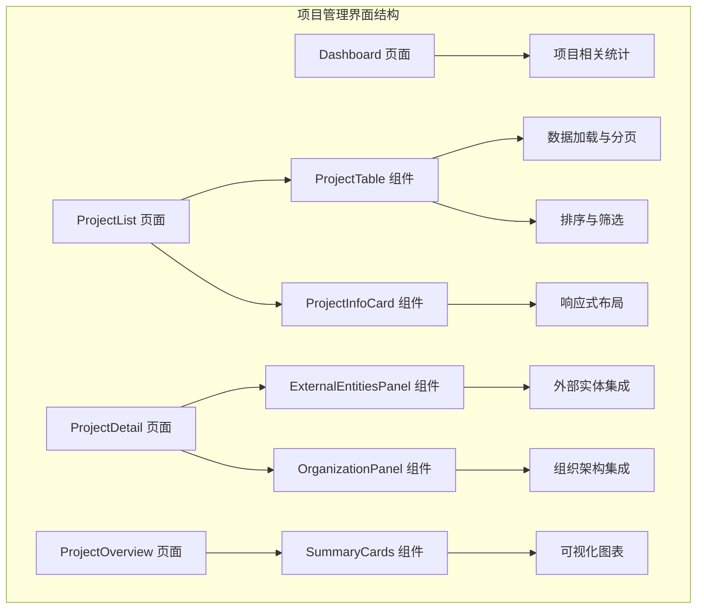

**Diagram sources**
- [packages/web/src/pages/ProjectList.tsx](file://packages/web/src/pages/ProjectList.tsx)
- [packages/web/src/components/project/ProjectTable.tsx](file://packages/web/src/components/project/ProjectTable.tsx)
- [packages/web/src/components/project/ProjectInfoCard.tsx](file://packages/web/src/components/project/ProjectInfoCard.tsx)
- [packages/web/src/pages/ProjectDetail.tsx](file://packages/web/src/pages/ProjectDetail.tsx)
- [packages/web/src/components/project/ExternalEntitiesPanel.tsx](file://packages/web/src/components/project/ExternalEntitiesPanel.tsx)
- [packages/web/src/components/project/OrganizationPanel.tsx](file://packages/web/src/components/project/OrganizationPanel.tsx)
- [packages/web/src/pages/ProjectOverview.tsx](file://packages/web/src/pages/ProjectOverview.tsx)
- [packages/web/src/components/project/SummaryCards.tsx](file://packages/web/src/components/project/SummaryCards.tsx)
- [packages/web/src/pages/Dashboard.tsx](file://packages/web/src/pages/Dashboard.tsx)

## 项目管理界面

<cite>
**本文档引用的文件**
- [ProjectList.tsx](file://packages/web/src/pages/ProjectList.tsx)
- [ProjectTable.tsx](file://packages/web/src/components/project/ProjectTable.tsx)
- [ProjectInfoCard.tsx](file://packages/web/src/components/project/ProjectInfoCard.tsx)
- [ProjectDetail.tsx](file://packages/web/src/pages/ProjectDetail.tsx)
- [ExternalEntitiesPanel.tsx](file://packages/web/src/components/project/ExternalEntitiesPanel.tsx)
- [OrganizationPanel.tsx](file://packages/web/src/components/project/OrganizationPanel.tsx)
- [ProjectOverview.tsx](file://packages/web/src/pages/ProjectOverview.tsx)
- [SummaryCards.tsx](file://packages/web/src/components/project/SummaryCards.tsx)
- [Dashboard.tsx](file://packages/web/src/pages/Dashboard.tsx)
- [useProjectList.ts](file://packages/web/src/hooks/useProjectList.ts)
- [useProjectDetail.ts](file://packages/web/src/hooks/useProjectDetail.ts)
- [ProjectContext.tsx](file://packages/web/src/contexts/ProjectContext.tsx)
- [CreateProjectDialog.tsx](file://packages/web/src/components/project/CreateProjectDialog.tsx)
- [ArchiveConfirmDialog.tsx](file://packages/web/src/components/project/ArchiveConfirmDialog.tsx)
- [DetailSkeleton.tsx](file://packages/web/src/components/project/DetailSkeleton.tsx)
- [FilterBar.tsx](file://packages/web/src/components/common/FilterBar.tsx)
- [PaginationComponent.tsx](file://packages/web/src/components/common/PaginationComponent.tsx)
- [StatusBadge.tsx](file://packages/web/src/components/common/StatusBadge.tsx)
- [client.ts](file://packages/web/src/api/client.ts)
- [api-client.ts](file://packages/web/src/lib/api-client.ts)
</cite>

## 目录
1. [简介](#简介)
2. [项目结构](#项目结构)
3. [核心组件](#核心组件)
4. [架构总览](#架构总览)
5. [详细组件分析](#详细组件分析)
6. [依赖关系分析](#依赖关系分析)
7. [性能考虑](#性能考虑)
8. [故障排除指南](#故障排除指南)
9. [结论](#结论)

## 简介
本指南专注于AI原型管理系统中的项目管理界面，涵盖从项目列表到详情、从创建编辑到归档的完整工作流。重点解析数据展示与交互设计、信息架构与组件组织、表单设计与验证逻辑、数据可视化与统计展示、表格组件的数据加载与筛选排序、信息卡片的布局设计与响应式适配，以及外部实体面板与组织架构面板的集成方式。同时提供状态管理与实时更新机制的实现策略，以及用户体验优化与性能提升的具体建议。

## 项目结构
项目管理界面采用页面级组件与可复用组件分离的架构模式，通过上下文与自定义Hook实现状态共享与数据获取，确保组件职责清晰、可测试性良好。

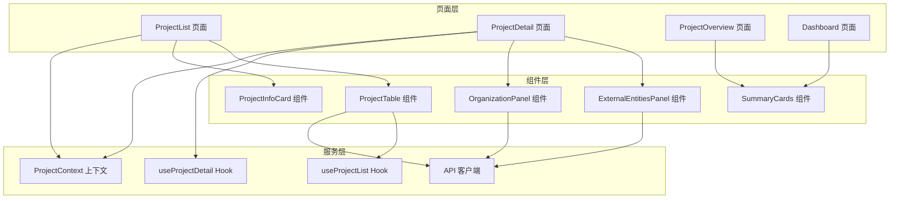

**图表来源**
- [ProjectList.tsx](file://packages/web/src/pages/ProjectList.tsx)
- [ProjectDetail.tsx](file://packages/web/src/pages/ProjectDetail.tsx)
- [ProjectOverview.tsx](file://packages/web/src/pages/ProjectOverview.tsx)
- [ProjectTable.tsx](file://packages/web/src/components/project/ProjectTable.tsx)
- [ProjectInfoCard.tsx](file://packages/web/src/components/project/ProjectInfoCard.tsx)
- [ExternalEntitiesPanel.tsx](file://packages/web/src/components/project/ExternalEntitiesPanel.tsx)
- [OrganizationPanel.tsx](file://packages/web/src/components/project/OrganizationPanel.tsx)
- [SummaryCards.tsx](file://packages/web/src/components/project/SummaryCards.tsx)
- [useProjectList.ts](file://packages/web/src/hooks/useProjectList.ts)
- [useProjectDetail.ts](file://packages/web/src/hooks/useProjectDetail.ts)
- [ProjectContext.tsx](file://packages/web/src/contexts/ProjectContext.tsx)
- [client.ts](file://packages/web/src/api/client.ts)

**章节来源**
- [ProjectList.tsx](file://packages/web/src/pages/ProjectList.tsx)
- [ProjectDetail.tsx](file://packages/web/src/pages/ProjectDetail.tsx)
- [ProjectOverview.tsx](file://packages/web/src/pages/ProjectOverview.tsx)
- [ProjectTable.tsx](file://packages/web/src/components/project/ProjectTable.tsx)
- [ProjectInfoCard.tsx](file://packages/web/src/components/project/ProjectInfoCard.tsx)
- [ExternalEntitiesPanel.tsx](file://packages/web/src/components/project/ExternalEntitiesPanel.tsx)
- [OrganizationPanel.tsx](file://packages/web/src/components/project/OrganizationPanel.tsx)
- [SummaryCards.tsx](file://packages/web/src/components/project/SummaryCards.tsx)
- [useProjectList.ts](file://packages/web/src/hooks/useProjectList.ts)
- [useProjectDetail.ts](file://packages/web/src/hooks/useProjectDetail.ts)
- [ProjectContext.tsx](file://packages/web/src/contexts/ProjectContext.tsx)
- [client.ts](file://packages/web/src/api/client.ts)

## 核心组件
- 项目列表页面：负责项目数据的展示、筛选、分页与排序，提供项目操作入口（查看详情、编辑、归档）。
- 项目详情页面：集中展示项目基本信息、关联的外部实体与组织架构，支持实时更新与状态变更。
- 项目概览页面：以卡片形式展示关键指标与统计数据，提供快速概览能力。
- 表格组件：封装数据加载、排序、筛选、分页等通用逻辑，支持列配置与交互。
- 信息卡片组件：用于项目摘要信息的展示，具备响应式布局与状态标识。
- 面板组件：外部实体面板与组织架构面板分别集成不同维度的数据视图。
- 创建与归档对话框：提供项目创建与归档确认的表单交互。
- 自定义Hook与上下文：统一管理项目数据状态、查询参数与缓存策略。

**章节来源**
- [ProjectList.tsx](file://packages/web/src/pages/ProjectList.tsx)
- [ProjectDetail.tsx](file://packages/web/src/pages/ProjectDetail.tsx)
- [ProjectOverview.tsx](file://packages/web/src/pages/ProjectOverview.tsx)
- [ProjectTable.tsx](file://packages/web/src/components/project/ProjectTable.tsx)
- [ProjectInfoCard.tsx](file://packages/web/src/components/project/ProjectInfoCard.tsx)
- [ExternalEntitiesPanel.tsx](file://packages/web/src/components/project/ExternalEntitiesPanel.tsx)
- [OrganizationPanel.tsx](file://packages/web/src/components/project/OrganizationPanel.tsx)
- [CreateProjectDialog.tsx](file://packages/web/src/components/project/CreateProjectDialog.tsx)
- [ArchiveConfirmDialog.tsx](file://packages/web/src/components/project/ArchiveConfirmDialog.tsx)
- [useProjectList.ts](file://packages/web/src/hooks/useProjectList.ts)
- [useProjectDetail.ts](file://packages/web/src/hooks/useProjectDetail.ts)
- [ProjectContext.tsx](file://packages/web/src/contexts/ProjectContext.tsx)

## 架构总览
项目管理界面遵循“页面-组件-Hook-上下文-API客户端”的分层架构，通过自定义Hook抽象数据获取与状态管理，组件专注UI渲染与用户交互，上下文提供跨层级的状态共享，API客户端封装网络请求细节。

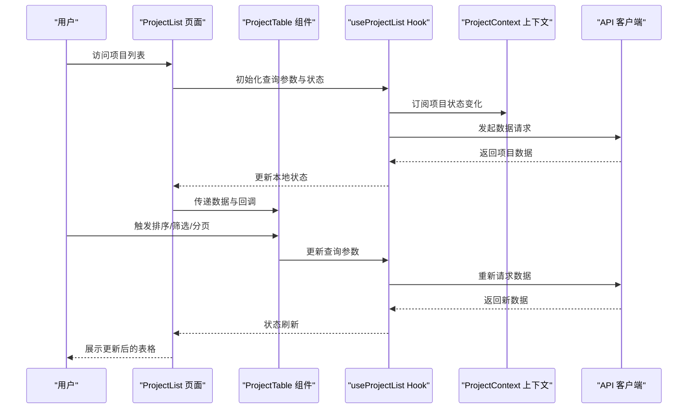

**图表来源**
- [ProjectList.tsx](file://packages/web/src/pages/ProjectList.tsx)
- [ProjectTable.tsx](file://packages/web/src/components/project/ProjectTable.tsx)
- [useProjectList.ts](file://packages/web/src/hooks/useProjectList.ts)
- [ProjectContext.tsx](file://packages/web/src/contexts/ProjectContext.tsx)
- [client.ts](file://packages/web/src/api/client.ts)

## 详细组件分析

### 项目列表页面（ProjectList）
- 数据展示：通过useProjectList Hook获取项目列表数据，结合FilterBar进行筛选，使用PaginationComponent实现分页。
- 交互设计：支持点击项目进入详情、批量操作、状态切换等；通过StatusBadge展示项目状态。
- 性能优化：使用虚拟化或分页减少DOM节点数量；对筛选条件进行防抖处理。

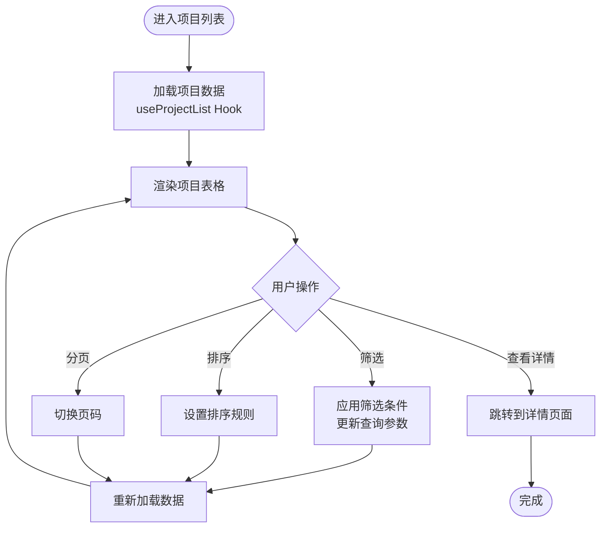

**图表来源**
- [ProjectList.tsx](file://packages/web/src/pages/ProjectList.tsx)
- [useProjectList.ts](file://packages/web/src/hooks/useProjectList.ts)
- [FilterBar.tsx](file://packages/web/src/components/common/FilterBar.tsx)
- [PaginationComponent.tsx](file://packages/web/src/components/common/PaginationComponent.tsx)
- [StatusBadge.tsx](file://packages/web/src/components/common/StatusBadge.tsx)

**章节来源**
- [ProjectList.tsx](file://packages/web/src/pages/ProjectList.tsx)
- [useProjectList.ts](file://packages/web/src/hooks/useProjectList.ts)
- [FilterBar.tsx](file://packages/web/src/components/common/FilterBar.tsx)
- [PaginationComponent.tsx](file://packages/web/src/components/common/PaginationComponent.tsx)
- [StatusBadge.tsx](file://packages/web/src/components/common/StatusBadge.tsx)

### 项目详情页面（ProjectDetail）
- 信息架构：左侧为项目基本信息与操作区，右侧为外部实体面板与组织架构面板，形成左右分区布局。
- 组件组织：ExternalEntitiesPanel与OrganizationPanel分别负责外部实体与组织架构的数据展示与交互。
- 实时更新：通过ProjectContext与useProjectDetail Hook订阅项目状态变化，实现数据的实时同步。

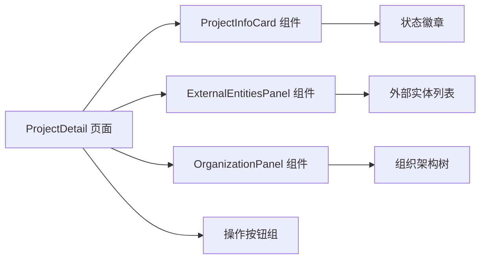

**图表来源**
- [ProjectDetail.tsx](file://packages/web/src/pages/ProjectDetail.tsx)
- [ProjectInfoCard.tsx](file://packages/web/src/components/project/ProjectInfoCard.tsx)
- [ExternalEntitiesPanel.tsx](file://packages/web/src/components/project/ExternalEntitiesPanel.tsx)
- [OrganizationPanel.tsx](file://packages/web/src/components/project/OrganizationPanel.tsx)
- [useProjectDetail.ts](file://packages/web/src/hooks/useProjectDetail.ts)
- [ProjectContext.tsx](file://packages/web/src/contexts/ProjectContext.tsx)

**章节来源**
- [ProjectDetail.tsx](file://packages/web/src/pages/ProjectDetail.tsx)
- [ProjectInfoCard.tsx](file://packages/web/src/components/project/ProjectInfoCard.tsx)
- [ExternalEntitiesPanel.tsx](file://packages/web/src/components/project/ExternalEntitiesPanel.tsx)
- [OrganizationPanel.tsx](file://packages/web/src/components/project/OrganizationPanel.tsx)
- [useProjectDetail.ts](file://packages/web/src/hooks/useProjectDetail.ts)
- [ProjectContext.tsx](file://packages/web/src/contexts/ProjectContext.tsx)

### 项目概览页面（ProjectOverview）
- 数据可视化：通过SummaryCards组件展示关键指标卡片，支持点击进入详情或执行操作。
- 统计展示：结合Dashboard页面的全局统计，提供项目层面的概览视图。

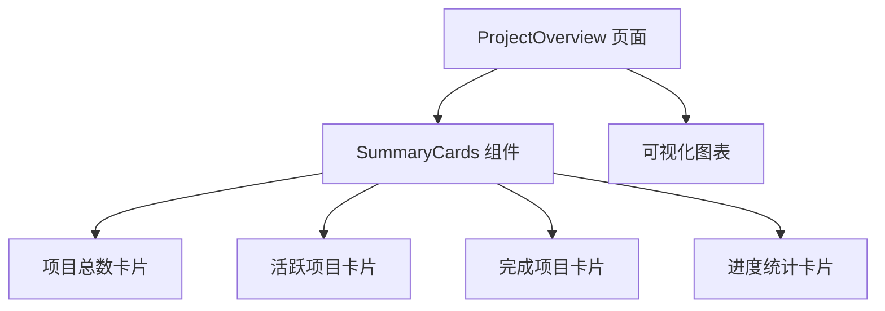

**图表来源**
- [ProjectOverview.tsx](file://packages/web/src/pages/ProjectOverview.tsx)
- [SummaryCards.tsx](file://packages/web/src/components/project/SummaryCards.tsx)
- [Dashboard.tsx](file://packages/web/src/pages/Dashboard.tsx)

**章节来源**
- [ProjectOverview.tsx](file://packages/web/src/pages/ProjectOverview.tsx)
- [SummaryCards.tsx](file://packages/web/src/components/project/SummaryCards.tsx)
- [Dashboard.tsx](file://packages/web/src/pages/Dashboard.tsx)

### 表格组件（ProjectTable）
- 数据加载：通过useProjectList Hook提供的数据与状态，实现数据的懒加载与增量加载。
- 排序与筛选：支持多列排序与复杂筛选条件，筛选结果通过查询参数传递给后端。
- 性能优化：使用虚拟滚动或分页减少渲染压力；对高频操作进行节流/防抖。

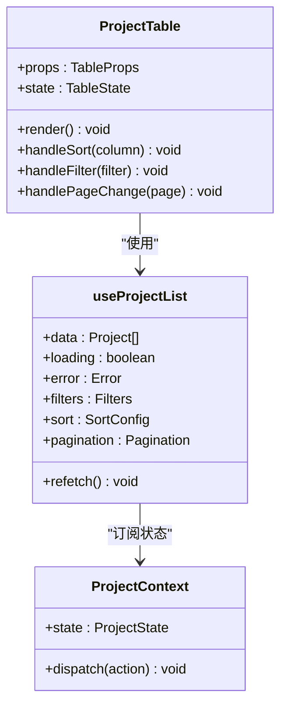

**图表来源**
- [ProjectTable.tsx](file://packages/web/src/components/project/ProjectTable.tsx)
- [useProjectList.ts](file://packages/web/src/hooks/useProjectList.ts)
- [ProjectContext.tsx](file://packages/web/src/contexts/ProjectContext.tsx)

**章节来源**
- [ProjectTable.tsx](file://packages/web/src/components/project/ProjectTable.tsx)
- [useProjectList.ts](file://packages/web/src/hooks/useProjectList.ts)
- [ProjectContext.tsx](file://packages/web/src/contexts/ProjectContext.tsx)

### 信息卡片组件（ProjectInfoCard）
- 布局设计：采用卡片式布局，包含项目标题、状态徽章、关键信息字段与操作按钮。
- 响应式适配：在小屏设备上自动调整为垂直堆叠布局，确保信息可读性与操作便捷性。
- 状态标识：通过StatusBadge组件展示项目当前状态，颜色与文案符合业务规范。

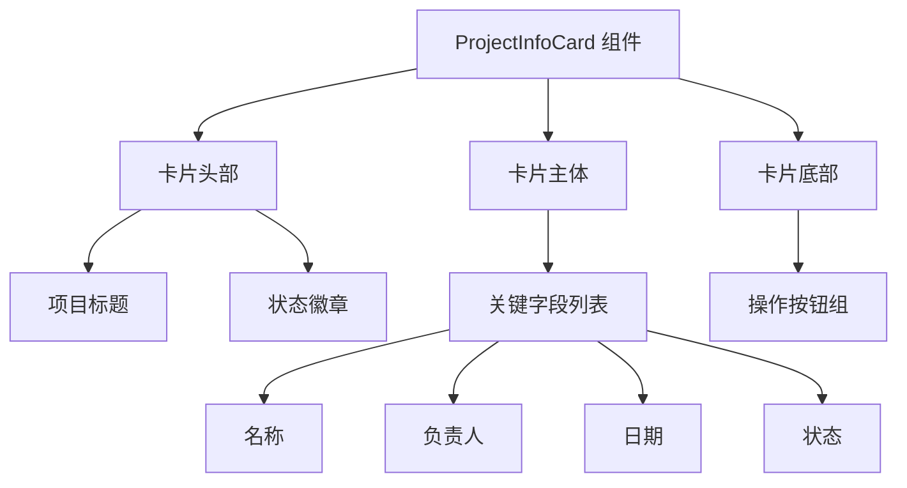

**图表来源**
- [ProjectInfoCard.tsx](file://packages/web/src/components/project/ProjectInfoCard.tsx)
- [StatusBadge.tsx](file://packages/web/src/components/common/StatusBadge.tsx)

**章节来源**
- [ProjectInfoCard.tsx](file://packages/web/src/components/project/ProjectInfoCard.tsx)
- [StatusBadge.tsx](file://packages/web/src/components/common/StatusBadge.tsx)

### 外部实体面板与组织架构面板
- 集成方式：两个面板均通过API客户端获取数据，支持独立加载与交互；在详情页面中并排显示，便于对比查看。
- 数据展示：外部实体面板展示与项目关联的外部实体列表，组织架构面板展示项目所属部门与人员信息。
- 交互设计：支持点击实体进入详情、展开/折叠子项、搜索过滤等功能。

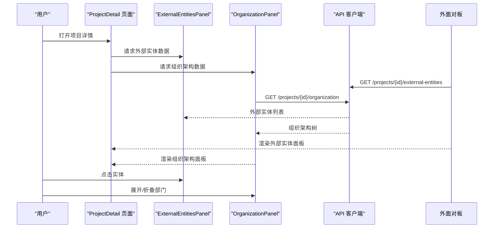

**图表来源**
- [ProjectDetail.tsx](file://packages/web/src/pages/ProjectDetail.tsx)
- [ExternalEntitiesPanel.tsx](file://packages/web/src/components/project/ExternalEntitiesPanel.tsx)
- [OrganizationPanel.tsx](file://packages/web/src/components/project/OrganizationPanel.tsx)
- [client.ts](file://packages/web/src/api/client.ts)

**章节来源**
- [ProjectDetail.tsx](file://packages/web/src/pages/ProjectDetail.tsx)
- [ExternalEntitiesPanel.tsx](file://packages/web/src/components/project/ExternalEntitiesPanel.tsx)
- [OrganizationPanel.tsx](file://packages/web/src/components/project/OrganizationPanel.tsx)
- [client.ts](file://packages/web/src/api/client.ts)

### 创建、编辑、归档表单设计与验证逻辑
- 创建表单：CreateProjectDialog提供项目创建的表单界面，包含必填字段校验与提交流程。
- 编辑表单：基于项目详情数据生成编辑表单，支持字段级校验与保存。
- 归档确认：ArchiveConfirmDialog提供归档确认与二次确认，防止误操作。
- 验证逻辑：前端进行基础格式校验，后端进行业务规则校验，前后端协同保证数据一致性。

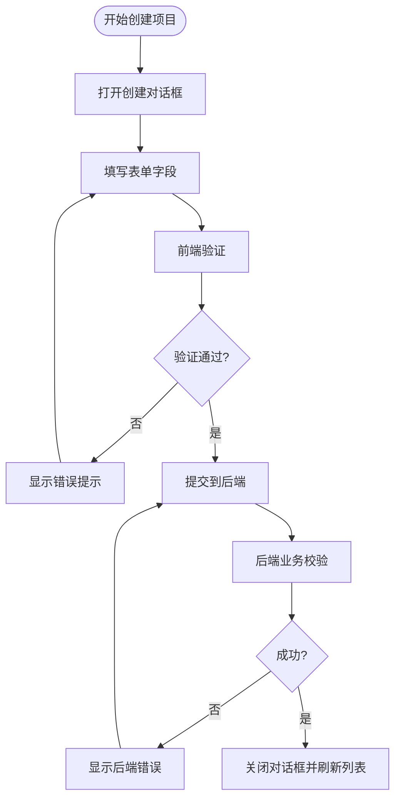

**图表来源**
- [CreateProjectDialog.tsx](file://packages/web/src/components/project/CreateProjectDialog.tsx)
- [ArchiveConfirmDialog.tsx](file://packages/web/src/components/project/ArchiveConfirmDialog.tsx)
- [client.ts](file://packages/web/src/api/client.ts)

**章节来源**
- [CreateProjectDialog.tsx](file://packages/web/src/components/project/CreateProjectDialog.tsx)
- [ArchiveConfirmDialog.tsx](file://packages/web/src/components/project/ArchiveConfirmDialog.tsx)
- [client.ts](file://packages/web/src/api/client.ts)

### 项目状态管理与实时更新机制
- 状态管理：ProjectContext统一管理项目状态，包括当前选中项目、查询参数、缓存数据等。
- 实时更新：通过订阅API推送或轮询机制，当项目状态发生变化时，自动刷新相关组件。
- 乐观更新：在用户操作（如归档、编辑）时先本地更新UI，再异步同步到服务器，提升交互流畅度。

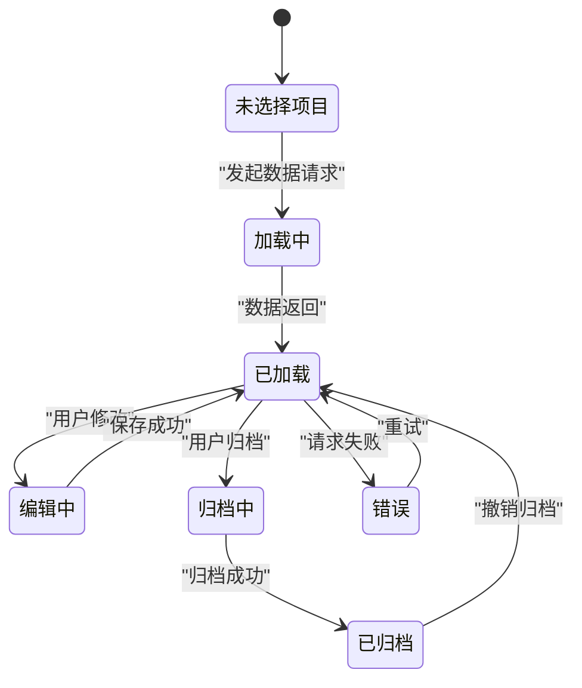

**图表来源**
- [ProjectContext.tsx](file://packages/web/src/contexts/ProjectContext.tsx)
- [useProjectDetail.ts](file://packages/web/src/hooks/useProjectDetail.ts)
- [client.ts](file://packages/web/src/api/client.ts)

**章节来源**
- [ProjectContext.tsx](file://packages/web/src/contexts/ProjectContext.tsx)
- [useProjectDetail.ts](file://packages/web/src/hooks/useProjectDetail.ts)
- [client.ts](file://packages/web/src/api/client.ts)

## 依赖关系分析
项目管理界面的依赖关系清晰，页面组件依赖于自定义Hook与上下文，组件依赖于UI基础库与API客户端，形成稳定的分层结构。

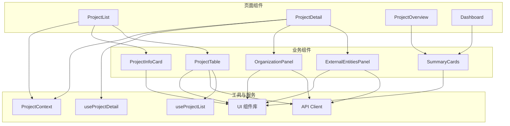

**图表来源**
- [ProjectList.tsx](file://packages/web/src/pages/ProjectList.tsx)
- [ProjectDetail.tsx](file://packages/web/src/pages/ProjectDetail.tsx)
- [ProjectOverview.tsx](file://packages/web/src/pages/ProjectOverview.tsx)
- [ProjectTable.tsx](file://packages/web/src/components/project/ProjectTable.tsx)
- [ProjectInfoCard.tsx](file://packages/web/src/components/project/ProjectInfoCard.tsx)
- [ExternalEntitiesPanel.tsx](file://packages/web/src/components/project/ExternalEntitiesPanel.tsx)
- [OrganizationPanel.tsx](file://packages/web/src/components/project/OrganizationPanel.tsx)
- [SummaryCards.tsx](file://packages/web/src/components/project/SummaryCards.tsx)
- [useProjectList.ts](file://packages/web/src/hooks/useProjectList.ts)
- [useProjectDetail.ts](file://packages/web/src/hooks/useProjectDetail.ts)
- [ProjectContext.tsx](file://packages/web/src/contexts/ProjectContext.tsx)
- [client.ts](file://packages/web/src/api/client.ts)

**章节来源**
- [ProjectList.tsx](file://packages/web/src/pages/ProjectList.tsx)
- [ProjectDetail.tsx](file://packages/web/src/pages/ProjectDetail.tsx)
- [ProjectOverview.tsx](file://packages/web/src/pages/ProjectOverview.tsx)
- [ProjectTable.tsx](file://packages/web/src/components/project/ProjectTable.tsx)
- [ProjectInfoCard.tsx](file://packages/web/src/components/project/ProjectInfoCard.tsx)
- [ExternalEntitiesPanel.tsx](file://packages/web/src/components/project/ExternalEntitiesPanel.tsx)
- [OrganizationPanel.tsx](file://packages/web/src/components/project/OrganizationPanel.tsx)
- [SummaryCards.tsx](file://packages/web/src/components/project/SummaryCards.tsx)
- [useProjectList.ts](file://packages/web/src/hooks/useProjectList.ts)
- [useProjectDetail.ts](file://packages/web/src/hooks/useProjectDetail.ts)
- [ProjectContext.tsx](file://packages/web/src/contexts/ProjectContext.tsx)
- [client.ts](file://packages/web/src/api/client.ts)

## 性能考虑
- 数据加载优化：使用分页与虚拟滚动减少一次性渲染的数据量；对筛选与排序参数进行防抖，避免频繁请求。
- 缓存策略：利用ProjectContext缓存最近查询结果，支持回退与快速刷新；对静态数据（如状态枚举）进行本地缓存。
- 组件渲染优化：合理拆分组件，避免不必要的重渲染；使用React.memo与useMemo/useCallback优化高开销计算。
- 网络请求优化：合并多个小请求为批量请求；启用HTTP缓存头与ETag；对长耗时操作提供加载骨架屏。
- 图表与可视化：对图表组件进行懒加载与尺寸监听，避免在不可见状态下渲染；使用Canvas或SVG优化大数据量场景。

## 故障排除指南
- 数据不更新：检查ProjectContext的状态订阅是否正确，确认useProjectList与useProjectDetail的查询参数是否同步。
- 请求失败：查看API客户端的错误处理逻辑，确认网络异常与后端错误的区分；提供重试与降级策略。
- 表格无响应：排查排序/筛选/分页回调是否正确传递给Hook；检查数据格式与列配置是否匹配。
- 面板空白：确认API接口返回的数据结构与组件期望一致；检查权限控制导致的数据为空。
- 性能问题：使用浏览器开发者工具分析渲染瓶颈，优先优化高频组件与大列表渲染。

**章节来源**
- [ProjectContext.tsx](file://packages/web/src/contexts/ProjectContext.tsx)
- [useProjectList.ts](file://packages/web/src/hooks/useProjectList.ts)
- [useProjectDetail.ts](file://packages/web/src/hooks/useProjectDetail.ts)
- [client.ts](file://packages/web/src/api/client.ts)

## 结论
项目管理界面通过清晰的分层架构与模块化组件设计，实现了从数据获取、状态管理到UI渲染的全链路优化。通过表格组件的通用化设计、信息卡片的响应式布局、面板组件的独立扩展，以及完善的表单与验证机制，为用户提供高效、直观、可靠的项目管理体验。配合状态管理与实时更新机制，确保数据的一致性与交互的流畅性。建议在后续迭代中持续关注性能监控与用户体验反馈，进一步完善自动化测试与文档体系。

