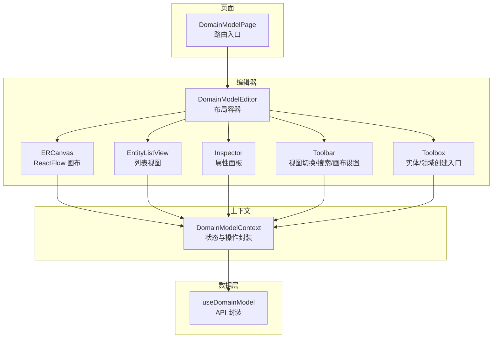
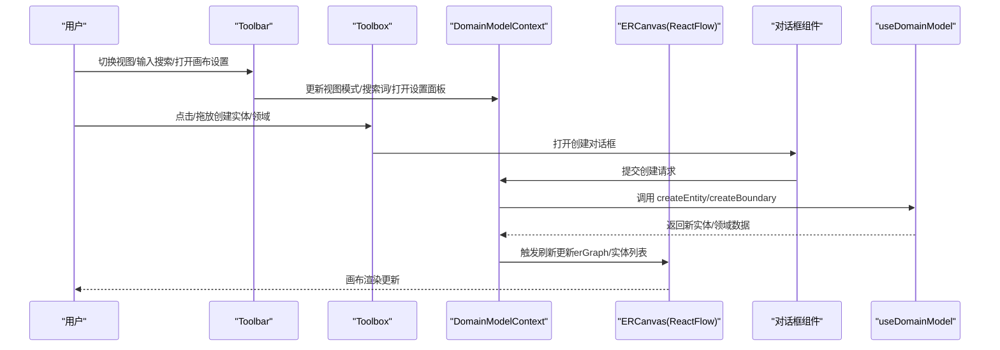
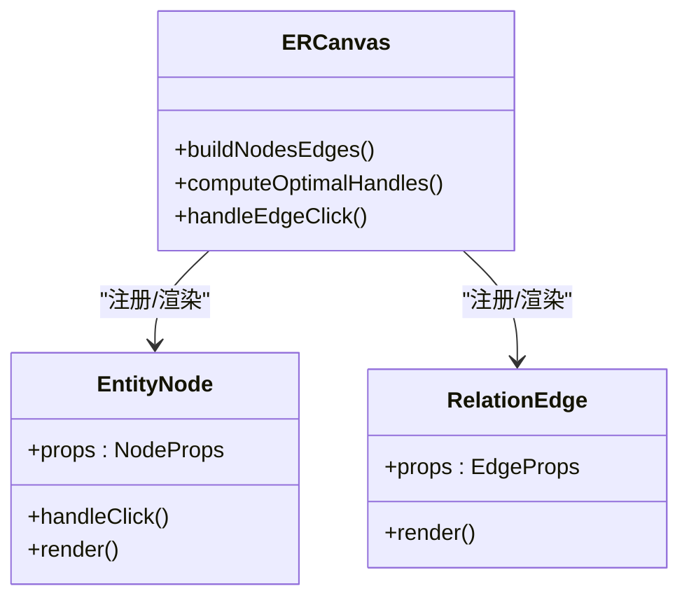
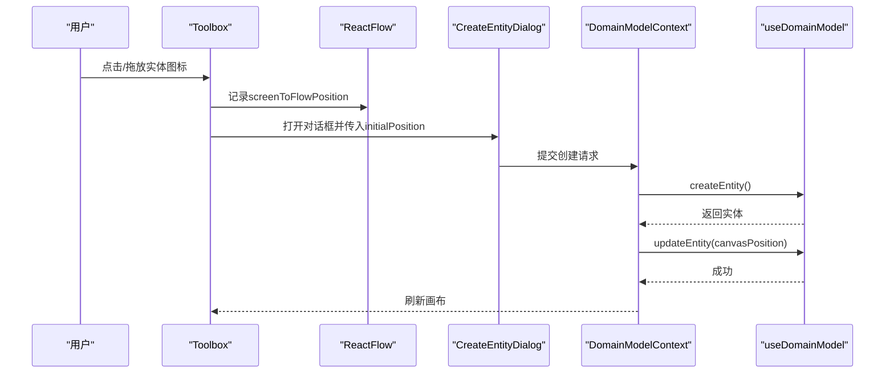
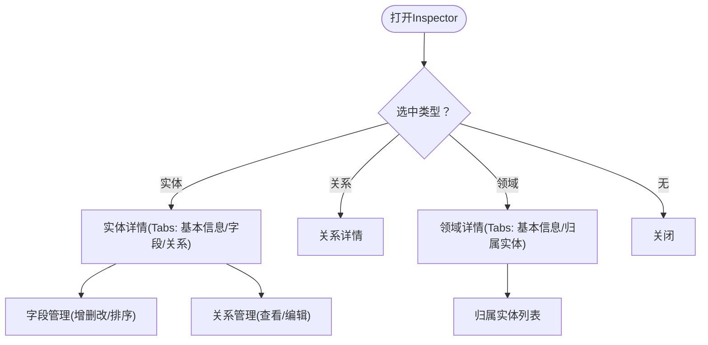
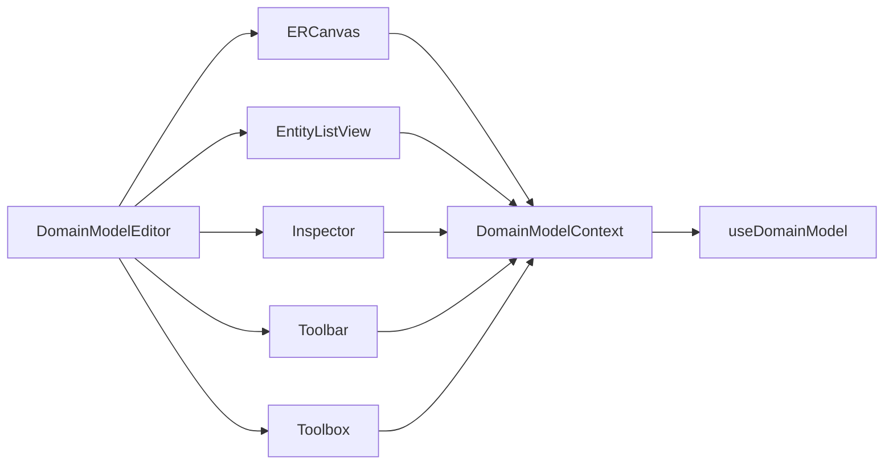

# 领域模型编辑器

<cite>
**本文档引用的文件**
- [DomainModelEditor.tsx](file://packages/web/src/components/domain-model/DomainModelEditor.tsx)
- [Toolbar.tsx](file://packages/web/src/components/domain-model/Toolbar.tsx)
- [CanvasSettingsSheet.tsx](file://packages/web/src/components/domain-model/CanvasSettingsSheet.tsx)
- [DomainModelContext.tsx](file://packages/web/src/contexts/DomainModelContext.tsx)
- [DomainModelPage.tsx](file://packages/web/src/pages/DomainModelPage.tsx)
- [ERCanvas.tsx](file://packages/web/src/components/domain-model/canvas/ERCanvas.tsx)
- [Toolbox.tsx](file://packages/web/src/components/domain-model/canvas/Toolbox.tsx)
- [EntityNode.tsx](file://packages/web/src/components/domain-model/canvas/EntityNode.tsx)
- [RelationEdge.tsx](file://packages/web/src/components/domain-model/canvas/RelationEdge.tsx)
- [Inspector.tsx](file://packages/web/src/components/domain-model/inspector/Inspector.tsx)
- [EntityListView.tsx](file://packages/web/src/components/domain-model/list/EntityListView.tsx)
- [CreateEntityDialog.tsx](file://packages/web/src/components/domain-model/dialogs/CreateEntityDialog.tsx)
- [FieldDialog.tsx](file://packages/web/src/components/domain-model/dialogs/FieldDialog.tsx)
- [useDomainModel.ts](file://packages/web/src/hooks/useDomainModel.ts)
</cite>

## 目录
1. [简介](#简介)
2. [项目结构](#项目结构)
3. [核心组件](#核心组件)
4. [架构总览](#架构总览)
5. [详细组件分析](#详细组件分析)
6. [依赖分析](#依赖分析)
7. [性能考量](#性能考量)
8. [故障排查指南](#故障排查指南)
9. [结论](#结论)
10. [附录](#附录)

## 简介
本指南面向AI原型管理系统中的“领域模型编辑器”，围绕基于ReactFlow的ER图编辑器进行深入讲解。内容涵盖：
- ReactFlow集成与配置要点
- 实体节点、关系边、工具箱的实现原理与交互逻辑
- ER图编辑器的数据模型与状态管理
- 实体创建、字段管理、关系建模的UI交互设计
- 画布设置面板与工具栏功能实现
- 对话框组件的统一设计模式与表单处理
- Inspector属性面板的数据绑定与实时更新机制
- CanvasSettingsSheet的配置管理与用户偏好存储
- 图形编辑器的性能优化与用户体验改进策略

## 项目结构
领域模型编辑器采用“页面级Provider + 多组件协作”的结构：
- 页面入口负责注入项目ID并挂载编辑器
- 编辑器容器负责布局组织（工具栏、工具箱、画布/列表、Inspector）
- ReactFlow画布承载实体节点与关系边
- Inspector右侧面板展示实体/关系/领域详情
- 对话框组件统一处理新增/编辑流程
- Context集中管理跨组件状态与数据操作

图表来源
- [DomainModelPage.tsx:11-21](file://packages/web/src/pages/DomainModelPage.tsx#L11-L21)
- [DomainModelEditor.tsx:21-44](file://packages/web/src/components/domain-model/DomainModelEditor.tsx#L21-L44)
- [Toolbar.tsx:17-90](file://packages/web/src/components/domain-model/Toolbar.tsx#L17-L90)
- [Toolbox.tsx:76-304](file://packages/web/src/components/domain-model/canvas/Toolbox.tsx#L76-L304)
- [ERCanvas.tsx:106-621](file://packages/web/src/components/domain-model/canvas/ERCanvas.tsx#L106-L621)
- [EntityListView.tsx:25-117](file://packages/web/src/components/domain-model/list/EntityListView.tsx#L25-L117)
- [Inspector.tsx:24-169](file://packages/web/src/components/domain-model/inspector/Inspector.tsx#L24-L169)
- [DomainModelContext.tsx:205-551](file://packages/web/src/contexts/DomainModelContext.tsx#L205-L551)
- [useDomainModel.ts:135-464](file://packages/web/src/hooks/useDomainModel.ts#L135-L464)

章节来源
- [DomainModelPage.tsx:11-21](file://packages/web/src/pages/DomainModelPage.tsx#L11-L21)
- [DomainModelEditor.tsx:21-44](file://packages/web/src/components/domain-model/DomainModelEditor.tsx#L21-L44)

## 核心组件
- DomainModelEditor：顶层布局容器，协调工具栏、工具箱、画布/列表、Inspector的显示与切换
- DomainModelContext：集中状态与操作，包括实体/关系/领域数据、选中态、画布设置、ReactFlow实例引用、最后点击位置等
- ERCanvas：ReactFlow画布容器，负责节点/边构建、拖拽位置持久化、Handle动态选择、搜索高亮、领域框拖拽联动等
- Toolbox：工具箱，支持实体/领域创建的点击与拖放两种方式，提供拖放高亮与幽灵预览
- EntityNode/RelationEdge：自定义节点与边，分别渲染实体与关系线，支持多种关系类型与标签显示
- Inspector：右侧面板，支持实体/关系/领域三种模式，Tab式组织信息
- EntityListView：列表视图，表格展示实体摘要，支持搜索与点击展开Inspector
- 对话框组件：CreateEntityDialog、FieldDialog等，统一表单校验与提交流程
- useDomainModel：数据层Hook，封装实体/关系/领域/ER图的CRUD与查询

章节来源
- [DomainModelEditor.tsx:21-44](file://packages/web/src/components/domain-model/DomainModelEditor.tsx#L21-L44)
- [DomainModelContext.tsx:507-549](file://packages/web/src/contexts/DomainModelContext.tsx#L507-L549)
- [ERCanvas.tsx:106-621](file://packages/web/src/components/domain-model/canvas/ERCanvas.tsx#L106-L621)
- [Toolbox.tsx:76-304](file://packages/web/src/components/domain-model/canvas/Toolbox.tsx#L76-L304)
- [EntityNode.tsx:68-161](file://packages/web/src/components/domain-model/canvas/EntityNode.tsx#L68-L161)
- [RelationEdge.tsx:64-327](file://packages/web/src/components/domain-model/canvas/RelationEdge.tsx#L64-L327)
- [Inspector.tsx:24-169](file://packages/web/src/components/domain-model/inspector/Inspector.tsx#L24-L169)
- [EntityListView.tsx:25-117](file://packages/web/src/components/domain-model/list/EntityListView.tsx#L25-L117)
- [CreateEntityDialog.tsx:42-176](file://packages/web/src/components/domain-model/dialogs/CreateEntityDialog.tsx#L42-L176)
- [FieldDialog.tsx:46-243](file://packages/web/src/components/domain-model/dialogs/FieldDialog.tsx#L46-L243)
- [useDomainModel.ts:135-464](file://packages/web/src/hooks/useDomainModel.ts#L135-L464)

## 架构总览
编辑器采用“上下文驱动 + ReactFlow承载”的架构：
- DomainModelContext提供统一状态与操作，屏蔽底层数据细节
- ERCanvas基于Context提供的erGraph数据构建ReactFlow节点与边
- Toolbox与Toolbar通过Context触发创建与设置行为
- Inspector根据选中态切换不同Tab，展示实体/关系/领域详情
- useDomainModel封装API调用，返回Promise结果并触发Context刷新

图表来源
- [Toolbar.tsx:17-90](file://packages/web/src/components/domain-model/Toolbar.tsx#L17-L90)
- [Toolbox.tsx:76-304](file://packages/web/src/components/domain-model/canvas/Toolbox.tsx#L76-L304)
- [DomainModelContext.tsx:507-549](file://packages/web/src/contexts/DomainModelContext.tsx#L507-L549)
- [ERCanvas.tsx:106-621](file://packages/web/src/components/domain-model/canvas/ERCanvas.tsx#L106-L621)
- [CreateEntityDialog.tsx:42-176](file://packages/web/src/components/domain-model/dialogs/CreateEntityDialog.tsx#L42-L176)
- [useDomainModel.ts:188-228](file://packages/web/src/hooks/useDomainModel.ts#L188-L228)

## 详细组件分析

### ReactFlow集成与配置
- 节点与边注册：在组件外部注册自定义节点类型（实体/领域）与边类型（关系），避免重复创建引用
- 数据映射：从Context的erGraph(entities/relations/domains)映射为ReactFlow的nodes/edges
- Handle动态选择：根据节点相对位置与字段数量估算节点高度，计算最优sourceHandle/targetHandle，减少连线抖动
- FitView与缩放：首次加载erGraph后手动触发fitView；设置min/maxZoom提升可用性
- 搜索高亮：根据searchQuery降低未匹配节点透明度，增强视觉聚焦
- 空状态：当erGraph缺失或实体为空时显示引导文案

章节来源
- [ERCanvas.tsx:34-104](file://packages/web/src/components/domain-model/canvas/ERCanvas.tsx#L34-L104)
- [ERCanvas.tsx:178-273](file://packages/web/src/components/domain-model/canvas/ERCanvas.tsx#L178-L273)
- [ERCanvas.tsx:328-344](file://packages/web/src/components/domain-model/canvas/ERCanvas.tsx#L328-L344)
- [ERCanvas.tsx:563-621](file://packages/web/src/components/domain-model/canvas/ERCanvas.tsx#L563-L621)

### 实体节点与关系边
- 实体节点（EntityNode）：标题栏按category着色，字段列表最多显示6项，超出显示“+N”；四方向Handle便于连线；点击选中实体
- 关系边（RelationEdge）：支持五种关系类型（关联/依赖/聚合/组合/泛化），不同类型采用不同线型与标记；hover显示Tooltip；泛化关系常驻标签展示维度；支持基数标注

图表来源
- [EntityNode.tsx:68-161](file://packages/web/src/components/domain-model/canvas/EntityNode.tsx#L68-L161)
- [RelationEdge.tsx:64-327](file://packages/web/src/components/domain-model/canvas/RelationEdge.tsx#L64-L327)
- [ERCanvas.tsx:178-273](file://packages/web/src/components/domain-model/canvas/ERCanvas.tsx#L178-L273)

章节来源
- [EntityNode.tsx:68-161](file://packages/web/src/components/domain-model/canvas/EntityNode.tsx#L68-L161)
- [RelationEdge.tsx:64-327](file://packages/web/src/components/domain-model/canvas/RelationEdge.tsx#L64-L327)

### 工具箱与创建交互
- 两种创建方式：点击图标弹出对话框；拖放到画布在落点弹出对话框
- 拖放高亮：为ReactFlow容器添加高亮类，提供视觉反馈
- 幽灵预览：固定尺寸跟随光标，实体180×78，领域400×300
- 位置持久化：通过lastCanvasClickRef记录点击/落点坐标，创建后立即调用updateEntity保存位置

图表来源
- [Toolbox.tsx:111-206](file://packages/web/src/components/domain-model/canvas/Toolbox.tsx#L111-L206)
- [CreateEntityDialog.tsx:58-86](file://packages/web/src/components/domain-model/dialogs/CreateEntityDialog.tsx#L58-L86)
- [DomainModelContext.tsx:346-355](file://packages/web/src/contexts/DomainModelContext.tsx#L346-L355)
- [useDomainModel.ts:188-228](file://packages/web/src/hooks/useDomainModel.ts#L188-L228)

章节来源
- [Toolbox.tsx:76-304](file://packages/web/src/components/domain-model/canvas/Toolbox.tsx#L76-L304)
- [CreateEntityDialog.tsx:42-176](file://packages/web/src/components/domain-model/dialogs/CreateEntityDialog.tsx#L42-L176)

### Inspector属性面板与数据绑定
- 三种模式互斥：实体详情、关系详情、领域详情；点击空白处关闭
- 实体详情：基本信息/字段/关系三个Tab；字段Tab支持增删改排序；关系Tab展示关联实体与关系详情
- 关系详情：仅展示关系选项卡，显示关系类型、基数、维度等
- 领域详情：基本信息与归属实体两个Tab；支持删除领域对话框
- 数据绑定：根据选中态从Context派生selectedEntity/selectedRelation/selectedBoundary，Tab内容实时响应

图表来源
- [Inspector.tsx:24-169](file://packages/web/src/components/domain-model/inspector/Inspector.tsx#L24-L169)
- [EntityListView.tsx:25-117](file://packages/web/src/components/domain-model/list/EntityListView.tsx#L25-L117)

章节来源
- [Inspector.tsx:24-169](file://packages/web/src/components/domain-model/inspector/Inspector.tsx#L24-L169)

### 画布设置面板与工具栏
- 工具栏：视图切换（ER图/列表）、搜索框（防抖300ms）、画布设置按钮
- 画布设置：右侧滑出Sheet，支持“展示关系名称”开关；设置持久化到localStorage（按项目隔离）

章节来源
- [Toolbar.tsx:17-90](file://packages/web/src/components/domain-model/Toolbar.tsx#L17-L90)
- [CanvasSettingsSheet.tsx:19-59](file://packages/web/src/components/domain-model/CanvasSettingsSheet.tsx#L19-L59)
- [DomainModelContext.tsx:218-232](file://packages/web/src/contexts/DomainModelContext.tsx#L218-L232)

### 对话框组件统一设计模式
- 统一结构：标题、内容区域、底部操作区
- 表单校验：字段名格式、必填项、枚举选项合法性等
- 提交流程：禁用提交按钮、捕获错误、成功提示、关闭对话框并清理表单
- 位置处理：创建实体后立即保存canvasPosition，保证落点一致性

章节来源
- [CreateEntityDialog.tsx:42-176](file://packages/web/src/components/domain-model/dialogs/CreateEntityDialog.tsx#L42-L176)
- [FieldDialog.tsx:46-243](file://packages/web/src/components/domain-model/dialogs/FieldDialog.tsx#L46-L243)

### 列表视图与搜索
- 表格展示实体摘要：名称、显示名、分类、字段数、关系数、更新时间
- 搜索高亮：前端快速过滤并高亮匹配项
- 点击行选中实体，联动Inspector

章节来源
- [EntityListView.tsx:25-117](file://packages/web/src/components/domain-model/list/EntityListView.tsx#L25-L117)

## 依赖分析
- 组件耦合：DomainModelEditor作为布局容器，低耦合地组合各子组件；ERCanvas与Inspector通过Context解耦
- 外部依赖：@xyflow/react提供画布能力；lucide-react提供图标；sonner提供通知；use-debounce提供防抖
- 数据依赖：useDomainModel封装API，DomainModelContext聚合状态与操作，形成清晰的数据流

图表来源
- [DomainModelEditor.tsx:21-44](file://packages/web/src/components/domain-model/DomainModelEditor.tsx#L21-L44)
- [DomainModelContext.tsx:507-549](file://packages/web/src/contexts/DomainModelContext.tsx#L507-L549)
- [useDomainModel.ts:135-464](file://packages/web/src/hooks/useDomainModel.ts#L135-L464)

章节来源
- [DomainModelContext.tsx:507-549](file://packages/web/src/contexts/DomainModelContext.tsx#L507-L549)
- [useDomainModel.ts:135-464](file://packages/web/src/hooks/useDomainModel.ts#L135-L464)

## 性能考量
- 节点Handle动态计算：仅在节点位置变化时重新计算，避免频繁重排
- 边数据更新：通过局部更新edges.data（如showLabel/isSelected）减少重建
- 拖拽防抖：实体/领域位置保存采用500ms防抖，合并多次变更
- 搜索高亮：仅在searchQuery变化时批量更新节点透明度
- FitView时机：首次erGraph加载完成后手动触发fitView，避免初始化时的无效计算
- MiniMap颜色：按类别与领域节点区分颜色，提升可读性

章节来源
- [ERCanvas.tsx:295-326](file://packages/web/src/components/domain-model/canvas/ERCanvas.tsx#L295-L326)
- [ERCanvas.tsx:265-273](file://packages/web/src/components/domain-model/canvas/ERCanvas.tsx#L265-L273)
- [ERCanvas.tsx:433-520](file://packages/web/src/components/domain-model/canvas/ERCanvas.tsx#L433-L520)
- [ERCanvas.tsx:577-606](file://packages/web/src/components/domain-model/canvas/ERCanvas.tsx#L577-L606)

## 故障排查指南
- 画布无节点：确认erGraph是否加载完成；检查Context的loadingGraph状态
- 节点无法拖拽保存：检查lastCanvasClickRef与rfInstanceRef是否正确初始化；确认updateEntity调用链
- 关系边不显示标签：检查canvasSettings.showRelationLabel；确认RelationEdge接收data并渲染
- 搜索无效果：确认searchQuery是否通过防抖更新；检查ERCanvas的searchEffect与EntityListView的前端过滤
- 对话框提交失败：查看表单校验错误与toast提示；确认useDomainModel对应API返回

章节来源
- [DomainModelContext.tsx:234-261](file://packages/web/src/contexts/DomainModelContext.tsx#L234-L261)
- [ERCanvas.tsx:265-273](file://packages/web/src/components/domain-model/canvas/ERCanvas.tsx#L265-L273)
- [ERCanvas.tsx:328-344](file://packages/web/src/components/domain-model/canvas/ERCanvas.tsx#L328-L344)
- [CreateEntityDialog.tsx:58-86](file://packages/web/src/components/domain-model/dialogs/CreateEntityDialog.tsx#L58-L86)

## 结论
该领域模型编辑器通过清晰的上下文抽象与ReactFlow画布集成，实现了实体/关系/领域的可视化建模。工具箱与对话框提供了直观的创建体验，Inspector与列表视图满足了不同场景下的浏览与编辑需求。配合画布设置与搜索高亮，编辑器在可用性与性能上达到了良好平衡。后续可在复杂关系布局、批量化操作与离线缓存等方面进一步优化。

## 附录
- 项目入口：DomainModelPage负责注入projectId并挂载DomainModelEditor
- 数据模型：useDomainModel定义了实体、关系、领域、ER图的数据结构与API封装
- 状态管理：DomainModelContext集中管理视图模式、搜索词、选中态、画布设置与ReactFlow实例

章节来源
- [DomainModelPage.tsx:11-21](file://packages/web/src/pages/DomainModelPage.tsx#L11-L21)
- [useDomainModel.ts:14-129](file://packages/web/src/hooks/useDomainModel.ts#L14-L129)
- [DomainModelContext.tsx:58-188](file://packages/web/src/contexts/DomainModelContext.tsx#L58-L188)