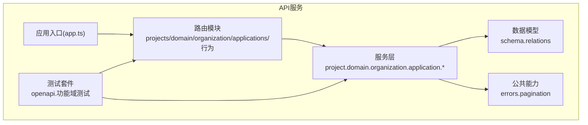
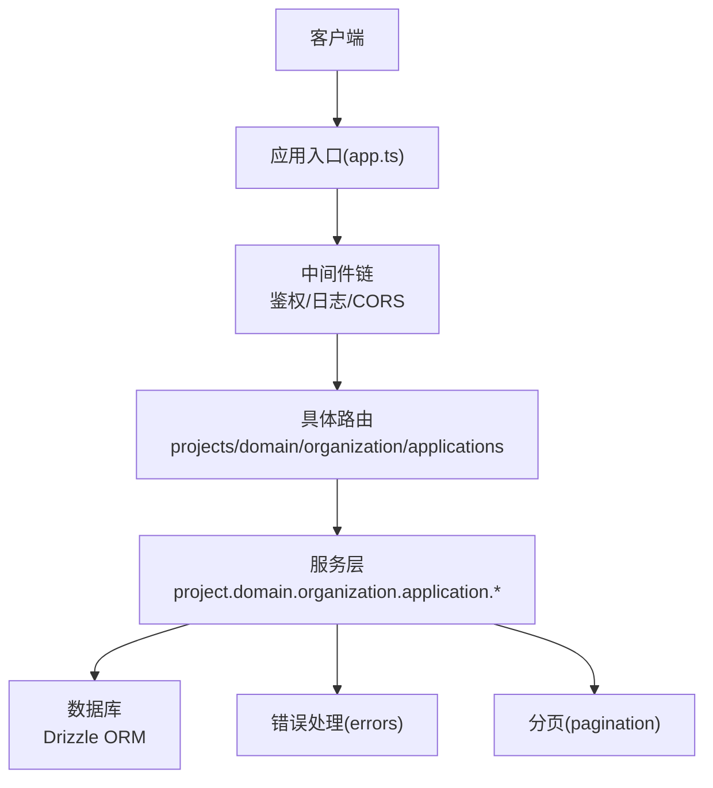
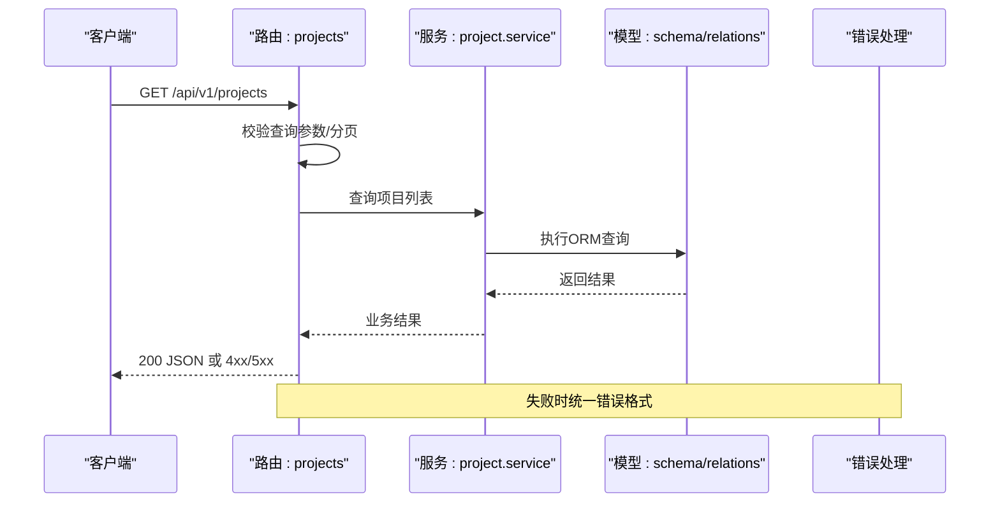
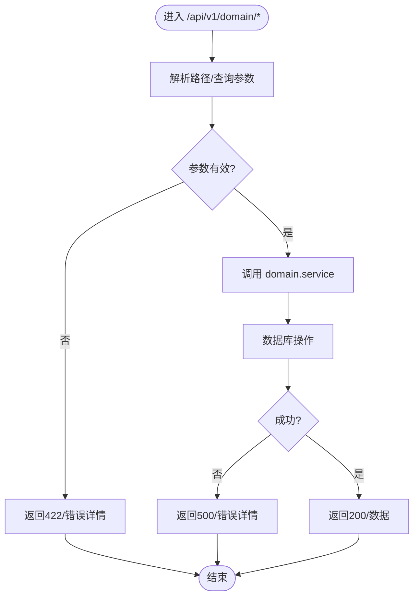
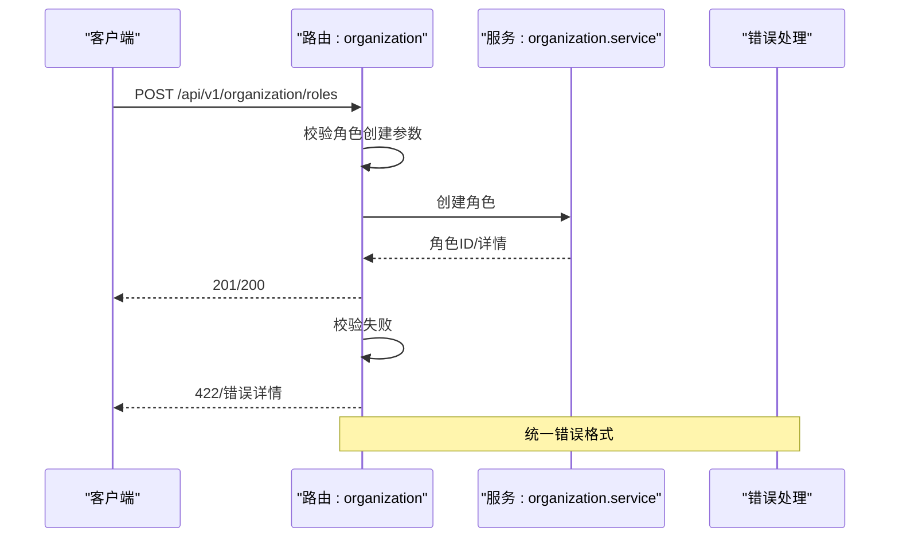
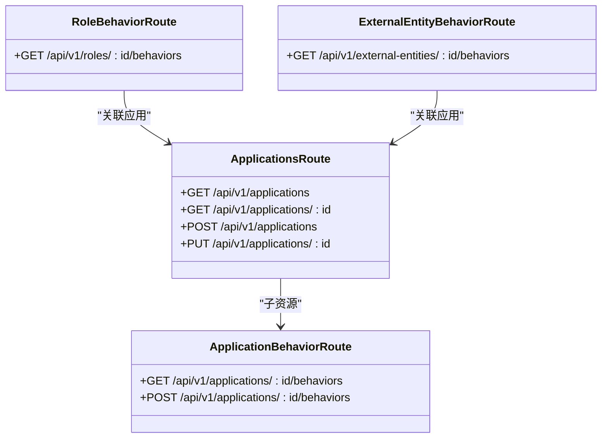
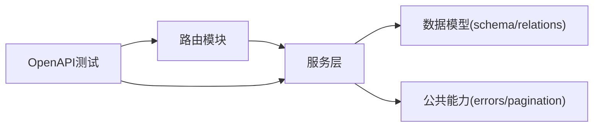

# API路由设计

<cite>
**本文档引用的文件**
- [packages/api/src/app.ts](file://packages/api/src/app.ts)
- [packages/api/src/routes/projects.ts](file://packages/api/src/routes/projects.ts)
- [packages/api/src/routes/domain.ts](file://packages/api/src/routes/domain.ts)
- [packages/api/src/routes/organization.ts](file://packages/api/src/routes/organization.ts)
- [packages/api/src/routes/applications.ts](file://packages/api/src/routes/applications.ts)
- [packages/api/src/routes/application-behavior.ts](file://packages/api/src/routes/application-behavior.ts)
- [packages/api/src/routes/role-behavior.ts](file://packages/api/src/routes/role-behavior.ts)
- [packages/api/src/routes/external-entity-behavior.ts](file://packages/api/src/routes/external-entity-behavior.ts)
- [packages/api/src/services/project.service.ts](file://packages/api/src/services/project.service.ts)
- [packages/api/src/services/domain.service.ts](file://packages/api/src/services/domain.service.ts)
- [packages/api/src/services/organization.service.ts](file://packages/api/src/services/organization.service.ts)
- [packages/api/src/services/application.service.ts](file://packages/api/src/services/application.service.ts)
- [packages/api/src/services/application-behavior.service.ts](file://packages/api/src/services/application-behavior.service.ts)
- [packages/api/src/services/role-behavior.service.ts](file://packages/api/src/services/role-behavior.service.ts)
- [packages/api/src/services/external-entity-behavior.service.ts](file://packages/api/src/services/external-entity-behavior.service.ts)
- [packages/api/src/services/common/errors.ts](file://packages/api/src/services/common/errors.ts)
- [packages/api/src/services/common/pagination.ts](file://packages/api/src/services/common/pagination.ts)
- [packages/api/src/models/schema.ts](file://packages/api/src/models/schema.ts)
- [packages/api/src/models/relations.ts](file://packages/api/src/models/relations.ts)
- [packages/api/src/db.ts](file://packages/api/src/db.ts)
- [packages/api/package.json](file://packages/api/package.json)
- [packages/validation-schemas/src/index.ts](file://packages/validation-schemas/src/index.ts)
- [packages/shared/src/types/index.ts](file://packages/shared/src/types/index.ts)
- [packages/api/tests/openapi/openapi-schema.test.ts](file://packages/api/tests/openapi/openapi-schema.test.ts)
- [packages/api/tests/helpers/api-test-client.ts](file://packages/api/tests/helpers/api-test-client.ts)
</cite>

## 目录
1. [引言](#引言)
2. [项目结构](#项目结构)
3. [核心组件](#核心组件)
4. [架构总览](#架构总览)
5. [详细组件分析](#详细组件分析)
6. [依赖关系分析](#依赖关系分析)
7. [性能考虑](#性能考虑)
8. [故障排除指南](#故障排除指南)
9. [结论](#结论)
10. [附录](#附录)

## 引言
本指南面向AI原型管理系统（APM）的API路由设计与实现，系统采用分层架构与模块化路由组织，围绕“项目管理”、“域模型”、“组织架构”、“应用与行为”等核心业务域构建RESTful接口。文档将阐述路由组织原则、请求参数验证与响应格式标准化、中间件与权限控制、API版本管理与向后兼容策略，并结合测试用例与OpenAPI契约说明，帮助开发者快速理解并扩展API。

## 项目结构
APM后端位于packages/api目录，采用TypeScript开发，核心结构如下：
- 路由层：按业务域划分，如projects、domain、organization、applications及其行为相关路由
- 服务层：封装数据访问与业务逻辑，如project.service、domain.service、organization.service等
- 公共能力：错误处理、分页、通用工具
- 数据模型：基于Drizzle ORM的schema与relations定义
- 测试：OpenAPI契约测试、各功能域的端到端测试与工厂辅助

图表来源
- [packages/api/src/app.ts](file://packages/api/src/app.ts)
- [packages/api/src/routes/projects.ts](file://packages/api/src/routes/projects.ts)
- [packages/api/src/routes/domain.ts](file://packages/api/src/routes/domain.ts)
- [packages/api/src/routes/organization.ts](file://packages/api/src/routes/organization.ts)
- [packages/api/src/services/project.service.ts](file://packages/api/src/services/project.service.ts)
- [packages/api/src/services/domain.service.ts](file://packages/api/src/services/domain.service.ts)
- [packages/api/src/services/organization.service.ts](file://packages/api/src/services/organization.service.ts)
- [packages/api/src/services/common/errors.ts](file://packages/api/src/services/common/errors.ts)
- [packages/api/src/services/common/pagination.ts](file://packages/api/src/services/common/pagination.ts)
- [packages/api/src/models/schema.ts](file://packages/api/src/models/schema.ts)
- [packages/api/src/models/relations.ts](file://packages/api/src/models/relations.ts)
- [packages/api/tests/openapi/openapi-schema.test.ts](file://packages/api/tests/openapi/openapi-schema.test.ts)

章节来源
- [packages/api/src/app.ts](file://packages/api/src/app.ts)
- [packages/api/src/routes/projects.ts](file://packages/api/src/routes/projects.ts)
- [packages/api/src/routes/domain.ts](file://packages/api/src/routes/domain.ts)
- [packages/api/src/routes/organization.ts](file://packages/api/src/routes/organization.ts)
- [packages/api/src/routes/applications.ts](file://packages/api/src/routes/applications.ts)
- [packages/api/src/routes/application-behavior.ts](file://packages/api/src/routes/application-behavior.ts)
- [packages/api/src/routes/role-behavior.ts](file://packages/api/src/routes/role-behavior.ts)
- [packages/api/src/routes/external-entity-behavior.ts](file://packages/api/src/routes/external-entity-behavior.ts)
- [packages/api/src/services/project.service.ts](file://packages/api/src/services/project.service.ts)
- [packages/api/src/services/domain.service.ts](file://packages/api/src/services/domain.service.ts)
- [packages/api/src/services/organization.service.ts](file://packages/api/src/services/organization.service.ts)
- [packages/api/src/services/application.service.ts](file://packages/api/src/services/application.service.ts)
- [packages/api/src/services/application-behavior.service.ts](file://packages/api/src/services/application-behavior.service.ts)
- [packages/api/src/services/role-behavior.service.ts](file://packages/api/src/services/role-behavior.service.ts)
- [packages/api/src/services/external-entity-behavior.service.ts](file://packages/api/src/services/external-entity-behavior.service.ts)
- [packages/api/src/services/common/errors.ts](file://packages/api/src/services/common/errors.ts)
- [packages/api/src/services/common/pagination.ts](file://packages/api/src/services/common/pagination.ts)
- [packages/api/src/models/schema.ts](file://packages/api/src/models/schema.ts)
- [packages/api/src/models/relations.ts](file://packages/api/src/models/relations.ts)
- [packages/api/tests/openapi/openapi-schema.test.ts](file://packages/api/tests/openapi/openapi-schema.test.ts)

## 核心组件
- 应用入口与中间件：在应用入口中集中配置中间件、CORS、日志、鉴权与错误捕获，确保所有路由共享一致的横切关注点。
- 路由模块：按业务域拆分，每个路由文件负责该域的HTTP方法映射与参数校验。
- 服务层：封装DAO与业务规则，提供幂等、可测试的业务操作。
- 错误处理：统一错误类型与HTTP状态码映射，保证响应一致性。
- 分页与查询：提供标准分页参数与排序/过滤约定，便于前端统一处理。
- 数据模型：通过schema与relations定义实体与关系，确保数据库约束与类型安全。

章节来源
- [packages/api/src/app.ts](file://packages/api/src/app.ts)
- [packages/api/src/services/common/errors.ts](file://packages/api/src/services/common/errors.ts)
- [packages/api/src/services/common/pagination.ts](file://packages/api/src/services/common/pagination.ts)
- [packages/api/src/models/schema.ts](file://packages/api/src/models/schema.ts)
- [packages/api/src/models/relations.ts](file://packages/api/src/models/relations.ts)

## 架构总览
APM采用“路由→服务→模型”的清晰分层，路由负责协议与参数，服务负责业务，模型负责持久化。下图展示了关键交互：

图表来源
- [packages/api/src/app.ts](file://packages/api/src/app.ts)
- [packages/api/src/routes/projects.ts](file://packages/api/src/routes/projects.ts)
- [packages/api/src/routes/domain.ts](file://packages/api/src/routes/domain.ts)
- [packages/api/src/routes/organization.ts](file://packages/api/src/routes/organization.ts)
- [packages/api/src/services/project.service.ts](file://packages/api/src/services/project.service.ts)
- [packages/api/src/services/domain.service.ts](file://packages/api/src/services/domain.service.ts)
- [packages/api/src/services/organization.service.ts](file://packages/api/src/services/organization.service.ts)
- [packages/api/src/services/common/errors.ts](file://packages/api/src/services/common/errors.ts)
- [packages/api/src/services/common/pagination.ts](file://packages/api/src/services/common/pagination.ts)
- [packages/api/src/db.ts](file://packages/api/src/db.ts)

## 详细组件分析

### 项目管理路由（projects）
- 路由职责：提供项目列表、详情、创建、编辑、归档等REST操作；支持分页、排序与过滤。
- 参数验证：请求体与查询参数通过统一验证器进行校验，失败返回明确错误信息与422状态。
- 响应格式：成功返回标准JSON对象或分页包装；失败返回统一错误结构。
- 权限控制：路由前置中间件校验用户角色与资源访问权限。
- 服务交互：调用project.service执行业务逻辑，必要时联动组织与域模型服务。

图表来源
- [packages/api/src/routes/projects.ts](file://packages/api/src/routes/projects.ts)
- [packages/api/src/services/project.service.ts](file://packages/api/src/services/project.service.ts)
- [packages/api/src/services/common/errors.ts](file://packages/api/src/services/common/errors.ts)
- [packages/api/src/models/schema.ts](file://packages/api/src/models/schema.ts)
- [packages/api/src/models/relations.ts](file://packages/api/src/models/relations.ts)

章节来源
- [packages/api/src/routes/projects.ts](file://packages/api/src/routes/projects.ts)
- [packages/api/src/services/project.service.ts](file://packages/api/src/services/project.service.ts)
- [packages/api/src/services/common/errors.ts](file://packages/api/src/services/common/errors.ts)
- [packages/api/src/services/common/pagination.ts](file://packages/api/src/services/common/pagination.ts)

### 域模型路由（domain）
- 路由职责：实体、字段、关系、ER图等域模型相关资源的CRUD与查询。
- 设计要点：遵循REST命名与层级，使用子资源表达关联关系；对复杂查询提供筛选与聚合能力。
- 验证策略：严格区分路径参数、查询参数与请求体，分别进行类型与范围校验。
- 一致性：与项目管理路由保持相同的错误与分页风格。

图表来源
- [packages/api/src/routes/domain.ts](file://packages/api/src/routes/domain.ts)
- [packages/api/src/services/domain.service.ts](file://packages/api/src/services/domain.service.ts)
- [packages/api/src/services/common/errors.ts](file://packages/api/src/services/common/errors.ts)

章节来源
- [packages/api/src/routes/domain.ts](file://packages/api/src/routes/domain.ts)
- [packages/api/src/services/domain.service.ts](file://packages/api/src/services/domain.service.ts)

### 组织架构路由（organization）
- 路由职责：公司、部门、角色、外部实体等组织资源的管理与查询。
- 关键点：支持层级结构查询与权限继承；提供批量导入/导出接口（如适用）。
- 安全性：严格限制对敏感组织信息的访问，结合RBAC中间件进行授权。

图表来源
- [packages/api/src/routes/organization.ts](file://packages/api/src/routes/organization.ts)
- [packages/api/src/services/organization.service.ts](file://packages/api/src/services/organization.service.ts)
- [packages/api/src/services/common/errors.ts](file://packages/api/src/services/common/errors.ts)

章节来源
- [packages/api/src/routes/organization.ts](file://packages/api/src/routes/organization.ts)
- [packages/api/src/services/organization.service.ts](file://packages/api/src/services/organization.service.ts)

### 应用与行为路由（applications & behavior）
- 应用路由：应用清单、详情、配置变更等。
- 行为路由：角色行为、外部实体行为等，支持行为模板与实例化。
- 设计原则：资源命名清晰、层次合理；行为类接口支持批量与异步处理。

图表来源
- [packages/api/src/routes/applications.ts](file://packages/api/src/routes/applications.ts)
- [packages/api/src/routes/application-behavior.ts](file://packages/api/src/routes/application-behavior.ts)
- [packages/api/src/routes/role-behavior.ts](file://packages/api/src/routes/role-behavior.ts)
- [packages/api/src/routes/external-entity-behavior.ts](file://packages/api/src/routes/external-entity-behavior.ts)

章节来源
- [packages/api/src/routes/applications.ts](file://packages/api/src/routes/applications.ts)
- [packages/api/src/routes/application-behavior.ts](file://packages/api/src/routes/application-behavior.ts)
- [packages/api/src/routes/role-behavior.ts](file://packages/api/src/routes/role-behavior.ts)
- [packages/api/src/routes/external-entity-behavior.ts](file://packages/api/src/routes/external-entity-behavior.ts)

## 依赖关系分析
- 路由到服务：每个路由文件依赖对应服务模块，形成单向依赖，降低耦合。
- 服务到模型：服务层通过Drizzle ORM访问数据库，依赖schema与relations定义。
- 公共能力：错误处理与分页作为横切能力被所有服务复用。
- 版本与契约：OpenAPI测试确保路由与契约一致，避免接口漂移。

图表来源
- [packages/api/src/routes/projects.ts](file://packages/api/src/routes/projects.ts)
- [packages/api/src/services/project.service.ts](file://packages/api/src/services/project.service.ts)
- [packages/api/src/services/common/errors.ts](file://packages/api/src/services/common/errors.ts)
- [packages/api/src/services/common/pagination.ts](file://packages/api/src/services/common/pagination.ts)
- [packages/api/src/models/schema.ts](file://packages/api/src/models/schema.ts)
- [packages/api/src/models/relations.ts](file://packages/api/src/models/relations.ts)
- [packages/api/tests/openapi/openapi-schema.test.ts](file://packages/api/tests/openapi/openapi-schema.test.ts)

章节来源
- [packages/api/src/routes/projects.ts](file://packages/api/src/routes/projects.ts)
- [packages/api/src/services/project.service.ts](file://packages/api/src/services/project.service.ts)
- [packages/api/src/services/common/errors.ts](file://packages/api/src/services/common/errors.ts)
- [packages/api/src/services/common/pagination.ts](file://packages/api/src/services/common/pagination.ts)
- [packages/api/src/models/schema.ts](file://packages/api/src/models/schema.ts)
- [packages/api/src/models/relations.ts](file://packages/api/src/models/relations.ts)
- [packages/api/tests/openapi/openapi-schema.test.ts](file://packages/api/tests/openapi/openapi-schema.test.ts)

## 性能考虑
- 分页与限制：默认分页大小限制，防止一次性返回过多数据；支持游标/偏移两种模式。
- 缓存策略：对只读列表与静态字典类接口启用短期缓存，减少数据库压力。
- 并发控制：批量操作采用事务与队列化处理，避免长事务阻塞。
- 监控指标：记录路由耗时、错误率与QPS，便于定位性能瓶颈。

## 故障排除指南
- 常见错误类型与状态码
  - 参数校验失败：422 Unprocessable Entity，携带字段级错误数组
  - 资源不存在：404 Not Found
  - 权限不足：403 Forbidden
  - 服务器内部错误：500 Internal Server Error
- 错误响应结构
  - 包含错误码、消息、可选的详细信息与建议
  - 对于422错误，提供字段名与具体原因
- 排查步骤
  - 检查路由参数与查询参数是否符合schema
  - 查看服务层日志与数据库事务状态
  - 使用测试客户端构造最小复现用例
  - 对照OpenAPI契约核对请求/响应结构

章节来源
- [packages/api/src/services/common/errors.ts](file://packages/api/src/services/common/errors.ts)
- [packages/api/tests/helpers/api-test-client.ts](file://packages/api/tests/helpers/api-test-client.ts)
- [packages/api/tests/openapi/openapi-schema.test.ts](file://packages/api/tests/openapi/openapi-schema.test.ts)

## 结论
APM的API路由设计以RESTful原则为基础，围绕项目管理、域模型、组织架构与应用行为四大领域构建清晰的资源层次与接口契约。通过统一的参数验证、响应格式与错误处理机制，以及OpenAPI契约与测试保障，实现了高内聚、低耦合且易于演进的API体系。建议在新增路由时遵循现有模式，确保版本演进与向后兼容。

## 附录

### 请求参数验证与响应格式标准化
- 验证策略
  - 路径参数：类型与范围校验
  - 查询参数：分页、排序、过滤字段的合法性校验
  - 请求体：结构完整性与业务规则校验
- 响应格式
  - 成功：200/201返回JSON对象或分页包装
  - 失败：422返回字段级错误；404/403/500返回统一错误结构
- 参考实现位置
  - [packages/api/src/routes/projects.ts](file://packages/api/src/routes/projects.ts)
  - [packages/api/src/services/common/errors.ts](file://packages/api/src/services/common/errors.ts)
  - [packages/api/src/services/common/pagination.ts](file://packages/api/src/services/common/pagination.ts)

章节来源
- [packages/api/src/routes/projects.ts](file://packages/api/src/routes/projects.ts)
- [packages/api/src/services/common/errors.ts](file://packages/api/src/services/common/errors.ts)
- [packages/api/src/services/common/pagination.ts](file://packages/api/src/services/common/pagination.ts)

### 中间件与权限控制
- 中间件链：鉴权、日志、CORS、速率限制等
- 权限控制：基于角色与资源的RBAC检查，路由前置中间件统一拦截
- 实施位置
  - [packages/api/src/app.ts](file://packages/api/src/app.ts)

章节来源
- [packages/api/src/app.ts](file://packages/api/src/app.ts)

### API版本管理与向后兼容
- 版本策略：URL前缀版本化（如/api/v1），新功能以新版本发布
- 兼容策略：旧版本保留至少一个完整生命周期，迁移期间提供过渡期与退路
- OpenAPI契约：通过测试确保路由与契约一致，避免接口漂移
- 参考位置
  - [packages/api/tests/openapi/openapi-schema.test.ts](file://packages/api/tests/openapi/openapi-schema.test.ts)
  - [packages/api/package.json](file://packages/api/package.json)

章节来源
- [packages/api/tests/openapi/openapi-schema.test.ts](file://packages/api/tests/openapi/openapi-schema.test.ts)
- [packages/api/package.json](file://packages/api/package.json)

### 数据模型与关系
- schema：定义实体字段、约束与索引
- relations：定义实体间关系与外键约束
- 参考位置
  - [packages/api/src/models/schema.ts](file://packages/api/src/models/schema.ts)
  - [packages/api/src/models/relations.ts](file://packages/api/src/models/relations.ts)

章节来源
- [packages/api/src/models/schema.ts](file://packages/api/src/models/schema.ts)
- [packages/api/src/models/relations.ts](file://packages/api/src/models/relations.ts)