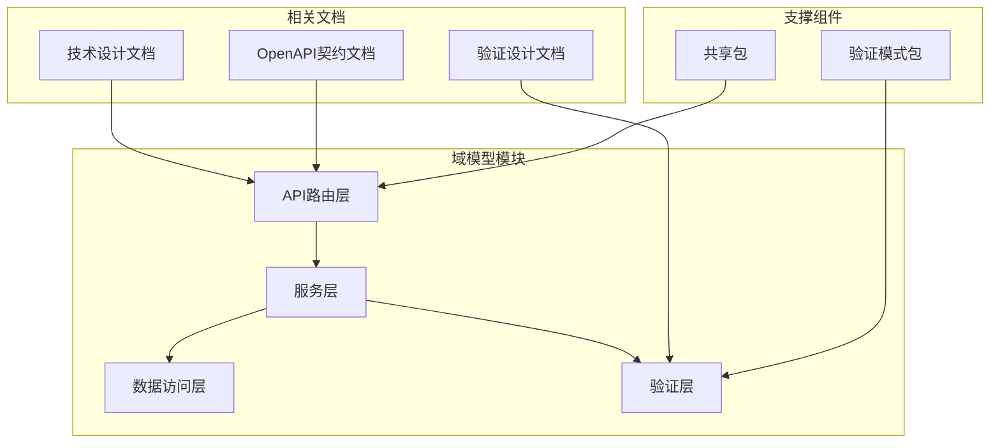
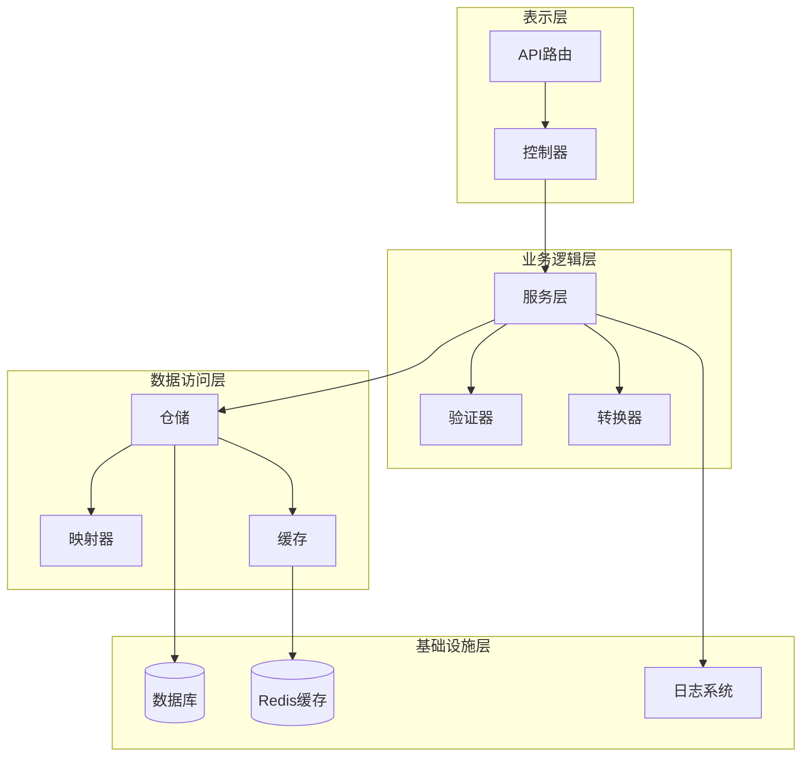
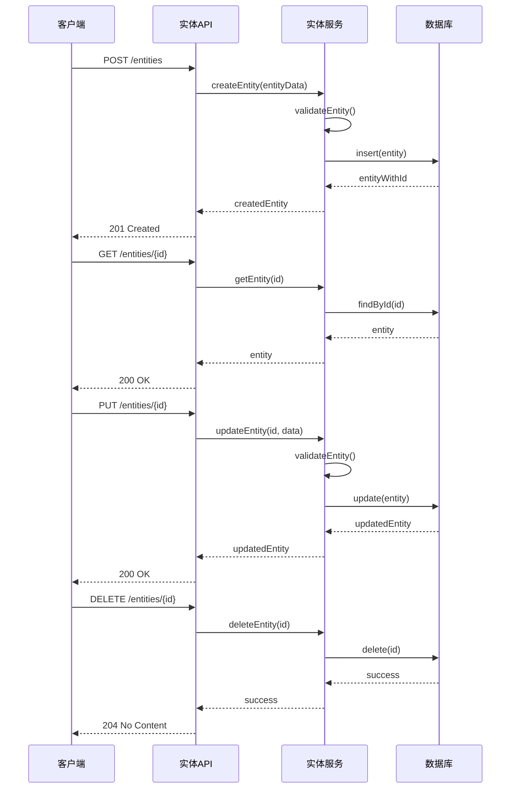
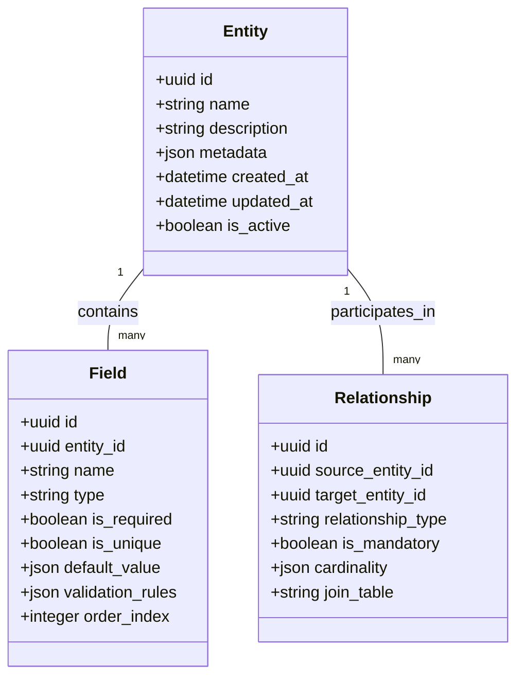
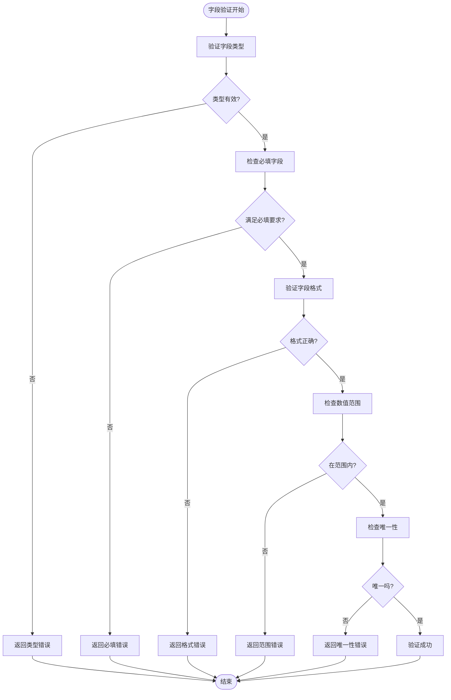
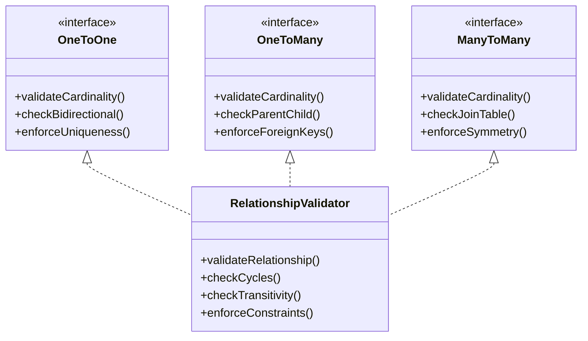
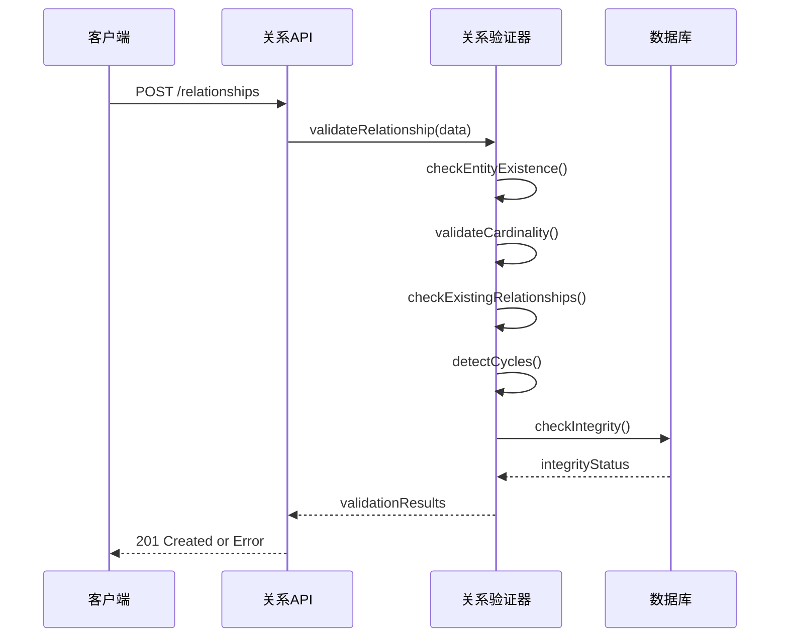
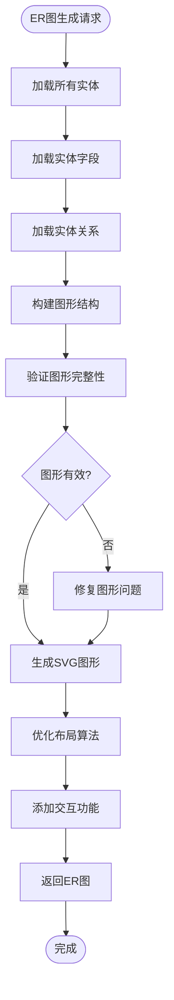
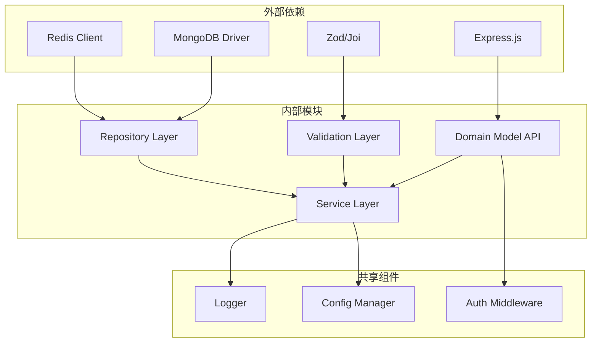

# 域模型路由

<cite>
**本文档引用的文件**
- [f-m2-01-api.md](file://docs/06-test-design/modules/domain-model/f-m2-01-entity/f-m2-01-api.md)
- [f-m2-02-api.md](file://docs/06-test-design/modules/domain-model/f-m2-02-field/f-m2-02-api.md)
- [f-m2-03-api.md](file://docs/06-test-design/modules/domain-model/f-m2-03-relation/f-m2-03-api.md)
- [f-m2-04-api.md](file://docs/06-test-design/modules/domain-model/f-m2-04-er-graph/f-m2-04-api.md)
- [domain-model-tech-design.md](file://docs/04-tech-design/domain-model-tech-design.md)
- [validation-design.md](file://docs/04-tech-design/validation-design.md)
- [phase1-design-tech.md](file://docs/04-tech-design/phase1-design-tech.md)
- [openapi-contract-design.md](file://docs/04-tech-design/openapi-contract-design.md)
- [semantic-layer-schema.md](file://docs/02-domain-model/semantic-layer-schema.md)
- [domain-model.md](file://docs/02-domain-model/domain-model.md)
</cite>

## 目录
1. [简介](#简介)
2. [项目结构](#项目结构)
3. [核心组件](#核心组件)
4. [架构概览](#架构概览)
5. [详细组件分析](#详细组件分析)
6. [依赖关系分析](#依赖关系分析)
7. [性能考虑](#性能考虑)
8. [故障排除指南](#故障排除指南)
9. [结论](#结论)

## 简介

域模型管理模块是AI原型管理系统的核心功能之一，负责管理业务领域的数据模型和实体关系。该模块提供了完整的API路由系统，支持实体定义、字段管理、关系建模等功能，并实现了ER图生成和数据模型验证的路由逻辑。

本模块采用分层架构设计，包含表示层（API路由）、业务逻辑层（服务层）和数据访问层，确保了良好的代码组织和可维护性。通过标准化的API接口，用户可以轻松地管理复杂的业务领域模型。

## 项目结构

域模型管理模块在项目中的组织结构如下：

**图表来源**
- [domain-model-tech-design.md](file://docs/04-tech-design/domain-model-tech-design.md)
- [validation-design.md](file://docs/04-tech-design/validation-design.md)

**章节来源**
- [domain-model-tech-design.md](file://docs/04-tech-design/domain-model-tech-design.md)
- [phase1-design-tech.md](file://docs/04-tech-design/phase1-design-tech.md)

## 核心组件

域模型管理模块的核心组件包括：

### 实体管理组件
- 负责实体的增删改查操作
- 支持实体元数据管理
- 提供实体状态跟踪

### 字段管理组件  
- 管理实体字段的定义和类型
- 支持字段属性配置
- 实现字段验证逻辑

### 关系管理组件
- 建立和维护实体间的关系
- 支持多种关系类型（一对一、一对多、多对多）
- 维护关系完整性约束

### ER图生成组件
- 自动生成实体关系图
- 支持图形化展示
- 提供交互式编辑功能

**章节来源**
- [f-m2-01-api.md](file://docs/06-test-design/modules/domain-model/f-m2-01-entity/f-m2-01-api.md)
- [f-m2-02-api.md](file://docs/06-test-design/modules/domain-model/f-m2-02-field/f-m2-02-api.md)
- [f-m2-03-api.md](file://docs/06-test-design/modules/domain-model/f-m2-03-relation/f-m2-03-api.md)
- [f-m2-04-api.md](file://docs/06-test-design/modules/domain-model/f-m2-04-er-graph/f-m2-04-api.md)

## 架构概览

域模型管理模块采用分层架构设计，确保关注点分离和代码复用：

**图表来源**
- [domain-model-tech-design.md](file://docs/04-tech-design/domain-model-tech-design.md)
- [openapi-contract-design.md](file://docs/04-tech-design/openapi-contract-design.md)

## 详细组件分析

### 实体管理路由

实体管理路由提供了完整的CRUD操作接口，支持实体的生命周期管理：

#### 核心路由定义

**图表来源**
- [f-m2-01-api.md](file://docs/06-test-design/modules/domain-model/f-m2-01-entity/f-m2-01-api.md)

#### 实体字段管理

实体字段管理支持动态字段定义和类型管理：

**图表来源**
- [f-m2-01-api.md](file://docs/06-test-design/modules/domain-model/f-m2-01-entity/f-m2-01-api.md)
- [f-m2-02-api.md](file://docs/06-test-design/modules/domain-model/f-m2-02-field/f-m2-02-api.md)

**章节来源**
- [f-m2-01-api.md](file://docs/06-test-design/modules/domain-model/f-m2-01-entity/f-m2-01-api.md)

### 字段管理路由

字段管理路由提供了灵活的字段定义和类型管理功能：

#### 字段类型支持

| 字段类型 | 描述 | 验证规则 | 使用场景 |
|---------|------|----------|----------|
| string | 文本字段 | 长度限制、格式验证 | 名称、描述、标签 |
| integer | 整数字段 | 数值范围、精度 | 计数器、序号 |
| float | 浮点数字段 | 数值范围、精度 | 价格、比例 |
| boolean | 布尔字段 | 布尔值验证 | 状态标志、开关 |
| datetime | 日期时间 | 时间范围、时区 | 创建时间、更新时间 |
| json | JSON对象 | 结构验证 | 复杂配置、元数据 |

#### 字段验证流程

**图表来源**
- [f-m2-02-api.md](file://docs/06-test-design/modules/domain-model/f-m2-02-field/f-m2-02-api.md)
- [validation-design.md](file://docs/04-tech-design/validation-design.md)

**章节来源**
- [f-m2-02-api.md](file://docs/06-test-design/modules/domain-model/f-m2-02-field/f-m2-02-api.md)
- [validation-design.md](file://docs/04-tech-design/validation-design.md)

### 关系管理路由

关系管理路由支持复杂实体关系的建模和维护：

#### 关系类型定义

**图表来源**
- [f-m2-03-api.md](file://docs/06-test-design/modules/domain-model/f-m2-03-relation/f-m2-03-api.md)

#### 关系完整性检查

**图表来源**
- [f-m2-03-api.md](file://docs/06-test-design/modules/domain-model/f-m2-03-relation/f-m2-03-api.md)

**章节来源**
- [f-m2-03-api.md](file://docs/06-test-design/modules/domain-model/f-m2-03-relation/f-m2-03-api.md)

### ER图生成路由

ER图生成路由提供了可视化实体关系展示功能：

#### ER图生成流程

**图表来源**
- [f-m2-04-api.md](file://docs/06-test-design/modules/domain-model/f-m2-04-er-graph/f-m2-04-api.md)

#### 图形渲染组件

ER图生成支持多种渲染选项：

| 渲染选项 | 功能描述 | 性能影响 |
|---------|----------|----------|
| SVG渲染 | 矢量图形，无损缩放 | 中等 |
| Canvas渲染 | 位图渲染，适合大量节点 | 高 |
| PDF导出 | 打印友好格式 | 低 |
| PNG导出 | 快速预览格式 | 低 |
| 交互式编辑 | 在线编辑实体关系 | 中等 |

**章节来源**
- [f-m2-04-api.md](file://docs/06-test-design/modules/domain-model/f-m2-04-er-graph/f-m2-04-api.md)

## 依赖关系分析

域模型管理模块的依赖关系体现了清晰的关注点分离：

**图表来源**
- [domain-model-tech-design.md](file://docs/04-tech-design/domain-model-tech-design.md)
- [openapi-contract-design.md](file://docs/04-tech-design/openapi-contract-design.md)

**章节来源**
- [domain-model-tech-design.md](file://docs/04-tech-design/domain-model-tech-design.md)
- [phase1-design-tech.md](file://docs/04-tech-design/phase1-design-tech.md)

## 性能考虑

域模型管理模块在设计时充分考虑了性能优化：

### 缓存策略
- 实体元数据缓存：减少数据库查询次数
- ER图结果缓存：避免重复计算
- 字段验证规则缓存：提升验证速度

### 查询优化
- 分页查询：支持大量实体的高效检索
- 索引优化：关键字段建立适当索引
- 连接查询优化：关系查询的性能调优

### 并发控制
- 乐观锁机制：防止并发修改冲突
- 请求限流：保护系统资源
- 异步处理：耗时操作异步执行

## 故障排除指南

### 常见错误及解决方案

| 错误类型 | 错误码 | 可能原因 | 解决方案 |
|---------|--------|----------|----------|
| 实体不存在 | 404 | ID错误或实体已删除 | 检查实体ID有效性 |
| 字段验证失败 | 400 | 字段类型或格式不正确 | 按验证规则修正字段 |
| 关系循环 | 400 | 建立循环依赖关系 | 检查实体关系设计 |
| 权限不足 | 403 | 用户权限不够 | 检查用户角色和权限 |
| 数据库连接失败 | 500 | 数据库服务异常 | 检查数据库连接配置 |

### 调试建议
- 启用详细日志记录
- 使用Postman进行API测试
- 检查数据库连接状态
- 验证用户认证信息

**章节来源**
- [f-m2-01-api.md](file://docs/06-test-design/modules/domain-model/f-m2-01-entity/f-m2-01-api.md)
- [f-m2-02-api.md](file://docs/06-test-design/modules/domain-model/f-m2-02-field/f-m2-02-api.md)
- [f-m2-03-api.md](file://docs/06-test-design/modules/domain-model/f-m2-03-relation/f-m2-03-api.md)
- [f-m2-04-api.md](file://docs/06-test-design/modules/domain-model/f-m2-04-er-graph/f-m2-04-api.md)

## 结论

域模型管理模块通过其完善的API路由系统，为AI原型管理系统提供了强大的数据建模能力。模块采用分层架构设计，确保了良好的可维护性和扩展性。

该模块的主要优势包括：
- 完整的CRUD操作支持
- 灵活的字段类型管理
- 强大的关系建模能力
- 可视化的ER图生成功能
- 严格的数据验证机制
- 高性能的缓存和查询优化

通过标准化的API接口和完善的错误处理机制，该模块能够满足复杂业务场景下的数据建模需求，为系统的稳定运行提供了坚实基础。