# 应用管理路由

<cite>
**本文档引用的文件**
- [packages/api/src/routes/applications.ts](file://packages/api/src/routes/applications.ts)
- [packages/api/src/services/application.service.ts](file://packages/api/src/services/application.service.ts)
- [packages/api/src/routes/application-behavior.ts](file://packages/api/src/routes/application-behavior.ts)
- [packages/api/src/services/application-behavior.service.ts](file://packages/api/src/services/application-behavior.service.ts)
- [packages/validation-schemas/src/application.schema.ts](file://packages/validation-schemas/src/application.schema.ts)
- [packages/validation-schemas/src/application-behavior.schema.ts](file://packages/validation-schemas/src/application-behavior.schema.ts)
- [packages/validation-schemas/src/base.ts](file://packages/validation-schemas/src/base.ts)
- [packages/validation-schemas/src/response.ts](file://packages/validation-schemas/src/response.ts)
- [packages/api/src/models/schema.ts](file://packages/api/src/models/schema.ts)
- [packages/api/src/db.ts](file://packages/api/src/db.ts)
- [packages/api/src/app.ts](file://packages/api/src/app.ts)
</cite>

## 目录
1. [简介](#简介)
2. [项目结构](#项目结构)
3. [核心组件](#核心组件)
4. [架构概览](#架构概览)
5. [详细组件分析](#详细组件分析)
6. [依赖关系分析](#依赖关系分析)
7. [性能考虑](#性能考虑)
8. [故障排除指南](#故障排除指南)
9. [结论](#结论)

## 简介

本文档详细介绍了应用管理模块的API路由实现，涵盖页面布局管理、区域定义、组件配置等路由的完整实现。该模块实现了完整的应用生命周期管理，包括应用CRUD操作、应用行为管理（动作和决策）、以及复杂的数据验证和状态管理机制。

应用管理模块基于Fastify框架构建，采用分层架构设计，包括路由层、服务层和数据访问层。所有API端点都配备了完整的OpenAPI文档生成和请求验证机制，确保了API的一致性和可靠性。

## 项目结构

应用管理模块位于`packages/api`目录下，采用清晰的分层组织结构：

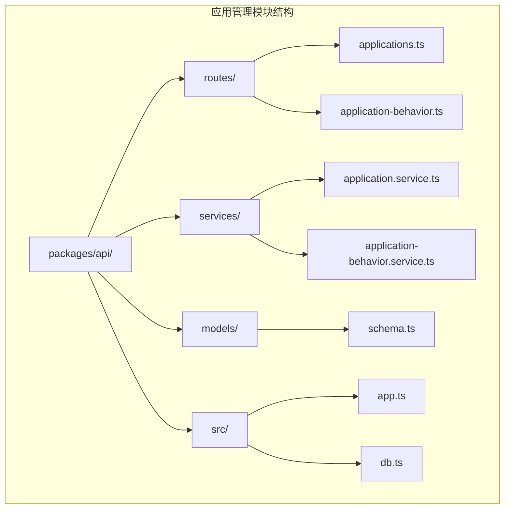

**图表来源**
- [packages/api/src/routes/applications.ts:1-211](file://packages/api/src/routes/applications.ts#L1-L211)
- [packages/api/src/routes/application-behavior.ts:1-223](file://packages/api/src/routes/application-behavior.ts#L1-L223)

**章节来源**
- [packages/api/src/routes/applications.ts:1-211](file://packages/api/src/routes/applications.ts#L1-L211)
- [packages/api/src/routes/application-behavior.ts:1-223](file://packages/api/src/routes/application-behavior.ts#L1-L223)

## 核心组件

### 应用管理路由层

应用管理路由层提供了完整的CRUD操作接口，所有端点都遵循RESTful设计原则，并集成了OpenAPI文档生成和请求验证。

#### 主要路由端点

| HTTP方法 | 路径 | 功能描述 | 验证模式 |
|---------|------|----------|----------|
| GET | `/api/v1/projects/:projectId/applications` | 查询应用列表 | ApplicationListQuery |
| POST | `/api/v1/projects/:projectId/applications` | 创建应用 | CreateApplicationInput |
| GET | `/api/v1/projects/:projectId/applications/:id` | 获取应用详情 | IdSchema |
| PUT | `/api/v1/projects/:projectId/applications/:id` | 更新应用 | UpdateApplicationInput |
| DELETE | `/api/v1/projects/:projectId/applications/:id` | 删除应用 | IdSchema |

#### 应用行为路由层

应用行为管理路由层专注于动作和决策的CRUD操作，提供了复杂的行为配置能力：

| HTTP方法 | 路径 | 功能描述 | 验证模式 |
|---------|------|----------|----------|
| GET | `/api/v1/projects/:projectId/applications/:appId/actions` | 查询动作列表 | AppIdParam |
| POST | `/api/v1/projects/:projectId/applications/:appId/actions` | 创建动作 | CreateAppActionInput |
| PUT | `/api/v1/projects/:projectId/applications/:appId/actions/:actionId` | 更新动作 | UpdateAppActionInput |
| DELETE | `/api/v1/projects/:projectId/applications/:appId/actions/:actionId` | 删除动作 | ActionIdParam |
| GET | `/api/v1/projects/:projectId/applications/:appId/decisions` | 查询决策列表 | AppIdParam |
| POST | `/api/v1/projects/:projectId/applications/:appId/decisions` | 创建决策 | CreateDecisionInput |
| PUT | `/api/v1/projects/:projectId/applications/:appId/decisions/:decisionId` | 更新决策 | UpdateDecisionInput |
| DELETE | `/api/v1/projects/:projectId/applications/:appId/decisions/:decisionId` | 删除决策 | DecisionIdParam |

**章节来源**
- [packages/api/src/routes/applications.ts:36-114](file://packages/api/src/routes/applications.ts#L36-L114)
- [packages/api/src/routes/application-behavior.ts:37-149](file://packages/api/src/routes/application-behavior.ts#L37-L149)

## 架构概览

应用管理模块采用了经典的三层架构模式，确保了关注点分离和代码的可维护性：

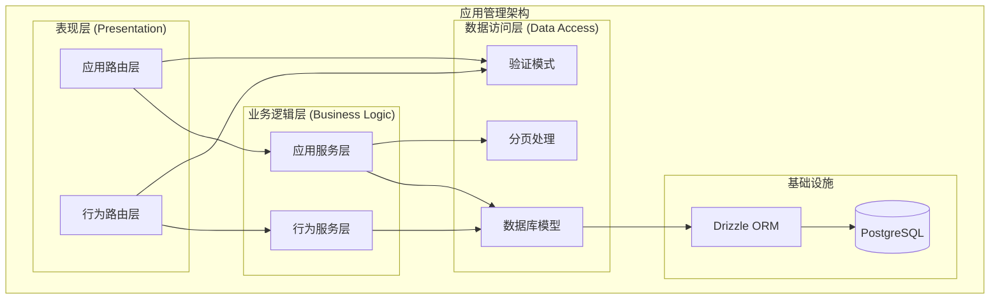

**图表来源**
- [packages/api/src/routes/applications.ts:1-211](file://packages/api/src/routes/applications.ts#L1-L211)
- [packages/api/src/services/application.service.ts:1-438](file://packages/api/src/services/application.service.ts#L1-L438)
- [packages/api/src/routes/application-behavior.ts:1-223](file://packages/api/src/routes/application-behavior.ts#L1-L223)
- [packages/api/src/services/application-behavior.service.ts:1-463](file://packages/api/src/services/application-behavior.service.ts#L1-L463)

### 状态管理模式

应用管理模块实现了两种不同的状态管理模式：

#### 应用实体状态管理
应用服务层采用传统的数据库状态管理模式，所有操作都是直接的CRUD操作：

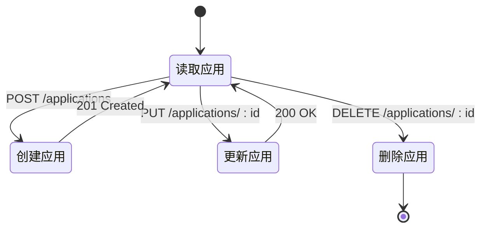

#### 应用行为状态管理
应用行为服务层实现了复杂的JSONB数组状态管理，采用乐观锁机制：

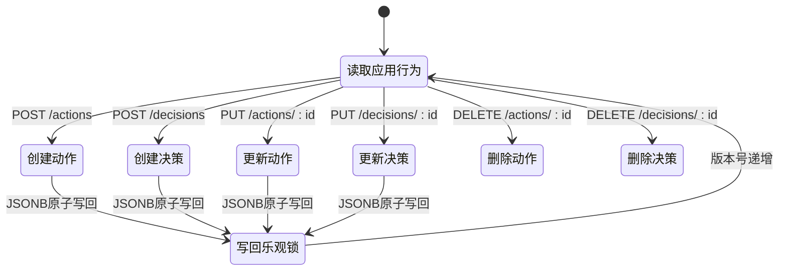

**图表来源**
- [packages/api/src/services/application-behavior.service.ts:58-93](file://packages/api/src/services/application-behavior.service.ts#L58-L93)

**章节来源**
- [packages/api/src/services/application.service.ts:1-438](file://packages/api/src/services/application.service.ts#L1-L438)
- [packages/api/src/services/application-behavior.service.ts:1-463](file://packages/api/src/services/application-behavior.service.ts#L1-L463)

## 详细组件分析

### 应用CRUD操作组件

应用CRUD操作组件提供了完整的应用生命周期管理功能，包括创建、查询、更新和删除操作。

#### 应用列表查询

应用列表查询功能支持多种筛选和排序选项：

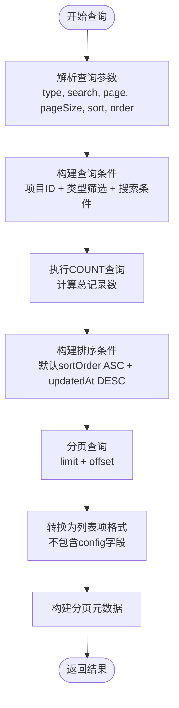

**图表来源**
- [packages/api/src/services/application.service.ts:169-215](file://packages/api/src/services/application.service.ts#L169-L215)

#### 应用创建流程

应用创建流程包含了完整的数据验证和业务规则检查：

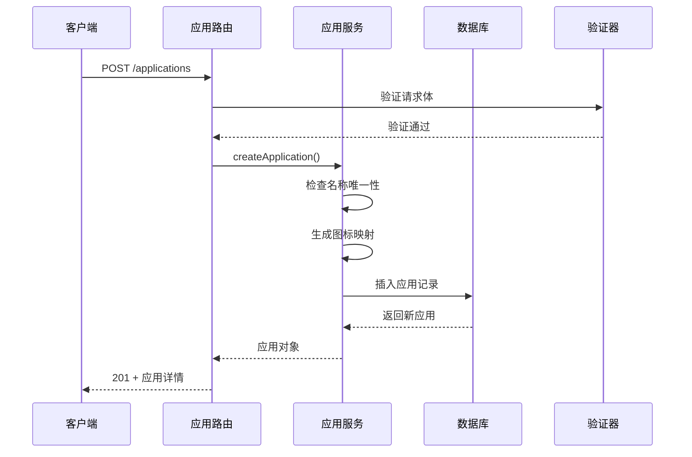

**图表来源**
- [packages/api/src/routes/applications.ts:149-171](file://packages/api/src/routes/applications.ts#L149-L171)
- [packages/api/src/services/application.service.ts:255-289](file://packages/api/src/services/application.service.ts#L255-L289)

#### 应用更新流程

应用更新流程实现了智能的字段更新和冲突检测：

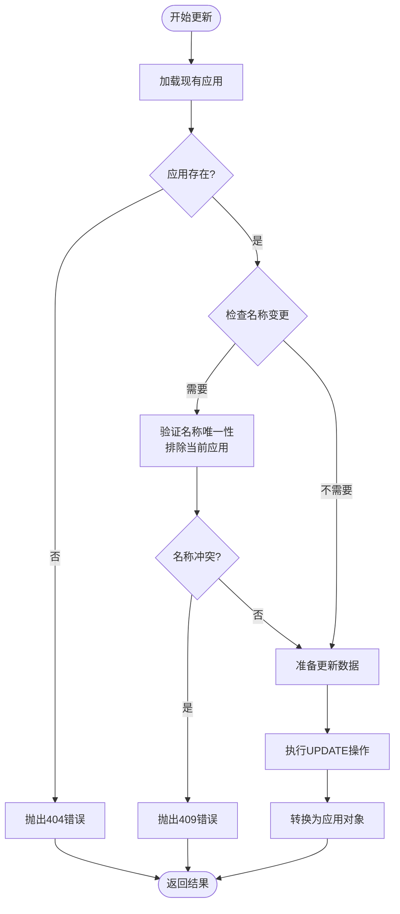

**图表来源**
- [packages/api/src/services/application.service.ts:305-368](file://packages/api/src/services/application.service.ts#L305-L368)

**章节来源**
- [packages/api/src/routes/applications.ts:121-210](file://packages/api/src/routes/applications.ts#L121-L210)
- [packages/api/src/services/application.service.ts:169-419](file://packages/api/src/services/application.service.ts#L169-L419)

### 应用行为管理组件

应用行为管理组件提供了复杂的行为配置能力，支持动作和决策的完整生命周期管理。

#### 动作管理组件

动作管理组件实现了复杂的行为定义和验证机制：

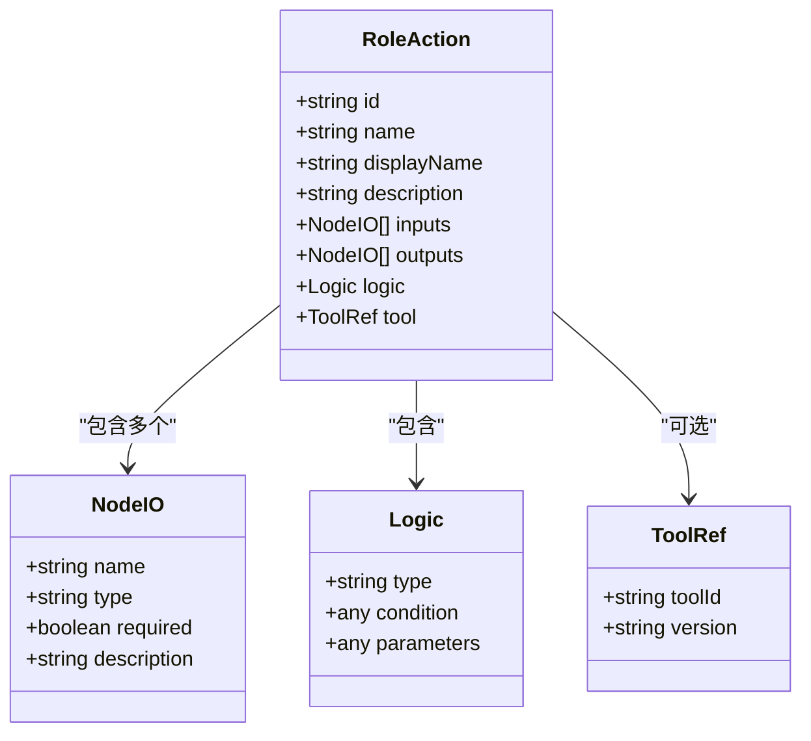

**图表来源**
- [packages/validation-schemas/src/application-behavior.schema.ts](file://packages/validation-schemas/src/application-behavior.schema.ts)

#### 决策管理组件

决策管理组件提供了分支决策的完整配置能力：

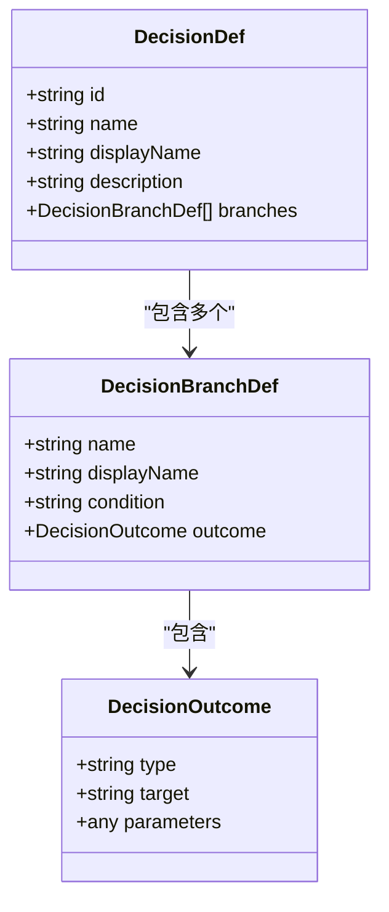

**图表来源**
- [packages/validation-schemas/src/application-behavior.schema.ts](file://packages/validation-schemas/src/application-behavior.schema.ts)

#### 乐观锁机制

应用行为管理实现了基于版本号的乐观锁机制：

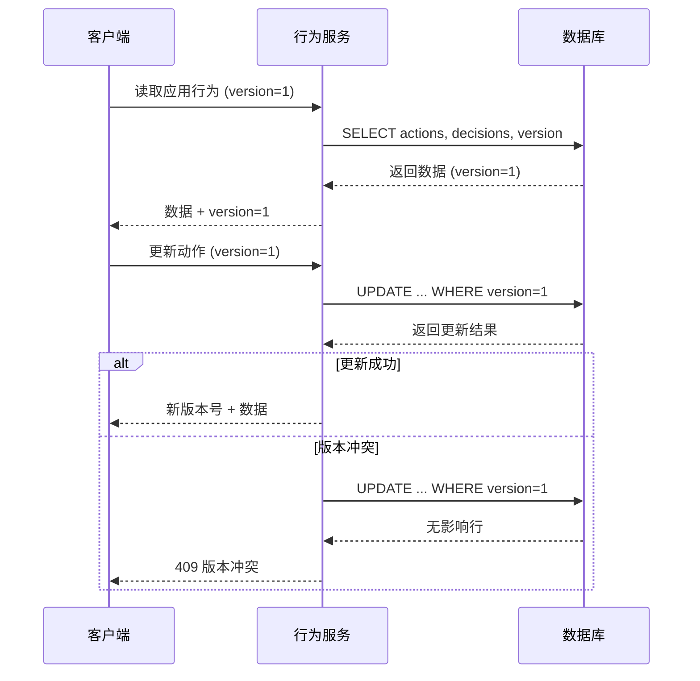

**图表来源**
- [packages/api/src/services/application-behavior.service.ts:62-93](file://packages/api/src/services/application-behavior.service.ts#L62-L93)

**章节来源**
- [packages/api/src/routes/application-behavior.ts:156-222](file://packages/api/src/routes/application-behavior.ts#L156-L222)
- [packages/api/src/services/application-behavior.service.ts:128-462](file://packages/api/src/services/application-behavior.service.ts#L128-L462)

### 数据验证和API设计

应用管理模块采用了严格的API设计原则和数据验证机制。

#### 验证模式设计

验证模式采用了TypeBox库实现的Schema验证：

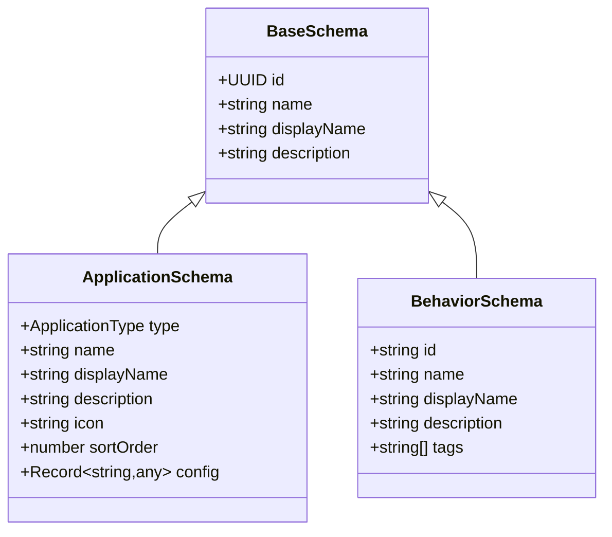

**图表来源**
- [packages/validation-schemas/src/application.schema.ts](file://packages/validation-schemas/src/application.schema.ts)
- [packages/validation-schemas/src/application-behavior.schema.ts](file://packages/validation-schemas/src/application-behavior.schema.ts)

#### 错误处理机制

应用管理模块实现了统一的错误处理机制：

| 错误类型 | HTTP状态码 | 用途 | 示例场景 |
|---------|------------|------|----------|
| notFound | 404 | 资源不存在 | 应用ID无效、动作不存在 |
| badRequest | 400 | 请求参数错误 | 验证失败、格式错误 |
| conflict | 409 | 资源冲突 | 名称重复、版本冲突、引用约束 |
| internalError | 500 | 服务器内部错误 | 数据库连接失败、未知异常 |

**章节来源**
- [packages/api/src/services/common/errors.ts](file://packages/api/src/services/common/errors.ts)
- [packages/api/src/services/common/pagination.ts](file://packages/api/src/services/common/pagination.ts)

## 依赖关系分析

应用管理模块的依赖关系清晰明确，遵循了依赖倒置原则：

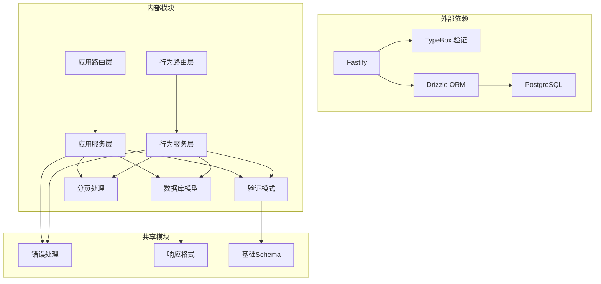

**图表来源**
- [packages/api/src/app.ts](file://packages/api/src/app.ts)
- [packages/api/src/db.ts](file://packages/api/src/db.ts)

### 组件耦合度分析

应用管理模块实现了良好的内聚性和低耦合性：

- **路由层**：只负责HTTP请求处理和响应格式化
- **服务层**：封装业务逻辑和数据验证
- **模型层**：定义数据结构和数据库映射
- **验证层**：提供统一的数据验证机制

这种分层设计确保了每个组件都有明确的职责边界，便于测试和维护。

**章节来源**
- [packages/api/src/models/schema.ts](file://packages/api/src/models/schema.ts)
- [packages/api/src/services/application.service.ts:1-31](file://packages/api/src/services/application.service.ts#L1-L31)

## 性能考虑

应用管理模块在设计时充分考虑了性能优化：

### 查询优化策略

1. **索引优化**：对常用查询字段建立适当的数据库索引
2. **分页处理**：实现高效的分页查询机制
3. **条件过滤**：支持多维度的查询条件组合
4. **排序优化**：针对常用排序字段进行优化

### 缓存策略

虽然当前实现主要依赖数据库查询，但可以考虑以下缓存策略：

- **应用列表缓存**：对频繁访问的应用列表进行缓存
- **行为数据缓存**：对静态的行为配置数据进行缓存
- **配置数据缓存**：对应用配置进行短期缓存

### 并发控制

应用行为管理实现了完善的并发控制机制：

- **乐观锁**：防止并发更新导致的数据冲突
- **事务处理**：确保数据一致性
- **引用完整性检查**：防止删除操作破坏数据完整性

## 故障排除指南

### 常见问题及解决方案

#### 应用创建失败

**问题现象**：创建应用时报409冲突错误

**可能原因**：
1. 应用名称在项目范围内重复
2. 数据库连接异常
3. 权限不足

**解决步骤**：
1. 检查应用名称是否唯一
2. 验证数据库连接状态
3. 确认用户权限

#### 应用更新冲突

**问题现象**：更新应用时报409版本冲突

**可能原因**：
1. 多个用户同时修改同一应用
2. 客户端版本号过期

**解决步骤**：
1. 重新获取最新版本数据
2. 重新发起更新请求
3. 实现自动重试机制

#### 行为操作失败

**问题现象**：创建或更新行为时报错

**可能原因**：
1. JSONB数据格式错误
2. 验证规则不满足
3. 项目状态为归档

**解决步骤**：
1. 检查行为定义的JSON格式
2. 验证所有必填字段
3. 确认项目状态为活跃

**章节来源**
- [packages/api/src/services/common/errors.ts](file://packages/api/src/services/common/errors.ts)

## 结论

应用管理模块实现了完整的应用生命周期管理功能，具有以下特点：

### 技术优势

1. **架构清晰**：采用分层架构设计，职责分离明确
2. **验证完善**：集成OpenAPI文档生成和严格的数据验证
3. **状态管理**：实现了传统数据库状态管理和JSONB数组状态管理两种模式
4. **并发安全**：应用行为管理实现了乐观锁机制
5. **错误处理**：提供了统一的错误处理和响应格式

### 业务价值

1. **功能完整**：覆盖了应用管理的所有核心业务场景
2. **扩展性强**：模块化设计便于功能扩展
3. **维护友好**：清晰的代码结构和完善的文档
4. **性能可靠**：优化的查询和并发控制机制

### 改进建议

1. **监控增强**：添加详细的API调用监控和性能指标
2. **缓存优化**：实现多级缓存策略提升性能
3. **异步处理**：对耗时操作实现异步处理机制
4. **测试覆盖**：增加更多的单元测试和集成测试

该模块为整个应用管理系统奠定了坚实的基础，为后续的功能扩展和性能优化提供了良好的技术支撑。