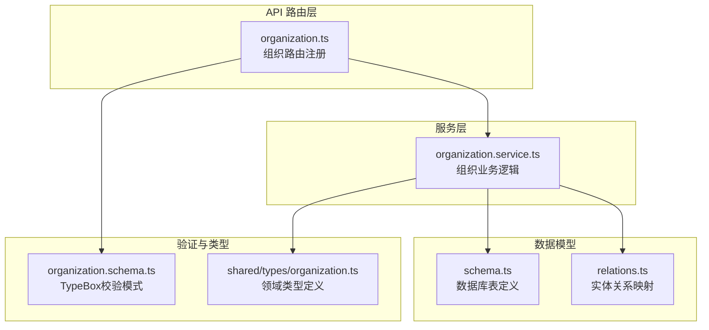
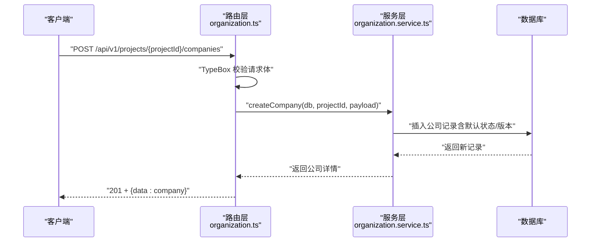
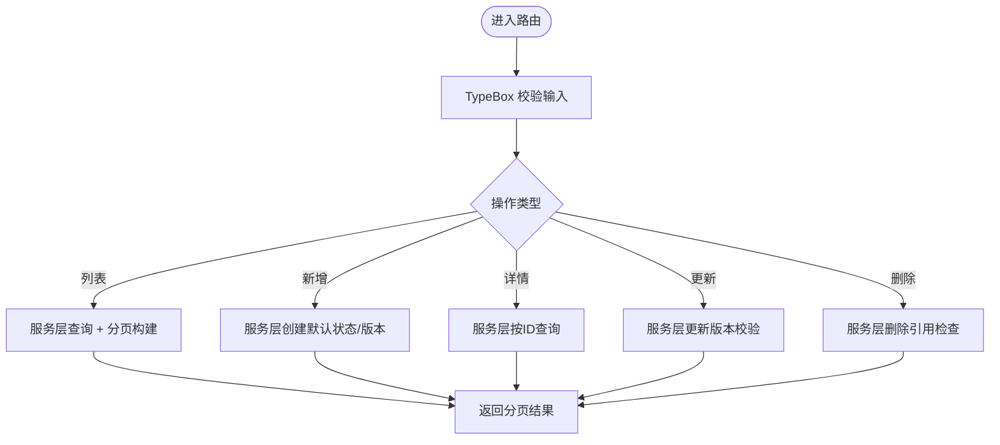
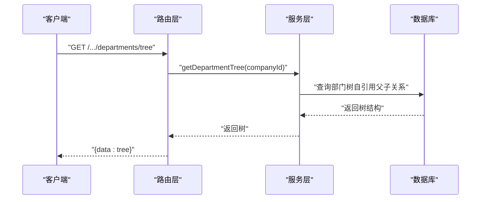
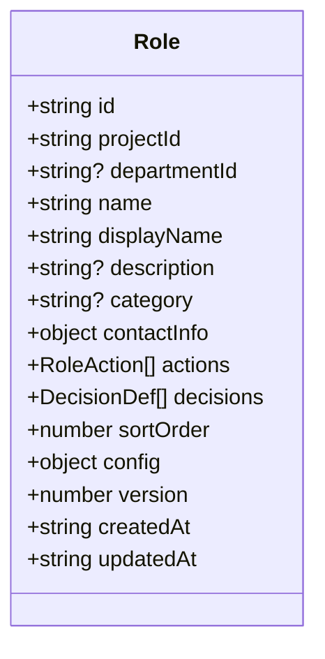
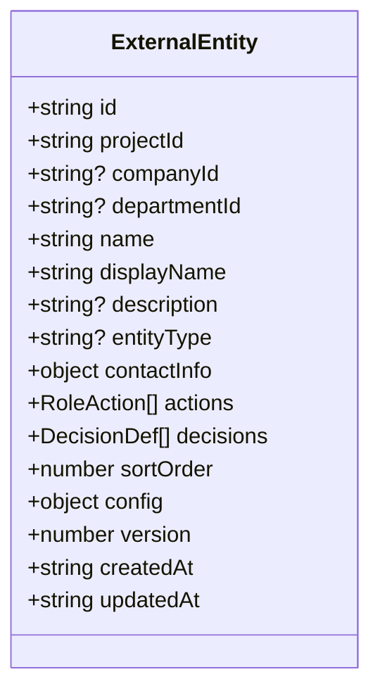
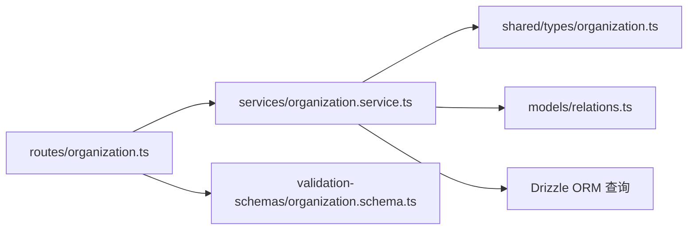

# 组织架构路由

<cite>
**本文档引用的文件**
- [organization.ts](file://packages/api/src/routes/organization.ts)
- [organization.service.ts](file://packages/api/src/services/organization.service.ts)
- [organization.schema.ts](file://packages/validation-schemas/src/organization.schema.ts)
- [organization.ts](file://packages/shared/src/types/organization.ts)
- [relations.ts](file://packages/api/src/models/relations.ts)
- [f-m1-06-company-implementation.md](file://docs/superpowers/plans/2026-05-21-f-m1-06-company.md)
- [domain-model.md](file://docs/02-domain-model/domain-model.md)
- [f-m1-06-api.md](file://docs/06-test-design/modules/f-m1-06-company/f-m1-06-api.md)
- [f-m1-07-api.md](file://docs/06-test-design/modules/f-m1-07-department/f-m1-07-api.md)
- [f-m1-08-api.md](file://docs/06-test-design/modules/f-m1-08-role/f-m1-08-api.md)
- [f-m1-09-api.md](file://docs/06-test-design/modules/f-m1-09-external-entity/f-m1-09-api.md)
</cite>

## 目录
1. [简介](#简介)
2. [项目结构](#项目结构)
3. [核心组件](#核心组件)
4. [架构总览](#架构总览)
5. [详细组件分析](#详细组件分析)
6. [依赖关系分析](#依赖关系分析)
7. [性能考虑](#性能考虑)
8. [故障排除指南](#故障排除指南)
9. [结论](#结论)
10. [附录](#附录)

## 简介
本文件面向组织架构管理模块的API路由，系统性梳理公司、部门、角色、外部实体等组织元素的路由实现与业务逻辑。重点覆盖：
- 路由层次结构与路径约定
- CRUD操作的完整API设计与参数约束
- 层级结构管理（部门树）、权限分配与角色行为配置
- 服务层业务逻辑与数据关系处理
- 权限控制与安全验证机制

该模块采用Fastify插件形式注册，统一前缀/api/v1/projects/:projectId，并通过TypeBox进行请求校验与OpenAPI文档生成。

## 项目结构
组织架构路由位于API包内，围绕四个核心实体展开：
- 公司（F-M1-06）：项目维度的组织主体
- 部门（F-M1-07）：公司维度的多级树形结构
- 角色（F-M1-08）：可挂载到部门或独立存在的职责单元
- 外部实体（F-M1-09）：与被建模产品交互的外部方

图表来源
- [organization.ts:1-242](file://packages/api/src/routes/organization.ts#L1-L242)
- [organization.service.ts:1-53](file://packages/api/src/services/organization.service.ts#L1-L53)
- [relations.ts:191-225](file://packages/api/src/models/relations.ts#L191-L225)
- [organization.schema.ts:1-50](file://packages/validation-schemas/src/organization.schema.ts#L1-L50)
- [organization.ts:1-77](file://packages/shared/src/types/organization.ts#L1-L77)

章节来源
- [organization.ts:1-242](file://packages/api/src/routes/organization.ts#L1-L242)
- [organization.service.ts:1-53](file://packages/api/src/services/organization.service.ts#L1-L53)

## 核心组件
- 路由注册器：负责按项目维度注册公司、部门、角色、外部实体的CRUD路由，并提供单资源公司路由（无需项目ID）。
- 路由处理器：从请求中提取路径参数与查询参数，调用服务层执行业务逻辑，返回标准化响应。
- 服务层：封装数据库操作、项目状态校验、分页构建、错误处理等通用逻辑。
- 验证层：基于TypeBox的输入/输出Schema，确保请求参数与响应格式符合PRD规范。
- 类型层：共享的领域类型定义，保证前后端一致性。

章节来源
- [organization.ts:248-397](file://packages/api/src/routes/organization.ts#L248-L397)
- [organization.service.ts:49-53](file://packages/api/src/services/organization.service.ts#L49-L53)
- [organization.schema.ts:1-50](file://packages/validation-schemas/src/organization.schema.ts#L1-L50)
- [organization.ts:1-77](file://packages/shared/src/types/organization.ts#L1-L77)

## 架构总览
组织架构路由遵循清晰的分层架构：
- 路由层：定义HTTP接口、参数校验与OpenAPI元数据
- 服务层：执行业务规则（如项目状态校验、乐观锁版本控制）
- 数据访问层：使用Drizzle ORM进行查询与更新
- 类型与验证：统一约束命名、排序、版本等全局规则

图表来源
- [organization.ts:254-260](file://packages/api/src/routes/organization.ts#L254-L260)
- [organization.service.ts:1-53](file://packages/api/src/services/organization.service.ts#L1-L53)

## 详细组件分析

### 公司路由（F-M1-06）
- 路由前缀：/api/v1/projects/:projectId/companies
- 支持操作：
  - 列表：GET /projects/:projectId/companies（支持分页与搜索）
  - 新增：POST /projects/:projectId/companies（校验名称/显示名/描述）
  - 详情：GET /companies/:id（单资源路由，无需项目ID）
  - 更新：PUT /companies/:id（支持名称/显示名/描述/版本）
  - 删除：DELETE /companies/:id（删除前进行引用检查）

图表来源
- [organization.ts:248-279](file://packages/api/src/routes/organization.ts#L248-L279)
- [organization.service.ts:1-53](file://packages/api/src/services/organization.service.ts#L1-L53)

章节来源
- [organization.ts:248-279](file://packages/api/src/routes/organization.ts#L248-L279)
- [organization.schema.ts:29-44](file://packages/validation-schemas/src/organization.schema.ts#L29-L44)
- [organization.ts:9-25](file://packages/shared/src/types/organization.ts#L9-L25)
- [f-m1-06-company-implementation.md:13-41](file://docs/superpowers/plans/2026-05-21-f-m1-06-company.md#L13-L41)

### 部门路由（F-M1-07）
- 路由前缀：/api/v1/projects/:projectId/companies/:companyId/departments
- 支持操作：
  - 列表：GET /projects/:projectId/companies/:companyId/departments
  - 树形：GET /projects/:projectId/companies/:companyId/departments/tree（返回层级树）
  - 新增：POST /projects/:projectId/companies/:companyId/departments
  - 详情：GET /projects/:projectId/companies/:companyId/departments/:id
  - 更新：PUT /projects/:projectId/companies/:companyId/departments/:id
  - 删除：DELETE /projects/:projectId/companies/:companyId/departments/:id

图表来源
- [organization.ts:287-291](file://packages/api/src/routes/organization.ts#L287-L291)
- [relations.ts:191-211](file://packages/api/src/models/relations.ts#L191-L211)

章节来源
- [organization.ts:281-298](file://packages/api/src/routes/organization.ts#L281-L298)
- [organization.schema.ts:1-50](file://packages/validation-schemas/src/organization.schema.ts#L1-L50)
- [organization.ts:27-40](file://packages/shared/src/types/organization.ts#L27-L40)
- [domain-model.md:107-127](file://docs/02-domain-model/domain-model.md#L107-L127)

### 角色路由（F-M1-08）
- 路由前缀：/api/v1/projects/:projectId/departments/:companyId/roles
- 支持操作：
  - 列表：GET /projects/:projectId/departments/:companyId/roles
  - 新增：POST /projects/:projectId/departments/:companyId/roles（包含actions与decisions）
  - 详情：GET /projects/:projectId/departments/:companyId/roles/:id
  - 更新：PUT /projects/:projectId/departments/:companyId/roles/:id
  - 删除：DELETE /projects/:projectId/departments/:companyId/roles/:id

图表来源
- [organization.ts:42-58](file://packages/shared/src/types/organization.ts#L42-L58)
- [organization.ts:321-349](file://packages/api/src/routes/organization.ts#L321-L349)

章节来源
- [organization.ts:321-349](file://packages/api/src/routes/organization.ts#L321-L349)
- [organization.schema.ts:1-50](file://packages/validation-schemas/src/organization.schema.ts#L1-L50)
- [organization.ts:42-58](file://packages/shared/src/types/organization.ts#L42-L58)

### 外部实体路由（F-M1-09）
- 路由前缀：/api/v1/projects/:projectId/external-entities
- 支持操作：
  - 列表：GET /projects/:projectId/external-entities
  - 新增：POST /projects/:projectId/external-entities（包含actions与decisions）
  - 详情：GET /projects/:projectId/external-entities/:id
  - 更新：PUT /projects/:projectId/external-entities/:id
  - 删除：DELETE /projects/:projectId/external-entities/:id

图表来源
- [organization.ts:60-77](file://packages/shared/src/types/organization.ts#L60-L77)
- [organization.ts:351-381](file://packages/api/src/routes/organization.ts#L351-L381)

章节来源
- [organization.ts:351-381](file://packages/api/src/routes/organization.ts#L351-L381)
- [organization.schema.ts:1-50](file://packages/validation-schemas/src/organization.schema.ts#L1-L50)
- [organization.ts:60-77](file://packages/shared/src/types/organization.ts#L60-L77)

### 单资源公司路由（无需项目ID）
- 路由前缀：/api/v1/companies/:id
- 支持操作：GET /companies/:id（查询公司详情）

章节来源
- [organization.ts:389-397](file://packages/api/src/routes/organization.ts#L389-L397)

## 依赖关系分析
组织架构模块的关键依赖关系如下：

图表来源
- [organization.ts:1-40](file://packages/api/src/routes/organization.ts#L1-L40)
- [organization.service.ts:1-53](file://packages/api/src/services/organization.service.ts#L1-L53)
- [organization.schema.ts:1-50](file://packages/validation-schemas/src/organization.schema.ts#L1-L50)
- [organization.ts:1-77](file://packages/shared/src/types/organization.ts#L1-L77)
- [relations.ts:191-225](file://packages/api/src/models/relations.ts#L191-L225)

章节来源
- [organization.ts:1-40](file://packages/api/src/routes/organization.ts#L1-L40)
- [organization.service.ts:1-53](file://packages/api/src/services/organization.service.ts#L1-L53)

## 性能考虑
- 分页与搜索：列表接口统一使用分页查询，建议结合索引优化搜索条件字段。
- 树形查询：部门树查询涉及自引用关系，建议在parentId与id上建立索引以提升递归查询性能。
- 版本控制：公司、角色、外部实体均支持版本字段，用于乐观锁控制，减少并发冲突带来的回滚成本。
- 项目状态校验：所有写操作均需校验项目处于活动状态，避免对归档项目进行变更。

## 故障排除指南
- 400 错误：请求参数不符合TypeBox校验规则（如名称格式、显示名长度、分页参数范围）。
- 404 错误：资源不存在（如公司/部门/角色/外部实体ID无效）。
- 409 冲突：写操作违反业务约束（如删除前引用检查失败）。
- 423 锁定：项目状态非活动导致写操作被拒绝。
- 500 错误：数据库异常或服务内部错误。

章节来源
- [organization.ts:234-241](file://packages/api/src/routes/organization.ts#L234-L241)
- [organization.service.ts:49-53](file://packages/api/src/services/organization.service.ts#L49-L53)

## 结论
组织架构路由模块通过清晰的分层设计与严格的参数校验，实现了公司、部门、角色、外部实体的完整CRUD能力。其核心优势包括：
- 统一的路由前缀与参数命名规范
- 严谨的TypeBox校验与OpenAPI文档生成
- 服务层的项目状态校验与版本控制
- 面向多级树结构的部门层级管理
- 与角色行为配置的无缝集成

## 附录
- 完整API示例与测试用例参考：
  - [公司API测试](file://docs/06-test-design/modules/f-m1-06-company/f-m1-06-api.md)
  - [部门API测试](file://docs/06-test-design/modules/f-m1-07-department/f-m1-07-api.md)
  - [角色API测试](file://docs/06-test-design/modules/f-m1-08-role/f-m1-08-api.md)
  - [外部实体API测试](file://docs/06-test-design/modules/f-m1-09-external-entity/f-m1-09-api.md)