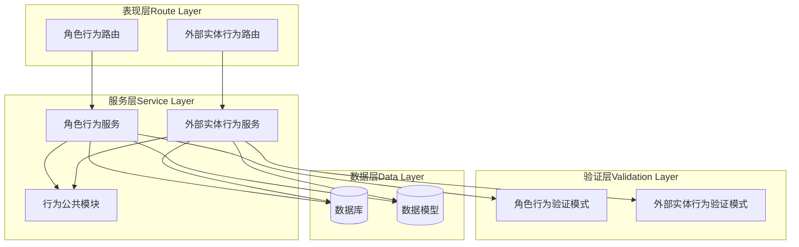
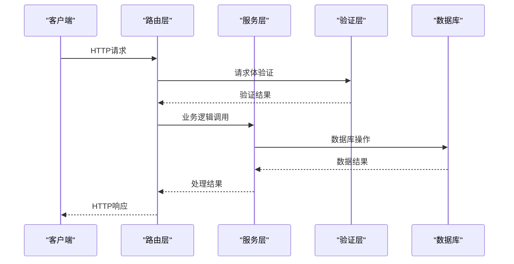
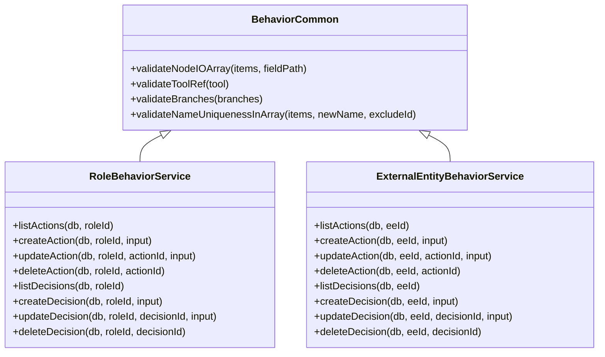
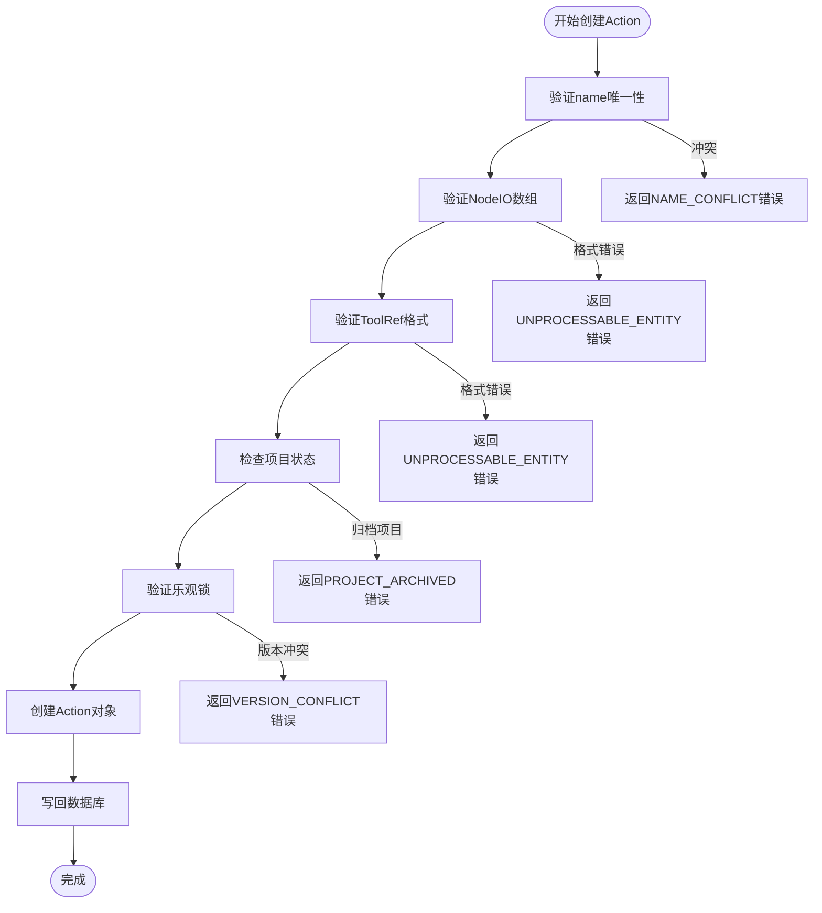
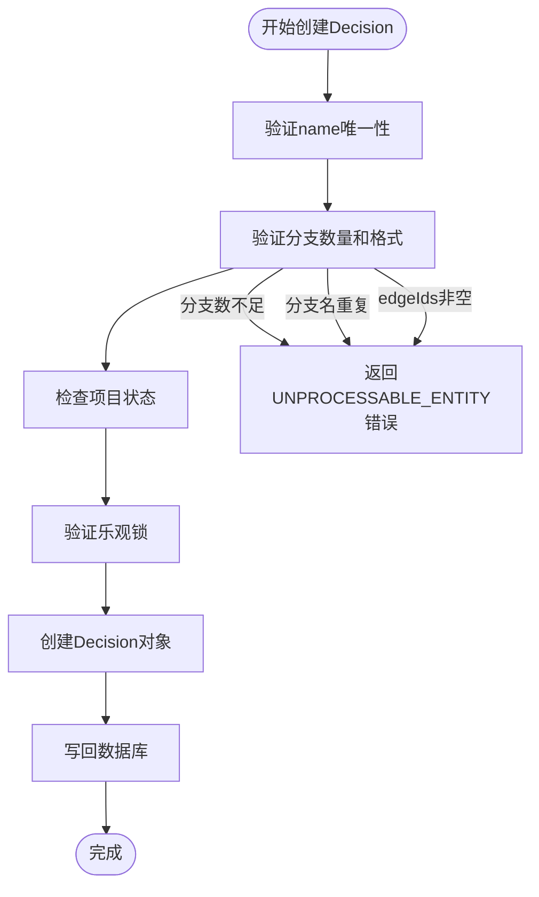
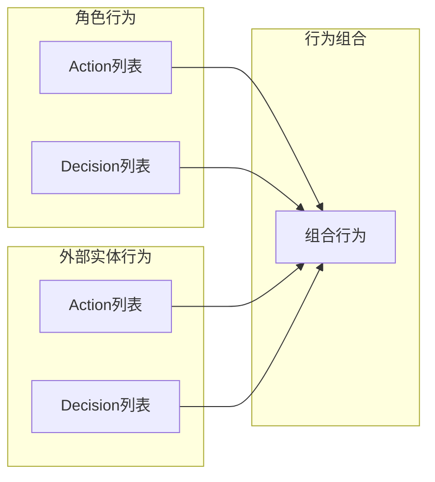

# 行为配置路由

<cite>
**本文档引用的文件**
- [f-m1-12-api.md](file://docs/06-test-design/modules/project-management/f-m1-12-role-behavior/f-m1-12-api.md)
- [f-m1-13-api.md](file://docs/06-test-design/modules/project-management/f-m1-13-external-entity-behavior/f-m1-13-api.md)
- [role-behavior-design.md](file://docs/04-tech-design/role-behavior-design.md)
- [role-behavior.service.ts](file://packages/api/src/services/role-behavior.service.ts)
- [external-entity-behavior.service.ts](file://packages/api/src/services/external-entity-behavior.service.ts)
- [behavior-common.ts](file://packages/api/src/services/behavior-common.ts)
- [role-behavior.schema.ts](file://packages/validation-schemas/src/role-behavior.schema.ts)
- [external-entity-behavior.schema.ts](file://packages/validation-schemas/src/external-entity-behavior.schema.ts)
- [role-behavior.ts](file://packages/api/src/routes/role-behavior.ts)
- [external-entity-behavior.ts](file://packages/api/src/routes/external-entity-behavior.ts)
</cite>

## 目录
1. [简介](#简介)
2. [项目结构](#项目结构)
3. [核心组件](#核心组件)
4. [架构概览](#架构概览)
5. [详细组件分析](#详细组件分析)
6. [依赖关系分析](#依赖关系分析)
7. [性能考虑](#性能考虑)
8. [故障排除指南](#故障排除指南)
9. [结论](#结论)

## 简介

行为配置模块是项目管理系统中的核心功能模块，负责管理角色行为和外部实体行为的配置。该模块实现了完整的CRUD操作，支持行为规则定义、权限映射和访问控制，采用策略模式实现动态权限验证。

本模块主要包含两个核心功能：
- **角色行为管理（F-M1-12）**：管理项目中角色的行为配置，包括Action和Decision两种行为类型
- **外部实体行为管理（F-M1-13）**：管理外部实体的行为配置，具有与角色行为相同的CRUD能力

## 项目结构

行为配置模块采用分层架构设计，包含以下核心层次：



**图表来源**
- [role-behavior.ts:1050-1202](file://packages/api/src/routes/role-behavior.ts#L1050-L1202)
- [external-entity-behavior.ts:1-150](file://packages/api/src/routes/external-entity-behavior.ts#L1-L150)
- [role-behavior.service.ts:579-1044](file://packages/api/src/services/role-behavior.service.ts#L579-L1044)
- [external-entity-behavior.service.ts:1-463](file://packages/api/src/services/external-entity-behavior.service.ts#L1-L463)

**章节来源**
- [role-behavior.ts:1050-1202](file://packages/api/src/routes/role-behavior.ts#L1050-L1202)
- [external-entity-behavior.ts:1-150](file://packages/api/src/routes/external-entity-behavior.ts#L1-L150)

## 核心组件

### 路由层组件

路由层采用Fastify插件形式，提供了RESTful API接口：

#### 角色行为路由
- **GET /api/v1/projects/:projectId/roles/:roleId/actions** - 查询角色Action列表
- **POST /api/v1/projects/:projectId/roles/:roleId/actions** - 创建Action
- **PUT /api/v1/projects/:projectId/roles/:roleId/actions/:actionId** - 更新Action
- **DELETE /api/v1/projects/:projectId/roles/:roleId/actions/:actionId** - 删除Action
- **GET /api/v1/projects/:projectId/roles/:roleId/decisions** - 查询角色Decision列表
- **POST /api/v1/projects/:projectId/roles/:roleId/decisions** - 创建Decision
- **PUT /api/v1/projects/:projectId/roles/:roleId/decisions/:decisionId** - 更新Decision
- **DELETE /api/v1/projects/:projectId/roles/:roleId/decisions/:decisionId** - 删除Decision

#### 外部实体行为路由
- **GET /api/v1/projects/:projectId/external-entities/:eeId/actions** - 查询外部实体Action列表
- **POST /api/v1/projects/:projectId/external-entities/:eeId/actions** - 创建Action
- **PUT /api/v1/projects/:projectId/external-entities/:eeId/actions/:actionId** - 更新Action
- **DELETE /api/v1/projects/:projectId/external-entities/:eeId/actions/:actionId** - 删除Action
- **GET /api/v1/projects/:projectId/external-entities/:eeId/decisions** - 查询外部实体Decision列表
- **POST /api/v1/projects/:projectId/external-entities/:eeId/decisions** - 创建Decision
- **PUT /api/v1/projects/:projectId/external-entities/:eeId/decisions/:decisionId** - 更新Decision
- **DELETE /api/v1/projects/:projectId/external-entities/:eeId/decisions/:decisionId** - 删除Decision

**章节来源**
- [role-behavior.ts:1084-1202](file://packages/api/src/routes/role-behavior.ts#L1084-L1202)
- [external-entity-behavior.ts:32-150](file://packages/api/src/routes/external-entity-behavior.ts#L32-L150)

### 服务层组件

服务层实现了业务逻辑的核心处理：

#### 角色行为服务
- **listActions()** - 查询角色Action列表
- **createAction()** - 创建Action，包含name唯一性、NodeIO验证、ToolRef验证
- **updateAction()** - 更新Action，支持name唯一性排除自身
- **deleteAction()** - 删除Action
- **listDecisions()** - 查询角色Decision列表
- **createDecision()** - 创建Decision，包含分支数量验证
- **updateDecision()** - 更新Decision
- **deleteDecision()** - 删除Decision

#### 外部实体行为服务
- **listActions()** - 查询外部实体Action列表，返回version信息
- **createAction()** - 创建Action，支持乐观锁
- **updateAction()** - 更新Action，支持乐观锁
- **deleteAction()** - 删除Action
- **listDecisions()** - 查询外部实体Decision列表，返回version信息
- **createDecision()** - 创建Decision，支持乐观锁
- **updateDecision()** - 更新Decision，支持乐观锁
- **deleteDecision()** - 删除Decision

**章节来源**
- [role-behavior.service.ts:579-1044](file://packages/api/src/services/role-behavior.service.ts#L579-L1044)
- [external-entity-behavior.service.ts:1-463](file://packages/api/src/services/external-entity-behavior.service.ts#L1-L463)

### 验证层组件

验证层使用TypeBox进行请求体验证：

#### 角色行为验证模式
- **CreateRoleActionInput** - 创建Action输入验证
- **UpdateRoleActionInput** - 更新Action输入验证
- **CreateDecisionInput** - 创建Decision输入验证
- **UpdateDecisionInput** - 更新Decision输入验证

#### 外部实体行为验证模式
- **CreateEeActionInput** - 创建外部实体Action输入验证
- **UpdateEeActionInput** - 更新外部实体Action输入验证
- **CreateDecisionInput** - 复用角色行为Decision输入验证
- **UpdateDecisionInput** - 复用角色行为Decision输入验证

**章节来源**
- [role-behavior.schema.ts](file://packages/validation-schemas/src/role-behavior.schema.ts)
- [external-entity-behavior.schema.ts:37-68](file://packages/validation-schemas/src/external-entity-behavior.schema.ts#L37-L68)

## 架构概览

行为配置模块采用了清晰的分层架构，确保了关注点分离和代码的可维护性：



**图表来源**
- [role-behavior.ts:1208-1258](file://packages/api/src/routes/role-behavior.ts#L1208-L1258)
- [external-entity-behavior.ts:32-150](file://packages/api/src/routes/external-entity-behavior.ts#L32-L150)

### 策略模式实现

服务层采用了策略模式来处理不同的行为类型：



**图表来源**
- [behavior-common.ts:1-161](file://packages/api/src/services/behavior-common.ts#L1-L161)
- [role-behavior.service.ts:579-1044](file://packages/api/src/services/role-behavior.service.ts#L579-L1044)
- [external-entity-behavior.service.ts:1-463](file://packages/api/src/services/external-entity-behavior.service.ts#L1-L463)

## 详细组件分析

### 角色行为管理（F-M1-12）

#### Action CRUD操作

角色行为管理实现了完整的Action CRUD操作：



**图表来源**
- [role-behavior.service.ts:728-774](file://packages/api/src/services/role-behavior.service.ts#L728-L774)

##### 行为规则定义
- **name唯一性约束**：在同一角色的actions数组内唯一
- **NodeIO验证**：inputs和outputs数组的name和type必须唯一且非空
- **ToolRef验证**：支持内置工具枚举（email, sms, phone, wechat）和page类型
- **逻辑验证**：logic对象必须包含userDesc字段

##### 权限映射和访问控制
- **项目状态检查**：所有写操作前检查项目是否为active状态
- **乐观锁机制**：使用version字段防止并发修改冲突
- **引用完整性**：预留process_nodes表的引用检查（M3实现）

**章节来源**
- [role-behavior.service.ts:717-878](file://packages/api/src/services/role-behavior.service.ts#L717-L878)
- [f-m1-12-api.md:122-351](file://docs/06-test-design/modules/project-management/f-m1-12-role-behavior/f-m1-12-api.md#L122-L351)

#### Decision CRUD操作

Decision管理提供了更复杂的业务逻辑：



**图表来源**
- [role-behavior.service.ts:908-946](file://packages/api/src/services/role-behavior.service.ts#L908-L946)

##### 分支处理逻辑
- **分支数量约束**：至少2个分支
- **分支名唯一性**：同一Decision内分支名必须唯一
- **edgeIds限制**：Phase 1必须为空数组
- **输出参数验证**：分支outputs数组的NodeIO验证

**章节来源**
- [role-behavior.service.ts:884-1043](file://packages/api/src/services/role-behavior.service.ts#L884-L1043)
- [f-m1-12-api.md:354-540](file://docs/06-test-design/modules/project-management/f-m1-12-role-behavior/f-m1-12-api.md#L354-L540)

### 外部实体行为管理（F-M1-13）

#### API设计差异

外部实体行为管理与角色行为管理在API设计上有一些关键差异：

| 组件 | 角色行为 | 外部实体行为 |
|------|----------|--------------|
| 查询响应 | `{ data: RoleAction[] }` | `{ data: RoleAction[]; version: number }` |
| 创建响应 | `{ action: RoleAction; version: number }` | `{ action: RoleAction; version: number }` |
| 更新响应 | `{ action: RoleAction; version: number }` | `{ action: RoleAction; version: number }` |
| 删除响应 | `{ success: true }` | `{ success: true }` |

#### 行为组合和继承

外部实体行为支持更灵活的行为组合：



**图表来源**
- [external-entity-behavior.service.ts:128-134](file://packages/api/src/services/external-entity-behavior.service.ts#L128-L134)

**章节来源**
- [external-entity-behavior.service.ts:1-463](file://packages/api/src/services/external-entity-behavior.service.ts#L1-L463)
- [f-m1-13-api.md:1-800](file://docs/06-test-design/modules/project-management/f-m1-13-external-entity-behavior/f-m1-13-api.md#L1-L800)

### 动态权限验证

服务层实现了统一的验证策略：

#### 共享验证模块
- **NodeIO验证**：确保每个参数都有唯一的name和有效的type
- **ToolRef验证**：支持多种工具类型和自定义工具
- **分支验证**：确保Decision有足够数量的分支且格式正确
- **唯一性验证**：在数组内验证name的唯一性，支持排除特定ID

#### 错误处理策略
- **UNPROCESSABLE_ENTITY**：请求格式或内容验证失败
- **NAME_CONFLICT**：name在目标范围内重复
- **VERSION_CONFLICT**：乐观锁冲突
- **PROJECT_ARCHIVED**：对归档项目的操作
- **NOT_FOUND**：资源不存在

**章节来源**
- [behavior-common.ts:1-161](file://packages/api/src/services/behavior-common.ts#L1-L161)

## 依赖关系分析

行为配置模块的依赖关系体现了清晰的关注点分离：

```mermaid
graph TB
subgraph "外部依赖"
Fastify[Fastify框架]
TypeBox[TypeBox验证]
Drizzle[Drizzle ORM]
end
subgraph "内部模块"
Routes[路由层]
Services[服务层]
Validation[验证层]
Common[公共模块]
end
subgraph "共享模块"
Shared[@apm/shared类型定义]
Errors[错误处理]
end
Fastify --> Routes
TypeBox --> Validation
Drizzle --> Services
Routes --> Services
Services --> Validation
Services --> Common
Services --> Errors
Validation --> Shared
Common --> Shared
```

**图表来源**
- [role-behavior.ts:1059-1077](file://packages/api/src/routes/role-behavior.ts#L1059-L1077)
- [external-entity-behavior.ts:7-25](file://packages/api/src/routes/external-entity-behavior.ts#L7-L25)

### 关键依赖关系

1. **路由到服务的依赖**：路由层只负责HTTP协议处理，业务逻辑完全委托给服务层
2. **服务到验证的依赖**：服务层使用TypeBox验证模式确保输入数据的有效性
3. **服务到数据库的依赖**：使用Drizzle ORM进行数据库操作
4. **服务到共享模块的依赖**：共享验证逻辑避免重复代码

**章节来源**
- [role-behavior.ts:1059-1077](file://packages/api/src/routes/role-behavior.ts#L1059-L1077)
- [external-entity-behavior.ts:7-25](file://packages/api/src/routes/external-entity-behavior.ts#L7-L25)

## 性能考虑

### 数据库优化

1. **JSONB操作优化**：直接在数据库层面操作JSONB数组，减少网络传输
2. **原子写回**：使用单次UPDATE操作完成数据修改和version递增
3. **索引策略**：对常用查询字段建立适当索引

### 缓存策略

1. **响应缓存**：对于只读的Action和Decision查询可以考虑短期缓存
2. **配置缓存**：行为配置相对稳定，可以考虑缓存热点数据

### 并发控制

1. **乐观锁**：使用version字段防止并发修改冲突
2. **事务处理**：关键操作使用数据库事务保证一致性

## 故障排除指南

### 常见错误类型

#### 验证错误
- **UNPROCESSABLE_ENTITY**：请求格式或内容不符合要求
- **NAME_CONFLICT**：name在目标范围内重复
- **NOT_FOUND**：指定的资源不存在

#### 业务逻辑错误
- **VERSION_CONFLICT**：数据已被其他用户修改
- **PROJECT_ARCHIVED**：对归档项目的操作被拒绝
- **ENTITY_IN_USE**：资源正在被其他对象引用

#### 数据库错误
- **CONFLICT**：数据库约束冲突
- **NOT_FOUND**：数据库记录不存在

### 调试建议

1. **检查请求格式**：确保请求体符合TypeBox验证模式
2. **验证权限**：确认用户对目标资源有操作权限
3. **检查项目状态**：确认项目不是归档状态
4. **处理并发**：正确处理乐观锁冲突

**章节来源**
- [behavior-common.ts:21-161](file://packages/api/src/services/behavior-common.ts#L21-L161)
- [role-behavior.service.ts:598-600](file://packages/api/src/services/role-behavior.service.ts#L598-L600)

## 结论

行为配置模块通过清晰的分层架构和策略模式实现了高度可维护和可扩展的行为管理功能。模块的主要优势包括：

1. **清晰的架构分离**：路由层、服务层、验证层职责明确
2. **统一的验证策略**：共享验证模块避免了重复代码
3. **灵活的权限控制**：支持项目状态检查和乐观锁机制
4. **完善的错误处理**：针对不同类型的错误提供明确的响应
5. **良好的扩展性**：基于TypeBox的验证模式便于添加新的验证规则

该模块为项目管理系统提供了强大的行为配置能力，支持角色行为和外部实体行为的统一管理，为后续的功能扩展奠定了坚实的基础。