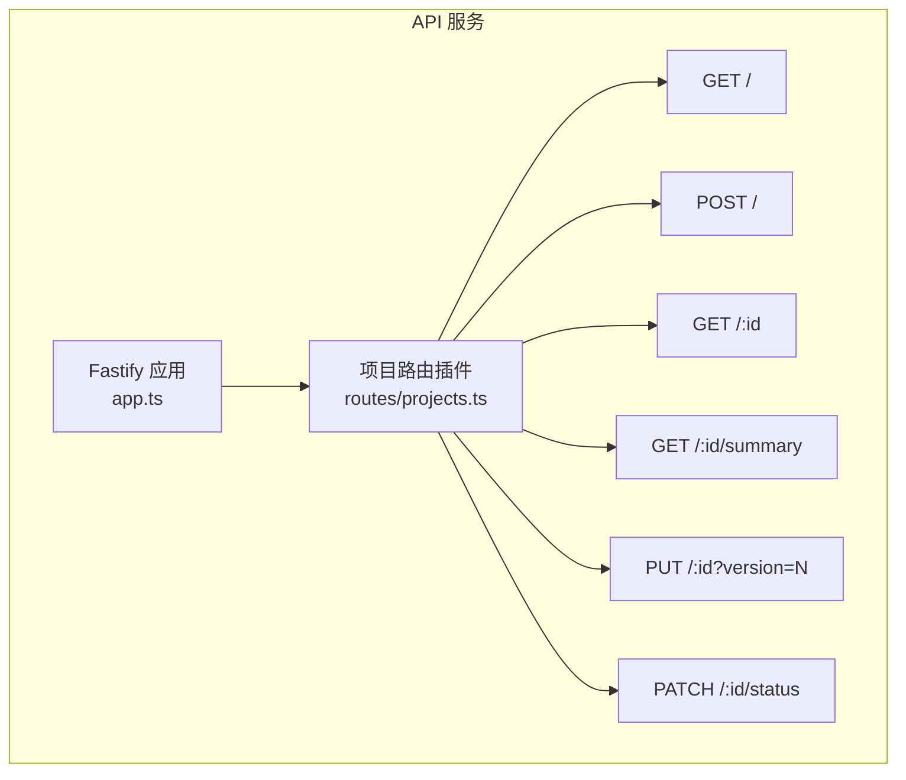
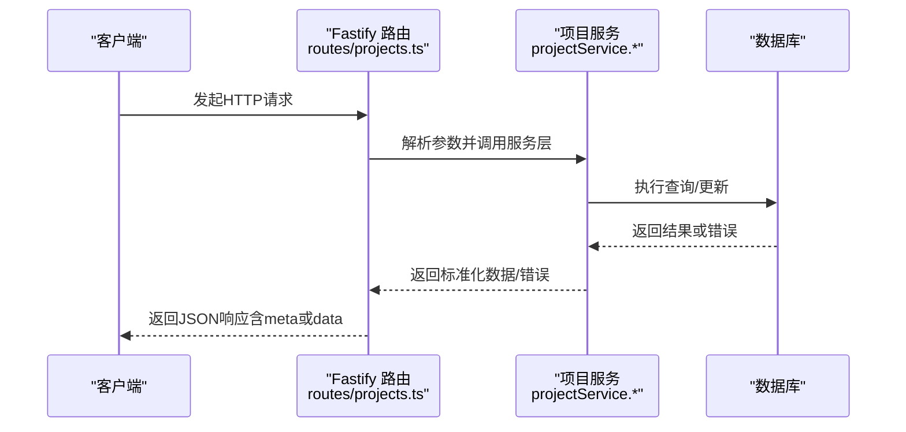

# 项目管理路由

<cite>
**本文引用的文件**
- [packages/api/src/routes/projects.ts](file://packages/api/src/routes/projects.ts)
- [packages/api/src/app.ts](file://packages/api/src/app.ts)
- [docs/06-test-design/modules/project-management/f-m1-01-project-list/f-m1-01-api.md](file://docs/06-test-design/modules/project-management/f-m1-01-project-list/f-m1-01-api.md)
- [docs/06-test-design/modules/project-management/f-m1-02-create-project/f-m1-02-api.md](file://docs/06-test-design/modules/project-management/f-m1-02-create-project/f-m1-02-api.md)
- [docs/06-test-design/modules/project-management/f-m1-03-project-detail/f-m1-03-api.md](file://docs/06-test-design/modules/project-management/f-m1-03-project-detail/f-m1-03-api.md)
- [docs/06-test-design/modules/project-management/f-m1-04-edit-project/f-m1-04-api.md](file://docs/06-test-design/modules/project-management/f-m1-04-edit-project/f-m1-04-api.md)
- [docs/06-test-design/modules/project-management/f-m1-05-archive/f-m1-05-api.md](file://docs/06-test-design/modules/project-management/f-m1-05-archive/f-m1-05-api.md)
</cite>

## 目录
1. [简介](#简介)
2. [项目结构](#项目结构)
3. [核心组件](#核心组件)
4. [架构总览](#架构总览)
5. [详细组件分析](#详细组件分析)
6. [依赖关系分析](#依赖关系分析)
7. [性能考量](#性能考量)
8. [故障排查指南](#故障排查指南)
9. [结论](#结论)

## 简介
本文件面向项目管理模块的API路由，系统梳理并解释以下核心能力：
- 项目列表获取（支持搜索、状态筛选、分页、排序）
- 项目详情查询（含完整字段返回）
- 项目详情摘要统计（子模块计数聚合）
- 项目创建（必填/长度/格式/唯一性/默认值等校验）
- 项目编辑（PUT全量更新 + 乐观锁版本控制）
- 项目归档/恢复（PATCH状态端点 + 乐观锁 + 状态转换规则）

文档基于测试用例与路由实现，逐项说明HTTP方法、URL模式、请求参数验证、响应格式，并给出错误处理机制与最佳实践。

## 项目结构
项目管理路由以Fastify插件形式注册，前缀为 /api/v1/projects，包含如下子路由：
- GET / (项目列表)
- POST / (创建项目)
- GET /:id (项目详情)
- GET /:id/summary (项目摘要统计)
- PUT /:id (编辑项目，version通过查询参数传递)
- PATCH /:id/status (归档/恢复项目)

图表来源
- [packages/api/src/app.ts:137-154](file://packages/api/src/app.ts#L137-L154)
- [packages/api/src/routes/projects.ts:30-132](file://packages/api/src/routes/projects.ts#L30-L132)

章节来源
- [packages/api/src/app.ts:137-154](file://packages/api/src/app.ts#L137-L154)
- [packages/api/src/routes/projects.ts:30-132](file://packages/api/src/routes/projects.ts#L30-L132)

## 核心组件
- 路由定义与Schema绑定：每个路由均绑定对应的请求/响应Schema，确保输入输出结构与OpenAPI文档一致。
- 路由处理器：将请求参数解析后委托给服务层（projectService）执行业务逻辑。
- 服务层职责：封装数据访问、业务规则（如唯一性、状态转换、乐观锁）、以及跨表聚合（摘要统计）。
- 数据访问：通过共享的数据库连接（db）执行查询/更新。

章节来源
- [packages/api/src/routes/projects.ts:30-132](file://packages/api/src/routes/projects.ts#L30-L132)
- [packages/api/src/routes/projects.ts:138-194](file://packages/api/src/routes/projects.ts#L138-L194)

## 架构总览
从入口到服务层的调用链路如下：

图表来源
- [packages/api/src/routes/projects.ts:138-194](file://packages/api/src/routes/projects.ts#L138-L194)

## 详细组件分析

### 项目列表（F-M1-01）
- HTTP 方法与URL
  - GET /api/v1/projects
- 查询参数
  - search: 模糊匹配 name（大小写不敏感）
  - status: active/archived（枚举校验）
  - page/pageSize: 分页（默认/边界校验）
  - sort/order: 排序字段与方向（枚举校验）
- 响应
  - 200: data（数组，字段裁剪，不包含 description/config），meta（total/page/pageSize）
  - 400/500: 错误响应
- 业务要点
  - 默认返回全部（活跃+归档），按更新时间倒序
  - 列表接口不返回 description/config
  - 支持按 name 搜索、状态筛选、分页与排序
- 错误处理
  - 参数越界/非法枚举/排序字段不受支持时返回400
  - 服务端异常返回500

章节来源
- [packages/api/src/routes/projects.ts:31-44](file://packages/api/src/routes/projects.ts#L31-L44)
- [packages/api/src/routes/projects.ts:138-150](file://packages/api/src/routes/projects.ts#L138-L150)
- [docs/06-test-design/modules/project-management/f-m1-01-project-list/f-m1-01-api.md:41-74](file://docs/06-test-design/modules/project-management/f-m1-01-project-list/f-m1-01-api.md#L41-L74)

### 创建项目（F-M1-02）
- HTTP 方法与URL
  - POST /api/v1/projects
- 请求体
  - name/display_name（必填，长度/格式约束）
  - description（可选，长度约束）
- 响应
  - 201: data（完整字段，含默认值与初始版本）
  - 400/409/500: 错误响应
- 业务要点
  - name全局唯一，display_name必填
  - 默认 status=active，version=1，config={}，createdAt/updatedAt自动生成
  - 并发创建同名项目遵循数据库唯一约束，最多一个成功
- 错误处理
  - 格式/长度/必填/唯一性冲突/未知字段等返回400
  - 唯一性冲突返回409
  - 服务端异常返回500

章节来源
- [packages/api/src/routes/projects.ts:46-60](file://packages/api/src/routes/projects.ts#L46-L60)
- [packages/api/src/routes/projects.ts:152-159](file://packages/api/src/routes/projects.ts#L152-L159)
- [docs/06-test-design/modules/project-management/f-m1-02-create-project/f-m1-02-api.md:39-72](file://docs/06-test-design/modules/project-management/f-m1-02-create-project/f-m1-02-api.md#L39-L72)

### 项目详情（F-M1-03）
- HTTP 方法与URL
  - GET /api/v1/projects/:id
- 路径参数
  - id: 项目ID（UUID v4）
- 响应
  - 200: data（完整字段，包含 description/config）
  - 400/404/500: 错误响应
- 业务要点
  - 详情接口返回完整字段，与列表字段裁剪不同
  - 归档项目同样可查询详情（UI层控制编辑/归档按钮显隐）
- 错误处理
  - 无效UUID返回400
  - 不存在返回404
  - 服务端异常返回500

章节来源
- [packages/api/src/routes/projects.ts:62-76](file://packages/api/src/routes/projects.ts#L62-L76)
- [packages/api/src/routes/projects.ts:161-167](file://packages/api/src/routes/projects.ts#L161-L167)
- [docs/06-test-design/modules/project-management/f-m1-03-project-detail/f-m1-03-api.md:41-63](file://docs/06-test-design/modules/project-management/f-m1-03-project-detail/f-m1-03-api.md#L41-L63)

### 项目摘要统计（F-M1-03）
- HTTP 方法与URL
  - GET /api/v1/projects/:id/summary
- 路径参数
  - id: 项目ID（UUID v4）
- 响应
  - 200: data（各子模块计数，包括domainEntityCount/processCount/companyCount/departmentCount/roleCount/externalEntityCount；为0也返回）
  - 400/404/500: 错误响应
- 业务要点
  - 聚合6类子资源数量，用于概览展示
- 错误处理
  - 无效UUID返回400
  - 不存在返回404
  - 服务端异常返回500

章节来源
- [packages/api/src/routes/projects.ts:78-92](file://packages/api/src/routes/projects.ts#L78-L92)
- [packages/api/src/routes/projects.ts:169-175](file://packages/api/src/routes/projects.ts#L169-L175)
- [docs/06-test-design/modules/project-management/f-m1-03-project-detail/f-m1-03-api.md:76-96](file://docs/06-test-design/modules/project-management/f-m1-03-project-detail/f-m1-03-api.md#L76-L96)

### 编辑项目（F-M1-04）
- HTTP 方法与URL
  - PUT /api/v1/projects/:id?version=N
- 路径参数
  - id: 项目ID（UUID v4）
- 查询参数
  - version: 乐观锁版本号（必填，>=1）
- 请求体
  - name/display_name（必填，长度/格式/唯一性约束）
  - description（可选，长度约束）
- 响应
  - 200: data（更新后的完整字段，version递增）
  - 400/404/409/500: 错误响应
- 业务要点
  - PUT语义：全量更新（未传字段的行为以实现为准）
  - 归档项目禁止编辑（返回400）
  - 乐观锁：version不匹配返回409
  - 唯一性：name排除自身后全局唯一
- 错误处理
  - 格式/长度/必填/唯一性/归档保护/版本冲突/无效UUID/不存在/未知字段等返回400/409
  - 服务端异常返回500

章节来源
- [packages/api/src/routes/projects.ts:94-113](file://packages/api/src/routes/projects.ts#L94-L113)
- [packages/api/src/routes/projects.ts:177-185](file://packages/api/src/routes/projects.ts#L177-L185)
- [docs/06-test-design/modules/project-management/f-m1-04-edit-project/f-m1-04-api.md:41-101](file://docs/06-test-design/modules/project-management/f-m1-04-edit-project/f-m1-04-api.md#L41-L101)

### 归档/恢复（F-M1-05）
- HTTP 方法与URL
  - PATCH /api/v1/projects/:id/status
- 路径参数
  - id: 项目ID（UUID v4）
- 请求体
  - status: archived/active（必填，枚举校验）
  - version: 乐观锁版本号（必填，>=1）
- 响应
  - 200: data（更新后的完整字段，version递增）
  - 400/404/409/500: 错误响应
- 业务要点
  - 状态转换规则：active→archived 或 archived→active
  - 同状态重复转换无效（返回400）
  - 不级联修改子数据（公司/部门/角色等）
  - 乐观锁：version不匹配返回409
- 错误处理
  - 非法状态/缺少字段/版本冲突/无效UUID/不存在/未知字段等返回400/409
  - 服务端异常返回500

章节来源
- [packages/api/src/routes/projects.ts:115-131](file://packages/api/src/routes/projects.ts#L115-L131)
- [packages/api/src/routes/projects.ts:187-194](file://packages/api/src/routes/projects.ts#L187-L194)
- [docs/06-test-design/modules/project-management/f-m1-05-archive/f-m1-05-api.md:40-67](file://docs/06-test-design/modules/project-management/f-m1-05-archive/f-m1-05-api.md#L40-L67)

## 依赖关系分析
- 路由层依赖服务层：所有路由处理器仅负责参数解析与调用服务层
- 服务层依赖数据库：提供查询/更新能力
- Schema驱动：请求/响应Schema统一了输入输出契约，便于OpenAPI生成与前端对接

图表来源
- [packages/api/src/routes/projects.ts:10-10](file://packages/api/src/routes/projects.ts#L10-L10)
- [packages/api/src/routes/projects.ts:138-194](file://packages/api/src/routes/projects.ts#L138-L194)

章节来源
- [packages/api/src/routes/projects.ts:10-10](file://packages/api/src/routes/projects.ts#L10-L10)
- [packages/api/src/routes/projects.ts:138-194](file://packages/api/src/routes/projects.ts#L138-L194)

## 性能考量
- 列表查询
  - 建议在 name/status 上建立索引，以优化模糊搜索与筛选
  - 分页参数需限制最大pageSize，避免一次性返回过多数据
- 摘要统计
  - 多表聚合建议使用并行查询或物化视图，降低RT
- 乐观锁
  - 更新/归档操作应尽量短事务，减少并发冲突概率
- 缓存
  - 详情接口可考虑短期缓存（如TTL=30s），热点项目可显著降低DB压力

## 故障排查指南
- 400 参数校验失败
  - 检查请求体字段类型/长度/格式是否满足Schema
  - 确认枚举值（status/sort/order）是否合法
  - 确认UUID格式是否正确
- 404 项目不存在
  - 核对ID是否存在或已被删除
- 409 冲突
  - 唯一性冲突：更换name或等待并发完成
  - 版本冲突：刷新页面重新加载最新数据后再提交
- 500 服务端异常
  - 查看服务日志定位具体SQL/业务逻辑问题
  - 确保事务在异常时正确回滚

章节来源
- [docs/06-test-design/modules/project-management/f-m1-01-project-list/f-m1-01-api.md:265-462](file://docs/06-test-design/modules/project-management/f-m1-01-project-list/f-m1-01-api.md#L265-L462)
- [docs/06-test-design/modules/project-management/f-m1-02-create-project/f-m1-02-api.md:104-548](file://docs/06-test-design/modules/project-management/f-m1-02-create-project/f-m1-02-api.md#L104-L548)
- [docs/06-test-design/modules/project-management/f-m1-03-project-detail/f-m1-03-api.md:129-309](file://docs/06-test-design/modules/project-management/f-m1-03-project-detail/f-m1-03-api.md#L129-L309)
- [docs/06-test-design/modules/project-management/f-m1-04-edit-project/f-m1-04-api.md:105-562](file://docs/06-test-design/modules/project-management/f-m1-04-edit-project/f-m1-04-api.md#L105-L562)
- [docs/06-test-design/modules/project-management/f-m1-05-archive/f-m1-05-api.md:105-478](file://docs/06-test-design/modules/project-management/f-m1-05-archive/f-m1-05-api.md#L105-L478)

## 结论
项目管理路由围绕“列表/详情/摘要/创建/编辑/归档”六大能力构建，通过Schema驱动的输入输出契约与服务层封装，实现了清晰的职责分离与良好的扩展性。结合测试用例覆盖的边界与异常场景，可确保在复杂业务与并发环境下稳定运行。建议在生产环境中配合索引、缓存与监控告警，持续优化性能与可用性。