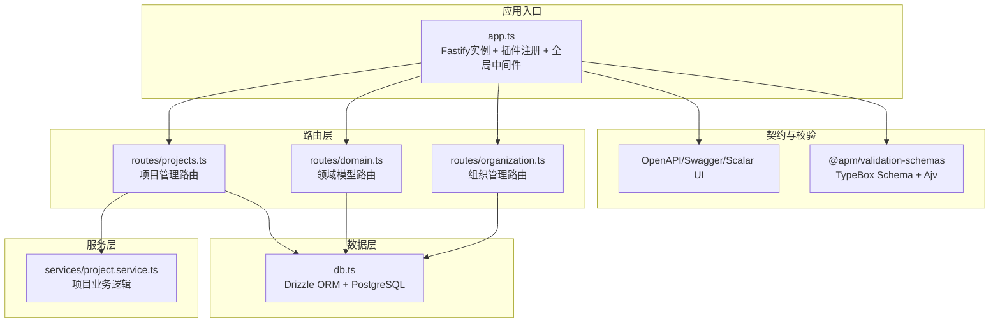
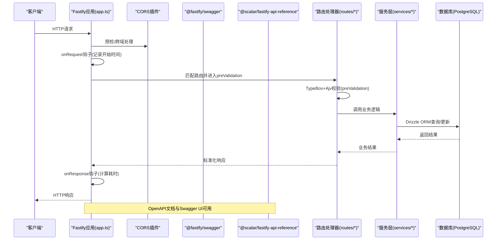
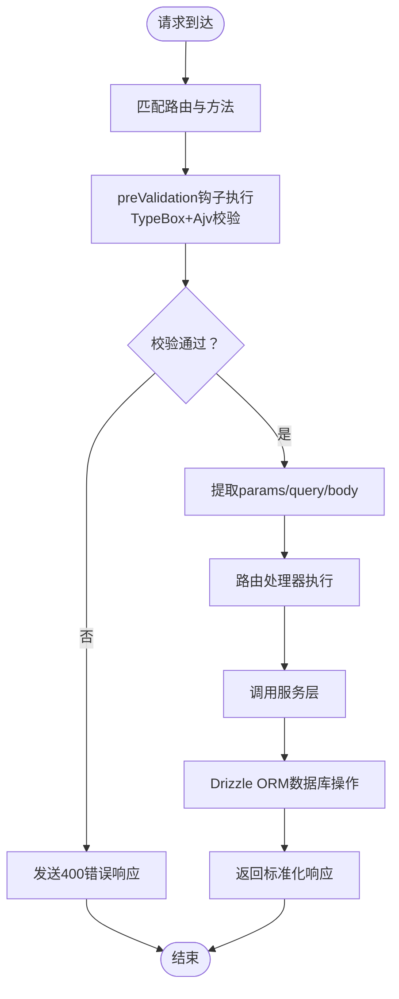
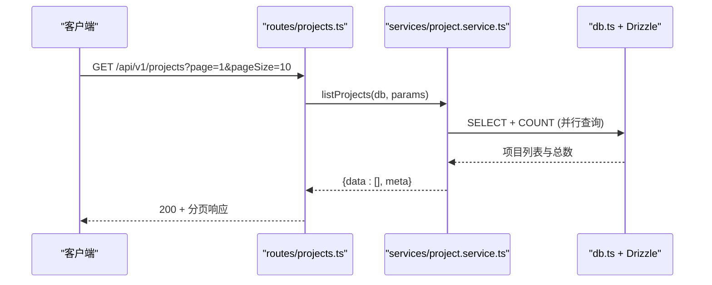
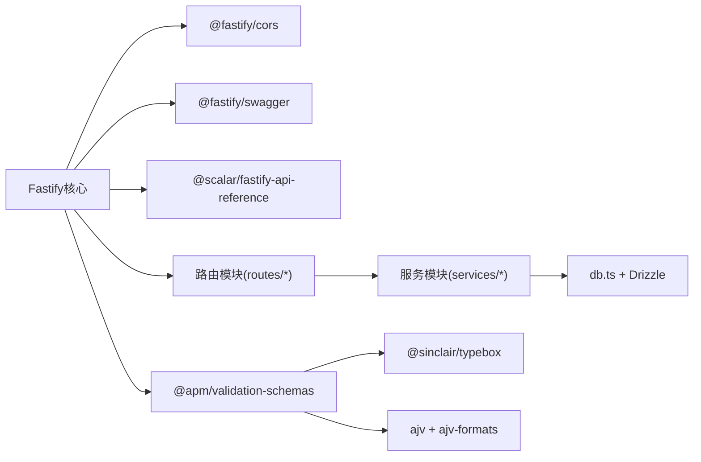

# Fastify框架使用

<cite>
**本文档引用的文件**
- [packages/api/src/app.ts](file://packages/api/src/app.ts)
- [packages/api/src/routes/projects.ts](file://packages/api/src/routes/projects.ts)
- [packages/api/src/routes/domain.ts](file://packages/api/src/routes/domain.ts)
- [packages/api/src/routes/organization.ts](file://packages/api/src/routes/organization.ts)
- [packages/api/src/db.ts](file://packages/api/src/db.ts)
- [packages/api/src/services/project.service.ts](file://packages/api/src/services/project.service.ts)
- [docs/04-tech-design/coding-convention-backend.md](file://docs/04-tech-design/coding-convention-backend.md)
- [docs/04-tech-design/validation-design.md](file://docs/04-tech-design/validation-design.md)
- [docs/04-tech-design/openapi-contract-design.md](file://docs/04-tech-design/openapi-contract-design.md)
- [packages/validation-schemas/src/response.ts](file://packages/validation-schemas/src/response.ts)
- [packages/api/tests/openapi/openapi-schema.test.ts](file://packages/api/tests/openapi/openapi-schema.test.ts)
</cite>

## 目录
1. [简介](#简介)
2. [项目结构](#项目结构)
3. [核心组件](#核心组件)
4. [架构概览](#架构概览)
5. [详细组件分析](#详细组件分析)
6. [依赖分析](#依赖分析)
7. [性能考虑](#性能考虑)
8. [故障排查指南](#故障排查指南)
9. [结论](#结论)
10. [附录](#附录)

## 简介
本指南面向AI原型管理系统（APM）后端的Fastify框架使用，围绕应用实例初始化、插件注册、中间件链、路由系统、插件架构与自定义插件开发、中间件执行顺序与作用域管理、路由注册机制与参数提取、错误处理与响应格式化最佳实践、性能优化配置以及生产环境部署注意事项展开。文档同时结合项目现有实现，提供可操作的实践建议与可视化图示。

## 项目结构
APM后端采用多包工作区（monorepo）结构，Fastify应用位于packages/api/src/app.ts，路由模块分布在packages/api/src/routes目录下，数据库连接与ORM封装在packages/api/src/db.ts，业务服务位于packages/api/src/services目录。TypeBox + Ajv的校验体系与OpenAPI契约在packages/validation-schemas中集中定义，并通过Fastify原生schema与@fastify/swagger/@scalar/fastify-api-reference集成。

**图表来源**
- [packages/api/src/app.ts:1-178](file://packages/api/src/app.ts#L1-L178)
- [packages/api/src/routes/projects.ts:1-195](file://packages/api/src/routes/projects.ts#L1-L195)
- [packages/api/src/routes/domain.ts:1-499](file://packages/api/src/routes/domain.ts#L1-L499)
- [packages/api/src/routes/organization.ts:1-420](file://packages/api/src/routes/organization.ts#L1-L420)
- [packages/api/src/db.ts:1-25](file://packages/api/src/db.ts#L1-L25)
- [packages/api/src/services/project.service.ts:1-387](file://packages/api/src/services/project.service.ts#L1-L387)

**章节来源**
- [packages/api/src/app.ts:1-178](file://packages/api/src/app.ts#L1-L178)
- [packages/api/src/routes/projects.ts:1-195](file://packages/api/src/routes/projects.ts#L1-L195)
- [packages/api/src/routes/domain.ts:1-499](file://packages/api/src/routes/domain.ts#L1-L499)
- [packages/api/src/routes/organization.ts:1-420](file://packages/api/src/routes/organization.ts#L1-L420)
- [packages/api/src/db.ts:1-25](file://packages/api/src/db.ts#L1-L25)
- [packages/api/src/services/project.service.ts:1-387](file://packages/api/src/services/project.service.ts#L1-L387)

## 核心组件
- Fastify应用实例与配置：日志级别、端口与主机绑定、仅在非测试模式下启动监听。
- 插件体系：CORS、@fastify/swagger、@scalar/fastify-api-reference、OpenAPI JSON暴露端点。
- 全局中间件：onRequest钩子注入请求开始时间，onResponse钩子记录耗时日志。
- 健康检查路由：快速DB连通性检查。
- 路由注册：按模块（M1~M6）逐步注册，统一前缀管理。
- 错误处理：全局setErrorHandler统一格式化4xx/5xx响应，隐藏内部堆栈细节。
- 校验与契约：TypeBox Schema + Ajv在preValidation阶段执行，配合Fastify原生schema与OpenAPI文档生成。

**章节来源**
- [packages/api/src/app.ts:6-178](file://packages/api/src/app.ts#L6-L178)
- [docs/04-tech-design/coding-convention-backend.md:476-535](file://docs/04-tech-design/coding-convention-backend.md#L476-L535)
- [docs/04-tech-design/validation-design.md:266-304](file://docs/04-tech-design/validation-design.md#L266-L304)
- [docs/04-tech-design/openapi-contract-design.md:163-241](file://docs/04-tech-design/openapi-contract-design.md#L163-L241)

## 架构概览
下图展示了从客户端请求到响应返回的关键路径，包括插件加载、中间件链、路由匹配、参数提取、服务调用与错误处理。

**图表来源**
- [packages/api/src/app.ts:16-113](file://packages/api/src/app.ts#L16-L113)
- [packages/api/src/routes/projects.ts:30-132](file://packages/api/src/routes/projects.ts#L30-L132)
- [packages/api/src/services/project.service.ts:108-173](file://packages/api/src/services/project.service.ts#L108-L173)
- [packages/api/src/db.ts:14-22](file://packages/api/src/db.ts#L14-L22)

**章节来源**
- [packages/api/src/app.ts:16-113](file://packages/api/src/app.ts#L16-L113)
- [packages/api/src/routes/projects.ts:30-132](file://packages/api/src/routes/projects.ts#L30-L132)
- [packages/api/src/services/project.service.ts:108-173](file://packages/api/src/services/project.service.ts#L108-L173)
- [packages/api/src/db.ts:14-22](file://packages/api/src/db.ts#L14-L22)

## 详细组件分析

### 应用实例初始化与配置
- 日志级别：通过环境变量LOG_LEVEL控制，默认为info。
- 监听配置：API_PORT默认13180，API_HOST默认0.0.0.0；仅在非Vitest环境下启动HTTP监听。
- 健康检查：/api/v1/health端点，DB连通性检查，返回状态与时间戳。

**章节来源**
- [packages/api/src/app.ts:6-10](file://packages/api/src/app.ts#L6-L10)
- [packages/api/src/app.ts:164-175](file://packages/api/src/app.ts#L164-L175)
- [packages/api/src/app.ts:119-130](file://packages/api/src/app.ts#L119-L130)

### 插件注册与OpenAPI文档
- CORS：允许所有origin与常用方法/头部，满足开发需求。
- Swagger：配置OpenAPI 3.0.3元数据（title、version、servers、tags、securitySchemes）。
- Scalar UI：注册/docs路由前缀，提供交互式API文档。
- OpenAPI JSON：手动暴露/openapi/json端点，便于测试与集成。

**章节来源**
- [packages/api/src/app.ts:16-67](file://packages/api/src/app.ts#L16-L67)

### 中间件链与钩子
- onRequest钩子：在请求进入时记录_startTime，便于后续耗时统计。
- onResponse钩子：计算请求耗时并记录调试日志。
- 全局错误处理：setErrorHandler统一捕获错误，区分4xx业务错误、400校验错误与500未预期异常，输出标准化错误信封。

**章节来源**
- [packages/api/src/app.ts:104-113](file://packages/api/src/app.ts#L104-L113)
- [packages/api/src/app.ts:73-98](file://packages/api/src/app.ts#L73-L98)

### 路由注册机制与参数提取
- 模块化注册：按M1~M6逐步注册，统一前缀管理，便于扩展与维护。
- 路由文件结构：每个路由模块导出默认函数，接收FastifyInstance作为参数，在其中注册HTTP方法与schema。
- 参数提取：通过request.params、request.query、request.body获取路径参数、查询参数与请求体；部分路由使用TypeBox schema进行强类型校验。
- 预校验：使用preValidation钩子与validate中间件（TypeBox+Ajv）在handler执行前完成参数校验。

**图表来源**
- [packages/api/src/routes/projects.ts:30-132](file://packages/api/src/routes/projects.ts#L30-L132)
- [docs/04-tech-design/coding-convention-backend.md:596-647](file://docs/04-tech-design/coding-convention-backend.md#L596-L647)

**章节来源**
- [packages/api/src/app.ts:136-158](file://packages/api/src/app.ts#L136-L158)
- [packages/api/src/routes/projects.ts:30-132](file://packages/api/src/routes/projects.ts#L30-L132)
- [docs/04-tech-design/coding-convention-backend.md:476-535](file://docs/04-tech-design/coding-convention-backend.md#L476-L535)
- [docs/04-tech-design/coding-convention-backend.md:596-647](file://docs/04-tech-design/coding-convention-backend.md#L596-L647)

### 插件架构与自定义插件开发
- 插件形式：路由模块以Fastify插件形式导出，接收app实例并在其上注册路由，支持prefix前缀。
- 可扩展性：新模块通过app.register引入，遵循统一的schema与错误处理约定。
- 建议实践：插件内部职责单一，仅负责路由注册；业务逻辑下沉至服务层；数据库连接通过共享db实例注入。

**章节来源**
- [packages/api/src/app.ts:136-158](file://packages/api/src/app.ts#L136-L158)
- [packages/api/src/routes/projects.ts:30-132](file://packages/api/src/routes/projects.ts#L30-L132)
- [packages/api/src/routes/domain.ts:38-498](file://packages/api/src/routes/domain.ts#L38-L498)
- [packages/api/src/routes/organization.ts:46-242](file://packages/api/src/routes/organization.ts#L46-L242)

### 错误处理与响应格式化最佳实践
- 统一错误信封：ErrorResponse包含code、message、requestId与details（仅400时存在）。
- 4xx业务错误：来自服务层抛出的AppError，包含业务错误码与消息。
- 400校验错误：TypeBox+Ajv校验失败时，返回标准化错误体与字段级错误明细。
- 500未预期异常：隐藏堆栈，记录日志并返回INTERNAL_ERROR。
- OpenAPI契约：每个端点schema.response声明可能返回的状态码，确保文档与实现一致。

**章节来源**
- [packages/validation-schemas/src/response.ts:109-136](file://packages/validation-schemas/src/response.ts#L109-L136)
- [packages/api/src/app.ts:73-98](file://packages/api/src/app.ts#L73-L98)
- [docs/04-tech-design/openapi-contract-design.md:222-241](file://docs/04-tech-design/openapi-contract-design.md#L222-L241)
- [packages/api/tests/openapi/openapi-schema.test.ts:144-167](file://packages/api/tests/openapi/openapi-schema.test.ts#L144-L167)

### 数据流与服务层示例
以项目管理为例，展示从路由到服务再到数据库的完整数据流。

**图表来源**
- [packages/api/src/routes/projects.ts:138-150](file://packages/api/src/routes/projects.ts#L138-L150)
- [packages/api/src/services/project.service.ts:108-173](file://packages/api/src/services/project.service.ts#L108-L173)
- [packages/api/src/db.ts:14-22](file://packages/api/src/db.ts#L14-L22)

**章节来源**
- [packages/api/src/routes/projects.ts:138-150](file://packages/api/src/routes/projects.ts#L138-L150)
- [packages/api/src/services/project.service.ts:108-173](file://packages/api/src/services/project.service.ts#L108-L173)
- [packages/api/src/db.ts:14-22](file://packages/api/src/db.ts#L14-L22)

## 依赖分析
- 应用层依赖：Fastify核心、@fastify/cors、@fastify/swagger、@scalar/fastify-api-reference。
- 校验与契约：@sinclair/typebox、ajv、ajv-formats；统一在validation-schemas包中管理。
- 数据库：drizzle-orm + postgres-js，db.ts提供drizzle实例与迁移专用连接。
- 路由与服务：各模块路由依赖对应服务层，服务层依赖db.ts与共享类型。

**图表来源**
- [packages/api/src/app.ts:1-6](file://packages/api/src/app.ts#L1-L6)
- [packages/api/src/db.ts:1-4](file://packages/api/src/db.ts#L1-L4)
- [packages/validation-schemas/package.json:1-1](file://packages/validation-schemas/package.json#L1-L1)

**章节来源**
- [packages/api/src/app.ts:1-6](file://packages/api/src/app.ts#L1-L6)
- [packages/api/src/db.ts:1-4](file://packages/api/src/db.ts#L1-L4)
- [packages/validation-schemas/package.json:1-1](file://packages/validation-schemas/package.json#L1-L1)

## 性能考虑
- 并行查询：项目列表与摘要统计中使用Promise.all并行执行多个COUNT查询，减少RTT。
- 预编译与类型转换：Ajv配置useDefaults、coerceTypes、removeAdditional，提升请求处理效率与兼容性。
- 日志开销：onRequest/onResponse钩子仅记录调试信息，避免生产环境高频日志影响性能。
- 连接池：postgres-js默认使用prepared statements，db.ts中迁移使用prepare:false避免缓存干扰。
- 健康检查：轻量DB连通性检查，避免阻塞主业务流量。

**章节来源**
- [packages/api/src/services/project.service.ts:139-173](file://packages/api/src/services/project.service.ts#L139-L173)
- [docs/04-tech-design/validation-design.md:289-304](file://docs/04-tech-design/validation-design.md#L289-L304)
- [packages/api/src/db.ts:14-22](file://packages/api/src/db.ts#L14-L22)
- [packages/api/src/app.ts:104-113](file://packages/api/src/app.ts#L104-L113)

## 故障排查指南
- OpenAPI文档校验：通过测试断言确保/openapi/json可访问且包含错误响应声明，覆盖率高。
- 错误响应一致性：确保每个端点schema.response声明4xx/5xx状态码，与ErrorResponse Schema一致。
- 校验中间件：preValidation钩子中TypeBox+Ajv校验失败会立即返回400并终止后续执行。
- 全局错误处理：未捕获异常统一返回500 INTERNAL_ERROR，同时记录日志便于定位问题。

**章节来源**
- [packages/api/tests/openapi/openapi-schema.test.ts:144-167](file://packages/api/tests/openapi/openapi-schema.test.ts#L144-L167)
- [packages/validation-schemas/src/response.ts:109-136](file://packages/validation-schemas/src/response.ts#L109-L136)
- [docs/04-tech-design/coding-convention-backend.md:596-647](file://docs/04-tech-design/coding-convention-backend.md#L596-L647)
- [packages/api/src/app.ts:73-98](file://packages/api/src/app.ts#L73-L98)

## 结论
APM后端基于Fastify构建，采用模块化路由、统一schema与校验、OpenAPI契约驱动的开发方式，实现了清晰的职责分离与良好的可维护性。通过全局中间件与错误处理机制，确保了请求链路的一致性与可观测性。建议在生产环境中进一步完善监控指标、限流策略与安全加固，持续迭代M3~M6模块的路由注册与契约完善。

## 附录
- 端口与主机：API_PORT默认13180，API_HOST默认0.0.0.0；开发环境可通过环境变量调整。
- 测试模式：Vitest环境下不启动HTTP监听，使用app.inject()进行HTTP层测试，提升测试效率。
- OpenAPI集成：Swagger + Scalar UI提供交互式文档，/openapi/json暴露规范JSON供集成测试。

**章节来源**
- [packages/api/src/app.ts:164-175](file://packages/api/src/app.ts#L164-L175)
- [docs/04-tech-design/phase1-infrastructure-plan.md:1103-1178](file://docs/04-tech-design/phase1-infrastructure-plan.md#L1103-L1178)