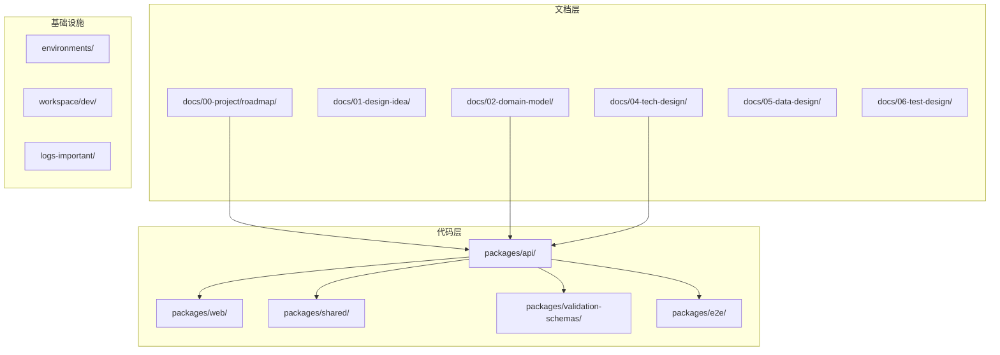
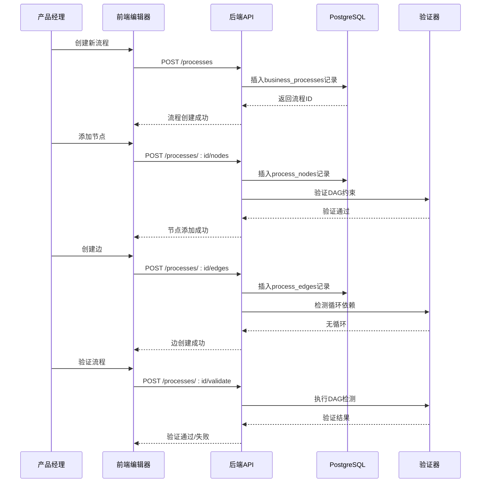
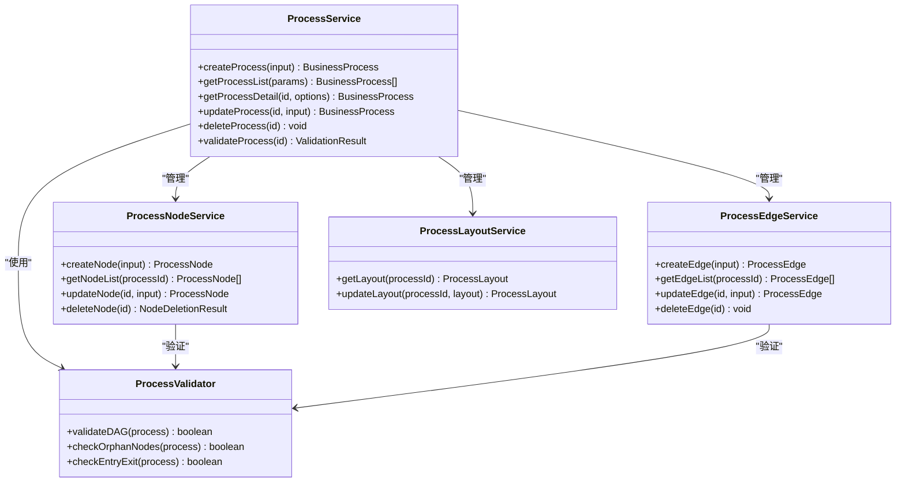
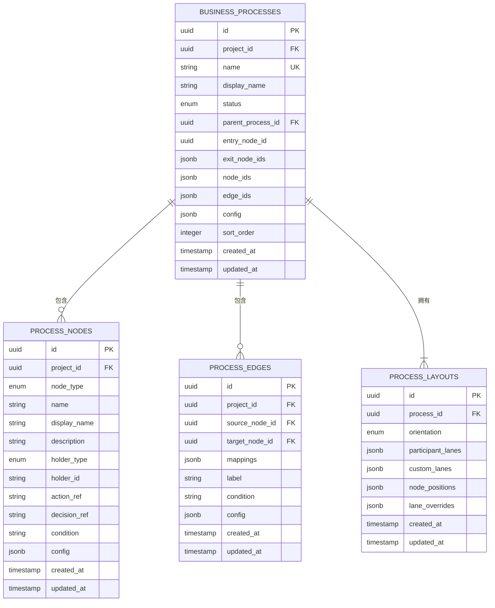
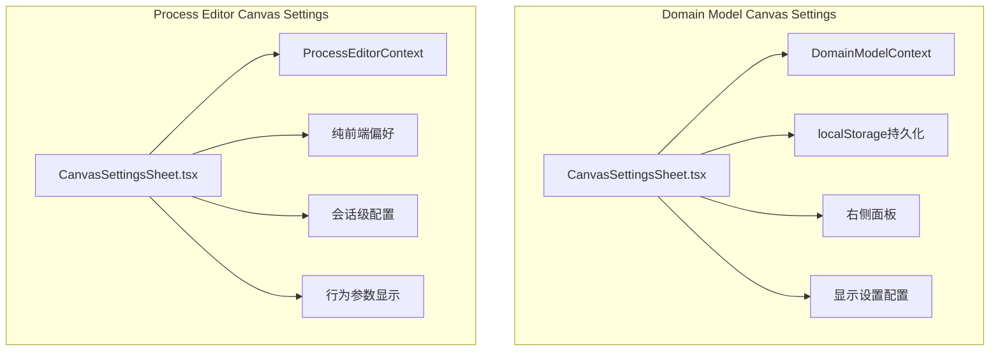
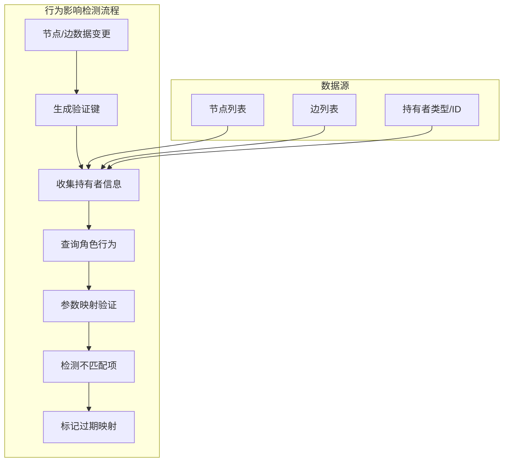
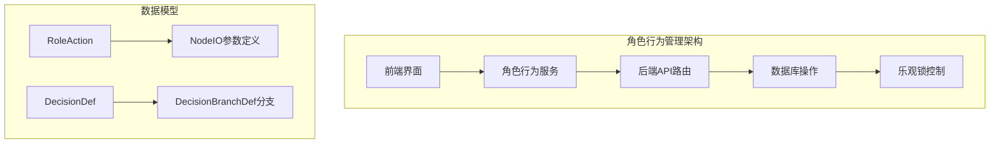
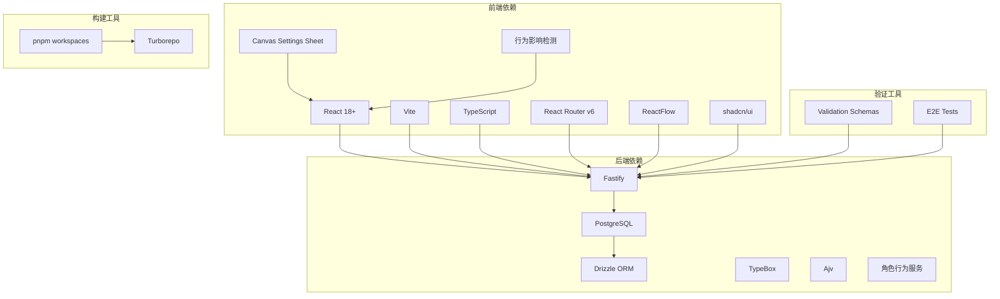
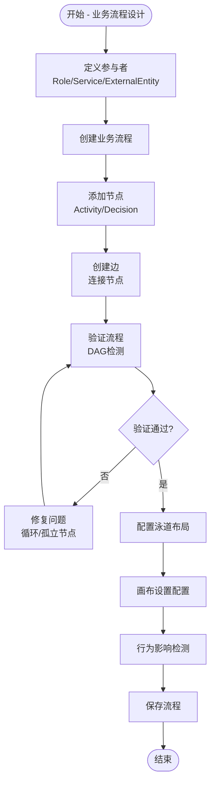

# 业务流程技术设计

<cite>
**本文档引用的文件**
- [README.md](file://README.md)
- [business-process.md](file://docs/02-domain-model/business-process.md)
- [m3-business-process-tech-design.md](file://docs/04-tech-design/modules/business-process/m3-business-process-tech-design.md)
- [domain-model.md](file://docs/02-domain-model/domain-model.md)
- [workflow.md](file://docs/01-design-idea/workflow.md)
- [schema.ts](file://packages/api/src/models/schema.ts)
- [process.service.ts](file://packages/api/src/services/process.service.ts)
- [CanvasSettingsSheet.tsx](file://packages/web/src/components/domain-model/CanvasSettingsSheet.tsx)
- [CanvasSettingsSheet.tsx](file://packages/web/src/components/process-editor/CanvasSettingsSheet.tsx)
- [role-behavior-design.md](file://docs/04-tech-design/role-behavior-design.md)
- [role-behavior.service.ts](file://packages/api/src/services/role-behavior.service.ts)
- [role-behavior.ts](file://packages/shared/src/types/role-behavior.ts)
- [role-behavior.ts](file://packages/api/src/routes/role-behavior.ts)
- [ProcessEditorContext.tsx](file://packages/web/src/contexts/ProcessEditorContext.tsx)
</cite>

## 更新摘要
**所做更改**
- 新增Canvas Settings Sheet组件架构分析章节
- 新增行为影响检测系统实现细节
- 更新数据库Schema变更说明
- 新增角色行为管理系统技术设计

## 目录
1. [简介](#简介)
2. [项目结构](#项目结构)
3. [核心组件](#核心组件)
4. [架构概览](#架构概览)
5. [详细组件分析](#详细组件分析)
6. [Canvas Settings Sheet组件架构](#canvas-settings-sheet组件架构)
7. [行为影响检测系统](#行为影响检测系统)
8. [角色行为管理系统](#角色行为管理系统)
9. [数据库Schema变更](#数据库schema变更)
10. [依赖关系分析](#依赖关系分析)
11. [性能考虑](#性能考虑)
12. [故障排除指南](#故障排除指南)
13. [结论](#结论)

## 简介

AI原型管理系统是一个面向AI时代的软件产品定义与生命周期管理平台，专注于"给AI用的结构化语义"，确保原型中包含的业务逻辑、交互逻辑、数据关系等关键信息能够完整传递给下游Coding Agent。

本系统采用六阶段工作流：A. 理解业务 → B. 定义系统运转 → C. 定义人机接口 → D. 视觉与验证 → E. 与研发集成 → F. 与测试集成。

**核心定位**：传统原型工具（Figma/Sketch等）聚焦于"给人看的高保真视觉"，本项目聚焦于"给AI用的结构化语义"，确保原型中包含的业务逻辑、交互逻辑、数据关系等关键信息能够完整传递给下游Coding Agent。

## 项目结构

系统采用Monorepo架构，包含以下主要模块：



**图表来源**
- [README.md:32-52](file://README.md#L32-L52)

**章节来源**
- [README.md:1-52](file://README.md#L1-L52)

## 核心组件

### 业务流程系统架构

系统采用四层架构设计，从底层真相层到顶层架构层：

```mermaid
graph TB
subgraph "Layer 1: 全局节点池 + 边池"
A[processNodes[] - 全局节点池]
B[processEdges[] - 全局边池]
C[Project根级存储]
end
subgraph "Layer 2: 流程Process"
D[businessProcesses[] - 流程表]
E[nodeIds[] - 节点ID引用]
F[edgeIds[] - 边ID引用]
end
subgraph "Layer 3: 流程架构ProcessArchitecture"
G[树形分类导航]
H[架构节点]
I[processRef引用]
end
subgraph "Layer 4: 参与者Participants"
J[Role - 内部角色]
K[Service - 系统服务]
L[ExternalEntity - 外部实体]
end
A --> D
B --> D
D --> G
J --> A
K --> A
L --> A
```

**图表来源**
- [business-process.md:91-125](file://docs/02-domain-model/business-process.md#L91-L125)
- [business-process.md:471-515](file://docs/02-domain-model/business-process.md#L471-L515)

### 数据模型设计

系统采用JSONB数组存储流程引用，实现高效的数据访问：

| 表名 | 字段 | 类型 | 说明 |
|------|------|------|------|
| business_processes | node_ids | JSONB | 流程包含的节点ID数组 |
| business_processes | edge_ids | JSONB | 流程包含的边ID数组 |
| process_nodes | action_ref | TEXT | 活动节点引用的Action ID |
| process_nodes | decision_ref | TEXT | 决策节点引用的DecisionDef ID |
| process_layouts | participant_lanes | JSONB | 参与者泳道配置 |
| process_layouts | custom_lanes | JSONB | 自定义泳道配置 |

**章节来源**
- [m3-business-process-tech-design.md:56-217](file://docs/04-tech-design/modules/business-process/m3-business-process-tech-design.md#L56-L217)

## 架构概览

### 整体技术架构

```mermaid
graph TB
subgraph "前端层"
A[React + Vite + TypeScript]
B[shadcn/ui + React Router v6]
C[ReactFlow - 泳道编辑器]
D[Canvas Settings Sheet]
E[行为影响检测]
end
subgraph "后端层"
F[Fastify + PostgreSQL]
G[Drizzle ORM]
H[TypeBox + Ajv]
I[角色行为服务]
end
subgraph "数据层"
J[PostgreSQL数据库]
K[JSONB数组存储]
L[索引优化]
M[process_layouts表]
end
subgraph "工具层"
N[Monorepo (pnpm workspaces)]
O[Turborepo]
P[OpenAPI规范]
end
A --> F
C --> F
D --> A
E --> A
F --> J
G --> J
K --> J
L --> J
M --> J
N --> O
```

**图表来源**
- [README.md:24-31](file://README.md#L24-L31)

### 业务流程处理流程



**图表来源**
- [m3-business-process-tech-design.md:220-671](file://docs/04-tech-design/modules/business-process/m3-business-process-tech-design.md#L220-L671)

## 详细组件分析

### 流程服务组件



**图表来源**
- [m3-business-process-tech-design.md:983-1016](file://docs/04-tech-design/modules/business-process/m3-business-process-tech-design.md#L983-L1016)

### 数据库模式设计



**图表来源**
- [m3-business-process-tech-design.md:100-217](file://docs/04-tech-design/modules/business-process/m3-business-process-tech-design.md#L100-L217)

**章节来源**
- [schema.ts:155-169](file://packages/api/src/models/schema.ts#L155-L169)

### API端点设计

系统提供RESTful API端点，支持完整的CRUD操作：

| 功能模块 | HTTP方法 | 端点 | 描述 |
|----------|----------|------|------|
| 流程管理 | GET | `/api/v1/projects/:projectId/processes` | 列出项目下所有流程 |
| 流程管理 | POST | `/api/v1/projects/:projectId/processes` | 创建流程 |
| 流程管理 | GET | `/api/v1/projects/:projectId/processes/:processId` | 获取流程详情 |
| 节点管理 | POST | `/api/v1/projects/:projectId/processes/:processId/nodes` | 添加节点 |
| 节点管理 | PUT | `/api/v1/projects/:projectId/processes/:processId/nodes/:nodeId` | 更新节点 |
| 边管理 | POST | `/api/v1/projects/:projectId/processes/:processId/edges` | 创建边 |
| 边管理 | PUT | `/api/v1/projects/:projectId/processes/:processId/edges/:edgeId` | 更新边 |
| 验证 | POST | `/api/v1/projects/:projectId/processes/:processId/validate` | 验证流程 |
| 角色行为 | GET | `/api/v1/projects/:projectId/roles/:roleId/actions` | 列出角色动作 |
| 角色行为 | POST | `/api/v1/projects/:projectId/roles/:roleId/actions` | 创建动作 |
| 角色行为 | PUT | `/api/v1/projects/:projectId/roles/:roleId/actions/:actionId` | 更新动作 |
| 角色行为 | DELETE | `/api/v1/projects/:projectId/roles/:roleId/actions/:actionId` | 删除动作 |
| 角色行为 | GET | `/api/v1/projects/:projectId/roles/:roleId/decisions` | 列出决策 |
| 角色行为 | POST | `/api/v1/projects/:projectId/roles/:roleId/decisions` | 创建决策 |
| 角色行为 | PUT | `/api/v1/projects/:projectId/roles/:roleId/decisions/:decisionId` | 更新决策 |
| 角色行为 | DELETE | `/api/v1/projects/:projectId/roles/:roleId/decisions/:decisionId` | 删除决策 |

**章节来源**
- [m3-business-process-tech-design.md:220-430](file://docs/04-tech-design/modules/business-process/m3-business-process-tech-design.md#L220-L430)

## Canvas Settings Sheet组件架构

### 组件设计概述

系统包含两个Canvas Settings Sheet组件，分别服务于不同的编辑场景：



**图表来源**
- [CanvasSettingsSheet.tsx:1-47](file://packages/web/src/components/domain-model/CanvasSettingsSheet.tsx#L1-L47)
- [CanvasSettingsSheet.tsx:1-47](file://packages/web/src/components/process-editor/CanvasSettingsSheet.tsx#L1-L47)

### Domain Model Canvas Settings组件

该组件用于实体关系图编辑器的画布配置：

**核心特性**：
- 从Toolbar右侧"画布设置"按钮触发
- Sheet从右侧滑出，宽度280px
- 配置项持久化到localStorage（key格式：canvas-settings-{projectId}）
- 支持显示设置分组配置

**组件结构**：
```typescript
interface CanvasSettingsSheetProps {
  open: boolean;
  onOpenChange: (open: boolean) => void;
}

export default function CanvasSettingsSheet({ open, onOpenChange }: CanvasSettingsSheetProps) {
  const { canvasSettings, updateCanvasSettings } = useDomainModelContext();
  
  // 配置项包括显示设置、网格配置、缩放选项等
}
```

**章节来源**
- [CanvasSettingsSheet.tsx:1-34](file://packages/web/src/components/domain-model/CanvasSettingsSheet.tsx#L1-L34)

### Process Editor Canvas Settings组件

该组件用于业务流程编辑器的画布配置：

**核心特性**：
- 纯前端偏好设置，不进行持久化
- 每次打开流程编辑器时恢复默认值
- 主要配置行为参数显示开关
- 支持在连线上显示映射的参数名称

**组件结构**：
```typescript
export default function CanvasSettingsSheet() {
  const { 
    canvasSettingsOpen, 
    setCanvasSettingsOpen, 
    showBehaviorParams, 
    setShowBehaviorParams 
  } = useProcessEditorContext();

  // 展示行为参数开关，控制连线上的参数名称显示
}
```

**章节来源**
- [CanvasSettingsSheet.tsx:1-47](file://packages/web/src/components/process-editor/CanvasSettingsSheet.tsx#L1-L47)

## 行为影响检测系统

### 系统架构设计

行为影响检测系统负责实时监控流程节点的行为变化，并检测可能产生的影响：



**图表来源**
- [ProcessEditorContext.tsx:372-420](file://packages/web/src/contexts/ProcessEditorContext.tsx#L372-L420)

### 核心功能实现

系统在流程编辑器初始化完成后自动执行行为影响检测：

**验证键生成**：
- 基于节点ID和行为引用生成唯一键
- 包含边的映射关系和标签信息
- 避免重复验证相同配置

**持有者收集**：
- 支持三种持有者类型：role、service、external-entity
- 自动跳过无持有者的节点
- 收集每个持有者对应的节点ID列表

**并发查询优化**：
- 使用Promise.allSettled并行查询多个持有者的行为定义
- 自动选择正确的API路径（/roles、/applications、/external-entities）
- 统一处理查询失败的情况

**映射验证机制**：
- 构建行为参数映射表（输入/输出参数集合）
- 检查边映射中的字段是否存在于行为定义中
- 标记过期或无效的映射关系

**章节来源**
- [ProcessEditorContext.tsx:372-420](file://packages/web/src/contexts/ProcessEditorContext.tsx#L372-L420)

## 角色行为管理系统

### 系统架构

角色行为管理系统提供完整的动作(Action)和决策(Decision)管理功能：



**图表来源**
- [role-behavior.service.ts:579-1044](file://packages/api/src/services/role-behavior.service.ts#L579-L1044)

### 数据类型设计

系统定义了完整的角色行为数据类型：

**NodeIO参数定义**：
- name: 参数名（数组内唯一）
- type: 数据类型（如string/number/boolean/datetime）
- description: 参数描述
- required: 是否必填（默认false）
- defaultValue: 默认值
- constraints: 类型约束

**RoleAction角色动作**：
- id: 系统生成UUID v4
- name: 编程标识符（同一role的actions内唯一）
- displayName: 显示名称
- description: 描述
- inputs/outputs: NodeIO[]参数定义
- logic: ActionLogic自然语言描述和可选JS代码
- tool: ToolRef执行工具

**DecisionDef决策定义**：
- id: 系统生成UUID v4
- name: 编程标识符（同一role的decisions内唯一）
- displayName: 显示名称
- description: 描述
- branches: DecisionBranchDef[]分支定义（≥2个）

**章节来源**
- [role-behavior-design.md:101-186](file://docs/04-tech-design/role-behavior-design.md#L101-L186)

### 服务层实现

**乐观锁机制**：
- 使用版本号控制并发修改
- 原子性写回JSONB数组
- 支持条件更新（version匹配）

**数据验证**：
- 参数名称唯一性验证
- NodeIO数组格式验证
- Decision分支数量和格式验证
- 工具引用有效性验证

**引用完整性检查**：
- 删除前检查是否被流程节点引用
- Phase 1预留：等待process_nodes表新增引用字段
- 支持未来版本的完整引用检查

**章节来源**
- [role-behavior.service.ts:579-1044](file://packages/api/src/services/role-behavior.service.ts#L579-L1044)

## 数据库Schema变更

### DDL变更汇总

系统进行了重要的数据库Schema变更，主要涉及业务流程相关表的结构调整：

**business_processes表变更**：
- 新增node_ids JSONB数组字段，默认空数组
- 新增edge_ids JSONB数组字段，默认空数组
- 简化了流程引用管理方式

**process_nodes表重构**：
- 删除冗余的inputs/outputs/branches字段
- 新增action_ref文本字段引用动作
- 新增decision_ref文本字段引用决策
- 新增condition文本字段存储条件表达式

**新增process_layouts表**：
- 专门存储流程画布布局配置
- 包含orientation方向、participant_lanes参与者泳道、custom_lanes自定义泳道
- node_positions节点位置、lane_overrides泳道覆盖配置
- 唯一索引确保每个流程只有一个布局配置

**process_node_map关联表删除**：
- 数据已迁移到business_processes.node_ids
- 简化了多对多关系管理

**章节来源**
- [m3-business-process-tech-design.md:184-219](file://docs/04-tech-design/modules/business-process/m3-business-process-tech-design.md#L184-L219)

## 依赖关系分析

### 技术栈依赖



**图表来源**
- [README.md:24-31](file://README.md#L24-L31)

### 核心业务流程



**图表来源**
- [workflow.md:104-245](file://docs/01-design-idea/workflow.md#L104-L245)

**章节来源**
- [process.service.ts:1-383](file://packages/api/src/services/process.service.ts#L1-L383)

## 性能考虑

### 数据库优化策略

1. **索引优化**
   - `business_processes(project_id)` - 项目级查询
   - `business_processes(parent_process_id)` - 父子流程查询
   - `process_nodes(project_id, holder_type, holder_id)` - 参与者查询
   - `process_layouts(process_id)` - 布局查询
   - 新增process_layouts表的process_id唯一索引

2. **JSONB查询优化**
   - 使用GIN索引优化JSONB字段查询
   - 避免不必要的JSONB转换操作
   - 合理使用JSONB路径操作符

3. **缓存策略**
   - 流程详情缓存（30秒TTL）
   - 参与者定义缓存（5分钟TTL）
   - 验证结果缓存（10秒TTL）
   - Canvas Settings Sheet配置缓存（localStorage）

### 前端性能优化

1. **React优化**
   - 使用React.memo优化组件渲染
   - 使用useCallback优化回调函数
   - 使用Suspense处理异步数据

2. **编辑器性能**
   - 虚拟滚动处理大量节点
   - 惰性加载泳道背景
   - 批量更新状态
   - 并发查询优化减少API调用次数

3. **行为检测优化**
   - 基于数据变更的增量验证
   - 避免重复验证相同配置
   - 使用引用计数避免重复查询

## 故障排除指南

### 常见错误类型

| 错误代码 | 描述 | 可能原因 | 解决方案 |
|----------|------|----------|----------|
| NAME_CONFLICT | 流程名称冲突 | 同项目下名称重复 | 更换唯一名称 |
| INVALID_ENTRY_NODE | 入口节点无效 | 节点不属于流程 | 检查节点归属 |
| CYCLE_DETECTED | 检测到循环 | 流程图存在环 | 重新设计流程 |
| ORPHAN_NODE | 孤立节点 | 节点无入边或出边 | 添加连接边 |
| EDGE_ALREADY_EXISTS | 边已存在 | 同方向边重复 | 修改边配置 |
| PROJECT_ARCHIVED | 项目已归档 | 无法修改归档项目 | 解档项目或创建新项目 |
| VERSION_CONFLICT | 版本冲突 | 数据已被他人修改 | 刷新页面后重试 |
| ENTITY_IN_USE | 实体正在使用 | 被流程节点引用 | 先删除引用再删除 |

### 调试工具

1. **API调试**
   - 使用Postman测试端点
   - 查看请求/响应日志
   - 检查数据库事务状态

2. **前端调试**
   - Chrome DevTools检查React组件
   - Redux DevTools检查状态变化
   - Network面板检查API调用

3. **行为检测调试**
   - 检查localStorage中的画布设置
   - 验证角色行为API响应
   - 监控并发查询状态

**章节来源**
- [m3-business-process-tech-design.md:638-671](file://docs/04-tech-design/modules/business-process/m3-business-process-tech-design.md#L638-L671)

## 结论

AI原型管理系统通过四层架构设计实现了业务流程的结构化管理，采用全局节点池和边池的设计理念，确保了数据的一致性和可复用性。系统的技术选型合理，前后端分离清晰，数据库设计优化，为后续的功能扩展奠定了良好的基础。

**新增功能总结**：
- **Canvas Settings Sheet组件**：实现了两个场景下的画布配置管理，分别支持持久化和会话级配置
- **行为影响检测系统**：提供了实时的行为参数映射验证，确保流程节点与角色行为的正确关联
- **角色行为管理系统**：建立了完整的动作和决策管理框架，支持复杂的业务逻辑定义
- **数据库Schema优化**：重构了业务流程相关表结构，提高了数据一致性和查询效率

核心优势包括：
- **结构化语义**：专注于给AI使用的结构化信息传递
- **四层架构**：从真相层到架构层的清晰分层设计
- **全局池设计**：节点和边的全局唯一性保证
- **双轨制产物**：语义层和视觉层分离的设计
- **完整工作流**：从理解业务到测试验证的全生命周期管理
- **智能验证**：行为影响检测确保数据一致性
- **灵活配置**：Canvas Settings Sheet支持多种配置场景

该系统为AI时代的软件产品定义提供了创新的解决方案，通过"单一事实来源"的理念连接了产品定义、研发实现与测试验证的全链路。