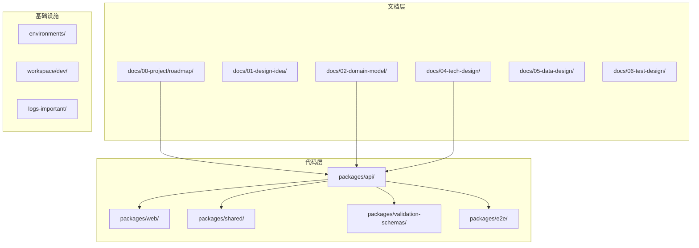
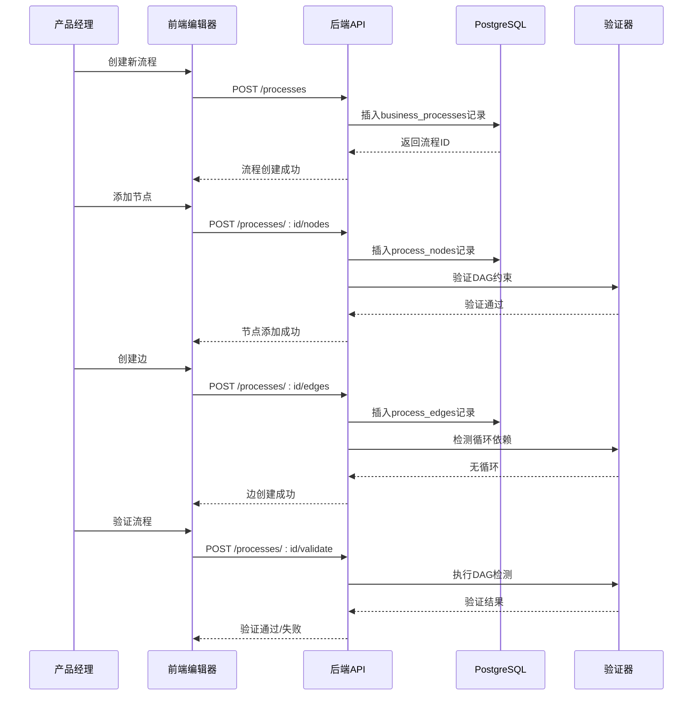
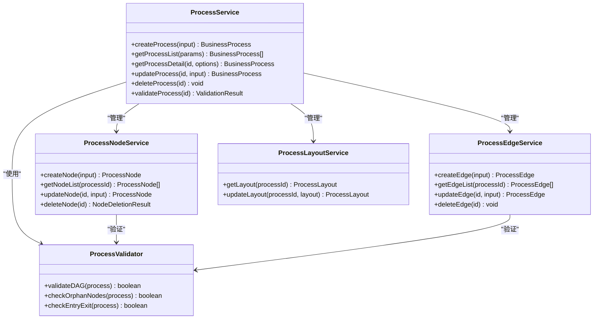
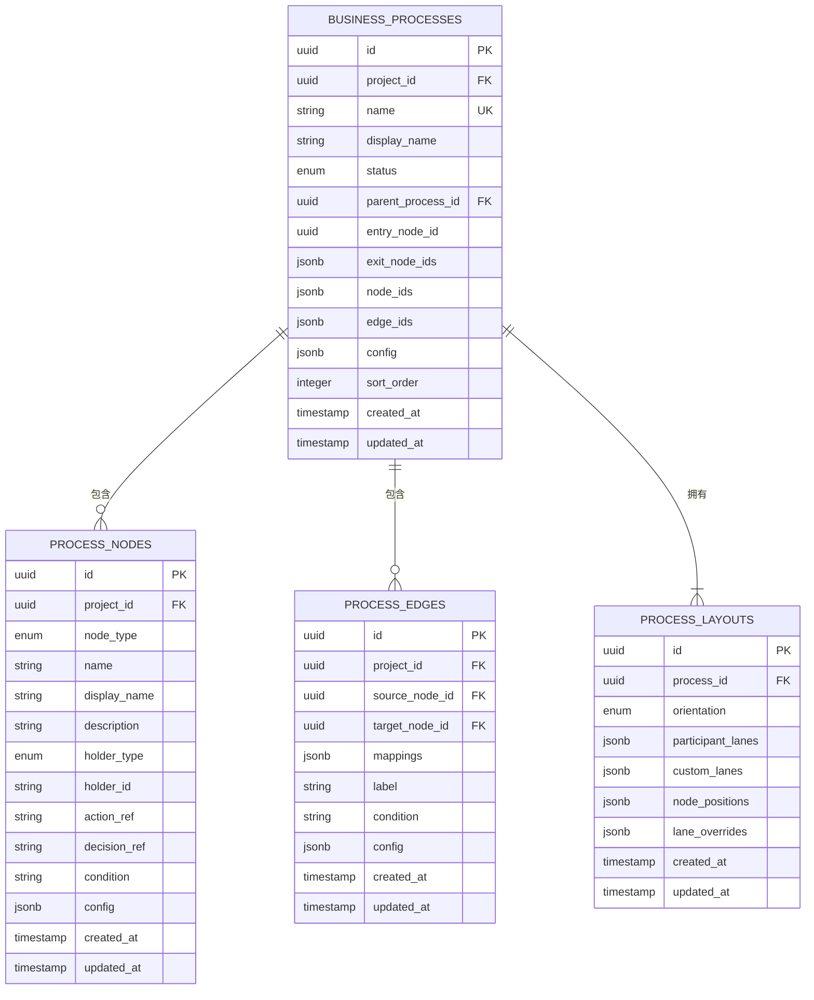
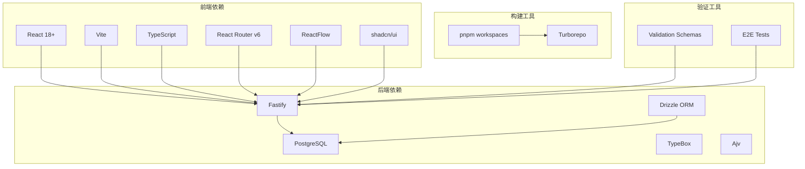
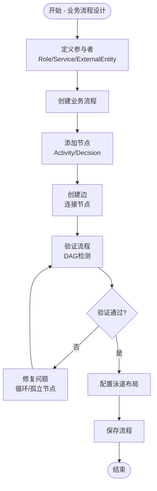

# 业务流程技术设计

<cite>
**本文档引用的文件**
- [README.md](file://README.md)
- [business-process.md](file://docs/02-domain-model/business-process.md)
- [m3-business-process-tech-design.md](file://docs/04-tech-design/modules/business-process/m3-business-process-tech-design.md)
- [domain-model.md](file://docs/02-domain-model/domain-model.md)
- [workflow.md](file://docs/01-design-idea/workflow.md)
- [schema.ts](file://packages/api/src/models/schema.ts)
- [process.service.ts](file://packages/api/src/services/process.service.ts)
</cite>

## 目录
1. [简介](#简介)
2. [项目结构](#项目结构)
3. [核心组件](#核心组件)
4. [架构概览](#架构概览)
5. [详细组件分析](#详细组件分析)
6. [依赖关系分析](#依赖关系分析)
7. [性能考虑](#性能考虑)
8. [故障排除指南](#故障排除指南)
9. [结论](#结论)

## 简介

AI原型管理系统是一个面向AI时代的软件产品定义与生命周期管理平台，专注于"给AI用的结构化语义"，确保原型中包含的业务逻辑、交互逻辑、数据关系等关键信息能够完整传递给下游Coding Agent。

本系统采用六阶段工作流：A. 理解业务 → B. 定义系统运转 → C. 定义人机接口 → D. 视觉与验证 → E. 与研发集成 → F. 与测试集成。

**核心定位**：传统原型工具（Figma/Sketch等）聚焦于"给人看的高保真视觉"，本项目聚焦于"给AI用的结构化语义"，确保原型中包含的业务逻辑、交互逻辑、数据关系等关键信息能够完整传递给下游Coding Agent。

## 项目结构

系统采用Monorepo架构，包含以下主要模块：



**图表来源**
- [README.md:32-52](file://README.md#L32-L52)

**章节来源**
- [README.md:1-52](file://README.md#L1-L52)

## 核心组件

### 业务流程系统架构

系统采用四层架构设计，从底层真相层到顶层架构层：

```mermaid
graph TB
subgraph "Layer 1: 全局节点池 + 边池"
A[processNodes[] - 全局节点池]
B[processEdges[] - 全局边池]
C[Project根级存储]
end
subgraph "Layer 2: 流程Process"
D[businessProcesses[] - 流程表]
E[nodeIds[] - 节点ID引用]
F[edgeIds[] - 边ID引用]
end
subgraph "Layer 3: 流程架构ProcessArchitecture"
G[树形分类导航]
H[架构节点]
I[processRef引用]
end
subgraph "Layer 4: 参与者Participants"
J[Role - 内部角色]
K[Service - 系统服务]
L[ExternalEntity - 外部实体]
end
A --> D
B --> D
D --> G
J --> A
K --> A
L --> A
```

**图表来源**
- [business-process.md:91-125](file://docs/02-domain-model/business-process.md#L91-L125)
- [business-process.md:471-515](file://docs/02-domain-model/business-process.md#L471-L515)

### 数据模型设计

系统采用JSONB数组存储流程引用，实现高效的数据访问：

| 表名 | 字段 | 类型 | 说明 |
|------|------|------|------|
| business_processes | node_ids | JSONB | 流程包含的节点ID数组 |
| business_processes | edge_ids | JSONB | 流程包含的边ID数组 |
| process_nodes | action_ref | TEXT | 活动节点引用的Action ID |
| process_nodes | decision_ref | TEXT | 决策节点引用的DecisionDef ID |
| process_layouts | participant_lanes | JSONB | 参与者泳道配置 |
| process_layouts | custom_lanes | JSONB | 自定义泳道配置 |

**章节来源**
- [m3-business-process-tech-design.md:56-217](file://docs/04-tech-design/modules/business-process/m3-business-process-tech-design.md#L56-L217)

## 架构概览

### 整体技术架构

```mermaid
graph TB
subgraph "前端层"
A[React + Vite + TypeScript]
B[shadcn/ui + React Router v6]
C[ReactFlow - 泳道编辑器]
end
subgraph "后端层"
D[Fastify + PostgreSQL]
E[Drizzle ORM]
F[TypeBox + Ajv]
end
subgraph "数据层"
G[PostgreSQL数据库]
H[JSONB数组存储]
I[索引优化]
end
subgraph "工具层"
J[Monorepo (pnpm workspaces)]
K[Turborepo]
L[OpenAPI规范]
end
A --> D
C --> D
D --> G
E --> G
H --> G
I --> G
J --> K
```

**图表来源**
- [README.md:24-31](file://README.md#L24-L31)

### 业务流程处理流程



**图表来源**
- [m3-business-process-tech-design.md:220-671](file://docs/04-tech-design/modules/business-process/m3-business-process-tech-design.md#L220-L671)

## 详细组件分析

### 流程服务组件



**图表来源**
- [m3-business-process-tech-design.md:983-1016](file://docs/04-tech-design/modules/business-process/m3-business-process-tech-design.md#L983-L1016)

### 数据库模式设计



**图表来源**
- [m3-business-process-tech-design.md:100-217](file://docs/04-tech-design/modules/business-process/m3-business-process-tech-design.md#L100-L217)

**章节来源**
- [schema.ts:155-169](file://packages/api/src/models/schema.ts#L155-L169)

### API端点设计

系统提供RESTful API端点，支持完整的CRUD操作：

| 功能模块 | HTTP方法 | 端点 | 描述 |
|----------|----------|------|------|
| 流程管理 | GET | `/api/v1/projects/:projectId/processes` | 列出项目下所有流程 |
| 流程管理 | POST | `/api/v1/projects/:projectId/processes` | 创建流程 |
| 流程管理 | GET | `/api/v1/projects/:projectId/processes/:processId` | 获取流程详情 |
| 节点管理 | POST | `/api/v1/projects/:projectId/processes/:processId/nodes` | 添加节点 |
| 节点管理 | PUT | `/api/v1/projects/:projectId/processes/:processId/nodes/:nodeId` | 更新节点 |
| 边管理 | POST | `/api/v1/projects/:projectId/processes/:processId/edges` | 创建边 |
| 边管理 | PUT | `/api/v1/projects/:projectId/processes/:processId/edges/:edgeId` | 更新边 |
| 验证 | POST | `/api/v1/projects/:projectId/processes/:processId/validate` | 验证流程 |

**章节来源**
- [m3-business-process-tech-design.md:220-430](file://docs/04-tech-design/modules/business-process/m3-business-process-tech-design.md#L220-L430)

## 依赖关系分析

### 技术栈依赖



**图表来源**
- [README.md:24-31](file://README.md#L24-L31)

### 核心业务流程



**图表来源**
- [workflow.md:104-245](file://docs/01-design-idea/workflow.md#L104-L245)

**章节来源**
- [process.service.ts:1-383](file://packages/api/src/services/process.service.ts#L1-L383)

## 性能考虑

### 数据库优化策略

1. **索引优化**
   - `business_processes(project_id)` - 项目级查询
   - `business_processes(parent_process_id)` - 父子流程查询
   - `process_nodes(project_id, holder_type, holder_id)` - 参与者查询
   - `process_layouts(process_id)` - 布局查询

2. **JSONB查询优化**
   - 使用GIN索引优化JSONB字段查询
   - 避免不必要的JSONB转换操作
   - 合理使用JSONB路径操作符

3. **缓存策略**
   - 流程详情缓存（30秒TTL）
   - 参与者定义缓存（5分钟TTL）
   - 验证结果缓存（10秒TTL）

### 前端性能优化

1. **React优化**
   - 使用React.memo优化组件渲染
   - 使用useCallback优化回调函数
   - 使用Suspense处理异步数据

2. **编辑器性能**
   - 虚拟滚动处理大量节点
   - 惰性加载泳道背景
   - 批量更新状态

## 故障排除指南

### 常见错误类型

| 错误代码 | 描述 | 可能原因 | 解决方案 |
|----------|------|----------|----------|
| NAME_CONFLICT | 流程名称冲突 | 同项目下名称重复 | 更换唯一名称 |
| INVALID_ENTRY_NODE | 入口节点无效 | 节点不属于流程 | 检查节点归属 |
| CYCLE_DETECTED | 检测到循环 | 流程图存在环 | 重新设计流程 |
| ORPHAN_NODE | 孤立节点 | 节点无入边或出边 | 添加连接边 |
| EDGE_ALREADY_EXISTS | 边已存在 | 同方向边重复 | 修改边配置 |

### 调试工具

1. **API调试**
   - 使用Postman测试端点
   - 查看请求/响应日志
   - 检查数据库事务状态

2. **前端调试**
   - Chrome DevTools检查React组件
   - Redux DevTools检查状态变化
   - Network面板检查API调用

**章节来源**
- [m3-business-process-tech-design.md:638-671](file://docs/04-tech-design/modules/business-process/m3-business-process-tech-design.md#L638-L671)

## 结论

AI原型管理系统通过四层架构设计实现了业务流程的结构化管理，采用全局节点池和边池的设计理念，确保了数据的一致性和可复用性。系统的技术选型合理，前后端分离清晰，数据库设计优化，为后续的功能扩展奠定了良好的基础。

核心优势包括：
- **结构化语义**：专注于给AI使用的结构化信息传递
- **四层架构**：从真相层到架构层的清晰分层设计
- **全局池设计**：节点和边的全局唯一性保证
- **双轨制产物**：语义层和视觉层分离的设计
- **完整工作流**：从理解业务到测试验证的全生命周期管理

该系统为AI时代的软件产品定义提供了创新的解决方案，通过"单一事实来源"的理念连接了产品定义、研发实现与测试验证的全链路。