# 后端开发

<cite>
**本文引用的文件**
- [README.md](file://README.md)
- [package.json](file://package.json)
- [turbo.json](file://turbo.json)
- [pnpm-workspace.yaml](file://pnpm-workspace.yaml)
- [packages/api/package.json](file://packages/api/package.json)
- [packages/api/src/app.ts](file://packages/api/src/app.ts)
- [packages/api/src/db.ts](file://packages/api/src/db.ts)
- [packages/api/drizzle/config.ts](file://packages/api/drizzle/config.ts)
- [packages/api/src/models/schema.ts](file://packages/api/src/models/schema.ts)
- [packages/api/src/models/relations.ts](file://packages/api/src/models/relations.ts)
- [packages/validation-schemas/src/index.ts](file://packages/validation-schemas/src/index.ts)
- [packages/validation-schemas/src/base.ts](file://packages/validation-schemas/src/base.ts)
- [packages/validation-schemas/src/response.ts](file://packages/validation-schemas/src/response.ts)
- [packages/validation-schemas/src/project.schema.ts](file://packages/validation-schemas/src/project.schema.ts)
- [packages/validation-schemas/src/application.schema.ts](file://packages/validation-schemas/src/application.schema.ts)
- [packages/validation-schemas/src/domain.schema.ts](file://packages/validation-schemas/src/domain.schema.ts)
- [packages/validation-schemas/src/organization.schema.ts](file://packages/validation-schemas/src/organization.schema.ts)
- [packages/validation-schemas/src/role-behavior.schema.ts](file://packages/validation-schemas/src/role-behavior.schema.ts)
- [packages/validation-schemas/src/external-entity-behavior.schema.ts](file://packages/validation-schemas/src/external-entity-behavior.schema.ts)
- [packages/api/src/services/common/errors.ts](file://packages/api/src/services/common/errors.ts)
- [packages/api/src/services/common/pagination.ts](file://packages/api/src/services/common/pagination.ts)
- [packages/api/src/routes/projects.ts](file://packages/api/src/routes/projects.ts)
- [packages/api/src/routes/domain.ts](file://packages/api/src/routes/domain.ts)
- [packages/api/src/routes/organization.ts](file://packages/api/src/routes/organization.ts)
- [packages/api/src/routes/applications.ts](file://packages/api/src/routes/applications.ts)
- [packages/api/src/routes/role-behavior.ts](file://packages/api/src/routes/role-behavior.ts)
- [packages/api/src/routes/external-entity-behavior.ts](file://packages/api/src/routes/external-entity-behavior.ts)
- [packages/api/tests/setup.ts](file://packages/api/tests/setup.ts)
- [packages/api/tests/helpers/api-test-client.ts](file://packages/api/tests/helpers/api-test-client.ts)
- [packages/api/tests/helpers/test-factory.ts](file://packages/api/tests/helpers/test-factory.ts)
- [packages/api/tests/project-management/f-m1-01-list.test.ts](file://packages/api/tests/project-management/f-m1-01-list.test.ts)
- [packages/api/tests/project-management/f-m1-02-create.test.ts](file://packages/api/tests/project-management/f-m1-02-create.test.ts)
- [packages/api/tests/project-management/f-m1-03-detail.test.ts](file://packages/api/tests/project-management/f-m1-03-detail.test.ts)
- [packages/api/tests/project-management/f-m1-04-edit.test.ts](file://packages/api/tests/project-management/f-m1-04-edit.test.ts)
- [packages/api/tests/project-management/f-m1-05-archive.test.ts](file://packages/api/tests/project-management/f-m1-05-archive.test.ts)
- [packages/api/tests/project-management/f-m1-06-company.test.ts](file://packages/api/tests/project-management/f-m1-06-company.test.ts)
- [packages/api/tests/project-management/f-m1-07-department.test.ts](file://packages/api/tests/project-management/f-m1-07-department.test.ts)
- [packages/api/tests/project-management/f-m1-08-roles.test.ts](file://packages/api/tests/project-management/f-m1-08-roles.test.ts)
- [packages/api/tests/project-management/f-m1-09-external-entities.test.ts](file://packages/api/tests/project-management/f-m1-09-external-entities.test.ts)
- [packages/api/tests/project-management/f-m1-11-application.test.ts](file://packages/api/tests/project-management/f-m1-11-application.test.ts)
- [packages/api/tests/project-management/f-m1-12-role-behavior.test.ts](file://packages/api/tests/project-management/f-m1-12-role-behavior.test.ts)
- [packages/api/tests/project-management/f-m1-13-external-entity-behavior.test.ts](file://packages/api/tests/project-management/f-m1-13-external-entity-behavior.test.ts)
- [packages/api/tests/domain-model/f-m2-01-entity.test.ts](file://packages/api/tests/domain-model/f-m2-01-entity.test.ts)
- [packages/api/tests/domain-model/f-m2-02-field.test.ts](file://packages/api/tests/domain-model/f-m2-02-field.test.ts)
- [packages/api/tests/domain-model/f-m2-03-relation.test.ts](file://packages/api/tests/domain-model/f-m2-03-relation.test.ts)
- [packages/api/tests/domain-model/f-m2-04-er-graph.test.ts](file://packages/api/tests/domain-model/f-m2-04-er-graph.test.ts)
- [packages/api/tests/openapi/openapi-schema.test.ts](file://packages/api/tests/openapi/openapi-schema.test.ts)
</cite>

## 更新摘要
**变更内容**
- 新增快照服务模块，支持项目上下文提取和MCP服务器集成
- 增强现有业务架构和服务管理能力
- 扩展服务层架构以支持新的快照功能
- 更新API路由设计以包含新的快照相关端点

## 目录
1. [引言](#引言)
2. [项目结构](#项目结构)
3. [核心组件](#核心组件)
4. [架构总览](#架构总览)
5. [详细组件分析](#详细组件分析)
6. [依赖分析](#依赖分析)
7. [性能考虑](#性能考虑)
8. [故障排查指南](#故障排查指南)
9. [结论](#结论)
10. [附录](#附录)

## 引言
本指南面向后端开发者，围绕基于 Fastify + Drizzle ORM 的 AI 原型管理系统后端，系统讲解插件体系、中间件与路由设计、数据库模型与查询优化、服务层架构与业务封装、TypeBox 验证模式与数据校验、API 路由设计规范与控制器实现、认证授权与安全策略、数据库迁移与版本管理、错误处理与日志记录、性能监控与调试工具、以及单元与集成测试策略。目标是帮助开发者构建高质量、可演进、可观测的 API 服务。

**更新** 新增了快照服务模块，支持项目上下文提取和MCP服务器集成，增强了业务架构和管理能力。

## 项目结构
- 采用 Monorepo 结构，使用 pnpm workspace + Turborepo 管理多包协作。
- 后端位于 packages/api，包含应用入口、数据库连接与 Drizzle 配置、数据模型与关系、各模块路由、服务层、验证模式、测试等。
- 文档与路线图位于 docs，涵盖领域模型、技术设计、测试设计、部署设计等。

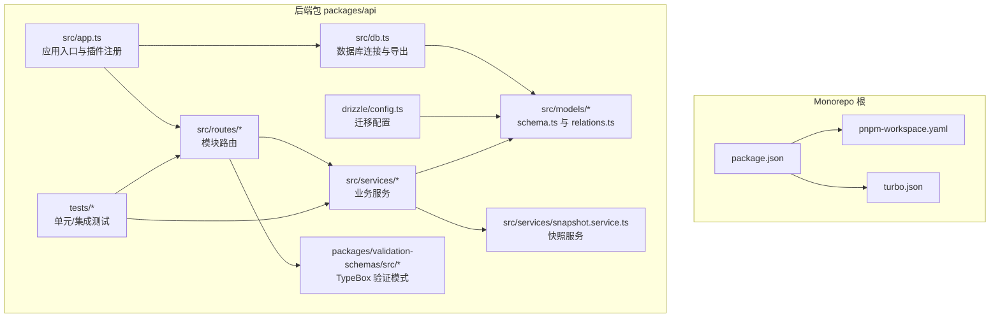

图表来源
- [packages/api/src/app.ts:1-178](file://packages/api/src/app.ts#L1-L178)
- [packages/api/src/db.ts:1-25](file://packages/api/src/db.ts#L1-L25)
- [packages/api/drizzle/config.ts:1-11](file://packages/api/drizzle/config.ts#L1-L11)
- [packages/api/src/models/schema.ts:1-531](file://packages/api/src/models/schema.ts#L1-L531)
- [packages/api/src/models/relations.ts:1-283](file://packages/api/src/models/relations.ts#L1-L283)
- [packages/api/package.json:1-1](file://packages/api/package.json#L1-L1)

章节来源
- [README.md:1-52](file://README.md#L1-L52)
- [pnpm-workspace.yaml:1-3](file://pnpm-workspace.yaml#L1-L3)
- [turbo.json:1-1](file://turbo.json#L1-L1)
- [package.json:1-2](file://package.json#L1-L2)

## 核心组件
- 应用入口与插件体系：Fastify 实例初始化、CORS、OpenAPI/Swagger、Scalar 文档、统一错误处理、请求日志装饰器、健康检查、模块路由注册。
- 数据库层：Drizzle ORM + postgres-js，连接字符串校验、迁移专用连接、Schema 与 Relations 定义。
- 验证层：TypeBox Schema + Ajv（由 Fastify Swagger 集成），用于请求/响应校验与 OpenAPI 合约。
- 服务层：按模块划分的服务类，封装业务规则、事务与数据访问，新增快照服务支持项目上下文提取。
- 路由层：按功能域模块化路由，统一前缀与命名空间。
- 测试：Vitest + 测试工厂 + API 测试客户端，覆盖项目管理与领域模型等模块。

**更新** 新增了快照服务，提供项目上下文提取和MCP服务器集成功能。

章节来源
- [packages/api/src/app.ts:1-178](file://packages/api/src/app.ts#L1-L178)
- [packages/api/src/db.ts:1-25](file://packages/api/src/db.ts#L1-L25)
- [packages/api/src/models/schema.ts:1-531](file://packages/api/src/models/schema.ts#L1-L531)
- [packages/api/src/models/relations.ts:1-283](file://packages/api/src/models/relations.ts#L1-L283)
- [packages/validation-schemas/src/index.ts](file://packages/validation-schemas/src/index.ts)
- [packages/api/package.json:1-1](file://packages/api/package.json#L1-L1)

## 架构总览
后端采用"路由 → 服务 → 数据库"的清晰分层，配合 Drizzle ORM 的强类型模型与关系映射，实现领域模型的完整落地。OpenAPI/Swagger 提供契约文档，Scalar UI 提供交互式文档。统一错误处理与请求日志装饰器保障可观测性。

**更新** 架构中新增了快照服务层，支持项目上下文提取和MCP服务器集成，增强了系统的智能化能力。

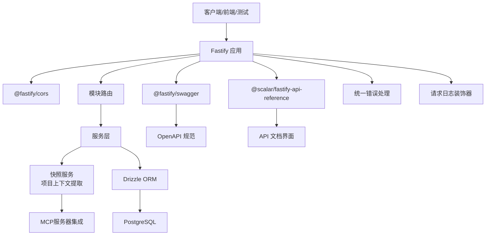

图表来源
- [packages/api/src/app.ts:1-178](file://packages/api/src/app.ts#L1-L178)
- [packages/api/src/db.ts:1-25](file://packages/api/src/db.ts#L1-L25)

## 详细组件分析

### 应用入口与插件体系（Fastify）
- 插件注册顺序与职责明确：CORS → OpenAPI/Swagger → Scalar 文档 → 健康检查 → 模块路由 → 错误处理 → 日志装饰器。
- OpenAPI 规范包含版本、联系人、服务器列表、标签与安全方案（Bearer JWT，Phase 2+ 启用）。
- 健康检查通过数据库连通性探测，返回状态与时间戳。
- 模块路由注册采用前缀化，便于扩展与隔离。

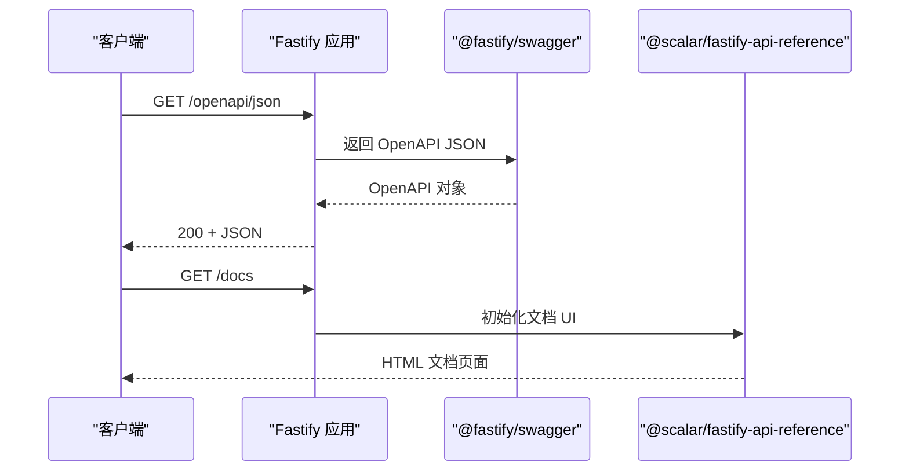

图表来源
- [packages/api/src/app.ts:66-67](file://packages/api/src/app.ts#L66-L67)
- [packages/api/src/app.ts:59-64](file://packages/api/src/app.ts#L59-L64)

章节来源
- [packages/api/src/app.ts:1-178](file://packages/api/src/app.ts#L1-L178)

### 中间件与钩子（日志与错误处理）
- onRequest 钩子记录请求开始时间；onResponse 钩子计算耗时并输出 debug 日志。
- setErrorHandler 统一处理已知业务错误（4xx）与未知异常（500），隐藏堆栈并返回结构化错误响应，包含请求 ID 以便追踪。

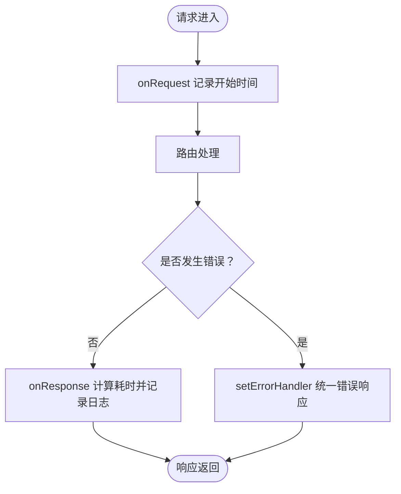

图表来源
- [packages/api/src/app.ts:104-113](file://packages/api/src/app.ts#L104-L113)
- [packages/api/src/app.ts:73-98](file://packages/api/src/app.ts#L73-L98)

章节来源
- [packages/api/src/app.ts:73-113](file://packages/api/src/app.ts#L73-L113)

### 数据库连接与 Drizzle 配置
- 连接字符串必须通过环境变量提供，否则抛出明确错误提示。
- 使用 postgres-js 建立连接，drizzle 包装为 ORM，并注入 schema。
- 迁移使用独立连接（prepare=false）避免预编译缓存干扰。

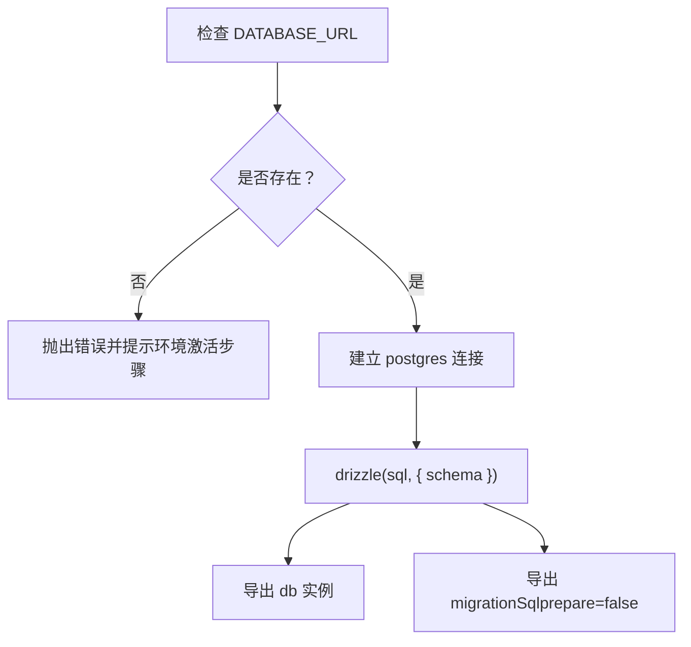

图表来源
- [packages/api/src/db.ts:5-22](file://packages/api/src/db.ts#L5-L22)

章节来源
- [packages/api/src/db.ts:1-25](file://packages/api/src/db.ts#L1-L25)
- [packages/api/drizzle/config.ts:1-11](file://packages/api/drizzle/config.ts#L1-L11)

### 数据模型与关系（Schema 与 Relations）
- Schema 定义了项目、领域模型、实体字段、实体关系、业务流程、流程节点/边、应用/页面、组织与角色、外部实体、业务架构、菜单等核心表，包含索引与约束。
- Relations 定义了表之间的关联关系，包括自引用（父子/树形）与多对多映射，确保查询时可按需加载关联数据。
- 通过 JSONB 字段存储 UI 元数据与配置，降低频繁 DDL 变更成本。

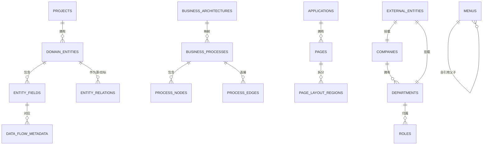

图表来源
- [packages/api/src/models/schema.ts:1-531](file://packages/api/src/models/schema.ts#L1-L531)
- [packages/api/src/models/relations.ts:1-283](file://packages/api/src/models/relations.ts#L1-L283)

章节来源
- [packages/api/src/models/schema.ts:1-531](file://packages/api/src/models/schema.ts#L1-L531)
- [packages/api/src/models/relations.ts:1-283](file://packages/api/src/models/relations.ts#L1-L283)

### 服务层架构与业务封装
- 服务层按模块划分（项目、领域、组织、应用、角色行为、外部实体行为等），封装业务规则与数据访问。
- 通用错误与分页工具位于 services/common，便于跨模块复用。
- 服务层负责事务边界、数据一致性与复杂查询组装，路由层只做参数解析与结果包装。
- **新增** 快照服务提供项目上下文提取功能，支持MCP服务器集成，为AI代理提供结构化项目信息。

**更新** 新增了快照服务，增强了业务架构和管理能力，支持项目上下文的智能提取和MCP协议集成。

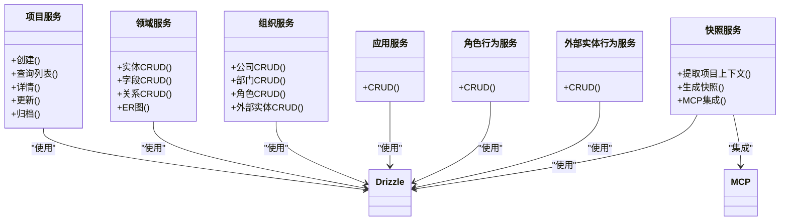

图表来源
- [packages/api/src/services/common/errors.ts](file://packages/api/src/services/common/errors.ts)
- [packages/api/src/services/common/pagination.ts](file://packages/api/src/services/common/pagination.ts)
- [packages/api/src/services/project.service.ts](file://packages/api/src/services/project.service.ts)
- [packages/api/src/services/domain.service.ts](file://packages/api/src/services/domain.service.ts)
- [packages/api/src/services/organization.service.ts](file://packages/api/src/services/organization.service.ts)
- [packages/api/src/services/application.service.ts](file://packages/api/src/services/application.service.ts)
- [packages/api/src/services/role-behavior.service.ts](file://packages/api/src/services/role-behavior.service.ts)
- [packages/api/src/services/external-entity-behavior.service.ts](file://packages/api/src/services/external-entity-behavior.service.ts)

章节来源
- [packages/api/src/services/common/errors.ts](file://packages/api/src/services/common/errors.ts)
- [packages/api/src/services/common/pagination.ts](file://packages/api/src/services/common/pagination.ts)

### TypeBox 验证模式与数据校验
- 验证模式集中于 packages/validation-schemas，包含基础模式、响应模式、以及各模块的请求/响应模式。
- TypeBox Schema 与 Ajv 结合，由 Fastify Swagger 集成，既用于运行时校验，也用于生成 OpenAPI 合约。
- 建议在路由层使用 TypeBox 校验请求体/参数/查询，服务层补充业务规则校验。

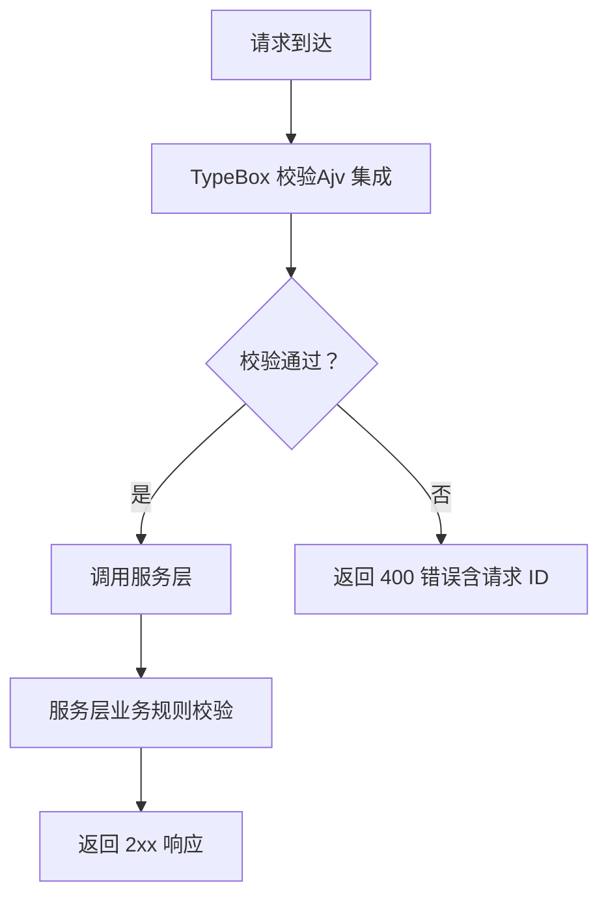

图表来源
- [packages/validation-schemas/src/index.ts](file://packages/validation-schemas/src/index.ts)
- [packages/validation-schemas/src/base.ts](file://packages/validation-schemas/src/base.ts)
- [packages/validation-schemas/src/response.ts](file://packages/validation-schemas/src/response.ts)
- [packages/validation-schemas/src/project.schema.ts](file://packages/validation-schemas/src/project.schema.ts)
- [packages/validation-schemas/src/application.schema.ts](file://packages/validation-schemas/src/application.schema.ts)
- [packages/validation-schemas/src/domain.schema.ts](file://packages/validation-schemas/src/domain.schema.ts)
- [packages/validation-schemas/src/organization.schema.ts](file://packages/validation-schemas/src/organization.schema.ts)
- [packages/validation-schemas/src/role-behavior.schema.ts](file://packages/validation-schemas/src/role-behavior.schema.ts)
- [packages/validation-schemas/src/external-entity-behavior.schema.ts](file://packages/validation-schemas/src/external-entity-behavior.schema.ts)

章节来源
- [packages/validation-schemas/src/index.ts](file://packages/validation-schemas/src/index.ts)
- [packages/validation-schemas/src/base.ts](file://packages/validation-schemas/src/base.ts)
- [packages/validation-schemas/src/response.ts](file://packages/validation-schemas/src/response.ts)

### API 路由设计规范与控制器实现
- 路由按模块注册，统一前缀与命名空间，便于扩展与维护。
- 控制器职责：参数解析、调用服务、结果包装、错误转换。
- 建议遵循 REST 风格，使用标准 HTTP 方法与状态码；对复杂查询使用查询参数与分页。

**更新** 新增了快照相关的API路由，支持项目上下文提取和MCP服务器集成接口。

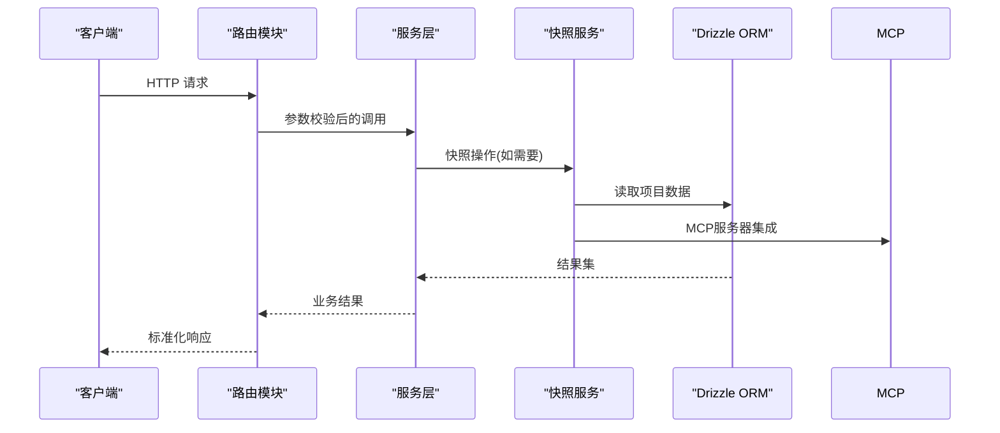

图表来源
- [packages/api/src/routes/projects.ts](file://packages/api/src/routes/projects.ts)
- [packages/api/src/routes/domain.ts](file://packages/api/src/routes/domain.ts)
- [packages/api/src/routes/organization.ts](file://packages/api/src/routes/organization.ts)
- [packages/api/src/routes/applications.ts](file://packages/api/src/routes/applications.ts)
- [packages/api/src/routes/role-behavior.ts](file://packages/api/src/routes/role-behavior.ts)
- [packages/api/src/routes/external-entity-behavior.ts](file://packages/api/src/routes/external-entity-behavior.ts)

章节来源
- [packages/api/src/routes/projects.ts](file://packages/api/src/routes/projects.ts)
- [packages/api/src/routes/domain.ts](file://packages/api/src/routes/domain.ts)
- [packages/api/src/routes/organization.ts](file://packages/api/src/routes/organization.ts)
- [packages/api/src/routes/applications.ts](file://packages/api/src/routes/applications.ts)
- [packages/api/src/routes/role-behavior.ts](file://packages/api/src/routes/role-behavior.ts)
- [packages/api/src/routes/external-entity-behavior.ts](file://packages/api/src/routes/external-entity-behavior.ts)

### 认证授权中间件与安全策略
- OpenAPI 安全方案已声明 Bearer JWT，当前 Phase 为占位，后续在中间件中启用。
- 建议在路由层增加鉴权钩子，对受保护资源进行身份校验与权限判定。
- 建议结合 Fastify Request/Reply 扩展，统一注入用户上下文与权限边界。

章节来源
- [packages/api/src/app.ts:47-54](file://packages/api/src/app.ts#L47-L54)

### 数据库迁移与版本管理
- Drizzle Kit 配置指向 schema 文件与迁移输出目录，使用 DATABASE_URL 作为凭据。
- 迁移脚本在 packages/api/package.json 中定义：generate、migrate、studio、seed。
- 建议每次模型变更先生成迁移，再在测试/预发布环境验证，最后在生产灰度发布。

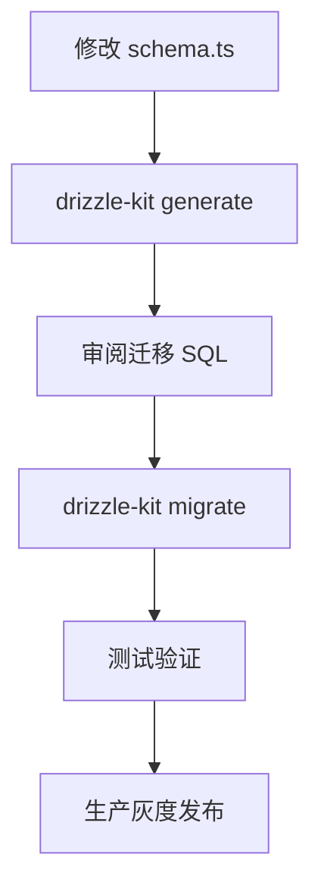

图表来源
- [packages/api/drizzle/config.ts:1-11](file://packages/api/drizzle/config.ts#L1-L11)
- [packages/api/package.json:1-1](file://packages/api/package.json#L1-L1)

章节来源
- [packages/api/drizzle/config.ts:1-11](file://packages/api/drizzle/config.ts#L1-L11)
- [packages/api/package.json:1-1](file://packages/api/package.json#L1-L1)

### 错误处理与日志记录最佳实践
- 统一错误处理：区分业务错误（4xx）与系统异常（500），返回结构化错误体，包含 code、message、requestId。
- 日志装饰器：记录 method、url、statusCode、耗时，便于性能与问题追踪。
- 建议：敏感信息脱敏、错误堆栈仅在开发环境输出、统一请求 ID 串联链路日志。

章节来源
- [packages/api/src/app.ts:73-113](file://packages/api/src/app.ts#L73-L113)

### 性能监控与调试工具使用指南
- 性能指标：基于 onResponse 钩子统计耗时，建议接入 Prometheus/Grafana 或日志分析平台。
- 调试：开启 LOG_LEVEL=debug，结合 Scalar 文档与 OpenAPI JSON 排查契约与实现偏差。
- 数据库：使用 drizzle-kit studio 查看与调试迁移与数据；对慢查询使用 EXPLAIN 分析索引与 JOIN。

章节来源
- [packages/api/src/app.ts:108-113](file://packages/api/src/app.ts#L108-L113)
- [packages/api/package.json:1-1](file://packages/api/package.json#L1-L1)

### 单元测试与集成测试策略
- 测试框架：Vitest，测试入口与工厂方法位于 tests/ 目录。
- 测试客户端：提供 API 测试客户端与测试工厂，便于构造测试数据与发起请求。
- 覆盖范围：项目管理模块（列表/创建/详情/编辑/归档/公司/部门/角色/外部实体/应用/角色行为/外部实体行为）与领域模型模块（实体/字段/关系/ER 图）。
- OpenAPI 合约测试：确保实现与契约一致。

**更新** 测试策略应扩展到新的快照服务和MCP集成功能，确保新功能的质量和稳定性。

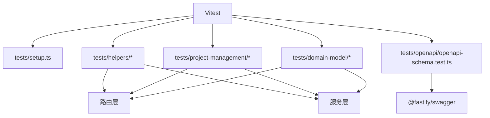

图表来源
- [packages/api/tests/setup.ts](file://packages/api/tests/setup.ts)
- [packages/api/tests/helpers/api-test-client.ts](file://packages/api/tests/helpers/api-test-client.ts)
- [packages/api/tests/helpers/test-factory.ts](file://packages/api/tests/helpers/test-factory.ts)
- [packages/api/tests/project-management/f-m1-01-list.test.ts](file://packages/api/tests/project-management/f-m1-01-list.test.ts)
- [packages/api/tests/project-management/f-m1-02-create.test.ts](file://packages/api/tests/project-management/f-m1-02-create.test.ts)
- [packages/api/tests/project-management/f-m1-03-detail.test.ts](file://packages/api/tests/project-management/f-m1-03-detail.test.ts)
- [packages/api/tests/project-management/f-m1-04-edit.test.ts](file://packages/api/tests/project-management/f-m1-04-edit.test.ts)
- [packages/api/tests/project-management/f-m1-05-archive.test.ts](file://packages/api/tests/project-management/f-m1-05-archive.test.ts)
- [packages/api/tests/project-management/f-m1-06-company.test.ts](file://packages/api/tests/project-management/f-m1-06-company.test.ts)
- [packages/api/tests/project-management/f-m1-07-department.test.ts](file://packages/api/tests/project-management/f-m1-07-department.test.ts)
- [packages/api/tests/project-management/f-m1-08-roles.test.ts](file://packages/api/tests/project-management/f-m1-08-roles.test.ts)
- [packages/api/tests/project-management/f-m1-09-external-entities.test.ts](file://packages/api/tests/project-management/f-m1-09-external-entities.test.ts)
- [packages/api/tests/project-management/f-m1-11-application.test.ts](file://packages/api/tests/project-management/f-m1-11-application.test.ts)
- [packages/api/tests/project-management/f-m1-12-role-behavior.test.ts](file://packages/api/tests/project-management/f-m1-12-role-behavior.test.ts)
- [packages/api/tests/project-management/f-m1-13-external-entity-behavior.test.ts](file://packages/api/tests/project-management/f-m1-13-external-entity-behavior.test.ts)
- [packages/api/tests/domain-model/f-m2-01-entity.test.ts](file://packages/api/tests/domain-model/f-m2-01-entity.test.ts)
- [packages/api/tests/domain-model/f-m2-02-field.test.ts](file://packages/api/tests/domain-model/f-m2-02-field.test.ts)
- [packages/api/tests/domain-model/f-m2-03-relation.test.ts](file://packages/api/tests/domain-model/f-m2-03-relation.test.ts)
- [packages/api/tests/domain-model/f-m2-04-er-graph.test.ts](file://packages/api/tests/domain-model/f-m2-04-er-graph.test.ts)
- [packages/api/tests/openapi/openapi-schema.test.ts](file://packages/api/tests/openapi/openapi-schema.test.ts)

章节来源
- [packages/api/tests/setup.ts](file://packages/api/tests/setup.ts)
- [packages/api/tests/helpers/api-test-client.ts](file://packages/api/tests/helpers/api-test-client.ts)
- [packages/api/tests/helpers/test-factory.ts](file://packages/api/tests/helpers/test-factory.ts)
- [packages/api/tests/openapi/openapi-schema.test.ts](file://packages/api/tests/openapi/openapi-schema.test.ts)

## 依赖分析
- 应用依赖 Fastify、@fastify/cors、@fastify/swagger、@scalar/fastify-api-reference、drizzle-orm、postgres、@sinclair/typebox 等。
- Monorepo 通过 pnpm workspace 管理共享依赖，Turborepo 管理任务流水线与缓存。
- 依赖耦合集中在路由 → 服务 → 数据库，验证模式独立于实现，便于替换与扩展。

**更新** 新增了对MCP服务器集成的依赖支持，增强了系统的AI代理集成能力。

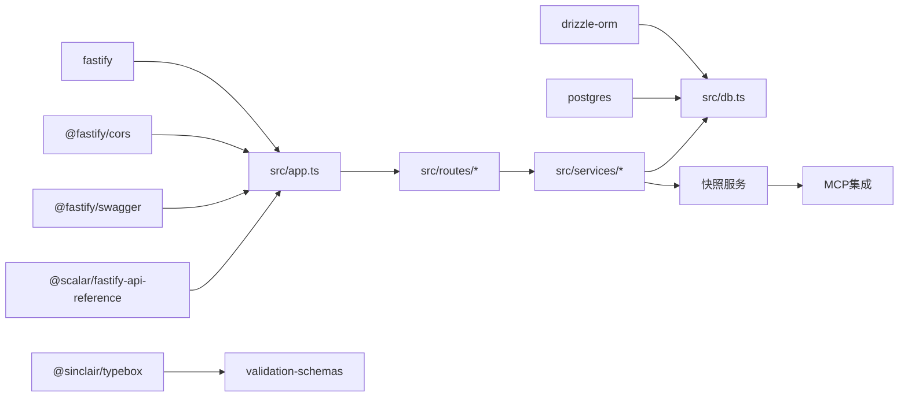

图表来源
- [packages/api/package.json:1-1](file://packages/api/package.json#L1-L1)
- [packages/api/src/app.ts:1-10](file://packages/api/src/app.ts#L1-L10)
- [packages/api/src/db.ts:1-3](file://packages/api/src/db.ts#L1-L3)

章节来源
- [packages/api/package.json:1-1](file://packages/api/package.json#L1-L1)
- [turbo.json:1-1](file://turbo.json#L1-L1)
- [pnpm-workspace.yaml:1-3](file://pnpm-workspace.yaml#L1-L3)

## 性能考虑
- 数据库层面：合理使用索引（唯一索引、普通索引）与 JSONB 字段；避免 N+1 查询，优先使用 relations 预加载。
- 应用层面：利用 onResponse 钩子统计耗时，识别慢路由；对批量操作使用分页与并发限制。
- ORM 层面：drizzle 默认使用预编译语句，迁移使用非预编译连接，避免缓存干扰。
- 文档与契约：通过 OpenAPI/Swagger 与 Scalar 文档，减少前后端沟通成本，提高联调效率。
- **新增** 快照服务应考虑异步处理和缓存机制，避免阻塞主请求链路。

**更新** 新增了快照服务的性能考虑，建议使用异步处理和缓存机制来优化项目上下文提取的性能。

章节来源
- [packages/api/src/models/schema.ts:1-531](file://packages/api/src/models/schema.ts#L1-L531)
- [packages/api/src/db.ts:16-22](file://packages/api/src/db.ts#L16-L22)
- [packages/api/src/app.ts:108-113](file://packages/api/src/app.ts#L108-L113)

## 故障排查指南
- 环境变量缺失：DATABASE_URL 未设置会抛出错误，需先激活环境或使用重启脚本。
- 健康检查失败：检查数据库连通性与连接字符串；关注 degraded 状态与数据库不可达提示。
- 统一错误处理：查看错误响应中的 code、message、requestId，结合日志定位问题。
- 迁移问题：使用 drizzle-kit studio 检查迁移状态与数据；确认迁移 SQL 与 schema 一致。
- **新增** MCP集成问题：检查MCP服务器连接状态和网络配置；验证MCP协议兼容性。

**更新** 新增了MCP服务器集成的故障排查指南，帮助开发者快速定位和解决MCP相关问题。

章节来源
- [packages/api/src/db.ts:5-12](file://packages/api/src/db.ts#L5-L12)
- [packages/api/src/app.ts:119-130](file://packages/api/src/app.ts#L119-L130)
- [packages/api/src/app.ts:73-98](file://packages/api/src/app.ts#L73-L98)
- [packages/api/drizzle/config.ts:7-10](file://packages/api/drizzle/config.ts#L7-L10)

## 结论
本指南从架构、实现、测试与运维四个维度，系统阐述了基于 Fastify + Drizzle ORM 的后端开发要点。通过模块化路由、强类型的 Drizzle 模型、TypeBox 验证与 OpenAPI 合约、统一错误处理与日志装饰器、完善的测试策略与迁移管理，可构建高质量、可演进、可观测的 API 服务。

**更新** 新增的快照服务和MCP集成能力进一步增强了系统的智能化水平，为AI代理提供了强大的项目上下文支持和标准化的通信接口。建议在后续迭代中逐步完善认证授权中间件、性能监控与告警、以及更丰富的业务服务封装。

## 附录
- 开发命令与脚本：dev、build、lint、test、test:e2e、db:generate、db:migrate、db:studio、db:seed。
- 环境变量：LOG_LEVEL、API_PORT、API_HOST、DATABASE_URL；通过 environments 下脚本激活与重启。

章节来源
- [packages/api/package.json:1-1](file://packages/api/package.json#L1-L1)
- [packages/api/src/app.ts:164-175](file://packages/api/src/app.ts#L164-L175)