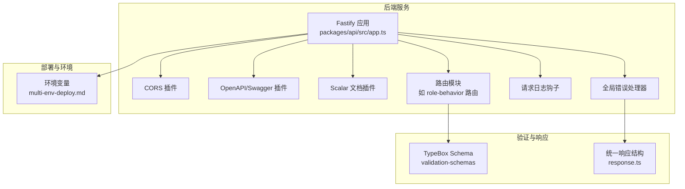
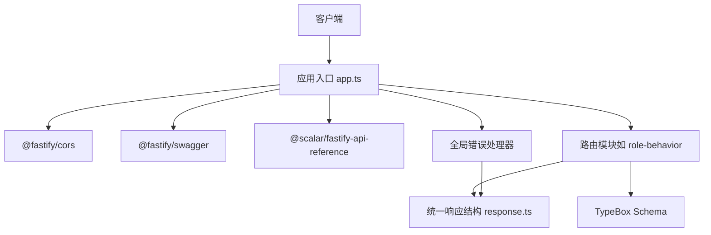
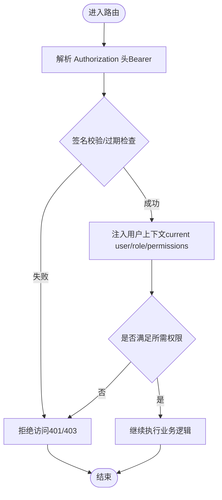
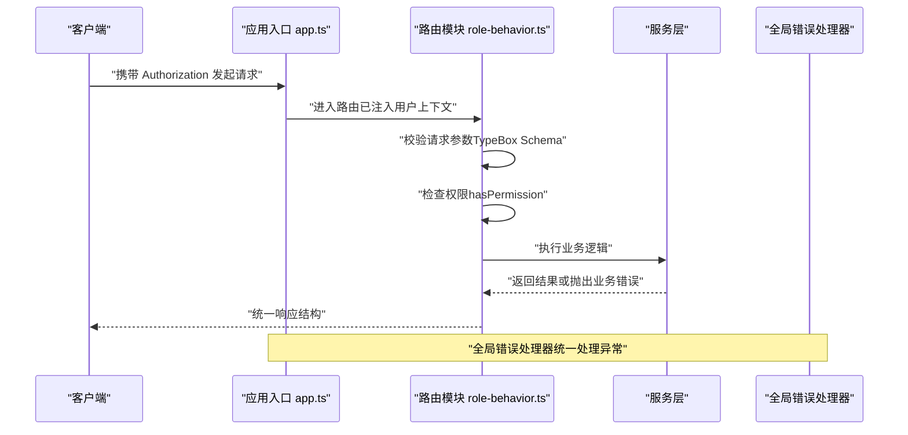
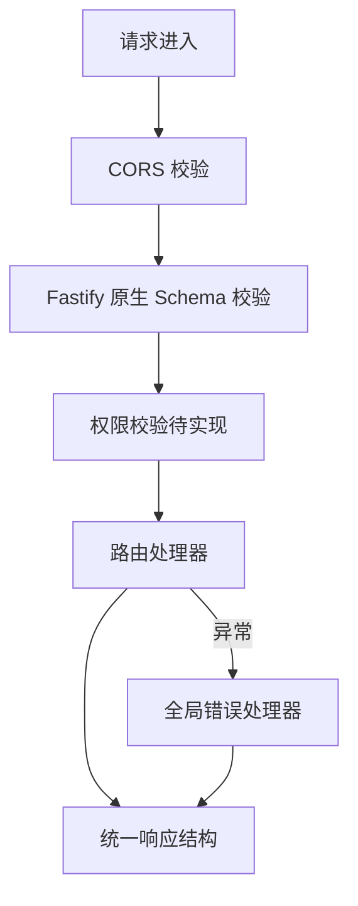
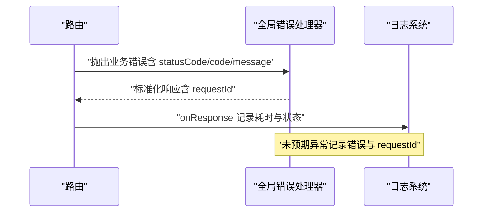
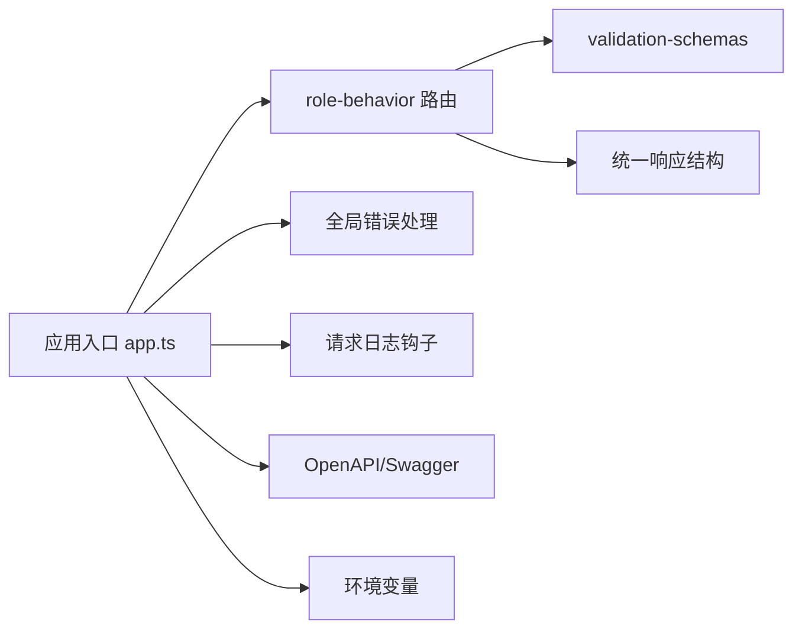

# 安全认证

<cite>
**本文引用的文件**
- [packages/api/src/app.ts](file://packages/api/src/app.ts)
- [packages/api/src/routes/role-behavior.ts](file://packages/api/src/routes/role-behavior.ts)
- [packages/api/src/services/common/errors.ts](file://packages/api/src/services/common/errors.ts)
- [packages/validation-schemas/src/response.ts](file://packages/validation-schemas/src/response.ts)
- [docs/02-domain-model/app-shared-resources.md](file://docs/02-domain-model/app-shared-resources.md)
- [docs/04-tech-design/phase1-infrastructure-plan.md](file://docs/04-tech-design/phase1-infrastructure-plan.md)
- [docs/07-deploy-design/multi-env-deploy.md](file://docs/07-deploy-design/multi-env-deploy.md)
- [docs/superpowers/plans/2026-05-14-openapi-contract.md](file://docs/superpowers/plans/2026-05-14-openapi-contract.md)
</cite>

## 目录
1. [引言](#引言)
2. [项目结构](#项目结构)
3. [核心组件](#核心组件)
4. [架构总览](#架构总览)
5. [详细组件分析](#详细组件分析)
6. [依赖关系分析](#依赖关系分析)
7. [性能考虑](#性能考虑)
8. [故障排查指南](#故障排查指南)
9. [结论](#结论)
10. [附录](#附录)

## 引言
本指南面向“AI原型管理系统”的后端安全认证与授权体系，聚焦于用户身份验证、权限控制、JWT令牌管理、会话处理、API访问控制与资源权限验证、安全中间件开发与配置、数据验证与输入清理、错误处理与安全日志记录，并结合现有代码库给出可落地的最佳实践与实现建议。当前系统在技术设计上已明确引入 OpenAPI 3.0 与 Fastify 原生 schema 校验，同时在应用入口中预留了 JWT Bearer 认证方案（Phase 2+ 启用）。本文将基于仓库中的实际实现与设计文档进行系统化梳理。

## 项目结构
后端位于 packages/api，采用 Fastify 作为 Web 框架，通过插件化注册路由模块与中间件。全局错误处理、CORS、OpenAPI/Swagger 与 Scalar 文档均已集成。权限模型与角色-行为在领域模型文档中有清晰定义，为后续接入认证授权提供依据。

图表来源
- [packages/api/src/app.ts:12-65](file://packages/api/src/app.ts#L12-L65)
- [packages/api/src/app.ts:70-99](file://packages/api/src/app.ts#L70-L99)
- [packages/api/src/routes/role-behavior.ts:1-30](file://packages/api/src/routes/role-behavior.ts#L1-L30)
- [packages/validation-schemas/src/response.ts:1-120](file://packages/validation-schemas/src/response.ts#L1-L120)
- [docs/07-deploy-design/multi-env-deploy.md:104-146](file://docs/07-deploy-design/multi-env-deploy.md#L104-L146)

章节来源
- [packages/api/src/app.ts:1-181](file://packages/api/src/app.ts#L1-L181)
- [packages/api/src/routes/role-behavior.ts:1-208](file://packages/api/src/routes/role-behavior.ts#L1-L208)
- [packages/validation-schemas/src/response.ts:1-120](file://packages/validation-schemas/src/response.ts#L1-L120)
- [docs/07-deploy-design/multi-env-deploy.md:104-146](file://docs/07-deploy-design/multi-env-deploy.md#L104-L146)

## 核心组件
- 应用入口与中间件
  - CORS、OpenAPI/Swagger、Scalar 文档、全局错误处理、请求日志钩子均在应用入口集中配置，形成统一的安全与可观测性基线。
- 路由与校验
  - 路由模块普遍采用 Fastify 原生 schema 与 TypeBox 定义请求/响应结构，减少自定义中间件负担，提升契约一致性与可维护性。
- 错误处理与响应
  - 全局错误处理器对业务错误与未预期异常进行区分处理，并通过统一响应结构返回，便于前端与监控系统消费。
- 权限与角色模型
  - 领域模型文档定义了角色、权限字符串格式、组件级权限绑定方式，为后续接入认证授权提供数据与行为边界。

章节来源
- [packages/api/src/app.ts:12-65](file://packages/api/src/app.ts#L12-L65)
- [packages/api/src/app.ts:70-99](file://packages/api/src/app.ts#L70-L99)
- [packages/api/src/routes/role-behavior.ts:8-25](file://packages/api/src/routes/role-behavior.ts#L8-L25)
- [packages/validation-schemas/src/response.ts:1-120](file://packages/validation-schemas/src/response.ts#L1-L120)
- [docs/02-domain-model/app-shared-resources.md:290-334](file://docs/02-domain-model/app-shared-resources.md#L290-L334)

## 架构总览
下图展示了认证授权在系统中的位置与交互：应用入口负责注册安全相关插件与中间件；路由层通过 schema 定义与校验；服务层执行业务逻辑；错误处理与响应统一封装；OpenAPI/Swagger 提供契约与文档支持。

图表来源
- [packages/api/src/app.ts:12-65](file://packages/api/src/app.ts#L12-L65)
- [packages/api/src/app.ts:70-99](file://packages/api/src/app.ts#L70-L99)
- [packages/api/src/routes/role-behavior.ts:8-25](file://packages/api/src/routes/role-behavior.ts#L8-L25)
- [packages/validation-schemas/src/response.ts:1-120](file://packages/validation-schemas/src/response.ts#L1-L120)

## 详细组件分析

### 1) 用户身份验证与权限控制设计
- 设计要点
  - 权限字符串格式采用“资源:操作”，支持通配符“*”表示全部操作。
  - 角色具备一组权限集合，组件级权限可通过声明式注解或 Hook 条件绑定。
  - 当前应用入口已预留 JWT Bearer 认证方案（Phase 2+ 启用），OpenAPI 中亦声明了安全方案。
- 实施建议
  - 在应用入口中注册认证中间件（如 JWT 验证），在 onRequest 钩子中解析与注入用户上下文。
  - 将权限判断封装为可复用的辅助函数，供路由层调用，确保一致的授权语义。
  - 对敏感操作（创建/更新/删除）与只读操作（查询）进行区分，严格限制权限范围。

图表来源
- [packages/api/src/app.ts:26-58](file://packages/api/src/app.ts#L26-L58)
- [docs/02-domain-model/app-shared-resources.md:310-334](file://docs/02-domain-model/app-shared-resources.md#L310-L334)

章节来源
- [docs/02-domain-model/app-shared-resources.md:290-334](file://docs/02-domain-model/app-shared-resources.md#L290-L334)
- [packages/api/src/app.ts:26-58](file://packages/api/src/app.ts#L26-L58)

### 2) JWT 令牌管理与会话处理
- 当前状态
  - 应用入口已声明 OpenAPI 的 JWT Bearer 安全方案，但未在代码中实现具体中间件。
- 建议实现
  - 在 onRequest 钩子中解析 Authorization 头，验证签名与有效期，解析出用户标识与角色信息。
  - 将用户上下文注入到 request 对象（例如 request.user），供后续路由与服务层使用。
  - 对于短期会话，可采用短期 JWT；对于长期会话，建议结合刷新令牌与黑名单策略（需在 Phase 2+ 实施）。

章节来源
- [packages/api/src/app.ts:26-58](file://packages/api/src/app.ts#L26-L58)

### 3) API 访问控制与资源权限验证
- 当前实现
  - 路由模块普遍采用 Fastify 原生 schema 与 TypeBox 定义请求/响应，减少重复校验逻辑。
- 授权策略
  - 在路由 handler 中调用权限判断函数（如 hasPermission），对资源与操作进行细粒度控制。
  - 对于只读接口，允许较低权限访问；对写操作与高风险操作，要求更高权限或特定角色。

图表来源
- [packages/api/src/routes/role-behavior.ts:1-30](file://packages/api/src/routes/role-behavior.ts#L1-L30)
- [packages/api/src/app.ts:70-99](file://packages/api/src/app.ts#L70-L99)
- [packages/validation-schemas/src/response.ts:1-120](file://packages/validation-schemas/src/response.ts#L1-L120)

章节来源
- [packages/api/src/routes/role-behavior.ts:1-208](file://packages/api/src/routes/role-behavior.ts#L1-L208)
- [packages/api/src/app.ts:70-99](file://packages/api/src/app.ts#L70-L99)
- [packages/validation-schemas/src/response.ts:1-120](file://packages/validation-schemas/src/response.ts#L1-L120)

### 4) 安全中间件开发与配置
- CORS
  - 已在应用入口注册，允许常见方法与 Authorization 头，开发模式下允许任意来源。
- 全局错误处理
  - 对业务错误与未预期异常进行区分，返回标准化 JSON，并记录请求 ID 以便追踪。
- 请求日志
  - onRequest/onResponse 钩子记录请求开始时间与耗时，便于性能与安全审计。
- OpenAPI/Swagger
  - 通过 @fastify/swagger 与 @scalar/fastify-api-reference 提供契约与交互式文档，便于发现与测试安全问题。

图表来源
- [packages/api/src/app.ts:16-20](file://packages/api/src/app.ts#L16-L20)
- [packages/api/src/app.ts:74-99](file://packages/api/src/app.ts#L74-L99)
- [packages/api/src/app.ts:105-112](file://packages/api/src/app.ts#L105-L112)
- [packages/api/src/app.ts:26-58](file://packages/api/src/app.ts#L26-L58)

章节来源
- [packages/api/src/app.ts:16-20](file://packages/api/src/app.ts#L16-L20)
- [packages/api/src/app.ts:74-99](file://packages/api/src/app.ts#L74-L99)
- [packages/api/src/app.ts:105-112](file://packages/api/src/app.ts#L105-L112)
- [packages/api/src/app.ts:26-58](file://packages/api/src/app.ts#L26-L58)

### 5) 数据验证与输入清理策略
- 类型驱动的契约
  - 使用 TypeBox 定义请求/响应结构，路由层以原生 schema 形式启用校验，减少手工校验与注入风险。
- 建议补充
  - 对外部输入进行最小必要集校验，避免宽泛的“任意对象”类型。
  - 对字符串输入进行长度、字符集与特殊字符过滤，防止注入攻击。
  - 对数值输入进行范围校验，防止越界与溢出。

章节来源
- [packages/api/src/routes/role-behavior.ts:8-25](file://packages/api/src/routes/role-behavior.ts#L8-L25)
- [docs/superpowers/plans/2026-05-14-openapi-contract.md:1-14](file://docs/superpowers/plans/2026-05-14-openapi-contract.md#L1-L14)

### 6) 错误处理与安全日志记录
- 全局错误处理
  - 业务错误（4xx）：保留原始状态码与错误码，返回统一响应结构。
  - 未预期异常：记录错误与请求 ID，返回通用内部错误。
- 日志钩子
  - onRequest 添加请求开始时间，onResponse 输出方法、URL、状态码与耗时，便于审计与性能分析。
- 安全建议
  - 不在错误响应中泄露堆栈或内部细节。
  - 对敏感操作与异常场景增加结构化日志字段（如用户 ID、资源 ID、IP、UA）。

图表来源
- [packages/api/src/app.ts:74-99](file://packages/api/src/app.ts#L74-L99)
- [packages/api/src/app.ts:105-112](file://packages/api/src/app.ts#L105-L112)
- [packages/validation-schemas/src/response.ts:1-120](file://packages/validation-schemas/src/response.ts#L1-L120)

章节来源
- [packages/api/src/app.ts:74-99](file://packages/api/src/app.ts#L74-L99)
- [packages/api/src/app.ts:105-112](file://packages/api/src/app.ts#L105-L112)
- [packages/validation-schemas/src/response.ts:1-120](file://packages/validation-schemas/src/response.ts#L1-L120)

### 7) 权限模型与最佳实践示例
- 权限字符串格式
  - 资源:操作，支持通配符“*”。
- 角色与权限
  - 角色拥有权限集合，组件级权限可通过声明式注解或 Hook 条件绑定。
- 实践建议
  - 在路由层显式检查权限，避免默认放行。
  - 对批量操作与高风险操作（如删除）进行二次确认与审计日志。
  - 将权限判断逻辑下沉至服务层，保持路由层职责单一。

章节来源
- [docs/02-domain-model/app-shared-resources.md:310-334](file://docs/02-domain-model/app-shared-resources.md#L310-L334)

## 依赖关系分析
- 组件耦合
  - 路由模块依赖 TypeBox Schema 与统一响应结构，降低重复校验与响应封装成本。
  - 全局错误处理器与日志钩子对所有路由生效，保证一致的安全与可观测性体验。
- 外部依赖
  - @fastify/swagger 与 @scalar/fastify-api-reference 提供契约与文档能力。
  - 环境变量控制监听地址、端口与日志级别，便于多环境部署与安全配置。

图表来源
- [packages/api/src/routes/role-behavior.ts:8-25](file://packages/api/src/routes/role-behavior.ts#L8-L25)
- [packages/validation-schemas/src/response.ts:1-120](file://packages/validation-schemas/src/response.ts#L1-L120)
- [packages/api/src/app.ts:12-65](file://packages/api/src/app.ts#L12-L65)
- [docs/07-deploy-design/multi-env-deploy.md:104-146](file://docs/07-deploy-design/multi-env-deploy.md#L104-L146)

章节来源
- [packages/api/src/routes/role-behavior.ts:8-25](file://packages/api/src/routes/role-behavior.ts#L8-L25)
- [packages/validation-schemas/src/response.ts:1-120](file://packages/validation-schemas/src/response.ts#L1-L120)
- [packages/api/src/app.ts:12-65](file://packages/api/src/app.ts#L12-L65)
- [docs/07-deploy-design/multi-env-deploy.md:104-146](file://docs/07-deploy-design/multi-env-deploy.md#L104-L146)

## 性能考虑
- 减少重复校验：通过 Fastify 原生 schema 与 TypeBox 统一校验，避免在路由层重复编写校验逻辑。
- 统一日志格式：onResponse 钩子输出耗时与状态码，有助于快速定位慢请求与异常。
- 最小暴露面：仅在 Phase 2+ 启用 JWT 认证，初期可先以只读接口为主，逐步扩展权限范围。

## 故障排查指南
- 常见问题
  - 401 未授权：检查 Authorization 头格式与签名有效性。
  - 403 权限不足：核对用户角色与目标资源权限字符串。
  - 500 内部错误：查看日志中的 requestId，定位具体请求与堆栈。
- 排查步骤
  - 使用 Swagger/Scalar 文档调试接口，确认请求体与响应结构。
  - 查看应用日志，关注 onRequest/onResponse 输出与全局错误处理器记录。
  - 检查环境变量配置（API_PORT、API_HOST、LOG_LEVEL）是否正确。

章节来源
- [packages/api/src/app.ts:74-99](file://packages/api/src/app.ts#L74-L99)
- [packages/api/src/app.ts:105-112](file://packages/api/src/app.ts#L105-L112)
- [docs/07-deploy-design/multi-env-deploy.md:104-146](file://docs/07-deploy-design/multi-env-deploy.md#L104-L146)

## 结论
本系统在技术设计上已具备完善的认证授权蓝图：OpenAPI 契约、TypeBox 校验、统一响应与错误处理、日志钩子与 CORS。下一步应在应用入口中完成 JWT 认证中间件的实现与注册，并在路由层落实权限校验，最终形成“契约驱动 + 中间件 + 路由校验 + 服务层授权”的闭环安全体系。

## 附录
- 开发与部署要点
  - 应用入口支持通过环境变量控制监听地址与端口，便于容器化与多环境部署。
  - 建议在 Phase 2+ 完成 JWT 认证与权限校验的完整实现，并持续完善 OpenAPI 契约覆盖。

章节来源
- [docs/07-deploy-design/multi-env-deploy.md:104-146](file://docs/07-deploy-design/multi-env-deploy.md#L104-L146)
- [docs/04-tech-design/phase1-infrastructure-plan.md:1212-1322](file://docs/04-tech-design/phase1-infrastructure-plan.md#L1212-L1322)