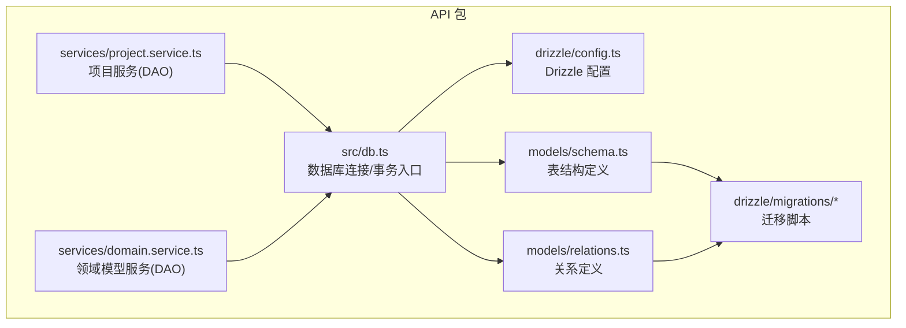
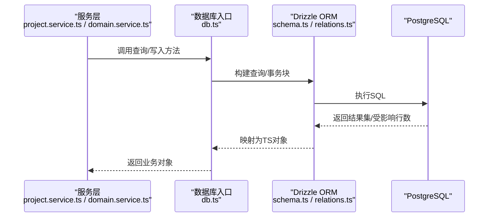
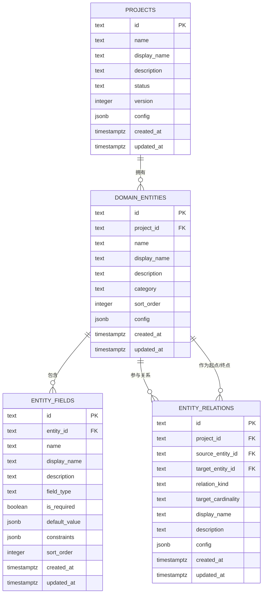
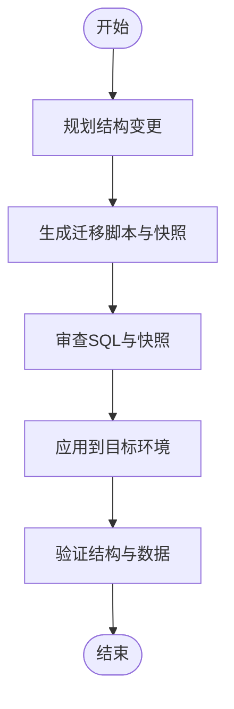
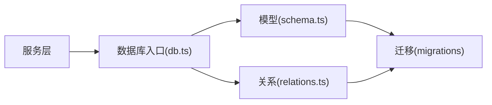

# 数据库设计

<cite>
**本文引用的文件**
- [packages/api/src/db.ts](file://packages/api/src/db.ts)
- [packages/api/drizzle/config.ts](file://packages/api/drizzle/config.ts)
- [packages/api/src/models/schema.ts](file://packages/api/src/models/schema.ts)
- [packages/api/src/models/relations.ts](file://packages/api/src/models/relations.ts)
- [packages/api/src/services/project.service.ts](file://packages/api/src/services/project.service.ts)
- [packages/api/src/services/domain.service.ts](file://packages/api/src/services/domain.service.ts)
- [packages/api/src/db/migrate-cardinality.ts](file://packages/api/src/db/migrate-cardinality.ts)
- [packages/api/drizzle/migrations/0000_init_projects_table.sql](file://packages/api/drizzle/migrations/0000_init_projects_table.sql)
- [packages/api/drizzle/migrations/0004_add_domain_entities_config.sql](file://packages/api/drizzle/migrations/0004_add_domain_entities_config.sql)
- [packages/api/drizzle/migrations/0006_mean_rachel_grey.sql](file://packages/api/drizzle/migrations/0006_mean_rachel_grey.sql)
- [docs/04-tech-design/coding-convention-backend.md](file://docs/04-tech-design/coding-convention-backend.md)
- [docs/04-tech-design/domain-model-tech-design.md](file://docs/04-tech-design/domain-model-tech-design.md)
- [docs/05-data-design/phase1-database-schema.md](file://docs/05-data-design/phase1-database-schema.md)
</cite>

## 目录
1. [简介](#简介)
2. [项目结构](#项目结构)
3. [核心组件](#核心组件)
4. [架构总览](#架构总览)
5. [详细组件分析](#详细组件分析)
6. [依赖分析](#依赖分析)
7. [性能考虑](#性能考虑)
8. [故障排查指南](#故障排查指南)
9. [结论](#结论)
10. [附录](#附录)

## 简介
本指南面向AI原型管理系统的数据库设计与实现，聚焦于Drizzle ORM在PostgreSQL上的配置与使用，涵盖数据库连接、事务管理、查询构建、数据模型定义、实体关系映射、约束与索引、迁移机制与版本管理、DAO模式抽象、一致性与并发控制、以及典型查询示例路径。内容基于仓库中现有技术文档与源码文件整理而成，旨在帮助开发者快速理解并正确使用数据库层。

## 项目结构
数据库相关代码主要集中在后端API包中，采用“模型-服务-路由”分层组织，配合Drizzle迁移工具进行版本化演进。关键位置如下：
- 连接与事务入口：packages/api/src/db.ts
- Drizzle配置：packages/api/drizzle/config.ts
- 模型定义：packages/api/src/models/schema.ts、packages/api/src/models/relations.ts
- 服务层（DAO风格）：packages/api/src/services/*.service.ts
- 迁移脚本与快照：packages/api/drizzle/migrations/*
- 技术规范与设计文档：docs/04-tech-design/*、docs/05-data-design/*

图表来源
- [packages/api/src/db.ts](file://packages/api/src/db.ts)
- [packages/api/drizzle/config.ts](file://packages/api/drizzle/config.ts)
- [packages/api/src/models/schema.ts](file://packages/api/src/models/schema.ts)
- [packages/api/src/models/relations.ts](file://packages/api/src/models/relations.ts)
- [packages/api/src/services/project.service.ts](file://packages/api/src/services/project.service.ts)
- [packages/api/src/services/domain.service.ts](file://packages/api/src/services/domain.service.ts)
- [packages/api/drizzle/migrations/0000_init_projects_table.sql](file://packages/api/drizzle/migrations/0000_init_projects_table.sql)

章节来源
- [packages/api/src/db.ts](file://packages/api/src/db.ts)
- [packages/api/drizzle/config.ts](file://packages/api/drizzle/config.ts)
- [packages/api/src/models/schema.ts](file://packages/api/src/models/schema.ts)
- [packages/api/src/models/relations.ts](file://packages/api/src/models/relations.ts)
- [packages/api/src/services/project.service.ts](file://packages/api/src/services/project.service.ts)
- [packages/api/src/services/domain.service.ts](file://packages/api/src/services/domain.service.ts)
- [packages/api/drizzle/migrations/0000_init_projects_table.sql](file://packages/api/drizzle/migrations/0000_init_projects_table.sql)

## 核心组件
- 数据库连接与事务入口
  - 通过统一的db实例暴露连接与事务能力，所有写操作优先使用事务以保证原子性。
  - 参考：[packages/api/src/db.ts](file://packages/api/src/db.ts)
- Drizzle配置
  - 提供PostgreSQL连接参数、日志开关等配置项，确保开发与部署环境一致。
  - 参考：[packages/api/drizzle/config.ts](file://packages/api/drizzle/config.ts)
- 模型定义（表结构）
  - 使用pgTable定义各业务表，字段命名遵循snake_case，时间戳带时区，默认值与约束明确。
  - 参考：[packages/api/src/models/schema.ts](file://packages/api/src/models/schema.ts)
- 关系定义
  - 明确外键约束与级联删除策略，确保数据完整性。
  - 参考：[packages/api/src/models/relations.ts](file://packages/api/src/models/relations.ts)
- 服务层（DAO模式）
  - 以服务函数封装数据访问逻辑，提供领域化的CRUD与查询方法，便于复用与测试。
  - 参考：[packages/api/src/services/project.service.ts](file://packages/api/src/services/project.service.ts)、[packages/api/src/services/domain.service.ts](file://packages/api/src/services/domain.service.ts)
- 迁移与版本管理
  - 使用Drizzle Kit生成与应用迁移，维护快照与SQL脚本，支持回滚与增量演进。
  - 参考：[packages/api/drizzle/migrations/0000_init_projects_table.sql](file://packages/api/drizzle/migrations/0000_init_projects_table.sql)、[packages/api/drizzle/migrations/0004_add_domain_entities_config.sql](file://packages/api/drizzle/migrations/0004_add_domain_entities_config.sql)、[packages/api/drizzle/migrations/0006_mean_rachel_grey.sql](file://packages/api/drizzle/migrations/0006_mean_rachel_grey.sql)

章节来源
- [packages/api/src/db.ts](file://packages/api/src/db.ts)
- [packages/api/drizzle/config.ts](file://packages/api/drizzle/config.ts)
- [packages/api/src/models/schema.ts](file://packages/api/src/models/schema.ts)
- [packages/api/src/models/relations.ts](file://packages/api/src/models/relations.ts)
- [packages/api/src/services/project.service.ts](file://packages/api/src/services/project.service.ts)
- [packages/api/src/services/domain.service.ts](file://packages/api/src/services/domain.service.ts)
- [packages/api/drizzle/migrations/0000_init_projects_table.sql](file://packages/api/drizzle/migrations/0000_init_projects_table.sql)
- [packages/api/drizzle/migrations/0004_add_domain_entities_config.sql](file://packages/api/drizzle/migrations/0004_add_domain_entities_config.sql)
- [packages/api/drizzle/migrations/0006_mean_rachel_grey.sql](file://packages/api/drizzle/migrations/0006_mean_rachel_grey.sql)

## 架构总览
下图展示了从服务层到数据库层的整体调用链路，体现DAO模式与Drizzle ORM的协作方式。

图表来源
- [packages/api/src/services/project.service.ts](file://packages/api/src/services/project.service.ts)
- [packages/api/src/services/domain.service.ts](file://packages/api/src/services/domain.service.ts)
- [packages/api/src/db.ts](file://packages/api/src/db.ts)
- [packages/api/src/models/schema.ts](file://packages/api/src/models/schema.ts)
- [packages/api/src/models/relations.ts](file://packages/api/src/models/relations.ts)

## 详细组件分析

### Drizzle ORM配置与连接
- 配置要点
  - 连接字符串、超时、SSL等参数集中管理，避免硬编码。
  - 开启或关闭SQL日志，便于调试与性能分析。
- 入口与事务
  - 通过db实例暴露常规查询与事务接口；事务块内执行多表写操作，保证原子性。
- 规范参考
  - 事务使用场景、嵌套事务与异常回滚行为均有明确规范。

章节来源
- [packages/api/drizzle/config.ts](file://packages/api/drizzle/config.ts)
- [packages/api/src/db.ts](file://packages/api/src/db.ts)
- [docs/04-tech-design/coding-convention-backend.md](file://docs/04-tech-design/coding-convention-backend.md)

### 数据模型定义与表结构设计
- 设计原则
  - 列名使用snake_case，字段类型与约束清晰；主键统一为text类型并自动生成UUID；时间戳带时区并设置默认值；JSONB字段提供默认空对象；外键统一使用级联删除。
  - 参考规范：[docs/04-tech-design/coding-convention-backend.md](file://docs/04-tech-design/coding-convention-backend.md)
- 核心表概览
  - 项目表：用于管理原型项目元数据与状态。
  - 领域实体表：存储实体、字段、关系等语义层数据，支持排序、显示名与配置字段。
  - 参考模型定义：[packages/api/src/models/schema.ts](file://packages/api/src/models/schema.ts)
- 实体关系映射
  - 通过外键建立实体与字段、实体与关系之间的引用；关系表包含多维约束索引，确保项目维度内的唯一性。
  - 参考关系定义：[packages/api/src/models/relations.ts](file://packages/api/src/models/relations.ts)
- 约束与索引
  - 唯一索引覆盖项目+名称组合，避免重复；关系表按项目、源实体、目标实体与关系类型建立唯一索引。
  - 参考索引定义：[docs/04-tech-design/domain-model-tech-design.md](file://docs/04-tech-design/domain-model-tech-design.md)

图表来源
- [packages/api/src/models/schema.ts](file://packages/api/src/models/schema.ts)
- [packages/api/src/models/relations.ts](file://packages/api/src/models/relations.ts)

章节来源
- [packages/api/src/models/schema.ts](file://packages/api/src/models/schema.ts)
- [packages/api/src/models/relations.ts](file://packages/api/src/models/relations.ts)
- [docs/04-tech-design/coding-convention-backend.md](file://docs/04-tech-design/coding-convention-backend.md)
- [docs/04-tech-design/domain-model-tech-design.md](file://docs/04-tech-design/domain-model-tech-design.md)

### 查询构建与DAO模式实现
- DAO风格封装
  - 服务层函数负责组装查询条件、执行写入与读取、并将数据库行映射为业务对象。
  - 示例路径：
    - 项目详情映射：[packages/api/src/services/project.service.ts](file://packages/api/src/services/project.service.ts)
    - 领域模型查询：[packages/api/src/services/domain.service.ts](file://packages/api/src/services/domain.service.ts)
- 查询构建
  - 使用Drizzle的select、insert、update、delete与join语法，结合where、orderBy、limit/offset实现分页与筛选。
  - 参考规范：[docs/04-tech-design/coding-convention-backend.md](file://docs/04-tech-design/coding-convention-backend.md)

章节来源
- [packages/api/src/services/project.service.ts](file://packages/api/src/services/project.service.ts)
- [packages/api/src/services/domain.service.ts](file://packages/api/src/services/domain.service.ts)
- [docs/04-tech-design/coding-convention-backend.md](file://docs/04-tech-design/coding-convention-backend.md)

### 数据库迁移机制与版本管理
- 迁移流程
  - 通过Drizzle Kit生成迁移脚本与快照，SQL脚本记录具体变更，快照保存当前结构状态。
  - 参考迁移脚本：
    - 初始化项目表：[packages/api/drizzle/migrations/0000_init_projects_table.sql](file://packages/api/drizzle/migrations/0000_init_projects_table.sql)
    - 新增领域实体配置字段：[packages/api/drizzle/migrations/0004_add_domain_entities_config.sql](file://packages/api/drizzle/migrations/0004_add_domain_entities_config.sql)
    - 关系基数迁移辅助：[packages/api/src/db/migrate-cardinality.ts](file://packages/api/src/db/migrate-cardinality.ts)
- 版本管理策略
  - 采用顺序编号的迁移文件，每个文件对应一次结构变更；快照文件记录上一个版本的结构，便于比较与回滚。
  - 参考迁移脚本：
    - 最终关系迁移：[packages/api/drizzle/migrations/0006_mean_rachel_grey.sql](file://packages/api/drizzle/migrations/0006_mean_rachel_grey.sql)

图表来源
- [packages/api/drizzle/migrations/0000_init_projects_table.sql](file://packages/api/drizzle/migrations/0000_init_projects_table.sql)
- [packages/api/drizzle/migrations/0004_add_domain_entities_config.sql](file://packages/api/drizzle/migrations/0004_add_domain_entities_config.sql)
- [packages/api/drizzle/migrations/0006_mean_rachel_grey.sql](file://packages/api/drizzle/migrations/0006_mean_rachel_grey.sql)

章节来源
- [packages/api/drizzle/migrations/0000_init_projects_table.sql](file://packages/api/drizzle/migrations/0000_init_projects_table.sql)
- [packages/api/drizzle/migrations/0004_add_domain_entities_config.sql](file://packages/api/drizzle/migrations/0004_add_domain_entities_config.sql)
- [packages/api/drizzle/migrations/0006_mean_rachel_grey.sql](file://packages/api/drizzle/migrations/0006_mean_rachel_grey.sql)
- [packages/api/src/db/migrate-cardinality.ts](file://packages/api/src/db/migrate-cardinality.ts)

### 查询优化与索引设计
- 索引策略
  - 唯一索引覆盖高频过滤字段组合，如项目+实体名称、项目+源实体+目标实体+关系类型，减少重复与提升查询稳定性。
  - 参考索引定义：[docs/04-tech-design/domain-model-tech-design.md](file://docs/04-tech-design/domain-model-tech-design.md)
- 查询优化建议
  - 使用select精确投影，避免*；对频繁过滤字段建立合适索引；分页使用游标或基于索引的limit/offset；复杂查询拆分为多次简单查询并缓存中间结果。
  - 参考规范：[docs/04-tech-design/coding-convention-backend.md](file://docs/04-tech-design/coding-convention-backend.md)

章节来源
- [docs/04-tech-design/domain-model-tech-design.md](file://docs/04-tech-design/domain-model-tech-design.md)
- [docs/04-tech-design/coding-convention-backend.md](file://docs/04-tech-design/coding-convention-backend.md)

### 数据一致性与并发控制
- 事务与原子性
  - 多表写操作必须在事务中执行，异常将自动回滚，保证数据一致性。
  - 参考规范：[docs/04-tech-design/coding-convention-backend.md](file://docs/04-tech-design/coding-convention-backend.md)
- 并发控制
  - 使用PostgreSQL的默认隔离级别；对高冲突写场景考虑SELECT ... FOR UPDATE或序列号版本字段；避免长事务阻塞。
  - 参考规范：[docs/04-tech-design/coding-convention-backend.md](file://docs/04-tech-design/coding-convention-backend.md)

章节来源
- [docs/04-tech-design/coding-convention-backend.md](file://docs/04-tech-design/coding-convention-backend.md)

### 实际模型与查询示例（路径指引）
- 项目详情映射（服务层）
  - 路径：[packages/api/src/services/project.service.ts](file://packages/api/src/services/project.service.ts)
- 领域实体/字段/关系（模型层）
  - 路径：[packages/api/src/models/schema.ts](file://packages/api/src/models/schema.ts)、[packages/api/src/models/relations.ts](file://packages/api/src/models/relations.ts)
- 迁移脚本（结构演进）
  - 路径：[packages/api/drizzle/migrations/0000_init_projects_table.sql](file://packages/api/drizzle/migrations/0000_init_projects_table.sql)、[packages/api/drizzle/migrations/0004_add_domain_entities_config.sql](file://packages/api/drizzle/migrations/0004_add_domain_entities_config.sql)、[packages/api/drizzle/migrations/0006_mean_rachel_grey.sql](file://packages/api/drizzle/migrations/0006_mean_rachel_grey.sql)
- 关系基数迁移辅助
  - 路径：[packages/api/src/db/migrate-cardinality.ts](file://packages/api/src/db/migrate-cardinality.ts)

章节来源
- [packages/api/src/services/project.service.ts](file://packages/api/src/services/project.service.ts)
- [packages/api/src/models/schema.ts](file://packages/api/src/models/schema.ts)
- [packages/api/src/models/relations.ts](file://packages/api/src/models/relations.ts)
- [packages/api/drizzle/migrations/0000_init_projects_table.sql](file://packages/api/drizzle/migrations/0000_init_projects_table.sql)
- [packages/api/drizzle/migrations/0004_add_domain_entities_config.sql](file://packages/api/drizzle/migrations/0004_add_domain_entities_config.sql)
- [packages/api/drizzle/migrations/0006_mean_rachel_grey.sql](file://packages/api/drizzle/migrations/0006_mean_rachel_grey.sql)
- [packages/api/src/db/migrate-cardinality.ts](file://packages/api/src/db/migrate-cardinality.ts)

## 依赖分析
- 组件耦合
  - 服务层依赖数据库入口与模型定义；模型定义依赖Drizzle的pg-core；迁移脚本依赖模型结构快照。
- 外部依赖
  - PostgreSQL作为持久化存储；Drizzle ORM提供类型安全的查询构建与迁移工具链。
- 潜在风险
  - 快照与SQL不匹配会导致迁移失败；未使用事务的多表写可能破坏一致性。

图表来源
- [packages/api/src/services/project.service.ts](file://packages/api/src/services/project.service.ts)
- [packages/api/src/db.ts](file://packages/api/src/db.ts)
- [packages/api/src/models/schema.ts](file://packages/api/src/models/schema.ts)
- [packages/api/src/models/relations.ts](file://packages/api/src/models/relations.ts)
- [packages/api/drizzle/migrations/0000_init_projects_table.sql](file://packages/api/drizzle/migrations/0000_init_projects_table.sql)

章节来源
- [packages/api/src/services/project.service.ts](file://packages/api/src/services/project.service.ts)
- [packages/api/src/db.ts](file://packages/api/src/db.ts)
- [packages/api/src/models/schema.ts](file://packages/api/src/models/schema.ts)
- [packages/api/src/models/relations.ts](file://packages/api/src/models/relations.ts)
- [packages/api/drizzle/migrations/0000_init_projects_table.sql](file://packages/api/drizzle/migrations/0000_init_projects_table.sql)

## 性能考虑
- 查询层面
  - 使用精确投影与必要索引；避免N+1查询；对大结果集使用分页与游标。
- 写入层面
  - 合理批量插入/更新；在事务中合并写操作；避免长时间持有锁。
- 结构层面
  - JSONB字段仅存放必要配置；避免过度规范化导致JOIN过多；定期分析与更新统计信息。

## 故障排查指南
- 迁移失败
  - 检查快照与SQL是否匹配；确认目标环境PostgreSQL版本与扩展；逐条回放迁移并定位错误。
  - 参考迁移脚本：[packages/api/drizzle/migrations/0000_init_projects_table.sql](file://packages/api/drizzle/migrations/0000_init_projects_table.sql)、[packages/api/drizzle/migrations/0004_add_domain_entities_config.sql](file://packages/api/drizzle/migrations/0004_add_domain_entities_config.sql)、[packages/api/drizzle/migrations/0006_mean_rachel_grey.sql](file://packages/api/drizzle/migrations/0006_mean_rachel_grey.sql)
- 事务问题
  - 确认多表写是否包裹在事务中；捕获异常后检查是否触发回滚；避免在事务中执行长时间任务。
  - 参考规范：[docs/04-tech-design/coding-convention-backend.md](file://docs/04-tech-design/coding-convention-backend.md)
- 查询慢
  - 分析执行计划；为过滤与排序字段添加索引；拆分复杂查询；评估缓存策略。

章节来源
- [packages/api/drizzle/migrations/0000_init_projects_table.sql](file://packages/api/drizzle/migrations/0000_init_projects_table.sql)
- [packages/api/drizzle/migrations/0004_add_domain_entities_config.sql](file://packages/api/drizzle/migrations/0004_add_domain_entities_config.sql)
- [packages/api/drizzle/migrations/0006_mean_rachel_grey.sql](file://packages/api/drizzle/migrations/0006_mean_rachel_grey.sql)
- [docs/04-tech-design/coding-convention-backend.md](file://docs/04-tech-design/coding-convention-backend.md)

## 结论
本指南系统梳理了AI原型管理系统中Drizzle ORM的配置与使用、模型与关系设计、迁移与版本管理、DAO模式实现、一致性与并发控制以及查询优化实践。建议在后续迭代中持续完善索引策略、监控慢查询、规范事务使用，并通过自动化测试保障迁移与查询的稳定性。

## 附录
- 设计文档参考
  - 数据库设计（阶段一）：[docs/05-data-design/phase1-database-schema.md](file://docs/05-data-design/phase1-database-schema.md)
  - 技术设计（领域模型技术设计）：[docs/04-tech-design/domain-model-tech-design.md](file://docs/04-tech-design/domain-model-tech-design.md)
  - 后端编码规范（事务与约束）：[docs/04-tech-design/coding-convention-backend.md](file://docs/04-tech-design/coding-convention-backend.md)