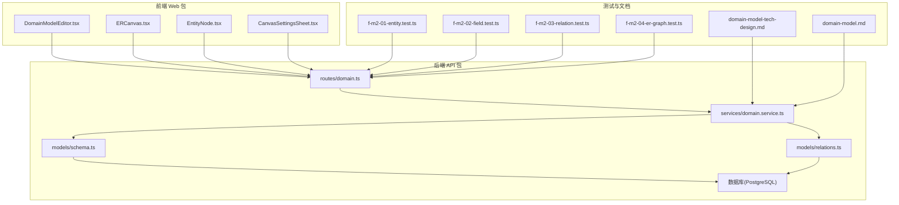
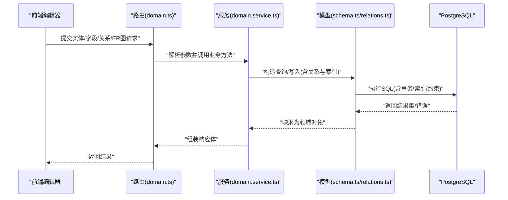
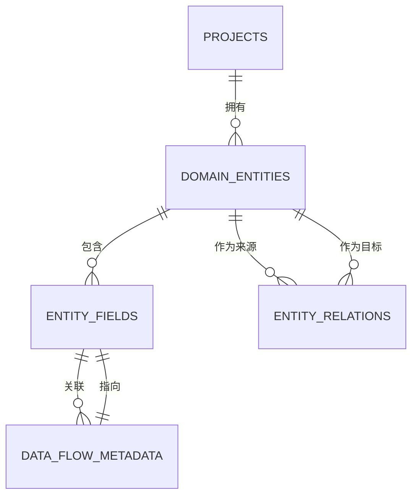
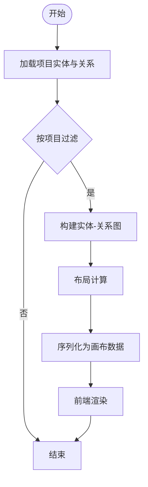
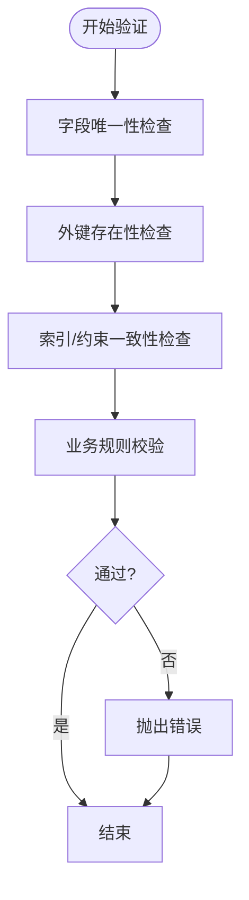
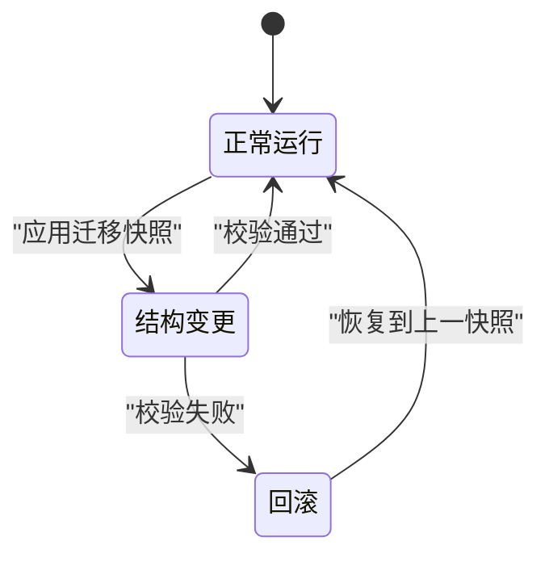
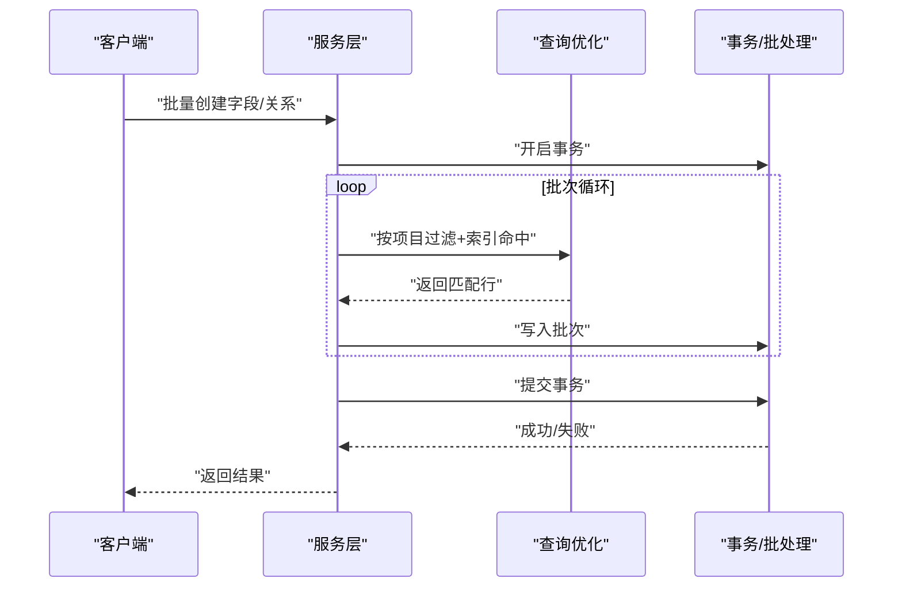
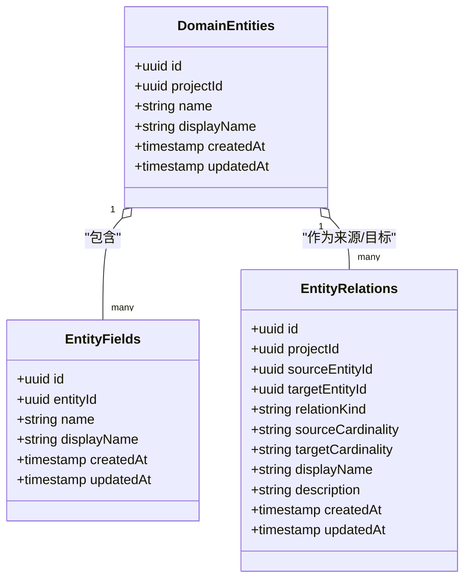
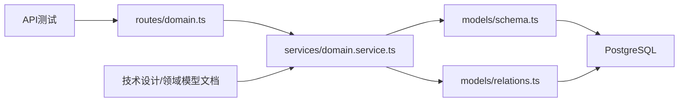

# 域模型服务

<cite>
**本文引用的文件**
- [domain-model-tech-design.md](file://docs/04-tech-design/domain-model-tech-design.md)
- [domain-model.md](file://docs/02-domain-model/domain-model.md)
- [f-m2-01-entity.test.ts](file://packages/api/tests/domain-model/f-m2-01-entity.test.ts)
- [f-m2-02-field.test.ts](file://packages/api/tests/domain-model/f-m2-02-field.test.ts)
- [f-m2-03-relation.test.ts](file://packages/api/tests/domain-model/f-m2-03-relation.test.ts)
- [f-m2-04-er-graph.test.ts](file://packages/api/tests/domain-model/f-m2-04-er-graph.test.ts)
- [domain.service.ts](file://packages/api/src/services/domain.service.ts)
- [schema.ts](file://packages/api/src/models/schema.ts)
- [relations.ts](file://packages/api/src/models/relations.ts)
- [app.ts](file://packages/api/src/app.ts)
- [0001_snapshot.json](file://packages/api/drizzle/migrations/meta/0001_snapshot.json)
- [0002_snapshot.json](file://packages/api/drizzle/migrations/meta/0002_snapshot.json)
- [0003_snapshot.json](file://packages/api/drizzle/migrations/meta/0003_snapshot.json)
- [0004_snapshot.json](file://packages/api/drizzle/migrations/meta/0004_snapshot.json)
- [0005_snapshot.json](file://packages/api/drizzle/migrations/meta/0005_snapshot.json)
- [0006_snapshot.json](file://packages/api/drizzle/migrations/meta/0006_snapshot.json)
- [domain-model-interaction.md](file://docs/03-prd-ux/modules/domain-model/domain-model-interaction.md)
- [domain-model-prd.md](file://docs/03-prd-ux/modules/domain-model/domain-model-prd.md)
</cite>

## 目录
1. [引言](#引言)
2. [项目结构](#项目结构)
3. [核心组件](#核心组件)
4. [架构总览](#架构总览)
5. [详细组件分析](#详细组件分析)
6. [依赖分析](#依赖分析)
7. [性能考虑](#性能考虑)
8. [故障排查指南](#故障排查指南)
9. [结论](#结论)
10. [附录](#附录)

## 引言
本技术文档围绕“域模型服务”展开，系统性阐述实体、字段、关系建模的业务逻辑实现；详解ER图生成算法、数据模型验证规则与约束检查机制；描述域模型版本控制与变更追踪策略；提供实体关系查询优化与批量操作实现思路；并展示域模型服务与数据库层的交互模式及性能优化技巧。文档同时结合产品与用户交互设计说明，给出可落地的业务场景示例与常见问题解决方案。

## 项目结构
域模型服务位于后端API包中，采用分层架构：路由层负责HTTP接口定义，服务层封装业务逻辑，模型层通过Drizzle ORM映射数据库表结构与关系，迁移快照文件记录数据库演进历史。前端Web包提供可视化编辑器与画布组件，支撑域模型的增删改查与ER图渲染。

图表来源
- [domain.service.ts](file://packages/api/src/services/domain.service.ts)
- [schema.ts](file://packages/api/src/models/schema.ts)
- [relations.ts](file://packages/api/src/models/relations.ts)
- [domain-model-tech-design.md](file://docs/04-tech-design/domain-model-tech-design.md)
- [domain-model.md](file://docs/02-domain-model/domain-model.md)

章节来源
- [domain.service.ts](file://packages/api/src/services/domain.service.ts)
- [schema.ts](file://packages/api/src/models/schema.ts)
- [relations.ts](file://packages/api/src/models/relations.ts)
- [domain-model-tech-design.md](file://docs/04-tech-design/domain-model-tech-design.md)
- [domain-model.md](file://docs/02-domain-model/domain-model.md)

## 核心组件
- 路由与控制器：定义域模型相关API，接收请求参数并调用服务层处理。
- 服务层(domain.service.ts)：封装实体、字段、关系的CRUD与查询聚合逻辑，执行业务规则与约束校验，并负责ER图生成的数据准备。
- 模型层(schema.ts、relations.ts)：定义数据库表结构与表间关系，通过Drizzle ORM进行类型安全的查询与更新。
- 数据库迁移快照：以JSON记录各版本数据库结构快照，支持版本回溯与一致性校验。
- 测试用例：覆盖实体、字段、关系、ER图等模块的接口行为，保障功能正确性与回归稳定性。
- 前端编辑器：提供可视化画布、节点与工具栏，支撑用户在界面中完成域模型的构建与调整。

章节来源
- [domain.service.ts](file://packages/api/src/services/domain.service.ts)
- [schema.ts](file://packages/api/src/models/schema.ts)
- [relations.ts](file://packages/api/src/models/relations.ts)
- [f-m2-01-entity.test.ts](file://packages/api/tests/domain-model/f-m2-01-entity.test.ts)
- [f-m2-02-field.test.ts](file://packages/api/tests/domain-model/f-m2-02-field.test.ts)
- [f-m2-03-relation.test.ts](file://packages/api/tests/domain-model/f-m2-03-relation.test.ts)
- [f-m2-04-er-graph.test.ts](file://packages/api/tests/domain-model/f-m2-04-er-graph.test.ts)

## 架构总览
域模型服务遵循“路由-服务-模型-存储”的分层设计。前端通过HTTP接口与后端交互，后端服务层统一编排业务流程，模型层负责数据结构与关系映射，数据库层持久化数据并提供索引与约束保障。

图表来源
- [domain.service.ts](file://packages/api/src/services/domain.service.ts)
- [schema.ts](file://packages/api/src/models/schema.ts)
- [relations.ts](file://packages/api/src/models/relations.ts)
- [app.ts](file://packages/api/src/app.ts)

## 详细组件分析

### 实体、字段与关系建模
- 实体建模：每个实体对应一个表，包含标识、归属项目、显示名、时间戳等元信息。服务层提供创建、更新、删除与查询接口，查询时支持按项目维度过滤。
- 字段建模：字段属于实体，具备唯一性约束(同一实体内字段名唯一)，并支持与数据流元数据关联。
- 关系建模：实体间通过关系表建立连接，包含来源实体、目标实体、关系类型、基数、显示名与描述等。服务层提供关系查询与聚合，支持ER图渲染所需的数据集。

图表来源
- [relations.ts](file://packages/api/src/models/relations.ts)
- [0001_snapshot.json](file://packages/api/drizzle/migrations/meta/0001_snapshot.json)
- [0002_snapshot.json](file://packages/api/drizzle/migrations/meta/0002_snapshot.json)
- [0003_snapshot.json](file://packages/api/drizzle/migrations/meta/0003_snapshot.json)
- [0004_snapshot.json](file://packages/api/drizzle/migrations/meta/0004_snapshot.json)
- [0005_snapshot.json](file://packages/api/drizzle/migrations/meta/0005_snapshot.json)
- [0006_snapshot.json](file://packages/api/drizzle/migrations/meta/0006_snapshot.json)

章节来源
- [domain.service.ts](file://packages/api/src/services/domain.service.ts)
- [relations.ts](file://packages/api/src/models/relations.ts)
- [0001_snapshot.json](file://packages/api/drizzle/migrations/meta/0001_snapshot.json)
- [0002_snapshot.json](file://packages/api/drizzle/migrations/meta/0002_snapshot.json)
- [0003_snapshot.json](file://packages/api/drizzle/migrations/meta/0003_snapshot.json)
- [0004_snapshot.json](file://packages/api/drizzle/migrations/meta/0004_snapshot.json)
- [0005_snapshot.json](file://packages/api/drizzle/migrations/meta/0005_snapshot.json)
- [0006_snapshot.json](file://packages/api/drizzle/migrations/meta/0006_snapshot.json)

### ER图生成算法
- 输入：项目ID、实体集合、关系集合。
- 处理流程：
  - 过滤实体与关系：仅保留属于当前项目的实体与关系。
  - 构造邻接结构：以实体为节点，关系为边，形成无向或有向图。
  - 布局计算：基于实体数量与关系密度选择合适的布局算法，保证节点不重叠且边清晰可见。
  - 渲染输出：将节点与边序列化为画布可识别的结构，供前端ERCanvas消费。
- 输出：包含节点列表与边列表的ER图数据，支持拖拽、缩放与交互。

图表来源
- [domain.service.ts](file://packages/api/src/services/domain.service.ts)
- [f-m2-04-er-graph.test.ts](file://packages/api/tests/domain-model/f-m2-04-er-graph.test.ts)

章节来源
- [domain.service.ts](file://packages/api/src/services/domain.service.ts)
- [f-m2-04-er-graph.test.ts](file://packages/api/tests/domain-model/f-m2-04-er-graph.test.ts)

### 数据模型验证规则与约束检查机制
- 唯一性约束：字段名在同一实体内必须唯一；关系表对实体组合存在唯一性索引。
- 外键约束：字段与关系均外键关联实体，删除实体触发级联删除。
- 约束检查：迁移快照中定义了索引、外键、唯一约束等，确保数据一致性。
- 业务规则：服务层在新增/更新时执行业务校验（如关系基数合法性、显示名非空等），失败时抛出明确错误。

图表来源
- [0001_snapshot.json](file://packages/api/drizzle/migrations/meta/0001_snapshot.json)
- [0002_snapshot.json](file://packages/api/drizzle/migrations/meta/0002_snapshot.json)
- [0003_snapshot.json](file://packages/api/drizzle/migrations/meta/0003_snapshot.json)
- [0004_snapshot.json](file://packages/api/drizzle/migrations/meta/0004_snapshot.json)
- [0005_snapshot.json](file://packages/api/drizzle/migrations/meta/0005_snapshot.json)
- [0006_snapshot.json](file://packages/api/drizzle/migrations/meta/0006_snapshot.json)
- [domain.service.ts](file://packages/api/src/services/domain.service.ts)

章节来源
- [0001_snapshot.json](file://packages/api/drizzle/migrations/meta/0001_snapshot.json)
- [0002_snapshot.json](file://packages/api/drizzle/migrations/meta/0002_snapshot.json)
- [0003_snapshot.json](file://packages/api/drizzle/migrations/meta/0003_snapshot.json)
- [0004_snapshot.json](file://packages/api/drizzle/migrations/meta/0004_snapshot.json)
- [0005_snapshot.json](file://packages/api/drizzle/migrations/meta/0005_snapshot.json)
- [0006_snapshot.json](file://packages/api/drizzle/migrations/meta/0006_snapshot.json)
- [domain.service.ts](file://packages/api/src/services/domain.service.ts)

### 域模型版本控制与变更追踪策略
- 版本管理：通过迁移快照文件记录数据库结构演进，每个快照包含列定义、索引、外键、唯一约束等。
- 变更追踪：服务层在实体、字段、关系的创建/更新/删除时记录时间戳与项目归属，便于审计与回溯。
- 回滚策略：当出现结构不一致时，可通过迁移工具回退到上一个稳定快照，再逐步修复差异。

图表来源
- [0001_snapshot.json](file://packages/api/drizzle/migrations/meta/0001_snapshot.json)
- [0002_snapshot.json](file://packages/api/drizzle/migrations/meta/0002_snapshot.json)
- [0003_snapshot.json](file://packages/api/drizzle/migrations/meta/0003_snapshot.json)
- [0004_snapshot.json](file://packages/api/drizzle/migrations/meta/0004_snapshot.json)
- [0005_snapshot.json](file://packages/api/drizzle/migrations/meta/0005_snapshot.json)
- [0006_snapshot.json](file://packages/api/drizzle/migrations/meta/0006_snapshot.json)

章节来源
- [0001_snapshot.json](file://packages/api/drizzle/migrations/meta/0001_snapshot.json)
- [0002_snapshot.json](file://packages/api/drizzle/migrations/meta/0002_snapshot.json)
- [0003_snapshot.json](file://packages/api/drizzle/migrations/meta/0003_snapshot.json)
- [0004_snapshot.json](file://packages/api/drizzle/migrations/meta/0004_snapshot.json)
- [0005_snapshot.json](file://packages/api/drizzle/migrations/meta/0005_snapshot.json)
- [0006_snapshot.json](file://packages/api/drizzle/migrations/meta/0006_snapshot.json)

### 实体关系查询优化与批量操作实现
- 查询优化：
  - 使用JOIN合并实体与关系查询，减少往返次数。
  - 利用索引：实体字段唯一索引、关系外键索引，加速过滤与排序。
  - 分页与过滤：按项目ID与创建时间排序，避免全表扫描。
- 批量操作：
  - 批量插入/更新字段与关系时使用事务，保证原子性。
  - 对ER图生成采用增量刷新策略，仅对受影响子图重新布局与渲染。

图表来源
- [domain.service.ts](file://packages/api/src/services/domain.service.ts)

章节来源
- [domain.service.ts](file://packages/api/src/services/domain.service.ts)

### 域模型服务与数据库层交互模式
- ORM映射：通过schema.ts定义表结构，relations.ts声明表间关系，确保类型安全与自动补全。
- SQL执行：服务层使用原生SQL进行复杂查询与聚合，结合Drizzle的类型推断保证返回结构正确。
- 事务控制：对写入密集型操作使用事务包裹，确保一致性与可回滚性。
- 索引与约束：迁移快照中定义的索引与约束为查询与写入提供性能与一致性保障。

图表来源
- [schema.ts](file://packages/api/src/models/schema.ts)
- [relations.ts](file://packages/api/src/models/relations.ts)
- [0001_snapshot.json](file://packages/api/drizzle/migrations/meta/0001_snapshot.json)

章节来源
- [schema.ts](file://packages/api/src/models/schema.ts)
- [relations.ts](file://packages/api/src/models/relations.ts)
- [domain.service.ts](file://packages/api/src/services/domain.service.ts)

## 依赖分析
- 组件耦合：路由依赖服务层；服务层依赖模型层；模型层依赖数据库；测试用例独立于实现，仅依赖接口契约。
- 外部依赖：Drizzle ORM、PostgreSQL、迁移工具。
- 潜在环依赖：未发现直接环依赖；关系通过模型层集中声明，避免循环导入。

图表来源
- [domain.service.ts](file://packages/api/src/services/domain.service.ts)
- [schema.ts](file://packages/api/src/models/schema.ts)
- [relations.ts](file://packages/api/src/models/relations.ts)
- [domain-model-tech-design.md](file://docs/04-tech-design/domain-model-tech-design.md)
- [domain-model.md](file://docs/02-domain-model/domain-model.md)

章节来源
- [domain.service.ts](file://packages/api/src/services/domain.service.ts)
- [schema.ts](file://packages/api/src/models/schema.ts)
- [relations.ts](file://packages/api/src/models/relations.ts)
- [domain-model-tech-design.md](file://docs/04-tech-design/domain-model-tech-design.md)
- [domain-model.md](file://docs/02-domain-model/domain-model.md)

## 性能考虑
- 索引策略：为实体字段名与关系外键建立唯一/非唯一索引，提升查询与去重效率。
- 查询路径：优先使用JOIN与投影，避免N+1查询；对大结果集启用分页与条件过滤。
- 写入路径：批量写入使用事务，减少锁竞争；对ER图生成采用增量刷新，降低前端渲染压力。
- 存储层：利用PostgreSQL的并发控制与MVCC特性，合理设置连接池与超时策略。

## 故障排查指南
- 常见错误
  - 唯一性冲突：字段名重复导致插入失败。解决：在服务层捕获异常并提示具体冲突字段。
  - 外键缺失：关系或字段引用不存在的实体。解决：先创建实体，再创建字段与关系。
  - 约束不满足：关系基数或显示名为空。解决：在接口层增加输入校验，服务层补充业务规则校验。
- 排障步骤
  - 检查迁移快照是否与当前数据库一致。
  - 查看服务层日志与错误码，定位失败点。
  - 使用最小复现用例，逐项排除字段/关系/索引问题。
- 相关测试
  - 实体/字段/关系/ER图的接口测试覆盖了典型与边界场景，可作为回归参考。

章节来源
- [f-m2-01-entity.test.ts](file://packages/api/tests/domain-model/f-m2-01-entity.test.ts)
- [f-m2-02-field.test.ts](file://packages/api/tests/domain-model/f-m2-02-field.test.ts)
- [f-m2-03-relation.test.ts](file://packages/api/tests/domain-model/f-m2-03-relation.test.ts)
- [f-m2-04-er-graph.test.ts](file://packages/api/tests/domain-model/f-m2-04-er-graph.test.ts)

## 结论
域模型服务通过清晰的分层架构、严谨的模型与约束设计、完善的测试覆盖与版本管理策略，实现了实体、字段、关系的全生命周期管理，并提供了高效的ER图生成与查询能力。配合前端可视化编辑器，能够支撑复杂业务场景下的域模型构建与维护。建议持续完善批量操作与增量刷新策略，进一步提升大规模数据下的用户体验与系统性能。

## 附录
- 业务场景示例
  - 场景一：为新项目初始化域模型，批量创建实体与字段，随后建立实体间关系并生成ER图。
  - 场景二：调整实体字段命名与关系基数，系统自动校验唯一性与外键约束，失败时返回明确错误。
  - 场景三：导出ER图用于文档与评审，前端画布根据服务端数据动态渲染。
- 用户交互参考
  - 交互设计文档与产品需求文档为前端编辑器与后端服务的协作提供了明确边界与行为规范。

章节来源
- [domain-model-interaction.md](file://docs/03-prd-ux/modules/domain-model/domain-model-interaction.md)
- [domain-model-prd.md](file://docs/03-prd-ux/modules/domain-model/domain-model-prd.md)