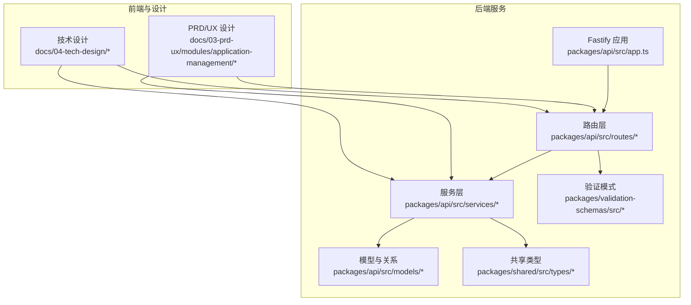
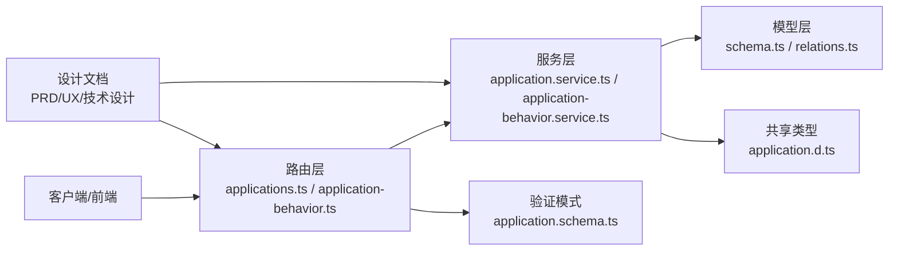
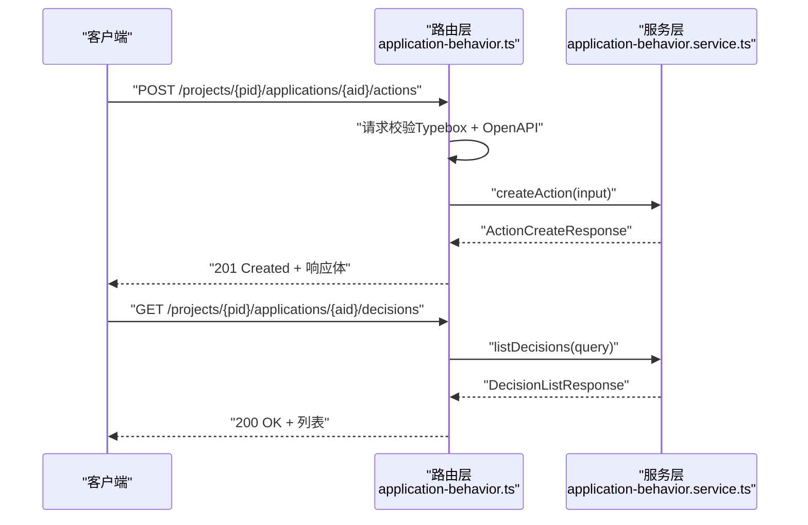
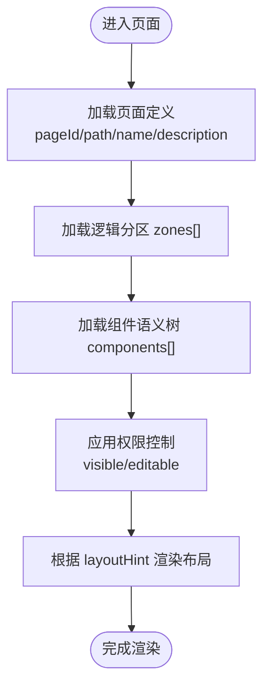
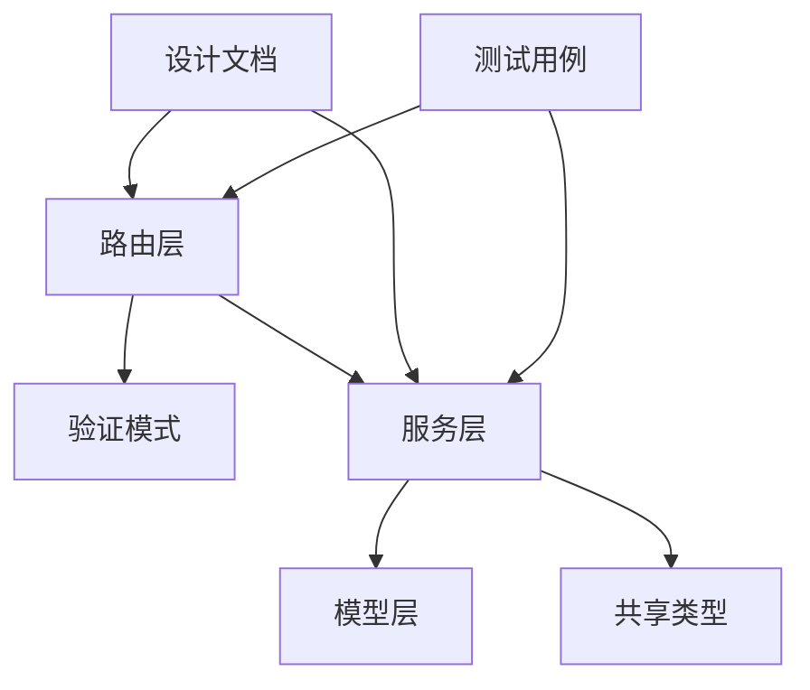

# 应用管理服务

<cite>
**本文引用的文件**
- [application.service.ts](file://packages/api/src/services/application.service.ts)
- [applications.ts](file://packages/api/src/routes/applications.ts)
- [application-behavior.service.ts](file://packages/api/src/services/application-behavior.service.ts)
- [application-behavior.ts](file://packages/api/src/routes/application-behavior.ts)
- [schema.ts](file://packages/api/src/models/schema.ts)
- [relations.ts](file://packages/api/src/models/relations.ts)
- [application.schema.ts](file://packages/validation-schemas/src/application.schema.ts)
- [application.d.ts](file://packages/shared/src/types/application.ts)
- [domain-model.md](file://docs/02-domain-model/domain-model.md)
- [app-shared-resources.md](file://docs/02-domain-model/app-shared-resources.md)
- [application-management-interaction.md](file://docs/03-prd-ux/modules/application-management/application-management-interaction.md)
- [f-m1-11-application.test.ts](file://packages/api/tests/project-management/f-m1-11-application.test.ts)
- [f-m1-14-application-behavior.test.ts](file://packages/api/tests/project-management/f-m1-14-application-behavior.test.ts)
- [openapi-contract-design.md](file://docs/04-tech-design/openapi-contract-design.md)
- [phase1-design-tech.md](file://docs/04-tech-design/phase1-design-tech.md)
- [multi-env-deploy.md](file://docs/07-deploy-design/multi-env-deploy.md)
- [object-lifecycle.md](file://docs/04-tech-design/object-lifecycle.md)
- [validation-design.md](file://docs/04-tech-design/validation-design.md)
</cite>

## 目录
1. [简介](#简介)
2. [项目结构](#项目结构)
3. [核心组件](#核心组件)
4. [架构总览](#架构总览)
5. [详细组件分析](#详细组件分析)
6. [依赖分析](#依赖分析)
7. [性能考虑](#性能考虑)
8. [故障排查指南](#故障排查指南)
9. [结论](#结论)
10. [附录](#附录)

## 简介
本文件面向“应用管理服务”的技术文档，围绕页面布局、区域管理、组件配置的业务逻辑实现进行深入解析；同时覆盖应用模板系统、页面渲染机制、动态配置管理、权限控制与访问限制策略、发布流程与版本管理、应用服务与前端框架的集成模式与数据同步机制，并提供性能监控与故障诊断方法。文档以仓库内的设计文档、后端服务实现与测试用例为依据，确保内容可追溯且可落地。

## 项目结构
应用管理服务位于多包工作区中，核心后端实现位于 packages/api，采用 Fastify + Drizzle ORM 架构，配合统一的验证模式与 OpenAPI 合同设计。前端相关交互与设计说明位于 docs/03-prd-ux 与 docs/04-tech-design，领域模型与共享类型位于 packages/shared 与 packages/validation-schemas。



图表来源
- [applications.ts:1-34](file://packages/api/src/routes/applications.ts#L1-L34)
- [application-behavior.ts:1-35](file://packages/api/src/routes/application-behavior.ts#L1-L35)
- [application.service.ts:1-38](file://packages/api/src/services/application.service.ts#L1-L38)
- [application-behavior.service.ts:1-35](file://packages/api/src/services/application-behavior.service.ts#L1-L35)
- [schema.ts:1-50](file://packages/api/src/models/schema.ts#L1-L50)
- [application.schema.ts:1-150](file://packages/validation-schemas/src/application.schema.ts#L1-L150)
- [application.d.ts:1-30](file://packages/shared/src/types/application.ts#L1-L30)
- [application-management-interaction.md:1-200](file://docs/03-prd-ux/modules/application-management/application-management-interaction.md#L1-L200)
- [openapi-contract-design.md:1-200](file://docs/04-tech-design/openapi-contract-design.md#L1-L200)

章节来源
- [applications.ts:1-34](file://packages/api/src/routes/applications.ts#L1-L34)
- [application-behavior.ts:1-35](file://packages/api/src/routes/application-behavior.ts#L1-L35)
- [application.service.ts:1-38](file://packages/api/src/services/application.service.ts#L1-L38)
- [application-behavior.service.ts:1-35](file://packages/api/src/services/application-behavior.service.ts#L1-L35)
- [schema.ts:1-50](file://packages/api/src/models/schema.ts#L1-L50)
- [application.schema.ts:1-150](file://packages/validation-schemas/src/application.schema.ts#L1-L150)
- [application.d.ts:1-30](file://packages/shared/src/types/application.ts#L1-L30)
- [application-management-interaction.md:1-200](file://docs/03-prd-ux/modules/application-management/application-management-interaction.md#L1-L200)
- [openapi-contract-design.md:1-200](file://docs/04-tech-design/openapi-contract-design.md#L1-L200)

## 核心组件
- 应用管理服务层：负责应用的 CRUD 操作、类型枚举、图标分配、唯一性约束与分页构建等。
- 应用行为管理服务层：负责应用动作与决策的 CRUD 操作，支撑应用行为编排。
- 路由层：基于 Fastify 插件注册，提供 OpenAPI 合同与请求校验。
- 数据模型与关系：基于 Drizzle ORM 的 schema 与 relations 定义。
- 验证模式与共享类型：统一的输入/输出模式与类型定义，保障前后端契约一致。
- 设计与测试：PRD/UX 交互设计、技术设计文档与端到端测试用例。

章节来源
- [application.service.ts:1-38](file://packages/api/src/services/application.service.ts#L1-L38)
- [application-behavior.service.ts:1-35](file://packages/api/src/services/application-behavior.service.ts#L1-L35)
- [applications.ts:1-34](file://packages/api/src/routes/applications.ts#L1-L34)
- [application-behavior.ts:1-35](file://packages/api/src/routes/application-behavior.ts#L1-L35)
- [schema.ts:1-50](file://packages/api/src/models/schema.ts#L1-L50)
- [application.schema.ts:1-150](file://packages/validation-schemas/src/application.schema.ts#L1-L150)
- [application.d.ts:1-30](file://packages/shared/src/types/application.ts#L1-L30)

## 架构总览
应用管理服务采用分层架构：路由层负责协议与契约，服务层承载业务规则，模型层负责数据持久化，验证与共享类型保证契约一致性。OpenAPI 合同驱动开发，测试用例覆盖关键业务场景。



图表来源
- [applications.ts:1-34](file://packages/api/src/routes/applications.ts#L1-L34)
- [application-behavior.ts:1-35](file://packages/api/src/routes/application-behavior.ts#L1-L35)
- [application.service.ts:1-38](file://packages/api/src/services/application.service.ts#L1-L38)
- [application-behavior.service.ts:1-35](file://packages/api/src/services/application-behavior.service.ts#L1-L35)
- [schema.ts:1-50](file://packages/api/src/models/schema.ts#L1-L50)
- [application.schema.ts:1-150](file://packages/validation-schemas/src/application.schema.ts#L1-L150)
- [application.d.ts:1-30](file://packages/shared/src/types/application.ts#L1-L30)
- [application-management-interaction.md:1-200](file://docs/03-prd-ux/modules/application-management/application-management-interaction.md#L1-L200)
- [openapi-contract-design.md:1-200](file://docs/04-tech-design/openapi-contract-design.md#L1-L200)

## 详细组件分析

### 应用管理服务（CRUD 与业务规则）
- 业务职责
  - 应用列表查询（排序、搜索、筛选、不返回 config）
  - 应用创建（名称唯一、同类型允许多个、类型不可变、图标自动分配、默认值处理）
  - 应用编辑（可编辑字段、名称唯一性排除自身）
  - 应用删除（引用约束检查、物理删除、非 service 类型直接删除）
- 关键实现要点
  - 类型枚举与图标映射：统一的应用类型与默认图标分配策略
  - 分页与元数据：基于分页构建器与聚合统计
  - 错误码与异常：标准化错误响应与冲突检测
- 与领域模型的关系
  - 应用属于 Project 根节点下的 applications[]，并承载 pages[]、globalActions[]、timers[] 等运行时资源
  - 页面（Page）作为特殊组件，具备可见/可编辑权限、生命周期与交互钩子等能力

```mermaid
classDiagram
class ApplicationService {
+listApplications(query)
+createApplication(input)
+updateApplication(id, input)
+deleteApplication(id)
}
class Application {
+id : string
+name : string
+type : ApplicationType
+icon? : string
+config? : any
+createdAt : Date
+updatedAt : Date
}
class ApplicationType {
<<enum>>
"web"
"wxapp"
"android"
"ios"
"pc"
"api"
"service"
}
ApplicationService --> Application : "CRUD 操作"
Application --> ApplicationType : "类型约束"
```

图表来源
- [application.service.ts:1-38](file://packages/api/src/services/application.service.ts#L1-L38)
- [application.d.ts:1-30](file://packages/shared/src/types/application.ts#L1-L30)
- [domain-model.md:238-263](file://docs/02-domain-model/domain-model.md#L238-L263)

章节来源
- [application.service.ts:1-38](file://packages/api/src/services/application.service.ts#L1-L38)
- [application.d.ts:1-30](file://packages/shared/src/types/application.ts#L1-L30)
- [domain-model.md:238-263](file://docs/02-domain-model/domain-model.md#L238-L263)

### 应用行为管理（动作与决策）
- 业务职责
  - 动作（Action）CRUD：支撑应用层面的行为编排与触发
  - 决策（Decision）CRUD：支撑应用层面的规则与条件判断
- 关键实现要点
  - 路由参数复用与 OpenAPI 合同
  - 输入/输出模式与错误响应
  - 与应用上下文的关联关系



图表来源
- [application-behavior.ts:1-35](file://packages/api/src/routes/application-behavior.ts#L1-L35)
- [application-behavior.service.ts:1-35](file://packages/api/src/services/application-behavior.service.ts#L1-L35)

章节来源
- [application-behavior.ts:1-35](file://packages/api/src/routes/application-behavior.ts#L1-L35)
- [application-behavior.service.ts:1-35](file://packages/api/src/services/application-behavior.service.ts#L1-L35)

### 页面布局、区域管理与组件配置
- 页面（Page）作为特殊组件，具备以下能力：
  - 路由路径与显示名
  - 权限控制（visible/editable）
  - 生命周期与交互钩子
  - 子节点：组件语义树、逻辑分区（zones）、布局建议
- 区域（Zone）与组件（Component）的组织方式
  - 通过 zones 定义页面的逻辑分区
  - 通过 components 构建组件语义树，支持递归嵌套
- 布局建议（layoutHint）
  - 页面级布局建议用于指导前端渲染策略



图表来源
- [domain-model.md:238-263](file://docs/02-domain-model/domain-model.md#L238-L263)

章节来源
- [domain-model.md:238-263](file://docs/02-domain-model/domain-model.md#L238-L263)

### 应用模板系统与页面渲染机制
- 模板系统
  - 应用类型决定模板形态：web、wxapp、android、ios、pc、api、service
  - 图标按类型自动分配，确保视觉一致性
- 页面渲染机制
  - 页面级布局建议（layoutHint）与组件语义树共同决定渲染结构
  - 权限控制贯穿渲染过程，确保仅展示可见内容
- 动态配置管理
  - 应用配置（config）在服务层 CRUD 中被严格区分：查询时不返回 config，避免敏感或冗余数据泄露

章节来源
- [application.service.ts:1-38](file://packages/api/src/services/application.service.ts#L1-L38)
- [domain-model.md:238-263](file://docs/02-domain-model/domain-model.md#L238-L263)

### 权限控制与访问限制策略
- 页面级权限
  - visible：可见角色列表
  - editable：可编辑角色列表
- 访问限制
  - 路由层基于 Fastify schema 进行请求校验与 OpenAPI 文档生成
  - 服务层对业务规则进行约束（如名称唯一性、类型不可变、引用约束检查）

章节来源
- [domain-model.md:247-249](file://docs/02-domain-model/domain-model.md#L247-L249)
- [applications.ts:1-34](file://packages/api/src/routes/applications.ts#L1-L34)

### 发布流程与版本管理
- 版本管理
  - Drizzle 迁移文件记录数据库演进，支持多环境部署与回滚
- 发布流程
  - 多环境部署设计文档提供环境切换与重启脚本
  - OpenAPI 合同驱动前后端协作，确保发布一致性

章节来源
- [multi-env-deploy.md:1-200](file://docs/07-deploy-design/multi-env-deploy.md#L1-L200)
- [openapi-contract-design.md:1-200](file://docs/04-tech-design/openapi-contract-design.md#L1-L200)

### 服务与前端框架集成模式与数据同步
- 集成模式
  - 路由层基于 Fastify 插件注册，前缀化路径，便于与前端框架对接
  - 验证模式与共享类型确保前后端契约一致
- 数据同步
  - 通过 OpenAPI 合同与统一的输入/输出模式，保障数据一致性
  - 测试用例覆盖关键场景，降低集成风险

章节来源
- [applications.ts:1-34](file://packages/api/src/routes/applications.ts#L1-L34)
- [application.schema.ts:1-150](file://packages/validation-schemas/src/application.schema.ts#L1-L150)
- [application.d.ts:1-30](file://packages/shared/src/types/application.ts#L1-L30)

## 依赖分析
- 路由层依赖验证模式与服务层
- 服务层依赖模型层与共享类型
- 验证模式与共享类型相互独立但共同约束契约
- 设计文档与测试用例为实现提供约束与保障



图表来源
- [applications.ts:1-34](file://packages/api/src/routes/applications.ts#L1-L34)
- [application-behavior.ts:1-35](file://packages/api/src/routes/application-behavior.ts#L1-L35)
- [application.service.ts:1-38](file://packages/api/src/services/application.service.ts#L1-L38)
- [application-behavior.service.ts:1-35](file://packages/api/src/services/application-behavior.service.ts#L1-L35)
- [schema.ts:1-50](file://packages/api/src/models/schema.ts#L1-L50)
- [application.schema.ts:1-150](file://packages/validation-schemas/src/application.schema.ts#L1-L150)
- [application.d.ts:1-30](file://packages/shared/src/types/application.ts#L1-L30)
- [application-management-interaction.md:1-200](file://docs/03-prd-ux/modules/application-management/application-management-interaction.md#L1-L200)

章节来源
- [applications.ts:1-34](file://packages/api/src/routes/applications.ts#L1-L34)
- [application-behavior.ts:1-35](file://packages/api/src/routes/application-behavior.ts#L1-L35)
- [application.service.ts:1-38](file://packages/api/src/services/application.service.ts#L1-L38)
- [application-behavior.service.ts:1-35](file://packages/api/src/services/application-behavior.service.ts#L1-L35)
- [schema.ts:1-50](file://packages/api/src/models/schema.ts#L1-L50)
- [application.schema.ts:1-150](file://packages/validation-schemas/src/application.schema.ts#L1-L150)
- [application.d.ts:1-30](file://packages/shared/src/types/application.ts#L1-L30)
- [application-management-interaction.md:1-200](file://docs/03-prd-ux/modules/application-management/application-management-interaction.md#L1-L200)

## 性能考虑
- 查询优化
  - 列表查询使用分页与聚合统计，避免一次性加载大量数据
  - 排序与筛选在服务层统一处理，减少前端重复计算
- 数据传输
  - 查询不返回 config，降低响应体积
  - 验证模式与共享类型减少序列化/反序列化开销
- 并发与事务
  - 服务层采用纯函数风格，避免全局状态，提升并发安全性
- 部署与扩展
  - 多环境部署支持灰度与蓝绿发布，降低变更风险

## 故障排查指南
- 常见错误与定位
  - 名称唯一性冲突：创建/编辑时检查名称唯一性，排除自身
  - 引用约束：删除前检查是否存在关联引用
  - 类型不可变：类型一旦确定不允许修改
- 日志与监控
  - OpenAPI 合同与路由层日志便于定位请求问题
  - 测试用例覆盖关键路径，便于回归验证
- 回滚与修复
  - Drizzle 迁移文件支持版本回滚
  - 多环境部署脚本支持快速恢复

章节来源
- [application.service.ts:1-38](file://packages/api/src/services/application.service.ts#L1-L38)
- [f-m1-11-application.test.ts:1-200](file://packages/api/tests/project-management/f-m1-11-application.test.ts#L1-L200)
- [f-m1-14-application-behavior.test.ts:1-200](file://packages/api/tests/project-management/f-m1-14-application-behavior.test.ts#L1-L200)
- [multi-env-deploy.md:1-200](file://docs/07-deploy-design/multi-env-deploy.md#L1-L200)

## 结论
应用管理服务通过清晰的分层架构、严格的契约设计与完善的测试体系，实现了应用生命周期管理、页面布局与组件配置、权限控制与访问限制、发布流程与版本管理以及与前端框架的稳定集成。建议在后续迭代中持续完善监控指标与告警机制，进一步提升系统的可观测性与可维护性。

## 附录
- 领域模型概览：应用作为 Project 的子节点，承载页面、动作、定时器等资源
- 技术设计要点：OpenAPI 合同驱动、验证模式统一、迁移文件管理
- 交互设计参考：应用管理模块的 PRD/UX 交互说明

章节来源
- [app-shared-resources.md:29-64](file://docs/02-domain-model/app-shared-resources.md#L29-L64)
- [phase1-design-tech.md:1-200](file://docs/04-tech-design/phase1-design-tech.md#L1-L200)
- [validation-design.md:1-200](file://docs/04-tech-design/validation-design.md#L1-L200)
- [object-lifecycle.md:1-200](file://docs/04-tech-design/object-lifecycle.md#L1-L200)