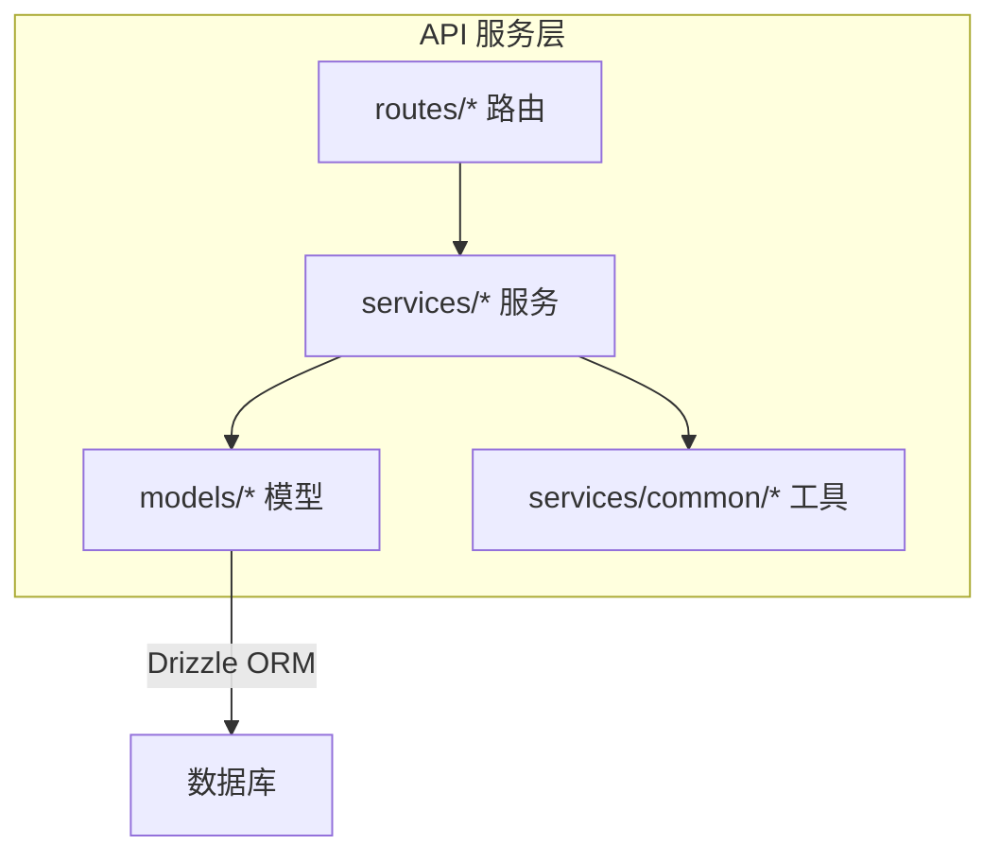
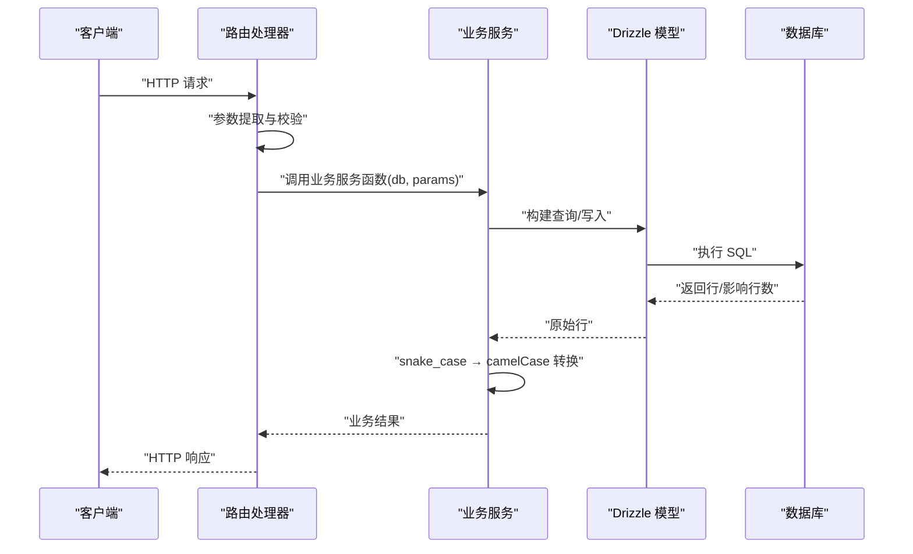
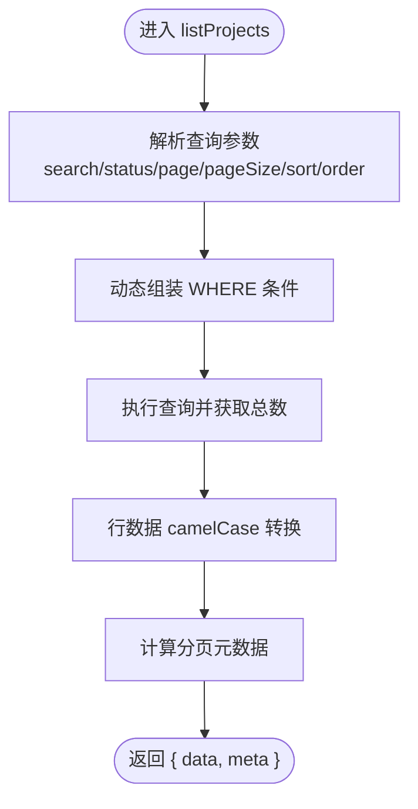
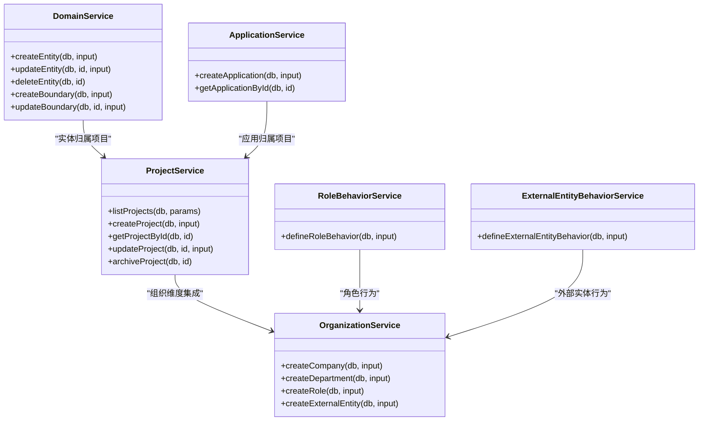
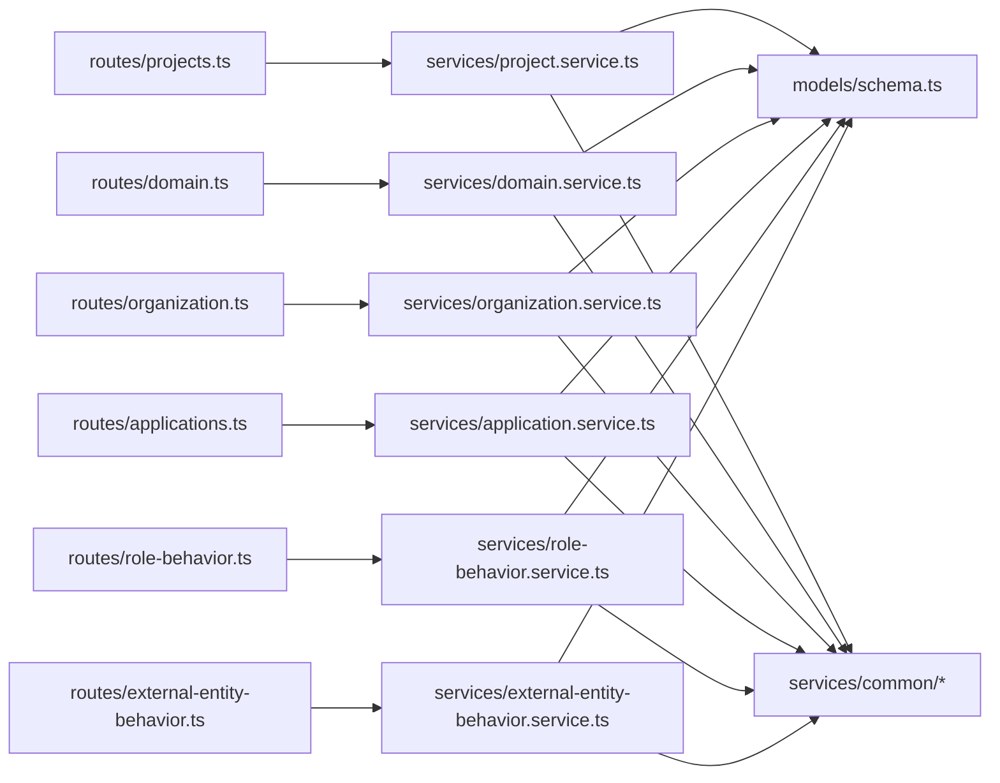
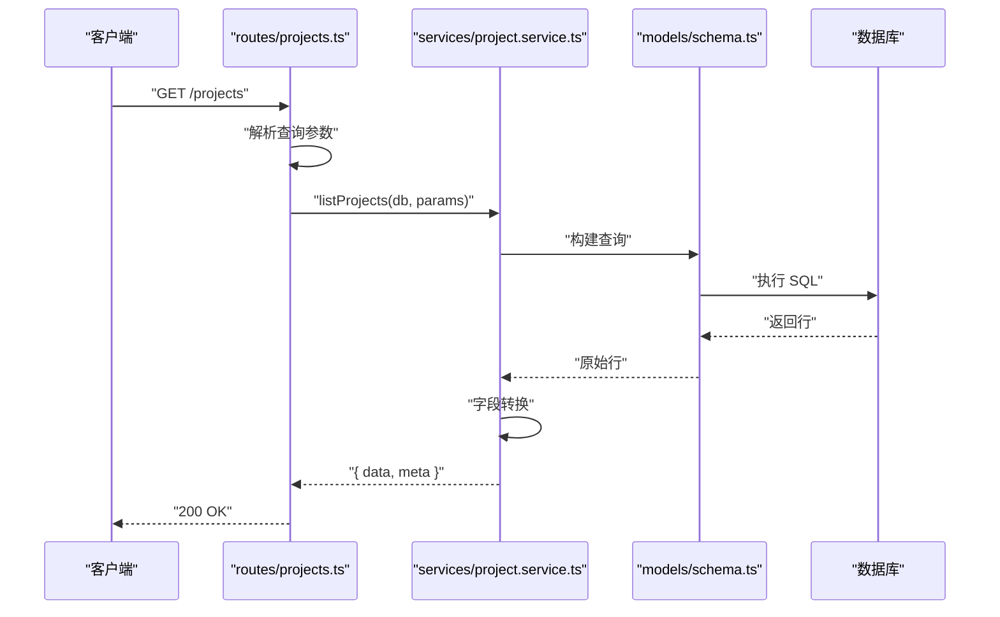

# 服务层开发

<cite>
**本文引用的文件**
- [coding-convention-backend.md](file://docs/04-tech-design/coding-convention-backend.md)
- [schema.ts](file://packages/api/src/models/schema.ts)
- [relations.ts](file://packages/api/src/models/relations.ts)
- [app.ts](file://packages/api/src/app.ts)
- [db.ts](file://packages/api/src/db.ts)
- [project.service.ts](file://packages/api/src/services/project.service.ts)
- [domain.service.ts](file://packages/api/src/services/domain.service.ts)
- [organization.service.ts](file://packages/api/src/services/organization.service.ts)
- [application.service.ts](file://packages/api/src/services/application.service.ts)
- [behavior-common.ts](file://packages/api/src/services/behavior-common.ts)
- [role-behavior.service.ts](file://packages/api/src/services/role-behavior.service.ts)
- [external-entity-behavior.service.ts](file://packages/api/src/services/external-entity-behavior.service.ts)
- [errors.ts](file://packages/api/src/services/common/errors.ts)
- [pagination.ts](file://packages/api/src/services/common/pagination.ts)
- [index.ts](file://packages/api/src/services/common/index.ts)
- [projects.ts](file://packages/api/src/routes/projects.ts)
- [domain.ts](file://packages/api/src/routes/domain.ts)
- [organization.ts](file://packages/api/src/routes/organization.ts)
- [applications.ts](file://packages/api/src/routes/applications.ts)
- [role-behavior.ts](file://packages/api/src/routes/role-behavior.ts)
- [external-entity-behavior.ts](file://packages/api/src/routes/external-entity-behavior.ts)
- [f-m1-01-list.test.ts](file://packages/api/tests/project-management/f-m1-01-list.test.ts)
- [f-m1-02-create.test.ts](file://packages/api/tests/project-management/f-m1-02-create.test.ts)
- [f-m1-03-detail.test.ts](file://packages/api/tests/project-management/f-m1-03-detail.test.ts)
- [f-m1-04-edit.test.ts](file://packages/api/tests/project-management/f-m1-04-edit.test.ts)
- [f-m1-05-archive.test.ts](file://packages/api/tests/project-management/f-m1-05-archive.test.ts)
- [f-m1-06-company.test.ts](file://packages/api/tests/project-management/f-m1-06-company.test.ts)
- [f-m1-07-department.test.ts](file://packages/api/tests/project-management/f-m1-07-department.test.ts)
- [f-m1-08-roles.test.ts](file://packages/api/tests/project-management/f-m1-08-roles.test.ts)
- [f-m1-09-external-entities.test.ts](file://packages/api/tests/project-management/f-m1-09-external-entities.test.ts)
- [f-m1-11-application.test.ts](file://packages/api/tests/project-management/f-m1-11-application.test.ts)
- [f-m1-12-role-behavior.test.ts](file://packages/api/tests/project-management/f-m1-12-role-behavior.test.ts)
- [f-m1-13-external-entity-behavior.test.ts](file://packages/api/tests/project-management/f-m1-13-external-entity-behavior.test.ts)
- [f-m2-01-entity.test.ts](file://packages/api/tests/domain-model/f-m2-01-entity.test.ts)
- [f-m2-02-field.test.ts](file://packages/api/tests/domain-model/f-m2-02-field.test.ts)
- [f-m2-03-relation.test.ts](file://packages/api/tests/domain-model/f-m2-03-relation.test.ts)
- [f-m2-04-er-graph.test.ts](file://packages/api/tests/domain-model/f-m2-04-er-graph.test.ts)
- [f-m2-06-boundary.test.ts](file://packages/api/tests/domain-model/f-m2-06-boundary.test.ts)
</cite>

## 目录
1. [引言](#引言)
2. [项目结构](#项目结构)
3. [核心组件](#核心组件)
4. [架构总览](#架构总览)
5. [详细组件分析](#详细组件分析)
6. [依赖分析](#依赖分析)
7. [性能考虑](#性能考虑)
8. [故障排查指南](#故障排查指南)
9. [结论](#结论)
10. [附录](#附录)

## 引言
本指南面向AI原型管理系统后端服务层的开发与维护，系统化阐述服务层架构模式、业务逻辑封装原则、核心服务实现、服务间依赖与调用模式、事务管理与错误处理策略，并提供测试方法、模拟对象使用建议、性能优化与缓存策略，以及实际服务实现与使用示例的定位路径。

## 项目结构
服务层位于 packages/api/src 下，采用“分层架构 + 资源分组”的组织方式：
- 分层职责
  - Route：HTTP协议适配，参数提取、校验触发、响应组装
  - Service：业务规则实现、数据转换（snake_case→camelCase）、事务编排
  - Model（Drizzle）：表结构与关系定义、数据访问原语
- 资源分组
  - 项目管理、领域模型、组织架构、应用与行为等模块按功能域划分
- 目录结构要点
  - services/ 下的各模块服务文件
  - models/ 下的 schema.ts 与 relations.ts
  - routes/ 下的各模块路由文件
  - services/common/ 提供公共工具与错误类型

图表来源
- [coding-convention-backend.md:16-63](file://docs/04-tech-design/coding-convention-backend.md#L16-L63)
- [schema.ts](file://packages/api/src/models/schema.ts)
- [relations.ts](file://packages/api/src/models/relations.ts)
- [projects.ts](file://packages/api/src/routes/projects.ts)
- [domain.ts](file://packages/api/src/routes/domain.ts)
- [organization.ts](file://packages/api/src/routes/organization.ts)

章节来源
- [coding-convention-backend.md:16-63](file://docs/04-tech-design/coding-convention-backend.md#L16-L63)
- [coding-convention-backend.md:120-201](file://docs/04-tech-design/coding-convention-backend.md#L120-L201)

## 核心组件
- 服务层通用约束
  - 纯函数风格：导出函数以 db 为首个参数，避免使用全局单例，便于测试注入 mock
  - 数据转换：在 Service 层完成 snake_case → camelCase 转换
  - 业务异常：统一使用 AppError 抛出，携带 HTTP 语义的 statusCode 与 code
  - SQL 安全：通过 Drizzle Query Builder 构建查询，禁止字符串拼接
  - 业务规则标注：PRD 业务规则需在代码中以注释形式标注 B-Mx-Nn
- 公共工具
  - 错误类型：AppError 及 ERROR_CODES
  - 分页：buildMeta 等分页辅助函数
  - 统一导出：common/index.ts 汇总导出

章节来源
- [coding-convention-backend.md:193-201](file://docs/04-tech-design/coding-convention-backend.md#L193-L201)
- [errors.ts](file://packages/api/src/services/common/errors.ts)
- [pagination.ts](file://packages/api/src/services/common/pagination.ts)
- [index.ts](file://packages/api/src/services/common/index.ts)

## 架构总览
服务层遵循“Route → Service → Model”的单向调用链，确保职责清晰、可测试性强、可演进。

图表来源
- [coding-convention-backend.md:53-61](file://docs/04-tech-design/coding-convention-backend.md#L53-L61)
- [projects.ts](file://packages/api/src/routes/projects.ts)
- [project.service.ts](file://packages/api/src/services/project.service.ts)
- [schema.ts](file://packages/api/src/models/schema.ts)

## 详细组件分析

### 项目管理服务（project.service.ts）
- 职责范围
  - 项目 CRUD、列表检索（支持搜索、筛选、分页、排序）
  - 项目归档与状态管理
  - 与组织架构（公司/部门/角色/外部实体）的集成
- 关键实现要点
  - 查询参数标准化：search、status、page、pageSize、sort、order
  - 动态条件组装：根据传入参数拼装 WHERE 条件
  - 分页元数据：使用 buildMeta 计算分页信息
  - 数据转换：将 Drizzle 返回的 snake_case 字段转为 camelCase
  - 错误处理：使用 AppError 抛出业务异常
- 事务与并发
  - 对于涉及多表写入的操作，应在 Service 层进行事务编排
  - 对于只读查询，保持幂等与可重复读隔离级别
- 依赖关系
  - 依赖 models/schema.ts 中的 projects 表定义
  - 依赖 organization.service.ts 的组织实体管理能力
  - 依赖 common/errors.ts 与 common/pagination.ts

图表来源
- [project.service.ts](file://packages/api/src/services/project.service.ts)
- [pagination.ts](file://packages/api/src/services/common/pagination.ts)

章节来源
- [coding-convention-backend.md:120-191](file://docs/04-tech-design/coding-convention-backend.md#L120-L191)
- [project.service.ts](file://packages/api/src/services/project.service.ts)

### 领域模型服务（domain.service.ts）
- 职责范围
  - 实体（EntityDef）、字段（FieldDef）、关系（RelationDef）的 CRUD
  - 领域边界（DomainBoundary）管理
  - ER 图可视化与配置存储（config）
- 关键实现要点
  - 严格区分“领域模型定义”与“项目 JSON 节点映射”
  - 领域边界与实体的 N:1 可选归属关系
  - config 字段用于 Canvas 位置与尺寸等 UI 元数据
- 依赖关系
  - 依赖 models/schema.ts 中的 domain 相关表
  - 依赖 relations.ts 中的表间关系定义

章节来源
- [domain.service.ts](file://packages/api/src/services/domain.service.ts)
- [schema.ts](file://packages/api/src/models/schema.ts)
- [relations.ts](file://packages/api/src/models/relations.ts)

### 组织架构服务（organization.service.ts）
- 职责范围
  - 公司（Company）、部门（Department）、角色（Role）、外部实体（ExternalEntity）的管理
  - 支持独立角色与挂载到部门的角色两种模式
  - 与项目（Project）的多对多/多对一关联
- 关键实现要点
  - 独立性设计：departmentId 可选，满足 2B/2C 场景差异
  - 外部实体支持多种类型与联系信息
  - 与项目管理服务协同，提供组织维度的筛选与权限控制

章节来源
- [organization.service.ts](file://packages/api/src/services/organization.service.ts)

### 应用与行为服务
- 应用服务（application.service.ts）
  - 应用生命周期与类型管理（平台应用、API 应用、Service 应用等）
  - 与页面、组件、钩子、定时器等的关联
- 行为服务（role-behavior.service.ts、external-entity-behavior.service.ts、behavior-common.ts）
  - 角色行为与外部实体行为的定义与执行
  - 通用行为逻辑抽取至 behavior-common.ts，复用规则与校验

章节来源
- [application.service.ts](file://packages/api/src/services/application.service.ts)
- [role-behavior.service.ts](file://packages/api/src/services/role-behavior.service.ts)
- [external-entity-behavior.service.ts](file://packages/api/src/services/external-entity-behavior.service.ts)
- [behavior-common.ts](file://packages/api/src/services/behavior-common.ts)

### 服务层类图（概览）

图表来源
- [project.service.ts](file://packages/api/src/services/project.service.ts)
- [domain.service.ts](file://packages/api/src/services/domain.service.ts)
- [organization.service.ts](file://packages/api/src/services/organization.service.ts)
- [application.service.ts](file://packages/api/src/services/application.service.ts)
- [role-behavior.service.ts](file://packages/api/src/services/role-behavior.service.ts)
- [external-entity-behavior.service.ts](file://packages/api/src/services/external-entity-behavior.service.ts)

## 依赖分析
- 路由到服务
  - routes/projects.ts → services/project.service.ts
  - routes/domain.ts → services/domain.service.ts
  - routes/organization.ts → services/organization.service.ts
  - routes/applications.ts → services/application.service.ts
  - routes/role-behavior.ts → services/role-behavior.service.ts
  - routes/external-entity-behavior.ts → services/external-entity-behavior.service.ts
- 服务到模型
  - 各 service 通过 Drizzle ORM 访问 models/schema.ts 中的表定义
  - relations.ts 提供表间关系，支撑 JOIN/外键约束
- 服务到公共工具
  - errors.ts 提供统一错误类型
  - pagination.ts 提供分页元数据生成
  - common/index.ts 汇总导出

图表来源
- [projects.ts](file://packages/api/src/routes/projects.ts)
- [domain.ts](file://packages/api/src/routes/domain.ts)
- [organization.ts](file://packages/api/src/routes/organization.ts)
- [applications.ts](file://packages/api/src/routes/applications.ts)
- [role-behavior.ts](file://packages/api/src/routes/role-behavior.ts)
- [external-entity-behavior.ts](file://packages/api/src/routes/external-entity-behavior.ts)
- [schema.ts](file://packages/api/src/models/schema.ts)
- [index.ts](file://packages/api/src/services/common/index.ts)

章节来源
- [coding-convention-backend.md:53-61](file://docs/04-tech-design/coding-convention-backend.md#L53-L61)

## 性能考虑
- 查询优化
  - 为高频查询字段建立索引（如项目列表的项目 ID、状态、更新时间等）
  - 使用分页与 LIMIT/OFFSET 控制结果集大小
  - 避免 N+1 查询：在 Service 层一次性加载关联数据
- 事务与锁
  - 对写操作使用事务包裹，保证一致性
  - 对热点数据使用合适的隔离级别，减少锁竞争
- 缓存策略
  - 读多写少的静态配置与字典数据可缓存
  - 利用 Redis 或进程内缓存存储热点查询结果，设置合理过期时间
  - 对分页列表结果进行缓存，结合版本号或时间戳失效
- 数据转换成本
  - 在 Service 层集中做 snake_case → camelCase 转换，避免重复转换
- 监控与告警
  - 对慢查询与高延迟接口进行监控与告警

## 故障排查指南
- 错误类型与码值
  - 使用 AppError 抛出业务异常，确保 HTTP 语义正确
  - 在 common/errors.ts 中定义 ERROR_CODES，便于统一识别与日志记录
- 日志与追踪
  - 在 Service 层记录关键业务事件与异常上下文
  - 为请求分配 traceId，贯穿 Route → Service → Model → DB
- 常见问题定位
  - 参数校验失败：检查路由层的 TypeBox 校验中间件是否生效
  - SQL 注入风险：确认所有查询通过 Drizzle Query Builder 构建
  - 数据转换错误：核对 Service 层的字段映射与驼峰转换逻辑
  - 事务未提交：检查 Service 层是否显式开启/回滚事务

章节来源
- [errors.ts](file://packages/api/src/services/common/errors.ts)
- [coding-convention-backend.md:193-201](file://docs/04-tech-design/coding-convention-backend.md#L193-L201)

## 结论
服务层通过严格的分层约束与统一的编码规范，实现了业务逻辑的高内聚、低耦合与强可测性。围绕项目管理、领域模型、组织架构与应用行为等核心模块，服务层提供了清晰的职责边界与稳定的依赖关系。配合事务管理、错误处理与性能优化策略，能够支撑系统的持续演进与高质量交付。

## 附录

### 服务层调用序列（以项目管理为例）

图表来源
- [projects.ts](file://packages/api/src/routes/projects.ts)
- [project.service.ts](file://packages/api/src/services/project.service.ts)
- [schema.ts](file://packages/api/src/models/schema.ts)

### 测试方法与模拟对象
- 单元测试
  - 使用 Vitest 框架，针对 Service 层函数进行纯函数风格测试
  - 通过 mock db 实例注入，隔离外部依赖
- 集成测试
  - 项目管理模块：f-m1-01 ~ f-m1-13 的测试文件覆盖 CRUD、组织、应用、行为等场景
  - 领域模型模块：f-m2-01 ~ f-m2-06 的测试文件覆盖实体、字段、关系、ER 图、领域边界等场景
- 测试工厂与 API 客户端
  - tests/helpers/test-factory.ts 与 tests/helpers/api-test-client.ts 提供测试数据构造与请求封装

章节来源
- [f-m1-01-list.test.ts](file://packages/api/tests/project-management/f-m1-01-list.test.ts)
- [f-m1-02-create.test.ts](file://packages/api/tests/project-management/f-m1-02-create.test.ts)
- [f-m1-03-detail.test.ts](file://packages/api/tests/project-management/f-m1-03-detail.test.ts)
- [f-m1-04-edit.test.ts](file://packages/api/tests/project-management/f-m1-04-edit.test.ts)
- [f-m1-05-archive.test.ts](file://packages/api/tests/project-management/f-m1-05-archive.test.ts)
- [f-m1-06-company.test.ts](file://packages/api/tests/project-management/f-m1-06-company.test.ts)
- [f-m1-07-department.test.ts](file://packages/api/tests/project-management/f-m1-07-department.test.ts)
- [f-m1-08-roles.test.ts](file://packages/api/tests/project-management/f-m1-08-roles.test.ts)
- [f-m1-09-external-entities.test.ts](file://packages/api/tests/project-management/f-m1-09-external-entities.test.ts)
- [f-m1-11-application.test.ts](file://packages/api/tests/project-management/f-m1-11-application.test.ts)
- [f-m1-12-role-behavior.test.ts](file://packages/api/tests/project-management/f-m1-12-role-behavior.test.ts)
- [f-m1-13-external-entity-behavior.test.ts](file://packages/api/tests/project-management/f-m1-13-external-entity-behavior.test.ts)
- [f-m2-01-entity.test.ts](file://packages/api/tests/domain-model/f-m2-01-entity.test.ts)
- [f-m2-02-field.test.ts](file://packages/api/tests/domain-model/f-m2-02-field.test.ts)
- [f-m2-03-relation.test.ts](file://packages/api/tests/domain-model/f-m2-03-relation.test.ts)
- [f-m2-04-er-graph.test.ts](file://packages/api/tests/domain-model/f-m2-04-er-graph.test.ts)
- [f-m2-06-boundary.test.ts](file://packages/api/tests/domain-model/f-m2-06-boundary.test.ts)