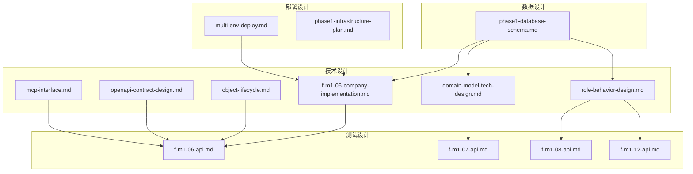
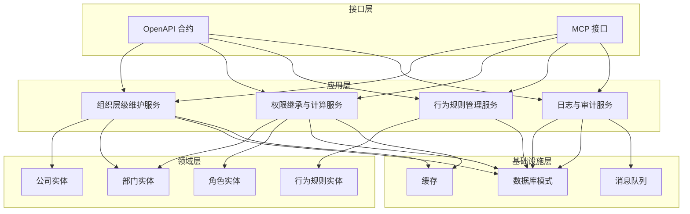
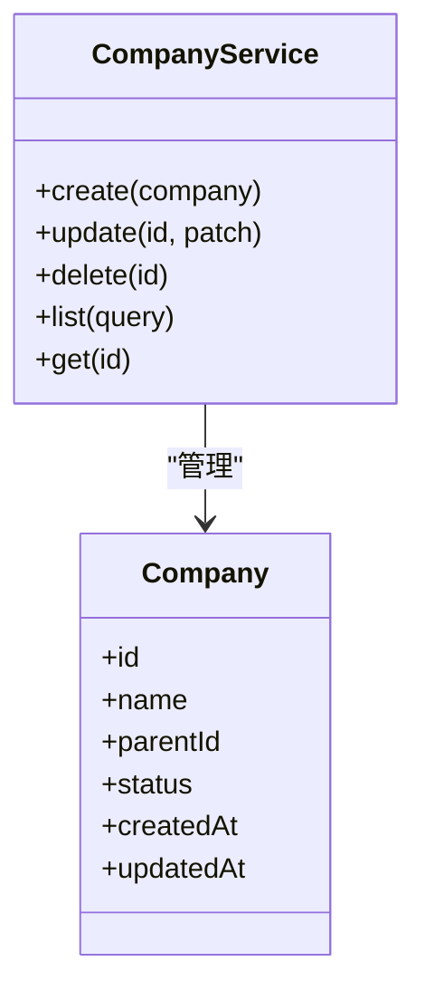
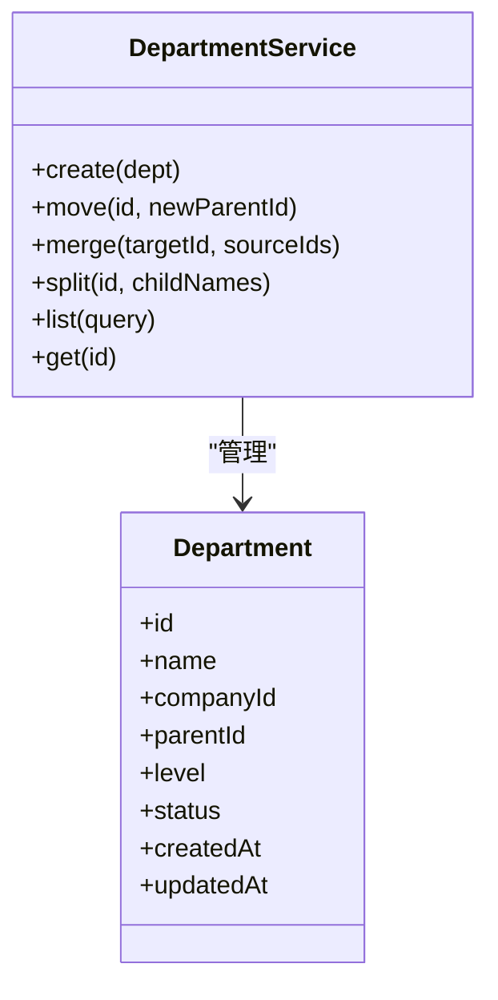
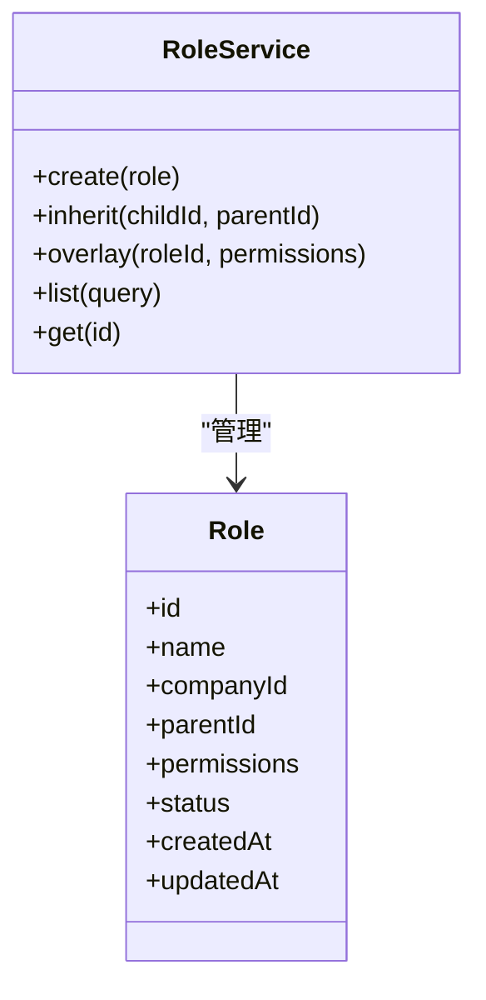
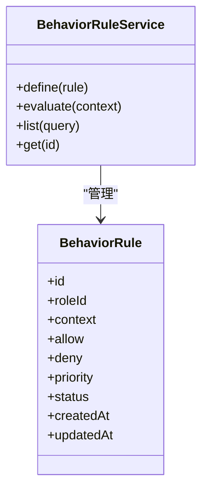
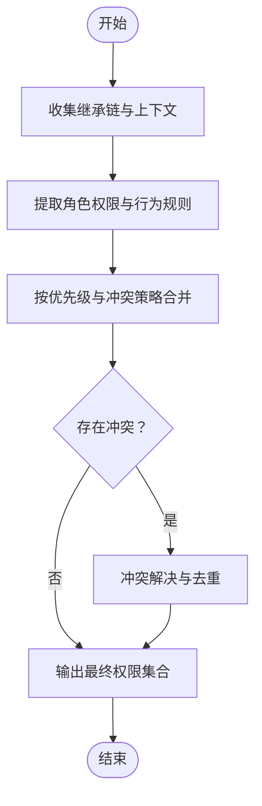
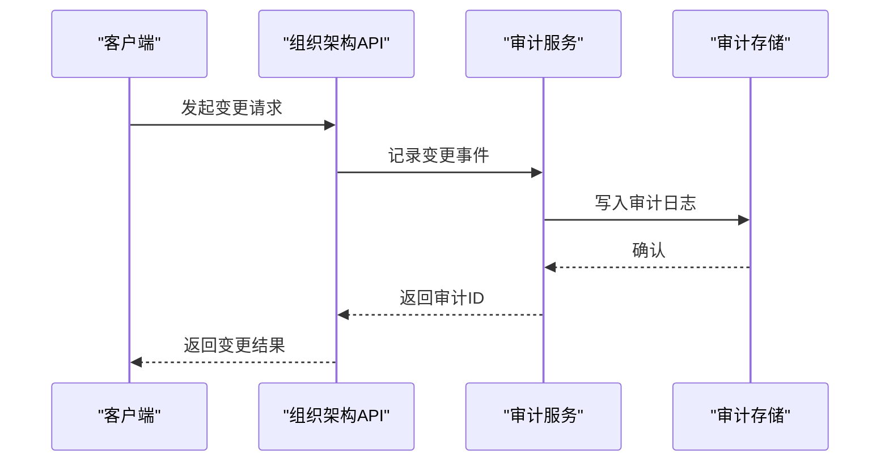
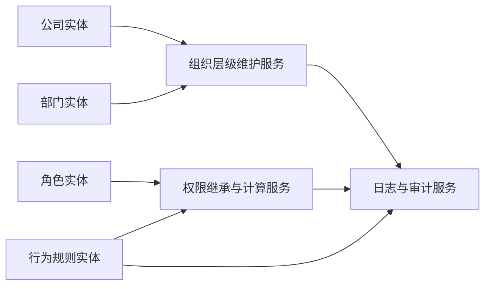

# 组织架构服务

<cite>
**本文引用的文件**
- [f-m1-06-company-implementation.md](file://docs/04-tech-design/f-m1-06-company-implementation.md)
- [f-m1-06-api.md](file://docs/06-test-design/modules/project-management/f-m1-06-company/f-m1-06-api.md)
- [f-m1-07-api.md](file://docs/06-test-design/modules/project-management/f-m1-07-department/f-m1-07-api.md)
- [f-m1-08-api.md](file://docs/06-test-design/modules/project-management/f-m1-08-role/f-m1-08-api.md)
- [f-m1-12-api.md](file://docs/06-test-design/modules/project-management/f-m1-12-role-behavior/f-m1-12-api.md)
- [f-m1-06-e2e.md](file://docs/99-archived/e2e-test-cases/f-m1-06-e2e.md)
- [f-m1-07-e2e.md](file://docs/99-archived/e2e-test-cases/f-m1-07-e2e.md)
- [f-m1-08-e2e.md](file://docs/99-archived/e2e-test-cases/f-m1-08-e2e.md)
- [phase1-database-schema.md](file://docs/05-data-design/phase1-database-schema.md)
- [domain-model-tech-design.md](file://docs/04-tech-design/domain-model-tech-design.md)
- [role-behavior-design.md](file://docs/04-tech-design/role-behavior-design.md)
- [object-lifecycle.md](file://docs/04-tech-design/object-lifecycle.md)
- [openapi-contract-design.md](file://docs/04-tech-design/openapi-contract-design.md)
- [mcp-interface.md](file://docs/04-tech-design/mcp-interface.md)
- [f-m1-06-company.test.ts](file://packages/api/tests/project-management/f-m1-06-company.test.ts)
- [f-m1-07-department.test.ts](file://packages/api/tests/project-management/f-m1-07-department.test.ts)
- [f-m1-08-roles.test.ts](file://packages/api/tests/project-management/f-m1-08-roles.test.ts)
- [f-m1-12-role-behavior.test.ts](file://packages/api/tests/project-management/f-m1-12-role-behavior.test.ts)
- [f-m1-06-company.spec.ts](file://packages/e2e/tests/project-management/f-m1-06-company.spec.ts)
- [phase1-infrastructure-plan.md](file://docs/07-deploy-design/phase1-infrastructure-plan.md)
- [multi-env-deploy.md](file://docs/07-deploy-design/multi-env-deploy.md)
</cite>

## 目录
1. [引言](#引言)
2. [项目结构](#项目结构)
3. [核心组件](#核心组件)
4. [架构总览](#架构总览)
5. [详细组件分析](#详细组件分析)
6. [依赖关系分析](#依赖关系分析)
7. [性能考虑](#性能考虑)
8. [故障排查指南](#故障排查指南)
9. [结论](#结论)
10. [附录](#附录)

## 引言
本技术文档围绕组织架构服务展开，系统性阐述公司、部门与角色的业务模型与实现要点，覆盖组织层级结构维护、权限继承机制、行为规则管理、角色权限分配算法与动态权限计算策略，并提供组织架构变更的日志追踪与审计能力设计思路。文档同时梳理服务间依赖关系与数据一致性保障机制，给出最佳实践与性能优化建议，帮助读者在不深入源码的情况下理解整体设计与实现。

## 项目结构
该仓库采用多文档与多包并行的组织方式：技术设计文档集中于 docs/04-tech-design，测试用例位于 packages/api/tests 与 packages/e2e/tests，数据库设计与部署方案分别在 docs/05-data-design 与 docs/07-deploy-design 中。与组织架构直接相关的关键文件包括：
- 技术设计：公司实现、领域模型、角色行为设计、对象生命周期、OpenAPI 合约、MCP 接口等
- 测试设计：公司、部门、角色、角色行为的 API 测试设计
- 数据设计：数据库模式（含实体关系）
- 部署设计：基础设施与多环境部署规划

**图表来源**
- [f-m1-06-company-implementation.md](file://docs/04-tech-design/f-m1-06-company-implementation.md)
- [domain-model-tech-design.md](file://docs/04-tech-design/domain-model-tech-design.md)
- [role-behavior-design.md](file://docs/04-tech-design/role-behavior-design.md)
- [object-lifecycle.md](file://docs/04-tech-design/object-lifecycle.md)
- [openapi-contract-design.md](file://docs/04-tech-design/openapi-contract-design.md)
- [mcp-interface.md](file://docs/04-tech-design/mcp-interface.md)
- [f-m1-06-api.md](file://docs/06-test-design/modules/project-management/f-m1-06-company/f-m1-06-api.md)
- [f-m1-07-api.md](file://docs/06-test-design/modules/project-management/f-m1-07-department/f-m-m1-07-api.md)
- [f-m1-08-api.md](file://docs/06-test-design/modules/project-management/f-m1-08-role/f-m1-08-api.md)
- [f-m1-12-api.md](file://docs/06-test-design/modules/project-management/f-m1-12-role-behavior/f-m1-12-api.md)
- [phase1-database-schema.md](file://docs/05-data-design/phase1-database-schema.md)
- [phase1-infrastructure-plan.md](file://docs/07-deploy-design/phase1-infrastructure-plan.md)
- [multi-env-deploy.md](file://docs/07-deploy-design/multi-env-deploy.md)

**章节来源**
- [f-m1-06-company-implementation.md](file://docs/04-tech-design/f-m1-06-company-implementation.md)
- [domain-model-tech-design.md](file://docs/04-tech-design/domain-model-tech-design.md)
- [role-behavior-design.md](file://docs/04-tech-design/role-behavior-design.md)
- [object-lifecycle.md](file://docs/04-tech-design/object-lifecycle.md)
- [openapi-contract-design.md](file://docs/04-tech-design/openapi-contract-design.md)
- [mcp-interface.md](file://docs/04-tech-design/mcp-interface.md)
- [phase1-database-schema.md](file://docs/05-data-design/phase1-database-schema.md)
- [phase1-infrastructure-plan.md](file://docs/07-deploy-design/phase1-infrastructure-plan.md)
- [multi-env-deploy.md](file://docs/07-deploy-design/multi-env-deploy.md)

## 核心组件
- 公司（Company）：组织架构顶层实体，负责组织边界与全局策略的定义；支持层级化扩展与跨公司资源协同。
- 部门（Department）：组织中最小可治理单元，具备独立运营能力与汇报关系；支持树形层级与多级继承。
- 角色（Role）：权限与职责的抽象载体，支持静态角色与动态角色组合；提供角色继承与叠加机制。
- 行为规则（Behavior Rules）：对角色在特定上下文下的行为约束与允许集进行声明式配置，支撑动态权限计算。
- 权限继承与计算：基于组织层级与角色继承链，结合行为规则，形成最终的动态权限集合。
- 日志与审计：记录组织架构变更的关键事件，确保可追溯与合规。

**章节来源**
- [f-m1-06-company-implementation.md](file://docs/04-tech-design/f-m1-06-company-implementation.md)
- [domain-model-tech-design.md](file://docs/04-tech-design/domain-model-tech-design.md)
- [role-behavior-design.md](file://docs/04-tech-design/role-behavior-design.md)

## 架构总览
组织架构服务采用分层与模块化设计：
- 领域层：公司、部门、角色、行为规则的领域模型与规则定义
- 应用层：组织层级维护、权限继承与动态计算的应用服务
- 接口层：OpenAPI 合约与 MCP 接口，统一对外暴露能力
- 基础设施层：数据库模式、缓存与消息队列，保障一致性与可观测性

**图表来源**
- [openapi-contract-design.md](file://docs/04-tech-design/openapi-contract-design.md)
- [mcp-interface.md](file://docs/04-tech-design/mcp-interface.md)
- [phase1-database-schema.md](file://docs/05-data-design/phase1-database-schema.md)
- [domain-model-tech-design.md](file://docs/04-tech-design/domain-model-tech-design.md)
- [role-behavior-design.md](file://docs/04-tech-design/role-behavior-design.md)

## 详细组件分析

### 公司（Company）组件
- 职责：定义组织边界、全局策略与跨部门资源协调；支持公司级权限与资源池管理。
- 关键能力：
  - 层级扩展：支持多公司并存与公司间协作
  - 策略下发：将公司级策略转化为部门与角色层面的默认规则
  - 审计入口：作为组织架构变更的起点，触发审计流程
- 实现要点：通过 OpenAPI 合约暴露公司创建、更新、查询与删除接口；在应用层维护公司树形结构与策略映射；在数据库层以实体表承载公司元数据与层级关系。

**图表来源**
- [f-m1-06-company-implementation.md](file://docs/04-tech-design/f-m1-06-company-implementation.md)
- [f-m1-06-api.md](file://docs/06-test-design/modules/project-management/f-m1-06-company/f-m1-06-api.md)

**章节来源**
- [f-m1-06-company-implementation.md](file://docs/04-tech-design/f-m1-06-company-implementation.md)
- [f-m1-06-api.md](file://docs/06-test-design/modules/project-management/f-m1-06-company/f-m1-06-api.md)

### 部门（Department）组件
- 职责：承载具体业务运营单元，维护组织层级与汇报关系；支持多层级树形结构。
- 关键能力：
  - 层级维护：新增、移动、合并、拆分部门
  - 汇报链校验：防止循环依赖与非法路径
  - 权限下放：将公司策略与角色权限按层级向下传递
- 实现要点：部门实体包含父节点指针与层级深度；应用层提供层级校验与拓扑排序；数据库层以邻接表或路径枚举存储层级关系。

**图表来源**
- [f-m1-07-api.md](file://docs/06-test-design/modules/project-management/f-m1-07-department/f-m1-07-api.md)

**章节来源**
- [f-m1-07-api.md](file://docs/06-test-design/modules/project-management/f-m1-07-department/f-m1-07-api.md)

### 角色（Role）组件
- 职责：抽象权限与职责，支持静态角色与动态组合；提供继承与叠加机制。
- 关键能力：
  - 角色继承：子角色自动继承父角色权限
  - 动态叠加：在同一层级内对多个角色进行权限叠加
  - 权限去重：在继承与叠加过程中进行权限去重与冲突解决
- 实现要点：角色实体包含继承链与权限集合；应用层维护继承树与叠加算法；数据库层以角色表与关系表存储继承与权限映射。

**图表来源**
- [f-m1-08-api.md](file://docs/06-test-design/modules/project-management/f-m1-08-role/f-m1-08-api.md)

**章节来源**
- [f-m1-08-api.md](file://docs/06-test-design/modules/project-management/f-m1-08-role/f-m1-08-api.md)

### 行为规则（Behavior Rules）组件
- 职责：对角色在特定上下文下的行为进行声明式约束，支撑动态权限计算。
- 关键能力：
  - 上下文感知：根据组织层级、时间窗口、资源类型等上下文决定是否生效
  - 规则叠加：多条规则按优先级与冲突策略进行合并
  - 动态生效：规则变更即时影响权限计算结果
- 实现要点：行为规则实体包含上下文条件、允许/禁止集合与优先级；应用层提供规则解析与合并引擎；数据库层以规则表与上下文表存储。

**图表来源**
- [f-m1-12-api.md](file://docs/06-test-design/modules/project-management/f-m1-12-role-behavior/f-m1-12-api.md)

**章节来源**
- [f-m1-12-api.md](file://docs/06-test-design/modules/project-management/f-m1-12-role-behavior/f-m1-12-api.md)

### 权限继承与动态计算
- 计算流程：
  1) 收集角色继承链与所在部门层级
  2) 提取角色权限与行为规则
  3) 按优先级与冲突策略合并规则
  4) 输出最终权限集合
- 冲突处理：禁止优先于允许；更具体的上下文优先于通用上下文；高优先级规则覆盖低优先级
- 性能优化：缓存继承链与规则合并结果；增量更新与失效

**图表来源**
- [role-behavior-design.md](file://docs/04-tech-design/role-behavior-design.md)
- [domain-model-tech-design.md](file://docs/04-tech-design/domain-model-tech-design.md)

**章节来源**
- [role-behavior-design.md](file://docs/04-tech-design/role-behavior-design.md)
- [domain-model-tech-design.md](file://docs/04-tech-design/domain-model-tech-design.md)

### 日志与审计
- 变更事件：公司创建/更新/删除、部门移动/合并/拆分、角色继承/叠加、行为规则定义/变更
- 审计字段：操作人、时间戳、变更前/后快照、变更原因、影响范围
- 存储与回溯：审计事件写入消息队列异步持久化，支持按组织层级与时间范围检索

**图表来源**
- [f-m1-06-e2e.md](file://docs/99-archived/e2e-test-cases/f-m1-06-e2e.md)
- [f-m1-07-e2e.md](file://docs/99-archived/e2e-test-cases/f-m1-07-e2e.md)
- [f-m1-08-e2e.md](file://docs/99-archived/e2e-test-cases/f-m1-08-e2e.md)

**章节来源**
- [f-m1-06-e2e.md](file://docs/99-archived/e2e-test-cases/f-m1-06-e2e.md)
- [f-m1-07-e2e.md](file://docs/99-archived/e2e-test-cases/f-m1-07-e2e.md)
- [f-m1-08-e2e.md](file://docs/99-archived/e2e-test-cases/f-m1-08-e2e.md)

## 依赖关系分析
- 组件耦合：
  - 组织层级维护服务依赖公司与部门实体
  - 权限继承与计算服务依赖角色与行为规则实体
  - 行为规则管理服务依赖角色实体
  - 日志与审计服务贯穿所有变更操作
- 外部依赖：
  - OpenAPI 合约与 MCP 接口定义对外契约
  - 数据库模式提供持久化基础
  - 缓存与消息队列提升性能与可靠性

**图表来源**
- [domain-model-tech-design.md](file://docs/04-tech-design/domain-model-tech-design.md)
- [role-behavior-design.md](file://docs/04-tech-design/role-behavior-design.md)
- [openapi-contract-design.md](file://docs/04-tech-design/openapi-contract-design.md)
- [mcp-interface.md](file://docs/04-tech-design/mcp-interface.md)

**章节来源**
- [domain-model-tech-design.md](file://docs/04-tech-design/domain-model-tech-design.md)
- [role-behavior-design.md](file://docs/04-tech-design/role-behavior-design.md)
- [openapi-contract-design.md](file://docs/04-tech-design/openapi-contract-design.md)
- [mcp-interface.md](file://docs/04-tech-design/mcp-interface.md)

## 性能考虑
- 缓存策略：
  - 继承链与规则合并结果缓存，减少重复计算
  - 部门树与角色权限快照缓存，加速查询
- 增量更新：
  - 变更时仅更新受影响的分支与下游节点
  - 使用版本号或时间戳标记失效点
- 并发控制：
  - 对组织层级变更加分布式锁，避免并发冲突
  - 使用幂等接口与事务保证一致性
- 监控与告警：
  - 关键路径埋点与延迟监控
  - 审计事件异步落库，避免阻塞主流程

## 故障排查指南
- 常见问题：
  - 组织层级循环依赖：检查部门移动或合并后的父子关系
  - 权限冲突：核对行为规则优先级与上下文匹配
  - 审计缺失：确认消息队列状态与审计存储可用性
- 排查步骤：
  - 通过审计日志定位变更时间线
  - 回放权限计算过程，验证继承链与规则合并
  - 校验数据库层级关系与缓存一致性

**章节来源**
- [f-m1-06-e2e.md](file://docs/99-archived/e2e-test-cases/f-m1-06-e2e.md)
- [f-m1-07-e2e.md](file://docs/99-archived/e2e-test-cases/f-m1-07-e2e.md)
- [f-m1-08-e2e.md](file://docs/99-archived/e2e-test-cases/f-m1-08-e2e.md)

## 结论
组织架构服务通过清晰的领域模型与应用层编排，实现了从公司到部门再到角色的完整权限体系。权限继承与动态计算结合行为规则，提供了灵活且可审计的权限管理能力。配合完善的日志与审计、缓存与并发控制策略，能够在保证数据一致性的前提下满足高性能需求。建议在生产环境中持续完善规则冲突检测与自动化回归测试，确保系统稳定性与可维护性。

## 附录
- 最佳实践：
  - 明确角色职责边界，避免过度继承导致权限膨胀
  - 使用上下文敏感的行为规则，减少全局硬编码
  - 将审计视为基础设施的一部分，贯穿所有关键操作
- 性能优化建议：
  - 对热点路径进行缓存与批量处理
  - 分层异步处理变更，降低主流程延迟
  - 建立容量评估与扩容预案