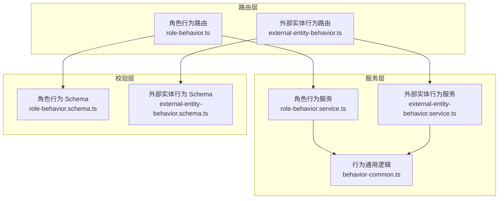
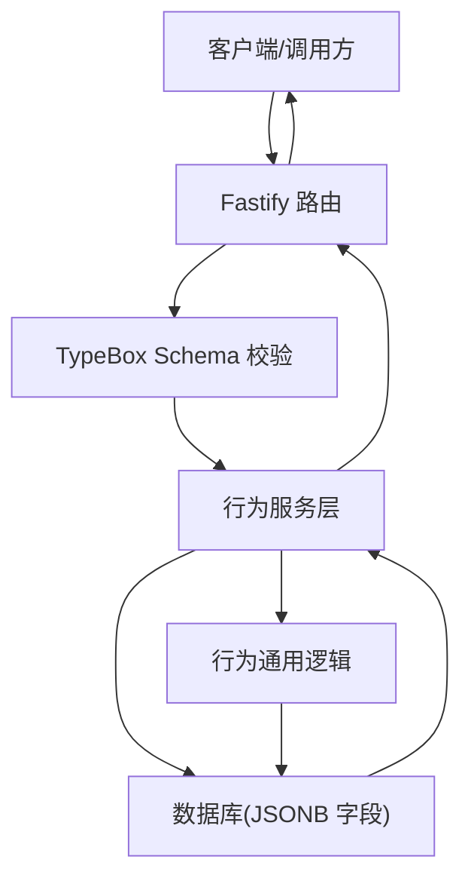
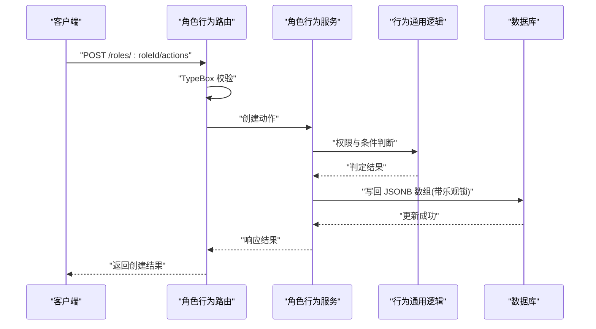
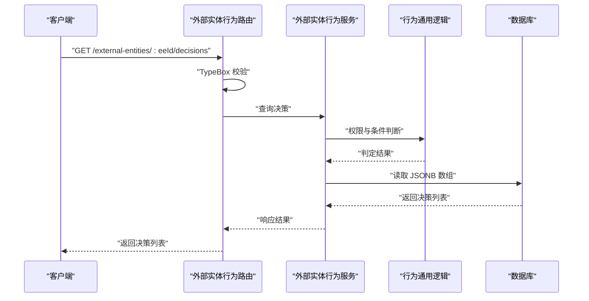
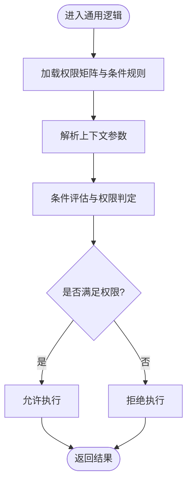
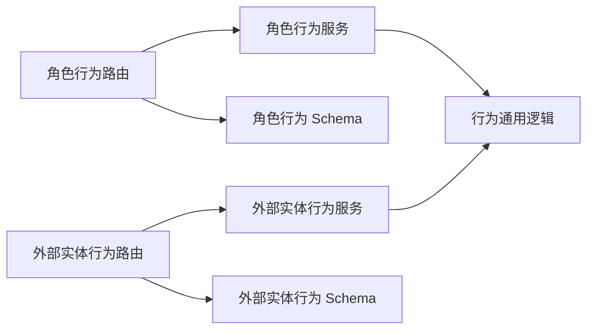

# 行为规则服务

<cite>
**本文引用的文件**
- [packages/api/src/routes/role-behavior.ts](file://packages/api/src/routes/role-behavior.ts)
- [packages/api/src/routes/external-entity-behavior.ts](file://packages/api/src/routes/external-entity-behavior.ts)
- [packages/api/src/services/role-behavior.service.ts](file://packages/api/src/services/role-behavior.service.ts)
- [packages/api/src/services/external-entity-behavior.service.ts](file://packages/api/src/services/external-entity-behavior.service.ts)
- [packages/api/src/services/behavior-common.ts](file://packages/api/src/services/behavior-common.ts)
- [packages/validation-schemas/src/role-behavior.schema.ts](file://packages/validation-schemas/src/role-behavior.schema.ts)
- [packages/validation-schemas/src/external-entity-behavior.schema.ts](file://packages/validation-schemas/src/external-entity-behavior.schema.ts)
- [packages/shared/src/types/role-behavior.ts](file://packages/shared/src/types/role-behavior.ts)
- [packages/api/tests/project-management/f-m1-12-role-behavior.test.ts](file://packages/api/tests/project-management/f-m1-12-role-behavior.test.ts)
- [packages/api/tests/project-management/f-m1-13-external-entity-behavior.test.ts](file://packages/api/tests/project-management/f-m1-13-external-entity-behavior.test.ts)
- [packages/api/tests/project-management/f-m1-14-application-behavior.test.ts](file://packages/api/tests/project-management/f-m1-14-application-behavior.test.ts)
- [docs/03-prd-ux/modules/project-management/project-management-prd-2.md](file://docs/03-prd-ux/modules/project-management/project-management-prd-2.md)
- [docs/04-tech-design/role-behavior-design.md](file://docs/04-tech-design/role-behavior-design.md)
- [docs/06-test-design/modules/project-management/f-m1-12-role-behavior/f-m1-12-api.md](file://docs/06-test-design/modules/project-management/f-m1-12-role-behavior/f-m1-12-api.md)
- [docs/06-test-design/modules/project-management/f-m1-13-external-entity-behavior/f-m1-13-api.md](file://docs/06-test-design/modules/project-management/f-m1-13-external-entity-behavior/f-m1-13-api.md)
- [docs/06-test-design/modules/project-management/f-m1-14-application-behavior/f-m1-14-api.md](file://docs/06-test-design/modules/project-management/f-m1-14-application-behavior/f-m1-14-api.md)
</cite>

## 目录
1. [简介](#简介)
2. [项目结构](#项目结构)
3. [核心组件](#核心组件)
4. [架构总览](#架构总览)
5. [详细组件分析](#详细组件分析)
6. [依赖分析](#依赖分析)
7. [性能考虑](#性能考虑)
8. [故障排查指南](#故障排查指南)
9. [结论](#结论)
10. [附录](#附录)

## 简介
本技术文档围绕“行为规则服务”展开，系统化阐述角色行为与外部实体行为的建模与执行机制，解析行为规则引擎的实现原理与执行流程，说明行为权限矩阵、条件判断逻辑与动态行为计算方式，并提供配置管理、测试验证与调试工具的实践方法。文档同时展示行为服务与权限系统的集成模式与性能优化策略，并给出复杂业务场景下的行为规则设计案例。

## 项目结构
行为规则服务由三层组成：
- 路由层：负责 HTTP 接口定义、参数校验与 OpenAPI 文档生成。
- 服务层：封装行为规则的业务逻辑、权限校验与数据持久化策略。
- 校验层：统一的输入输出 Schema，确保接口契约稳定与可测试。

图表来源
- [packages/api/src/routes/role-behavior.ts:1-200](file://packages/api/src/routes/role-behavior.ts#L1-L200)
- [packages/api/src/routes/external-entity-behavior.ts:1-200](file://packages/api/src/routes/external-entity-behavior.ts#L1-L200)
- [packages/api/src/services/role-behavior.service.ts:1-300](file://packages/api/src/services/role-behavior.service.ts#L1-L300)
- [packages/api/src/services/external-entity-behavior.service.ts:1-300](file://packages/api/src/services/external-entity-behavior.service.ts#L1-L300)
- [packages/api/src/services/behavior-common.ts:1-200](file://packages/api/src/services/behavior-common.ts#L1-L200)
- [packages/validation-schemas/src/role-behavior.schema.ts:1-200](file://packages/validation-schemas/src/role-behavior.schema.ts#L1-L200)
- [packages/validation-schemas/src/external-entity-behavior.schema.ts:1-200](file://packages/validation-schemas/src/external-entity-behavior.schema.ts#L1-L200)

章节来源
- [packages/api/src/routes/role-behavior.ts:1-200](file://packages/api/src/routes/role-behavior.ts#L1-L200)
- [packages/api/src/routes/external-entity-behavior.ts:1-200](file://packages/api/src/routes/external-entity-behavior.ts#L1-L200)
- [packages/api/src/services/role-behavior.service.ts:1-300](file://packages/api/src/services/role-behavior.service.ts#L1-L300)
- [packages/api/src/services/external-entity-behavior.service.ts:1-300](file://packages/api/src/services/external-entity-behavior.service.ts#L1-L300)
- [packages/api/src/services/behavior-common.ts:1-200](file://packages/api/src/services/behavior-common.ts#L1-L200)
- [packages/validation-schemas/src/role-behavior.schema.ts:1-200](file://packages/validation-schemas/src/role-behavior.schema.ts#L1-L200)
- [packages/validation-schemas/src/external-entity-behavior.schema.ts:1-200](file://packages/validation-schemas/src/external-entity-behavior.schema.ts#L1-L200)

## 核心组件
- 角色行为服务：提供角色行为清单的增删改查能力，支持基于 JSONB 的 actions/decisions 数组操作与行级乐观锁。
- 外部实体行为服务：提供外部实体行为清单的增删改查能力，与角色行为服务在父实体与 API 路径上对称。
- 行为通用逻辑：封装通用的校验、权限矩阵与条件判断逻辑，供两类行为服务复用。
- 路由与 Schema：Fastify 路由注册、TypeBox Schema 校验与 OpenAPI 文档生成，保证接口一致性与可测试性。

章节来源
- [packages/api/src/services/role-behavior.service.ts:1-300](file://packages/api/src/services/role-behavior.service.ts#L1-L300)
- [packages/api/src/services/external-entity-behavior.service.ts:1-300](file://packages/api/src/services/external-entity-behavior.service.ts#L1-L300)
- [packages/api/src/services/behavior-common.ts:1-200](file://packages/api/src/services/behavior-common.ts#L1-L200)
- [packages/api/src/routes/role-behavior.ts:1-200](file://packages/api/src/routes/role-behavior.ts#L1-L200)
- [packages/api/src/routes/external-entity-behavior.ts:1-200](file://packages/api/src/routes/external-entity-behavior.ts#L1-L200)
- [packages/validation-schemas/src/role-behavior.schema.ts:1-200](file://packages/validation-schemas/src/role-behavior.schema.ts#L1-L200)
- [packages/validation-schemas/src/external-entity-behavior.schema.ts:1-200](file://packages/validation-schemas/src/external-entity-behavior.schema.ts#L1-L200)

## 架构总览
行为规则服务遵循“路由-服务-校验”的分层架构，通过 JSONB 内嵌数组承载行为清单，采用行级乐观锁保障并发安全；服务层复用通用逻辑以实现角色与外部实体行为的一致性。

图表来源
- [packages/api/src/routes/role-behavior.ts:1-200](file://packages/api/src/routes/role-behavior.ts#L1-L200)
- [packages/api/src/routes/external-entity-behavior.ts:1-200](file://packages/api/src/routes/external-entity-behavior.ts#L1-L200)
- [packages/api/src/services/role-behavior.service.ts:1-300](file://packages/api/src/services/role-behavior.service.ts#L1-L300)
- [packages/api/src/services/external-entity-behavior.service.ts:1-300](file://packages/api/src/services/external-entity-behavior.service.ts#L1-L300)
- [packages/api/src/services/behavior-common.ts:1-200](file://packages/api/src/services/behavior-common.ts#L1-L200)

## 详细组件分析

### 角色行为服务（Role Behavior）
- 数据模型：角色行为以 JSONB 数组形式存储在角色实体中，包含 actions 与 decisions 清单。
- 并发控制：采用行级乐观锁，避免并发更新导致的数据覆盖。
- 权限矩阵：通过通用逻辑实现条件判断与权限判定，支持动态行为计算。
- 执行流程：路由接收请求 → Schema 校验 → 服务层执行业务逻辑 → 返回结果。

图表来源
- [packages/api/src/routes/role-behavior.ts:1-200](file://packages/api/src/routes/role-behavior.ts#L1-L200)
- [packages/api/src/services/role-behavior.service.ts:1-300](file://packages/api/src/services/role-behavior.service.ts#L1-L300)
- [packages/api/src/services/behavior-common.ts:1-200](file://packages/api/src/services/behavior-common.ts#L1-L200)

章节来源
- [packages/api/src/services/role-behavior.service.ts:1-300](file://packages/api/src/services/role-behavior.service.ts#L1-L300)
- [packages/api/src/routes/role-behavior.ts:1-200](file://packages/api/src/routes/role-behavior.ts#L1-L200)
- [packages/validation-schemas/src/role-behavior.schema.ts:1-200](file://packages/validation-schemas/src/role-behavior.schema.ts#L1-L200)
- [packages/shared/src/types/role-behavior.ts:1-200](file://packages/shared/src/types/role-behavior.ts#L1-L200)

### 外部实体行为服务（External Entity Behavior）
- 数据模型：外部实体行为同样以内嵌 JSONB 数组形式存储，支持 actions 与 decisions 清单。
- 并发控制：与角色行为一致，采用行级乐观锁。
- 业务规则：与角色行为对称，差异在于父实体与 API 路径；支持只读查询归档项目中的行为清单。
- 执行流程：路由接收请求 → Schema 校验 → 服务层执行业务逻辑 → 返回结果。

图表来源
- [packages/api/src/routes/external-entity-behavior.ts:1-200](file://packages/api/src/routes/external-entity-behavior.ts#L1-L200)
- [packages/api/src/services/external-entity-behavior.service.ts:1-300](file://packages/api/src/services/external-entity-behavior.service.ts#L1-L300)
- [packages/api/src/services/behavior-common.ts:1-200](file://packages/api/src/services/behavior-common.ts#L1-L200)

章节来源
- [packages/api/src/services/external-entity-behavior.service.ts:1-300](file://packages/api/src/services/external-entity-behavior.service.ts#L1-L300)
- [packages/api/src/routes/external-entity-behavior.ts:1-200](file://packages/api/src/routes/external-entity-behavior.ts#L1-L200)
- [packages/validation-schemas/src/external-entity-behavior.schema.ts:1-200](file://packages/validation-schemas/src/external-entity-behavior.schema.ts#L1-L200)

### 行为通用逻辑（Behavior Common）
- 权限矩阵：集中定义行为权限判定规则，支持多维条件组合与动态计算。
- 条件判断：提供统一的条件解析与评估机制，确保角色与外部实体行为在权限判定上保持一致。
- 动态行为计算：根据上下文动态生成可用行为集合，支持运行时扩展与配置驱动。

图表来源
- [packages/api/src/services/behavior-common.ts:1-200](file://packages/api/src/services/behavior-common.ts#L1-L200)

章节来源
- [packages/api/src/services/behavior-common.ts:1-200](file://packages/api/src/services/behavior-common.ts#L1-L200)

### 路由与 Schema 设计
- 路由注册：Fastify 插件形式注册，统一前缀与路径规范，便于扩展与维护。
- Schema 校验：使用 TypeBox 定义请求与响应结构，自动生成 OpenAPI 文档，提升接口契约稳定性。
- 测试友好：Schema 与路由解耦，便于单元测试与端到端测试。

章节来源
- [packages/api/src/routes/role-behavior.ts:1-200](file://packages/api/src/routes/role-behavior.ts#L1-L200)
- [packages/api/src/routes/external-entity-behavior.ts:1-200](file://packages/api/src/routes/external-entity-behavior.ts#L1-L200)
- [packages/validation-schemas/src/role-behavior.schema.ts:1-200](file://packages/validation-schemas/src/role-behavior.schema.ts#L1-L200)
- [packages/validation-schemas/src/external-entity-behavior.schema.ts:1-200](file://packages/validation-schemas/src/external-entity-behavior.schema.ts#L1-L200)

## 依赖分析
- 组件耦合：路由层仅依赖服务层与 Schema；服务层依赖通用逻辑与数据库；通用逻辑独立于具体实体。
- 外部依赖：Fastify、TypeBox、OpenAPI 文档生成工具链。
- 循环依赖：未发现循环依赖，职责清晰。

图表来源
- [packages/api/src/routes/role-behavior.ts:1-200](file://packages/api/src/routes/role-behavior.ts#L1-L200)
- [packages/api/src/routes/external-entity-behavior.ts:1-200](file://packages/api/src/routes/external-entity-behavior.ts#L1-L200)
- [packages/api/src/services/role-behavior.service.ts:1-300](file://packages/api/src/services/role-behavior.service.ts#L1-L300)
- [packages/api/src/services/external-entity-behavior.service.ts:1-300](file://packages/api/src/services/external-entity-behavior.service.ts#L1-L300)
- [packages/api/src/services/behavior-common.ts:1-200](file://packages/api/src/services/behavior-common.ts#L1-L200)
- [packages/validation-schemas/src/role-behavior.schema.ts:1-200](file://packages/validation-schemas/src/role-behavior.schema.ts#L1-L200)
- [packages/validation-schemas/src/external-entity-behavior.schema.ts:1-200](file://packages/validation-schemas/src/external-entity-behavior.schema.ts#L1-L200)

章节来源
- [packages/api/src/routes/role-behavior.ts:1-200](file://packages/api/src/routes/role-behavior.ts#L1-L200)
- [packages/api/src/routes/external-entity-behavior.ts:1-200](file://packages/api/src/routes/external-entity-behavior.ts#L1-L200)
- [packages/api/src/services/role-behavior.service.ts:1-300](file://packages/api/src/services/role-behavior.service.ts#L1-L300)
- [packages/api/src/services/external-entity-behavior.service.ts:1-300](file://packages/api/src/services/external-entity-behavior.service.ts#L1-L300)
- [packages/api/src/services/behavior-common.ts:1-200](file://packages/api/src/services/behavior-common.ts#L1-L200)
- [packages/validation-schemas/src/role-behavior.schema.ts:1-200](file://packages/validation-schemas/src/role-behavior.schema.ts#L1-L200)
- [packages/validation-schemas/src/external-entity-behavior.schema.ts:1-200](file://packages/validation-schemas/src/external-entity-behavior.schema.ts#L1-L200)

## 性能考虑
- JSONB 操作：批量读取与写回，减少往返次数；使用索引与投影字段降低查询开销。
- 乐观锁：避免锁竞争带来的阻塞，提高并发吞吐。
- 缓存策略：对只读行为清单进行短期缓存，降低数据库压力。
- 批处理：在批量更新场景下合并写入，减少事务开销。
- 监控指标：埋点记录行为查询与写入耗时，识别热点与瓶颈。

## 故障排查指南
- 接口错误码
  - 404：资源不存在（角色或外部实体、行为项）。
  - 400：项目归档状态下禁止写操作。
  - 409：名称重复或锁冲突。
- 常见问题
  - 并发写入失败：检查乐观锁版本号与重试策略。
  - 权限判定异常：核对权限矩阵与条件规则配置。
  - Schema 校验失败：确认请求体与响应体结构符合 Schema。
- 调试建议
  - 启用路由日志与 SQL 日志，定位请求到数据库的完整链路。
  - 使用测试用例复现问题，逐步缩小范围。
  - 对关键路径增加监控与告警，快速定位异常。

章节来源
- [packages/api/src/routes/role-behavior.ts:1-200](file://packages/api/src/routes/role-behavior.ts#L1-L200)
- [packages/api/src/routes/external-entity-behavior.ts:1-200](file://packages/api/src/routes/external-entity-behavior.ts#L1-L200)
- [packages/api/tests/project-management/f-m1-12-role-behavior.test.ts:1-200](file://packages/api/tests/project-management/f-m1-12-role-behavior.test.ts#L1-L200)
- [packages/api/tests/project-management/f-m1-13-external-entity-behavior.test.ts:1-200](file://packages/api/tests/project-management/f-m1-13-external-entity-behavior.test.ts#L1-L200)
- [packages/api/tests/project-management/f-m1-14-application-behavior.test.ts:1-200](file://packages/api/tests/project-management/f-m1-14-application-behavior.test.ts#L1-L200)

## 结论
行为规则服务通过“路由-服务-校验”的分层设计，结合 JSONB 内嵌数组与行级乐观锁，实现了角色与外部实体行为的高内聚、低耦合管理。通用逻辑统一了权限矩阵与条件判断，保证了两类行为在执行层面的一致性。配合完善的 Schema 校验、测试用例与监控体系，该方案具备良好的可维护性与扩展性，适用于复杂业务场景下的行为规则设计与落地。

## 附录
- 业务规则参考
  - 角色行为与外部实体行为在父实体与 API 路径上对称，差异仅在实体类型。
  - 归档项目中的行为清单仍可查询（只读），但禁止写操作。
- 设计文档与测试文档
  - 技术设计：角色行为设计文档。
  - 产品需求：项目管理 PRD（行为 CRUD 与业务规则）。
  - 测试设计：各模块 API 测试设计文档与用例。

章节来源
- [docs/04-tech-design/role-behavior-design.md:1-200](file://docs/04-tech-design/role-behavior-design.md#L1-L200)
- [docs/03-prd-ux/modules/project-management/project-management-prd-2.md:1065-1138](file://docs/03-prd-ux/modules/project-management/project-management-prd-2.md#L1065-L1138)
- [docs/06-test-design/modules/project-management/f-m1-12-role-behavior/f-m1-12-api.md:1-200](file://docs/06-test-design/modules/project-management/f-m1-12-role-behavior/f-m1-12-api.md#L1-L200)
- [docs/06-test-design/modules/project-management/f-m1-13-external-entity-behavior/f-m1-13-api.md:1-200](file://docs/06-test-design/modules/project-management/f-m1-13-external-entity-behavior/f-m1-13-api.md#L1-L200)
- [docs/06-test-design/modules/project-management/f-m1-14-application-behavior/f-m1-14-api.md:1-200](file://docs/06-test-design/modules/project-management/f-m1-14-application-behavior/f-m1-14-api.md#L1-L200)