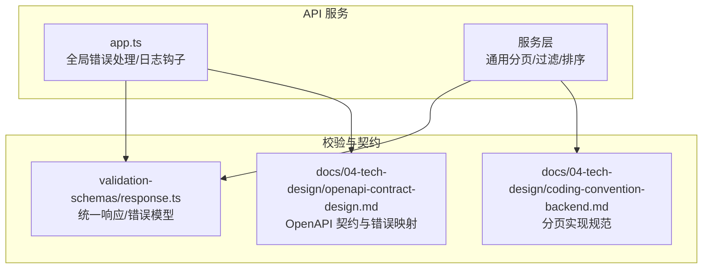
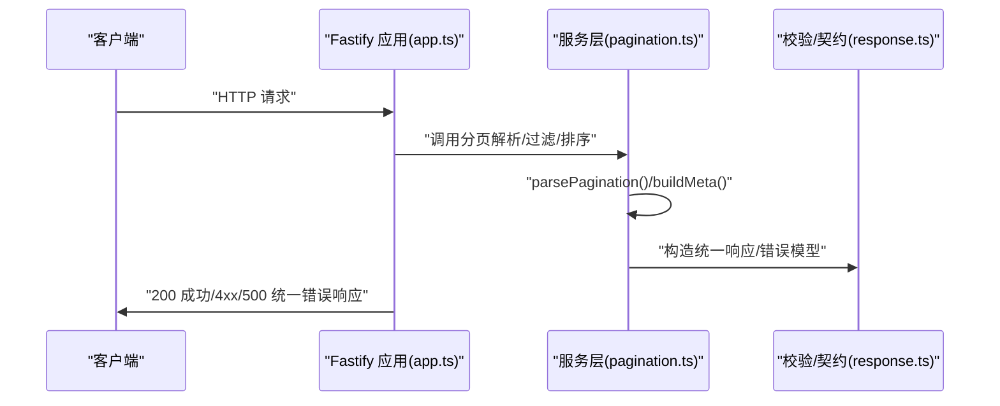
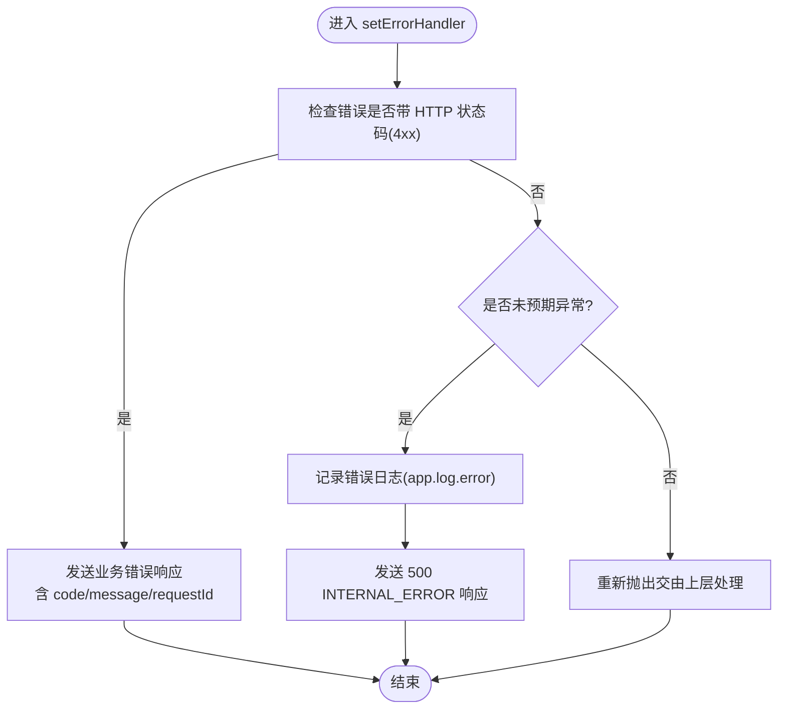
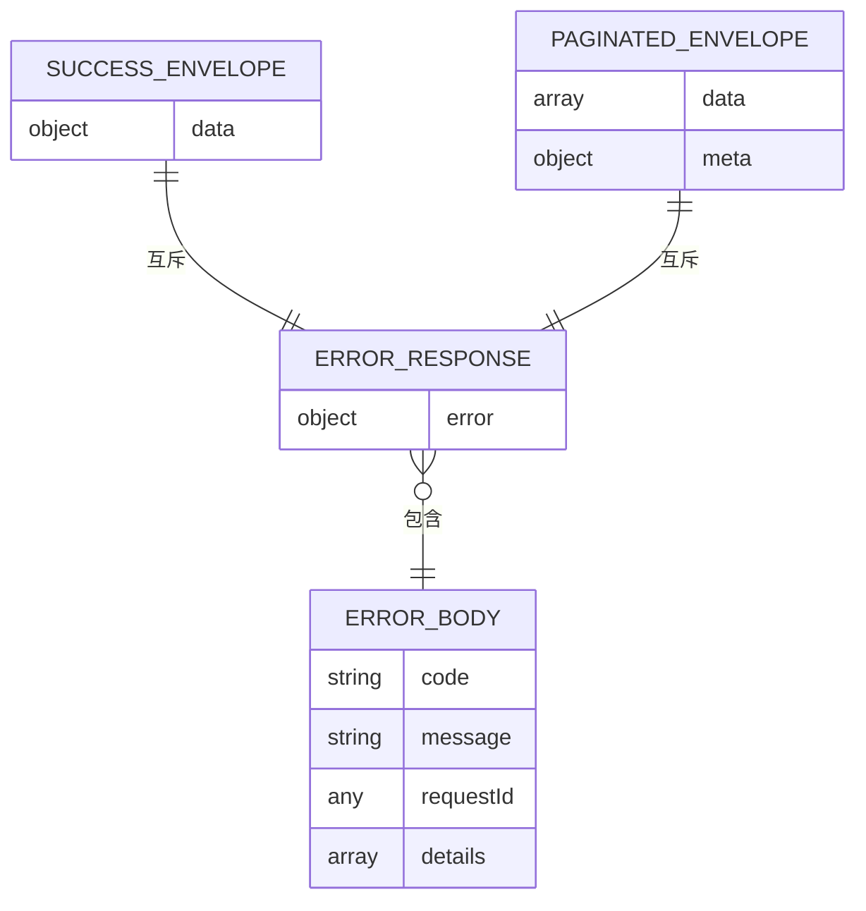
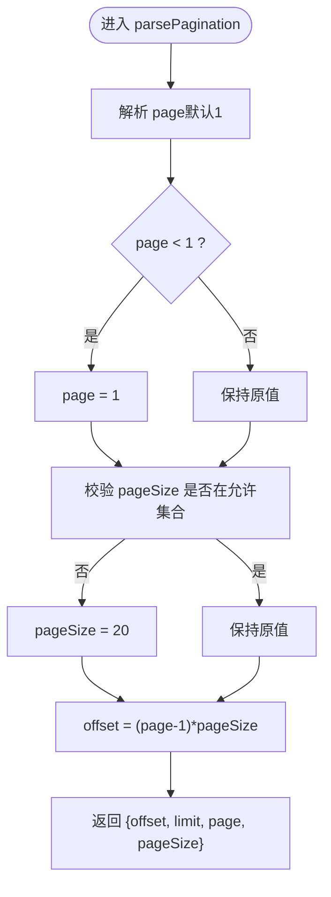
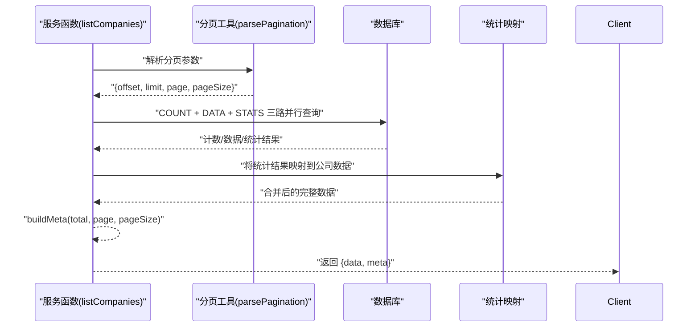
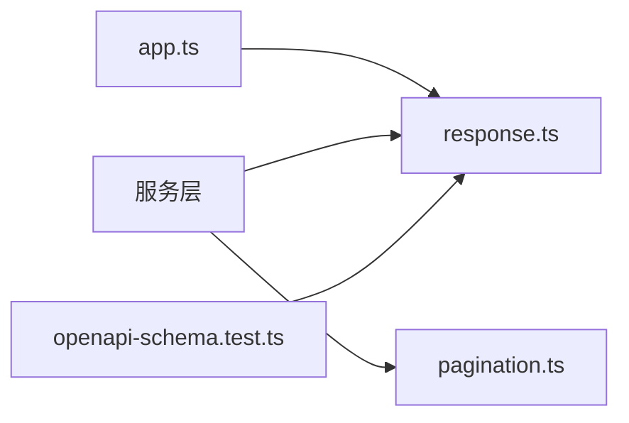

# 通用服务工具

<cite>
**本文引用的文件**
- [pagination.ts](file://packages/api/src/services/common/pagination.ts)
- [coding-convention-backend.md](file://docs/04-tech-design/coding-convention-backend.md)
- [openapi-contract-design.md](file://docs/04-tech-design/openapi-contract-design.md)
- [response.ts](file://packages/validation-schemas/src/response.ts)
- [app.ts](file://packages/api/src/app.ts)
- [phase1-infrastructure-plan.md](file://docs/04-tech-design/phase1-infrastructure-plan.md)
- [f-m1-06-company.md](file://docs/superpowers/plans/2026-05-21-f-m1-06-company.md)
- [openapi-schema.test.ts](file://packages/api/tests/openapi/openapi-schema.test.ts)
</cite>

## 目录
1. [简介](#简介)
2. [项目结构](#项目结构)
3. [核心组件](#核心组件)
4. [架构总览](#架构总览)
5. [组件详解](#组件详解)
6. [依赖关系分析](#依赖关系分析)
7. [性能考量](#性能考量)
8. [故障排查指南](#故障排查指南)
9. [结论](#结论)
10. [附录](#附录)

## 简介
本文件面向“通用服务工具”的技术文档，聚焦于：
- 错误处理机制与异常分类体系
- 统一错误码规范与统一响应格式
- 分页工具与分页查询优化
- 通用业务逻辑与过滤条件处理
- 服务间通信协议与数据传输规范
- 使用示例与最佳实践
- 标准化的错误处理与日志记录模式

## 项目结构
本项目采用前后端分离的多包结构，其中与通用服务工具密切相关的模块包括：
- API 服务：Fastify 应用、路由与服务层
- 校验与契约：TypeBox Schema 定义的统一响应与错误模型
- 文档与规范：后端编码约定、OpenAPI 合约设计等

图表来源
- [app.ts:67-107](file://packages/api/src/app.ts#L67-L107)
- [response.ts:109-136](file://packages/validation-schemas/src/response.ts#L109-L136)
- [coding-convention-backend.md:332-397](file://docs/04-tech-design/coding-convention-backend.md#L332-L397)
- [openapi-contract-design.md:163-241](file://docs/04-tech-design/openapi-contract-design.md#L163-L241)

章节来源
- [app.ts:67-107](file://packages/api/src/app.ts#L67-L107)
- [response.ts:109-136](file://packages/validation-schemas/src/response.ts#L109-L136)
- [coding-convention-backend.md:332-397](file://docs/04-tech-design/coding-convention-backend.md#L332-L397)
- [openapi-contract-design.md:163-241](file://docs/04-tech-design/openapi-contract-design.md#L163-L241)

## 核心组件
- 分页工具：统一解析与校验分页参数，生成偏移与限制，并构建分页元数据
- 统一响应与错误模型：基于 TypeBox 的 Schema，定义成功/分页/删除/错误响应结构
- 全局错误处理：Fastify setErrorHandler，区分业务错误与未预期异常，统一输出格式
- 过滤与排序：服务层通过条件拼装与排序字段控制，结合并发查询优化

章节来源
- [pagination.ts:1-49](file://packages/api/src/services/common/pagination.ts#L1-L49)
- [response.ts:109-136](file://packages/validation-schemas/src/response.ts#L109-L136)
- [app.ts:74-99](file://packages/api/src/app.ts#L74-L99)

## 架构总览
通用服务工具贯穿“请求进入 → 参数解析/校验 → 业务处理 → 统一响应/错误输出”的闭环。

图表来源
- [app.ts:74-99](file://packages/api/src/app.ts#L74-L99)
- [pagination.ts:27-49](file://packages/api/src/services/common/pagination.ts#L27-L49)
- [response.ts:109-136](file://packages/validation-schemas/src/response.ts#L109-L136)

## 组件详解

### 错误处理机制与异常分类体系
- 异常分类
  - 已知业务错误（4xx）：由服务层抛出，携带 HTTP 状态码与业务错误码
  - 校验错误（400）：Fastify 原生 Schema 校验失败，返回带 details 的错误体
  - 未预期异常（500）：全局捕获，屏蔽堆栈，返回 INTERNAL_ERROR
- 统一错误响应结构
  - 字段：code、message、requestId、details（仅 400）
  - Schema 与 Fastify setErrorHandler 输出严格对齐
- 日志记录
  - onRequest/onResponse 钩子记录请求耗时与状态
  - 未预期异常写入错误日志并返回统一错误体

图表来源
- [app.ts:74-99](file://packages/api/src/app.ts#L74-L99)
- [response.ts:109-136](file://packages/validation-schemas/src/response.ts#L109-L136)

章节来源
- [app.ts:74-99](file://packages/api/src/app.ts#L74-L99)
- [response.ts:109-136](file://packages/validation-schemas/src/response.ts#L109-L136)
- [phase1-infrastructure-plan.md:1237-1261](file://docs/04-tech-design/phase1-infrastructure-plan.md#L1237-L1261)

### 统一响应格式与错误码规范
- 成功响应
  - 单资源：{ data: T }
  - 分页列表：{ data: T[], meta: PaginationMeta }
  - 删除操作：{ success: true }
- 错误响应
  - { error: { code, message, requestId, details? } }
  - 错误码映射（示例）
    - 400: VALIDATION_FAILED（参数校验失败）
    - 404: NOT_FOUND（资源不存在）
    - 409: CONFLICT（唯一约束冲突/状态非法）
    - 500: INTERNAL_ERROR（未预期异常）
- OpenAPI 契约
  - schema.response 明确声明端点可能返回的状态码
  - 契约测试保证大多数端点声明了 4xx/5xx 错误响应

图表来源
- [openapi-contract-design.md:163-241](file://docs/04-tech-design/openapi-contract-design.md#L163-L241)
- [response.ts:109-136](file://packages/validation-schemas/src/response.ts#L109-L136)

章节来源
- [openapi-contract-design.md:163-241](file://docs/04-tech-design/openapi-contract-design.md#L163-L241)
- [openapi-schema.test.ts:144-167](file://packages/api/tests/openapi/openapi-schema.test.ts#L144-L167)

### 分页工具与查询优化
- 分页参数解析
  - page 默认 1，小于 1 强制为 1
  - pageSize 仅允许 10/20/50/100，否则回退为 20
  - 生成 offset 与 limit，避免越界
- 分页元数据
  - total、page、pageSize 由后端提供
  - 不包含 totalPages，由前端自行计算
- 查询优化策略
  - 并行查询：COUNT + DATA + STATS 三路并行，降低总延迟
  - 排序：按创建时间倒序，保证新数据优先
  - 过滤：支持双字段模糊搜索（名称/显示名），并拼接 where 条件

图表来源
- [pagination.ts:27-39](file://packages/api/src/services/common/pagination.ts#L27-L39)
- [coding-convention-backend.md:378-396](file://docs/04-tech-design/coding-convention-backend.md#L378-L396)

章节来源
- [pagination.ts:1-49](file://packages/api/src/services/common/pagination.ts#L1-L49)
- [f-m1-06-company.md:709-765](file://docs/superpowers/plans/2026-05-21-f-m1-06-company.md#L709-L765)

### 通用业务逻辑与过滤条件处理
- 过滤条件
  - 基础条件：按项目 ID 过滤
  - 可选搜索：双字段模糊匹配（名称/显示名）
  - 条件拼装：and/or 组合，whereClause 动态生成
- 排序与分页
  - 排序字段：按创建时间倒序
  - 分页参数：parsePagination 产出 offset/limit
- 统计聚合
  - 通过子查询统计每家公司下的部门数与角色数
  - 将统计结果映射到数据项，提升前端渲染效率

图表来源
- [f-m1-06-company.md:709-765](file://docs/superpowers/plans/2026-05-21-f-m1-06-company.md#L709-L765)
- [pagination.ts:27-49](file://packages/api/src/services/common/pagination.ts#L27-L49)

章节来源
- [f-m1-06-company.md:709-765](file://docs/superpowers/plans/2026-05-21-f-m1-06-company.md#L709-L765)

### 使用示例与最佳实践
- 列表接口统一使用分页工具
  - 调用 parsePagination 获取 offset/limit/page/pageSize
  - 使用 whereClause 拼接过滤条件
  - 三路并行查询 COUNT/DATA/STATS
  - 调用 buildMeta 生成分页元数据
- 错误处理
  - 业务错误：设置 statusCode 与 code，交由全局错误处理器输出
  - 校验错误：依赖 Fastify Schema 校验，返回带 details 的 400
  - 未预期异常：捕获并记录日志，返回 500
- 响应格式
  - 单资源：SuccessEnvelope
  - 列表：PaginatedEnvelope
  - 删除：DeleteResponse
  - 错误：ErrorResponse

章节来源
- [f-m1-06-company.md:709-765](file://docs/superpowers/plans/2026-05-21-f-m1-06-company.md#L709-L765)
- [openapi-contract-design.md:163-241](file://docs/04-tech-design/openapi-contract-design.md#L163-L241)
- [app.ts:74-99](file://packages/api/src/app.ts#L74-L99)

## 依赖关系分析
- 组件耦合
  - 服务层依赖分页工具与契约 Schema
  - 应用层依赖全局错误处理与日志钩子
  - 契约层为前后端一致性的基础
- 外部依赖
  - Fastify：路由、插件、错误处理、日志钩子
  - TypeBox：Schema 定义与类型推导
  - 数据库：并发查询、索引与排序优化

图表来源
- [app.ts:74-99](file://packages/api/src/app.ts#L74-L99)
- [pagination.ts:1-49](file://packages/api/src/services/common/pagination.ts#L1-L49)
- [response.ts:109-136](file://packages/validation-schemas/src/response.ts#L109-L136)
- [openapi-schema.test.ts:144-167](file://packages/api/tests/openapi/openapi-schema.test.ts#L144-L167)

章节来源
- [app.ts:74-99](file://packages/api/src/app.ts#L74-L99)
- [pagination.ts:1-49](file://packages/api/src/services/common/pagination.ts#L1-L49)
- [response.ts:109-136](file://packages/validation-schemas/src/response.ts#L109-L136)
- [openapi-schema.test.ts:144-167](file://packages/api/tests/openapi/openapi-schema.test.ts#L144-L167)

## 性能考量
- 分页查询优化
  - 限定 pageSize 取值集合，避免过大分页导致数据库压力
  - 使用并行查询减少总等待时间
  - 排序字段建立索引，避免全表扫描
- 过滤条件
  - 将高频过滤字段加入索引
  - 使用 and/or 组合时注意查询计划，必要时拆分子查询
- 日志与监控
  - onRequest/onResponse 记录耗时，便于定位慢请求
  - 未预期异常统一记录，保障可观测性

## 故障排查指南
- 常见问题
  - 400 参数校验失败：检查 Fastify Schema 与输入字段
  - 404 资源不存在：确认 ID 与项目范围
  - 409 冲突：检查唯一约束与业务状态
  - 500 服务器内部错误：查看应用日志，定位未捕获异常
- 排查步骤
  - 确认请求是否命中正确的路由与 Schema
  - 检查 parsePagination 的参数是否被正确解析
  - 核对 where 条件与排序字段是否合理
  - 查看全局错误处理器输出与日志记录

章节来源
- [app.ts:74-99](file://packages/api/src/app.ts#L74-L99)
- [phase1-infrastructure-plan.md:1267-1276](file://docs/04-tech-design/phase1-infrastructure-plan.md#L1267-L1276)

## 结论
通用服务工具通过“统一分页、统一响应、统一错误处理”三大基石，实现了跨模块的一致性与可维护性。配合并行查询与严格的契约约束，能够在保证性能的同时，提供清晰、可追踪的错误反馈与稳定的日志记录。建议在后续扩展中持续遵循本文规范，确保系统整体质量与一致性。

## 附录
- 关键实现参考
  - 分页工具：[pagination.ts:27-39](file://packages/api/src/services/common/pagination.ts#L27-L39)
  - 统一响应模型：[response.ts:109-136](file://packages/validation-schemas/src/response.ts#L109-L136)
  - 全局错误处理：[app.ts:74-99](file://packages/api/src/app.ts#L74-L99)
  - 分页实现规范：[coding-convention-backend.md:378-396](file://docs/04-tech-design/coding-convention-backend.md#L378-L396)
  - OpenAPI 错误映射与契约：[openapi-contract-design.md:163-241](file://docs/04-tech-design/openapi-contract-design.md#L163-L241)
  - 列表查询示例（公司列表）：[f-m1-06-company.md:709-765](file://docs/superpowers/plans/2026-05-21-f-m1-06-company.md#L709-L765)
  - 契约测试（错误响应声明）：[openapi-schema.test.ts:144-167](file://packages/api/tests/openapi/openapi-schema.test.ts#L144-L167)