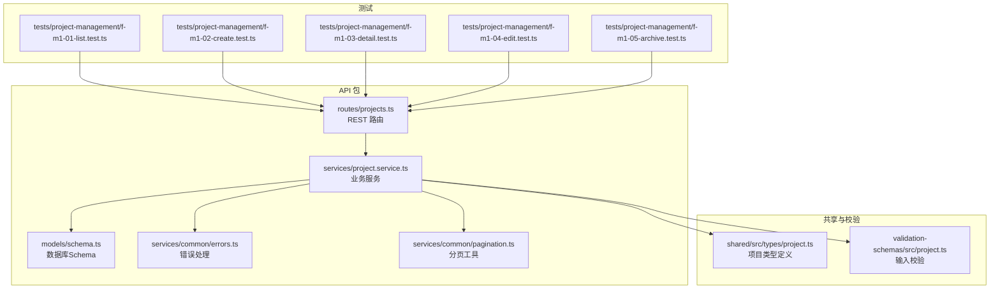
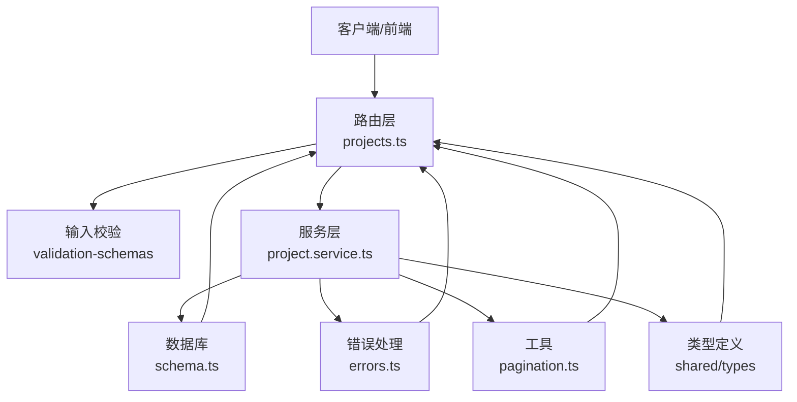
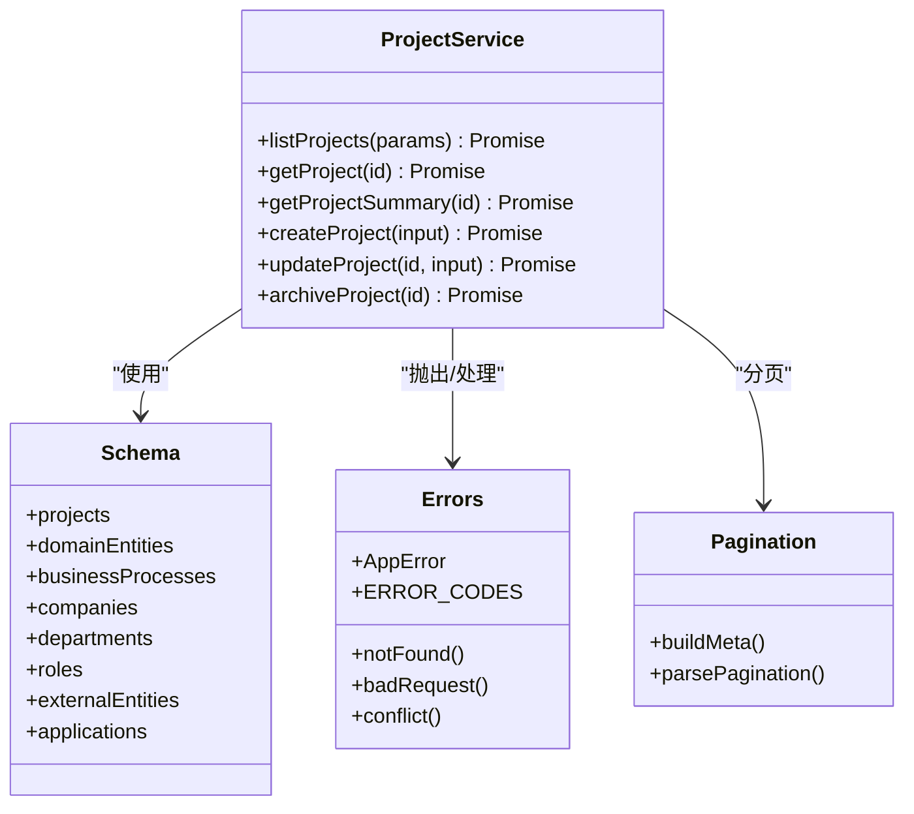
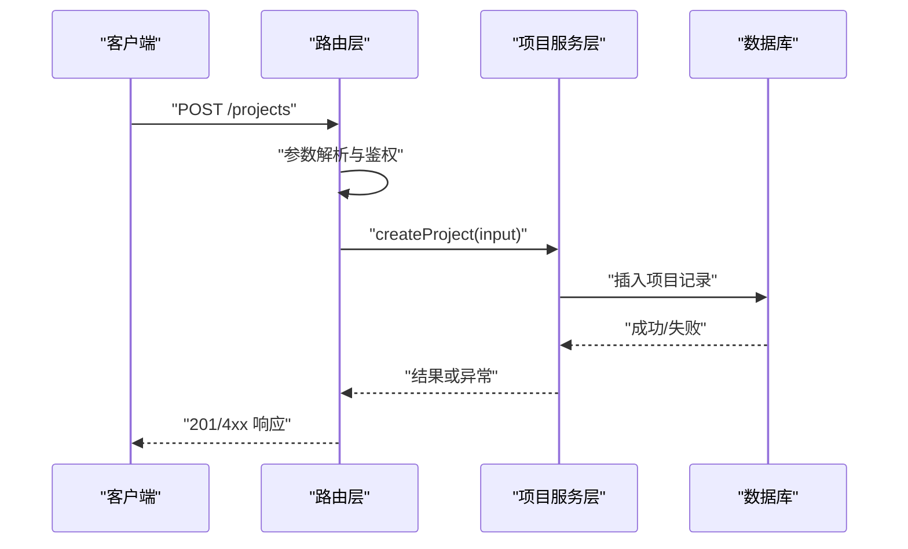
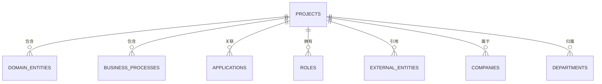
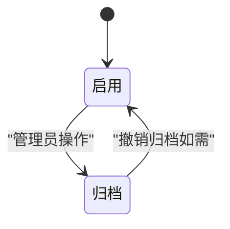
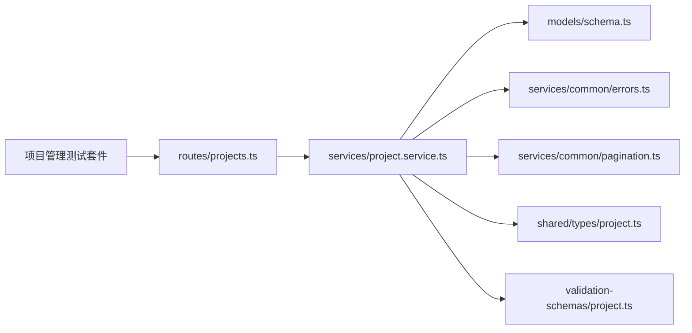

# 项目管理服务

<cite>
**本文引用的文件**
- [packages/api/src/services/project.service.ts](file://packages/api/src/services/project.service.ts)
- [packages/api/src/routes/projects.ts](file://packages/api/src/routes/projects.ts)
- [packages/api/src/models/schema.ts](file://packages/api/src/models/schema.ts)
- [packages/api/src/services/common/errors.ts](file://packages/api/src/services/common/errors.ts)
- [packages/api/src/services/common/pagination.ts](file://packages/api/src/services/common/pagination.ts)
- [packages/validation-schemas/src/project.ts](file://packages/validation-schemas/src/project.ts)
- [packages/shared/src/types/project.ts](file://packages/shared/src/types/project.ts)
- [packages/api/tests/project-management/f-m1-01-list.test.ts](file://packages/api/tests/project-management/f-m1-01-list.test.ts)
- [packages/api/tests/project-management/f-m1-02-create.test.ts](file://packages/api/tests/project-management/f-m1-02-create.test.ts)
- [packages/api/tests/project-management/f-m1-03-detail.test.ts](file://packages/api/tests/project-management/f-m1-03-detail.test.ts)
- [packages/api/tests/project-management/f-m1-04-edit.test.ts](file://packages/api/tests/project-management/f-m1-04-edit.test.ts)
- [packages/api/tests/project-management/f-m1-05-archive.test.ts](file://packages/api/tests/project-management/f-m1-05-archive.test.ts)
- [docs/04-tech-design/phase1-design-tech.md](file://docs/04-tech-design/phase1-design-tech.md)
- [docs/02-domain-model/domain-model.md](file://docs/02-domain-model/domain-model.md)
- [docs/03-prd-ux/modules/project-management/project-management-interaction.md](file://docs/03-prd-ux/modules/project-management/project-management-interaction.md)
- [docs/06-test-design/modules/project-management/f-m1-01-project-list/f-m1-01-api.md](file://docs/06-test-design/modules/project-management/f-m1-01-project-list/f-m1-01-api.md)
- [docs/06-test-design/modules/project-management/f-m1-02-create-project/f-m1-02-api.md](file://docs/06-test-design/modules/project-management/f-m1-02-create-project/f-m1-02-api.md)
- [docs/06-test-design/modules/project-management/f-m1-03-project-detail/f-m1-03-api.md](file://docs/06-test-design/modules/project-management/f-m1-03-project-detail/f-m1-03-api.md)
- [docs/06-test-design/modules/project-management/f-m1-04-edit-project/f-m1-04-api.md](file://docs/06-test-design/modules/project-management/f-m1-04-edit-project/f-m1-04-api.md)
- [docs/06-test-design/modules/project-management/f-m1-05-archive/f-m1-05-api.md](file://docs/06-test-design/modules/project-management/f-m1-05-archive/f-m1-05-api.md)
</cite>

## 目录
1. [引言](#引言)
2. [项目结构](#项目结构)
3. [核心组件](#核心组件)
4. [架构总览](#架构总览)
5. [详细组件分析](#详细组件分析)
6. [依赖分析](#依赖分析)
7. [性能考虑](#性能考虑)
8. [故障排除指南](#故障排除指南)
9. [结论](#结论)
10. [附录](#附录)

## 引言
本文件面向项目管理服务的技术文档，系统性阐述项目生命周期管理的业务逻辑实现，覆盖项目创建、更新、删除、归档等核心操作；详述项目数据验证规则、权限控制机制与事务处理策略；解释项目状态转换逻辑与业务规则约束；提供具体API调用示例与错误处理机制；展示项目服务与其他服务的交互关系与依赖模式，并给出性能优化建议与最佳实践。

## 项目结构
项目采用Monorepo结构，后端API位于packages/api，前端位于packages/web，共享类型与校验位于packages/shared与packages/validation-schemas。项目管理服务的核心实现集中在API包的服务层与路由层，配合数据库Schema与测试用例形成闭环。

**图表来源**
- [packages/api/src/routes/projects.ts](file://packages/api/src/routes/projects.ts)
- [packages/api/src/services/project.service.ts](file://packages/api/src/services/project.service.ts)
- [packages/api/src/models/schema.ts](file://packages/api/src/models/schema.ts)
- [packages/api/src/services/common/errors.ts](file://packages/api/src/services/common/errors.ts)
- [packages/api/src/services/common/pagination.ts](file://packages/api/src/services/common/pagination.ts)
- [packages/shared/src/types/project.ts](file://packages/shared/src/types/project.ts)
- [packages/validation-schemas/src/project.ts](file://packages/validation-schemas/src/project.ts)

**章节来源**
- [packages/api/src/routes/projects.ts](file://packages/api/src/routes/projects.ts)
- [packages/api/src/services/project.service.ts](file://packages/api/src/services/project.service.ts)
- [packages/api/src/models/schema.ts](file://packages/api/src/models/schema.ts)
- [packages/api/src/services/common/errors.ts](file://packages/api/src/services/common/errors.ts)
- [packages/api/src/services/common/pagination.ts](file://packages/api/src/services/common/pagination.ts)
- [packages/shared/src/types/project.ts](file://packages/shared/src/types/project.ts)
- [packages/validation-schemas/src/project.ts](file://packages/validation-schemas/src/project.ts)

## 核心组件
- 项目路由层：负责HTTP请求解析、参数传递与响应封装，将REST API请求映射到服务层。
- 项目服务层：实现项目生命周期的业务逻辑，包括列表查询、详情/摘要、创建、更新、归档等。
- 数据模型层：定义数据库表结构与关系，确保数据一致性与完整性。
- 错误处理与分页：提供统一的错误码体系与分页构建工具，保障接口稳定性与可维护性。
- 输入校验与共享类型：通过validation-schemas与shared/types确保前后端契约一致。

**章节来源**
- [packages/api/src/routes/projects.ts](file://packages/api/src/routes/projects.ts)
- [packages/api/src/services/project.service.ts](file://packages/api/src/services/project.service.ts)
- [packages/api/src/models/schema.ts](file://packages/api/src/models/schema.ts)
- [packages/api/src/services/common/errors.ts](file://packages/api/src/services/common/errors.ts)
- [packages/api/src/services/common/pagination.ts](file://packages/api/src/services/common/pagination.ts)
- [packages/validation-schemas/src/project.ts](file://packages/validation-schemas/src/project.ts)
- [packages/shared/src/types/project.ts](file://packages/shared/src/types/project.ts)

## 架构总览
项目管理服务遵循清晰的分层架构：路由层接收请求并进行参数与鉴权校验，服务层执行业务规则与数据操作，数据层负责持久化与约束，错误与分页工具贯穿各层以保证一致性。

**图表来源**
- [packages/api/src/routes/projects.ts](file://packages/api/src/routes/projects.ts)
- [packages/api/src/services/project.service.ts](file://packages/api/src/services/project.service.ts)
- [packages/api/src/models/schema.ts](file://packages/api/src/models/schema.ts)
- [packages/api/src/services/common/errors.ts](file://packages/api/src/services/common/errors.ts)
- [packages/api/src/services/common/pagination.ts](file://packages/api/src/services/common/pagination.ts)
- [packages/validation-schemas/src/project.ts](file://packages/validation-schemas/src/project.ts)
- [packages/shared/src/types/project.ts](file://packages/shared/src/types/project.ts)

## 详细组件分析

### 项目服务层（业务逻辑）
项目服务层提供以下核心能力：
- 列表查询：支持关键词搜索、状态过滤、分页与排序。
- 详情/摘要：返回项目完整信息或轻量摘要。
- 创建：基于输入校验与业务规则创建新项目。
- 更新：在允许的状态范围内更新项目信息。
- 归档：将项目标记为归档状态，禁止后续修改。

**图表来源**
- [packages/api/src/services/project.service.ts](file://packages/api/src/services/project.service.ts)
- [packages/api/src/models/schema.ts](file://packages/api/src/models/schema.ts)
- [packages/api/src/services/common/errors.ts](file://packages/api/src/services/common/errors.ts)
- [packages/api/src/services/common/pagination.ts](file://packages/api/src/services/common/pagination.ts)

**章节来源**
- [packages/api/src/services/project.service.ts](file://packages/api/src/services/project.service.ts)

### 路由层（REST API）
路由层负责：
- 解析HTTP请求参数与主体。
- 调用服务层执行业务逻辑。
- 统一响应格式与错误处理。

**图表来源**
- [packages/api/src/routes/projects.ts](file://packages/api/src/routes/projects.ts)
- [packages/api/src/services/project.service.ts](file://packages/api/src/services/project.service.ts)

**章节来源**
- [packages/api/src/routes/projects.ts](file://packages/api/src/routes/projects.ts)

### 数据模型层（Schema）
数据模型层定义了项目及其关联实体的表结构与关系，确保业务完整性与一致性。项目相关的关键表包括：
- projects：项目主表，包含项目标识、名称、状态、组织关联等。
- domainEntities：领域实体，用于项目内的实体建模。
- businessProcesses：业务流程，用于项目内的流程设计。
- companies/departments/roles/externalEntities/applications：组织与应用相关实体，支撑项目上下文。

**图表来源**
- [packages/api/src/models/schema.ts](file://packages/api/src/models/schema.ts)

**章节来源**
- [packages/api/src/models/schema.ts](file://packages/api/src/models/schema.ts)

### 数据验证与类型定义
- 输入校验：通过validation-schemas对创建/更新/归档等输入进行严格校验，确保数据质量。
- 类型定义：shared/types提供前后端一致的类型契约，避免歧义与不一致。

**章节来源**
- [packages/validation-schemas/src/project.ts](file://packages/validation-schemas/src/project.ts)
- [packages/shared/src/types/project.ts](file://packages/shared/src/types/project.ts)

### 错误处理与分页
- 错误处理：统一的AppError与ERROR_CODES，提供notFound、badRequest、conflict等错误语义，便于前端与监控系统识别。
- 分页：buildMeta与parsePagination提供标准分页元数据与解析逻辑，支持列表查询的扩展性。

**章节来源**
- [packages/api/src/services/common/errors.ts](file://packages/api/src/services/common/errors.ts)
- [packages/api/src/services/common/pagination.ts](file://packages/api/src/services/common/pagination.ts)

### 业务规则与状态转换
- 状态枚举与转换：项目状态应在受控范围内转换，例如从“启用”到“归档”，需满足业务约束（如无未完成任务）。
- 权限控制：当前技术方案为单用户本地模式，不包含认证；生产场景下应引入鉴权中间件与RBAC。
- 事务策略：关键写操作（创建/更新/归档）应包裹在事务中，确保原子性与一致性。

[此图为概念性状态图，无需图表来源]

## 依赖分析
项目管理服务的依赖关系如下：

**图表来源**
- [packages/api/src/routes/projects.ts](file://packages/api/src/routes/projects.ts)
- [packages/api/src/services/project.service.ts](file://packages/api/src/services/project.service.ts)
- [packages/api/src/models/schema.ts](file://packages/api/src/models/schema.ts)
- [packages/api/src/services/common/errors.ts](file://packages/api/src/services/common/errors.ts)
- [packages/api/src/services/common/pagination.ts](file://packages/api/src/services/common/pagination.ts)
- [packages/shared/src/types/project.ts](file://packages/shared/src/types/project.ts)
- [packages/validation-schemas/src/project.ts](file://packages/validation-schemas/src/project.ts)

**章节来源**
- [packages/api/src/routes/projects.ts](file://packages/api/src/routes/projects.ts)
- [packages/api/src/services/project.service.ts](file://packages/api/src/services/project.service.ts)
- [packages/api/src/models/schema.ts](file://packages/api/src/models/schema.ts)
- [packages/api/src/services/common/errors.ts](file://packages/api/src/services/common/errors.ts)
- [packages/api/src/services/common/pagination.ts](file://packages/api/src/services/common/pagination.ts)
- [packages/shared/src/types/project.ts](file://packages/shared/src/types/project.ts)
- [packages/validation-schemas/src/project.ts](file://packages/validation-schemas/src/project.ts)

## 性能考虑
- 查询优化：列表查询应结合索引（如状态、创建时间、名称模糊匹配），避免全表扫描。
- 分页策略：默认合理pageSize，限制最大页大小，防止资源滥用。
- 缓存策略：对只读列表与详情数据可引入缓存（如Redis），降低数据库压力。
- 并发控制：归档/更新等关键操作使用行级锁或乐观锁，避免竞态条件。
- 日志与监控：对慢查询与异常错误进行埋点，建立告警机制。

[本节为通用性能建议，无需章节来源]

## 故障排除指南
- 常见错误码
  - 404：项目不存在或资源缺失（notFound）。
  - 400：请求参数非法或违反业务规则（badRequest）。
  - 409：状态冲突或并发写入冲突（conflict）。
- 排查步骤
  - 检查输入校验是否通过（validation-schemas）。
  - 核对项目状态是否允许目标操作（状态机）。
  - 查看服务层日志与数据库事务回滚原因。
  - 对比测试用例与PRD/UX文档，确认行为一致性。

**章节来源**
- [packages/api/src/services/common/errors.ts](file://packages/api/src/services/common/errors.ts)
- [packages/api/tests/project-management/f-m1-01-list.test.ts](file://packages/api/tests/project-management/f-m1-01-list.test.ts)
- [packages/api/tests/project-management/f-m1-02-create.test.ts](file://packages/api/tests/project-management/f-m1-02-create.test.ts)
- [packages/api/tests/project-management/f-m1-03-detail.test.ts](file://packages/api/tests/project-management/f-m1-03-detail.test.ts)
- [packages/api/tests/project-management/f-m1-04-edit.test.ts](file://packages/api/tests/project-management/f-m1-04-edit.test.ts)
- [packages/api/tests/project-management/f-m1-05-archive.test.ts](file://packages/api/tests/project-management/f-m1-05-archive.test.ts)

## 结论
项目管理服务通过清晰的分层架构与严格的输入校验、错误处理与分页工具，实现了项目生命周期管理的核心能力。建议在生产环境中补充鉴权与RBAC、完善事务与并发控制、引入缓存与监控，以提升安全性、一致性与性能表现。

## 附录

### API调用示例与规范
- 列表查询：支持关键词搜索、状态过滤、分页与排序，参考测试用例与PRD/UX文档。
- 创建项目：提交符合validation-schemas的输入，服务层进行业务规则校验与持久化。
- 详情/摘要：按ID获取项目信息，摘要用于列表内嵌统计。
- 更新项目：仅允许在允许的状态范围内更新，避免破坏业务一致性。
- 归档项目：将项目标记为归档，禁止后续修改。

**章节来源**
- [docs/06-test-design/modules/project-management/f-m1-01-project-list/f-m1-01-api.md](file://docs/06-test-design/modules/project-management/f-m1-01-project-list/f-m1-01-api.md)
- [docs/06-test-design/modules/project-management/f-m1-02-create-project/f-m1-02-api.md](file://docs/06-test-design/modules/project-management/f-m1-02-create-project/f-m1-02-api.md)
- [docs/06-test-design/modules/project-management/f-m1-03-project-detail/f-m1-03-api.md](file://docs/06-test-design/modules/project-management/f-m1-03-project-detail/f-m1-03-api.md)
- [docs/06-test-design/modules/project-management/f-m1-04-edit-project/f-m1-04-api.md](file://docs/06-test-design/modules/project-management/f-m1-04-edit-project/f-m1-04-api.md)
- [docs/06-test-design/modules/project-management/f-m1-05-archive/f-m1-05-api.md](file://docs/06-test-design/modules/project-management/f-m1-05-archive/f-m1-05-api.md)

### 业务背景与设计约束
- Phase 1目标与约束：聚焦项目管理、领域模型与业务流程三大模块，暂不包含MCP/AI与认证。
- 技术方案：Monorepo结构、RESTful API设计、校验机制与错误处理、开发环境与测试策略。

**章节来源**
- [docs/04-tech-design/phase1-design-tech.md](file://docs/04-tech-design/phase1-design-tech.md)
- [docs/02-domain-model/domain-model.md](file://docs/02-domain-model/domain-model.md)
- [docs/03-prd-ux/modules/project-management/project-management-interaction.md](file://docs/03-prd-ux/modules/project-management/project-management-interaction.md)