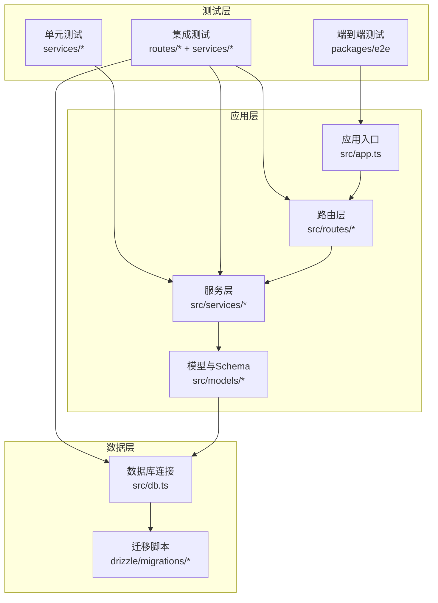
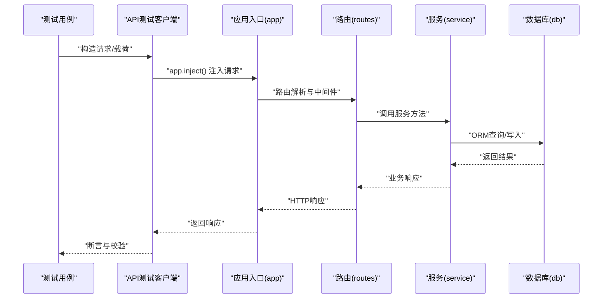
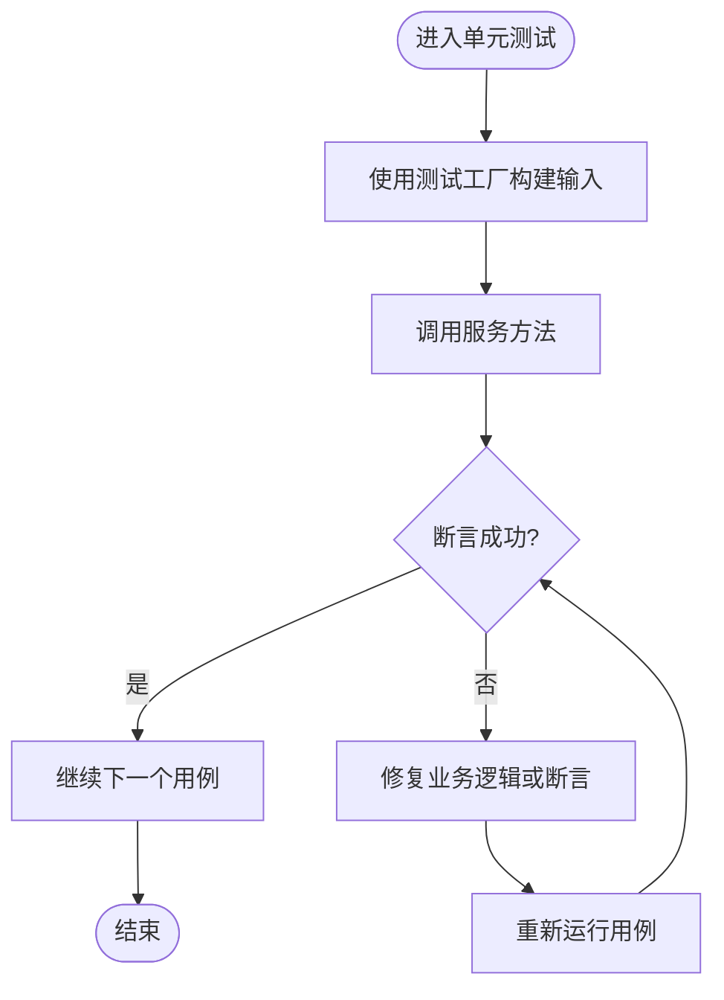
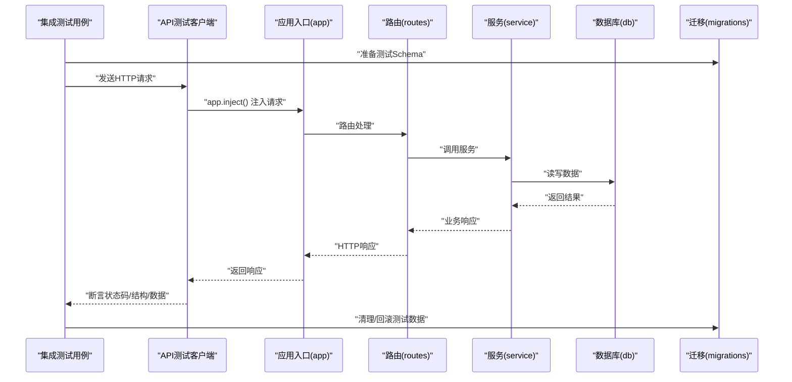
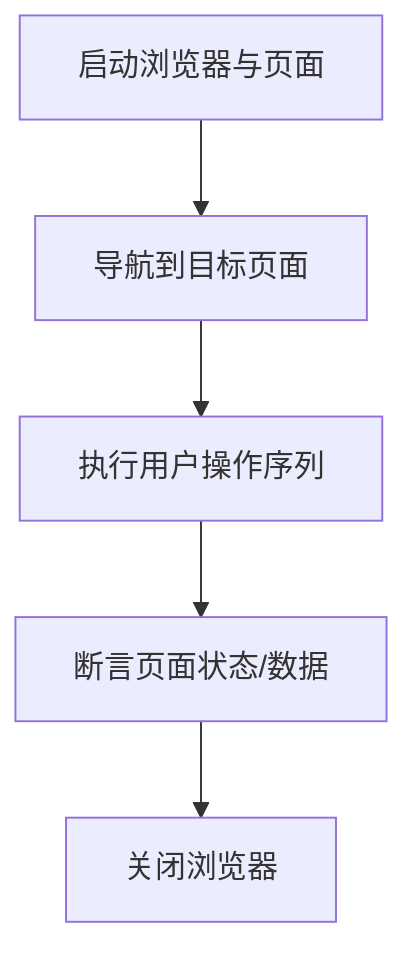
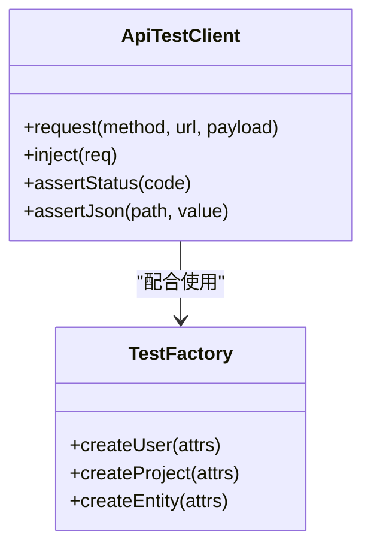
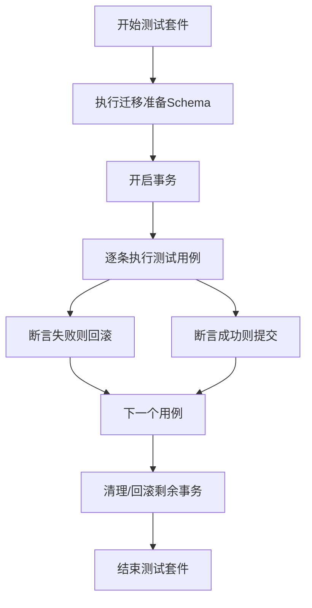
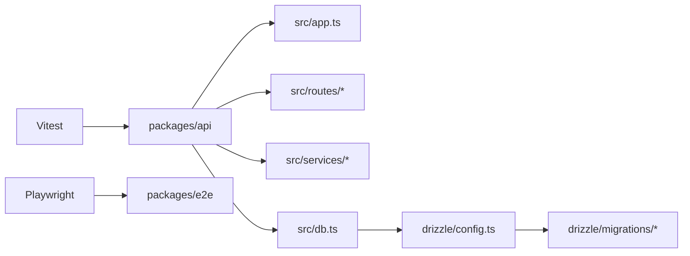

# 测试策略

<cite>
**本文引用的文件**
- [packages/api/vitest.config.ts](file://packages/api/vitest.config.ts)
- [packages/api/package.json](file://packages/api/package.json)
- [packages/api/tests/setup.ts](file://packages/api/tests/setup.ts)
- [packages/api/tests/helpers/api-test-client.ts](file://packages/api/tests/helpers/api-test-client.ts)
- [packages/api/tests/helpers/test-factory.ts](file://packages/api/tests/helpers/test-factory.ts)
- [packages/api/src/app.ts](file://packages/api/src/app.ts)
- [packages/api/src/db.ts](file://packages/api/src/db.ts)
- [packages/api/src/models/schema.ts](file://packages/api/src/models/schema.ts)
- [packages/api/src/services/project.service.ts](file://packages/api/src/services/project.service.ts)
- [packages/api/src/routes/projects.ts](file://packages/api/src/routes/projects.ts)
- [packages/api/drizzle/config.ts](file://packages/api/drizzle/config.ts)
- [packages/api/drizzle/migrations/0000_init_projects_table.sql](file://packages/api/drizzle/migrations/0000_init_projects_table.sql)
- [packages/api/drizzle/migrations/0001_confused_diamondback.sql](file://packages/api/drizzle/migrations/0001_confused_diamondback.sql)
- [packages/api/drizzle/migrations/0002_far_whizzer.sql](file://packages/api/drizzle/migrations/0002_far_whizzer.sql)
- [packages/api/drizzle/migrations/0003_rare_darwin.sql](file://packages/api/drizzle/migrations/0003_rare_darwin.sql)
- [packages/api/drizzle/migrations/0004_add_domain_entities_config.sql](file://packages/api/drizzle/migrations/0004_add_domain_entities_config.sql)
- [packages/api/drizzle/migrations/0005_flippant_colonel_america.sql](file://packages/api/drizzle/migrations/0005_flippant_colonel_america.sql)
- [packages/api/drizzle/migrations/0006_mean_rachel_grey.sql](file://packages/api/drizzle/migrations/0006_mean_rachel_grey.sql)
- [packages/api/tests/project-management/f-m1-01-list.test.ts](file://packages/api/tests/project-management/f-m1-01-list.test.ts)
- [packages/api/tests/project-management/f-m1-02-create.test.ts](file://packages/api/tests/project-management/f-m1-02-create.test.ts)
- [packages/api/tests/project-management/f-m1-03-detail.test.ts](file://packages/api/tests/project-management/f-m1-03-detail.test.ts)
- [packages/api/tests/project-management/f-m1-04-edit.test.ts](file://packages/api/tests/project-management/f-m1-04-edit.test.ts)
- [packages/api/tests/project-management/f-m1-05-archive.test.ts](file://packages/api/tests/project-management/f-m1-05-archive.test.ts)
- [packages/api/tests/project-management/f-m1-06-company.test.ts](file://packages/api/tests/project-management/f-m1-06-company.test.ts)
- [packages/api/tests/project-management/f-m1-07-department.test.ts](file://packages/api/tests/project-management/f-m1-07-department.test.ts)
- [packages/api/tests/project-management/f-m1-08-roles.test.ts](file://packages/api/tests/project-management/f-m1-08-roles.test.ts)
- [packages/api/tests/project-management/f-m1-09-external-entities.test.ts](file://packages/api/tests/project-management/f-m1-09-external-entities.test.ts)
- [packages/api/tests/project-management/f-m1-11-application.test.ts](file://packages/api/tests/project-management/f-m1-11-application.test.ts)
- [packages/api/tests/project-management/f-m1-12-role-behavior.test.ts](file://packages/api/tests/project-management/f-m1-12-role-behavior.test.ts)
- [packages/api/tests/project-management/f-m1-13-external-entity-behavior.test.ts](file://packages/api/tests/project-management/f-m1-13-external-entity-behavior.test.ts)
- [packages/api/tests/domain-model/f-m2-01-entity.test.ts](file://packages/api/tests/domain-model/f-m2-01-entity.test.ts)
- [packages/api/tests/domain-model/f-m2-02-field.test.ts](file://packages/api/tests/domain-model/f-m2-02-field.test.ts)
- [packages/api/tests/domain-model/f-m2-03-relation.test.ts](file://packages/api/tests/domain-model/f-m2-03-relation.test.ts)
- [packages/api/tests/domain-model/f-m2-04-er-graph.test.ts](file://packages/api/tests/domain-model/f-m2-04-er-graph.test.ts)
- [packages/api/tests/domain-model/f-m2-06-boundary.test.ts](file://packages/api/tests/domain-model/f-m2-06-boundary.test.ts)
- [packages/api/tests/openapi/openapi-schema.test.ts](file://packages/api/tests/openapi/openapi-schema.test.ts)
- [docs/06-test-design/test-convention.md](file://docs/06-test-design/test-convention.md)
- [docs/00-project/workflow/dev-test-loop-design.md](file://docs/00-project/workflow/dev-test-loop-design.md)
- [packages/e2e/playwright.config.ts](file://packages/e2e/playwright.config.ts)
- [packages/e2e/tests/example.spec.ts](file://packages/e2e/tests/example.spec.ts)
</cite>

## 目录
1. [引言](#引言)
2. [项目结构](#项目结构)
3. [核心组件](#核心组件)
4. [架构总览](#架构总览)
5. [详细组件分析](#详细组件分析)
6. [依赖分析](#依赖分析)
7. [性能考量](#性能考量)
8. [故障排查指南](#故障排查指南)
9. [结论](#结论)
10. [附录](#附录)

## 引言
本指南面向AI原型管理系统的后端测试，系统化阐述单元测试、集成测试与端到端测试策略；详解Vitest测试框架配置与测试环境设置；说明API测试方法与测试数据准备；介绍Mock机制与测试替身；给出数据库测试与事务回滚策略；并提供测试覆盖率分析与质量度量建议。文档同时结合仓库中现有的测试文件与配置，帮助读者快速落地高质量的测试体系。

## 项目结构
后端测试主要集中在packages/api包内，采用按功能域划分的测试组织方式：
- 单元测试：围绕服务层与模型层进行，验证业务逻辑与数据模型行为
- 集成测试：围绕路由与服务交互，验证HTTP接口与数据库交互
- 端到端测试：位于packages/e2e，使用Playwright进行真实浏览器场景验证
- 测试辅助：提供API客户端与测试工厂，统一请求与数据构造

图表来源
- [packages/api/src/app.ts](file://packages/api/src/app.ts)
- [packages/api/src/routes/projects.ts](file://packages/api/src/routes/projects.ts)
- [packages/api/src/services/project.service.ts](file://packages/api/src/services/project.service.ts)
- [packages/api/src/db.ts](file://packages/api/src/db.ts)
- [packages/api/src/models/schema.ts](file://packages/api/src/models/schema.ts)
- [packages/api/drizzle/migrations/0000_init_projects_table.sql](file://packages/api/drizzle/migrations/0000_init_projects_table.sql)

章节来源
- [packages/api/tests/project-management/f-m1-01-list.test.ts](file://packages/api/tests/project-management/f-m1-01-list.test.ts)
- [packages/api/tests/domain-model/f-m2-01-entity.test.ts](file://packages/api/tests/domain-model/f-m2-01-entity.test.ts)
- [packages/e2e/tests/example.spec.ts](file://packages/e2e/tests/example.spec.ts)

## 核心组件
- Vitest配置与运行环境
  - Vitest配置文件定义了路径别名、覆盖率、报告器、测试文件匹配规则等，确保测试在packages/api目录内统一执行
  - 测试入口通过setup.ts注入全局环境变量与初始化逻辑
- API测试客户端
  - 提供统一的HTTP测试客户端，支持在非监听模式下通过app.inject()进行无HTTP监听的请求模拟
- 测试工厂
  - 提供测试数据构造器，用于快速生成用户、项目、实体等测试对象，保证测试隔离与可重复性
- 数据库与迁移
  - 使用Drizzle ORM与迁移脚本初始化测试数据库，确保每次测试前后的Schema一致性
- 服务与路由
  - 服务层封装业务逻辑，路由层负责HTTP协议转换，二者共同构成集成测试的核心被测单元

章节来源
- [packages/api/vitest.config.ts](file://packages/api/vitest.config.ts)
- [packages/api/tests/setup.ts](file://packages/api/tests/setup.ts)
- [packages/api/tests/helpers/api-test-client.ts](file://packages/api/tests/helpers/api-test-client.ts)
- [packages/api/tests/helpers/test-factory.ts](file://packages/api/tests/helpers/test-factory.ts)
- [packages/api/src/app.ts](file://packages/api/src/app.ts)
- [packages/api/src/db.ts](file://packages/api/src/db.ts)
- [packages/api/drizzle/config.ts](file://packages/api/drizzle/config.ts)

## 架构总览
下图展示了从测试到应用、服务与数据库的整体调用链路，以及测试客户端如何绕过HTTP监听直接注入请求：

图表来源
- [packages/api/tests/helpers/api-test-client.ts](file://packages/api/tests/helpers/api-test-client.ts)
- [packages/api/src/app.ts](file://packages/api/src/app.ts)
- [packages/api/src/routes/projects.ts](file://packages/api/src/routes/projects.ts)
- [packages/api/src/services/project.service.ts](file://packages/api/src/services/project.service.ts)
- [packages/api/src/db.ts](file://packages/api/src/db.ts)

## 详细组件分析

### 单元测试策略
- 目标：验证服务层与模型层的独立逻辑，确保业务规则与数据约束正确
- 方法：
  - 使用测试工厂构造最小化输入，覆盖正常路径与边界条件
  - 对复杂业务流程进行函数级断言，避免外部依赖
  - 利用Mock对第三方依赖或外部服务进行替身替换
- 示例参考：
  - 项目管理模块的列表、创建、详情、编辑、归档等用例
  - 域模型模块的实体、字段、关系、ER图、边界等用例

图表来源
- [packages/api/tests/project-management/f-m1-02-create.test.ts](file://packages/api/tests/project-management/f-m1-02-create.test.ts)
- [packages/api/tests/domain-model/f-m2-01-entity.test.ts](file://packages/api/tests/domain-model/f-m2-01-entity.test.ts)
- [packages/api/tests/helpers/test-factory.ts](file://packages/api/tests/helpers/test-factory.ts)

章节来源
- [packages/api/tests/project-management/f-m1-01-list.test.ts](file://packages/api/tests/project-management/f-m1-01-list.test.ts)
- [packages/api/tests/project-management/f-m1-02-create.test.ts](file://packages/api/tests/project-management/f-m1-02-create.test.ts)
- [packages/api/tests/domain-model/f-m2-01-entity.test.ts](file://packages/api/tests/domain-model/f-m2-01-entity.test.ts)
- [packages/api/tests/helpers/test-factory.ts](file://packages/api/tests/helpers/test-factory.ts)

### 集成测试策略
- 目标：验证路由到服务再到数据库的完整链路，确保HTTP接口契约与数据一致性
- 方法：
  - 使用API测试客户端发起HTTP请求，利用app.inject()绕过网络监听，提升速度与可控性
  - 通过迁移脚本在测试前准备Schema，并在测试后清理或回滚
  - 对关键接口（如项目管理、域模型）编写正向与负向用例，覆盖鉴权、权限、参数校验、状态码与响应结构
- 示例参考：
  - 项目管理各功能点的列表、创建、详情、编辑、归档、公司/部门/角色/外部实体、应用与行为等
  - 域模型的实体、字段、关系、ER图、边界等

图表来源
- [packages/api/tests/helpers/api-test-client.ts](file://packages/api/tests/helpers/api-test-client.ts)
- [packages/api/src/app.ts](file://packages/api/src/app.ts)
- [packages/api/src/routes/projects.ts](file://packages/api/src/routes/projects.ts)
- [packages/api/src/services/project.service.ts](file://packages/api/src/services/project.service.ts)
- [packages/api/src/db.ts](file://packages/api/src/db.ts)
- [packages/api/drizzle/migrations/0000_init_projects_table.sql](file://packages/api/drizzle/migrations/0000_init_projects_table.sql)

章节来源
- [packages/api/tests/project-management/f-m1-03-detail.test.ts](file://packages/api/tests/project-management/f-m1-03-detail.test.ts)
- [packages/api/tests/project-management/f-m1-04-edit.test.ts](file://packages/api/tests/project-management/f-m1-04-edit.test.ts)
- [packages/api/tests/project-management/f-m1-05-archive.test.ts](file://packages/api/tests/project-management/f-m1-05-archive.test.ts)
- [packages/api/tests/domain-model/f-m2-02-field.test.ts](file://packages/api/tests/domain-model/f-m2-02-field.test.ts)
- [packages/api/tests/domain-model/f-m2-03-relation.test.ts](file://packages/api/tests/domain-model/f-m2-03-relation.test.ts)
- [packages/api/tests/domain-model/f-m2-04-er-graph.test.ts](file://packages/api/tests/domain-model/f-m2-04-er-graph.test.ts)
- [packages/api/tests/domain-model/f-m2-06-boundary.test.ts](file://packages/api/tests/domain-model/f-m2-06-boundary.test.ts)

### 端到端测试策略
- 目标：在真实浏览器环境下验证用户关键路径与交互流程
- 方法：
  - 使用Playwright进行跨浏览器验证，配置文件位于packages/e2e
  - 将后端测试与前端UI测试解耦，后端通过HTTP接口暴露能力，前端通过Playwright驱动
  - 建议在E2E中复用后端已有的API契约与数据准备，减少重复工作
- 示例参考：
  - Playwright示例用例与配置文件

图表来源
- [packages/e2e/playwright.config.ts](file://packages/e2e/playwright.config.ts)
- [packages/e2e/tests/example.spec.ts](file://packages/e2e/tests/example.spec.ts)

章节来源
- [packages/e2e/playwright.config.ts](file://packages/e2e/playwright.config.ts)
- [packages/e2e/tests/example.spec.ts](file://packages/e2e/tests/example.spec.ts)

### API测试方法与测试数据准备
- API测试方法
  - 使用API测试客户端封装HTTP请求，支持GET/POST/PUT/DELETE等方法
  - 在非监听模式下通过app.inject()直接注入请求，避免网络开销与并发干扰
  - 统一响应断言：状态码、响应头、JSON结构与业务字段
- 测试数据准备
  - 使用测试工厂生成用户、项目、实体等对象，确保测试隔离
  - 通过迁移脚本在测试前准备Schema，测试后清理或回滚
  - 对于OpenAPI契约，单独编写schema校验用例，确保接口契约一致性

图表来源
- [packages/api/tests/helpers/api-test-client.ts](file://packages/api/tests/helpers/api-test-client.ts)
- [packages/api/tests/helpers/test-factory.ts](file://packages/api/tests/helpers/test-factory.ts)

章节来源
- [packages/api/tests/helpers/api-test-client.ts](file://packages/api/tests/helpers/api-test-client.ts)
- [packages/api/tests/helpers/test-factory.ts](file://packages/api/tests/helpers/test-factory.ts)
- [packages/api/tests/openapi/openapi-schema.test.ts](file://packages/api/tests/openapi/openapi-schema.test.ts)

### Mock机制与测试替身
- 目标：隔离外部依赖，控制副作用，提升测试稳定性与可重复性
- 方法：
  - 在单元测试中对服务层依赖进行Mock，例如外部HTTP服务、消息队列或第三方SDK
  - 在集成测试中对数据库写入进行事务包装，必要时回滚，避免污染共享测试环境
  - 使用测试替身替换复杂或昂贵的依赖，如文件上传、邮件发送等
- 建议：
  - 明确Mock边界，避免过度Mock导致测试与实现紧耦合
  - 为Mock提供清晰的断言点，确保行为可验证

章节来源
- [packages/api/tests/project-management/f-m1-06-company.test.ts](file://packages/api/tests/project-management/f-m1-06-company.test.ts)
- [packages/api/tests/project-management/f-m1-07-department.test.ts](file://packages/api/tests/project-management/f-m1-07-department.test.ts)
- [packages/api/tests/project-management/f-m1-08-roles.test.ts](file://packages/api/tests/project-management/f-m1-08-roles.test.ts)

### 数据库测试与事务回滚策略
- Schema准备
  - 使用Drizzle迁移脚本在测试前初始化数据库Schema
  - 在测试结束后清理或回滚，确保下一次测试的干净状态
- 事务策略
  - 在单个测试用例中开启事务，在断言完成后回滚，避免影响其他用例
  - 对于多用例场景，考虑使用“快照”或“种子数据”预加载，再在每个用例中回滚
- 并发与隔离
  - 为不同测试套件分配独立的Schema或数据库实例，避免并发冲突
  - 对于需要真实并发的场景，使用独立的测试数据库实例

图表来源
- [packages/api/drizzle/config.ts](file://packages/api/drizzle/config.ts)
- [packages/api/drizzle/migrations/0000_init_projects_table.sql](file://packages/api/drizzle/migrations/0000_init_projects_table.sql)
- [packages/api/drizzle/migrations/0001_confused_diamondback.sql](file://packages/api/drizzle/migrations/0001_confused_diamondback.sql)
- [packages/api/drizzle/migrations/0002_far_whizzer.sql](file://packages/api/drizzle/migrations/0002_far_whizzer.sql)
- [packages/api/drizzle/migrations/0003_rare_darwin.sql](file://packages/api/drizzle/migrations/0003_rare_darwin.sql)
- [packages/api/drizzle/migrations/0004_add_domain_entities_config.sql](file://packages/api/drizzle/migrations/0004_add_domain_entities_config.sql)
- [packages/api/drizzle/migrations/0005_flippant_colonel_america.sql](file://packages/api/drizzle/migrations/0005_flippant_colonel_america.sql)
- [packages/api/drizzle/migrations/0006_mean_rachel_grey.sql](file://packages/api/drizzle/migrations/0006_mean_rachel_grey.sql)

章节来源
- [packages/api/src/db.ts](file://packages/api/src/db.ts)
- [packages/api/tests/setup.ts](file://packages/api/tests/setup.ts)

### 测试覆盖率分析与质量度量
- 覆盖率指标
  - 行覆盖率、分支覆盖率、函数覆盖率、语句覆盖率
  - 建议为关键业务模块设置门槛（如行覆盖率≥80%，分支覆盖率≥70%）
- 质量度量
  - 失败用例占比、重试率、平均测试时长、阻塞回归数
  - 通过持续集成中的覆盖率报告与趋势分析，持续改进测试质量
- 工具与配置
  - Vitest内置覆盖率收集与报告器，可在配置中启用并定制输出格式

章节来源
- [packages/api/vitest.config.ts](file://packages/api/vitest.config.ts)
- [docs/06-test-design/test-convention.md](file://docs/06-test-design/test-convention.md)

### 实际测试用例编写与测试辅助工具
- 编写规范
  - 使用describe/test/expect组织用例，命名遵循“功能-场景-期望”的结构
  - 每个用例聚焦单一行为，前置条件与断言清晰
- 辅助工具
  - API测试客户端：封装请求与断言
  - 测试工厂：统一数据构造
  - 全局setup：统一环境初始化
- 参考用例
  - 项目管理：列表、创建、详情、编辑、归档、公司/部门/角色/外部实体、应用与行为
  - 域模型：实体、字段、关系、ER图、边界
  - OpenAPI：契约校验

章节来源
- [packages/api/tests/project-management/f-m1-01-list.test.ts](file://packages/api/tests/project-management/f-m1-01-list.test.ts)
- [packages/api/tests/project-management/f-m1-02-create.test.ts](file://packages/api/tests/project-management/f-m1-02-create.test.ts)
- [packages/api/tests/project-management/f-m1-03-detail.test.ts](file://packages/api/tests/project-management/f-m1-03-detail.test.ts)
- [packages/api/tests/project-management/f-m1-04-edit.test.ts](file://packages/api/tests/project-management/f-m1-04-edit.test.ts)
- [packages/api/tests/project-management/f-m1-05-archive.test.ts](file://packages/api/tests/project-management/f-m1-05-archive.test.ts)
- [packages/api/tests/project-management/f-m1-06-company.test.ts](file://packages/api/tests/project-management/f-m1-06-company.test.ts)
- [packages/api/tests/project-management/f-m1-07-department.test.ts](file://packages/api/tests/project-management/f-m1-07-department.test.ts)
- [packages/api/tests/project-management/f-m1-08-roles.test.ts](file://packages/api/tests/project-management/f-m1-08-roles.test.ts)
- [packages/api/tests/project-management/f-m1-09-external-entities.test.ts](file://packages/api/tests/project-management/f-m1-09-external-entities.test.ts)
- [packages/api/tests/project-management/f-m1-11-application.test.ts](file://packages/api/tests/project-management/f-m1-11-application.test.ts)
- [packages/api/tests/project-management/f-m1-12-role-behavior.test.ts](file://packages/api/tests/project-management/f-m1-12-role-behavior.test.ts)
- [packages/api/tests/project-management/f-m1-13-external-entity-behavior.test.ts](file://packages/api/tests/project-management/f-m1-13-external-entity-behavior.test.ts)
- [packages/api/tests/domain-model/f-m2-01-entity.test.ts](file://packages/api/tests/domain-model/f-m2-01-entity.test.ts)
- [packages/api/tests/domain-model/f-m2-02-field.test.ts](file://packages/api/tests/domain-model/f-m2-02-field.test.ts)
- [packages/api/tests/domain-model/f-m2-03-relation.test.ts](file://packages/api/tests/domain-model/f-m2-03-relation.test.ts)
- [packages/api/tests/domain-model/f-m2-04-er-graph.test.ts](file://packages/api/tests/domain-model/f-m2-04-er-graph.test.ts)
- [packages/api/tests/domain-model/f-m2-06-boundary.test.ts](file://packages/api/tests/domain-model/f-m2-06-boundary.test.ts)
- [packages/api/tests/openapi/openapi-schema.test.ts](file://packages/api/tests/openapi/openapi-schema.test.ts)

## 依赖分析
- 测试框架与工具
  - Vitest作为核心测试运行器，配合JSDOM/Node环境进行单元与集成测试
  - Playwright用于端到端测试，提供跨浏览器与真实用户交互验证
- 应用与数据依赖
  - 测试通过app.inject()直接调用应用路由与服务，避免HTTP监听带来的额外开销
  - 数据库依赖Drizzle ORM与迁移脚本，确保Schema一致性与可回滚

图表来源
- [packages/api/vitest.config.ts](file://packages/api/vitest.config.ts)
- [packages/api/src/app.ts](file://packages/api/src/app.ts)
- [packages/api/src/routes/projects.ts](file://packages/api/src/routes/projects.ts)
- [packages/api/src/services/project.service.ts](file://packages/api/src/services/project.service.ts)
- [packages/api/src/db.ts](file://packages/api/src/db.ts)
- [packages/api/drizzle/config.ts](file://packages/api/drizzle/config.ts)
- [packages/e2e/playwright.config.ts](file://packages/e2e/playwright.config.ts)

章节来源
- [packages/api/package.json](file://packages/api/package.json)
- [packages/api/src/app.ts](file://packages/api/src/app.ts)
- [packages/api/src/db.ts](file://packages/api/src/db.ts)

## 性能考量
- 测试执行速度
  - 优先使用app.inject()替代HTTP请求，减少网络与监听开销
  - 合理拆分测试套件，避免单个文件过大导致加载与执行时间过长
- 数据准备与清理
  - 使用迁移脚本批量准备Schema，测试结束后统一清理或回滚
  - 对高频用例复用“种子数据”，减少重复插入
- 并发与隔离
  - 在CI环境中为不同套件分配独立数据库实例，避免锁竞争
  - 对慢依赖（如外部服务）使用Mock或本地替身，降低整体测试时延

## 故障排查指南
- 常见问题
  - 测试超时：检查是否遗漏回滚或清理，确认数据库连接池配置
  - 断言失败：核对响应结构与业务字段，确保测试数据与断言一致
  - 跨项目访问：确认鉴权与权限逻辑，避免越权访问导致断言异常
- 排查步骤
  - 打印关键上下文（请求参数、响应状态、错误堆栈）
  - 逐步缩小范围：先单元后集成，定位问题发生阶段
  - 使用最小可复现用例，排除无关因素
- 参考用例
  - 跨项目访问、实体不存在、列表分页等典型边界场景

章节来源
- [packages/api/tests/domain-model/f-m2-01-entity.test.ts](file://packages/api/tests/domain-model/f-m2-01-entity.test.ts)
- [packages/api/tests/project-management/f-m1-01-list.test.ts](file://packages/api/tests/project-management/f-m1-01-list.test.ts)

## 结论
通过将单元测试、集成测试与端到端测试有机结合，并借助Vitest与Playwright等工具，配合API测试客户端与测试工厂，系统能够在保证开发效率的同时，持续交付高质量的后端能力。建议在现有基础上进一步完善覆盖率门槛、引入更多边界与异常场景用例，并在CI中自动化执行与报告，形成闭环的质量保障体系。

## 附录
- 开发测试循环设计要点
  - 包含Vitest配置、测试约定、测试用例评审等内容，指导团队建立一致的测试实践
- 端到端测试用例示例
  - Playwright示例用例与配置文件，便于快速上手E2E测试

章节来源
- [docs/00-project/workflow/dev-test-loop-design.md](file://docs/00-project/workflow/dev-test-loop-design.md)
- [packages/e2e/tests/example.spec.ts](file://packages/e2e/tests/example.spec.ts)