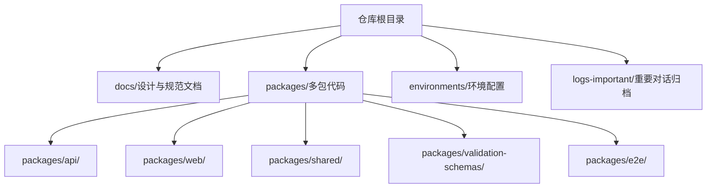
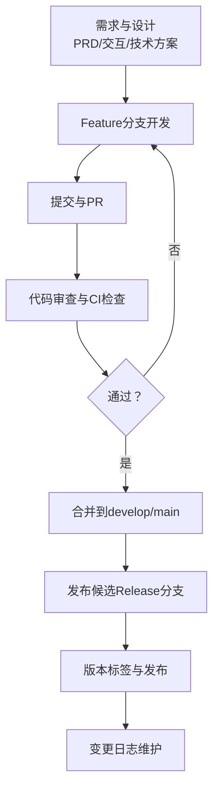
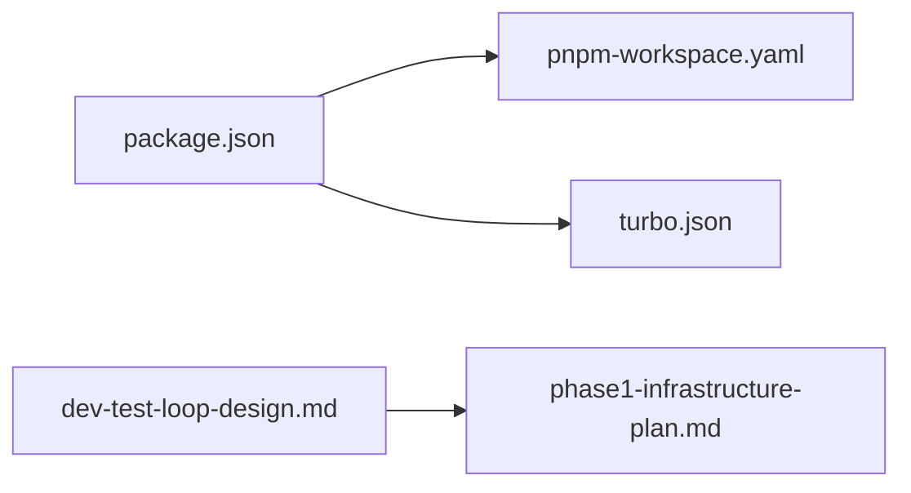

# Git工作流

<cite>
**本文引用的文件**
- [README.md](file://README.md)
- [CLAUDE.md](file://CLAUDE.md)
- [AGENTS.md](file://AGENTS.md)
- [package.json](file://package.json)
- [pnpm-workspace.yaml](file://pnpm-workspace.yaml)
- [turbo.json](file://turbo.json)
- [docs/20-analyze-report/rebase-phase1-to-main-plan.md](file://docs/20-analyze-report/rebase-phase1-to-main-plan.md)
- [docs/00-project/workflow/dev-test-loop-design.md](file://docs/00-project/workflow/dev-test-loop-design.md)
- [docs/04-tech-design/phase1-infrastructure-plan.md](file://docs/04-tech-design/phase1-infrastructure-plan.md)
- [docs/04-tech-design/coding-convention-backend.md](file://docs/04-tech-design/coding-convention-backend.md)
- [docs/07-deploy-design/multi-env-deploy.md](file://docs/07-deploy-design/multi-env-deploy.md)
</cite>

## 目录
1. [引言](#引言)
2. [项目结构](#项目结构)
3. [核心组件](#核心组件)
4. [架构总览](#架构总览)
5. [详细组件分析](#详细组件分析)
6. [依赖分析](#依赖分析)
7. [性能考虑](#性能考虑)
8. [故障排除指南](#故障排除指南)
9. [结论](#结论)
10. [附录](#附录)

## 引言
本文件为“AI原型管理系统”的Git工作流规范，旨在统一团队在版本控制、分支管理、Pull Request（PR）流程、代码审查、版本标签与发布、变更日志维护、冲突解决与同步策略等方面的协作标准。文档结合项目现状与既有工作流文档，给出可落地的Git实践建议，确保Phase 1及后续阶段的开发、测试与发布流程稳定高效。

## 项目结构
项目采用Monorepo结构，根目录包含文档、代码包与环境配置。根配置文件定义了工作区与任务编排，便于在多包间进行统一开发与测试。

图表来源
- [README.md:32-52](file://README.md#L32-L52)
- [pnpm-workspace.yaml:1-3](file://pnpm-workspace.yaml#L1-L3)
- [turbo.json:1-1](file://turbo.json#L1-L1)

章节来源
- [README.md:32-52](file://README.md#L32-L52)
- [pnpm-workspace.yaml:1-3](file://pnpm-workspace.yaml#L1-L3)
- [turbo.json:1-1](file://turbo.json#L1-L1)

## 核心组件
- 分支策略：采用Git Flow风格的分支模型，结合Feature、Release、Hotfix三种主要分支类型，辅以长期演进分支（如develop/main）。
- PR流程：所有功能开发均通过Feature分支创建PR，经代码审查与自动化测试后合并至develop/main。
- 版本与发布：以语义化版本（SemVer）管理，结合变更日志与标签标注发布版本。
- 冲突解决：强调变基优先、冲突前置处理与备份分支策略，避免大规模合并冲突。
- 多人协作：统一分支命名、PR描述模板、审查清单与安全护栏，保障一致性与可追溯性。

章节来源
- [docs/20-analyze-report/rebase-phase1-to-main-plan.md:1-106](file://docs/20-analyze-report/rebase-phase1-to-main-plan.md#L1-L106)
- [docs/00-project/workflow/dev-test-loop-design.md:332-501](file://docs/00-project/workflow/dev-test-loop-design.md#L332-L501)

## 架构总览
下图展示了从需求到发布的整体流程，以及Git分支与PR在其中的位置：

图表来源
- [docs/00-project/workflow/dev-test-loop-design.md:332-501](file://docs/00-project/workflow/dev-test-loop-design.md#L332-L501)

## 详细组件分析

### 分支管理策略
- develop/main（长期分支）
  - main：用于发布稳定版本，合并前需通过审查与测试。
  - develop：用于集成Feature分支，作为发布候选的汇聚点。
- Feature分支
  - 命名规范：feature/<功能点缩写-编号>，例如feature/project-list。
  - 用途：承载单个功能点的完整开发周期，完成后通过PR合并。
- Release分支
  - 命名规范：release/<版本号>，例如release/0.1.1。
  - 用途：在发布前进行最后的回归与修复，完成后合并至main与develop，并打标签。
- Hotfix分支
  - 命名规范：hotfix/<问题简述>，例如hotfix/db-schema-fix。
  - 用途：紧急修复线上问题，修复后合并至main与develop，并打标签。

章节来源
- [docs/20-analyze-report/rebase-phase1-to-main-plan.md:1-106](file://docs/20-analyze-report/rebase-phase1-to-main-plan.md#L1-L106)
- [docs/00-project/workflow/dev-test-loop-design.md:332-501](file://docs/00-project/workflow/dev-test-loop-design.md#L332-L501)

### Pull Request流程与代码审查标准
- PR创建
  - 基于Feature分支创建PR，标题包含功能点标识（如F-M1-01）。
  - 描述模板：背景、变更范围、测试覆盖、风险提示、回滚预案。
- 代码审查
  - 至少一名Reviewer通过，Critical/High问题必须修复后方可合并。
  - 审查清单：功能正确性、边界与异常处理、性能与安全性、命名与注释、测试覆盖率。
- 合并策略
  - 优先使用squash合并，保证提交历史整洁；必要时允许rebase变基以减少噪音。
  - 合并前确保CI通过、审查通过、无冲突。

章节来源
- [docs/00-project/workflow/dev-test-loop-design.md:332-501](file://docs/00-project/workflow/dev-test-loop-design.md#L332-L501)
- [CLAUDE.md:69-111](file://CLAUDE.md#L69-L111)

### 版本标签管理与发布流程
- 版本号
  - 采用语义化版本（主.次.修订），根package.json中定义初始版本，随发布递增。
- 发布流程
  - 在Release分支完成最终回归与文档更新后，合并至main并打tag；随后合并至develop并更新版本号。
  - 变更日志：基于PR与提交记录生成，按类别（新增、修复、变更、废弃）整理。
- 变更日志维护
  - 采用Markdown清单形式，记录版本、日期与变更要点，便于追溯与发布说明。

章节来源
- [package.json:1-2](file://package.json#L1-L2)
- [docs/04-tech-design/coding-convention-backend.md:1127-1132](file://docs/04-tech-design/coding-convention-backend.md#L1127-L1132)

### 冲突解决机制与代码同步策略
- 变基优先
  - Feature分支定期rebase到最新main，减少合并冲突；如需rebase，提前备份分支以防风险。
- 冲突处理
  - 冲突文件清单化管理，明确保留策略（如ours保留、方向相反保留ours等）。
  - 通过小步提交与频繁同步降低冲突规模。
- 备份分支
  - 在执行高风险rebase前创建备份分支，作为回滚锚点。

章节来源
- [docs/20-analyze-report/rebase-phase1-to-main-plan.md:1-106](file://docs/20-analyze-report/rebase-phase1-to-main-plan.md#L1-L106)

### 多人协作规范
- 统一命名与目录规范：遵循文档与代码目录规范，避免分散在非标准路径。
- 环境与端口：严格使用约定端口，避免硬编码默认端口；环境切换需先激活。
- 测试数据安全：测试数据必须带前缀隔离，禁止全表删除或无条件批量操作。
- 状态核查：以磁盘文件为准，避免仅凭记忆或历史快照判断步骤完成状态。

章节来源
- [CLAUDE.md:193-285](file://CLAUDE.md#L193-L285)
- [CLAUDE.md:113-160](file://CLAUDE.md#L113-L160)
- [CLAUDE.md:79-102](file://CLAUDE.md#L79-L102)

### 开发-测试闭环与Git工作流衔接
- 以功能点（F-Mx-NN）为最小交付单元，每个功能点独立完成开发→测试→修复→重跑的闭环。
- PR作为质量门禁，确保每次合并都具备可验证的测试结果与审查意见。
- 通过变基与PR合并，将功能点逐步累积到develop/main，支撑版本发布。

章节来源
- [docs/00-project/workflow/dev-test-loop-design.md:332-501](file://docs/00-project/workflow/dev-test-loop-design.md#L332-L501)

## 依赖分析
- Monorepo与任务编排
  - pnpm工作区定义了packages/*与validation-schemas的包集合，便于统一安装与开发。
  - Turborepo配置定义了build、dev、test等任务的依赖与缓存策略，提升多包开发效率。
- 文档与代码的耦合
  - 开发-测试闭环文档与根配置文件共同定义了开发与测试的基础设施与命令，确保团队执行一致性。

图表来源
- [package.json:1-2](file://package.json#L1-L2)
- [pnpm-workspace.yaml:1-3](file://pnpm-workspace.yaml#L1-L3)
- [turbo.json:1-1](file://turbo.json#L1-L1)
- [docs/00-project/workflow/dev-test-loop-design.md:82-142](file://docs/00-project/workflow/dev-test-loop-design.md#L82-L142)
- [docs/04-tech-design/phase1-infrastructure-plan.md:71-158](file://docs/04-tech-design/phase1-infrastructure-plan.md#L71-L158)

章节来源
- [package.json:1-2](file://package.json#L1-L2)
- [pnpm-workspace.yaml:1-3](file://pnpm-workspace.yaml#L1-L3)
- [turbo.json:1-1](file://turbo.json#L1-L1)
- [docs/00-project/workflow/dev-test-loop-design.md:82-142](file://docs/00-project/workflow/dev-test-loop-design.md#L82-L142)
- [docs/04-tech-design/phase1-infrastructure-plan.md:71-158](file://docs/04-tech-design/phase1-infrastructure-plan.md#L71-L158)

## 性能考虑
- 变基优于合并：减少提交历史碎片，降低后续rebase成本。
- 小步提交与频繁同步：缩短Feature分支存在时间，降低冲突概率与修复成本。
- 任务编排优化：利用Turborepo的任务依赖与缓存，加速多包构建与测试。

## 故障排除指南
- 合并冲突
  - 现象：PR无法自动合并或本地rebase失败。
  - 处理：先rebase到最新main，使用冲突分析清单逐项核对；必要时回退到备份分支。
- 环境端口不一致
  - 现象：E2E或API测试连接失败。
  - 处理：先激活目标环境，确认端口与数据库实例与约定一致。
- 测试数据污染
  - 现象：全量测试删除了非测试数据。
  - 处理：严格遵循测试数据前缀隔离与WHERE条件限制，避免全表删除。

章节来源
- [docs/20-analyze-report/rebase-phase1-to-main-plan.md:1-106](file://docs/20-analyze-report/rebase-phase1-to-main-plan.md#L1-L106)
- [CLAUDE.md:113-160](file://CLAUDE.md#L113-L160)
- [CLAUDE.md:79-102](file://CLAUDE.md#L79-L102)

## 结论
本Git工作流规范以功能点为交付单元，结合Feature/Release/Hotfix分支模型与严格的PR审查与测试闭环，确保开发质量与发布节奏可控。配合Monorepo与任务编排工具，团队可在多包环境下保持一致的开发体验与高效的协作效率。建议在实践中持续完善变更日志与发布流程，强化冲突预防与回滚预案，保障项目长期演进的稳定性与可维护性。

## 附录
- 命令最佳实践
  - 同步与变基：定期rebase到最新main，保持分支线性。
  - PR与审查：使用清晰的标题与描述，附带测试结果与风险说明。
  - 发布与标签：在Release分支完成后打标签并同步更新develop与main。
- 常见问题
  - 为什么总是出现合并冲突？答：可能由于长时间未rebase或多人同时修改同一文件，建议缩短Feature分支周期并定期同步。
  - 如何避免测试数据污染？答：严格使用前缀隔离与WHERE条件，禁止全表删除与无条件批量操作。