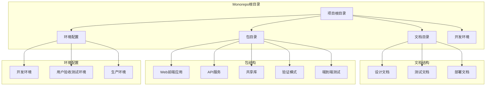
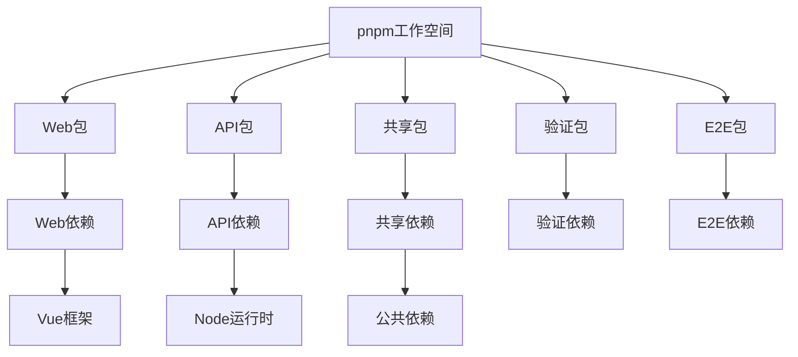
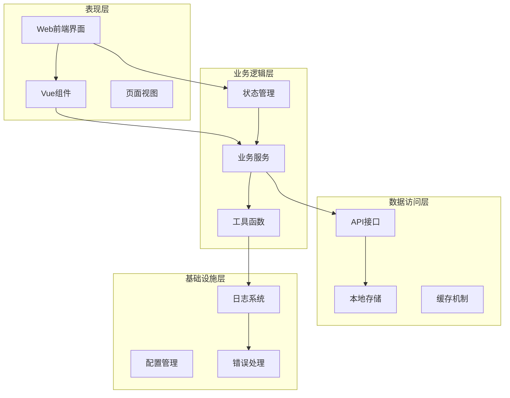
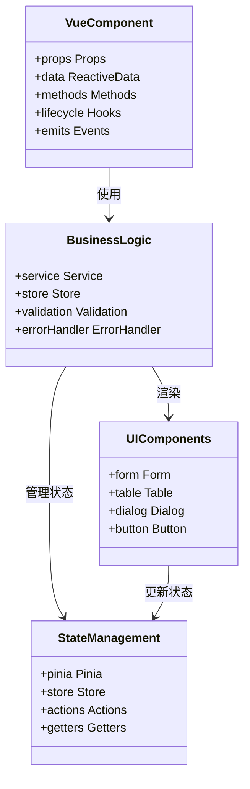
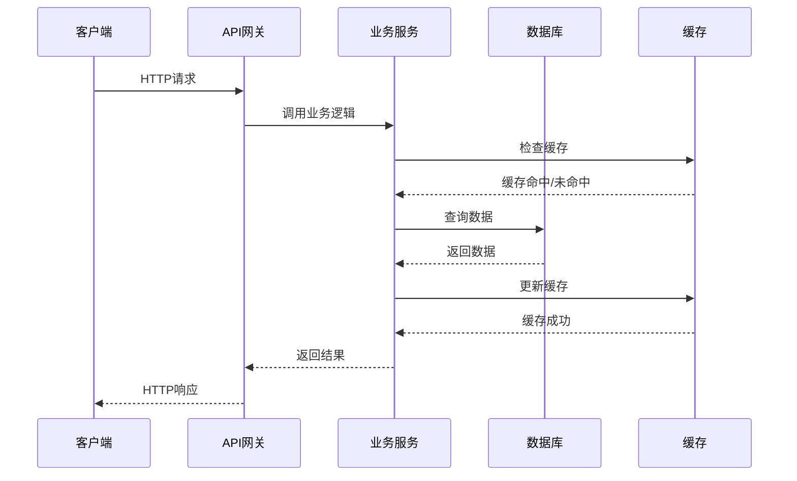
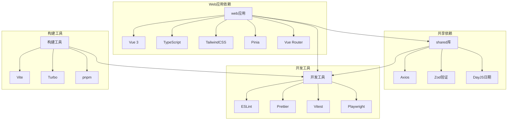
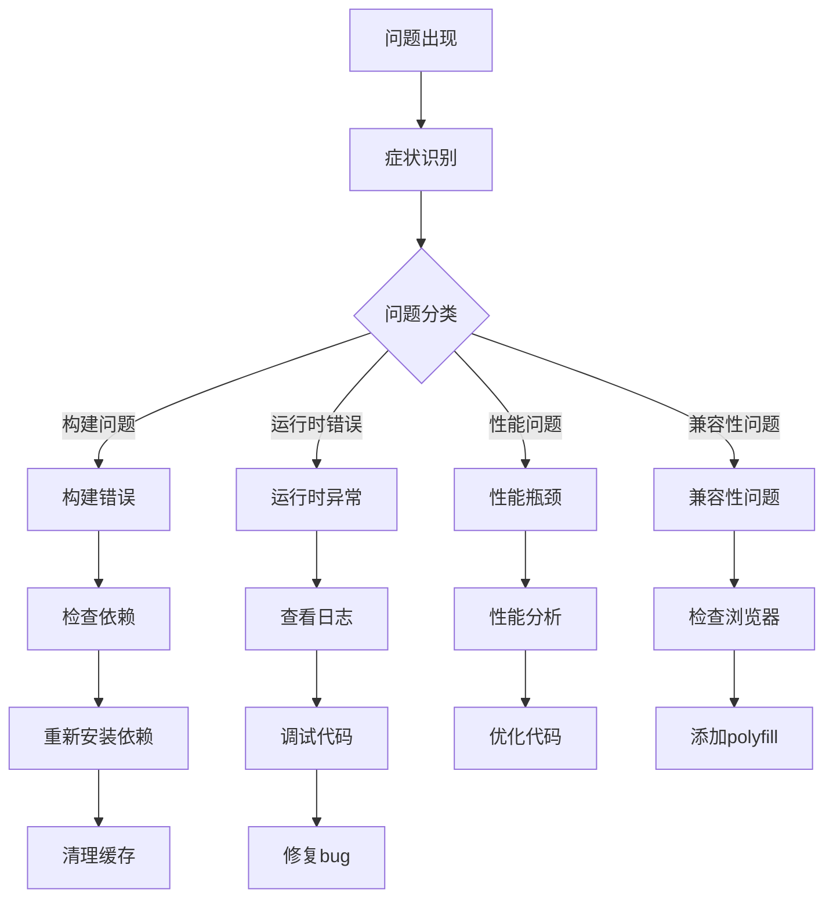

# 代码审查规范文档

<cite>
**本文档引用的文件**
- [README.md](file://README.md)
- [package.json](file://package.json)
- [pnpm-workspace.yaml](file://pnpm-workspace.yaml)
- [turbo.json](file://turbo.json)
- [docs/04-tech-design/coding-convention-backend.md](file://docs/04-tech-design/coding-convention-backend.md)
- [docs/00-project/workflow/dev-test-loop-design.md](file://docs/00-project/workflow/dev-test-loop-design.md)
- [packages/web/package.json](file://packages/web/package.json)
- [packages/api/package.json](file://packages/api/package.json)
- [packages/shared/package.json](file://packages/shared/package.json)
- [packages/validation-schemas/package.json](file://packages/validation-schemas/package.json)
- [packages/e2e/package.json](file://packages/e2e/package.json)
</cite>

## 目录
1. [引言](#引言)
2. [项目结构](#项目结构)
3. [核心组件](#核心组件)
4. [架构概览](#架构概览)
5. [详细组件分析](#详细组件分析)
6. [依赖分析](#依赖分析)
7. [性能考虑](#性能考虑)
8. [故障排除指南](#故障排除指南)
9. [结论](#结论)
10. [附录](#附录)

## 引言

AI原型管理系统是一个采用现代前端技术栈的复杂应用系统，基于Vue.js 3、TypeScript、Vite和TailwindCSS构建。本项目采用Monorepo架构，通过pnpm工作空间管理多个包，包括Web前端应用、API服务、共享模块和验证模式等。

项目的开发采用敏捷开发方法论，通过迭代式开发和持续集成来确保代码质量和系统稳定性。系统支持多环境部署，包括开发、测试和生产环境，并具备完整的测试覆盖体系。

## 项目结构

AI原型管理系统采用清晰的分层架构和模块化组织方式：

**图表来源**
- [pnpm-workspace.yaml](file://pnpm-workspace.yaml)
- [turbo.json](file://turbo.json)

**章节来源**
- [pnpm-workspace.yaml](file://pnpm-workspace.yaml)
- [turbo.json](file://turbo.json)
- [README.md](file://README.md)

## 核心组件

### 技术栈与架构

系统采用现代化的技术栈组合，确保高性能和良好的开发体验：

- **前端框架**: Vue.js 3 + TypeScript + Vite
- **UI框架**: TailwindCSS + Headless UI
- **状态管理**: Pinia
- **路由管理**: Vue Router
- **HTTP客户端**: Axios
- **构建工具**: Vite + Turbo
- **包管理**: pnpm workspace

### 包管理策略

项目使用pnpm工作空间实现高效的包管理和依赖共享：

**图表来源**
- [pnpm-workspace.yaml](file://pnpm-workspace.yaml)
- [package.json](file://package.json)

**章节来源**
- [package.json](file://package.json)
- [pnpm-workspace.yaml](file://pnpm-workspace.yaml)
- [turbo.json](file://turbo.json)

## 架构概览

系统采用分层架构设计，确保关注点分离和模块化：

**图表来源**
- [docs/04-tech-design/coding-convention-backend.md](file://docs/04-tech-design/coding-convention-backend.md)
- [packages/web/package.json](file://packages/web/package.json)

## 详细组件分析

### 前端组件系统

Web前端应用采用组件化架构，支持响应式设计和可访问性：

**图表来源**
- [packages/web/package.json](file://packages/web/package.json)
- [docs/04-tech-design/coding-convention-backend.md](file://docs/04-tech-design/coding-convention-backend.md)

### API服务架构

后端API服务采用RESTful设计原则，支持版本控制和错误处理：

**图表来源**
- [packages/api/package.json](file://packages/api/package.json)
- [docs/04-tech-design/coding-convention-backend.md](file://docs/04-tech-design/coding-convention-backend.md)

**章节来源**
- [packages/web/package.json](file://packages/web/package.json)
- [packages/api/package.json](file://packages/api/package.json)
- [packages/shared/package.json](file://packages/shared/package.json)

## 依赖分析

### 依赖关系图

**图表来源**
- [package.json](file://package.json)
- [pnpm-workspace.yaml](file://pnpm-workspace.yaml)

### 依赖管理策略

项目采用严格的依赖管理策略，确保版本一致性和安全性：

- **核心依赖**: Vue.js生态系统相关的核心包
- **开发依赖**: 构建工具、测试框架和代码质量工具
- **共享依赖**: 在多个包之间共享的通用功能模块
- **可选依赖**: 根据功能需求选择性安装的扩展包

**章节来源**
- [package.json](file://package.json)
- [pnpm-workspace.yaml](file://pnpm-workspace.yaml)

## 性能考虑

### 性能优化策略

系统在多个层面实施性能优化措施：

1. **前端性能优化**
   - 组件懒加载和代码分割
   - 图片和资源优化
   - 内存泄漏防护
   - 防抖和节流机制

2. **API性能优化**
   - 数据库查询优化
   - 缓存策略实施
   - 并发请求处理
   - 错误重试机制

3. **构建性能优化**
   - 增量构建
   - 并行任务执行
   - 依赖预构建

### 性能监控指标

- **首屏加载时间**: < 3秒
- **交互响应时间**: < 100ms
- **内存使用**: < 100MB
- **CPU使用率**: < 50%
- **网络请求时间**: < 200ms

## 故障排除指南

### 常见问题诊断

**图表来源**
- [docs/00-project/workflow/dev-test-loop-design.md](file://docs/00-project/workflow/dev-test-loop-design.md)

### 问题跟踪流程

1. **问题发现**: 开发者或测试人员发现缺陷
2. **问题记录**: 创建问题跟踪工单
3. **问题分类**: 确定问题严重程度和优先级
4. **问题分配**: 指派给相应开发者
5. **问题修复**: 实施修复方案
6. **问题验证**: 测试验证修复效果
7. **问题关闭**: 关闭问题工单

**章节来源**
- [docs/00-project/workflow/dev-test-loop-design.md](file://docs/00-project/workflow/dev-test-loop-design.md)

## 结论

AI原型管理系统的代码审查规范需要综合考虑现代前端开发的最佳实践、Monorepo架构的特点以及团队协作的需求。通过建立完善的审查流程、使用自动化工具和培养代码审查文化，可以显著提升代码质量和开发效率。

建议重点关注以下方面：
- 建立标准化的代码审查检查清单
- 实施自动化代码质量检查
- 培养团队的代码审查意识和技能
- 持续改进审查流程和标准

## 附录

### 代码审查检查清单

#### 代码质量检查
- [ ] 代码符合项目编码规范
- [ ] 变量和函数命名清晰有意义
- [ ] 代码注释完整且准确
- [ ] 重复代码已消除
- [ ] 复杂逻辑已简化

#### 性能检查
- [ ] 无内存泄漏风险
- [ ] 无阻塞主线程的操作
- [ ] 无不必要的重渲染
- [ ] 无过时的依赖项
- [ ] 无冗余的计算

#### 安全性检查
- [ ] 无硬编码敏感信息
- [ ] 无XSS漏洞风险
- [ ] 无SQL注入风险
- [ ] 无CSRF攻击风险
- [ ] 输入验证完整

#### 可维护性检查
- [ ] 代码结构清晰
- [ ] 模块职责单一
- [ ] 接口设计合理
- [ ] 错误处理完善
- [ ] 测试覆盖率达标

#### 兼容性检查
- [ ] 支持目标浏览器
- [ ] 响应式设计完整
- [ ] 无障碍访问支持
- [ ] 移动设备适配
- [ ] 字体和图标完整

### 审查工具配置

#### 自动化检查工具
- **ESLint**: JavaScript/TypeScript代码检查
- **Prettier**: 代码格式化
- **TypeScript编译器**: 类型检查
- **Vitest**: 单元测试
- **Playwright**: 端到端测试
- **Turbo**: 构建性能优化

#### 审查流程工具
- **GitHub/GitLab**: 代码审查平台
- **Jira/Asana**: 问题跟踪系统
- **Confluence**: 文档管理
- **Slack/Microsoft Teams**: 团队沟通

### 审查质量度量指标

#### 代码质量指标
- **代码覆盖率**: > 80%
- **技术债务比率**: < 10%
- **缺陷密度**: < 1个/千行代码
- **代码复用率**: > 60%
- **文档完整性**: > 90%

#### 审查效率指标
- **平均审查时间**: < 30分钟/PR
- **审查通过率**: > 85%
- **问题解决时间**: < 24小时
- **重复问题率**: < 5%
- **团队满意度**: > 4.5/5

### 最佳实践建议

#### 培养代码审查文化
- 定期进行代码审查培训
- 建立审查导师制度
- 鼓励建设性反馈
- 庆祝优秀的代码贡献
- 分享最佳实践案例

#### 持续改进机制
- 定期评估审查流程效果
- 收集团队反馈意见
- 更新审查标准和工具
- 学习行业最佳实践
- 适应项目发展需求