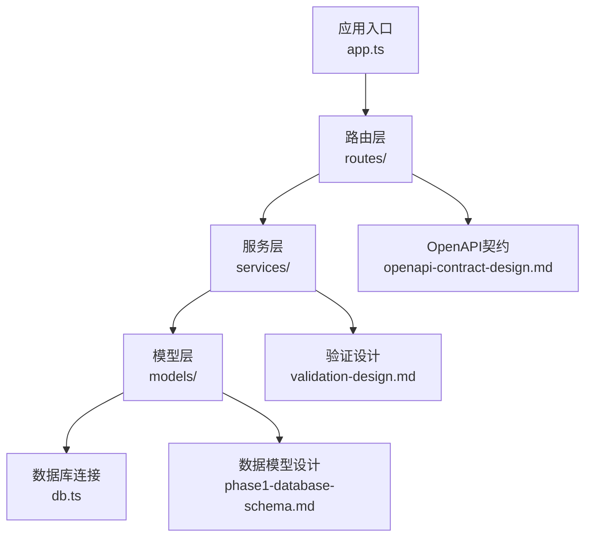
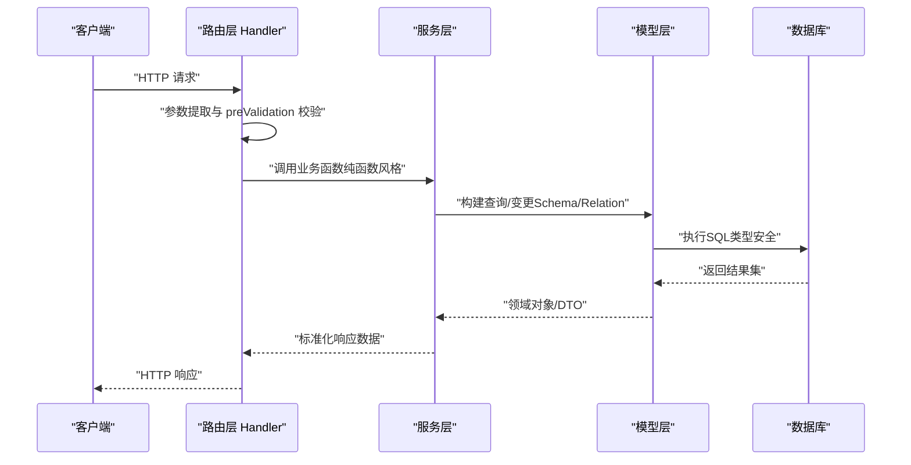
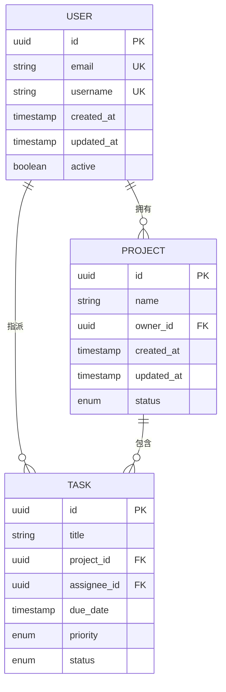
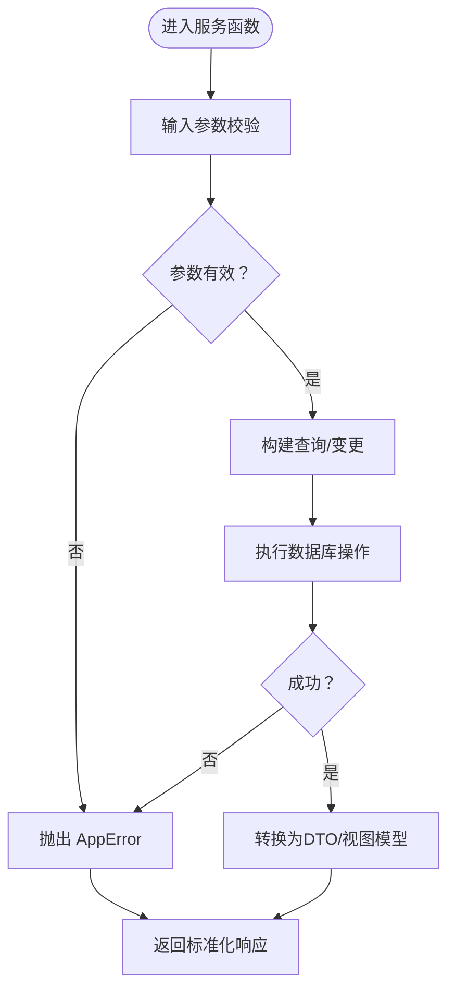
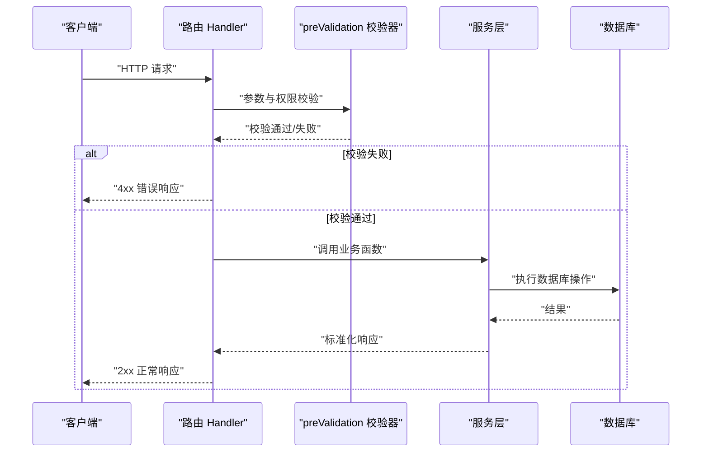
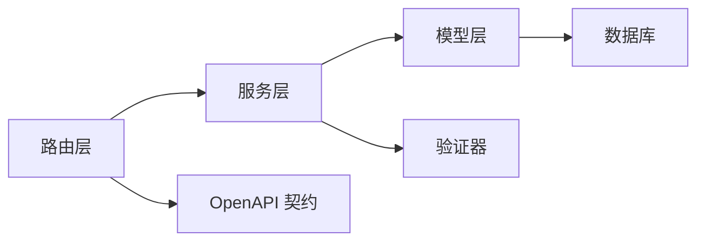

# 代码规范

<cite>
**本文引用的文件**
- [coding-convention-backend.md](file://docs/04-tech-design/coding-convention-backend.md)
- [design-language.md](file://docs/04-tech-design/design-language.md)
- [domain-model-tech-design.md](file://docs/04-tech-design/domain-model-tech-design.md)
- [openapi-contract-design.md](file://docs/04-tech-design/openapi-contract-design.md)
- [validation-design.md](file://docs/04-tech-design/validation-design.md)
- [phase1-design-tech.md](file://docs/04-tech-design/phase1-design-tech.md)
- [phase1-infrastructure-plan.md](file://docs/04-tech-design/phase1-infrastructure-plan.md)
- [project-context-navigation-design.md](file://docs/04-tech-design/project-context-navigation-design.md)
- [role-behavior-design.md](file://docs/04-tech-design/role-behavior-design.md)
- [object-lifecycle.md](file://docs/04-tech-design/object-lifecycle.md)
- [mcp-interface.md](file://docs/04-tech-design/mcp-interface.md)
- [phase1-database-schema.md](file://docs/05-data-design/phase1-database-schema.md)
- [f-m1-01-api.md](file://docs/06-test-design/modules/project-management/f-m1-01-project-list/f-m1-01-api.md)
- [f-m1-02-api.md](file://docs/06-test-design/modules/project-management/f-m1-02-create-project/f-m1-02-api.md)
- [f-m1-03-api.md](file://docs/06-test-design/modules/project-management/f-m1-03-project-detail/f-m1-03-api.md)
- [f-m1-04-api.md](file://docs/06-test-design/modules/project-management/f-m1-04-edit-project/f-m1-04-api.md)
- [f-m1-05-api.md](file://docs/06-test-design/modules/project-management/f-m1-05-archive/f-m1-05-api.md)
- [f-m1-06-api.md](file://docs/06-test-design/modules/application-management/application-management-interaction.md)
- [f-m1-08-api.md](file://docs/06-test-design/modules/domain-model/f-m1-08-api.md)
- [f-m1-09-api.md](file://docs/06-test-design/modules/domain-model/f-m1-09-api.md)
- [f-m1-12-api.md](file://docs/06-test-design/modules/domain-model/f-m1-12-api.md)
- [f-m1-13-api.md](file://docs/06-test-design/modules/domain-model/f-m1-13-api.md)
- [dev-test-loop-design.md](file://docs/00-project/workflow/dev-test-loop-design.md)
- [multi-env-deploy.md](file://docs/07-deploy-design/multi-env-deploy.md)
- [README.md](file://README.md)
</cite>

## 目录
1. [引言](#引言)
2. [项目结构](#项目结构)
3. [核心组件](#核心组件)
4. [架构总览](#架构总览)
5. [详细组件分析](#详细组件分析)
6. [依赖分析](#依赖分析)
7. [性能考虑](#性能考虑)
8. [故障排查指南](#故障排查指南)
9. [结论](#结论)
10. [附录](#附录)

## 引言
本文件面向AI原型管理系统后端团队，系统化梳理TypeScript编码标准、命名约定、文件组织结构与注释规范；明确后端分层架构（app.ts、db.ts、models/、services/、routes/）的职责边界与协作关系；给出Service层纯函数风格约束、DB行到API响应的数据转换规则、AppError错误类体系的使用方法；规范Route层Handler模板、参数提取与preValidation校验中间件；阐述Model层（Drizzle ORM）的Schema与Relation定义规范及常用查询模式；并提供测试用例中的接口契约参考，帮助开发者统一开发与交付质量。

## 项目结构
- 后端采用分层架构：应用入口、数据库连接、模型层、服务层、路由层。
- 文档侧提供技术设计、数据设计、测试设计与部署设计，支撑编码规范落地。
- 测试用例以模块化API文档形式存在，作为接口契约与行为验证依据。

**图表来源**
- [coding-convention-backend.md](file://docs/04-tech-design/coding-convention-backend.md)
- [openapi-contract-design.md](file://docs/04-tech-design/openapi-contract-design.md)
- [validation-design.md](file://docs/04-tech-design/validation-design.md)
- [phase1-database-schema.md](file://docs/05-data-design/phase1-database-schema.md)

**章节来源**
- [coding-convention-backend.md](file://docs/04-tech-design/coding-convention-backend.md)
- [README.md](file://README.md)

## 核心组件
- 应用入口（app.ts）
  - 负责初始化应用、注册路由、配置中间件与错误处理。
  - 统一暴露HTTP服务器实例，便于测试与部署。
- 数据库（db.ts）
  - 统一封装Drizzle连接、事务与查询上下文。
  - 提供类型安全的ORM操作入口。
- 模型层（models/）
  - 定义Schema与Relation，确保数据结构与业务实体一致。
  - 通过严格的数据类型约束，降低跨层耦合。
- 服务层（services/）
  - 实现纯函数风格：无副作用、可测试、可复用。
  - 承担业务逻辑编排与数据转换。
- 路由层（routes/）
  - 定义Handler模板、参数提取与preValidation校验中间件。
  - 与OpenAPI契约对齐，保证请求/响应一致性。

**章节来源**
- [coding-convention-backend.md](file://docs/04-tech-design/coding-convention-backend.md)
- [phase1-database-schema.md](file://docs/05-data-design/phase1-database-schema.md)

## 架构总览
下图展示从HTTP请求到数据库写入的典型调用链，体现各层职责与数据流向。

**图表来源**
- [coding-convention-backend.md](file://docs/04-tech-design/coding-convention-backend.md)
- [openapi-contract-design.md](file://docs/04-tech-design/openapi-contract-design.md)
- [validation-design.md](file://docs/04-tech-design/validation-design.md)
- [phase1-database-schema.md](file://docs/05-data-design/phase1-database-schema.md)

## 详细组件分析

### 应用入口（app.ts）
- 职责
  - 初始化Fastify或类似框架实例。
  - 注册全局中间件（日志、CORS、鉴权钩子等）。
  - 加载路由模块并挂载至应用。
  - 配置错误处理与健康检查端点。
- 规范
  - 使用环境变量驱动配置，避免硬编码。
  - 将路由注册集中在一个位置，便于维护。
  - 错误处理统一使用AppError体系，确保响应格式一致。

**章节来源**
- [coding-convention-backend.md](file://docs/04-tech-design/coding-convention-backend.md)

### 数据库（db.ts）
- 职责
  - 管理Drizzle连接池与事务上下文。
  - 提供类型安全的查询DSL与变更操作。
- 规范
  - 所有查询必须在事务中进行，除非明确不需要。
  - 查询结果统一映射为领域对象或DTO，避免直接暴露ORM实体。
  - 对外仅暴露受控的查询/变更函数，隐藏具体SQL细节。

**章节来源**
- [phase1-database-schema.md](file://docs/05-data-design/phase1-database-schema.md)

### 模型层（models/）
- Schema定义规范
  - 字段命名采用小驼峰，禁止使用保留字。
  - 显式标注可空性与默认值，保持与数据库一致。
  - 复杂字段（如JSON）需配合验证器与序列化器。
- Relation定义规范
  - 一对一/一对多/多对多关系必须显式声明外键与级联策略。
  - 关系命名遵循“目标表名_字段”或“反向引用”约定，保持一致性。
- 常用查询模式
  - 条件过滤：使用where子句组合与索引字段匹配。
  - 排序与分页：基于主键或唯一索引稳定排序。
  - 连接查询：优先使用内连接，避免N+1问题。
  - 聚合统计：在数据库层完成聚合，减少网络传输。

**图表来源**
- [phase1-database-schema.md](file://docs/05-data-design/phase1-database-schema.md)

**章节来源**
- [phase1-database-schema.md](file://docs/05-data-design/phase1-database-schema.md)

### 服务层（services/）
- 纯函数风格约束
  - 输入输出均为不可变数据结构；不直接访问数据库或外部服务。
  - 通过依赖注入传递db上下文或工具函数，便于测试替身。
  - 业务规则集中在服务函数内部，避免分散在路由或控制器。
- 数据转换规则
  - DB行到API响应：统一通过DTO/视图模型转换，剔除敏感字段，补充派生属性。
  - 响应格式：遵循OpenAPI契约，字段命名与类型严格一致。
- 错误处理
  - 使用AppError抛出语义化错误，包含错误码、消息与上下文信息。
  - 不吞掉异常，确保上层能正确捕获与记录。

**图表来源**
- [coding-convention-backend.md](file://docs/04-tech-design/coding-convention-backend.md)
- [validation-design.md](file://docs/04-tech-design/validation-design.md)
- [openapi-contract-design.md](file://docs/04-tech-design/openapi-contract-design.md)

**章节来源**
- [coding-convention-backend.md](file://docs/04-tech-design/coding-convention-backend.md)
- [validation-design.md](file://docs/04-tech-design/validation-design.md)

### 路由层（routes/）
- Handler标准模板
  - 参数提取：从路径、查询与请求体中分离参数，分别校验。
  - preValidation校验：在进入Handler前完成参数与权限校验。
  - 错误处理：捕获AppError并生成一致的HTTP响应。
- 参数提取规范
  - 路径参数：用于定位资源；查询参数：用于过滤/排序/分页。
  - 请求体：遵循OpenAPI契约，使用验证器进行结构与类型校验。
- OpenAPI契约对齐
  - 路由定义与契约保持一致，包括HTTP方法、路径、参数与响应体。
  - 响应状态码与错误结构与契约一致，便于前端消费。

**图表来源**
- [openapi-contract-design.md](file://docs/04-tech-design/openapi-contract-design.md)
- [validation-design.md](file://docs/04-tech-design/validation-design.md)

**章节来源**
- [openapi-contract-design.md](file://docs/04-tech-design/openapi-contract-design.md)
- [validation-design.md](file://docs/04-tech-design/validation-design.md)

### 错误类体系（AppError）
- 设计原则
  - 语义化错误码：区分业务错误、参数错误、权限错误与系统错误。
  - 可追踪性：携带请求ID、时间戳与上下文信息。
  - 前后端一致：错误结构与OpenAPI契约一致，便于前端统一处理。
- 使用建议
  - 在服务层构造AppError并向上抛出，避免在路由层重复封装。
  - 记录结构化日志，包含错误栈与上下文参数。

**章节来源**
- [coding-convention-backend.md](file://docs/04-tech-design/coding-convention-backend.md)

### 类型与命名规范
- TypeScript编码标准
  - 使用严格模式与ESLint规则，禁止any与隐式undefined。
  - 函数与类采用PascalCase，变量与文件采用camelCase。
  - 导出接口与类型时，优先使用命名导出，保持可读性。
- 文件组织结构
  - routes/按功能域划分子目录，每个子目录包含Handler与相关类型。
  - services/按业务域拆分，避免跨域依赖。
  - models/按实体拆分，Relation集中定义，避免循环依赖。
- 注释规范
  - 公共API与复杂逻辑必须包含JSDoc，说明输入输出与异常。
  - TODO/FIXME使用统一标记，并关联任务编号。

**章节来源**
- [coding-convention-backend.md](file://docs/04-tech-design/coding-convention-backend.md)

## 依赖分析
- 层间依赖
  - 路由层依赖服务层；服务层依赖模型层；模型层依赖数据库。
  - 依赖方向单向，避免循环依赖。
- 外部依赖
  - Drizzle ORM提供类型安全的SQL DSL。
  - OpenAPI契约驱动路由与响应结构。
  - 验证器保障请求参数与业务规则一致性。

**图表来源**
- [coding-convention-backend.md](file://docs/04-tech-design/coding-convention-backend.md)
- [openapi-contract-design.md](file://docs/04-tech-design/openapi-contract-design.md)
- [validation-design.md](file://docs/04-tech-design/validation-design.md)
- [phase1-database-schema.md](file://docs/05-data-design/phase1-database-schema.md)

**章节来源**
- [coding-convention-backend.md](file://docs/04-tech-design/coding-convention-backend.md)
- [openapi-contract-design.md](file://docs/04-tech-design/openapi-contract-design.md)
- [validation-design.md](file://docs/04-tech-design/validation-design.md)
- [phase1-database-schema.md](file://docs/05-data-design/phase1-database-schema.md)

## 性能考虑
- 查询优化
  - 为高频过滤字段建立索引，避免全表扫描。
  - 使用连接查询替代多次查询，减少往返次数。
  - 分页查询基于游标或主键，避免深层偏移。
- 缓存策略
  - 对热点只读数据使用缓存，设置合理TTL。
  - 写操作后失效相关缓存，保证一致性。
- 并发控制
  - 使用数据库事务包裹相关写操作，避免竞态条件。
  - 对高并发场景使用队列异步处理非关键流程。

## 故障排查指南
- 常见问题
  - 参数校验失败：检查preValidation是否覆盖所有字段，OpenAPI契约是否更新。
  - 数据转换异常：确认DTO映射逻辑与数据库Schema一致。
  - 事务未提交：检查服务层是否正确回滚与重试。
- 日志与监控
  - 记录请求ID、用户ID与关键业务参数，便于追踪。
  - 对AppError进行分类统计，识别高频错误类型。

**章节来源**
- [dev-test-loop-design.md](file://docs/00-project/workflow/dev-test-loop-design.md)
- [coding-convention-backend.md](file://docs/04-tech-design/coding-convention-backend.md)

## 结论
通过统一的编码规范、清晰的分层职责与严格的契约约束，系统能够在快速迭代的同时保持高质量与可维护性。建议在每次PR中对照本文档进行自检，并结合测试用例与部署设计文档进行端到端验证。

## 附录
- 接口契约参考（测试用例）
  - 项目列表：[f-m1-01-api.md](file://docs/06-test-design/modules/project-management/f-m1-01-project-list/f-m1-01-api.md)
  - 创建项目：[f-m1-02-api.md](file://docs/06-test-design/modules/project-management/f-m1-02-create-project/f-m1-02-api.md)
  - 项目详情：[f-m1-03-api.md](file://docs/06-test-design/modules/project-management/f-m1-03-project-detail/f-m1-03-api.md)
  - 编辑项目：[f-m1-04-api.md](file://docs/06-test-design/modules/project-management/f-m1-04-edit-project/f-m1-04-api.md)
  - 归档项目：[f-m1-05-api.md](file://docs/06-test-design/modules/project-management/f-m1-05-archive/f-m1-05-api.md)
  - 应用管理交互：[application-management-interaction.md](file://docs/06-test-design/modules/application-management/application-management-interaction.md)
  - 域模型-角色：[f-m1-08-api.md](file://docs/06-test-design/modules/domain-model/f-m1-08-api.md)
  - 域模型-外部实体：[f-m1-09-api.md](file://docs/06-test-design/modules/domain-model/f-m1-09-api.md)
  - 域模型-角色行为：[f-m1-12-api.md](file://docs/06-test-design/modules/domain-model/f-m1-12-api.md)
  - 域模型-外部实体行为：[f-m1-13-api.md](file://docs/06-test-design/modules/domain-model/f-m1-13-api.md)

**章节来源**
- [f-m1-01-api.md](file://docs/06-test-design/modules/project-management/f-m1-01-project-list/f-m1-01-api.md)
- [f-m1-02-api.md](file://docs/06-test-design/modules/project-management/f-m1-02-create-project/f-m1-02-api.md)
- [f-m1-03-api.md](file://docs/06-test-design/modules/project-management/f-m1-03-project-detail/f-m1-03-api.md)
- [f-m1-04-api.md](file://docs/06-test-design/modules/project-management/f-m1-04-edit-project/f-m1-04-api.md)
- [f-m1-05-api.md](file://docs/06-test-design/modules/project-management/f-m1-05-archive/f-m1-05-api.md)
- [f-m1-06-api.md](file://docs/06-test-design/modules/application-management/application-management-interaction.md)
- [f-m1-08-api.md](file://docs/06-test-design/modules/domain-model/f-m1-08-api.md)
- [f-m1-09-api.md](file://docs/06-test-design/modules/domain-model/f-m1-09-api.md)
- [f-m1-12-api.md](file://docs/06-test-design/modules/domain-model/f-m1-12-api.md)
- [f-m1-13-api.md](file://docs/06-test-design/modules/domain-model/f-m1-13-api.md)