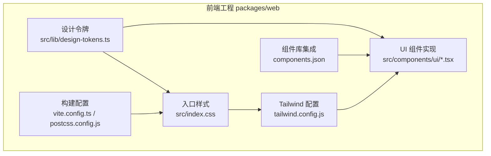
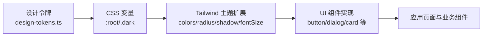
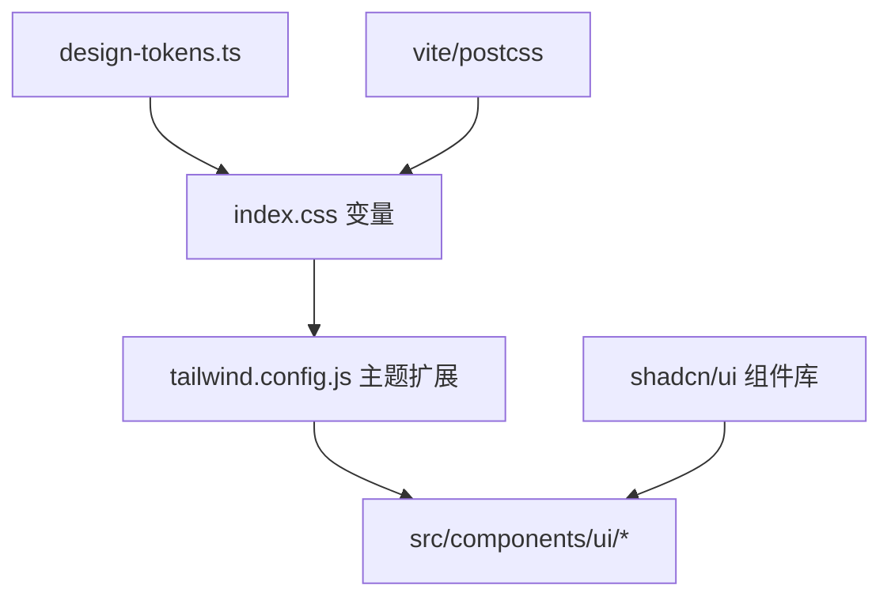

# 前端设计语言

<cite>
**本文引用的文件**
- [packages/web/tailwind.config.js](file://packages/web/tailwind.config.js)
- [packages/web/src/index.css](file://packages/web/src/index.css)
- [packages/web/package.json](file://packages/web/package.json)
- [packages/web/src/lib/design-tokens.ts](file://packages/web/src/lib/design-tokens.ts)
- [packages/web/src/components/ui/dialog.tsx](file://packages/web/src/components/ui/dialog.tsx)
- [packages/web/src/components/ui/card.tsx](file://packages/web/src/components/ui/card.tsx)
- [docs/99-archived/design-token-system.md](file://docs/99-archived/design-token-system.md)
- [docs/99-archived/prototypes/m1-project-list.html](file://docs/99-archived/prototypes/m1-project-list.html)
- [docs/99-archived/prototypes/m1-project-detail.html](file://docs/99-archived/prototypes/m1-project-detail.html)
- [packages/web/components.json](file://packages/web/components.json)
- [packages/web/postcss.config.js](file://packages/web/postcss.config.js)
- [packages/web/vite.config.ts](file://packages/web/vite.config.ts)
</cite>

## 目录
1. [引言](#引言)
2. [项目结构](#项目结构)
3. [核心组件](#核心组件)
4. [架构总览](#架构总览)
5. [详细组件分析](#详细组件分析)
6. [依赖关系分析](#依赖关系分析)
7. [性能考量](#性能考量)
8. [故障排查指南](#故障排查指南)
9. [结论](#结论)
10. [附录](#附录)

## 引言
本文件为“AI原型管理系统”的前端设计语言与视觉规范文档，面向前端开发者与设计人员，统一UI组件设计原则、视觉设计规范与交互设计标准。文档覆盖以下要点：
- 设计语言与设计令牌体系
- 组件库使用规范（shadcn/ui）
- 样式系统（Tailwind CSS）与主题定制
- 响应式设计策略、无障碍设计要求、跨浏览器兼容性
- 组件使用示例、样式定制指南与设计令牌系统说明
- 色彩系统、字体系统、间距系统、阴影系统等设计元素的具体规范

## 项目结构
前端工程位于 packages/web，采用 React + TypeScript + Vite 构建，样式系统基于 Tailwind CSS，并通过 shadcn/ui 提供可复用的语义化组件。设计令牌集中于 CSS 变量与 TS 常量，确保设计一致性与可维护性。

图表来源
- [packages/web/src/index.css:1-30](file://packages/web/src/index.css#L1-L30)
- [packages/web/tailwind.config.js:1-26](file://packages/web/tailwind.config.js#L1-L26)
- [packages/web/src/lib/design-tokens.ts:1-35](file://packages/web/src/lib/design-tokens.ts#L1-L35)
- [packages/web/components.json](file://packages/web/components.json)

章节来源
- [packages/web/src/index.css:1-30](file://packages/web/src/index.css#L1-L30)
- [packages/web/tailwind.config.js:1-26](file://packages/web/tailwind.config.js#L1-L26)
- [packages/web/package.json](file://packages/web/package.json)

## 核心组件
本节概述前端设计语言的核心组成与约束：
- 设计令牌：定义品牌色、文本色、边框与分隔线、布局与覆盖层等基础设计元素，作为“唯一真相源”，禁止在组件中硬编码具体值。
- 样式系统：以 Tailwind CSS 为核心，通过 CSS 变量桥接设计令牌，支持明暗主题切换。
- 组件库：基于 shadcn/ui 的语义化组件，按设计规范进行二次封装与样式覆盖。
- 响应式与无障碍：遵循移动端优先与语义化标签，确保键盘可达与屏幕阅读器友好。
- 兼容性：在现代浏览器上保证功能与样式一致；对旧版浏览器提供渐进增强策略。

章节来源
- [packages/web/src/lib/design-tokens.ts:1-35](file://packages/web/src/lib/design-tokens.ts#L1-L35)
- [packages/web/src/index.css:1-30](file://packages/web/src/index.css#L1-L30)
- [packages/web/tailwind.config.js:1-26](file://packages/web/tailwind.config.js#L1-L26)

## 架构总览
下图展示设计语言在工程中的落地路径：设计令牌 → CSS 变量 → Tailwind 主题扩展 → 组件实现。

图表来源
- [packages/web/src/lib/design-tokens.ts:1-35](file://packages/web/src/lib/design-tokens.ts#L1-L35)
- [packages/web/src/index.css:16-1542](file://packages/web/src/index.css#L16-L1542)
- [packages/web/tailwind.config.js:8-172](file://packages/web/tailwind.config.js#L8-L172)
- [packages/web/src/components/ui/dialog.tsx:1-137](file://packages/web/src/components/ui/dialog.tsx#L1-L137)
- [packages/web/src/components/ui/card.tsx:1-105](file://packages/web/src/components/ui/card.tsx#L1-L105)

## 详细组件分析

### 设计令牌系统
- 品牌色与主色系：包含主色、前景、悬停、激活、浅色背景与更浅色等，确保在明暗主题下具备对比度与可读性。
- 文本色（三级）：主、次、三级文本色，用于不同信息层级与禁用状态。
- 边框与分隔线：默认与强边框，配合卡片与对话框等容器使用。
- 覆盖层：弹窗遮罩背景采用较高不透明度，提升焦点与层次感。
- 原子化尺寸：表单、表格、按钮、输入框等常见组件的间距与尺寸以令牌形式统一。

章节来源
- [packages/web/src/lib/design-tokens.ts:10-35](file://packages/web/src/lib/design-tokens.ts#L10-L35)
- [docs/99-archived/design-token-system.md:172-203](file://docs/99-archived/design-token-system.md#L172-L203)

### 色彩系统
- 使用 HSL 格式的 CSS 变量，避免 Tailwind 在处理 var() 时出现无效 hsl() 的问题。
- 明暗主题：:root 定义亮色变量，.dark 定义暗色变量，通过 class 切换实现无缝主题切换。
- 组件映射：Tailwind colors 通过 hsl(var(--xxx)) 与 CSS 变量绑定，确保组件继承设计令牌。

章节来源
- [packages/web/src/index.css:16-1542](file://packages/web/src/index.css#L16-L1542)
- [packages/web/tailwind.config.js:8-172](file://packages/web/tailwind.config.js#L8-L172)

### 字体系统
- 字体：采用变量字体，保证在不同断点下的排版一致性与性能。
- 字号层级：扩展了更细粒度的字号层级，满足标题、正文、辅助信息等多场景需求。
- 行高与字重：通过 Tailwind fontSize 与行高配置，确保阅读舒适度与层级清晰。

章节来源
- [packages/web/src/index.css:1-6](file://packages/web/src/index.css#L1-L6)
- [packages/web/tailwind.config.js:165-168](file://packages/web/tailwind.config.js#L165-L168)

### 间距系统
- 组件级间距：对话框头部/主体/底部内边距、按钮水平内边距、表单组间距、标签与输入间距等。
- 布局级间距：页头高度、侧边栏展开/折叠宽度等。
- 覆盖层：遮罩背景与弹窗层级关系明确，避免视觉冲突。

章节来源
- [docs/99-archived/design-token-system.md:172-203](file://docs/99-archived/design-token-system.md#L172-L203)
- [packages/web/src/components/ui/dialog.tsx:86-123](file://packages/web/src/components/ui/dialog.tsx#L86-L123)

### 阴影系统
- 卡片、下拉、对话框、悬停与焦点光晕等阴影规范，均来自设计令牌变量。
- 通过 Tailwind boxShadow 扩展，确保组件阴影风格统一。

章节来源
- [packages/web/tailwind.config.js:155-164](file://packages/web/tailwind.config.js#L155-L164)

### 圆角系统
- 基于 CSS 变量 --radius，提供 lg/md/sm 不同圆角等级，适配卡片、对话框等容器。

章节来源
- [packages/web/tailwind.config.js:1468-1472](file://packages/web/tailwind.config.js#L1468-L1472)

### 组件库使用规范（shadcn/ui）
- 组件来源：组件库通过 components.json 管理，确保版本与变体一致。
- 二次封装：在 src/components/ui 下对基础组件进行语义化包装与样式覆盖，严格遵循设计令牌。
- 变体与尺寸：仅使用设计语言允许的变体与尺寸，避免自定义扩展破坏一致性。

章节来源
- [packages/web/components.json](file://packages/web/components.json)
- [packages/web/src/components/ui/dialog.tsx:1-137](file://packages/web/src/components/ui/dialog.tsx#L1-L137)
- [packages/web/src/components/ui/card.tsx:1-105](file://packages/web/src/components/ui/card.tsx#L1-L105)

### 响应式设计策略
- 断点与布局：以移动优先策略，结合 CSS Grid 与 Flex 实现自适应布局。
- 组件自适应：对话框、卡片等组件在小屏设备上自动调整宽度与内边距，保证可用性。
- 字体与间距：通过相对单位与设计令牌，确保在不同 DPR 与视口下的可读性与比例感。

章节来源
- [packages/web/src/components/ui/dialog.tsx:61-68](file://packages/web/src/components/ui/dialog.tsx#L61-L68)
- [packages/web/src/components/ui/card.tsx:14-18](file://packages/web/src/components/ui/card.tsx#L14-L18)

### 无障碍设计要求
- 语义化标签：使用语义化 HTML 结构，确保屏幕阅读器正确识别页面结构。
- 键盘可达：所有交互元素支持 Tab 导航与 Enter/Space 激活。
- 对比度与焦点：通过设计令牌保障文本与背景对比度，提供清晰的焦点指示。
- 屏幕阅读器提示：隐藏按钮使用合适的 sr-only 文本，避免无意义的空提示。

章节来源
- [packages/web/src/components/ui/dialog.tsx:72-79](file://packages/web/src/components/ui/dialog.tsx#L72-L79)

### 跨浏览器兼容性
- 现代浏览器：充分利用 CSS 变量、Grid、Flex、BackdropFilter 等能力。
- 渐进增强：对不支持 BackdropFilter 的环境提供降级方案；对旧版浏览器提供 polyfill 或简化样式。
- 构建工具链：Vite + PostCSS 确保 CSS 转换与优化，Tailwind 插件提供向后兼容支持。

章节来源
- [packages/web/src/index.css:31-1542](file://packages/web/src/index.css#L31-L1542)
- [packages/web/postcss.config.js](file://packages/web/postcss.config.js)

### 组件使用示例与样式定制指南
- 对话框（Dialog）：使用 DialogOverlay、DialogContent、DialogHeader、DialogFooter 等语义化区块，内部间距与圆角、阴影遵循设计令牌。
- 卡片（Card）：支持 default/sm 尺寸，头部/内容/尾部区域按设计令牌设置内边距与分隔线。
- 按钮：通过 buttonVariants 与设计令牌组合，确保在不同状态下的视觉一致性。
- 样式定制：禁止直接在组件中写死像素值或十六进制颜色；一律通过设计令牌或 Tailwind 变量获取。

章节来源
- [packages/web/src/components/ui/dialog.tsx:24-123](file://packages/web/src/components/ui/dialog.tsx#L24-L123)
- [packages/web/src/components/ui/card.tsx:5-95](file://packages/web/src/components/ui/card.tsx#L5-L95)

## 依赖关系分析
- 设计令牌 → CSS 变量 → Tailwind 主题 → 组件实现
- 组件库（shadcn/ui）与工程组件并行存在，后者基于前者进行语义化封装
- 构建工具链（Vite + PostCSS + Tailwind）负责样式编译与优化

图表来源
- [packages/web/src/lib/design-tokens.ts:1-35](file://packages/web/src/lib/design-tokens.ts#L1-L35)
- [packages/web/src/index.css:16-1542](file://packages/web/src/index.css#L16-L1542)
- [packages/web/tailwind.config.js:8-172](file://packages/web/tailwind.config.js#L8-L172)
- [packages/web/components.json](file://packages/web/components.json)
- [packages/web/vite.config.ts](file://packages/web/vite.config.ts)
- [packages/web/postcss.config.js](file://packages/web/postcss.config.js)

章节来源
- [packages/web/package.json](file://packages/web/package.json)
- [packages/web/components.json](file://packages/web/components.json)

## 性能考量
- 原子化样式：Tailwind 原子类减少重复样式，提升渲染效率。
- 变量驱动：CSS 变量与设计令牌降低样式计算成本，便于主题切换。
- 构建优化：Vite 快速冷启动与热更新，PostCSS 与 Tailwind 插件按需生成样式。
- 图片与字体：变量字体与按需加载策略，减少首屏阻塞。

## 故障排查指南
- 颜色失效：确认 Tailwind colors 使用 hsl(var(--xxx)) 形式，避免直接使用十六进制。
- 主题不生效：检查 :root 与 .dark 变量是否齐全，class 切换逻辑是否正确。
- 对话框遮罩不显示：确认 overlay 背景变量与 z-index 设置，检查动画类是否正确引入。
- 字体异常：检查 @fontsource-variable/geist 是否正确导入与加载。

章节来源
- [packages/web/src/index.css:16-1542](file://packages/web/src/index.css#L16-L1542)
- [packages/web/src/components/ui/dialog.tsx:24-37](file://packages/web/src/components/ui/dialog.tsx#L24-L37)

## 结论
本设计语言以“设计令牌”为核心，通过 CSS 变量与 Tailwind 主题扩展实现跨组件的一致性；以 shadcn/ui 为基础组件库，辅以语义化封装与样式覆盖，确保在多场景下的可用性与可维护性。遵循本文档的规范，可显著提升开发效率与产品视觉一致性。

## 附录
- 原型参考：历史原型文件展示了对话框、遮罩与内边距等关键样式，可作为实现对照。
- 组件实现参考：对话框与卡片组件的实现路径可作为新组件开发的模板。

章节来源
- [docs/99-archived/prototypes/m1-project-list.html:182-192](file://docs/99-archived/prototypes/m1-project-list.html#L182-L192)
- [docs/99-archived/prototypes/m1-project-detail.html:151-161](file://docs/99-archived/prototypes/m1-project-detail.html#L151-L161)
- [packages/web/src/components/ui/dialog.tsx:1-137](file://packages/web/src/components/ui/dialog.tsx#L1-L137)
- [packages/web/src/components/ui/card.tsx:1-105](file://packages/web/src/components/ui/card.tsx#L1-L105)