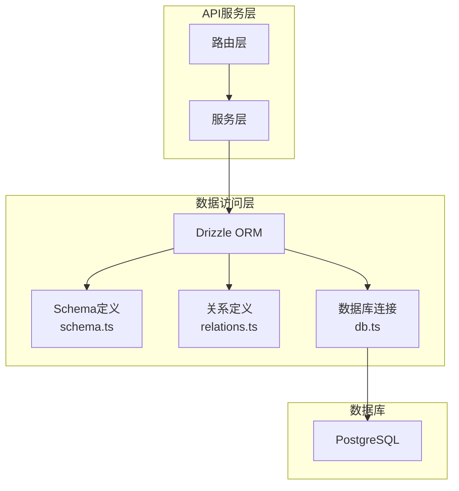
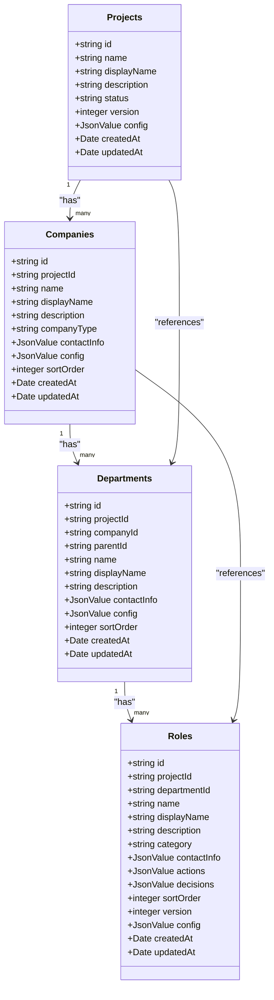
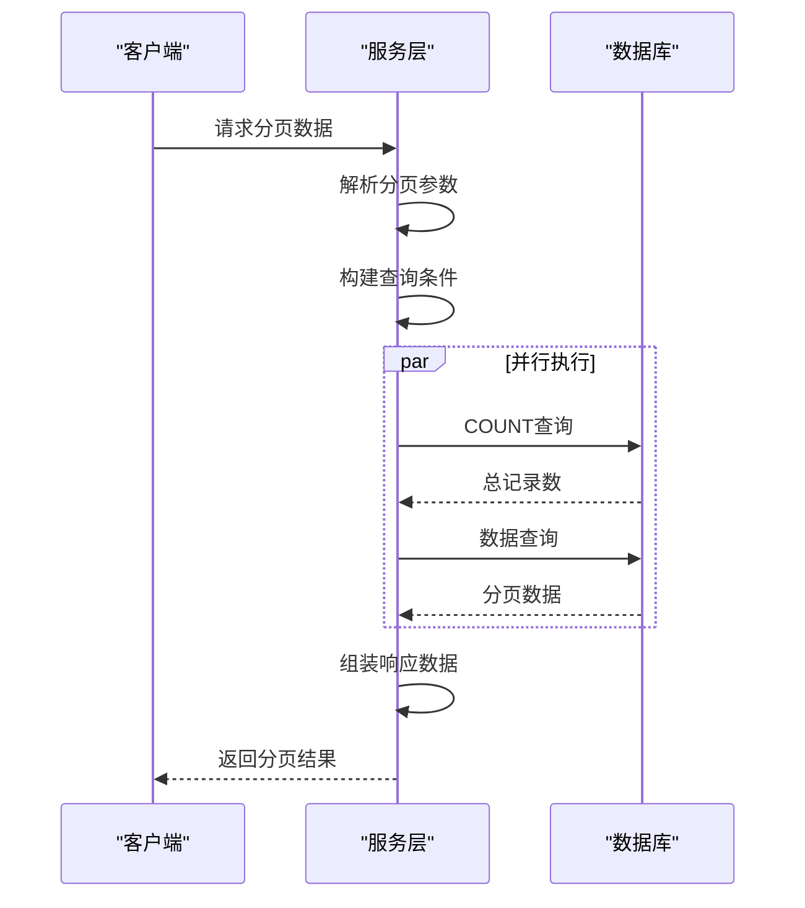
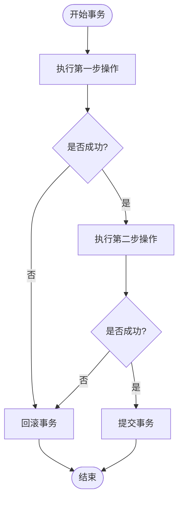
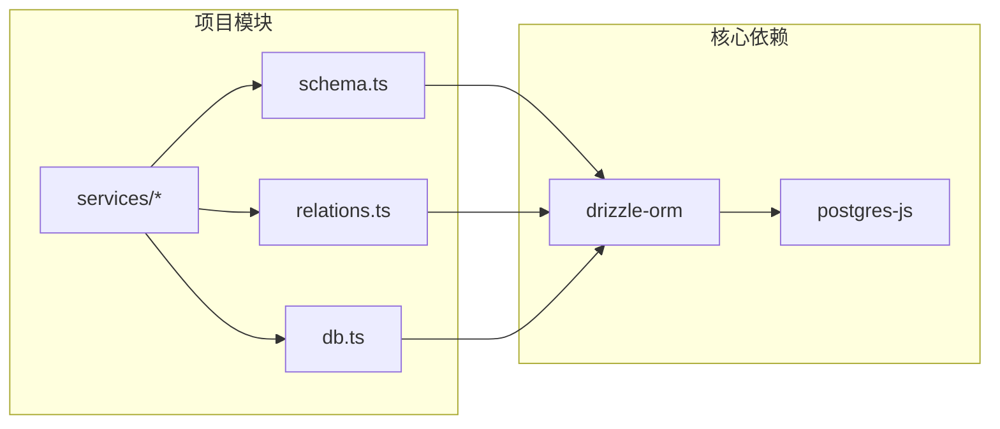

# Drizzle ORM使用规范

<cite>
**本文档引用的文件**
- [packages/api/src/models/schema.ts](file://packages/api/src/models/schema.ts)
- [packages/api/src/models/relations.ts](file://packages/api/src/models/relations.ts)
- [packages/api/src/db.ts](file://packages/api/src/db.ts)
- [docs/04-tech-design/coding-convention-backend.md](file://docs/04-tech-design/coding-convention-backend.md)
- [packages/api/src/services/project.service.ts](file://packages/api/src/services/project.service.ts)
- [packages/api/src/services/domain.service.ts](file://packages/api/src/services/domain.service.ts)
</cite>

## 目录
1. [简介](#简介)
2. [项目结构](#项目结构)
3. [核心组件](#核心组件)
4. [架构概览](#架构概览)
5. [详细组件分析](#详细组件分析)
6. [依赖分析](#依赖分析)
7. [性能考虑](#性能考虑)
8. [故障排除指南](#故障排除指南)
9. [结论](#结论)

## 简介
本文件为AI原型管理系统中Drizzle ORM的使用规范，旨在帮助开发者正确使用Drizzle ORM进行数据库操作。文档涵盖Schema定义规范（列名映射、主键定义、时间戳字段、JSONB字段处理）、Relation定义规范（一对多、多对多、自引用关系）、常用查询模式（带条件的分页查询、并行查询优化、事务处理），以及Drizzle Query Builder的安全性优势和SQL注入防护机制。

## 项目结构
AI原型管理系统采用分层架构，Drizzle ORM位于Model层，负责数据库Schema定义和关系映射。核心文件包括：
- schema.ts：定义19张表的Schema，包含主键、外键、索引、默认值等
- relations.ts：定义表间关系，支持一对多、多对多、自引用关系
- db.ts：数据库连接配置，使用postgres-js作为底层客户端
- coding-convention-backend.md：后端编码规范，包含Drizzle使用规则

**图表来源**
- [packages/api/src/db.ts:1-25](file://packages/api/src/db.ts#L1-L25)
- [packages/api/src/models/schema.ts:1-535](file://packages/api/src/models/schema.ts#L1-L535)
- [packages/api/src/models/relations.ts:1-283](file://packages/api/src/models/relations.ts#L1-L283)

**章节来源**
- [packages/api/src/db.ts:1-25](file://packages/api/src/db.ts#L1-L25)
- [packages/api/src/models/schema.ts:1-535](file://packages/api/src/models/schema.ts#L1-L535)
- [packages/api/src/models/relations.ts:1-283](file://packages/api/src/models/relations.ts#L1-L283)

## 核心组件

### Schema定义规范

#### 列名映射规则
- Drizzle列名使用snake_case（如'project_id'），与PostgreSQL列名保持一致
- TypeScript属性名使用camelCase（如projectId），Drizzle自动进行映射
- 这种设计确保了数据库层面的标准化和TypeScript层面的可读性

#### 主键定义模式
- 统一使用text('id').primaryKey().$defaultFn(() => crypto.randomUUID())
- UUID主键确保分布式环境下的唯一性
- 所有表均采用相同主键模式，保证一致性

#### 时间戳字段规范
- 统一使用timestamp('xxx', {withTimezone: true}).notNull().defaultNow()
- 支持时区信息的时间戳
- 自动生成创建和更新时间
- 所有表均包含createdAt和updatedAt字段

#### JSONB字段处理
- 统一使用jsonb('field_name').default('{}')
- 类型为JsonValue，支持灵活的数据存储
- 用于存储配置信息、联系人信息、动作决策等动态数据
- 默认值为空对象，便于后续扩展

#### 外键约束
- 统一使用.references(() => targetTable.id, {onDelete: 'cascade'})
- 支持级联删除，确保数据一致性
- 所有外键均采用相同约束模式

**章节来源**
- [docs/04-tech-design/coding-convention-backend.md:706-716](file://docs/04-tech-design/coding-convention-backend.md#L706-L716)
- [packages/api/src/models/schema.ts:6-16](file://packages/api/src/models/schema.ts#L6-L16)
- [packages/api/src/models/schema.ts:21-38](file://packages/api/src/models/schema.ts#L21-L38)
- [packages/api/src/models/schema.ts:43-59](file://packages/api/src/models/schema.ts#L43-L59)

### Relation定义规范

#### 一对多关系
- 使用many()定义一对多关系
- 通过fields和references明确关联字段
- 支持反向关系的自动推断

#### 多对多关系
- 通过中间表实现多对多关系
- 如processNodeMap表连接businessProcesses和processNodes
- 支持额外的排序字段和创建时间字段

#### 自引用关系
- 支持表内自引用，如departments的parentId
- 必须指定relationName来区分不同的自引用方向
- 例如：departments_tree、business_processes_parent_child、menus_tree

**章节来源**
- [packages/api/src/models/relations.ts:25-38](file://packages/api/src/models/relations.ts#L25-L38)
- [packages/api/src/models/relations.ts:191-211](file://packages/api/src/models/relations.ts#L191-L211)
- [packages/api/src/models/relations.ts:89-106](file://packages/api/src/models/relations.ts#L89-L106)

## 架构概览

**图表来源**
- [packages/api/src/models/schema.ts:6-16](file://packages/api/src/models/schema.ts#L6-L16)
- [packages/api/src/models/schema.ts:336-353](file://packages/api/src/models/schema.ts#L336-L353)
- [packages/api/src/models/schema.ts:364-385](file://packages/api/src/models/schema.ts#L364-L385)
- [packages/api/src/models/schema.ts:396-419](file://packages/api/src/models/schema.ts#L396-L419)

## 详细组件分析

### 数据库连接配置

#### 连接建立
- 使用postgres-js作为底层PostgreSQL客户端
- 通过DATABASE_URL环境变量配置连接字符串
- 支持环境变量切换，便于多环境部署

#### 连接类型
- db连接：用于常规查询，启用预编译语句缓存
- migrationSql连接：用于数据库迁移，禁用预编译语句
- 两种连接类型分离，确保迁移过程的稳定性

**章节来源**
- [packages/api/src/db.ts:1-25](file://packages/api/src/db.ts#L1-L25)

### 常用查询模式

#### 带条件的分页查询

**图表来源**
- [docs/04-tech-design/coding-convention-backend.md:767-800](file://docs/04-tech-design/coding-convention-backend.md#L767-L800)

#### 并行查询优化
- 使用Promise.all并行执行COUNT和数据查询
- 减少网络往返次数，提高查询效率
- 适用于需要同时获取总数和数据的场景

#### 单条查询 + 404处理
- 使用.get()获取单条记录
- 未找到记录时抛出404错误
- 统一的错误处理机制

**章节来源**
- [docs/04-tech-design/coding-convention-backend.md:763-817](file://docs/04-tech-design/coding-convention-backend.md#L763-L817)

### 事务处理规范

#### 事务使用场景
- 多表写操作必须使用事务
- 保证数据一致性
- 支持嵌套事务（savepoint）

#### 事务实现模式

**图表来源**
- [docs/04-tech-design/coding-convention-backend.md:403-437](file://docs/04-tech-design/coding-convention-backend.md#L403-L437)

**章节来源**
- [docs/04-tech-design/coding-convention-backend.md:399-449](file://docs/04-tech-design/coding-convention-backend.md#L399-L449)

### 自引用关系处理

#### 多级部门树
- 使用parentId自引用实现多级部门结构
- 通过relationName区分parent和children关系
- 支持无限层级的部门树

#### 业务流程自引用
- parentProcessId指向父流程
- relationName确保父子关系的正确映射
- 支持流程的层级分解

**章节来源**
- [packages/api/src/models/relations.ts:191-211](file://packages/api/src/models/relations.ts#L191-L211)
- [packages/api/src/models/relations.ts:89-106](file://packages/api/src/models/relations.ts#L89-L106)

## 依赖分析

**图表来源**
- [packages/api/src/db.ts:1-3](file://packages/api/src/db.ts#L1-L3)
- [packages/api/src/models/schema.ts:1](file://packages/api/src/models/schema.ts#L1)
- [packages/api/src/models/relations.ts:1](file://packages/api/src/models/relations.ts#L1)

### 组件耦合度
- Schema与Relations高度耦合，共同定义数据模型
- DB层与Schema层松耦合，通过类型推导实现强类型支持
- Service层与DB层松耦合，通过依赖注入实现可测试性

### 外部依赖
- drizzle-orm：核心ORM功能
- postgres-js：PostgreSQL客户端
- 类型安全：通过TypeScript实现编译时检查

**章节来源**
- [packages/api/src/db.ts:1-25](file://packages/api/src/db.ts#L1-L25)
- [packages/api/src/models/schema.ts:1](file://packages/api/src/models/schema.ts#L1)
- [packages/api/src/models/relations.ts:1](file://packages/api/src/models/relations.ts#L1)

## 性能考虑

### 查询优化策略
- 使用索引优化常用查询字段
- 通过并行查询减少RTT
- 合理使用LIMIT和OFFSET实现分页
- 避免N+1查询问题

### 连接池管理
- 预编译语句缓存提高查询性能
- 连接复用减少连接开销
- 环境隔离确保生产环境稳定性

### 数据库设计优化
- JSONB字段支持灵活扩展
- UUID主键避免热点问题
- 合理的索引策略平衡写入和查询性能

## 故障排除指南

### 常见问题诊断
- **连接失败**：检查DATABASE_URL环境变量配置
- **查询超时**：检查索引是否存在，查询条件是否合理
- **事务冲突**：检查并发写入场景，必要时调整业务逻辑

### 错误处理机制
- 使用AppError统一错误处理
- 支持HTTP状态码映射
- 详细的错误信息便于调试

**章节来源**
- [packages/api/src/db.ts:5-12](file://packages/api/src/db.ts#L5-L12)
- [docs/04-tech-design/coding-convention-backend.md:203-271](file://docs/04-tech-design/coding-convention-backend.md#L203-L271)

## 结论
本规范为AI原型管理系统中的Drizzle ORM使用提供了完整的指导原则。通过统一的Schema定义、严谨的关系映射、规范的查询模式和完善的事务处理机制，确保了系统的数据一致性和可维护性。开发者应严格遵守这些规范，以保证代码质量和系统稳定性。