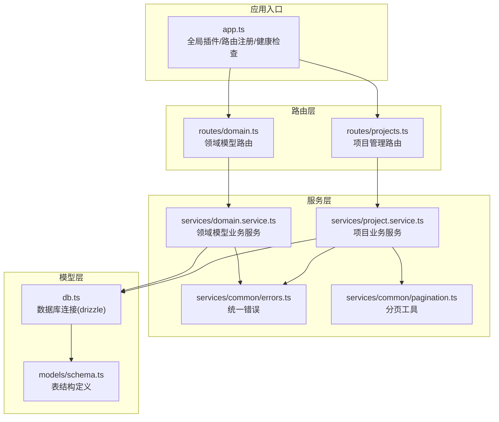
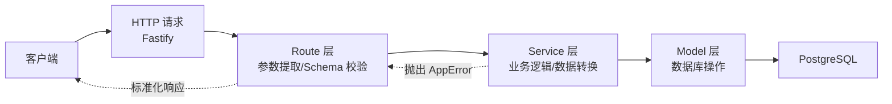
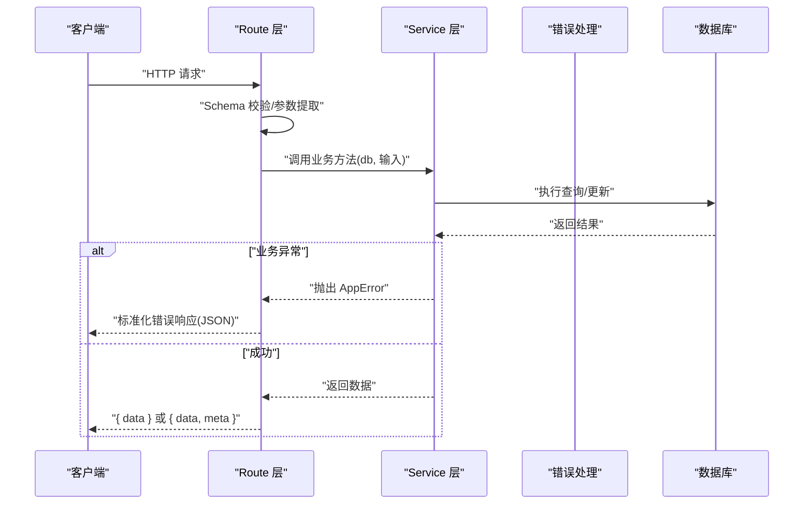
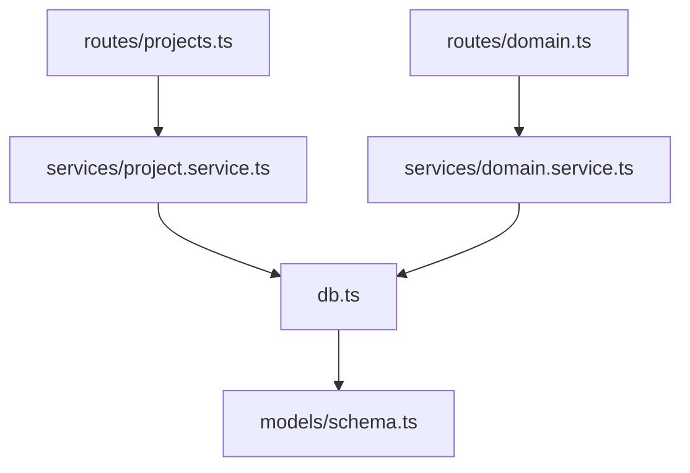

# 分层架构规范

<cite>
**本文引用的文件**
- [packages/api/src/app.ts](file://packages/api/src/app.ts)
- [packages/api/src/routes/projects.ts](file://packages/api/src/routes/projects.ts)
- [packages/api/src/routes/domain.ts](file://packages/api/src/routes/domain.ts)
- [packages/api/src/services/project.service.ts](file://packages/api/src/services/project.service.ts)
- [packages/api/src/services/domain.service.ts](file://packages/api/src/services/domain.service.ts)
- [packages/api/src/services/common/errors.ts](file://packages/api/src/services/common/errors.ts)
- [packages/api/src/services/common/pagination.ts](file://packages/api/src/services/common/pagination.ts)
- [packages/api/src/models/schema.ts](file://packages/api/src/models/schema.ts)
- [packages/api/src/db.ts](file://packages/api/src/db.ts)
</cite>

## 目录
1. [引言](#引言)
2. [项目结构](#项目结构)
3. [核心组件](#核心组件)
4. [架构总览](#架构总览)
5. [详细组件分析](#详细组件分析)
6. [依赖分析](#依赖分析)
7. [性能考量](#性能考量)
8. [故障排查指南](#故障排查指南)
9. [结论](#结论)

## 引言
本规范面向 AI 原型管理系统后端，明确三层架构的设计理念与职责边界：
- Route 层：负责 HTTP 协议适配、参数提取、请求校验与响应封装，严格遵循“只做适配，不做业务”。
- Service 层：负责业务逻辑实现、数据转换与跨表聚合，提供纯函数风格的可测试接口。
- Model 层：负责数据库操作与表结构定义，屏蔽底层 ORM/SQL 细节。

并确立严格的单向调用链：Route → Service → Model。任何反向或横向耦合均视为违规，以确保可测试性、可维护性与可扩展性。

## 项目结构
后端位于 packages/api，采用按层分包的组织方式：
- app.ts：应用入口与全局插件注册（CORS、Swagger、OpenAPI 文档、全局错误处理、健康检查、路由注册点）
- routes/*：各模块路由插件，定义 HTTP 接口、请求/响应 Schema、调用对应 Service
- services/*：业务服务层，实现具体业务规则与数据转换
- models/schema.ts：数据库表结构定义
- db.ts：数据库连接与 drizzle 初始化

图表来源
- [packages/api/src/app.ts:137-162](file://packages/api/src/app.ts#L137-L162)
- [packages/api/src/routes/projects.ts:30-132](file://packages/api/src/routes/projects.ts#L30-L132)
- [packages/api/src/routes/domain.ts:38-498](file://packages/api/src/routes/domain.ts#L38-L498)
- [packages/api/src/services/project.service.ts:108-173](file://packages/api/src/services/project.service.ts#L108-L173)
- [packages/api/src/services/domain.service.ts:1-50](file://packages/api/src/services/domain.service.ts#L1-L50)
- [packages/api/src/db.ts:19](file://packages/api/src/db.ts#L19)
- [packages/api/src/models/schema.ts:6](file://packages/api/src/models/schema.ts#L6)

章节来源
- [packages/api/src/app.ts:137-162](file://packages/api/src/app.ts#L137-L162)
- [packages/api/src/routes/projects.ts:30-132](file://packages/api/src/routes/projects.ts#L30-L132)
- [packages/api/src/routes/domain.ts:38-498](file://packages/api/src/routes/domain.ts#L38-L498)
- [packages/api/src/services/project.service.ts:108-173](file://packages/api/src/services/project.service.ts#L108-L173)
- [packages/api/src/services/domain.service.ts:1-50](file://packages/api/src/services/domain.service.ts#L1-L50)
- [packages/api/src/db.ts:19](file://packages/api/src/db.ts#L19)
- [packages/api/src/models/schema.ts:6](file://packages/api/src/models/schema.ts#L6)

## 核心组件
- 应用入口与全局治理
  - 全局 CORS、Swagger/OpenAPI 文档、Scalar UI、健康检查、全局错误处理器、请求日志钩子、路由注册点
- 路由层（Route）
  - 以 Fastify 插件形式组织，每个模块路由文件导出异步函数，内部注册 HTTP 方法与 Schema，并调用对应 Service
  - 严格只做参数提取、Schema 校验、调用 Service、组装响应
- 服务层（Service）
  - 纯函数风格，db 作为首参，集中实现业务规则、数据转换、并发控制（如乐观锁）、跨表聚合
  - 提供统一错误工厂与分页工具
- 模型层（Model）
  - drizzle-orm 表定义，约束字段、索引、外键与默认值
  - db.ts 提供 drizzle 实例与迁移专用连接

章节来源
- [packages/api/src/app.ts:16-131](file://packages/api/src/app.ts#L16-L131)
- [packages/api/src/routes/projects.ts:30-132](file://packages/api/src/routes/projects.ts#L30-L132)
- [packages/api/src/services/project.service.ts:108-173](file://packages/api/src/services/project.service.ts#L108-L173)
- [packages/api/src/services/common/errors.ts:32-57](file://packages/api/src/services/common/errors.ts#L32-L57)
- [packages/api/src/services/common/pagination.ts:27-49](file://packages/api/src/services/common/pagination.ts#L27-L49)
- [packages/api/src/models/schema.ts:6](file://packages/api/src/models/schema.ts#L6)
- [packages/api/src/db.ts:19](file://packages/api/src/db.ts#L19)

## 架构总览
三层架构的调用链与职责边界如下：

图表来源
- [packages/api/src/app.ts:74-99](file://packages/api/src/app.ts#L74-L99)
- [packages/api/src/routes/projects.ts:138-195](file://packages/api/src/routes/projects.ts#L138-L195)
- [packages/api/src/services/project.service.ts:108-173](file://packages/api/src/services/project.service.ts#L108-L173)
- [packages/api/src/db.ts:19](file://packages/api/src/db.ts#L19)

## 详细组件分析

### Route 层：HTTP 适配与参数提取
- 职责
  - 定义路由前缀与 HTTP 方法
  - 使用 TypeBox Schema 进行请求/响应校验与 OpenAPI 文档生成
  - 从 request 中提取 params/query/body
  - 调用对应 Service 并组装标准化响应
- 禁止事项
  - 不直接进行数据库操作
  - 不包含业务规则判断
  - 不自行构造复杂数据转换
- 示例路径
  - 项目列表：[packages/api/src/routes/projects.ts:32-44](file://packages/api/src/routes/projects.ts#L32-L44)，参数提取与调用 Service：[packages/api/src/routes/projects.ts:138-150](file://packages/api/src/routes/projects.ts#L138-L150)
  - 领域实体列表：[packages/api/src/routes/domain.ts:44-62](file://packages/api/src/routes/domain.ts#L44-L62)，参数提取与调用 Service：[packages/api/src/routes/domain.ts:52-61](file://packages/api/src/routes/domain.ts#L52-L61)

章节来源
- [packages/api/src/routes/projects.ts:32-44](file://packages/api/src/routes/projects.ts#L32-L44)
- [packages/api/src/routes/projects.ts:138-150](file://packages/api/src/routes/projects.ts#L138-L150)
- [packages/api/src/routes/domain.ts:44-62](file://packages/api/src/routes/domain.ts#L44-L62)
- [packages/api/src/routes/domain.ts:52-61](file://packages/api/src/routes/domain.ts#L52-L61)

### Service 层：业务逻辑与数据转换
- 职责
  - 实现业务规则（如唯一性、乐观锁、状态机）
  - 跨表聚合与并行查询优化
  - 数据映射（toXxxRow → Domain Object）
  - 统一错误抛出与分页元数据构建
- 禁止事项
  - 不直接处理 HTTP 请求/响应
  - 不直接访问数据库（通过 db 首参）
- 示例路径
  - 项目列表聚合与并行查询：[packages/api/src/services/project.service.ts:108-173](file://packages/api/src/services/project.service.ts#L108-L173)
  - 项目摘要统计并行查询：[packages/api/src/services/project.service.ts:198-255](file://packages/api/src/services/project.service.ts#L198-L255)
  - 乐观锁与唯一性校验：[packages/api/src/services/project.service.ts:266-312](file://packages/api/src/services/project.service.ts#L266-L312)，[packages/api/src/services/project.service.ts:357-386](file://packages/api/src/services/project.service.ts#L357-L386)
  - 错误工厂：[packages/api/src/services/common/errors.ts:32-57](file://packages/api/src/services/common/errors.ts#L32-L57)
  - 分页工具：[packages/api/src/services/common/pagination.ts:27-49](file://packages/api/src/services/common/pagination.ts#L27-L49)

章节来源
- [packages/api/src/services/project.service.ts:108-173](file://packages/api/src/services/project.service.ts#L108-L173)
- [packages/api/src/services/project.service.ts:198-255](file://packages/api/src/services/project.service.ts#L198-L255)
- [packages/api/src/services/project.service.ts:266-312](file://packages/api/src/services/project.service.ts#L266-L312)
- [packages/api/src/services/project.service.ts:357-386](file://packages/api/src/services/project.service.ts#L357-L386)
- [packages/api/src/services/common/errors.ts:32-57](file://packages/api/src/services/common/errors.ts#L32-L57)
- [packages/api/src/services/common/pagination.ts:27-49](file://packages/api/src/services/common/pagination.ts#L27-L49)

### Model 层：数据库操作与表结构
- 职责
  - 定义表结构、索引、外键与默认值
  - 通过 drizzle-orm 提供类型安全的查询与写入
- 禁止事项
  - 不包含业务规则
  - 不处理 HTTP 协议
- 示例路径
  - 项目表定义（含唯一约束、默认值、时间戳）：[packages/api/src/models/schema.ts:6](file://packages/api/src/models/schema.ts#L6)
  - drizzle 初始化与类型导出：[packages/api/src/db.ts:19](file://packages/api/src/db.ts#L19)

章节来源
- [packages/api/src/models/schema.ts:6](file://packages/api/src/models/schema.ts#L6)
- [packages/api/src/db.ts:19](file://packages/api/src/db.ts#L19)

### 错误处理与响应标准化
- 全局错误处理
  - app.ts 中统一捕获错误，区分业务错误与未预期异常，返回标准化 JSON
- 服务层错误抛出
  - 使用 AppError 工厂方法，携带 HTTP 状态码与业务错误码
- 响应组装
  - Route 层负责将 Service 返回的数据包装为 { data } 或 { data, meta }，并设置 HTTP 状态码

图表来源
- [packages/api/src/app.ts:74-99](file://packages/api/src/app.ts#L74-L99)
- [packages/api/src/services/common/errors.ts:32-57](file://packages/api/src/services/common/errors.ts#L32-L57)
- [packages/api/src/routes/projects.ts:138-150](file://packages/api/src/routes/projects.ts#L138-L150)

章节来源
- [packages/api/src/app.ts:74-99](file://packages/api/src/app.ts#L74-L99)
- [packages/api/src/services/common/errors.ts:32-57](file://packages/api/src/services/common/errors.ts#L32-L57)
- [packages/api/src/routes/projects.ts:138-150](file://packages/api/src/routes/projects.ts#L138-L150)

### 调用规则与禁止事项
- 调用规则
  - Route → Service：Route 仅负责参数与响应，调用 Service
  - Service → Model：Service 通过 db 首参访问 Model
  - 禁止反向调用与横向耦合
- 违规示例（禁止）
  - Route 直接访问数据库
  - Service 直接处理 HTTP 请求/响应
  - Service 之间互相调用（应通过共享工具或上层 Route 调用）

章节来源
- [packages/api/src/routes/projects.ts:138-195](file://packages/api/src/routes/projects.ts#L138-L195)
- [packages/api/src/services/project.service.ts:108-173](file://packages/api/src/services/project.service.ts#L108-L173)

### 参数传递、错误传播与响应组装示例路径
- 参数传递
  - Route 从 request.query/request.params/request.body 提取参数，传给 Service
  - 示例：[packages/api/src/routes/projects.ts:138-150](file://packages/api/src/routes/projects.ts#L138-L150)
- 错误传播
  - Service 抛出 AppError，Route/全局中间件捕获并标准化
  - 示例：全局错误处理与错误工厂
    - [packages/api/src/app.ts:74-99](file://packages/api/src/app.ts#L74-L99)
    - [packages/api/src/services/common/errors.ts:32-57](file://packages/api/src/services/common/errors.ts#L32-L57)
- 响应组装
  - Route 根据业务设置状态码并返回 { data }/{ data, meta }
  - 示例：[packages/api/src/routes/projects.ts:152-159](file://packages/api/src/routes/projects.ts#L152-L159)

章节来源
- [packages/api/src/routes/projects.ts:138-159](file://packages/api/src/routes/projects.ts#L138-L159)
- [packages/api/src/app.ts:74-99](file://packages/api/src/app.ts#L74-L99)
- [packages/api/src/services/common/errors.ts:32-57](file://packages/api/src/services/common/errors.ts#L32-L57)

## 依赖分析
- 路由到服务
  - 项目路由 → 项目服务：[packages/api/src/routes/projects.ts:10](file://packages/api/src/routes/projects.ts#L10)
  - 领域路由 → 领域服务：[packages/api/src/routes/domain.ts:15](file://packages/api/src/routes/domain.ts#L15)
- 服务到模型
  - 项目服务使用 drizzle 表与工具：[packages/api/src/services/project.service.ts:11](file://packages/api/src/services/project.service.ts#L11)
  - 领域服务使用 drizzle 表与工具：[packages/api/src/services/domain.service.ts:1-50](file://packages/api/src/services/domain.service.ts#L1-L50)
- 数据库连接
  - drizzle 初始化与类型导出：[packages/api/src/db.ts:19](file://packages/api/src/db.ts#L19)
  - 表结构定义：[packages/api/src/models/schema.ts:6](file://packages/api/src/models/schema.ts#L6)

图表来源
- [packages/api/src/routes/projects.ts:10](file://packages/api/src/routes/projects.ts#L10)
- [packages/api/src/routes/domain.ts:15](file://packages/api/src/routes/domain.ts#L15)
- [packages/api/src/services/project.service.ts:11](file://packages/api/src/services/project.service.ts#L11)
- [packages/api/src/services/domain.service.ts:1-50](file://packages/api/src/services/domain.service.ts#L1-L50)
- [packages/api/src/db.ts:19](file://packages/api/src/db.ts#L19)
- [packages/api/src/models/schema.ts:6](file://packages/api/src/models/schema.ts#L6)

章节来源
- [packages/api/src/routes/projects.ts:10](file://packages/api/src/routes/projects.ts#L10)
- [packages/api/src/routes/domain.ts:15](file://packages/api/src/routes/domain.ts#L15)
- [packages/api/src/services/project.service.ts:11](file://packages/api/src/services/project.service.ts#L11)
- [packages/api/src/services/domain.service.ts:1-50](file://packages/api/src/services/domain.service.ts#L1-L50)
- [packages/api/src/db.ts:19](file://packages/api/src/db.ts#L19)
- [packages/api/src/models/schema.ts:6](file://packages/api/src/models/schema.ts#L6)

## 性能考量
- 并行查询
  - 列表聚合与摘要统计中使用 Promise.all 并行执行多个 COUNT 查询，降低 RTT
  - 示例：项目列表内嵌统计并行查询、项目摘要统计并行查询
- 排序与过滤白名单
  - 排序字段白名单映射，防止 SQL 注入并保证索引命中
- 分页边界保护
  - parsePagination 对 page/pageSize 进行边界保护与默认值处理，避免越界请求
- 乐观锁
  - 通过 version 字段实现并发安全，减少锁粒度与冲突概率

章节来源
- [packages/api/src/services/project.service.ts:139-172](file://packages/api/src/services/project.service.ts#L139-L172)
- [packages/api/src/services/project.service.ts:199-254](file://packages/api/src/services/project.service.ts#L199-L254)
- [packages/api/src/services/project.service.ts:37-41](file://packages/api/src/services/project.service.ts#L37-L41)
- [packages/api/src/services/common/pagination.ts:27-39](file://packages/api/src/services/common/pagination.ts#L27-L39)

## 故障排查指南
- 常见错误类型
  - 400/422：参数校验失败或业务规则不满足（如名称冲突、状态重复设置）
  - 404：资源不存在
  - 409：冲突（如乐观锁版本不匹配）
  - 500：未预期异常（全局中间件统一返回）
- 定位步骤
  - 查看全局错误处理器是否捕获到 AppError
  - 检查 Service 是否正确抛出错误码与消息
  - 核对 Route 是否正确设置状态码与响应结构
- 相关路径
  - 全局错误处理：[packages/api/src/app.ts:74-99](file://packages/api/src/app.ts#L74-L99)
  - 错误工厂：[packages/api/src/services/common/errors.ts:32-57](file://packages/api/src/services/common/errors.ts#L32-L57)

章节来源
- [packages/api/src/app.ts:74-99](file://packages/api/src/app.ts#L74-L99)
- [packages/api/src/services/common/errors.ts:32-57](file://packages/api/src/services/common/errors.ts#L32-L57)

## 结论
本规范通过清晰的三层职责划分与严格的单向调用链，实现了高内聚、低耦合的后端架构。Route 层专注协议与契约，Service 层专注业务与数据，Model 层专注存储与结构，配合统一错误与分页工具，显著提升了系统的可测试性、可维护性与可扩展性。未来可在现有基础上引入领域事件、缓存与审计日志等机制，进一步增强可观测性与扩展能力。