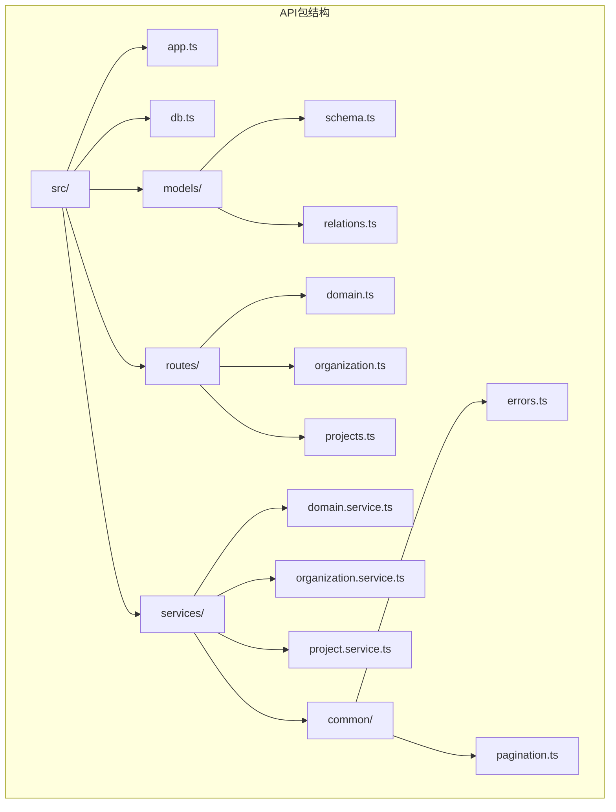
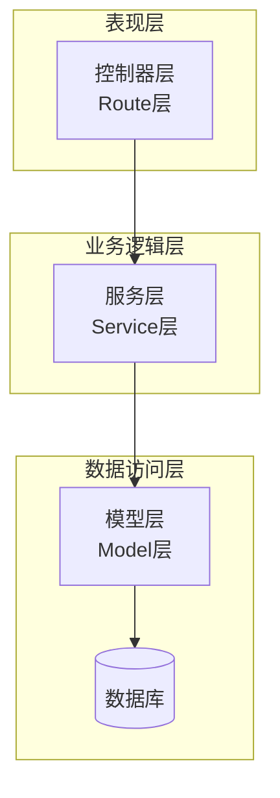
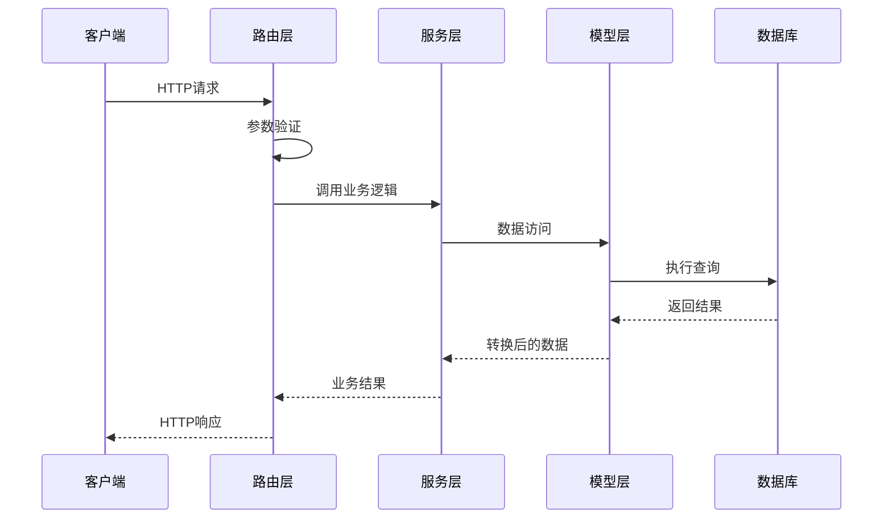
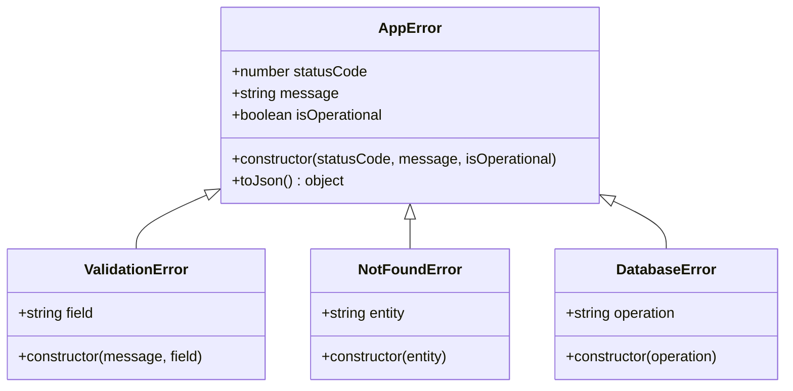
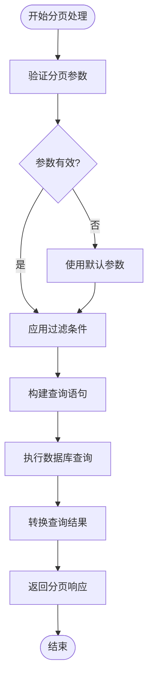
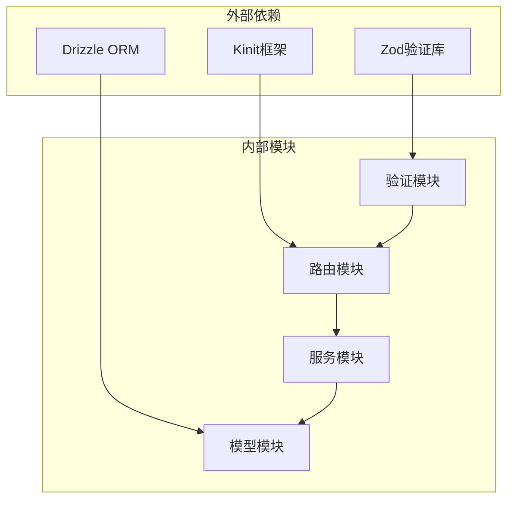

我需要分析AI原型管理系统的后端编码规范。根据项目结构，我可以看到这是一个使用TypeScript和Drizzle ORM的API项目。让我查看关键的源代码文件来了解架构设计。

**图表来源**
- [packages/api/src/app.ts](file://packages/api/src/app.ts)
- [packages/api/src/db.ts](file://packages/api/src/db.ts)
- [packages/api/src/models/schema.ts](file://packages/api/src/models/schema.ts)
- [packages/api/src/models/relations.ts](file://packages/api/src/models/relations.ts)
- [packages/api/src/routes/domain.ts](file://packages/api/src/routes/domain.ts)
- [packages/api/src/routes/organization.ts](file://packages/api/src/routes/organization.ts)
- [packages/api/src/routes/projects.ts](file://packages/api/src/routes/projects.ts)
- [packages/api/src/services/domain.service.ts](file://packages/api/src/services/domain.service.ts)
- [packages/api/src/services/organization.service.ts](file://packages/api/src/services/organization.service.ts)
- [packages/api/src/services/project.service.ts](file://packages/api/src/services/project.service.ts)
- [packages/api/src/services/common/errors.ts](file://packages/api/src/services/common/errors.ts)
- [packages/api/src/services/common/pagination.ts](file://packages/api/src/services/common/pagination.ts)

现在让我查看核心文件来了解编码规范：

**章节来源**
- [packages/api/src/app.ts](file://packages/api/src/app.ts)
- [packages/api/src/db.ts](file://packages/api/src/db.ts)
- [packages/api/src/models/schema.ts](file://packages/api/src/models/schema.ts)
- [packages/api/src/models/relations.ts](file://packages/api/src/models/relations.ts)

## 项目结构

AI原型管理系统采用分层架构设计，主要包含以下层次：

**图表来源**
- [packages/api/src/app.ts](file://packages/api/src/app.ts)
- [packages/api/src/services/domain.service.ts](file://packages/api/src/services/domain.service.ts)
- [packages/api/src/models/schema.ts](file://packages/api/src/models/schema.ts)

## 核心组件

### 路由层（Route层）职责

路由层负责HTTP请求的接收和响应处理，遵循以下规范：

- **文件命名规范**：使用小写文件名，如 `domain.ts`、`organization.ts`
- **处理器模板**：每个路由文件包含标准的CRUD操作处理器
- **参数提取**：严格从URL参数、查询参数和请求体中提取数据
- **预验证中间件**：在处理前进行参数验证

**章节来源**
- [packages/api/src/routes/domain.ts](file://packages/api/src/routes/domain.ts)
- [packages/api/src/routes/organization.ts](file://packages/api/src/routes/organization.ts)
- [packages/api/src/routes/projects.ts](file://packages/api/src/routes/projects.ts)

### 服务层（Service层）职责

服务层是业务逻辑的核心，采用纯函数风格：

- **纯函数约束**：所有服务方法都是纯函数，无状态且可测试
- **数据转换**：DB行到API响应的转换规则
- **错误处理**：使用AppError类体系
- **事务管理**：在必要时使用数据库事务

**章节来源**
- [packages/api/src/services/domain.service.ts](file://packages/api/src/services/domain.service.ts)
- [packages/api/src/services/organization.service.ts](file://packages/api/src/services/organization.service.ts)
- [packages/api/src/services/project.service.ts](file://packages/api/src/services/project.service.ts)

### 模型层（Model层）职责

模型层基于Drizzle ORM，负责数据持久化：

- **Schema定义**：表结构定义和字段约束
- **关系定义**：实体间关系映射
- **查询模式**：常用查询操作模式
- **迁移管理**：数据库结构变更

**章节来源**
- [packages/api/src/models/schema.ts](file://packages/api/src/models/schema.ts)
- [packages/api/src/models/relations.ts](file://packages/api/src/models/relations.ts)
- [packages/api/src/db.ts](file://packages/api/src/db.ts)

## 架构概览

系统采用经典的三层架构，各层职责清晰分离：

**图表来源**
- [packages/api/src/app.ts](file://packages/api/src/app.ts)
- [packages/api/src/services/common/errors.ts](file://packages/api/src/services/common/errors.ts)

## 详细组件分析

### 错误处理体系（AppError）

系统实现了完整的错误处理机制：

**图表来源**
- [packages/api/src/services/common/errors.ts](file://packages/api/src/services/common/errors.ts)

**章节来源**
- [packages/api/src/services/common/errors.ts](file://packages/api/src/services/common/errors.ts)

### 数据库Schema定义规范

Drizzle ORM的Schema定义遵循以下规范：

- **表命名**：使用复数形式，如 `users`、`projects`
- **字段命名**：使用下划线分隔，如 `created_at`、`updated_at`
- **主键约束**：使用 `id` 字段作为主键
- **时间戳**：自动管理 `created_at` 和 `updated_at`

**章节来源**
- [packages/api/src/models/schema.ts](file://packages/api/src/models/schema.ts)

### 分页处理规范

服务层提供了标准的分页处理机制：

**图表来源**
- [packages/api/src/services/common/pagination.ts](file://packages/api/src/services/common/pagination.ts)

**章节来源**
- [packages/api/src/services/common/pagination.ts](file://packages/api/src/services/common/pagination.ts)

## 依赖分析

系统依赖关系清晰，遵循依赖倒置原则：

**图表来源**
- [packages/api/src/app.ts](file://packages/api/src/app.ts)
- [packages/api/src/models/schema.ts](file://packages/api/src/models/schema.ts)

**章节来源**
- [packages/api/src/app.ts](file://packages/api/src/app.ts)
- [packages/api/src/db.ts](file://packages/api/src/db.ts)

## 性能考虑

- **查询优化**：使用索引和适当的WHERE条件
- **连接池**：配置合适的数据库连接池大小
- **缓存策略**：对频繁访问的数据实施缓存
- **批量操作**：减少数据库往返次数

## 故障排除指南

### 常见问题及解决方案

1. **数据库连接失败**
   - 检查环境变量配置
   - 验证数据库服务状态
   - 确认连接字符串格式

2. **Schema验证错误**
   - 查看具体字段错误信息
   - 验证输入数据格式
   - 检查约束条件

3. **服务层异常**
   - 查看AppError堆栈信息
   - 确认业务逻辑正确性
   - 检查数据库事务状态

**章节来源**
- [packages/api/src/services/common/errors.ts](file://packages/api/src/services/common/errors.ts)

## 结论

本编码规范为AI原型管理系统提供了完整的后端开发指导，通过明确的分层架构设计和严格的代码规范，确保了系统的可维护性和可扩展性。开发者应严格遵循本文档的各项要求，以保证代码质量和团队协作效率。

