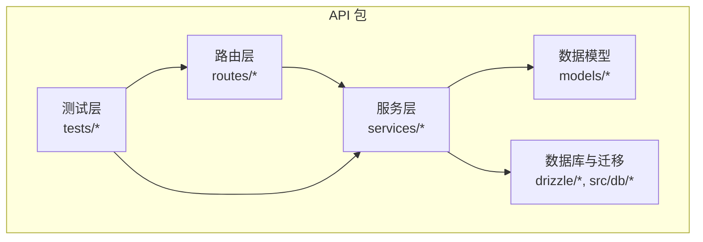
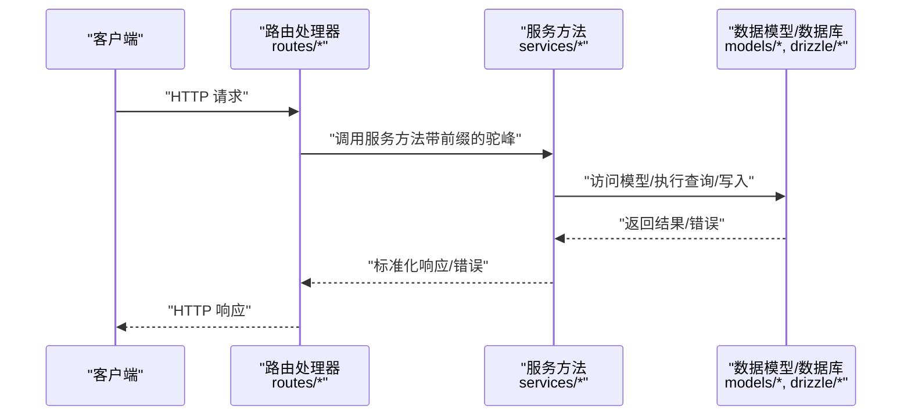
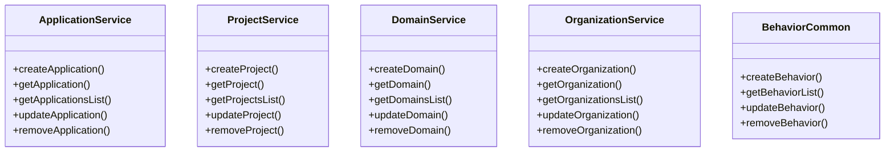
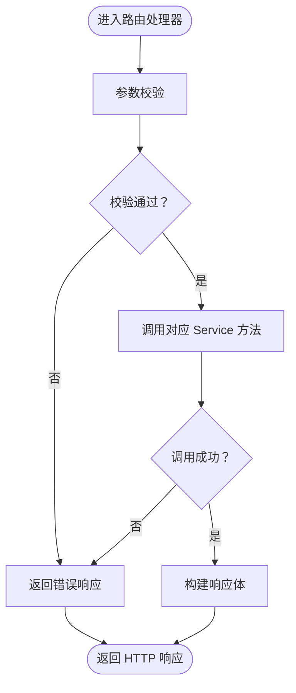
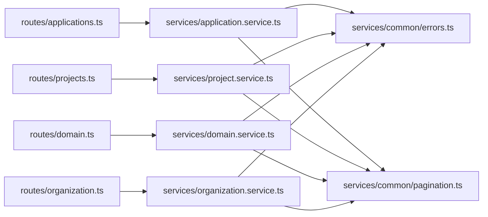

# 命名约定

<cite>
**本文引用的文件**
- [coding-convention-backend.md](file://docs/04-tech-design/coding-convention-backend.md)
- [application.service.ts](file://packages/api/src/services/application.service.ts)
- [project.service.ts](file://packages/api/src/services/project.service.ts)
- [domain.service.ts](file://packages/api/src/services/domain.service.ts)
- [organization.service.ts](file://packages/api/src/services/organization.service.ts)
- [behavior-common.ts](file://packages/api/src/services/behavior-common.ts)
- [applications.ts](file://packages/api/src/routes/applications.ts)
- [projects.ts](file://packages/api/src/routes/projects.ts)
- [domain.ts](file://packages/api/src/routes/domain.ts)
- [organization.ts](file://packages/api/src/routes/organization.ts)
- [application-behavior.service.ts](file://packages/api/src/services/application-behavior.service.ts)
- [external-entity-behavior.service.ts](file://packages/api/src/services/external-entity-behavior.service.ts)
- [role-behavior.service.ts](file://packages/api/src/services/role-behavior.service.ts)
- [application-behavior.ts](file://packages/api/src/routes/application-behavior.ts)
- [external-entity-behavior.ts](file://packages/api/src/routes/external-entity-behavior.ts)
- [role-behavior.ts](file://packages/api/src/routes/role-behavior.ts)
- [schema.ts](file://packages/api/src/models/schema.ts)
- [relations.ts](file://packages/api/src/models/relations.ts)
- [errors.ts](file://packages/api/src/services/common/errors.ts)
- [pagination.ts](file://packages/api/src/services/common/pagination.ts)
- [index.ts](file://packages/api/src/services/common/index.ts)
- [app.ts](file://packages/api/src/app.ts)
- [db.ts](file://packages/api/src/db.ts)
- [migrate-cardinality.ts](file://packages/api/src/db/migrate-cardinality.ts)
- [config.ts](file://packages/api/drizzle/config.ts)
- [f-m1-02-create.test.ts](file://packages/api/tests/project-management/f-m1-02-create.test.ts)
- [f-m1-03-detail.test.ts](file://packages/api/tests/project-management/f-m1-03-detail.test.ts)
- [f-m1-04-edit.test.ts](file://packages/api/tests/project-management/f-m1-04-edit.test.ts)
- [f-m1-05-archive.test.ts](file://packages/api/tests/project-management/f-m1-05-archive.test.ts)
- [f-m1-12-role-behavior.test.ts](file://packages/api/tests/project-management/f-m1-12-role-behavior.test.ts)
- [f-m1-13-external-entity-behavior.test.ts](file://packages/api/tests/project-management/f-m1-13-external-entity-behavior.test.ts)
</cite>

## 目录
1. [引言](#引言)
2. [项目结构](#项目结构)
3. [核心组件](#核心组件)
4. [架构总览](#架构总览)
5. [详细组件分析](#详细组件分析)
6. [依赖关系分析](#依赖关系分析)
7. [性能考量](#性能考量)
8. [故障排查指南](#故障排查指南)
9. [结论](#结论)
10. [附录](#附录)

## 引言
本文件系统化阐述 AI 原型管理系统后端的命名约定，覆盖文件命名、函数与变量命名、Service 命名模式矩阵（含 CRUD 标准命名与返回值约定），并提供正反示例对比，帮助团队在不同模块间保持一致、清晰且可读的命名风格。

## 项目结构
后端位于 packages/api，采用按功能域分层的组织方式：路由层（routes）、服务层（services）、数据模型（models）、数据库迁移与配置（drizzle）以及测试用例（tests）。该结构为统一命名约定提供了天然边界与上下文。

**章节来源**
- [app.ts:1-50](file://packages/api/src/app.ts#L1-L50)
- [db.ts:1-50](file://packages/api/src/db.ts#L1-L50)

## 核心组件
本节总结后端命名约定的核心要点，便于快速查阅与对照：

- 文件命名
  - Service 文件：kebab-case + .service.ts（如 application.service.ts）
  - 路由文件：kebab-case + .ts（如 projects.ts）
  - 模型/工具文件：kebab-case 或小驼峰（如 schema.ts、relations.ts、errors.ts、pagination.ts）
  - 公共入口：index.ts（如 services/common/index.ts）

- 函数命名
  - Service 方法：小驼峰 + 前缀模式（如 createXxx、getXxxList、updateXxx、removeXxx）
  - Handler（路由处理器）：小驼峰 + Handler 后缀（如 getProjectsHandler）
  - 内部函数：小驼峰，内部逻辑使用下划线前缀（如 _validateInput、_buildQuery）

- 变量与常量
  - 变量：小驼峰（如 projectId、requestBody）
  - 常量：UPPER_SNAKE_CASE（如 MAX_RETRY、DEFAULT_PAGE_SIZE）
  - 描述性命名：优先使用语义明确的名称（如 entityBehavior、domainConfig）

- 返回值约定
  - 成功：返回实体对象或列表；失败：抛出错误或返回标准化错误对象
  - 分页场景：返回包含数据与分页信息的对象（如 { items, total, page, pageSize }）

**章节来源**
- [coding-convention-backend.md:1-200](file://docs/04-tech-design/coding-convention-backend.md#L1-L200)
- [application.service.ts:1-200](file://packages/api/src/services/application.service.ts#L1-L200)
- [project.service.ts:1-200](file://packages/api/src/services/project.service.ts#L1-L200)
- [domain.service.ts:1-200](file://packages/api/src/services/domain.service.ts#L1-L200)
- [organization.service.ts:1-200](file://packages/api/src/services/organization.service.ts#L1-L200)

## 架构总览
命名约定贯穿“路由 → 服务 → 数据模型/数据库”的调用链路，确保跨层一致性与可追踪性。

**图示来源**
- [applications.ts:1-200](file://packages/api/src/routes/applications.ts#L1-L200)
- [projects.ts:1-200](file://packages/api/src/routes/projects.ts#L1-L200)
- [domain.ts:1-200](file://packages/api/src/routes/domain.ts#L1-L200)
- [organization.ts:1-200](file://packages/api/src/routes/organization.ts#L1-L200)
- [application.service.ts:1-200](file://packages/api/src/services/application.service.ts#L1-L200)
- [project.service.ts:1-200](file://packages/api/src/services/project.service.ts#L1-L200)
- [domain.service.ts:1-200](file://packages/api/src/services/domain.service.ts#L1-L200)
- [organization.service.ts:1-200](file://packages/api/src/services/organization.service.ts#L1-L200)

## 详细组件分析

### Service 函数命名模式矩阵（CRUD + 返回值约定）
以下矩阵基于现有 Service 文件抽象归纳，适用于各领域实体（如 application、project、domain、organization 等）：

- 创建类
  - 命名：createXxx（如 createApplication、createProject）
  - 返回：返回新创建实体对象；失败时抛错或返回错误对象
  - 示例参考：[application.service.ts:1-200](file://packages/api/src/services/application.service.ts#L1-L200)、[project.service.ts:1-200](file://packages/api/src/services/project.service.ts#L1-L200)

- 查询类
  - 列表：getXxxList（如 getApplications、getProjects）
    - 返回：数组或分页对象（建议包含 total/page/pageSize）
    - 示例参考：[applications.ts:1-200](file://packages/api/src/routes/applications.ts#L1-L200)、[projects.ts:1-200](file://packages/api/src/routes/projects.ts#L1-L200)
  - 单条：getXxx（如 getApplication、getProject）
    - 返回：单个实体对象；未找到返回空或抛错
    - 示例参考：[application.service.ts:1-200](file://packages/api/src/services/application.service.ts#L1-L200)

- 更新类
  - 命名：updateXxx（如 updateApplication、updateProject）
  - 返回：返回更新后的实体对象；失败时抛错或返回错误对象
  - 示例参考：[project.service.ts:1-200](file://packages/api/src/services/project.service.ts#L1-L200)

- 删除类
  - 命名：removeXxx（如 removeApplication、removeProject）
  - 返回：返回删除状态或布尔值；失败时抛错或返回错误对象
  - 示例参考：[application.service.ts:1-200](file://packages/api/src/services/application.service.ts#L1-L200)

- 行为类（application-behavior、external-entity-behavior、role-behavior）
  - 命名：遵循与实体一致的 CRUD 前缀，结合行为语义（如 createBehavior、getBehaviorList）
  - 返回：行为相关实体或列表；失败时抛错或返回错误对象
  - 示例参考：[application-behavior.service.ts:1-200](file://packages/api/src/services/application-behavior.service.ts#L1-L200)、[external-entity-behavior.service.ts:1-200](file://packages/api/src/services/external-entity-behavior.service.ts#L1-L200)、[role-behavior.service.ts:1-200](file://packages/api/src/services/role-behavior.service.ts#L1-L200)

- 通用工具与错误
  - 命名：errors.ts（错误定义）、pagination.ts（分页工具）、index.ts（聚合导出）
  - 常量：使用 UPPER_SNAKE_CASE（如 DEFAULT_PAGE_SIZE、MAX_RETRY）
  - 示例参考：[errors.ts:1-200](file://packages/api/src/services/common/errors.ts#L1-L200)、[pagination.ts:1-200](file://packages/api/src/services/common/pagination.ts#L1-L200)、[index.ts:1-200](file://packages/api/src/services/common/index.ts#L1-L200)

**图示来源**
- [application.service.ts:1-200](file://packages/api/src/services/application.service.ts#L1-L200)
- [project.service.ts:1-200](file://packages/api/src/services/project.service.ts#L1-L200)
- [domain.service.ts:1-200](file://packages/api/src/services/domain.service.ts#L1-L200)
- [organization.service.ts:1-200](file://packages/api/src/services/organization.service.ts#L1-L200)
- [behavior-common.ts:1-200](file://packages/api/src/services/behavior-common.ts#L1-L200)

**章节来源**
- [application.service.ts:1-200](file://packages/api/src/services/application.service.ts#L1-L200)
- [project.service.ts:1-200](file://packages/api/src/services/project.service.ts#L1-L200)
- [domain.service.ts:1-200](file://packages/api/src/services/domain.service.ts#L1-L200)
- [organization.service.ts:1-200](file://packages/api/src/services/organization.service.ts#L1-L200)
- [behavior-common.ts:1-200](file://packages/api/src/services/behavior-common.ts#L1-L200)

### 路由处理器命名与职责
- 命名：小驼峰 + Handler 后缀（如 getProjectsHandler、createProjectHandler）
- 职责：参数校验、调用服务方法、组装响应、错误处理
- 示例参考：[applications.ts:1-200](file://packages/api/src/routes/applications.ts#L1-L200)、[projects.ts:1-200](file://packages/api/src/routes/projects.ts#L1-L200)、[domain.ts:1-200](file://packages/api/src/routes/domain.ts#L1-L200)、[organization.ts:1-200](file://packages/api/src/routes/organization.ts#L1-L200)

**图示来源**
- [applications.ts:1-200](file://packages/api/src/routes/applications.ts#L1-L200)
- [projects.ts:1-200](file://packages/api/src/routes/projects.ts#L1-L200)
- [domain.ts:1-200](file://packages/api/src/routes/domain.ts#L1-L200)
- [organization.ts:1-200](file://packages/api/src/routes/organization.ts#L1-L200)

**章节来源**
- [applications.ts:1-200](file://packages/api/src/routes/applications.ts#L1-L200)
- [projects.ts:1-200](file://packages/api/src/routes/projects.ts#L1-L200)
- [domain.ts:1-200](file://packages/api/src/routes/domain.ts#L1-L200)
- [organization.ts:1-200](file://packages/api/src/routes/organization.ts#L1-L200)

### 数据模型与数据库命名
- 模型文件：kebab-case（如 schema.ts、relations.ts）
- 字段命名：小驼峰（如 projectId、entityName）
- 常量：UPPER_SNAKE_CASE（如 TABLE_PROJECT、COLUMN_NAME）
- 迁移与配置：kebab-case（如 migrate-cardinality.ts、config.ts）
- 示例参考：[schema.ts:1-200](file://packages/api/src/models/schema.ts#L1-L200)、[relations.ts:1-200](file://packages/api/src/models/relations.ts#L1-L200)、[migrate-cardinality.ts:1-200](file://packages/api/src/db/migrate-cardinality.ts#L1-L200)、[config.ts:1-200](file://packages/api/drizzle/config.ts#L1-L200)

**章节来源**
- [schema.ts:1-200](file://packages/api/src/models/schema.ts#L1-L200)
- [relations.ts:1-200](file://packages/api/src/models/relations.ts#L1-L200)
- [migrate-cardinality.ts:1-200](file://packages/api/src/db/migrate-cardinality.ts#L1-L200)
- [config.ts:1-200](file://packages/api/drizzle/config.ts#L1-L200)

### 测试命名与断言
- 测试文件：f-m1-xx-模块.test.ts（如 f-m1-02-create.test.ts）
- 测试函数：describe/it 使用清晰语义（如 describe('创建项目'), it('应返回成功')）
- 断言：优先断言响应码、响应体结构与业务语义
- 示例参考：[f-m1-02-create.test.ts:1-200](file://packages/api/tests/project-management/f-m1-02-create.test.ts#L1-L200)、[f-m1-03-detail.test.ts:1-200](file://packages/api/tests/project-management/f-m1-03-detail.test.ts#L1-L200)、[f-m1-04-edit.test.ts:1-200](file://packages/api/tests/project-management/f-m1-04-edit.test.ts#L1-L200)、[f-m1-05-archive.test.ts:1-200](file://packages/api/tests/project-management/f-m1-05-archive.test.ts#L1-L200)、[f-m1-12-role-behavior.test.ts:1-200](file://packages/api/tests/project-management/f-m1-12-role-behavior.test.ts#L1-L200)、[f-m1-13-external-entity-behavior.test.ts:1-200](file://packages/api/tests/project-management/f-m1-13-external-entity-behavior.test.ts#L1-L200)

**章节来源**
- [f-m1-02-create.test.ts:1-200](file://packages/api/tests/project-management/f-m1-02-create.test.ts#L1-L200)
- [f-m1-03-detail.test.ts:1-200](file://packages/api/tests/project-management/f-m1-03-detail.test.ts#L1-L200)
- [f-m1-04-edit.test.ts:1-200](file://packages/api/tests/project-management/f-m1-04-edit.test.ts#L1-L200)
- [f-m1-05-archive.test.ts:1-200](file://packages/api/tests/project-management/f-m1-05-archive.test.ts#L1-L200)
- [f-m1-12-role-behavior.test.ts:1-200](file://packages/api/tests/project-management/f-m1-12-role-behavior.test.ts#L1-L200)
- [f-m1-13-external-entity-behavior.test.ts:1-200](file://packages/api/tests/project-management/f-m1-13-external-entity-behavior.test.ts#L1-L200)

## 依赖关系分析
命名约定在模块间形成稳定契约，降低耦合度并提升可维护性。

**图示来源**
- [applications.ts:1-200](file://packages/api/src/routes/applications.ts#L1-L200)
- [projects.ts:1-200](file://packages/api/src/routes/projects.ts#L1-L200)
- [domain.ts:1-200](file://packages/api/src/routes/domain.ts#L1-L200)
- [organization.ts:1-200](file://packages/api/src/routes/organization.ts#L1-L200)
- [application.service.ts:1-200](file://packages/api/src/services/application.service.ts#L1-L200)
- [project.service.ts:1-200](file://packages/api/src/services/project.service.ts#L1-L200)
- [domain.service.ts:1-200](file://packages/api/src/services/domain.service.ts#L1-L200)
- [organization.service.ts:1-200](file://packages/api/src/services/organization.service.ts#L1-L200)
- [errors.ts:1-200](file://packages/api/src/services/common/errors.ts#L1-L200)
- [pagination.ts:1-200](file://packages/api/src/services/common/pagination.ts#L1-L200)

**章节来源**
- [applications.ts:1-200](file://packages/api/src/routes/applications.ts#L1-L200)
- [projects.ts:1-200](file://packages/api/src/routes/projects.ts#L1-L200)
- [domain.ts:1-200](file://packages/api/src/routes/domain.ts#L1-L200)
- [organization.ts:1-200](file://packages/api/src/routes/organization.ts#L1-L200)
- [application.service.ts:1-200](file://packages/api/src/services/application.service.ts#L1-L200)
- [project.service.ts:1-200](file://packages/api/src/services/project.service.ts#L1-L200)
- [domain.service.ts:1-200](file://packages/api/src/services/domain.service.ts#L1-L200)
- [organization.service.ts:1-200](file://packages/api/src/services/organization.service.ts#L1-L200)
- [errors.ts:1-200](file://packages/api/src/services/common/errors.ts#L1-L200)
- [pagination.ts:1-200](file://packages/api/src/services/common/pagination.ts#L1-L200)

## 性能考量
- 命名一致性有助于 IDE 自动补全与重构，减少拼写错误导致的运行时开销
- 清晰的函数前缀（create/get/update/remove）便于静态分析与调用链优化
- 统一的错误常量（UPPER_SNAKE_CASE）减少字符串比较成本，提升日志与监控效率

## 故障排查指南
- 命名不一致
  - 症状：路由与服务方法名不匹配、Handler 后缀缺失、内部函数未加下划线前缀
  - 处理：统一为小驼峰 + 前缀 + Handler 后缀；内部函数加下划线前缀
  - 参考：[applications.ts:1-200](file://packages/api/src/routes/applications.ts#L1-L200)、[projects.ts:1-200](file://packages/api/src/routes/projects.ts#L1-L200)

- 返回值不规范
  - 症状：成功/失败返回类型不一致、缺少分页字段
  - 处理：遵循 CRUD 约定；分页场景返回统一结构
  - 参考：[project.service.ts:1-200](file://packages/api/src/services/project.service.ts#L1-L200)、[pagination.ts:1-200](file://packages/api/src/services/common/pagination.ts#L1-L200)

- 常量未使用 UPPER_SNAKE_CASE
  - 症状：常量名混用大小写
  - 处理：改为 UPPER_SNAKE_CASE
  - 参考：[errors.ts:1-200](file://packages/api/src/services/common/errors.ts#L1-L200)

**章节来源**
- [applications.ts:1-200](file://packages/api/src/routes/applications.ts#L1-L200)
- [projects.ts:1-200](file://packages/api/src/routes/projects.ts#L1-L200)
- [project.service.ts:1-200](file://packages/api/src/services/project.service.ts#L1-L200)
- [pagination.ts:1-200](file://packages/api/src/services/common/pagination.ts#L1-L200)
- [errors.ts:1-200](file://packages/api/src/services/common/errors.ts#L1-L200)

## 结论
通过统一的文件命名、函数命名与返回值约定，后端代码在可读性、可维护性与协作效率上得到显著提升。建议在新增模块时严格遵循本文档的命名矩阵与最佳实践，确保代码库长期演进中的稳定性与一致性。

## 附录

### 命名约定速查表
- 文件命名
  - Service：kebab-case + .service.ts（如 application.service.ts）
  - 路由：kebab-case + .ts（如 projects.ts）
  - 模型/工具：kebab-case 或小驼峰（如 schema.ts、errors.ts、pagination.ts）
  - 公共入口：index.ts

- 函数命名
  - Service：createXxx / getXxx / getXxxList / updateXxx / removeXxx
  - Handler：小驼峰 + Handler（如 getProjectsHandler）
  - 内部函数：_lowerCamel（如 _validateInput）

- 变量与常量
  - 变量：lowerCamel（如 projectId）
  - 常量：UPPER_SNAKE_CASE（如 MAX_RETRY）

- 返回值约定
  - 成功：实体对象或列表；失败：错误对象或抛错
  - 分页：统一返回 { items, total, page, pageSize }

**章节来源**
- [coding-convention-backend.md:1-200](file://docs/04-tech-design/coding-convention-backend.md#L1-L200)
- [application.service.ts:1-200](file://packages/api/src/services/application.service.ts#L1-L200)
- [project.service.ts:1-200](file://packages/api/src/services/project.service.ts#L1-L200)
- [domain.service.ts:1-200](file://packages/api/src/services/domain.service.ts#L1-L200)
- [organization.service.ts:1-200](file://packages/api/src/services/organization.service.ts#L1-L200)
- [errors.ts:1-200](file://packages/api/src/services/common/errors.ts#L1-L200)
- [pagination.ts:1-200](file://packages/api/src/services/common/pagination.ts#L1-L200)