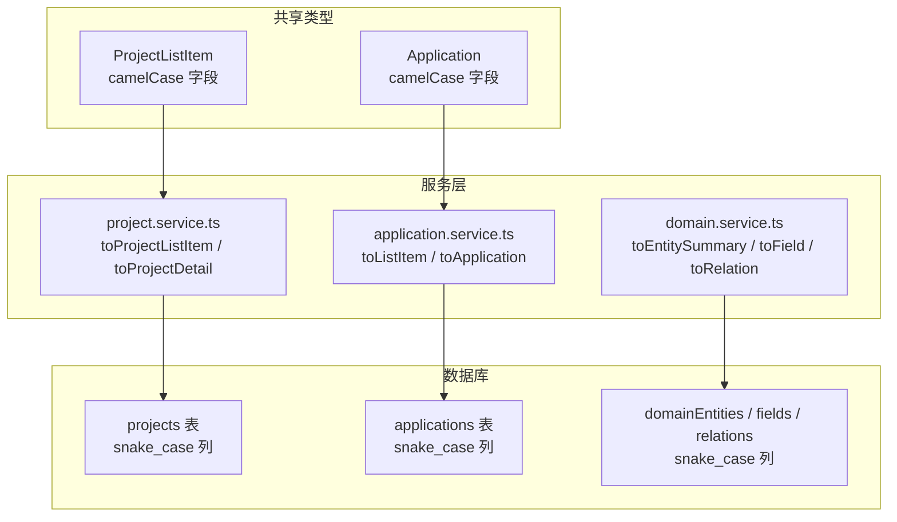
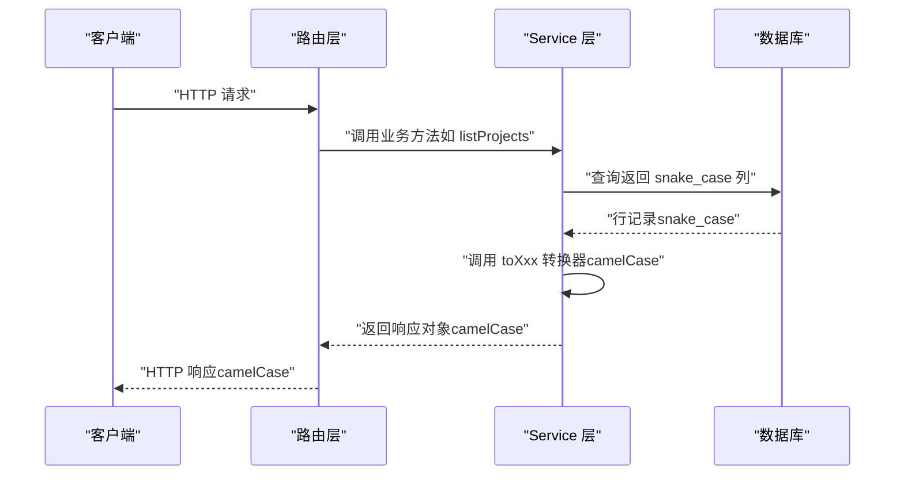
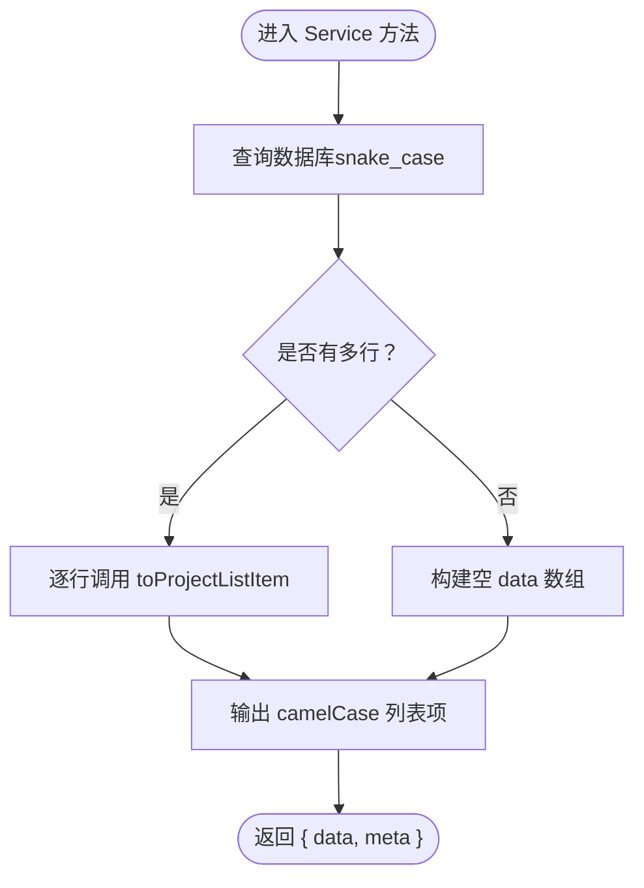
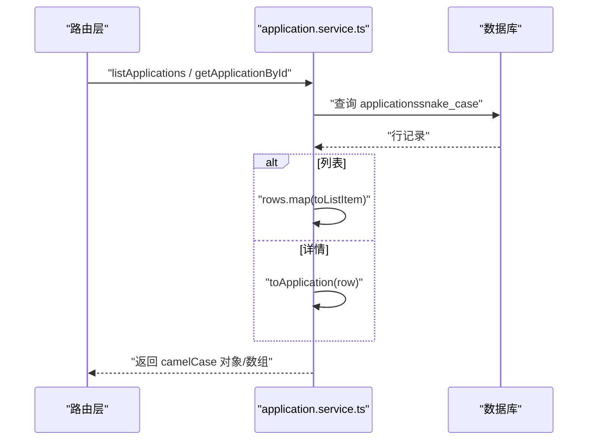
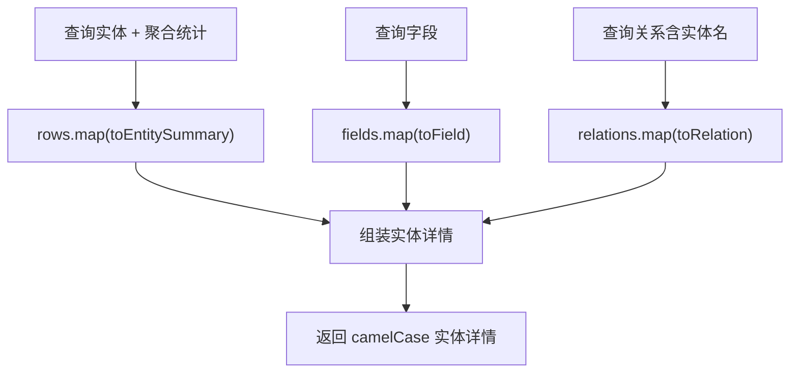
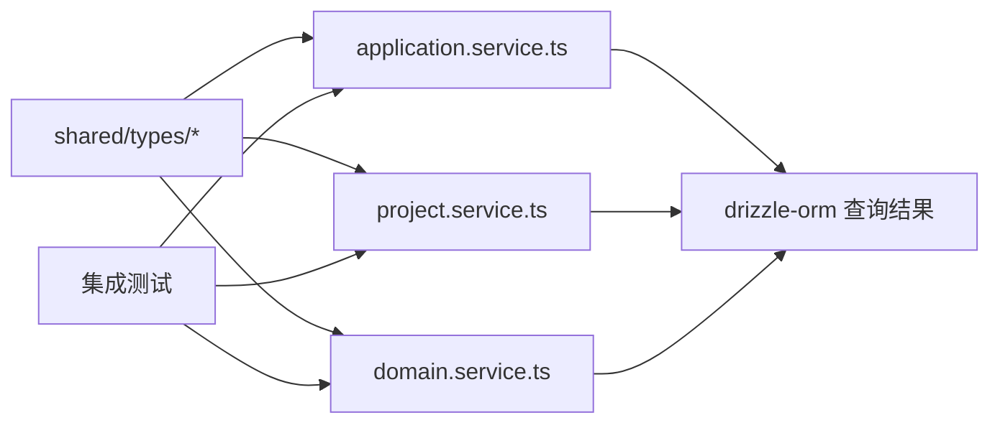

# 数据转换规范

<cite>
**本文引用的文件**
- [coding-convention-backend.md](file://docs/04-tech-design/coding-convention-backend.md)
- [application.service.ts](file://packages/api/src/services/application.service.ts)
- [domain.service.ts](file://packages/api/src/services/domain.service.ts)
- [project.service.ts](file://packages/api/src/services/project.service.ts)
- [project.ts](file://packages/shared/src/types/project.ts)
- [application.ts](file://packages/shared/src/types/application.ts)
- [f-m1-03-detail.test.ts](file://packages/api/tests/project-management/f-m1-03-detail.test.ts)
- [f-m1-11-application.test.ts](file://packages/api/tests/project-management/f-m1-11-application.test.ts)
</cite>

## 目录
1. [简介](#简介)
2. [项目结构](#项目结构)
3. [核心组件](#核心组件)
4. [架构总览](#架构总览)
5. [详细组件分析](#详细组件分析)
6. [依赖分析](#依赖分析)
7. [性能考虑](#性能考虑)
8. [故障排查指南](#故障排查指南)
9. [结论](#结论)

## 简介
本规范系统性阐述 AI 原型管理系统中的数据转换规则，重点说明数据库列名采用 snake_case、API 响应采用 camelCase 的约定，以及在 Service 层统一执行转换的工程实践。文档围绕 toProjectListItem、toProjectDetail 等转换函数的实现模式，给出单对象与批量转换的最佳实践，并解释转换时机与收益（避免重复转换、保持一致性）。

## 项目结构
- 规范来源：后端编码约定文档明确“数据库列名 snake_case ↔ API 响应 camelCase”的转换原则与落地位置（Service 层）。
- 类型契约：共享类型包提供前端期望的 camelCase 结构，确保前后端契约一致。
- 服务层：各领域 Service 提供 toXxx 转换器，将 Drizzle ORM 查询结果（snake_case）映射为 API 响应对象（camelCase）。
- 测试与契约：集成测试验证 API 响应字段命名与类型，OpenAPI/TypeBox Schema 明确请求与响应结构。

**图表来源**
- [coding-convention-backend.md:290-330](file://docs/04-tech-design/coding-convention-backend.md#L290-L330)
- [project.ts:46-78](file://packages/shared/src/types/project.ts#L46-L78)
- [application.ts:7-23](file://packages/shared/src/types/application.ts#L7-L23)
- [project.service.ts:52](file://packages/api/src/services/project.service.ts#L52)
- [application.service.ts:117-150](file://packages/api/src/services/application.service.ts#L117-L150)
- [domain.service.ts:73-133](file://packages/api/src/services/domain.service.ts#L73-L133)

**章节来源**
- [coding-convention-backend.md:290-330](file://docs/04-tech-design/coding-convention-backend.md#L290-L330)
- [project.ts:46-78](file://packages/shared/src/types/project.ts#L46-L78)
- [application.ts:7-23](file://packages/shared/src/types/application.ts#L7-L23)

## 核心组件
- 转换原则
  - 数据库列名统一使用 snake_case（Drizzle schema 映射 PostgreSQL 列名）。
  - API 响应统一使用 camelCase（与 shared/types 保持一致）。
  - 转换在 Service 层完成，避免在 Route 层或前端重复处理。
- 关键转换器
  - toProjectListItem：将数据库行映射为项目列表项（精简字段）。
  - toProjectDetail：在列表项基础上补充 config 等完整字段。
  - toListItem / toApplication：应用列表项与详情转换。
  - toEntitySummary / toField / toRelation：领域模型实体、字段、关系转换。
- 批量转换
  - 使用 Array.map 调用单对象转换器，统一构建 data 数组与分页元信息。

**章节来源**
- [coding-convention-backend.md:290-330](file://docs/04-tech-design/coding-convention-backend.md#L290-L330)
- [project.service.ts:52](file://packages/api/src/services/project.service.ts#L52)
- [application.service.ts:117-150](file://packages/api/src/services/application.service.ts#L117-L150)
- [domain.service.ts:73-133](file://packages/api/src/services/domain.service.ts#L73-L133)

## 架构总览
下图展示“数据库（snake_case）→ Service 层转换（camelCase）→ API 响应”的整体流程，体现转换时机与职责边界。

**图表来源**
- [coding-convention-backend.md:290-330](file://docs/04-tech-design/coding-convention-backend.md#L290-L330)
- [project.service.ts:169-215](file://packages/api/src/services/project.service.ts#L169-L215)
- [application.service.ts:169-215](file://packages/api/src/services/application.service.ts#L169-L215)

## 详细组件分析

### 项目转换器：toProjectListItem 与 toProjectDetail
- 设计要点
  - toProjectListItem：提取列表所需字段（id、name、displayName、status、version、updatedAt），不包含 description、config、createdAt 等冗余字段，降低传输体积。
  - toProjectDetail：在列表项基础上扩展 config 等完整字段，满足详情接口需求。
  - 时间字段统一转换为 ISO 8601 字符串，便于前端本地化。
- 批量转换
  - 列表查询后使用 Array.map 调用 toProjectListItem，保证 data 数组元素均为 camelCase。
- 业务规则
  - 列表不返回 description/config/createdAt，详情返回完整字段（含 null 值）。

**图表来源**
- [project.service.ts:169-215](file://packages/api/src/services/project.service.ts#L169-L215)
- [project.service.ts:52](file://packages/api/src/services/project.service.ts#L52)

**章节来源**
- [coding-convention-backend.md:290-330](file://docs/04-tech-design/coding-convention-backend.md#L290-L330)
- [project.ts:46-78](file://packages/shared/src/types/project.ts#L46-L78)
- [project.service.ts:52](file://packages/api/src/services/project.service.ts#L52)
- [f-m1-03-detail.test.ts:32-201](file://packages/api/tests/project-management/f-m1-03-detail.test.ts#L32-L201)

### 应用转换器：toListItem 与 toApplication
- 设计要点
  - toListItem：应用列表项不返回 config，减少传输体积，包含 updatedAt 转 ISO 字符串。
  - toApplication：应用详情包含 config、actions、decisions、createdAt/updatedAt 等完整字段。
- 批量转换
  - 列表查询后使用 rows.map(toListItem) 构建 data。
- 错误处理
  - Service 层捕获唯一约束冲突并转换为 409，随后仍由 toApplication 返回统一格式。

**图表来源**
- [application.service.ts:117-150](file://packages/api/src/services/application.service.ts#L117-L150)
- [application.service.ts:169-215](file://packages/api/src/services/application.service.ts#L169-L215)
- [application.service.ts:225-239](file://packages/api/src/services/application.service.ts#L225-L239)

**章节来源**
- [application.service.ts:117-150](file://packages/api/src/services/application.service.ts#L117-L150)
- [application.service.ts:169-215](file://packages/api/src/services/application.service.ts#L169-L215)
- [application.service.ts:225-239](file://packages/api/src/services/application.service.ts#L225-L239)
- [f-m1-11-application.test.ts:156-188](file://packages/api/tests/project-management/f-m1-11-application.test.ts#L156-L188)

### 领域模型转换器：toEntitySummary / toField / toRelation
- 设计要点
  - toEntitySummary：聚合字段与关系计数，统一日期为 ISO 字符串。
  - toField：字段详情，包含 constraints 等结构化字段。
  - toRelation：关系详情，包含源/目标实体名称与日期统一。
  - toISOString：兼容 Drizzle ORM（Date）与原生 SQL（string）返回值。
- 批量转换
  - 列表查询后使用 rows.map(toEntitySummary)，字段与关系查询后分别 map。

**图表来源**
- [domain.service.ts:73-133](file://packages/api/src/services/domain.service.ts#L73-L133)
- [domain.service.ts:107-111](file://packages/api/src/services/domain.service.ts#L107-L111)
- [domain.service.ts:169-226](file://packages/api/src/services/domain.service.ts#L169-L226)
- [domain.service.ts:413-421](file://packages/api/src/services/domain.service.ts#L413-L421)
- [domain.service.ts:609-664](file://packages/api/src/services/domain.service.ts#L609-L664)

**章节来源**
- [domain.service.ts:73-133](file://packages/api/src/services/domain.service.ts#L73-L133)
- [domain.service.ts:107-111](file://packages/api/src/services/domain.service.ts#L107-L111)
- [domain.service.ts:169-226](file://packages/api/src/services/domain.service.ts#L169-L226)
- [domain.service.ts:413-421](file://packages/api/src/services/domain.service.ts#L413-L421)
- [domain.service.ts:609-664](file://packages/api/src/services/domain.service.ts#L609-L664)

## 依赖分析
- 类型契约依赖
  - shared/types 定义 camelCase 字段，Service 转换器严格遵循该契约。
- Service 层依赖
  - application.service.ts 依赖 shared/types/application.ts。
  - project.service.ts 依赖 shared/types/project.ts。
  - domain.service.ts 依赖 drizzle-orm 查询结果与内部工具函数。
- 转换器耦合
  - 转换器与 Drizzle schema 强耦合（字段名与类型），但通过统一接口隔离外部变化。
- 外部依赖
  - OpenAPI/TypeBox Schema 与集成测试共同保障契约一致性。

**图表来源**
- [application.ts:7-23](file://packages/shared/src/types/application.ts#L7-L23)
- [project.ts:46-78](file://packages/shared/src/types/project.ts#L46-L78)
- [application.service.ts:117-150](file://packages/api/src/services/application.service.ts#L117-L150)
- [project.service.ts:52](file://packages/api/src/services/project.service.ts#L52)
- [domain.service.ts:73-133](file://packages/api/src/services/domain.service.ts#L73-L133)

**章节来源**
- [application.ts:7-23](file://packages/shared/src/types/application.ts#L7-L23)
- [project.ts:46-78](file://packages/shared/src/types/project.ts#L46-L78)
- [application.service.ts:117-150](file://packages/api/src/services/application.service.ts#L117-L150)
- [project.service.ts:52](file://packages/api/src/services/project.service.ts#L52)
- [domain.service.ts:73-133](file://packages/api/src/services/domain.service.ts#L73-L133)

## 性能考虑
- 转换成本
  - 单对象转换开销极低，批量转换使用 map 并发友好；若数据量巨大，可考虑分批处理。
- 传输优化
  - 列表接口不返回 config/description/createdAt，显著降低带宽与序列化成本。
- 时间字段处理
  - 在 Service 层统一转为 ISO 字符串，避免前端重复处理与本地化负担。
- 聚合统计内嵌
  - 列表内嵌摘要统计，减少前端 N+1 请求，提升整体性能体验。

## 故障排查指南
- 常见问题
  - 字段命名不一致：确认 Service 层转换器是否覆盖所有字段，确保 camelCase 输出。
  - 时间字段异常：检查 toISOString 或日期字段转换逻辑，确保统一为 ISO 字符串。
  - 列表与详情字段差异：核对 toProjectListItem 与 toProjectDetail 的字段集合，避免遗漏或冗余。
- 验证手段
  - 集成测试断言响应字段与类型，确保契约一致。
  - OpenAPI/TypeBox Schema 校验请求与响应结构。

**章节来源**
- [f-m1-03-detail.test.ts:32-201](file://packages/api/tests/project-management/f-m1-03-detail.test.ts#L32-L201)
- [f-m1-11-application.test.ts:156-188](file://packages/api/tests/project-management/f-m1-11-application.test.ts#L156-L188)

## 结论
通过在 Service 层统一执行 snake_case ↔ camelCase 转换，系统实现了清晰的职责分离与一致的 API 契约。转换器模式（单对象与批量）确保了可维护性与性能，配合共享类型与测试保障，有效避免了重复转换与不一致问题。建议在新增领域或接口时，严格遵循现有模式，保持转换策略的一致性与可演进性。