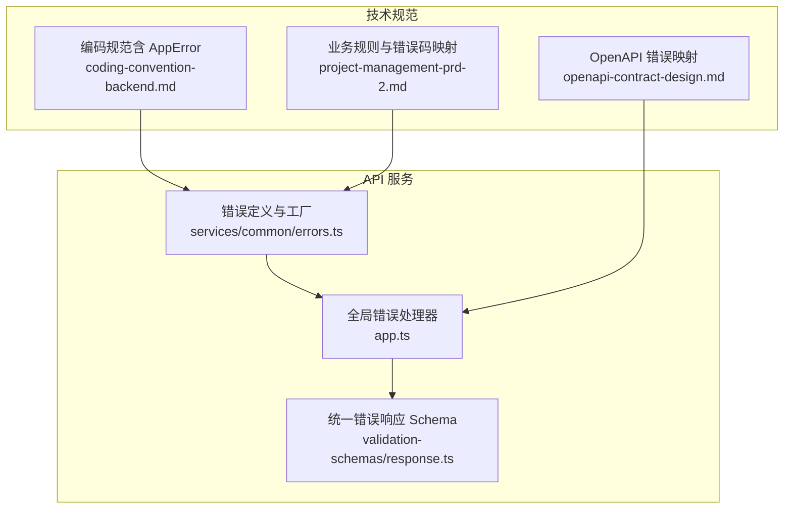
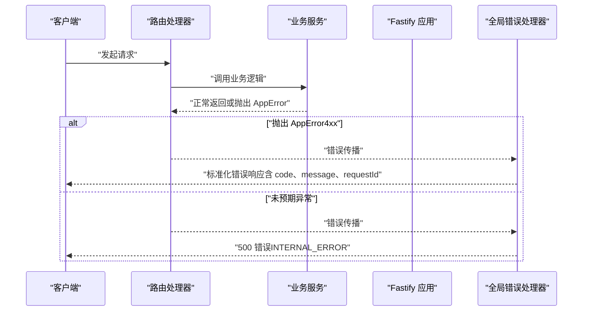
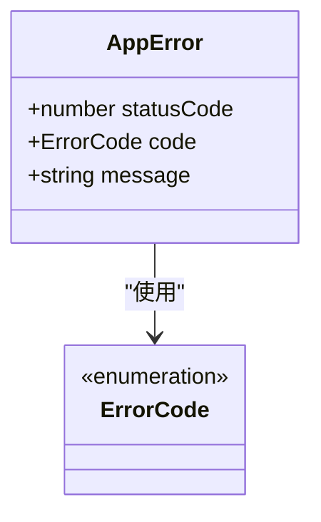
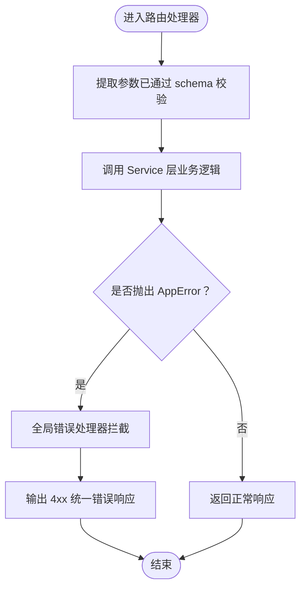
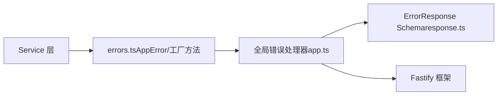

# 错误处理规范

<cite>
**本文引用的文件**
- [packages/api/src/services/common/errors.ts](file://packages/api/src/services/common/errors.ts)
- [packages/api/src/app.ts](file://packages/api/src/app.ts)
- [packages/validation-schemas/src/response.ts](file://packages/validation-schemas/src/response.ts)
- [docs/04-tech-design/coding-convention-backend.md](file://docs/04-tech-design/coding-convention-backend.md)
- [docs/04-tech-design/openapi-contract-design.md](file://docs/04-tech-design/openapi-contract-design.md)
- [docs/03-prd-ux/modules/project-management/project-management-prd-2.md](file://docs/03-prd-ux/modules/project-management/project-management-prd-2.md)
</cite>

## 目录
1. [引言](#引言)
2. [项目结构](#项目结构)
3. [核心组件](#核心组件)
4. [架构总览](#架构总览)
5. [详细组件分析](#详细组件分析)
6. [依赖分析](#依赖分析)
7. [性能考虑](#性能考虑)
8. [故障排查指南](#故障排查指南)
9. [结论](#结论)
10. [附录](#附录)

## 引言
本规范面向AI原型管理系统（APM）后端，系统性阐述错误处理设计与实现，重点包括：
- AppError 类体系的设计理念与使用方法
- 错误码枚举（VALIDATION_FAILED、NOT_FOUND、CONFLICT、UNPROCESSABLE_ENTITY、INTERNAL_ERROR 等）及其语义
- HTTP 状态码与错误码的映射关系
- 错误消息规范与统一错误响应结构
- 便捷工厂方法（badRequest、notFound、conflict、unprocessableEntity）的使用场景与最佳实践
- Service 层抛出业务异常、Route 层捕获与处理的流程
- B-rule 标注与业务规则在错误处理中的对应关系

## 项目结构
错误处理相关代码主要分布在以下位置：
- 统一错误定义与工厂方法：packages/api/src/services/common/errors.ts
- 全局错误处理器：packages/api/src/app.ts
- 统一错误响应 Schema：packages/validation-schemas/src/response.ts
- 技术规范与约定：docs/04-tech-design/coding-convention-backend.md
- OpenAPI 错误映射与契约：docs/04-tech-design/openapi-contract-design.md
- 业务规则与错误码映射：docs/03-prd-ux/modules/project-management/project-management-prd-2.md

图表来源
- [packages/api/src/services/common/errors.ts:1-58](file://packages/api/src/services/common/errors.ts#L1-L58)
- [packages/api/src/app.ts:74-99](file://packages/api/src/app.ts#L74-L99)
- [packages/validation-schemas/src/response.ts:109-136](file://packages/validation-schemas/src/response.ts#L109-L136)
- [docs/04-tech-design/coding-convention-backend.md:203-271](file://docs/04-tech-design/coding-convention-backend.md#L203-L271)
- [docs/04-tech-design/openapi-contract-design.md:222-241](file://docs/04-tech-design/openapi-contract-design.md#L222-L241)
- [docs/03-prd-ux/modules/project-management/project-management-prd-2.md:1140-1456](file://docs/03-prd-ux/modules/project-management/project-management-prd-2.md#L1140-L1456)

章节来源
- [packages/api/src/services/common/errors.ts:1-58](file://packages/api/src/services/common/errors.ts#L1-L58)
- [packages/api/src/app.ts:74-99](file://packages/api/src/app.ts#L74-L99)
- [packages/validation-schemas/src/response.ts:109-136](file://packages/validation-schemas/src/response.ts#L109-L136)
- [docs/04-tech-design/coding-convention-backend.md:203-271](file://docs/04-tech-design/coding-convention-backend.md#L203-L271)
- [docs/04-tech-design/openapi-contract-design.md:222-241](file://docs/04-tech-design/openapi-contract-design.md#L222-L241)
- [docs/03-prd-ux/modules/project-management/project-management-prd-2.md:1140-1456](file://docs/03-prd-ux/modules/project-management/project-management-prd-2.md#L1140-L1456)

## 核心组件
- 统一错误码枚举（ERROR_CODES）：覆盖验证失败、资源不存在、冲突、版本冲突、项目归档、无效名称格式/长度、必填显示名、无效枚举、实体被占用、不可处理实体、内部错误等。
- AppError 类：继承自原生 Error，携带 statusCode 与 code，便于全局拦截与标准化输出。
- 便捷工厂方法：
  - badRequest(code, message)：构造 400 错误
  - notFound(resource, id?)：构造 404 错误，自动拼接资源名与 ID
  - conflict(code, message)：构造 409 错误
  - unprocessableEntity(message)：构造 422 错误

章节来源
- [packages/api/src/services/common/errors.ts:7-22](file://packages/api/src/services/common/errors.ts#L7-L22)
- [packages/api/src/services/common/errors.ts:32-41](file://packages/api/src/services/common/errors.ts#L32-L41)
- [packages/api/src/services/common/errors.ts:44-57](file://packages/api/src/services/common/errors.ts#L44-L57)
- [docs/04-tech-design/coding-convention-backend.md:211-233](file://docs/04-tech-design/coding-convention-backend.md#L211-L233)
- [docs/04-tech-design/coding-convention-backend.md:241-270](file://docs/04-tech-design/coding-convention-backend.md#L241-L270)

## 架构总览
全局错误处理采用 Fastify 的 setErrorHandler，对不同类型的错误进行差异化处理：
- 已知业务错误（4xx）：保留原始 statusCode 与 code，输出统一错误响应结构
- 未预期异常：记录日志并返回 500 与 INTERNAL_ERROR

图表来源
- [packages/api/src/app.ts:74-99](file://packages/api/src/app.ts#L74-L99)
- [packages/api/src/services/common/errors.ts:32-41](file://packages/api/src/services/common/errors.ts#L32-L41)

章节来源
- [packages/api/src/app.ts:74-99](file://packages/api/src/app.ts#L74-L99)

## 详细组件分析

### AppError 类体系与错误码枚举
- 设计目标：统一错误表示，便于前端识别与处理；与 HTTP 状态码保持一致映射；支持业务规则与错误码一一对应。
- 关键属性：
  - statusCode：HTTP 状态码
  - code：业务错误码（来自 ERROR_CODES）
  - message：人类可读的错误描述
- 错误码覆盖范围：
  - 400：VALIDATION_FAILED、INVALID_NAME_FORMAT、INVALID_NAME_LENGTH、DISPLAY_NAME_REQUIRED、PROJECT_ARCHIVED 等
  - 404：NOT_FOUND
  - 409：CONFLICT、NAME_CONFLICT、VERSION_CONFLICT、ENTITY_IN_USE 等
  - 422：UNPROCESSABLE_ENTITY
  - 500：INTERNAL_ERROR

图表来源
- [packages/api/src/services/common/errors.ts:32-41](file://packages/api/src/services/common/errors.ts#L32-L41)
- [packages/api/src/services/common/errors.ts:24](file://packages/api/src/services/common/errors.ts#L24)

章节来源
- [packages/api/src/services/common/errors.ts:7-22](file://packages/api/src/services/common/errors.ts#L7-L22)
- [packages/api/src/services/common/errors.ts:32-41](file://packages/api/src/services/common/errors.ts#L32-L41)

### HTTP 状态码与错误码映射
- 400 VALIDATION_FAILED：由 Fastify 原生 schema 校验触发
- 404 NOT_FOUND：由 Service 层抛出 notFound(...) 触发
- 409 CONFLICT：由 Service 层业务校验触发（如唯一约束冲突、状态转换非法）
- 500 INTERNAL_ERROR：由全局 setErrorHandler 捕获未预期异常时返回

章节来源
- [docs/04-tech-design/openapi-contract-design.md:222-241](file://docs/04-tech-design/openapi-contract-design.md#L222-L241)

### 统一错误响应结构
- 结构字段：
  - error.code：业务错误码
  - error.message：错误描述
  - error.requestId：请求追踪 ID
  - error.details：仅 400 VALIDATION_FAILED 时存在，包含字段级错误明细
- Schema 定义与全局错误处理器输出严格对齐，确保前后端一致性。

章节来源
- [packages/validation-schemas/src/response.ts:109-136](file://packages/validation-schemas/src/response.ts#L109-L136)
- [packages/api/src/app.ts:74-99](file://packages/api/src/app.ts#L74-L99)

### 便捷工厂方法使用场景
- badRequest(code, message)：适用于输入参数不符合业务规则或格式要求的场景
- notFound(resource, id?)：适用于查询资源不存在的场景，自动拼接资源名与 ID
- conflict(code, message)：适用于并发冲突、唯一约束冲突、状态转换非法等场景
- unprocessableEntity(message)：适用于业务规则校验失败但不属于 400 参数校验的场景

章节来源
- [packages/api/src/services/common/errors.ts:44-57](file://packages/api/src/services/common/errors.ts#L44-L57)
- [docs/04-tech-design/coding-convention-backend.md:256-270](file://docs/04-tech-design/coding-convention-backend.md#L256-L270)

### Service 层抛出业务异常的最佳实践
- 在 Service 层根据业务规则判断失败条件，选择合适的工厂方法抛出 AppError
- 使用 notFound(...) 时传入资源名与可选 ID，便于前端与日志定位
- 使用 conflict(...) 时明确冲突类型（如 NAME_CONFLICT、VERSION_CONFLICT）
- 对于业务规则校验失败但非参数校验的场景，使用 unprocessableEntity(...)

章节来源
- [packages/api/src/services/common/errors.ts:44-57](file://packages/api/src/services/common/errors.ts#L44-L57)

### Route 层捕获与处理流程
- Route 层只负责参数提取、调用 Service 层与组装响应，不直接处理错误
- 全局 setErrorHandler 拦截 AppError 并输出统一错误响应
- 未预期异常会被转换为 500 与 INTERNAL_ERROR，避免堆栈泄露

图表来源
- [packages/api/src/app.ts:74-99](file://packages/api/src/app.ts#L74-L99)

章节来源
- [packages/api/src/app.ts:74-99](file://packages/api/src/app.ts#L74-L99)

### B-rule 标注与错误处理的对应关系
- B-rule（业务规则）在 PRD 中明确列出违规后果（如 400/409/422），并与 ERROR_CODES 中的具体错误码一一对应
- Service 层在实现业务规则时，应依据 B-rule 选择对应的错误码与工厂方法，保证错误语义清晰、可追溯
- 例如：
  - 名称格式非法 → 400 + INVALID_NAME_FORMAT
  - 同实体内名称冲突 → 409 + NAME_CONFLICT
  - 项目归档导致写操作受限 → 400 + PROJECT_ARCHIVED
  - 乐观锁冲突 → 409 + VERSION_CONFLICT

章节来源
- [docs/03-prd-ux/modules/project-management/project-management-prd-2.md:1140-1456](file://docs/03-prd-ux/modules/project-management/project-management-prd-2.md#L1140-L1456)
- [packages/api/src/services/common/errors.ts:8-22](file://packages/api/src/services/common/errors.ts#L8-L22)

## 依赖分析
- 组件耦合关系：
  - Service 层依赖 errors.ts 中的 AppError 与工厂方法
  - 全局错误处理器依赖 Fastify 的 setErrorHandler，输出与 response.ts 中的 ErrorResponse Schema 对齐
- 外部依赖与集成点：
  - Fastify：错误拦截、日志、路由注册
  - TypeBox：OpenAPI Schema 定义与响应结构校验

图表来源
- [packages/api/src/services/common/errors.ts:32-57](file://packages/api/src/services/common/errors.ts#L32-L57)
- [packages/api/src/app.ts:74-99](file://packages/api/src/app.ts#L74-L99)
- [packages/validation-schemas/src/response.ts:109-136](file://packages/validation-schemas/src/response.ts#L109-L136)

章节来源
- [packages/api/src/services/common/errors.ts:32-57](file://packages/api/src/services/common/errors.ts#L32-L57)
- [packages/api/src/app.ts:74-99](file://packages/api/src/app.ts#L74-L99)
- [packages/validation-schemas/src/response.ts:109-136](file://packages/validation-schemas/src/response.ts#L109-L136)

## 性能考虑
- 错误处理不应引入额外的 I/O 或阻塞操作，确保错误路径与正常路径性能相当
- 全局错误处理器仅进行必要的字段拼装与日志记录，避免复杂计算
- 对于高频错误（如参数校验失败），建议在 Route 层通过 schema 校验提前拦截，减少 Service 层开销

## 故障排查指南
- 400 参数校验失败：确认请求体/查询参数符合 OpenAPI Schema；若需字段级错误明细，请使用 VALIDATION_FAILED 并提供 details
- 404 资源不存在：检查资源 ID 是否正确；使用 notFound(...) 时确保 resource 与 id 参数准确
- 409 冲突：区分 NAME_CONFLICT、VERSION_CONFLICT、ENTITY_IN_USE 等具体场景，明确并发控制策略
- 422 业务规则校验失败：使用 unprocessableEntity(...)，并在 message 中清晰描述规则约束
- 500 未预期异常：查看全局错误处理器日志，确认是否为未捕获异常；避免向客户端暴露堆栈信息

章节来源
- [packages/api/src/app.ts:74-99](file://packages/api/src/app.ts#L74-L99)
- [packages/validation-schemas/src/response.ts:109-136](file://packages/validation-schemas/src/response.ts#L109-L136)

## 结论
本规范通过统一的 AppError 类体系、严谨的错误码枚举与工厂方法、以及与 Fastify 全局错误处理器的深度集成，实现了前后端一致、语义清晰、可追溯的错误处理机制。结合 B-rule 标注，能够将业务规则与错误处理紧密关联，提升系统的可维护性与用户体验。

## 附录
- 错误码清单与典型触发场景可参考：
  - [错误码定义与工厂方法:7-57](file://packages/api/src/services/common/errors.ts#L7-L57)
  - [OpenAPI 错误映射表:222-241](file://docs/04-tech-design/openapi-contract-design.md#L222-L241)
  - [业务规则与错误码映射:1140-1456](file://docs/03-prd-ux/modules/project-management/project-management-prd-2.md#L1140-L1456)