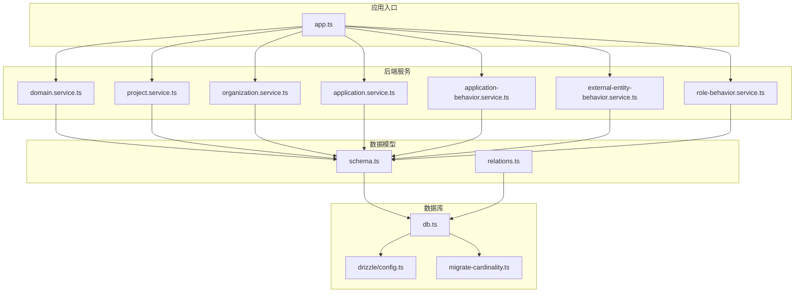
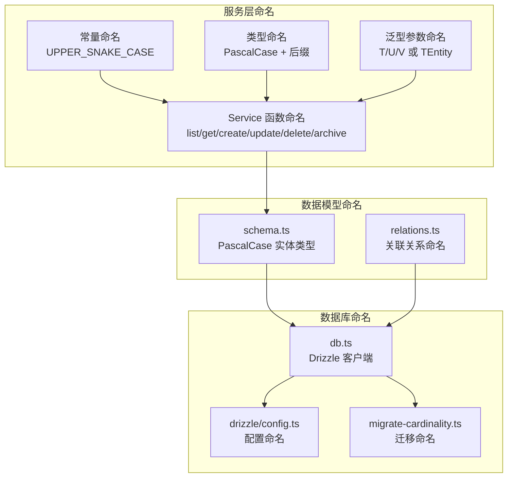
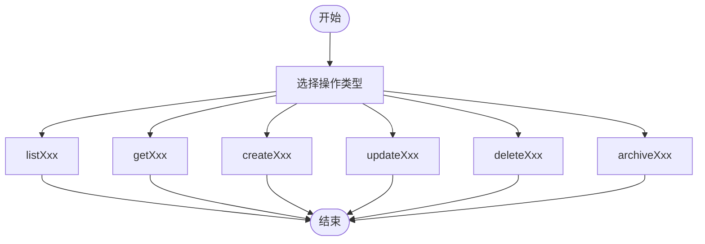
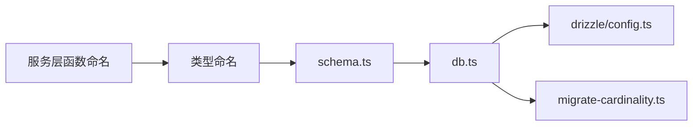

# 命名约定

<cite>
**本文引用的文件**
- [packages/api/src/services/domain.service.ts](file://packages/api/src/services/domain.service.ts)
- [packages/api/src/services/project.service.ts](file://packages/api/src/services/project.service.ts)
- [packages/api/src/services/organization.service.ts](file://packages/api/src/services/organization.service.ts)
- [packages/api/src/services/application.service.ts](file://packages/api/src/services/application.service.ts)
- [packages/api/src/services/application-behavior.service.ts](file://packages/api/src/services/application-behavior.service.ts)
- [packages/api/src/services/external-entity-behavior.service.ts](file://packages/api/src/services/external-entity-behavior.service.ts)
- [packages/api/src/services/role-behavior.service.ts](file://packages/api/src/services/role-behavior.service.ts)
- [packages/api/src/models/schema.ts](file://packages/api/src/models/schema.ts)
- [packages/api/src/models/relations.ts](file://packages/api/src/models/relations.ts)
- [packages/api/src/db.ts](file://packages/api/src/db.ts)
- [packages/api/drizzle/config.ts](file://packages/api/drizzle/config.ts)
- [packages/api/src/app.ts](file://packages/api/src/app.ts)
- [packages/api/src/db/migrate-cardinality.ts](file://packages/api/src/db/migrate-cardinality.ts)
- [docs/04-tech-design/coding-convention-backend.md](file://docs/04-tech-design/coding-convention-backend.md)
</cite>

## 目录
1. [引言](#引言)
2. [项目结构](#项目结构)
3. [核心组件](#核心-component-analysis)
4. [架构总览](#架构总览)
5. [详细组件分析](#详细组件分析)
6. [依赖关系分析](#依赖关系分析)
7. [性能考虑](#性能考虑)
8. [故障排除指南](#故障排除指南)
9. [结论](#结论)
10. [附录](#附录)

## 引言
本文件为 AI 原型管理系统制定统一的 TypeScript 命名约定，覆盖文件命名、函数与变量命名、常量命名、类型命名、泛型参数命名以及 Drizzle 类型推导的命名规范，并提供 Service 函数命名模式矩阵与最佳实践示例，帮助团队在大型项目中保持一致性与可读性。

## 项目结构
本项目采用多包工作区结构，前端与后端分离，后端服务位于 packages/api 下，包含服务层、数据模型、数据库配置与迁移脚本等模块。命名约定将围绕这些模块展开，确保前后端一致的命名风格。

**图表来源**
- [packages/api/src/services/domain.service.ts](file://packages/api/src/services/domain.service.ts)
- [packages/api/src/services/project.service.ts](file://packages/api/src/services/project.service.ts)
- [packages/api/src/services/organization.service.ts](file://packages/api/src/services/organization.service.ts)
- [packages/api/src/services/application.service.ts](file://packages/api/src/services/application.service.ts)
- [packages/api/src/services/application-behavior.service.ts](file://packages/api/src/services/application-behavior.service.ts)
- [packages/api/src/services/external-entity-behavior.service.ts](file://packages/api/src/services/external-entity-behavior.service.ts)
- [packages/api/src/services/role-behavior.service.ts](file://packages/api/src/services/role-behavior.service.ts)
- [packages/api/src/models/schema.ts](file://packages/api/src/models/schema.ts)
- [packages/api/src/models/relations.ts](file://packages/api/src/models/relations.ts)
- [packages/api/src/db.ts](file://packages/api/src/db.ts)
- [packages/api/drizzle/config.ts](file://packages/api/drizzle/config.ts)
- [packages/api/src/db/migrate-cardinality.ts](file://packages/api/src/db/migrate-cardinality.ts)
- [packages/api/src/app.ts](file://packages/api/src/app.ts)

**章节来源**
- [packages/api/src/app.ts](file://packages/api/src/app.ts)
- [packages/api/src/db.ts](file://packages/api/src/db.ts)
- [packages/api/drizzle/config.ts](file://packages/api/drizzle/config.ts)

## 核心组件
- 文件命名：采用 kebab-case，如 domain.service.ts、project.service.ts、organization.service.ts 等，确保与目录结构和模块导入保持一致。
- 函数命名：采用 camelCase，前缀遵循业务语义，如 listXxx、getXxx、createXxx、updateXxx、deleteXxx、archiveXxx 等，便于快速识别操作意图。
- 变量命名：采用描述性命名，避免缩写，必要时使用领域内通用缩写以提升可读性。
- 常量命名：采用 UPPER_SNAKE_CASE，用于全局或模块级常量定义。
- 类型命名：采用 PascalCase，并带有描述性后缀，如 Entity、ListResponse、CreatePayload、UpdatePayload 等。
- 泛型参数命名：采用单字母大写，如 T、U、V；当需要表达含义时，使用简短描述，如 TResult、TEntity。
- Drizzle 类型推导：遵循 schema.ts 中的表名与列名，生成的类型使用 PascalCase 表示实体类型，小写表名复数形式表示列表类型，保持与数据库结构一致。

**章节来源**
- [packages/api/src/services/domain.service.ts](file://packages/api/src/services/domain.service.ts)
- [packages/api/src/services/project.service.ts](file://packages/api/src/services/project.service.ts)
- [packages/api/src/services/organization.service.ts](file://packages/api/src/services/organization.service.ts)
- [packages/api/src/models/schema.ts](file://packages/api/src/models/schema.ts)

## 架构总览
命名约定贯穿于服务层、数据模型与数据库配置之间，形成清晰的分层命名体系。服务层负责业务操作，数据模型负责结构定义，数据库层负责类型推导与迁移。

**图表来源**
- [packages/api/src/services/domain.service.ts](file://packages/api/src/services/domain.service.ts)
- [packages/api/src/models/schema.ts](file://packages/api/src/models/schema.ts)
- [packages/api/src/models/relations.ts](file://packages/api/src/models/relations.ts)
- [packages/api/src/db.ts](file://packages/api/src/db.ts)
- [packages/api/drizzle/config.ts](file://packages/api/drizzle/config.ts)
- [packages/api/src/db/migrate-cardinality.ts](file://packages/api/src/db/migrate-cardinality.ts)

## 详细组件分析

### Service 函数命名模式矩阵
以下矩阵总结了常见 CRUD 操作与归档操作的函数命名规则，适用于所有服务文件（如 domain.service.ts、project.service.ts、organization.service.ts 等）：

- 列表查询：listXxx（如 listProjects）
- 单条查询：getXxx（如 getProjectById）
- 创建：createXxx（如 createProject）
- 更新：updateXxx（如 updateProject）
- 删除：deleteXxx（如 deleteProject）
- 归档：archiveXxx（如 archiveProject）

命名建议：
- 使用动词原形作为前缀，确保语义明确。
- Xxx 部分使用目标资源的单数形式（PascalCase），避免复数导致的歧义。
- 对于带条件的查询，可在函数名中体现关键过滤字段，如 listProjectsByStatus。

**图表来源**
- [packages/api/src/services/domain.service.ts](file://packages/api/src/services/domain.service.ts)
- [packages/api/src/services/project.service.ts](file://packages/api/src/services/project.service.ts)
- [packages/api/src/services/organization.service.ts](file://packages/api/src/services/organization.service.ts)

**章节来源**
- [packages/api/src/services/domain.service.ts](file://packages/api/src/services/domain.service.ts)
- [packages/api/src/services/project.service.ts](file://packages/api/src/services/project.service.ts)
- [packages/api/src/services/organization.service.ts](file://packages/api/src/services/organization.service.ts)

### 类型命名规范
- 实体类型：PascalCase + Entity，如 ProjectEntity、DomainEntity。
- 列表类型：PascalCase + List，如 ProjectList、DomainList。
- 请求载荷：PascalCase + Payload，如 CreateProjectPayload、UpdateProjectPayload。
- 响应类型：PascalCase + Response，如 ListProjectResponse、GetProjectResponse。
- 分页类型：PascalCase + Page，如 ProjectPage。
- 错误类型：PascalCase + Error，如 ValidationError、NotFoundError。

命名原则：
- 保持与数据库实体和 API 契约一致。
- 使用领域内通用术语，避免模糊缩写。

**章节来源**
- [packages/api/src/models/schema.ts](file://packages/api/src/models/schema.ts)
- [packages/api/src/models/relations.ts](file://packages/api/src/models/relations.ts)

### 泛型参数命名
- 单字母大写：T、U、V。
- 带含义的泛型：TEntity、TPayload、TResponse、TPage。
- 多个相关类型：TItem、TMeta、TPagination。

命名原则：
- 在复杂场景下使用带含义的泛型名称，提升可读性。
- 避免使用无意义的泛型名，如 T1、T2。

**章节来源**
- [packages/api/src/services/application.service.ts](file://packages/api/src/services/application.service.ts)
- [packages/api/src/services/application-behavior.service.ts](file://packages/api/src/services/application-behavior.service.ts)
- [packages/api/src/services/external-entity-behavior.service.ts](file://packages/api/src/services/external-entity-behavior.service.ts)
- [packages/api/src/services/role-behavior.service.ts](file://packages/api/src/services/role-behavior.service.ts)

### Drizzle 类型推导命名约定
- 实体类型：基于 schema.ts 中的表名，使用 PascalCase，如 Project、Domain。
- 列类型：基于 schema.ts 中的列定义，使用对应的 TypeScript 类型别名。
- 关联类型：基于 relations.ts 的关系映射，使用实体类型组合，如 ProjectWithDomain。
- 查询结果类型：根据查询方法返回值，使用实体类型或联合类型，如 Project | null 或 Project[]。
- 迁移与配置：迁移文件使用 migrateCardinality.ts 风格命名，配置文件使用 config.ts，保持与 drizzle 目录结构一致。

命名原则：
- 与 schema.ts 保持强一致，确保类型安全。
- 使用复数形式表示集合，单数表示单个实体。

**章节来源**
- [packages/api/src/models/schema.ts](file://packages/api/src/models/schema.ts)
- [packages/api/src/models/relations.ts](file://packages/api/src/models/relations.ts)
- [packages/api/src/db.ts](file://packages/api/src/db.ts)
- [packages/api/drizzle/config.ts](file://packages/api/drizzle/config.ts)
- [packages/api/src/db/migrate-cardinality.ts](file://packages/api/src/db/migrate-cardinality.ts)

### 文件命名与模块组织
- 服务文件：kebab-case + .service.ts，如 domain.service.ts、project.service.ts。
- 数据模型文件：schema.ts、relations.ts，保持与 Drizzle 结构一致。
- 数据库配置：drizzle/config.ts，迁移文件：migrate-cardinality.ts。
- 应用入口：app.ts，集中注册路由与中间件。

命名原则：
- 文件名与模块导出保持一致，便于 IDE 自动补全与导入。
- 目录结构清晰，按功能域划分服务与模型。

**章节来源**
- [packages/api/src/services/domain.service.ts](file://packages/api/src/services/domain.service.ts)
- [packages/api/src/services/project.service.ts](file://packages/api/src/services/project.service.ts)
- [packages/api/src/services/organization.service.ts](file://packages/api/src/services/organization.service.ts)
- [packages/api/src/models/schema.ts](file://packages/api/src/models/schema.ts)
- [packages/api/src/models/relations.ts](file://packages/api/src/models/relations.ts)
- [packages/api/drizzle/config.ts](file://packages/api/drizzle/config.ts)
- [packages/api/src/db/migrate-cardinality.ts](file://packages/api/src/db/migrate-cardinality.ts)
- [packages/api/src/app.ts](file://packages/api/src/app.ts)

## 依赖关系分析
命名约定在各层之间形成依赖链，服务层函数命名依赖于数据模型类型，数据模型类型依赖于 schema.ts 的定义，数据库层依赖于 Drizzle 配置与迁移。

**图表来源**
- [packages/api/src/services/domain.service.ts](file://packages/api/src/services/domain.service.ts)
- [packages/api/src/models/schema.ts](file://packages/api/src/models/schema.ts)
- [packages/api/src/db.ts](file://packages/api/src/db.ts)
- [packages/api/drizzle/config.ts](file://packages/api/drizzle/config.ts)
- [packages/api/src/db/migrate-cardinality.ts](file://packages/api/src/db/migrate-cardinality.ts)

**章节来源**
- [packages/api/src/services/domain.service.ts](file://packages/api/src/services/domain.service.ts)
- [packages/api/src/models/schema.ts](file://packages/api/src/models/schema.ts)
- [packages/api/src/db.ts](file://packages/api/src/db.ts)
- [packages/api/drizzle/config.ts](file://packages/api/drizzle/config.ts)
- [packages/api/src/db/migrate-cardinality.ts](file://packages/api/src/db/migrate-cardinality.ts)

## 性能考虑
- 命名一致性有助于 IDE 快速索引与重构，减少拼写错误带来的调试成本。
- 清晰的类型命名与泛型参数命名可降低运行时类型检查开销，提升编译速度。
- 与 Drizzle 类型推导保持一致，可减少手写类型的工作量，避免类型不匹配导致的运行时问题。

## 故障排除指南
- 常量未使用 UPPER_SNAKE_CASE：检查是否混用了 camelCase 或 snake_case，统一改为 UPPER_SNAKE_CASE。
- 类型命名不符合 PascalCase + 后缀：核对实体、列表、请求/响应、分页与错误类型的后缀是否正确。
- 泛型参数命名不规范：检查是否使用了无意义的泛型名，替换为 TEntity、TPayload 等具象名称。
- Drizzle 类型不一致：核对 schema.ts 与 relations.ts 的定义，确保与 db.ts 推导的类型保持一致。
- 服务函数命名不统一：对照 Service 函数命名模式矩阵，修正前缀与资源名大小写。

## 结论
通过建立统一的命名约定，团队可以在大型项目中显著提升代码一致性与可读性。建议在代码审查中重点检查命名规范的执行情况，并在新成员入职时提供命名约定培训与示例参考。

## 附录
- Service 函数命名模式矩阵（示例）
  - 列表查询：listProjects、listDomains
  - 单条查询：getProjectById、getDomainByName
  - 创建：createProject、createDomain
  - 更新：updateProject、updateDomain
  - 删除：deleteProject、deleteDomain
  - 归档：archiveProject、archiveDomain

- 类型命名示例
  - 实体类型：ProjectEntity、DomainEntity
  - 列表类型：ProjectList、DomainList
  - 请求载荷：CreateProjectPayload、UpdateProjectPayload
  - 响应类型：ListProjectResponse、GetProjectResponse
  - 分页类型：ProjectPage
  - 错误类型：ValidationError、NotFoundError

- 泛型参数示例
  - 单字母：T、U、V
  - 具象：TEntity、TPayload、TResponse、TPage

- Drizzle 类型推导示例
  - 实体类型：Project、Domain
  - 列表类型：Project[]、Domain[]
  - 关联类型：ProjectWithDomain
  - 查询结果：Project | null、Project[]