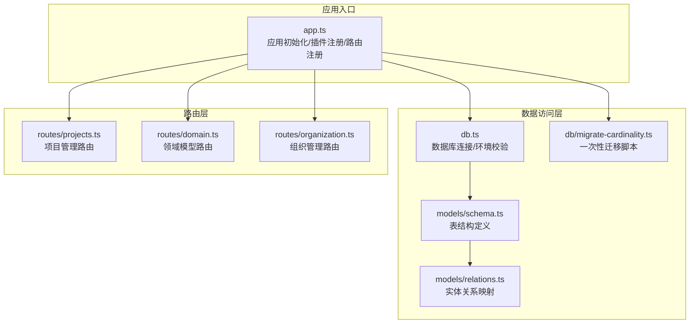
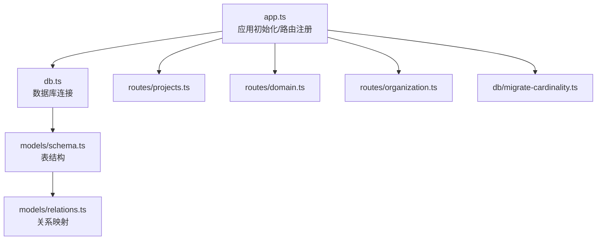
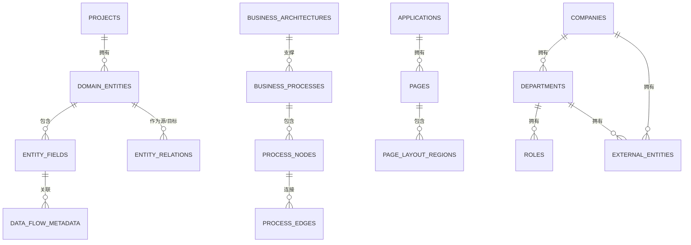
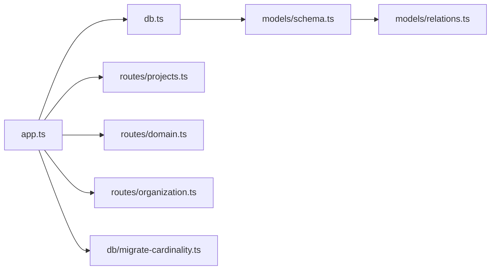

# 注释规范

<cite>
**本文引用的文件**
- [packages/api/src/app.ts](file://packages/api/src/app.ts)
- [packages/api/src/db.ts](file://packages/api/src/db.ts)
- [packages/api/src/models/schema.ts](file://packages/api/src/models/schema.ts)
- [packages/api/src/models/relations.ts](file://packages/api/src/models/relations.ts)
- [packages/api/src/db/migrate-cardinality.ts](file://packages/api/src/db/migrate-cardinality.ts)
- [packages/api/src/routes/projects.ts](file://packages/api/src/routes/projects.ts)
- [packages/api/src/routes/domain.ts](file://packages/api/src/routes/domain.ts)
- [packages/api/src/routes/organization.ts](file://packages/api/src/routes/organization.ts)
</cite>

## 目录
1. [引言](#引言)
2. [项目结构](#项目结构)
3. [核心组件](#核心组件)
4. [架构总览](#架构总览)
5. [详细组件分析](#详细组件分析)
6. [依赖分析](#依赖分析)
7. [性能考虑](#性能考虑)
8. [故障排查指南](#故障排查指南)
9. [结论](#结论)
10. [附录](#附录)

## 引言
本规范面向“AI原型管理系统”的代码注释，基于R1-R5强制注释规则，建立统一的注释标准与实践方法。注释不仅是代码的说明书，更是业务规则、技术决策与复杂逻辑的载体，直接影响代码审查效率、知识传承与长期维护成本。本规范明确以下目标：
- 统一注释格式与层级，覆盖模块、类、函数、字段、关系、迁移脚本等
- 规范业务规则标注（// B-Mx-NN:）与技术决策注释（R5 Why:）
- 明确注释的时机、内容要求与维护责任
- 提供注释模板与示例，便于团队协作与质量评估

## 项目结构
本项目采用分层架构与模块化路由组织，核心后端位于 packages/api，包含应用入口、数据库连接、ORM模型与关系定义、迁移脚本以及各功能模块的路由与服务层。

**图表来源**
- [packages/api/src/app.ts:1-182](file://packages/api/src/app.ts#L1-L182)
- [packages/api/src/db.ts:1-25](file://packages/api/src/db.ts#L1-L25)
- [packages/api/src/models/schema.ts:1-535](file://packages/api/src/models/schema.ts#L1-L535)
- [packages/api/src/models/relations.ts:1-283](file://packages/api/src/models/relations.ts#L1-L283)
- [packages/api/src/db/migrate-cardinality.ts:1-50](file://packages/api/src/db/migrate-cardinality.ts#L1-L50)
- [packages/api/src/routes/projects.ts:1-195](file://packages/api/src/routes/projects.ts#L1-L195)
- [packages/api/src/routes/domain.ts:1-499](file://packages/api/src/routes/domain.ts#L1-L499)
- [packages/api/src/routes/organization.ts:1-420](file://packages/api/src/routes/organization.ts#L1-L420)

**章节来源**
- [packages/api/src/app.ts:1-182](file://packages/api/src/app.ts#L1-L182)
- [packages/api/src/db.ts:1-25](file://packages/api/src/db.ts#L1-L25)
- [packages/api/src/models/schema.ts:1-535](file://packages/api/src/models/schema.ts#L1-L535)
- [packages/api/src/models/relations.ts:1-283](file://packages/api/src/models/relations.ts#L1-L283)
- [packages/api/src/db/migrate-cardinality.ts:1-50](file://packages/api/src/db/migrate-cardinality.ts#L1-L50)
- [packages/api/src/routes/projects.ts:1-195](file://packages/api/src/routes/projects.ts#L1-L195)
- [packages/api/src/routes/domain.ts:1-499](file://packages/api/src/routes/domain.ts#L1-L499)
- [packages/api/src/routes/organization.ts:1-420](file://packages/api/src/routes/organization.ts#L1-L420)

## 核心组件
- 应用入口与路由注册：集中初始化 Fastify、CORS、OpenAPI/Swagger、错误处理、请求日志与健康检查，并按模块注册路由（项目、领域、组织等）。
- 数据层：数据库连接与环境变量校验；ORM表结构定义；实体关系映射；一次性迁移脚本。
- 路由层：各模块路由定义，包含请求/响应 Schema、OpenAPI 标签与描述、业务规则标注（B-Mx-NN）。

注释重点：
- R5 Why: 技术决策与约束原因，解释为何采用某种设计（如外键策略、JSONB 存储、枚举校验等）
- 业务规则标注：与产品需求（F-Mx）和业务规则（B-Mx）一一对应，便于追溯与审计

**章节来源**
- [packages/api/src/app.ts:1-182](file://packages/api/src/app.ts#L1-L182)
- [packages/api/src/db.ts:1-25](file://packages/api/src/db.ts#L1-L25)
- [packages/api/src/models/schema.ts:1-535](file://packages/api/src/models/schema.ts#L1-L535)
- [packages/api/src/models/relations.ts:1-283](file://packages/api/src/models/relations.ts#L1-L283)
- [packages/api/src/db/migrate-cardinality.ts:1-50](file://packages/api/src/db/migrate-cardinality.ts#L1-L50)
- [packages/api/src/routes/projects.ts:1-195](file://packages/api/src/routes/projects.ts#L1-L195)
- [packages/api/src/routes/domain.ts:1-499](file://packages/api/src/routes/domain.ts#L1-L499)
- [packages/api/src/routes/organization.ts:1-420](file://packages/api/src/routes/organization.ts#L1-L420)

## 架构总览
下图展示应用入口如何串联数据层与路由层，体现模块间职责与依赖关系。

**图表来源**
- [packages/api/src/app.ts:1-182](file://packages/api/src/app.ts#L1-L182)
- [packages/api/src/db.ts:1-25](file://packages/api/src/db.ts#L1-L25)
- [packages/api/src/models/schema.ts:1-535](file://packages/api/src/models/schema.ts#L1-L535)
- [packages/api/src/models/relations.ts:1-283](file://packages/api/src/models/relations.ts#L1-L283)
- [packages/api/src/db/migrate-cardinality.ts:1-50](file://packages/api/src/db/migrate-cardinality.ts#L1-L50)
- [packages/api/src/routes/projects.ts:1-195](file://packages/api/src/routes/projects.ts#L1-L195)
- [packages/api/src/routes/domain.ts:1-499](file://packages/api/src/routes/domain.ts#L1-L499)
- [packages/api/src/routes/organization.ts:1-420](file://packages/api/src/routes/organization.ts#L1-L420)

## 详细组件分析

### 应用入口与路由注册（app.ts）
- 初始化 Fastify 并配置日志级别
- 注册 CORS、Swagger/OpenAPI、Scalar 文档端点
- 全局错误处理：区分业务错误与未预期异常，统一响应结构
- 请求日志钩子：记录请求耗时
- 健康检查端点：验证数据库连通性
- 模块路由注册：按模块逐步扩展（M1~M6）

注释要点：
- R5 Why: 在错误处理中区分业务错误与未预期异常，避免堆栈泄露
- R5 Why: 请求日志钩子记录耗时，便于性能监控与问题定位

**章节来源**
- [packages/api/src/app.ts:1-182](file://packages/api/src/app.ts#L1-L182)

### 数据库连接与环境校验（db.ts）
- 环境变量 DATABASE_URL 校验，缺失时报错引导激活环境
- drizzle 连接导出，用于 ORM 查询
- 迁移专用连接（prepare=false），避免预编译缓存干扰

注释要点：
- R5 Why: 迁移连接禁用预编译，确保迁移脚本稳定执行

**章节来源**
- [packages/api/src/db.ts:1-25](file://packages/api/src/db.ts#L1-L25)

### ORM 模型与关系定义（schema.ts、relations.ts）
- schema.ts：定义各表字段、索引、唯一约束与注释
- relations.ts：定义实体间关系映射，含自引用与双向关系

注释要点：
- R5 Why: 多处对字段设计、外键策略、自引用关系进行解释，说明设计权衡
- 业务规则标注：与领域模型（M2）功能一一对应，便于需求追溯

**图表来源**
- [packages/api/src/models/schema.ts:1-535](file://packages/api/src/models/schema.ts#L1-L535)
- [packages/api/src/models/relations.ts:1-283](file://packages/api/src/models/relations.ts#L1-L283)

**章节来源**
- [packages/api/src/models/schema.ts:1-535](file://packages/api/src/models/schema.ts#L1-L535)
- [packages/api/src/models/relations.ts:1-283](file://packages/api/src/models/relations.ts#L1-L283)

### 一次性迁移脚本（migrate-cardinality.ts）
- 将旧版基数格式（如 "1:N"）转换为新格式（source/target 分离）
- 输出迁移进度与剩余旧值检查
- 失败时终止并退出进程

注释要点：
- R5 Why: 说明旧/新格式映射规则与迁移策略，确保历史数据一致性

**章节来源**
- [packages/api/src/db/migrate-cardinality.ts:1-50](file://packages/api/src/db/migrate-cardinality.ts#L1-L50)

### 项目管理路由（routes/projects.ts）
- 定义项目 CRUD 与汇总统计接口，绑定 OpenAPI Schema 与业务规则标注
- 使用 TypeBox Schema 进行输入/输出校验，统一响应结构

注释要点：
- B-Mx-NN: 与项目管理（M1）功能一一对应，便于需求与实现对照
- R5 Why: 说明版本号与乐观锁（?version=N）的使用场景

**章节来源**
- [packages/api/src/routes/projects.ts:1-195](file://packages/api/src/routes/projects.ts#L1-L195)

### 领域模型路由（routes/domain.ts）
- 定义实体、字段、关系、ER 图与领域边界管理接口
- 详细描述每个端点的业务含义与约束

注释要点：
- B-Mx-NN: 与领域模型（M2）功能一一对应
- R5 Why: 对前端 JSON null 强制转换问题进行说明与处理

**章节来源**
- [packages/api/src/routes/domain.ts:1-499](file://packages/api/src/routes/domain.ts#L1-L499)

### 组织管理路由（routes/organization.ts）
- 定义公司、部门、角色、外部实体的增删改查接口
- 统一使用 Schema 校验与 OpenAPI 描述

注释要点：
- B-Mx-NN: 与组织管理（M1 子模块）功能一一对应
- R5 Why: 说明部门树形结构的自引用关系与删除策略

**章节来源**
- [packages/api/src/routes/organization.ts:1-420](file://packages/api/src/routes/organization.ts#L1-L420)

## 依赖分析
- app.ts 依赖 db.ts、各模块路由文件
- 路由层依赖 db.ts 与服务层（此处为类型导入，实际服务文件不在当前上下文）
- schema.ts 与 relations.ts 互相关联，构成数据模型与关系映射
- migrate-cardinality.ts 依赖 db.ts 的连接配置

**图表来源**
- [packages/api/src/app.ts:1-182](file://packages/api/src/app.ts#L1-L182)
- [packages/api/src/db.ts:1-25](file://packages/api/src/db.ts#L1-L25)
- [packages/api/src/models/schema.ts:1-535](file://packages/api/src/models/schema.ts#L1-L535)
- [packages/api/src/models/relations.ts:1-283](file://packages/api/src/models/relations.ts#L1-L283)
- [packages/api/src/db/migrate-cardinality.ts:1-50](file://packages/api/src/db/migrate-cardinality.ts#L1-L50)
- [packages/api/src/routes/projects.ts:1-195](file://packages/api/src/routes/projects.ts#L1-L195)
- [packages/api/src/routes/domain.ts:1-499](file://packages/api/src/routes/domain.ts#L1-L499)
- [packages/api/src/routes/organization.ts:1-420](file://packages/api/src/routes/organization.ts#L1-L420)

**章节来源**
- [packages/api/src/app.ts:1-182](file://packages/api/src/app.ts#L1-L182)
- [packages/api/src/db.ts:1-25](file://packages/api/src/db.ts#L1-L25)
- [packages/api/src/models/schema.ts:1-535](file://packages/api/src/models/schema.ts#L1-L535)
- [packages/api/src/models/relations.ts:1-283](file://packages/api/src/models/relations.ts#L1-L283)
- [packages/api/src/db/migrate-cardinality.ts:1-50](file://packages/api/src/db/migrate-cardinality.ts#L1-L50)
- [packages/api/src/routes/projects.ts:1-195](file://packages/api/src/routes/projects.ts#L1-L195)
- [packages/api/src/routes/domain.ts:1-499](file://packages/api/src/routes/domain.ts#L1-L499)
- [packages/api/src/routes/organization.ts:1-420](file://packages/api/src/routes/organization.ts#L1-L420)

## 性能考虑
- 请求日志钩子记录耗时，便于定位慢请求
- 迁移脚本禁用预编译缓存，确保稳定性
- Schema 校验在路由层完成，减少无效请求进入业务逻辑

[本节为通用建议，不直接分析具体文件]

## 故障排查指南
- 数据库连接失败：检查 DATABASE_URL 是否设置，参考 db.ts 中的环境校验提示
- 健康检查异常：查看 app.ts 中健康检查端点对数据库连通性的判断
- 迁移失败：查看 migrate-cardinality.ts 的错误处理与退出逻辑

**章节来源**
- [packages/api/src/db.ts:1-25](file://packages/api/src/db.ts#L1-L25)
- [packages/api/src/app.ts:120-131](file://packages/api/src/app.ts#L120-L131)
- [packages/api/src/db/migrate-cardinality.ts:46-49](file://packages/api/src/db/migrate-cardinality.ts#L46-L49)

## 结论
通过统一的注释规范与实践，可以显著提升代码可读性、可维护性与可审计性。R5 Why: 的技术决策注释与 B-Mx-NN: 的业务规则标注，使得代码不仅“能用”，更能“讲清楚”。建议在每次提交中同步完善注释，确保注释与代码变更同步演进。

[本节为总结性内容，不直接分析具体文件]

## 附录

### 注释模板与示例

- 模块注释（文件顶部）
  - 示例路径：[packages/api/src/routes/projects.ts:1-6](file://packages/api/src/routes/projects.ts#L1-L6)
  - 说明：包含模块用途、功能范围、OpenAPI 标签、Schema 使用说明

- 函数/处理器注释
  - 示例路径：[packages/api/src/routes/projects.ts:138-150](file://packages/api/src/routes/projects.ts#L138-L150)
  - 说明：简述处理逻辑与返回结构，必要时标注业务规则

- 类/实体注释（ORM）
  - 示例路径：[packages/api/src/models/schema.ts:88-111](file://packages/api/src/models/schema.ts#L88-L111)
  - 说明：描述实体用途、字段含义与设计原因（R5 Why:）

- 关系注释（ORM relations）
  - 示例路径：[packages/api/src/models/relations.ts:95-102](file://packages/api/src/models/relations.ts#L95-L102)
  - 说明：解释自引用关系与双向关系命名

- 迁移脚本注释
  - 示例路径：[packages/api/src/db/migrate-cardinality.ts:1-13](file://packages/api/src/db/migrate-cardinality.ts#L1-L13)
  - 说明：描述旧/新格式映射与迁移策略

- 业务规则标注（B-Mx-NN）
  - 示例路径：[packages/api/src/routes/projects.ts:42](file://packages/api/src/routes/projects.ts#L42)
  - 说明：与产品需求（F-Mx）和业务规则（B-Mx）对应，便于追溯

- 技术决策注释（R5 Why:）
  - 示例路径：[packages/api/src/models/schema.ts:29](file://packages/api/src/models/schema.ts#L29)
  - 说明：解释字段设计、外键策略、JSONB 使用等设计原因

**章节来源**
- [packages/api/src/routes/projects.ts:1-195](file://packages/api/src/routes/projects.ts#L1-L195)
- [packages/api/src/models/schema.ts:1-535](file://packages/api/src/models/schema.ts#L1-L535)
- [packages/api/src/models/relations.ts:1-283](file://packages/api/src/models/relations.ts#L1-L283)
- [packages/api/src/db/migrate-cardinality.ts:1-50](file://packages/api/src/db/migrate-cardinality.ts#L1-L50)

### 注释质量评估标准
- 完整性：是否覆盖模块、关键函数、复杂逻辑、业务规则与技术决策
- 准确性：注释是否与代码实现一致，是否随变更同步更新
- 可读性：语言简洁清晰，术语统一，避免冗余与模糊表述
- 可追溯性：业务规则标注（B-Mx-NN）与需求/设计文档对应
- 可维护性：注释是否有助于快速定位问题与理解设计权衡

[本节为通用评估标准，不直接分析具体文件]